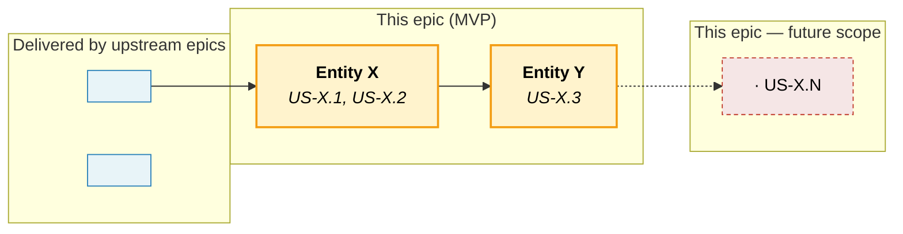
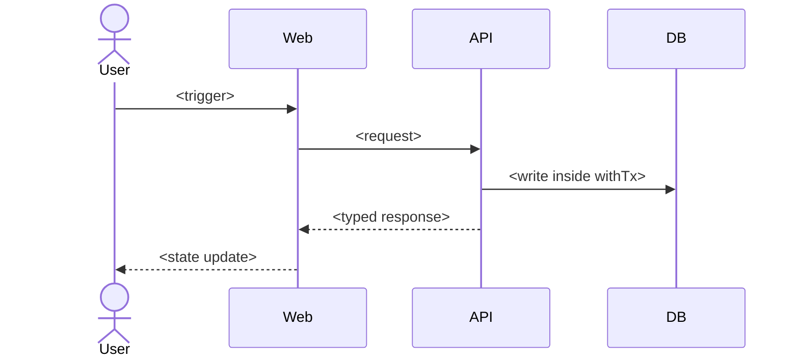

# Epic File — Full Template

> **File location**: `docs/sprints/epics/EPIC-N.md`
>
> **Use when**: User asks to create or update an epic, or when a planning tool
> (BMad / GStack / Superpowers) produces an epic-shaped artifact that needs
> standardization into the koni-docs structure.
>
> **One rule above all others**: an epic is the *contract* between the PRD's
> functional requirements and the stories that implement them. It owns the
> cross-cutting invariants, performance budgets, and shared test infrastructure
> that no single story can own alone. Stories *reuse* what the epic publishes;
> they never rebuild it.

---

## 1. Section index — what's required vs optional

Not every epic needs every section. Pick depth by epic size; small epics (≤5
stories, ≤2 weeks) can skip the optional blocks. Medium and large epics MUST
include the recommended blocks — they are the difference between an epic that
holds the line and an epic that quietly drifts.

| §   | Section                                  | Small (≤5 stories) | Medium (6–12) | Large (13+) |
| --- | ---------------------------------------- | ------------------ | ------------- | ----------- |
| 1   | Frontmatter                              | required           | required      | required    |
| 2   | Goal                                     | required           | required      | required    |
| 3   | Overview — Business context              | recommended        | required      | required    |
| 4   | Overview — Feature pillars               | optional           | required      | required    |
| 5   | Out of scope                             | required           | required      | required    |
| 6   | FR Coverage                              | required           | required      | required    |
| 7   | AD Coverage                              | optional           | recommended   | required    |
| 8   | Stories table                            | required           | required      | required    |
| 9   | Object map & user-story interactions     | optional           | recommended   | required    |
| 10  | Detailed object specifications           | optional           | optional      | recommended |
| 11  | Cross-cutting invariants                 | recommended        | required      | required    |
| 12  | RBAC additions                           | optional           | optional      | recommended |
| 13  | Cross-story testing requirements         | optional           | recommended   | required    |
| 14  | Performance budgets & invariants         | optional           | recommended   | required    |
| 15  | Acceptance criteria (propagated)         | required           | required      | required    |

---

## 2. Full template skeleton

````markdown
---
id: EPIC-X
title: "<Epic title>"
status: backlog            # backlog | in-progress | done
prd_ref:                   # FR-N this epic OWNS (not just touches). Enumerate every entry (RULE-17 — no `..` range syntax, no AD-N here, no prose).
  - FR-X
  - FR-Y
arch_ref:                  # OPTIONAL — AD-N this epic anchors. Enumerate; omit field entirely if none.
  - AD-N
created: YYYY-MM-DD
updated: YYYY-MM-DD
---

## Goal

<1-3 sentences: the user outcome this epic delivers end-to-end. State the
*value*, not the mechanism. For platform / foundation epics, state what
downstream epics get to *stop worrying about*.>

## Overview

### Business context

<2-4 paragraphs explaining: (a) what state the product is in *before* this
epic; (b) what *kind* of capability this epic adds (read path / write path /
governance / runtime / cross-cutting); (c) the architectural distinction
this epic preserves (i.e. what it explicitly does NOT do, deferred to
which other epic). Link to BRIEF.md / PRD §1 / ARCHITECTURE for shared
context — do not repeat them.>

### Feature pillars

<Group stories into 3-7 capability pillars. Each pillar is a coherent
slice of user value or shared infra. Use this table to give a reviewer
"the map" before they dive into the 20-row stories table below.>

| # | Pillar | Stories | Purpose |
|---|---|---|---|
| 1 | **<Pillar name>** | [US-X.1](../stories/US-X.1-<slug>.md), [US-X.2](../stories/US-X.2-<slug>.md) | <One-line purpose> |
| 2 | **<Pillar name>** | [US-X.3](../stories/US-X.3-<slug>.md) | <One-line purpose> |

### Out of scope

<Bullet list of capabilities that *sound like* they belong here but
explicitly do not. For each, name the owning epic and the rationale. This
is the single highest-leverage section for preventing scope creep.>

- **<Capability A>** — owned by [EPIC-N](EPIC-N.md). <Why it lives there.>
- **<Capability B>** — deferred to <phase / version>. <Why deferred.>

## FR Coverage

<Map every functional requirement this epic owns to the story that
implements it. Status reflects the *story's* current state. When a FR is
shared across epics, note which other epic co-owns it.>

| FR | Story | Status |
|----|-------|--------|
| FR-N | [US-X.1](../stories/US-X.1-<slug>.md) | ✅ done (vX.Y.Z) / 🚧 in-progress / 📋 backlog |
| FR-N (shared with EPIC-M) | [US-X.2](../stories/US-X.2-<slug>.md) | ✅ done (vX.Y.Z) |

> Note any FR explicitly *not* owned here (e.g. "FR-N is owned by EPIC-M,
> listed here only as a downstream dependent").

## AD Coverage

<For architecture-heavy epics: map every Architecture Decision (AD-N from
ARCHITECTURE.md / CONTEXT.md) this epic loads on to the story that
materializes it. Skip the table for product-feature epics that don't
introduce new architectural choices.>

| AD | Title | Story |
|----|-------|-------|
| AD-N | <decision title> | [US-X.Y](../stories/US-X.Y-<slug>.md) |

> Call out ADs that are *referenced* but whose primary implementation
> lives in another epic, so reviewers don't expect them here.

## Stories

| ID | Title | Goal | Status | Version |
|---|---|---|---|---|
| [US-X.1](../stories/US-X.1-<slug>.md) | <title> | <one-line user outcome> | ✅ done | v0.X.0 |
| [US-X.2](../stories/US-X.2-<slug>.md) | <title> | <one-line user outcome> | 🚧 in-progress | — |

## Object map & user-story interactions

> Reference: [DOMAIN-ENTITIES.md](../../DOMAIN-ENTITIES.md) (if the project
> maintains one). Existing entities are reused as-is; planned entities are
> introduced by stories in this epic.

### Entity & subsystem map



#### Diagram legend

- **Blue** = entities/subsystems delivered by upstream epics.
- **Yellow** = entities/subsystems this epic owns (MVP).
- **Dashed red** = future scope, deferred.
- **Purple** = external providers / audit substrate.

### US ↔ entity / subsystem matrix

<For each story in the epic, name the primary entity or subsystem it ships
and the FR it fulfills. This matrix is the canonical "what does this story
touch" view and is reused by reviewers and onboarding.>

| US | Primary entity / subsystem | FR |
|---|---|---|
| [US-X.1](../stories/US-X.1-<slug>.md) | <Entity / subsystem> | FR-N |

### End-to-end happy path

<One sequence diagram showing the canonical user flow that exercises this
epic. Branches (failure modes, fallbacks) are listed in prose below the
diagram — do not clutter the happy path.>



**Branches not shown:** <failure modes>, <fallback paths>, <degraded states>.

## Detailed object specifications

<For each *load-bearing* entity introduced by this epic, list the columns
that drive acceptance criteria across multiple stories. This is not a
schema dump — link to `prisma/schema.prisma` (or equivalent) for the full
shape. Cite the owning story for each column.>

### <EntityName> — <role in the epic>

`<EntityName>` is the <central object / read-side mirror / write-side
registry> for <what>. Schema lives in <path>.

**Columns load-bearing for AC across stories:**

| Column | Purpose | Owner story |
|---|---|---|
| `<column>` | <what it represents / why nullable / which invariant> | [US-X.Y](../stories/US-X.Y-<slug>.md) |

**Lifecycle (non-formal):** `<state1> → <state2> → <state3>` — and what's
*not* a state (e.g. "no `executed` state because this epic does not
move funds").

## Cross-cutting invariants

<The contracts every story in this epic must uphold and every review must
protect. Each invariant cites the FR / AD it operationalizes and the story
that primarily enforces it.>

- **<Invariant 1> ([FR-N](../../PRD.md#4-functional-requirements)):** <statement of the rule.> Enforced by [US-X.Y](../stories/US-X.Y-<slug>.md).
- **<Invariant 2>:** <statement>. <How violations are caught (lint / test / runtime).>

## RBAC additions

<Only include if this epic introduces new resources, actions, or role
assignments. Each entry must land alongside its story — no story may add
an action without updating the access-control statement + seed-role maps.>

| Resource | New action | Story | Default roles |
|---|---|---|---|
| `<resource>` | `<action>` | [US-X.Y](../stories/US-X.Y-<slug>.md) | <comma-separated roles> |

**Convention:** <naming convention for resource/action names — match the
existing pattern in the codebase.>

## Cross-story testing requirements

<Test patterns that are *set up once* in this epic and *reused* by every
later story. Stories never rebuild these — they import the harness. Iron
rule: if a story implementation touches one of these patterns, the
infrastructure in the right column must already exist.>

| Pattern | Stories that apply | Shared infra |
|---|---|---|
| **<Pattern name>** | [US-X.1](../stories/US-X.1-<slug>.md), [US-X.2](../stories/US-X.2-<slug>.md) | <path to fixture / helper / test file> |

> **Cross-reference**: Executable scenarios for this epic live in
> [`docs/tests/test-cases/EPIC-N.md`](../../../docs/tests/test-cases/) (see
> [`templates/test-cases.md`](test-cases.md)). The patterns in the table
> above declare the *harness*; the test-cases file owns the *scenarios*
> that exercise it (E2E / regression / smoke) plus the AC coverage matrix.
> Execution history lives in [`docs/tests/test-reports/`](../../../docs/tests/test-reports/).

## Performance budgets & invariants

<Hard budgets the epic publishes so story implementations cannot quietly
trade latency / throughput for shipping speed. Each budget must cite the
story that primarily defends it. Reviewers reject story PRs that do not
explicitly state in dev notes or PR description that they meet these.>

| Concern | Budget | Story | Rationale |
|---|---|---|---|
| **<Operation>** | <p95 / throughput / size cap> | [US-X.Y](../stories/US-X.Y-<slug>.md) | <one sentence why this number, not a different one> |

## Acceptance criteria (propagated from stories)

<Roll-up of the *epic-level* acceptance: which story ACs collectively prove
the epic is done. Status checkboxes mirror story status. This is the
top-of-funnel checklist for "is the epic shippable".>

- [x] <AC from US-X.1 — one-line summary>
- [ ] <AC from US-X.2 — one-line summary> ([US-X.2](../stories/US-X.2-<slug>.md) — backlog)
````

---

## 3. Per-section guidance

### §1 Frontmatter

- `id` matches the filename: `EPIC-3.md` → `id: EPIC-3`.
- `prd_ref` is a **YAML list** of every FR-N this epic *owns* (not just
  touches) — bare IDs only, enumerated (no `FR-28 .. FR-45` range
  syntax, no parentheticals). Architecture-heavy epics list AD-N in a
  separate `arch_ref` field, NOT mixed into `prd_ref`. See RULE-17 and
  [`frontmatter-spec.md`](../frontmatter-spec.md) for the contract +
  enumeration rationale. If the FR list grows beyond ~30 entries, the
  epic is too broad — split it.
- `status` transitions: `backlog → in-progress → done`. Set `in-progress`
  the moment the first story in the epic flips to `in-progress`; set
  `done` only after every story is `done` AND the epic-level ACs are
  ticked.

### §2 Goal

- 1-3 sentences. State the user-visible outcome and the architectural
  posture (e.g. "epic ships *no end-user feature* on its own; its
  deliverable is a runnable platform"). For product epics, name the
  primary persona who benefits.

### §3 Business context

- Open with *what's missing before this epic*. Reviewers should be able
  to answer "what was broken?" from the first paragraph.
- Name the architectural distinction: what this epic does NOT do, and
  which sibling/future epic owns it. This is the most-cited section in
  story Dev Notes.

### §4 Feature pillars

- 3-7 pillars. Each pillar maps 1-N stories to a coherent slice. If you
  cannot draw a pillar boundary cleanly, the epic is probably two epics.
- Pillar names are *capabilities*, not file paths. "Wallet onboarding"
  ✅ — "Update OrganizationWallet.prisma" ❌.

### §5 Out of scope

- One bullet per excluded capability. Always name the owning epic.
- This section is the single highest-leverage place to prevent scope
  creep. If a reviewer asks "why isn't X here?" and X isn't listed —
  add it on the spot.

### §6 FR Coverage

- Every FR-N in `prd_ref` must appear here, mapped to a story.
- Co-owned FRs note "(shared with EPIC-M)" — reviewers chase the joint
  story across both epics.
- Deprecated FRs stay in the table with `🗑️ deprecated YYYY-MM-DD` and
  no story link.

### §7 AD Coverage

- Only for architecture-heavy epics (EPIC-1 / platform refactors).
- "Referenced but not implemented" ADs go in a callout below the table,
  not in the table itself.

### §8 Stories table

- Title is short (≤60 chars). The full descriptive name lives in the
  story file's frontmatter `title:`.
- Goal column is *one line* — the user outcome from the story's `## Goal`
  section, condensed. Reviewers use this to navigate the epic without
  opening each story.
- Status emoji + version match the story frontmatter exactly. Use
  `agile-sync-up.mjs` to keep this in sync.

### §9 Object map & US ↔ entity matrix

- Mermaid diagram covers entities the epic *creates* + their relations to
  existing entities (upstream) and future entities (deferred).
- US-X.Y labels inside Mermaid subgraph cells stay plain text — Mermaid
  does not render markdown links inside subgraph nodes. Always provide
  the US ↔ entity matrix table below the diagram for navigation.
- The end-to-end happy-path sequence diagram covers the canonical user
  flow. Branches (failures, fallbacks) go in prose below — never
  clutter the happy path with alt branches.

### §10 Detailed object specifications

- Only for epics introducing 2+ entities with cross-story coupling.
- Each entity gets a "columns load-bearing for AC across stories" table.
  Do not dump the entire schema — link to `prisma/schema.prisma`.
- Cite the *owning story* for each column. A column with no owner is
  either dead weight or a missing story.

### §11 Cross-cutting invariants

- One bullet per invariant. Each cites the FR / AD it operationalizes.
- Invariants are *enforceable* — name how (test / lint / runtime guard).
  "We will be careful" is not an invariant.

### §12 RBAC additions

- Required when the epic introduces new resource/action pairs.
- Rule: **no story may add an access-control action without updating
  this table in the same PR**. Reviewers reject otherwise.

### §13 Cross-story testing requirements

- Shared test infrastructure that lives once and is consumed by every
  story. Example: a property-based RLS test that every storage-touching
  story extends; a fixture for SIWE signatures every wallet story reuses.
- Iron rule: if a later story touches a pattern listed here, the harness
  in the right column must *already exist*. The first story in the epic
  to use the pattern is the one that sets it up.

### §14 Performance budgets & invariants

- Reviewers reject story PRs that do not explicitly state in dev notes
  or PR description that they meet these budgets.
- Budgets are *numbers*, not adjectives. "Fast" is not a budget; "p95
  ≤ 800 ms warm cache" is.

### §15 Acceptance criteria (propagated)

- Roll-up of epic-level success. Each item maps to a story's primary AC.
- Check items only when the underlying story is `done` AND its commit is
  in `main` AND the version has shipped.

---

## 4. Filled mini-example (condensed)

```markdown
---
id: EPIC-3
title: "Treasury Visibility"
status: in-progress
prd_ref:
  - FR-28
  - FR-29
  - FR-30
  # ... enumerate every FR through FR-45
  - FR-82
  - FR-83
  # ... through FR-89
  - FR-114
  - FR-117
  - FR-118
  - FR-119
  - FR-120
created: 2026-04-11
updated: 2026-05-09
---

## Goal

Organizations connect their wallets (EOA + Safe multi-sig), classify them,
see real-time balances / PnL / transaction history sourced from external
providers, and govern the Safe estate — all under the same RLS + audit
invariants the platform layer (EPIC-1) and identity layer (EPIC-2) already
enforce.

## Overview

### Business context

Before EPIC-3, an organization has members and roles but zero visibility into
the treasury. EPIC-3 closes this gap: it owns the **treasury read path** (the
dashboard, asset table, PnL chart, transaction timeline) and the **Safe
governance read path** (signer set, threshold, hierarchy, deploy). It does
**not** move funds — that is owned by [EPIC-4](EPIC-4.md).

The architectural distinction the epic preserves: **Koni does not run an
indexer**. Balances and transactions are sourced from external providers
through 5 Hexagonal capability ports (AD-32) with backend proxy + cache +
stale-if-error degradation.

### Feature pillars

| # | Pillar | Stories | Purpose |
|---|---|---|---|
| 1 | **Wallet onboarding & taxonomy** | US-3.1, US-3.2, US-3.6 | EOA SIWE-verified connect, mandatory entity + purpose classification, soft-delete disconnect |
| 2 | **Treasury read surface** | US-3.3, US-3.4, US-3.5 | Aggregated token holdings, Zerion-backed PnL, Blockscout-backed tx history |
| 3 | **Safe estate governance** | US-3.7, US-3.8, US-3.9 | Connect existing Safe, designate ROOT, deploy new Safe from app |

### Out of scope

- **Funds movement / payment requests** — owned by [EPIC-4](EPIC-4.md). EPIC-3 only exposes wallets and balances.
- **Internal balance indexer** — explicitly deprecated by FR-32. All balance reads go through external provider ports.
- **Hash-chain audit verification** — owned by [EPIC-5](EPIC-5.md). EPIC-3 only writes audit entries.

## FR Coverage

| FR | Story | Status |
|----|-------|--------|
| FR-28 | [US-3.1](../stories/US-3.1-...md) | ✅ done (v0.3.0) |
| FR-32 | — | 🗑️ deprecated 2026-04-22 |
| FR-117 | [US-3.9](../stories/US-3.9-...md) | ✅ done (v0.3.0) |

## Stories

| ID | Title | Goal | Status | Version |
|---|---|---|---|---|
| [US-3.1](../stories/US-3.1-...md) | Connect EOA Wallet (SIWE) | SIWE-verified EOA registry write | ✅ done | v0.3.0 |
| [US-3.3](../stories/US-3.3-...md) | Token Holdings with Price | Aggregate holdings + USD weights via Blockscout + CoinGecko | 🚧 in-progress | — |

## Cross-cutting invariants

- **Mandatory classification before activation (FR-29):** every newly connected wallet must complete classification (entity + purpose) before it is visible in the treasury aggregate.
- **Cached signer set is never trusted for execution (FR-87):** SafeConfig.signers is for display only; EPIC-4 must re-fetch on-chain at preflight.
- **Audit-first for governance writes (AD-04):** `wallet.connect`, `wallet.classify`, `safe.deploy` all write inside `withTx`. Audit failure ⇒ action failure.

## Performance budgets & invariants

| Concern | Budget | Story | Rationale |
|---|---|---|---|
| **Treasury aggregate p95** | ≤ 800ms warm, ≤ 2.5s cold | US-3.3 | Home-page latency masks vendor regressions otherwise |
| **External provider rate limits** | Per-host token bucket; CI asserts maxRps | US-3.3 | Vendor 429s cascade into L2 staleness for the whole org |

## Acceptance criteria (propagated from stories)

- [x] User can connect EOA wallet via EIP-1193 + SIWE (US-3.1)
- [x] Connected wallets are classified (entity + purpose) with per-user primary (US-3.2)
- [ ] Treasury Assets page shows all tokens with USD value + freshness indicators (US-3.3 — in-progress)
```

See [EPIC-1.md](https://github.com/Koniverse/Koni-Finance-Final/blob/main/docs/sprints/epics/EPIC-1.md) and [EPIC-3.md](https://github.com/Koniverse/Koni-Finance-Final/blob/main/docs/sprints/epics/EPIC-3.md) in the Koni-Finance-Final repository for full reference epics (370–430 lines each).
