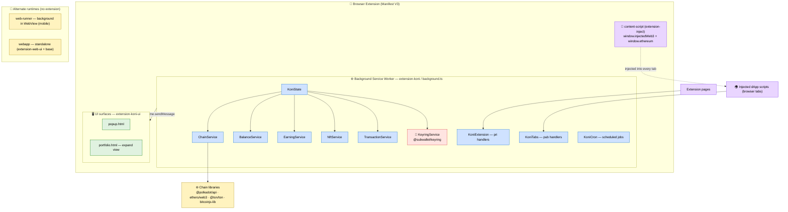
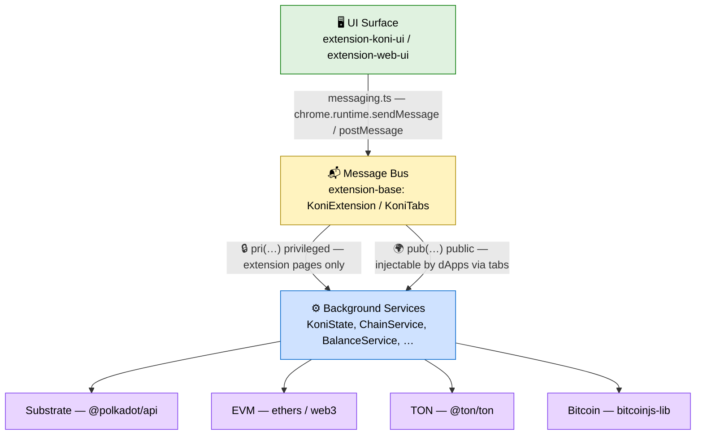
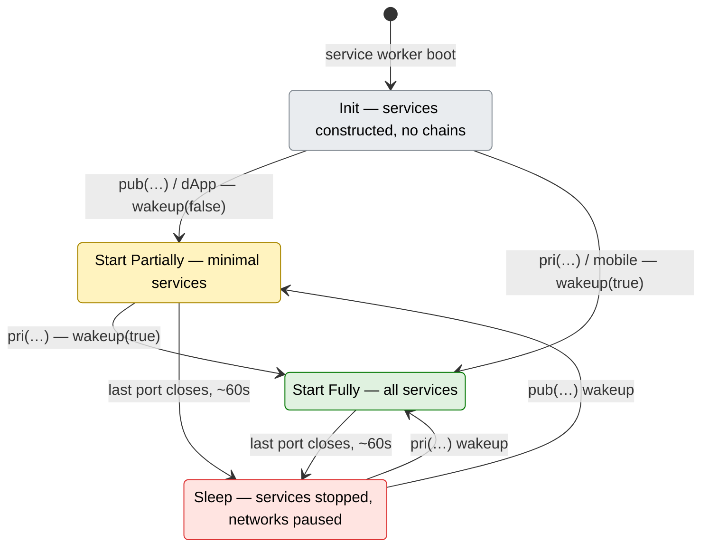

# ARCHITECTURE — SubWallet-Extension

> Last updated: 2026-06-03 (v1.3.79)
> Maintainer: Koniverse team

## System overview

SubWallet-Extension is a non-custodial multi-chain cryptocurrency wallet
delivered as a Chromium/Firefox browser extension and a standalone web
application. It supports five blockchain ecosystems: Substrate/Polkadot
(relay chains and parachains), EVM (Ethereum and EVM-compatible chains),
Bitcoin, TON, and Cardano. The architecture is a message-passing monolith: a
persistent background service owns all state, key material, and on-chain
communication, while multiple UI surfaces (extension popup, full-page
web app) communicate with it exclusively over the browser's message-bus
API. The codebase is organised as a Yarn 3 monorepo of twelve TypeScript
packages with explicit dependency boundaries between background logic,
UI, and shared protocol layers. Architectural drivers are: self-custody
(keys never leave the background environment), multi-chain breadth (200+
networks from a single install), and portability (the same background
logic runs inside the browser extension service worker and inside a
web-runner iframe for mobile webview contexts).

## Tech stack

| Layer | Technology | Version | Rationale |
|-------|-----------|---------|-----------|
| Build target (Node) | Node.js | 12 (`.nvmrc`) | Lowest-common-denominator for extension bundling; dev requires Node 18+ |
| Package manager | Yarn 3 (berry), workspaces | 3.x | Monorepo workspace linking; deterministic lock file |
| Language | TypeScript | 5.x (per tsconfig) | Strict typing across background and UI code |
| UI framework | React | 18.2 | Concurrent mode; hooks-based state; shared between popup and web app |
| UI components | `@subwallet/react-ui`, styled-components | 5.1.2-b77 / ^5.3.6 | In-house component library + CSS-in-JS theming |
| State management | Redux Toolkit + redux-persist | ^1.9.1 / ^6.0.0 | Slice-based reducers; persisted to chrome storage via redux-persist |
| Routing | react-router-dom | ^6.8.2 | Client-side navigation for popup and web app |
| Substrate connectivity | `@polkadot/api`, `@polkadot/rpc-provider` | ^16.4.2 | Full Substrate node API plus lightweight WsProvider for balance queries |
| Substrate crypto | `@polkadot/keyring`, `@polkadot/util-crypto`, `@subwallet/keyring`, `@subwallet/ui-keyring` | ^13.5.3 / ^0.1.14 | Key derivation, signing, address encoding for Substrate and EVM |
| EVM connectivity | `ethers`, `web3` | ^6.4.2 / ^1.10.4 | EVM RPC, contract calls, and MetaMask-compatible provider injection |
| TON connectivity | `@ton/core`, `@ton/crypto`, `@ton/ton` | ^0.56.3 / ^3.2.0 / ^15.0.0 | TON blockchain client and cryptographic primitives |
| Bitcoin support | `bitcoinjs-lib` | 6.1.5 | Transaction construction and address generation for Bitcoin |
| Cardano support | `@emurgo/cardano-serialization-lib-browser` | ^13.2.0 | Cardano serialization for browser environments |
| Local database | `dexie` + `dexie-export-import` | ^3.2.2 / ^4.0.7 | IndexedDB abstraction for structured background storage |
| GraphQL client | `@apollo/client` | ^3.7.14 | SubSquid / SubQuery history and governance data queries |
| HTTP client | `axios` | ^1.13.2 | REST API calls (middleware services, SubSquid, chain-list updates) |
| Phishing protection | `@polkadot/phishing` | ^0.25.15 | Automatically updated phishing site and address list |
| Build tool | Webpack 5 | ^5.102.1 | Extension bundle with code-splitting for Firefox file-size limits |
| Lint / format | ESLint, Prettier | per config | Enforced via `yarn lint` pre-commit check |
| CI | GitHub Actions | — | Automated build, lint, test, and release packaging |

## Component architecture



### Package map

| Package | Purpose | Key dependencies |
|---------|---------|-----------------|
| `@subwallet/extension-base` | Core background services: account management, balance, chain connectivity, transaction, earning, NFT, staking, message-bus handlers, storage, cron jobs, inject scripts | `@polkadot/api`, `ethers`, `web3`, `@ton/core`, `bitcoinjs-lib`, `dexie`, `@subwallet/keyring`, `@subwallet/chain-list`, `@walletconnect/sign-client`, `rxjs`, `@apollo/client` |
| `@subwallet/extension-chains` | Static chain definitions (metadata, genesis hashes, SS58 prefixes) exposed by the extension | `@polkadot/networks`, `@polkadot/util`, `@polkadot/util-crypto`, `@subwallet/extension-inject` |
| `@subwallet/extension-compat-metamask` | MetaMask-compatible EVM provider shim injected into dApp pages | `@metamask/detect-provider`, `@polkadot/types`, `web3`, `@subwallet/extension-inject` |
| `@subwallet/extension-dapp` | Convenience wrapper around injected globals for dApp developers (Substrate side) | `@polkadot/util`, `@polkadot/util-crypto`, `@subwallet/extension-inject` |
| `@subwallet/extension-inject` | Generic injector that populates `window.injectedWeb3` and related interfaces for any conforming extension | `@polkadot/rpc-provider`, `@polkadot/types`, `@subwallet/keyring`, `web3-core` |
| `@subwallet/extension-koni` | Main extension compile entry: wires background service worker and popup bundles; Webpack build lives here | `@subwallet/extension-base`, `@subwallet/extension-inject`, `@subwallet/extension-koni-ui`, `@emurgo/cardano-serialization-lib-browser` |
| `@subwallet/extension-koni-ui` | React UI for the browser extension popup and expand view | `react` 18, `styled-components`, `react-router` v6, `@reduxjs/toolkit`, `@subwallet/react-ui`, `@subwallet/extension-base`, `@polkadot/hw-ledger`, `@ledgerhq/hw-app-eth` |
| `@subwallet/extension-mocks` | Test fixtures and chrome API stubs (sinon-chrome) for unit tests across packages | `sinon-chrome` |
| `@subwallet/extension-web-ui` | React UI for the standalone web application (webapp / web-runner); mirrors extension-koni-ui with web-specific adaptations | `react` 18, `styled-components`, `react-router-dom` ~6.9, `@reduxjs/toolkit`, `@subwallet/react-ui`, `@subwallet/extension-base`, `axios` |
| `@subwallet/subsquare-api-sdk` | HTTP SDK for Subsquare governance and referendum APIs | `@polkadot/util`, `axios` |
| `@subwallet/web-runner` | Hosts the background service worker logic inside a WebView iframe so the wallet can run in mobile or non-extension web environments; uses extension-koni-ui for UI | `@subwallet/extension-base`, `@subwallet/extension-inject`, `@subwallet/extension-koni-ui`, `@emurgo/cardano-serialization-lib-browser` |
| `@subwallet/webapp` | Standalone web application bundle; combines extension-web-ui with background logic for a fully self-contained browser web app | `@subwallet/extension-base`, `@subwallet/extension-inject`, `@subwallet/extension-web-ui`, `@emurgo/cardano-serialization-lib-browser` |

### Runtime split

All API calls and key operations must be processed in the background
environment. Extension pages and inject scripts hold no private key
material and do not call chain APIs directly.



### Runtime lifecycle & service coordination

Under Manifest V3 the background is an evictable service worker, so the
runtime implements an explicit four-state lifecycle (see AD-20). An
`ActionHandler` (`extension-koni`) tracks open ports in a `connectionMap`
and drives `KoniState` between states:



| State | Trigger | What runs |
|-------|---------|-----------|
| Init | service worker boot | construct services, no chain connections |
| Start Partially | first `pub(…)` / dApp message — `state.wakeup(false)` | minimal services for dApp requests |
| Start Fully | `pri(…)` / `mobile(…)` message — `state.wakeup(true)` | all services booted together |
| Sleep | last port disconnects → `SLEEP_TIMEOUT` (~60s) → `state.sleep()` | services stopped in order, all networks paused |

`KoniState` exposes a `ServiceStatus` (INITIALIZING / STARTING / STARTED /
STARTING_FULL / STARTED_FULL / STOPPING / STOPPED) so wake/sleep are
idempotent and overlapping transitions are awaited rather than raced. On
sleep, services are torn down in a fixed order and networks paused; a
`HeartBeat` (`extension-koni`) keeps the service worker alive while
connections are open, countering Chrome's ~5-minute idle eviction.

Services coordinate through a central RxJS-backed `EventService` whose
awaitable promises (`waitAppInitialized`, `waitAppStart`,
`waitAppStartFull`) let services block until the runtime reaches the
required state before acting. Event emission is lazy-batched: events are
queued and flushed on a debounce timer with two tiers
(`DEFAULT_LAZY_TIME` 300ms vs `LONG_LAZY_TIME` 900ms for `LONG_LAZY_EVENTS`)
to coalesce bursts.

The lifecycle profile differs per runtime: the extension follows the full
MV3 Init/Partial/Full/Sleep machine; mobile re-injects reset data then
always full-starts; the web app full-starts on load with no sleep state.

**Transaction & request subsystem.** Transaction handling is split across
three cooperating services. `TransactionService` validates, routes,
submits, and caches transactions; `RequestService` manages every
approval-required request (auth, sign-message, sign-tx) from in-app,
dApp-inject, and WalletConnect sources, owning popup open/close and
approve/reject; `HistoryService` records in-app submissions and merges
them with history fetched from per-chain third-party indexers (Subscan for
Substrate, Blockstream for Bitcoin, taostats for Bittensor). In-app flows
go UI → TransactionService → RequestService → sign → submit →
HistoryService; dApp/WC flows go straight to RequestService. `RequestService`
fans out to per-ecosystem request handlers behind a shared `PopupHandler`
(see AD-21).

## Data layer

| Store | Technology | Scope | Persistence |
|-------|-----------|-------|-------------|
| Structured extension data | IndexedDB via `dexie` (^3.2.2) | Background process | Survives browser restarts; dexie-export-import enables backup/restore |
| Key-value extension state | `chrome.storage.local` | Background process | Survives browser restarts; used for settings, account metadata, network state |
| UI Redux state | `redux-persist` backed by `chrome.storage.local` | UI process | Persisted slice snapshots for fast rehydration on popup open |
| In-memory subscription state | RxJS Subjects (`SubscribableStore`) | Background process | Volatile; republished to UI subscribers on reconnect |

State managed by `KoniState` (in `extension-base`) is the authoritative
source. UI components receive state updates via subscription messages
from the background; they do not maintain independent chain-query
subscriptions. Cronjobs (`KoniCron`) run in the background to refresh
balances, staking data, prices, and NFT metadata on schedule.

## Cross-chain support

Chain definitions live in `@subwallet/chain-list` (an external monorepo
package, version `0.2.127`). The extension bundles and auto-updates this
list to add new chains, tokens, and logos without a code release.

The `extension-chains` package wraps the static genesis hash and SS58
prefix metadata used for account validation and address encoding, sourced
from `@polkadot/networks`.

`ChainService` (in `extension-base`) manages per-chain API objects:

| Ecosystem | API object | Library |
|-----------|-----------|---------|
| Substrate (Polkadot, Kusama, parachains) | `SubstrateApi` (wraps `@polkadot/api` ApiPromise + light-client fallback via `@substrate/connect`) | `@polkadot/api`, `@substrate/connect` |
| EVM (Ethereum, Base, Moonbeam, …) | `EvmApi` (wraps `web3` Web3 and `ethers` JsonRpcProvider) | `web3`, `ethers` |
| TON | TON client | `@ton/ton` |
| Bitcoin | UTXO builder | `bitcoinjs-lib` |

Each enabled chain gets one API instance managed by `ChainService`.
**`SubstrateApi`'s constructor builds a full `ApiPromise` eagerly for every enabled
chain and keeps it for the chain's lifetime — including on the read path**, which
awaits `substrateApiMap[slug].isReady` and reads off `substrateApi.api.query.*`.
RAM is therefore bounded by *how many chains are enabled and awake*, not by a
lightweight read connector: the MV3 worker sleeps after 60 s idle and
`sleep()` stops every chain API (see AD-08). The WsProvider-only read path that
[AD-07](#architecture-decisions) describes **is not implemented** — see the ⚠️ note on
that row, and [US-20.3](sprints/stories/US-20.3-read-path-memory-budget.md), which now
owns measuring what the real budget is.

XCM cross-chain transfers are coordinated in `extension-base` using
Paraspell-compatible `MultiLocation` v3 formatting. XCM route
availability is configurable per chain pair so individual routes can be
toggled without a code release in response to partner-chain incidents
(see AD-09).

## Security model

| Concern | Approach | Detail |
|---------|---------|--------|
| Key custody | Non-custodial; keys never transmitted | `@subwallet/keyring` / `@subwallet/ui-keyring` hold all private key material exclusively in the background service worker |
| Key encryption at rest | `browser-passworder` (AES-256-GCM via master password) | Raw key bytes are never stored; only encrypted blobs written to `chrome.storage.local` |
| Master password | Single password unlocks all accounts | Unified unlock flow; password-derived key held in memory while unlocked, dropped on auto-lock |
| Message bus isolation | `pri(…)` messages only reachable from extension pages; `pub(…)` messages available to injected content scripts | Background enforces prefix-based routing; inject scripts cannot call privileged handlers |
| Phishing protection | `@polkadot/phishing` + ChainPatrol API | Phishing list auto-updates online; flagged sites and addresses surfaced with a blocking warning screen |
| Hardware wallets | Ledger (via `@polkadot/hw-ledger`, `@ledgerhq/hw-app-eth`) and QR signers (Parity Signer, Keystone) | Signing payloads sent to device; private keys never enter the extension |
| Seed phrase display | Input elements only, never textarea | Prevents "demonic vulnerability" autocomplete/autofill leaks (fixed in v1.1.10, issue #1798) |
| dApp injection scope | Content script injected into all tabs; authorization stored per dApp origin | Unauthorized dApps see the provider object but receive rejection until user explicitly approves |

## Build and deploy

### Extension build

```
packages/extension-koni/
  ├── webpack.config.cjs          ← entry point for extension build
  ├── src/background.ts           ← compiled to background service worker
  ├── popup.html / portfolio.html ← extension popup and expand view
  └── manifest.json               ← Manifest V3 descriptor
```

Build command: `yarn webpack:build:extension`
Dev watch:     `yarn watch-dev`

The Webpack config splits the output into many smaller chunks (see AD-06)
to satisfy Firefox's per-file size limits on extension submissions.
WASM modules (`@polkadot` crypto, Cardano serialization, etc.) are
loaded via `wasm-unsafe-eval` CSP in the manifest, required for MV3
compliance (resolved Chrome 102+, see AD-08).

### Web app build

```
packages/webapp/
  ├── webpack.config.cjs   ← entry for standalone web app
  └── src/index.tsx        ← mounts extension-web-ui + background bridge
```

Build command: `yarn webapp:build`
Dev server:    `yarn webapp:dev`  /  `yarn webpack:dev:webapp`

### Web-runner build

```
packages/web-runner/
  └── webpack.config.cjs   ← entry for mobile WebView host
```

Build command: `yarn web-runner:build`
Dev server:    `yarn web-runner:dev`

### Release versioning

The canonical user-facing version is `1.3.82`, recorded in:
- Root `package.json` (`"version": "1.3.82"`)
- `VERSION` file (repo root)

Internal monorepo packages carry a `-N` suffix (`1.3.82-0`).
CI (GitHub Actions) generates dev versions automatically; stable releases
require manual version bump in root `package.json` and `CHANGELOG.md`
update before tagging.

## Architecture decisions

| ID | Topic | Decision | Rationale | Citation |
|----|-------|---------|-----------|---------|
| AD-01 | IndexedDB via dexie for background storage | Use `dexie` (IndexedDB abstraction) as the primary structured store in the background service worker | Provides async schema migrations, a clean query API, and export/import support; outlasted PouchDB evaluation (issue #782) as sufficient without added complexity | issue #782; `extension-base` `dexie` dep |
| AD-02 | ChainService per-chain API objects | Each supported chain gets a dedicated API object (`SubstrateApi` or `EvmApi`) managed by a central `ChainService` | Encapsulates connect/disconnect lifecycle, retry logic, and metadata caching per chain; replaces ad-hoc chain lookups (issues #894, #926, #1222) | issues #894, #1222; shipped v0.7.6 |
| AD-03 | Background / UI message-bus isolation | All chain calls and key operations run exclusively in the background; UI communicates only via typed messages (`pri(…)` / `pub(…)`) | Prevents direct key or RPC exposure in the UI process; `pri` prefix enforces privileged access for extension pages only | `extension-base` README; README.md message-passing docs |
| AD-04 | Non-custodial keyring confined to background | `@subwallet/keyring` and `@subwallet/ui-keyring` are instantiated only in the background service worker; no private key bytes flow to UI or inject scripts | Eliminates key exfiltration via XSS or compromised dApp pages; hardware-wallet signing delegates to device | issues #433; security area entries |
| AD-05 | Yarn 3 monorepo package boundaries | Codebase split into twelve packages with explicit peer/runtime dependencies | Enables code reuse across extension and mobile/web contexts (`extension-base` shared by extension-koni, web-runner, webapp); prevents coupling between UI and background logic | issues #276, #169, #594; AGENTS.md §3 |
| AD-06 | Webpack 5 bundle splitting | Extension output split into many smaller chunks rather than one monolithic bundle | Avoids Firefox extension submission file-size limits (~4 MB per file cap); reduces memory overhead from large monolithic JS files | issues #48, #80, #131; shipped v0.3.6 |
| AD-07 | Lightweight WsProvider for balance queries; full ApiPromise deferred | **⚠️ DECIDED 2022, NEVER IMPLEMENTED (audited 2026-07-13).** The decision ([CONTEXT D2](CONTEXT.md), revised by D95) was to use a lightweight WsProvider connector for balance/token reads and instantiate the full `@polkadot/api` ApiPromise only for extrinsic construction. **The code has never done this.** | The 2022 rationale — full ApiPromise ~137 MB for 4 chains / ~264 MB for 20 chains vs ~72 MB WsProvider-only — was measured on the **MV2 always-on background page**. Under MV3 the worker sleeps after 60 s idle and `sleep()` stops every chain API (AD-08), so the premise has changed and **nobody has re-measured**. | Evidence: at v0.4.1, v1.1.64 (the release this row claimed it shipped in) and v1.3.83 the read path awaits the full ApiPromise (`substrateApiMap[slug].isReady`) and reads `substrateApi.api.query.balances.locks.multi(…)` off it; `SubstrateApi` builds `new ApiPromise` eagerly per chain; the string `lightweight` has **zero hits** in `packages/*/src`. The old citation "PR #3024; shipped v1.1.64" is also wrong — PR #3024 merged `koni/dev/3020`, and 1.1.64 shipped only *"Update chain-list (#3020)"*. Original issues: #217, #232. **Owner of the gap: [US-20.3](sprints/stories/US-20.3-read-path-memory-budget.md) — measure first, then decide whether to refactor or to rewrite this row.** |
| AD-08 | Manifest V3 migration with service worker background | Rebuild background layer around MV3 event-driven service worker rather than polyfilling the MV2 persistent-page model | Chrome enforcement timeline left no viable alternative; WASM support resolved via `wasm-unsafe-eval` CSP from Chrome 102; service worker shutdown/wake lifecycle required new state-persistence strategy | issues #349, #413, #412, #707, #782 |
| AD-09 | Per-chain XCM route toggle | XCM transfer routes are individually configurable per chain pair and can be disabled at runtime without a code release | Enables rapid response to partner-chain security incidents (e.g., Acala 2022 incident, issue #667) without requiring a full extension release cycle | issues #667, #695; bridge-xcm decision entries |
| AD-10 | Polkadot-js fork with upstream rebase strategy | Fork `polkadot-js/extension` and maintain `origin` remote so upstream changes can be rebased at any time | Minimises divergence risk and keeps the extension compatible with polkadot-js tooling; avoids full-rewrite maintenance burden | issue #15; decided 2022-03-15 |
| AD-11 | Unified multi-chain account model | One seed phrase spans Substrate, EVM, TON, Cardano and Bitcoin under a single "unified account"; both unified and per-chain "solo" accounts are supported, with derivation between them | The single-seed / single-backup guarantee is the core product promise; excluding any chain would force a separate seed and break it | CONTEXT D37; issue #4184 |
| AD-12 | Bitcoin integration model | Bitcoin keyring exposes three address types per account (BIP44 Legacy / BIP84 Native SegWit / BIP86 Taproot, default SegWit); the BTC dApp provider is injected as a separate namespace and signs via PSBT | Different BTC dApps/counterparties expect different formats; presenting all three from one key keeps ecosystem compatibility broad without extra accounts | CONTEXT D38, D40; issues #4200, #4598 |
| AD-13 | TON integration model | Use `@ton/core` + `@ton/ton` (TonClient) against TonCenter API; wallet-contract version is user-selectable (v3r1/v3r2/v4/v5, default v5); token type is the TEP-74 Jetton standard | Official SDK tracks the TON runtime; selectable contract version preserves access to funds created on any prior version | CONTEXT D23, D25, D26; issues #3384, #3449 |
| AD-14 | Cardano integration model | Cardano chain data is served by Blockfrost (routed through the backend proxy), the dApp connector follows CIP-30, and CIP-26 native assets ship alongside ADA transfers (staking/delegation deferred) | A managed indexer avoids self-hosting a Cardano node; standards-based connector/asset support maximises dApp and token compatibility | CONTEXT D30, D31, D35; issues #3816, #4352 |
| AD-15 | Bittensor integration model | TAO uses the native Substrate (Subtensor) path rather than the Subtensor-EVM, adopts the dTAO / alpha-token subnet staking model, and runs on-chain swap via the `swapStakeLimit` pallet | Native pallet access is required for subnet staking and reward-claim semantics that the EVM bridge cannot express | CONTEXT D20, D33, D58; issues #2505, #4036 |
| AD-16 | Proxy account model | Support only the named Polkadot proxy-pallet types (no custom types), restricted to Substrate accounts (no EVM-solo or Ledger-EVM); proxy signing is surfaced via a "Sign Selector" popup on existing transaction flows | Aligning to the pallet keeps the authority model auditable and avoids a parallel proxy-initiated transaction surface | CONTEXT D50, D51, D59; issues #1676, #4725 |
| AD-17 | Multisig account model | Multisig uses native pallet extrinsics (`as_multi` / `approveAsMulti`) with role-differentiated actions, deterministic off-chain account creation (no on-chain tx), and on-chain pending-tx detection without an indexer; scoped to Polkadot Substrate chains in Phase 1 | Pallet-native multisig needs no custodial service; off-chain/indexer-free design ships without new backend infrastructure | CONTEXT D48, D54, D55, D56; issues #4696, #4843 |
| AD-18 | XCM delegated to ParaSpell (build-vs-buy) | Delegate XCM transfer construction to the ParaSpell API and upgrade through its versions (v4 → v5 → v1 API) rather than building in-house or self-hosting | Building/forking XCM logic would require tracking every Polkadot runtime upgrade; staying on the official API inherits ParaSpell's ecosystem tracking | CONTEXT D28, D44, D45; issues #3416, #4979 |
| AD-19 | Backend proxy for third-party API keys | Route third-party data-provider calls (Blockfrost, Bitcoin indexer, etc.) through a Koni-hosted backend proxy instead of calling them directly from the client | Hides API keys from the shipped bundle and lets the provider be swapped (e.g. Koni-hosted → Blockstream) without an extension release | CONTEXT D36, D42; issues #4112, #4368 |
| AD-20 | Four-state MV3 background lifecycle with heartbeat | Drive the service worker through Init → Start-Partially → Start-Fully → Sleep via an `ActionHandler` + `connectionMap`; `pub(…)` wakes partially, `pri(…)`/`mobile(…)` wakes fully, last disconnect sleeps after `SLEEP_TIMEOUT`; a `HeartBeat` keeps the worker alive while ports are open | MV3 evicts idle service workers (~5 min), so the runtime needs explicit wake/sleep with a `ServiceStatus` machine to make transitions idempotent and avoid starting all chains for a request that only needs a few | `extension-koni` `ActionHandler`, `HeartBeat`; `State.ts` `generalStatus`; realises AD-08 |
| AD-21 | Per-ecosystem request-handler abstraction in RequestService | `RequestService` fans approval-required requests out to dedicated handlers (Auth, Metadata, Substrate, EVM, Bitcoin, TON, Cardano, plus WalletConnect connect/unsupported) behind a shared `PopupHandler`, each owning its own pending-request cache | Each ecosystem has a different signing payload and approval shape; isolating them keeps one signing surface per chain family while sharing the popup/approve/reject plumbing | `services/request-service/handler/*`; CONTEXT D13, D65 |
| AD-22 | EarningService pool-handler class hierarchy | Model every yield mechanism through a `BasePoolHandler` inheritance tree: native staking (`BaseNativeStakingPoolHandler` → relay/para/Astar/Mythos/Tao subclasses), `NominationPoolHandler`, and `BaseSpecialStakingPoolHandler` → liquid-staking / lending; data exposed via RxJS subjects, driven by account/chain/transaction events | A handler-per-pool-type tree is the extensibility seam for adding earning protocols without touching shared logic; matches the dTAO subnet model (D33) | `services/earning-service/handlers/*`; CONTEXT D33, D46 |
| AD-23 | Static-data caching generated by a headless web-runner cron | Serve heavy, slow-changing data (earning pool info/targets, priority tokens, config) from the `SubWallet-Static-Content` repo via `fetchStaticData`; the cache is regenerated by a scheduled job that runs a `web-runner-cron` build of the extension in a headless browser and commits refreshed data | Polling this data live would hammer RPCs and slow the UI; running the real client headless reuses the actual background logic to produce the cache rather than reimplementing it server-side | `utils/fetchStaticData`; CONTEXT D46 |
| AD-24 | Backend Services SDK for multi-chain data aggregation | Aggregate balance / fee / swap / XCM / NFT data through the SubWallet Services SDK backend (`@subwallet-monorepos/subwallet-services-sdk`, wired in `setup-api-sdk.ts`) instead of computing it entirely on-device | Per-chain RPC across 200+ networks is heavy and rate-limited; a backend aggregation layer cuts client RPC load, centralizes assembly, and allows server-side fixes without an extension release — extending the backend-proxy idea of AD-19 from keys to data | `services/.../setup-api-sdk.ts`; CONTEXT D66; NFR-20 |
| AD-25 | Cache / CDN proxy layer for market data, metadata and NFT media | Front upstream providers with SubWallet proxies: `api-cache` (token prices, EVM gas, exchange rates), `static-data` / `static-cache` (chain-list + token/asset metadata with JSON fallback), and `ipfs-files` (NFT media gateway) | Reduces upstream rate-limit exposure, enables release-free data updates, and provides a fallback when an upstream is unavailable; complements the static-data caching of AD-23 and the bundled-fallback rule in LESSONS §26 | `api-cache`/`static-data`/`ipfs-files` endpoints; CONTEXT D67; NFR-21 |

Individual decisions are recorded in [CONTEXT.md](CONTEXT.md).
Link new architecture decisions from CONTEXT.md here as they are recorded.
