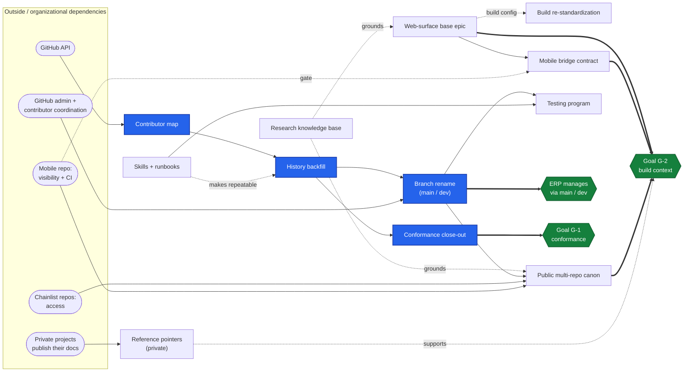
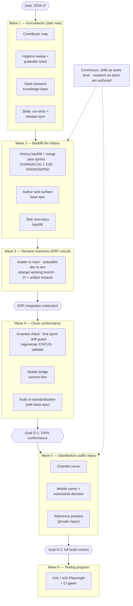
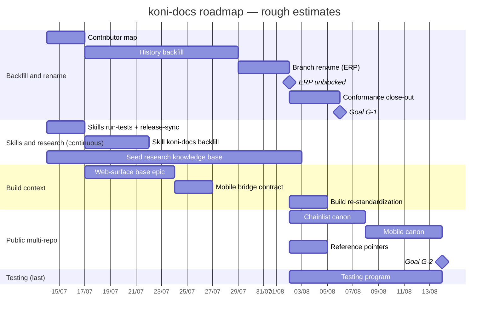

# Execution roadmap — 2026-07-09

Sequencing, dependency, and complexity analysis for the proposals in
[2026-07-07.md](2026-07-07.md). It answers three questions that review left open:

1. **Dependencies & impact** — how the steps depend on each other and on outside work.
2. **Feasibility & complexity** — what can start today and how hard each step is.
3. **A roadmap** — organized into named waves, with three diagrams.

Every step below has a **plain name**; the bracketed letter (e.g. §B) is only a
cross-reference back to the sections of [2026-07-07.md](2026-07-07.md). This note refines
the strategic order in §K — it does **not** produce the assignable proto-epic /
proto-story breakdown, which §K defers until after the review meeting.

> **Priority input (2026-07-09).** The **Branch rename** (`master → main`,
> `subwallet-dev → dev`) is pulled forward to right after the **History backfill**, because
> it unblocks the team's **ERP integration** — the project is managed directly off the
> `main`/`dev` branches. The rename is split from the **Build re-standardization** (which
> couples to the base epic) so the ERP-critical part lands first.

**The steps at a glance:**

| Step | Ref | What it is |
|---|---|---|
| **Contributor map** | §A | Resolve git identities to one GitHub login per person |
| **History backfill** | §B | Fill commit / version / status→done, past sprints, CHANGELOG→1.3.82, bump VERSION + PRD |
| **Branch rename** | §L-1 | `master → main`, `subwallet-dev → dev` + CI/artifacts — **ERP-critical** |
| **Conformance close-out** | §C | 5-layer consistency, first sprint, version-drift guard, hygiene, `validate` |
| **Build re-standardization** | §L-2 | webapp / web-runner build targets — couples to the base epic |
| **Web-surface base epic** | §D | webapp + web-runner base and the WebView bridge |
| **Mobile bridge contract** | §E | Document the web-runner↔Mobile bridge; submodule later |
| **Skills + runbooks** | §H | run-tests, release-sync, backfill skills |
| **Research knowledge base** | §J | `docs/knowledge/` grounding for accurate FR/AD authoring |
| **Public multi-repo canon** | §I-1 | Chainlist first, then Mobile, under one canon |
| **Reference pointers** | §I-2 | Point to private repos' published docs |
| **Testing program** | §G | Unit + e2e Playwright + CI gates |

**Grounding (repo state at time of writing):**

- VERSION = 1.3.79; **169 stories / 20 epics**; koni-docs CLI **0.8.1 installed** (so
  `validate` / `status` / `backfill-fields` / `sync` run today).
- CHANGELOG top = 1.3.79; `origin/HEAD → origin/master`, so the branch rename hasn't
  happened yet.
- Working branch: `ai-development` (off `subwallet-dev`).

---

## 1. Dependencies & impact

### The main path

**Contributor map → History backfill → Branch rename (ERP) → Conformance close-out → first sprint → Goal G-1.**

Read it as: resolve identities, backfill the history, rename the branches for ERP as soon
as the backfill merges, then finish conformance on the renamed branches.

### How the steps depend on each other

- **Contributor map → History backfill.** The map feeds the `assignee` field that the
  backfill writes; the commit/version tracing can run alongside building the map.
- **History backfill → Branch rename.** Once the backfill is **merged**, do the rename
  right away. This is the discrete, announced cutover; the ERP system reads the project off
  `main`/`dev`.
- **History backfill → Conformance close-out.** The 5-layer consistency check and the
  first sprint can only be verified once the backfill has flipped stories to *done*. (The
  quick hygiene sweep and graduating notes don't wait — they run in Wave 1.)
- **Branch rename → Public multi-repo canon.** Chainlist and Mobile adopt the `main`/`dev`
  standard only after the rename lands.
- **Web-surface base epic → Mobile bridge contract.** The web-runner↔Mobile contract doc
  is part of the base epic.
- **Web-surface base epic ↔ Build re-standardization.** The base epic owns the
  webapp/web-runner build config, so the build re-standardization follows it — and stays
  off the ERP-critical path.
- **Research knowledge base** grounds the **Web-surface base epic** and the **Chainlist
  canon** (the bridge and the Chainlist schema).
- **Skills** make the backfill repeatable, and the **run-tests** skill is a prerequisite
  for the **Testing program**.
- **Testing program is last** — it needs run-tests and a stable branch model.

### What depends on the outside world

| Step | Outside dependency | How blocking |
|---|---|---|
| **Contributor map** | GitHub API (resolve logins) | Low — available |
| **Mobile bridge contract** (submodule) + **Mobile canon** | Mobile repo: visibility + CI can carry it | Confirm first |
| **Chainlist canon** | Access to `chain-list` / `chain-list-assets` repos | Medium |
| **Reference pointers** | Private projects must publish their docs first | **Blocked by another project** |
| **Branch rename** | GitHub admin (default branch, protection) + coordinating every contributor/fork | **Organizational, disruptive** |

> **ERP is a downstream driver, not a blocker.** The Branch rename isn't *blocked* by an
> outside system — it **unblocks** one. The ERP manages the project directly off
> `main`/`dev`, which makes the rename a business milestone (hence pulled forward). Capture
> any ERP-specific branch-protection / webhook needs as part of the rename's scope.

### Dependency diagram

*Blue = the main critical path (Contributor map → History backfill → Branch rename → Conformance close-out → Goal G-1); green = goals / outcomes.*

---

## 2. Feasibility & complexity

| Step | Impact | Complexity | Start today? | Outside blocker | Rough effort |
|---|---|---|---|---|---|
| **Contributor map** | High | **High** — identity resolution is the hard part | ✅ Yes | GitHub API | ~2–3 days |
| **History backfill** | **Very high** | High | ✅ Yes (needs the map for assignee) | — local git is enough | **~2 weeks** |
| **Branch rename** | **High** — unblocks ERP + multi-repo | Medium, **high risk** | 🟡 After backfill merges | GitHub admin + coordination | ~3–4 days |
| **Conformance close-out** | High | Medium | 🟡 Partly (hygiene/notes now; rest after backfill) | — | ~3–4 days |
| **Web-surface base epic** | High | Medium–High | ✅ Yes (independent of backfill) | — best with research first | ~1 week |
| **Mobile bridge contract** | High | Medium (doc) → High (submodule) | 🟡 Doc after base epic; submodule blocked | Mobile visibility + CI | ~2–3 days (doc) |
| **Build re-standardization** | Medium | Medium | 🟡 Coordinate with base epic | — | ~2–3 days |
| **Skills + runbooks** | Medium–High (leverage) | Low–Medium | ✅ Yes (run-tests, release-sync) | — | ~2–3 days (first three) |
| **Research knowledge base** | High (leverage) | Low–Medium | ✅ Yes (continuous) | — | Continuous |
| **Public multi-repo canon** | High | High | ❌ After the rename | Chainlist / Mobile access | ~2 weeks |
| **Reference pointers** | Medium | Low | ❌ **Blocked** | Another project publishes docs | ~2 days |
| **Testing program** | Medium | High | ❌ Last | — | ~2 weeks+ |

**Five things that can start today (nothing blocks them):**

1. **Contributor map** — from `git shortlog` + the GitHub API.
2. **Hygiene sweep + graduate notes** — `koni-docs validate` + `sync --dry-run`, and move
   durable decisions from `docs/notes/` into `CONTEXT.md` / `LESSONS.md`.
3. **Seed the research knowledge base** — start `docs/knowledge/` with the hardest-to-
   re-derive topics (per-ecosystem signing, XCM/ParaSpell, the web-runner bridge, the
   Chainlist schema).
4. **Two skills** — `run-tests` and `release/version-sync`.
5. **Web-surface base epic (scoping)** — fully independent of the backfill.

**The riskiest steps:**

- **Contributor map** — identity resolution (one person under many emails/logins, bots
  mixed in) needs judgment, not just scripting.
- **Branch rename** — low technical complexity but high risk: it breaks CI, open PRs, and
  forks. Do it as one discrete, announced step, and only after the backfill merges.
- **Reference pointers** — little work, but fully blocked by another project. Keep it off
  the critical path.

---

## 3. The roadmap

Six waves. The first four are the conformance + ERP track; the last two extend build
context and quality. Two tracks run in parallel throughout: **skills** and **research**.

Compared with §K, the changes are:

- **The Branch rename moves up** — to right after the backfill merges, ahead of the
  conformance close-out — because the ERP needs `main`/`dev`. Conformance is docs-only and
  doesn't care about branch names, so it simply continues on the renamed branches.
- **The base epic and research run in parallel** with the backfill (they don't depend on
  it), which shortens the path to full build context.
- **The backfill skill is written while doing the backfill**, not afterward.
- **Reference pointers sit off the critical path** because they're externally blocked.

### Waves

### Timeline (rough estimates — not date commitments)

The `after` links keep the dependency order; day counts are order-of-magnitude estimates to
show relative length and where work runs in parallel.

### Wave summary

| Wave | Does | Result |
|---|---|---|
| **1 — Groundwork** | Contributor map · hygiene sweep + graduate notes · seed research · two skills · scope the base epic | Quick wins, nothing blocked |
| **2 — Backfill** | History backfill + merge (past sprints, CHANGELOG→1.3.82, VERSION/PRD) · author the base epic · backfill skill | Conformance data in place |
| **3 — Rename branches** | `master → main`, `subwallet-dev → dev` · CI + artifact rename · retarget working branch | 🔓 **ERP unblocked**; standard branches |
| **4 — Close conformance** | Invariant check · first sprint · drift guard · regenerate STATUS · validate · Mobile bridge contract · build re-standardization | 🏁 **Goal G-1: 100% conformance** |
| **5 — Public repos** | Chainlist canon → Mobile canon (+ submodule decision) → reference pointers | 🏁 **Goal G-2: full build context** |
| **6 — Testing** | Unit + e2e Playwright + CI gates | Quality program |
| **Continuous** | Skills as tasks arise · research as each epic/AD is authored | Spans every wave |

---

## Scope note

This is the **strategic order and dependencies only** — the boundary §K sets for itself.
Breaking the waves into **assignable proto-epics / proto-stories** stays **deferred until
after the review meeting** finalizes [2026-07-07.md](2026-07-07.md).
