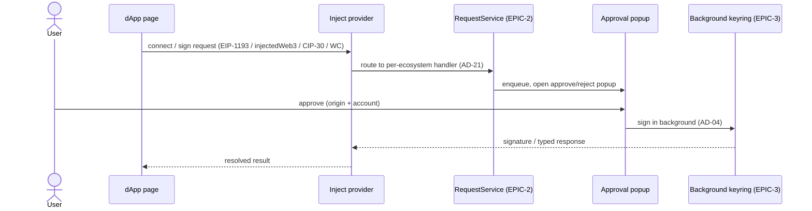

## Goal

Let a user connect SubWallet to any dApp — across every ecosystem the wallet
supports — and approve connections, signatures and (forward) transactions from
one consistent surface. Interacting with dApps is a primary reason a Web3 wallet
exists; this epic owns the **connector + authorization** path that makes the
wallet usable from a web page, while delegating the approval queue and the actual
signing to the platform engines.

## Overview

### Business context

Before this epic the wallet can hold and move funds on its own screens, but a dApp
in the browser cannot *talk* to it: there is no injected provider, no
WalletConnect bridge, and no per-origin permission model. EPIC-10 closes that gap.
It owns the **dApp connectivity surface** — the provider objects injected into
every tab (EVM `window.ethereum` via EIP-1193 / EIP-6963, Substrate
`window.injectedWeb3`, and the Bitcoin / Cardano / TON connectors), the
WalletConnect v2 bridge for both Substrate and EVM sessions, the per-origin
authorization UI ("Manage website access"), and the arbitrary message-signing
entrypoints each ecosystem exposes.

The capability this epic adds is a **read/connect + consent path**, not a signing
engine. Every connector follows the same shape: a content script injects a
provider object into the page, the page calls a standard method (`eth_requestAccounts`,
`web3Enable`, CIP-30 `enable`, etc.), and the request is routed to the
per-ecosystem request handler in `RequestService` ([AD-21](../../ARCHITECTURE.md#architecture-decisions)).
Adding an ecosystem is a new injected namespace plus a new request handler — never
a bespoke approval popup.

The architectural distinction this epic preserves: **it does not own the approval
queue and it does not own signing**. The single approve/reject confirmation queue
(`RequestService` and its `PopupHandler`, AD-21) is owned by [EPIC-2](EPIC-2.md)
(core-platform); the transaction signing/submission pipeline is owned by
[EPIC-8](EPIC-8.md) (transaction). EPIC-10 *enqueues* into that queue and *routes*
to those signers; it builds neither. The non-custodial boundary (AD-04) is also
inherited, not redefined — no key bytes ever flow to an inject script or a dApp
page.

### Feature pillars

| # | Pillar | Stories | Purpose |
|---|---|---|---|
| 1 | **EVM & Substrate injection** | [US-10.1](../stories/US-10.1-evm-provider-injection-eip-1193-eip-6963.md), [US-10.2](../stories/US-10.2-substrate-inject-api-injectedweb3.md) | MetaMask-compatible `window.ethereum` (EIP-1193 / EIP-6963) and Polkadot `window.injectedWeb3` injected into every tab |
| 2 | **WalletConnect bridge** | [US-10.3](../stories/US-10.3-walletconnect-v2-substrate-and-evm.md) | WalletConnect v2 sessions for both Substrate and EVM, for dApps that pair by QR/URI instead of injection |
| 3 | **Non-EVM ecosystem connectors** | [US-10.4](../stories/US-10.4-cardano-cip-30-connector.md), [US-10.5](../stories/US-10.5-bitcoin-dapp-connection-psbt.md), [US-10.6](../stories/US-10.6-ton-dapp-connection.md) | Cardano CIP-30, Bitcoin (PSBT) and TON dApp connectors, each as a separate injected namespace |
| 4 | **Authorization & consent** | [US-10.7](../stories/US-10.7-dapp-authorization-ui-per-origin.md), [US-10.8](../stories/US-10.8-arbitrary-message-signing.md) | Per-origin / per-account access control with revocation, and arbitrary message signing across all five ecosystems |
| 5 | **Forward API & hardening** | [US-10.9](../stories/US-10.9-dapp-createtransaction-api-rfc-6213.md), [US-10.10](../stories/US-10.10-multi-wallet-coexistence-hardening.md), [US-10.11](../stories/US-10.11-walletconnect-session-and-dashboard-hardening.md), [US-10.12](../stories/US-10.12-webapp-injected-account-caching.md) | The planned `createTransaction` signing API (Polkadot-JS RFC #6213), multi-wallet coexistence, WalletConnect session/dashboard, and WebApp injected-account caching hardening |

### Out of scope

- **The approval / confirmation queue** — owned by [EPIC-2](EPIC-2.md) (core-platform). `RequestService` + `PopupHandler` (AD-21) are the single approve/reject surface; this epic enqueues into it and never reimplements popup, approval state, or per-chain payload routing.
- **Transaction signing & submission** — owned by [EPIC-8](EPIC-8.md) (transaction). dApp-initiated sign-tx requests route to the transaction pipeline; this epic does not sign or broadcast.
- **The keyring / key material** — owned by [EPIC-3](EPIC-3.md) accounts via the background keyring (AD-04). Inject scripts and dApp pages hold no private key bytes.
- **Phishing-site blocking for dApp origins** — owned by [EPIC-5](EPIC-5.md) (security, FR-50). Authorization here records *which* origins a user trusts; security decides which origins are *dangerous*.

## FR Coverage

> FR statuses below are **story-planning** statuses (Stream B). The real shipped
> state lives in [PRD](../../PRD.md#functional-requirements): FR-94..FR-101 are `✅ shipped`, FR-102 is
> `📋 planned`. `done` + `version_shipped` are backfilled in version
> reconciliation; the shipped stories are marked **Retroactive** in their bodies.

| FR | Story | Status |
|----|-------|--------|
| FR-94 | [US-10.1](../stories/US-10.1-evm-provider-injection-eip-1193-eip-6963.md) | ✅ done |
| FR-95 | [US-10.2](../stories/US-10.2-substrate-inject-api-injectedweb3.md) | ✅ done |
| FR-96 | [US-10.3](../stories/US-10.3-walletconnect-v2-substrate-and-evm.md) | ✅ done |
| FR-97 | [US-10.4](../stories/US-10.4-cardano-cip-30-connector.md) | ✅ done |
| FR-98 | [US-10.5](../stories/US-10.5-bitcoin-dapp-connection-psbt.md) | 📋 backlog |
| FR-99 | [US-10.6](../stories/US-10.6-ton-dapp-connection.md) | 📋 backlog |
| FR-100 | [US-10.7](../stories/US-10.7-dapp-authorization-ui-per-origin.md) | ✅ done |
| FR-101 | [US-10.8](../stories/US-10.8-arbitrary-message-signing.md) | ✅ done |
| FR-102 | [US-10.9](../stories/US-10.9-dapp-createtransaction-api-rfc-6213.md) | 📋 backlog |

> US-10.10 (multi-wallet coexistence hardening), US-10.11 (WalletConnect
> session & dashboard hardening) and US-10.12 (WebApp injected-account caching)
> own no FR — they are the bug/iteration (hardening) cluster for this epic, split
> one-concern-per-story.

## AD Coverage

| AD | Title | Story |
|----|-------|-------|
| AD-21 | Per-ecosystem request-handler abstraction in RequestService | [US-10.1](../stories/US-10.1-evm-provider-injection-eip-1193-eip-6963.md), [US-10.7](../stories/US-10.7-dapp-authorization-ui-per-origin.md), [US-10.8](../stories/US-10.8-arbitrary-message-signing.md) |
| AD-12 | Bitcoin integration model (separate inject namespace, PSBT) | [US-10.5](../stories/US-10.5-bitcoin-dapp-connection-psbt.md) |
| AD-13 | TON integration model | [US-10.6](../stories/US-10.6-ton-dapp-connection.md) |
| AD-14 | Cardano integration model (CIP-30 connector) | [US-10.4](../stories/US-10.4-cardano-cip-30-connector.md) |

> AD-21 is **anchored** by [EPIC-2](EPIC-2.md) (US-2.7 builds `RequestService` +
> `PopupHandler`); this epic *materializes* it by adding the per-ecosystem dApp
> handlers and routing into the shared queue. AD-04 (non-custodial keyring) is
> referenced as an inherited invariant but is owned by [EPIC-3](EPIC-3.md) /
> [EPIC-2](EPIC-2.md).

## Stories

| ID | Title | Goal | Status | Version |
|---|---|---|---|---|
| [US-10.1](../stories/US-10.1-evm-provider-injection-eip-1193-eip-6963.md) | EVM provider injection (EIP-1193 / EIP-6963) | MetaMask-compatible `window.ethereum` injected into every dApp page | ✅ done | 1.1.25 |
| [US-10.2](../stories/US-10.2-substrate-inject-api-injectedweb3.md) | Substrate inject API (injectedWeb3) | Polkadot dApps see SubWallet via `window.injectedWeb3` | ✅ done | 0.2.1 |
| [US-10.3](../stories/US-10.3-walletconnect-v2-substrate-and-evm.md) | WalletConnect v2 (Substrate + EVM) | Pair dApps over WalletConnect for both chain families | ✅ done | 1.1.1 |
| [US-10.4](../stories/US-10.4-cardano-cip-30-connector.md) | Cardano CIP-30 connector | Cardano dApps connect, sign and submit via CIP-30 | ✅ done | 1.3.32 |
| [US-10.5](../stories/US-10.5-bitcoin-dapp-connection-psbt.md) | Bitcoin dApp connection (PSBT) | Bitcoin dApps connect, get addresses and sign PSBTs | 📋 backlog | — |
| [US-10.6](../stories/US-10.6-ton-dapp-connection.md) | TON dApp connection | TON dApps connect and request signatures | 📋 backlog | — |
| [US-10.7](../stories/US-10.7-dapp-authorization-ui-per-origin.md) | dApp authorization UI (per-origin) | Manage website access: per-origin / per-account, with revocation | ✅ done | 0.36.1 |
| [US-10.8](../stories/US-10.8-arbitrary-message-signing.md) | Arbitrary message signing | personal_sign / signTypedData / signMessage / signData across ecosystems | ✅ done | 0.14.1 |
| [US-10.9](../stories/US-10.9-dapp-createtransaction-api-rfc-6213.md) | dApp createTransaction API (RFC #6213) | A dApp builds a tx the wallet signs — Polkadot-JS RFC #6213 | 📋 backlog | — |
| [US-10.10](../stories/US-10.10-multi-wallet-coexistence-hardening.md) | Multi-wallet coexistence hardening | Coexist with other injected wallets without fighting over `window.ethereum` | 📋 backlog | — |
| [US-10.11](../stories/US-10.11-walletconnect-session-and-dashboard-hardening.md) | WalletConnect session & dashboard hardening | Reconcile WC v2 sessions to live relay state; reject dead-session requests | 📋 backlog | — |
| [US-10.12](../stories/US-10.12-webapp-injected-account-caching.md) | WebApp injected-account caching | Cache/reconcile injected accounts so add-side-effects run once, not each open (#2286) | 📋 backlog | — |

## Object map & user-story interactions

### US ↔ entity / subsystem matrix

| US | Primary entity / subsystem | FR |
|---|---|---|
| [US-10.1](../stories/US-10.1-evm-provider-injection-eip-1193-eip-6963.md) | EVM inject provider (`extension-compat-metamask`, `window.ethereum`) | FR-94 |
| [US-10.2](../stories/US-10.2-substrate-inject-api-injectedweb3.md) | Substrate injector (`extension-inject`, `window.injectedWeb3`) | FR-95 |
| [US-10.3](../stories/US-10.3-walletconnect-v2-substrate-and-evm.md) | WalletConnect sign-client + WC request handlers | FR-96 |
| [US-10.4](../stories/US-10.4-cardano-cip-30-connector.md) | Cardano CIP-30 inject namespace + Cardano request handler | FR-97 |
| [US-10.5](../stories/US-10.5-bitcoin-dapp-connection-psbt.md) | Bitcoin inject namespace (PSBT) + Bitcoin request handler | FR-98 |
| [US-10.6](../stories/US-10.6-ton-dapp-connection.md) | TON inject namespace + TON request handler | FR-99 |
| [US-10.7](../stories/US-10.7-dapp-authorization-ui-per-origin.md) | Per-origin authorization store + "Manage website access" UI | FR-100 |
| [US-10.8](../stories/US-10.8-arbitrary-message-signing.md) | Sign-message request handlers (per ecosystem) | FR-101 |
| [US-10.9](../stories/US-10.9-dapp-createtransaction-api-rfc-6213.md) | `createTransaction` Substrate inject API (RFC #6213) | FR-102 |
| [US-10.10](../stories/US-10.10-multi-wallet-coexistence-hardening.md) | EVM injected-provider coexistence (`window.ethereum` / EIP-6963) | — |
| [US-10.11](../stories/US-10.11-walletconnect-session-and-dashboard-hardening.md) | WalletConnect session reconciliation + dashboard | — |
| [US-10.12](../stories/US-10.12-webapp-injected-account-caching.md) | Injected-account cache/reconcile on the inject bridge | — |

### End-to-end happy path

**Branches not shown:** unauthorized origin (provider visible but request rejected
until the user approves); user rejects / dismisses the popup (caller resolves
rejected, no partial approval leaks); a sign-tx request continues into the
[EPIC-8](EPIC-8.md) transaction pipeline rather than returning a bare signature.

## Cross-cutting invariants

- **Per-origin authorization gate ([FR-100](../../PRD.md#functional-requirements)):** an unauthorized origin sees the injected provider object but every privileged request is rejected until the user explicitly approves that origin (and the specific accounts). No connector may grant account access without an authorization entry. Enforced by [US-10.7](../stories/US-10.7-dapp-authorization-ui-per-origin.md); every other connector story consumes this gate.
- **All consent routes through the shared queue (AD-21):** every connect / sign-message / sign-tx request is enqueued in `RequestService` and surfaced through the one `PopupHandler` approve/reject popup — no connector builds its own approval UI. A connector PR that adds a bespoke popup is rejected. Enforced via routing to `services/request-service/handler/*`.
- **No key bytes on the inject bridge (AD-04, owned by EPIC-3):** seed and private-key bytes never reach an inject script, a `pub(…)` message, or a dApp page; signing happens only in the background keyring. This epic consumes the boundary; it does not weaken it.
- **A connector is a namespace + a handler, never a UI branch (AD-21):** adding an ecosystem means a new injected provider namespace plus a new per-ecosystem request handler; it must not fork the authorization or approval UI.

## Cross-story testing requirements

| Pattern | Stories that apply | Shared infra |
|---|---|---|
| **Provider-injection coexistence (EVM EIP-1193/6963 + Substrate `injectedWeb3` across wallets)** | [US-10.1](../stories/US-10.1-evm-provider-injection-eip-1193-eip-6963.md), [US-10.2](../stories/US-10.2-substrate-inject-api-injectedweb3.md), [US-10.10](../stories/US-10.10-multi-wallet-coexistence-hardening.md) | Multi-wallet page harness (injection-order / late-injection fixtures; `window.ethereum` + `window.injectedWeb3` enumeration) |
| **Per-origin authorization gating** | [US-10.7](../stories/US-10.7-dapp-authorization-ui-per-origin.md), [US-10.1](../stories/US-10.1-evm-provider-injection-eip-1193-eip-6963.md), [US-10.2](../stories/US-10.2-substrate-inject-api-injectedweb3.md), [US-10.3](../stories/US-10.3-walletconnect-v2-substrate-and-evm.md), [US-10.8](../stories/US-10.8-arbitrary-message-signing.md) | Per-origin authorization-store fixture (granted/unauthorized origins, per-account scope, revocation) |
| **Request-approval queue routing (per-ecosystem handler → shared `PopupHandler`)** | [US-10.1](../stories/US-10.1-evm-provider-injection-eip-1193-eip-6963.md), [US-10.2](../stories/US-10.2-substrate-inject-api-injectedweb3.md), [US-10.4](../stories/US-10.4-cardano-cip-30-connector.md), [US-10.5](../stories/US-10.5-bitcoin-dapp-connection-psbt.md), [US-10.6](../stories/US-10.6-ton-dapp-connection.md), [US-10.8](../stories/US-10.8-arbitrary-message-signing.md), [US-10.9](../stories/US-10.9-dapp-createtransaction-api-rfc-6213.md) | `RequestService` / `PopupHandler` approve-reject harness (mock `services/request-service/handler/*`, standard rejection-error assertions) |
| **WalletConnect session lifecycle** | [US-10.3](../stories/US-10.3-walletconnect-v2-substrate-and-evm.md), [US-10.11](../stories/US-10.11-walletconnect-session-and-dashboard-hardening.md) | WalletConnect sign-client relay mock (pair / approve / expire / dead-session fixtures for session-reconciliation tests) |
| **Injected-account reconcile idempotency** | [US-10.12](../stories/US-10.12-webapp-injected-account-caching.md), [US-10.1](../stories/US-10.1-evm-provider-injection-eip-1193-eip-6963.md) | Inject-bridge cache fixture (reopen the web app; assert account-add side effects fire once, #2286) |

> **Cross-reference:** executable scenarios for this epic live in
> `docs/tests/test-cases/EPIC-10.md` (when authored). The table above declares
> the *harness*; the test-cases file owns the *scenarios*.

## Performance budgets & invariants

| Concern | Budget | Story | Rationale |
|---|---|---|---|
| **Provider injection cost** | Provider injected by the content script at page load without blocking the dApp's page scripts; EIP-6963 announce is event-driven, not a busy-wait | [US-10.1](../stories/US-10.1-evm-provider-injection-eip-1193-eip-6963.md) | The provider is injected into *every* tab, so it must not delay page load or first paint for non-dApp pages |
| **EIP-6963 contention determinism** | Announce/request handshake stays deterministic regardless of injection order, including late injection (re-announce on `eip6963:requestProvider`) | [US-10.10](../stories/US-10.10-multi-wallet-coexistence-hardening.md) | Multiple wallets injecting into one tab must not clobber each other or leave SubWallet undiscoverable (#3180, #2605) |
| **Per-request authorization lookup** | Each privileged request resolves the per-origin authorization scope before enqueuing; revocation takes effect immediately on the next request | [US-10.7](../stories/US-10.7-dapp-authorization-ui-per-origin.md) | Every connector consults this store on each privileged call, so the gate must be cheap and must not leak full-wallet access |
| **Injected-account reconcile on open** | Reopening the web app reconciles injected accounts against the cache so account-add side effects (chain/token auto-activation) run once, not on every open | [US-10.12](../stories/US-10.12-webapp-injected-account-caching.md) | Re-running add-side-effects per open is redundant work and unwanted re-activation; the open path must be cheap and idempotent (#2286) |

## Acceptance criteria (propagated from stories)

- [ ] A dApp page sees a MetaMask-compatible EVM provider (EIP-1193) discoverable via EIP-6963 — [US-10.1](../stories/US-10.1-evm-provider-injection-eip-1193-eip-6963.md)
- [ ] A Polkadot dApp enables SubWallet through `window.injectedWeb3` — [US-10.2](../stories/US-10.2-substrate-inject-api-injectedweb3.md)
- [ ] A dApp can pair over WalletConnect v2 for a Substrate or an EVM session — [US-10.3](../stories/US-10.3-walletconnect-v2-substrate-and-evm.md)
- [ ] Cardano (CIP-30), Bitcoin (PSBT) and TON dApps each connect through their own injected namespace — [US-10.4](../stories/US-10.4-cardano-cip-30-connector.md), [US-10.5](../stories/US-10.5-bitcoin-dapp-connection-psbt.md), [US-10.6](../stories/US-10.6-ton-dapp-connection.md)
- [ ] A user can review, scope per-account, and revoke per-origin website access — [US-10.7](../stories/US-10.7-dapp-authorization-ui-per-origin.md)
- [ ] A dApp can request an arbitrary message signature in each ecosystem — [US-10.8](../stories/US-10.8-arbitrary-message-signing.md)
- [ ] _(forward)_ A dApp can build a transaction the wallet signs via the createTransaction API (RFC #6213) — [US-10.9](../stories/US-10.9-dapp-createtransaction-api-rfc-6213.md)
- [ ] SubWallet coexists with other injected wallets without fighting over `window.ethereum` (EIP-6963 announce/contention) — [US-10.10](../stories/US-10.10-multi-wallet-coexistence-hardening.md)
- [ ] The WalletConnect dashboard reconciles to live relay state and rejects requests on dead/expired sessions — [US-10.11](../stories/US-10.11-walletconnect-session-and-dashboard-hardening.md)
- [ ] Opening the web app reconciles injected accounts against a cache so account-add side effects run once, not on every open (#2286) — [US-10.12](../stories/US-10.12-webapp-injected-account-caching.md)
