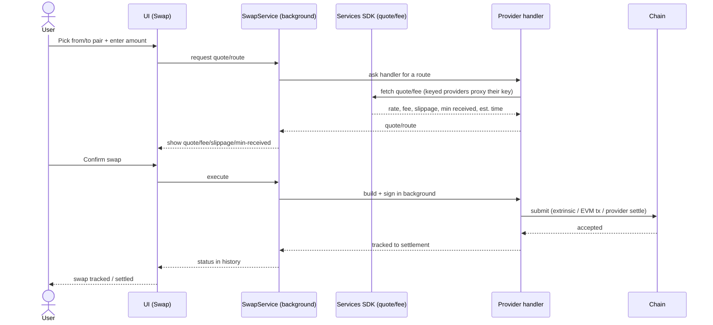

## Goal

Let users exchange tokens without leaving the wallet — a key DeFi convenience —
by aggregating many swap providers behind one quote / route / execute surface.

## Overview

### Business context

Before this epic a user must leave for an external DEX to trade. EPIC-11 owns the
**in-wallet exchange path**: every provider (Chainflip, Hydration, Uniswap,
KyberSwap, SimpleSwap, Asset Hub DEX, Bittensor dTAO, Optimex, plus incoming
PiperX / StellaSwap) plugs into the shared **SwapService routing engine** (PRD
[FR-8](../../PRD.md#functional-requirements), EPIC-2) as a handler, and quote/fee data is aggregated
through the Services SDK backend (AD-24).

Swap **owns routing, not the primitives it composes**: the bridge step used in
cross-chain routes is owned by [EPIC-13](EPIC-13.md) (delegated to ParaSpell,
AD-18), and the SwapService engine itself lives in [EPIC-2](EPIC-2.md).

> FR statuses below are **story-planning** statuses. The shipped state of each
> provider lives in [PRD](../../PRD.md#functional-requirements) (most are `✅ shipped`).

### Feature pillars

| # | Pillar | Stories | Purpose |
|---|---|---|---|
| 1 | **Substrate-ecosystem DEX** | [US-11.2](../stories/US-11.2-in-wallet-swap-via-hydration-dex.md), [US-11.6](../stories/US-11.6-in-wallet-swap-via-asset-hub-dex.md), [US-11.7](../stories/US-11.7-in-wallet-bittensor-dtao-swap.md) | On-chain Substrate swaps — Hydration omnipool, Asset Hub DEX, and the Bittensor subnet AMM |
| 2 | **EVM DEX & aggregators** | [US-11.3](../stories/US-11.3-in-wallet-swap-via-uniswap.md), [US-11.4](../stories/US-11.4-in-wallet-swap-via-kyberswap.md), [US-11.10](../stories/US-11.10-in-wallet-swap-via-piperx.md), [US-11.11](../stories/US-11.11-in-wallet-swap-via-stellaswap.md) | EVM-side swaps via DEXes and aggregators (Uniswap, KyberSwap; planned PiperX / StellaSwap) |
| 3 | **Cross-ecosystem & intent providers** | [US-11.1](../stories/US-11.1-in-wallet-swap-via-chainflip.md), [US-11.5](../stories/US-11.5-in-wallet-swap-via-simpleswap.md), [US-11.9](../stories/US-11.9-in-wallet-swap-via-optimex.md) | Native cross-chain (Chainflip), non-custodial (SimpleSwap) and intent / solver-settled (Optimex) swaps |
| 4 | **Cross-chain routing** | [US-11.8](../stories/US-11.8-cross-chain-swap-routing.md) | The Swap↔Bridge multi-hop router that composes the providers with the bridge step (consumes [EPIC-13](EPIC-13.md)) |

### Out of scope

- **Bridge construction (XCM / external bridges)** — owned by [EPIC-13](EPIC-13.md). Swap routing *consumes* it (AD-18).
- **The SwapService engine itself** — owned by [EPIC-2](EPIC-2.md) (core-platform); providers reuse it.
- **Fiat on/off-ramp** — owned by [EPIC-14](EPIC-14.md) (fiat-gateway); buying/selling crypto for fiat, not token-to-token swap.

## FR Coverage

> Every FR is assigned a story ID up front (in FR order) so the numbering is
> locked. All stories are now authored; each row links to its story file.

| FR | Story | Status |
|----|-------|--------|
| FR-103 | [US-11.1](../stories/US-11.1-in-wallet-swap-via-chainflip.md) | ✅ done |
| FR-104 | [US-11.2](../stories/US-11.2-in-wallet-swap-via-hydration-dex.md) | ✅ done |
| FR-105 | [US-11.3](../stories/US-11.3-in-wallet-swap-via-uniswap.md) | ✅ done |
| FR-106 | [US-11.4](../stories/US-11.4-in-wallet-swap-via-kyberswap.md) | ✅ done |
| FR-107 | [US-11.5](../stories/US-11.5-in-wallet-swap-via-simpleswap.md) | ✅ done |
| FR-108 | [US-11.6](../stories/US-11.6-in-wallet-swap-via-asset-hub-dex.md) | ✅ done |
| FR-109 | [US-11.7](../stories/US-11.7-in-wallet-bittensor-dtao-swap.md) | ✅ done |
| FR-110 | [US-11.8](../stories/US-11.8-cross-chain-swap-routing.md) | ✅ done |
| FR-111 | [US-11.9](../stories/US-11.9-in-wallet-swap-via-optimex.md) | ✅ done |
| FR-112 | [US-11.10](../stories/US-11.10-in-wallet-swap-via-piperx.md) | 📋 backlog |
| FR-113 | [US-11.11](../stories/US-11.11-in-wallet-swap-via-stellaswap.md) | 📋 backlog |

## AD Coverage

| AD | Title | Story |
|----|-------|-------|
| AD-24 | Backend Services SDK for multi-chain data aggregation | [US-11.1](../stories/US-11.1-in-wallet-swap-via-chainflip.md), [US-11.3](../stories/US-11.3-in-wallet-swap-via-uniswap.md), [US-11.4](../stories/US-11.4-in-wallet-swap-via-kyberswap.md), [US-11.5](../stories/US-11.5-in-wallet-swap-via-simpleswap.md) |
| AD-18 | XCM delegated to ParaSpell (build-vs-buy) | [US-11.8](../stories/US-11.8-cross-chain-swap-routing.md) |

> AD-24 aggregates swap quote/fee data for every provider; the keyed providers
> (Chainflip, Uniswap, KyberSwap, SimpleSwap) additionally proxy their API key
> through it so no key ships in the bundle ([NFR-16](../../PRD.md#non-functional-requirements)).
> AD-18's primary implementation is owned by [EPIC-13](EPIC-13.md); swap routing
> only *consumes* the bridge step it builds.

## Stories

| ID | Title | Goal | Status | Version |
|---|---|---|---|---|
| [US-11.1](../stories/US-11.1-in-wallet-swap-via-chainflip.md) | In-wallet swap via Chainflip | Native BTC↔Polkadot↔EVM swap | ✅ done | 1.1.55 |
| [US-11.2](../stories/US-11.2-in-wallet-swap-via-hydration-dex.md) | In-wallet swap via Hydration DEX | Substrate omnipool DEX swap | ✅ done | 1.1.55 |
| [US-11.3](../stories/US-11.3-in-wallet-swap-via-uniswap.md) | In-wallet swap via Uniswap (V3/V4 + UniswapX) | EVM DEX swap | ✅ done | 1.3.36 |
| [US-11.4](../stories/US-11.4-in-wallet-swap-via-kyberswap.md) | In-wallet swap via KyberSwap | EVM aggregator swap | ✅ done | 1.3.36 |
| [US-11.5](../stories/US-11.5-in-wallet-swap-via-simpleswap.md) | In-wallet swap via SimpleSwap | Non-custodial cross-chain swap | ✅ done | 1.3.11 |
| [US-11.6](../stories/US-11.6-in-wallet-swap-via-asset-hub-dex.md) | In-wallet swap via Asset Hub DEX | Polkadot Asset Hub swap | ✅ done | 1.2.14 |
| [US-11.7](../stories/US-11.7-in-wallet-bittensor-dtao-swap.md) | In-wallet Bittensor dTAO swap | TAO↔alpha subnet-AMM swap | ✅ done | 1.3.78 |
| [US-11.8](../stories/US-11.8-cross-chain-swap-routing.md) | Cross-chain swap routing (Swap↔Bridge) | Multi-hop swap+bridge routing | ✅ done | 1.3.30 |
| [US-11.9](../stories/US-11.9-in-wallet-swap-via-optimex.md) | In-wallet swap via Optimex | Intent-based cross-chain swap | ✅ done | 1.3.63 |
| [US-11.10](../stories/US-11.10-in-wallet-swap-via-piperx.md) | In-wallet swap via PiperX | EVM DEX swap (planned) | 📋 backlog | — |
| [US-11.11](../stories/US-11.11-in-wallet-swap-via-stellaswap.md) | In-wallet swap via StellaSwap | Moonbeam DEX swap (planned) | 📋 backlog | — |

> All 11 stories (US-11.1–11.11) are now authored and linked above. The shipped
> state of each provider lives in [PRD](../../PRD.md#functional-requirements) (most are `✅ shipped`).

## Object map & user-story interactions

### US ↔ entity / subsystem matrix

| US | Primary entity / subsystem | FR / NFR |
|---|---|---|
| [US-11.1](../stories/US-11.1-in-wallet-swap-via-chainflip.md) | Chainflip `SwapService` handler (keyed, cross-chain) | FR-103 |
| [US-11.2](../stories/US-11.2-in-wallet-swap-via-hydration-dex.md) | Hydration omnipool handler (Substrate extrinsic) | FR-104 |
| [US-11.3](../stories/US-11.3-in-wallet-swap-via-uniswap.md) | Uniswap handler (V3/V4 + UniswapX, keyed, EVM tx) | FR-105 |
| [US-11.4](../stories/US-11.4-in-wallet-swap-via-kyberswap.md) | KyberSwap aggregator handler (keyed, EVM tx) | FR-106 |
| [US-11.5](../stories/US-11.5-in-wallet-swap-via-simpleswap.md) | SimpleSwap handler (keyed, non-custodial cross-chain) | FR-107 |
| [US-11.6](../stories/US-11.6-in-wallet-swap-via-asset-hub-dex.md) | Asset Hub DEX handler (`assetConversion` extrinsic) | FR-108 |
| [US-11.7](../stories/US-11.7-in-wallet-bittensor-dtao-swap.md) | Bittensor dTAO handler (subnet AMM, Substrate extrinsic) | FR-109 |
| [US-11.8](../stories/US-11.8-cross-chain-swap-routing.md) | Swap↔Bridge multi-hop router (composes handlers + ParaSpell bridge step) | FR-110 |
| [US-11.9](../stories/US-11.9-in-wallet-swap-via-optimex.md) | Optimex handler (intent / solver-settled cross-chain) | FR-111 |
| [US-11.10](../stories/US-11.10-in-wallet-swap-via-piperx.md) | PiperX handler (EVM DEX, planned) | FR-112 |
| [US-11.11](../stories/US-11.11-in-wallet-swap-via-stellaswap.md) | StellaSwap handler (Moonbeam EVM DEX, planned) | FR-113 |

> Cell notation — `FR-N` / `FR-N (defends)` / `NFR-N` / `— (AD-N)` / `—`: [AGENTS.md §7 rule 8](../../../AGENTS.md).

### End-to-end happy path

**Branches not shown:** cross-chain pair ⇒ the Swap↔Bridge multi-hop router composes a swap with a ParaSpell bridge step and tracks each hop with mid-route resumability (US-11.8); keyed providers (Chainflip US-11.1, Uniswap US-11.3, KyberSwap US-11.4, SimpleSwap US-11.5) proxy their API key through the Services SDK backend, never bundling it; intent / solver-settled flow signs an intent and tracks the asynchronous solver fill rather than an exact on-chain route (Optimex US-11.9), and a Bittensor cross-subnet alpha↔alpha swap composes two subnet-AMM legs inside the one handler (US-11.7).

## Cross-cutting invariants

- **Provider-agnostic UI ([FR-8](../../PRD.md#functional-requirements)):** a new provider is a new
  SwapService handler, never a new swap-UI branch. A provider PR that touches
  swap-UI conditionals is rejected.
- **API keys never ship in the bundle ([NFR-16](../../PRD.md#non-functional-requirements)):** keyed providers
  (Chainflip, KyberSwap, SimpleSwap, Uniswap) route through the backend proxy.
- **Multi-hop resumability ([FR-110](../../PRD.md#functional-requirements)):** a stalled cross-chain route
  must be recoverable; funds are never reported lost between hops. Enforced by
  US-11.8.

## Cross-story testing requirements

| Pattern | Stories that apply | Shared infra |
|---|---|---|
| **Provider-handler quote/route/execute harness** | [US-11.1](../stories/US-11.1-in-wallet-swap-via-chainflip.md), [US-11.2](../stories/US-11.2-in-wallet-swap-via-hydration-dex.md), [US-11.3](../stories/US-11.3-in-wallet-swap-via-uniswap.md), [US-11.4](../stories/US-11.4-in-wallet-swap-via-kyberswap.md), [US-11.5](../stories/US-11.5-in-wallet-swap-via-simpleswap.md), [US-11.6](../stories/US-11.6-in-wallet-swap-via-asset-hub-dex.md), [US-11.7](../stories/US-11.7-in-wallet-bittensor-dtao-swap.md), [US-11.9](../stories/US-11.9-in-wallet-swap-via-optimex.md), [US-11.10](../stories/US-11.10-in-wallet-swap-via-piperx.md), [US-11.11](../stories/US-11.11-in-wallet-swap-via-stellaswap.md) | `SwapService` handler test fixture: quote → build/sign → submit/track, plus no-route / stale-quote / slippage-exceeded error states |
| **Keyed-provider backend-proxy fixture** | [US-11.1](../stories/US-11.1-in-wallet-swap-via-chainflip.md), [US-11.3](../stories/US-11.3-in-wallet-swap-via-uniswap.md), [US-11.4](../stories/US-11.4-in-wallet-swap-via-kyberswap.md), [US-11.5](../stories/US-11.5-in-wallet-swap-via-simpleswap.md) | Mock Services SDK proxy asserting no API key ships in the bundle (NFR-16) |
| **Cross-chain multi-hop resumability fixture** | [US-11.8](../stories/US-11.8-cross-chain-swap-routing.md), [US-11.1](../stories/US-11.1-in-wallet-swap-via-chainflip.md), [US-11.5](../stories/US-11.5-in-wallet-swap-via-simpleswap.md), [US-11.9](../stories/US-11.9-in-wallet-swap-via-optimex.md) | Route composer + per-step tracker harness with mid-route interruption / recovery and ParaSpell bridge-step stub (AD-18) |
| **Provider-agnostic-UI invariant test** | [US-11.1](../stories/US-11.1-in-wallet-swap-via-chainflip.md), [US-11.2](../stories/US-11.2-in-wallet-swap-via-hydration-dex.md), [US-11.3](../stories/US-11.3-in-wallet-swap-via-uniswap.md), [US-11.4](../stories/US-11.4-in-wallet-swap-via-kyberswap.md), [US-11.5](../stories/US-11.5-in-wallet-swap-via-simpleswap.md), [US-11.6](../stories/US-11.6-in-wallet-swap-via-asset-hub-dex.md), [US-11.7](../stories/US-11.7-in-wallet-bittensor-dtao-swap.md), [US-11.9](../stories/US-11.9-in-wallet-swap-via-optimex.md), [US-11.10](../stories/US-11.10-in-wallet-swap-via-piperx.md), [US-11.11](../stories/US-11.11-in-wallet-swap-via-stellaswap.md) | Assertion that a new provider is a new handler only — no provider-specific swap-UI branch (FR-8) |

> **Cross-reference:** executable scenarios for this epic live in
> `docs/tests/test-cases/EPIC-11.md` (when authored). The table above declares
> the *harness*; the test-cases file owns the *scenarios*.

## Performance budgets & invariants

| Concern | Budget | Story | Rationale |
|---|---|---|---|
| **Quote aggregation latency** | Quote/fee returns promptly enough to show a live rate before the user confirms; stale quotes are rejected, not submitted | [US-11.2](../stories/US-11.2-in-wallet-swap-via-hydration-dex.md) | Quotes flow through the Services SDK backend (AD-24); the rate/fee/slippage/min-received must be live at confirm or the swap is blocked |
| **Multi-hop recoverability** | A route stalled after a hop is resumable; funds are never reported lost between hops | [US-11.8](../stories/US-11.8-cross-chain-swap-routing.md) | Cross-chain routes execute hops sequentially with per-step tracking (FR-110); mid-route interruption must surface a recoverable state, not loss |
| **No API key in the bundle** | Zero third-party API keys shipped in client code | [US-11.1](../stories/US-11.1-in-wallet-swap-via-chainflip.md) | Keyed providers (Chainflip, Uniswap, KyberSwap, SimpleSwap) proxy through the Services SDK backend (NFR-16); a key in the bundle is rejected |

## Acceptance criteria (propagated from stories)

- [ ] A swap can be quoted and executed on a Substrate DEX (Hydration) through a
      SwapService handler — [US-11.2](../stories/US-11.2-in-wallet-swap-via-hydration-dex.md)
- [ ] A cross-chain pair resolves to a Swap→Bridge / Bridge→Swap multi-hop route
      with per-step tracking and recovery — [US-11.8](../stories/US-11.8-cross-chain-swap-routing.md)
- [ ] A native cross-ecosystem swap (Bitcoin ↔ Polkadot ↔ EVM) can be quoted and
      single-confirm executed via Chainflip — [US-11.1](../stories/US-11.1-in-wallet-swap-via-chainflip.md)
- [ ] An EVM swap via Uniswap (V3/V4 pools and UniswapX intent routing) can be
      quoted and single-confirm executed — [US-11.3](../stories/US-11.3-in-wallet-swap-via-uniswap.md)
- [ ] An EVM swap via KyberSwap (aggregating the best route across underlying
      pools) can be quoted and single-confirm executed — [US-11.4](../stories/US-11.4-in-wallet-swap-via-kyberswap.md)
- [ ] A non-custodial cross-chain swap via SimpleSwap can be quoted and
      single-confirm executed without surrendering custody — [US-11.5](../stories/US-11.5-in-wallet-swap-via-simpleswap.md)
- [ ] A Polkadot-ecosystem swap on the Asset Hub DEX can be quoted and
      single-confirm executed — [US-11.6](../stories/US-11.6-in-wallet-swap-via-asset-hub-dex.md)
- [ ] A Bittensor swap (TAO ↔ alpha and alpha ↔ alpha across subnets) can be
      quoted and single-confirm executed via the subnet AMM — [US-11.7](../stories/US-11.7-in-wallet-bittensor-dtao-swap.md)
- [ ] An intent-based cross-chain swap via Optimex (solver-settled) can be quoted
      and single-confirm executed — [US-11.9](../stories/US-11.9-in-wallet-swap-via-optimex.md)
- [ ] An EVM swap via PiperX can be quoted and single-confirm executed —
      [US-11.10](../stories/US-11.10-in-wallet-swap-via-piperx.md)
- [ ] A swap on StellaSwap (the Moonbeam DEX) can be quoted and single-confirm
      executed — [US-11.11](../stories/US-11.11-in-wallet-swap-via-stellaswap.md)
