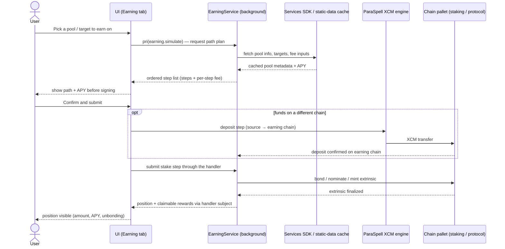

> **⚠️ Corrected 2026-07-13 — AD-07's mechanism does not exist.** Wherever this file says
> reads ride a *"lightweight WsProvider"* and that a full `ApiPromise` is deferred to
> extrinsic construction, that is inherited from [AD-07](../../ARCHITECTURE.md#architecture-decisions),
> which was **decided in 2022 and never implemented**: `SubstrateApi` builds a full
> `ApiPromise` eagerly per enabled chain and the read path reads off it. Every memory figure
> here (~72 MB / ~264 MB) is a 2022 MV2-era claim with **no probe behind it**. **NFR-11 has
> since been retired and [US-20.3](../stories/US-20.3-read-path-memory-budget.md) deprecated** — memory
> is no longer a stated requirement ([CONTEXT D95](../../CONTEXT.md) / D96). Treat every
> memory sentence in this file as historical. If a memory complaint appears: **measure
> first** ([LESSONS §64](../../LESSONS.md)).

## Goal

The earning epic owns the wallet's **yield surface** — every flow that lets a
holder put idle tokens to work and watch the position. It turns the abstract
`BasePoolHandler` tree the engine layer publishes into the screens a user
actually drives: native nomination and pool staking, collator/parachain and
dApp staking, liquid staking and lending, the Bittensor dTAO subnet model, plus
the multi-step earning-path simulation and the XCM-deposit routing that get
tokens to the chain where the yield lives. When this epic holds the line,
feature epics get to stop asking "how does a user stake, and how do we show
what they earn".

## Overview

### Business context

Before this epic the engine layer can *model* yield but the user cannot *act* on
it. [EPIC-2](EPIC-2.md) ([US-2.3](../stories/US-2.3-earningservice-pool-handler-engine.md))
ships `EarningService` as a `BasePoolHandler` inheritance tree
([AD-22](../../ARCHITECTURE.md#architecture-decisions)) that exposes positions,
targets and reward data over RxJS subjects — but it ships no screen. EPIC-12
owns the **earning write+read surface**: the staking and lending flows
(FR-114..FR-120), the earning-path simulation and step tracking that makes a
multi-step stake legible (FR-121), the XCM deposit routing that lands funds on
the earning chain (FR-122), and the forward roadmap of Bittensor alpha-token
products and additional-network staking (FR-123..FR-125).

This epic adds both a **write path** (submit stake / unstake / claim / withdraw
extrinsics through the handler tree) and the **earning read surface** (position
list, APY, claimable rewards, unbonding timers). It does **not** rebuild the
handler tree or the reward formulas — those are the engine's
(`services/earning-service/handlers/*`, AD-22). It also does not display the
*locked-for-staking* slice of a wallet balance on the home screen — that figure
is authored by the balance epic; EPIC-12 owns the staking-position breakdown,
not the home-screen locked total.

The architectural distinction this epic preserves: it owns **what the user does
to earn and what they see about a position**, not **how a yield mechanism is
modeled** (engine, EPIC-2/AD-22), not **how a cross-chain transfer is
constructed** (bridge/XCM engine, EPIC-13/AD-18 — EPIC-12 only *invokes* it as a
deposit step), and not **conviction-lock governance staking** (that is voting
power, not yield — owned by EPIC-15).

### Feature pillars

| # | Pillar | Stories | Purpose |
| --- | --- | --- | --- |
| 1 | **Native staking** | [US-12.1](../stories/US-12.1-native-nomination-staking-relay-and-parachains.md), [US-12.2](../stories/US-12.2-nomination-pool-staking.md), [US-12.3](../stories/US-12.3-collator-parachain-staking.md), [US-12.5](../stories/US-12.5-dapp-staking-astar.md) | Nomination, pool, collator/parachain and Astar dApp staking on the native pallet path |
| 2 | **Special staking & lending** | [US-12.4](../stories/US-12.4-liquid-staking-acala-bifrost-parallel-stellaswap.md), [US-12.7](../stories/US-12.7-lending-interlay.md) | Liquid-staking (LST) and Interlay lending via the special-pool handler |
| 3 | **Bittensor / dTAO** | [US-12.6](../stories/US-12.6-bittensor-dtao-subnet-staking.md), [US-12.10](../stories/US-12.10-bittensor-alpha-token-liquid-staking.md), [US-12.11](../stories/US-12.11-trusted-stake-alpha-index.md) | dTAO subnet staking plus the forward alpha-token product line |
| 4 | **Earning flow plumbing** | [US-12.8](../stories/US-12.8-earning-path-simulation-and-step-tracking.md), [US-12.9](../stories/US-12.9-xcm-deposit-routing-into-earning.md) | Multi-step path simulation/tracking and XCM deposit routing into a position |
| 5 | **Network expansion** | [US-12.12](../stories/US-12.12-staking-for-additional-networks-enjin-phala-xx.md) | Additional-network staking — planned (Enjin, Phala, xx, …); Mythos/Tanssi/Amplitude/Energy ship under FR-114 / US-12.1 |
| 6 | **Accuracy & load hardening** | [US-12.13](../stories/US-12.13-earning-reward-and-apy-accuracy-hardening.md), [US-12.14](../stories/US-12.14-earning-performance-and-cache-hardening.md) | Reward/APY-figure correctness (US-12.13) and earning-surface performance + cache freshness across many pools (US-12.14) |

### Out of scope

- **EarningService *engine* (the `BasePoolHandler` tree, reward formulas, RxJS subjects)** — owned by [EPIC-2](EPIC-2.md) ([US-2.3](../stories/US-2.3-earningservice-pool-handler-engine.md)) per [AD-22](../../ARCHITECTURE.md#architecture-decisions). EPIC-12 consumes the handler subjects and submits through them; it never adds a new conditional to shared engine logic — new protocols are new handler subclasses authored against the engine seam.
- **Home-screen display of locked / staked amounts** — owned by [EPIC-7](EPIC-7.md). The transferable-vs-locked split and the locked total on the portfolio screen are EPIC-7's; EPIC-12 owns the *staking-position* breakdown (which pool, what APY, claimable rewards, unbonding timers), not the home-screen locked figure.
- **The bridge / XCM transfer construction for a deposit step** — owned by [EPIC-13](EPIC-13.md) per [AD-18](../../ARCHITECTURE.md#architecture-decisions) (ParaSpell). EPIC-12's XCM-deposit routing ([US-12.9](../stories/US-12.9-xcm-deposit-routing-into-earning.md)) *invokes* that engine as a pre-step to land funds on the earning chain; it does not reimplement XCM `MultiLocation` construction.
- **Conviction-lock / governance staking** — owned by [EPIC-15](EPIC-15.md). Locking tokens for OpenGov conviction voting is *voting power*, not yield; it is not an earning position and does not appear in this epic's handler tree.
- **Bittensor alpha-token *bridges*** — owned by [EPIC-13](EPIC-13.md) (FR-133). EPIC-12 stakes/earns alpha; moving alpha across chains is a bridge concern.
- **In-wallet dTAO *swap* (TAO ↔ alpha, cross-subnet alpha)** — owned by [EPIC-11](EPIC-11.md) (FR-109). EPIC-12 stakes into subnets; the subnet AMM swap is the swap epic's.

## FR Coverage

| FR | Story | Status |
| ---- | ------- | -------- |
| FR-114 | [US-12.1](../stories/US-12.1-native-nomination-staking-relay-and-parachains.md) | ✅ done |
| FR-115 | [US-12.2](../stories/US-12.2-nomination-pool-staking.md) | ✅ done |
| FR-116 | [US-12.3](../stories/US-12.3-collator-parachain-staking.md) | ✅ done |
| FR-117 | [US-12.4](../stories/US-12.4-liquid-staking-acala-bifrost-parallel-stellaswap.md) | ✅ done |
| FR-118 | [US-12.5](../stories/US-12.5-dapp-staking-astar.md) | ✅ done |
| FR-119 | [US-12.6](../stories/US-12.6-bittensor-dtao-subnet-staking.md) | ✅ done |
| FR-120 | [US-12.7](../stories/US-12.7-lending-interlay.md) | ✅ done |
| FR-121 | [US-12.8](../stories/US-12.8-earning-path-simulation-and-step-tracking.md) | ✅ done |
| FR-122 | [US-12.9](../stories/US-12.9-xcm-deposit-routing-into-earning.md) | ✅ done |
| FR-123 | [US-12.10](../stories/US-12.10-bittensor-alpha-token-liquid-staking.md) | 📋 backlog |
| FR-124 | [US-12.11](../stories/US-12.11-trusted-stake-alpha-index.md) | 👀 review |
| FR-125 | [US-12.12](../stories/US-12.12-staking-for-additional-networks-enjin-phala-xx.md) | 📋 backlog |

> FR statuses above are **story-planning** statuses (Stream B; all `📋 backlog`).
> The shipped state of each capability lives in [PRD](../../PRD.md#functional-requirements): FR-114..122
> are `✅ shipped` (retroactive stories), and
> FR-123 / FR-124 / FR-125 are `📋 planned` (forward; two FR rows were
> absorbed/removed 2026-07-10 and the table renumbered gapless — see
> [2026-07-13-id-renumber](../../notes/2026-07-13-id-renumber.md)). FR-125
> (additional-network staking — Enjin / Phala / xx,
> [US-12.12](../stories/US-12.12-staking-for-additional-networks-enjin-phala-xx.md))
> is **📋 planned**: Enjin / Phala / xx have no code yet. The shipped Mythos /
> Tanssi / Amplitude / Energy native staking lives under **FR-114
> ([US-12.1](../stories/US-12.1-native-nomination-staking-relay-and-parachains.md))**
> — the native-nomination handler tree — not under FR-125. `done` +
> `version_shipped` are backfilled in version reconciliation. FR-7 (the
> EarningService *engine*) is owned by [EPIC-2](EPIC-2.md)
> ([US-2.3](../stories/US-2.3-earningservice-pool-handler-engine.md)) and is
> listed here only as the upstream dependency every story builds on.
> [US-12.13](../stories/US-12.13-earning-reward-and-apy-accuracy-hardening.md)
> (reward/APY-figure correctness) and
> [US-12.14](../stories/US-12.14-earning-performance-and-cache-hardening.md)
> (earning performance + cache freshness) are the epic's two hardening clusters
> and own no FR.

## AD Coverage

| AD | Title | Story |
| ---- | ------- | ------- |
| AD-22 | EarningService pool-handler class hierarchy | [US-12.1](../stories/US-12.1-native-nomination-staking-relay-and-parachains.md), [US-12.2](../stories/US-12.2-nomination-pool-staking.md), [US-12.3](../stories/US-12.3-collator-parachain-staking.md), [US-12.4](../stories/US-12.4-liquid-staking-acala-bifrost-parallel-stellaswap.md), [US-12.5](../stories/US-12.5-dapp-staking-astar.md), [US-12.7](../stories/US-12.7-lending-interlay.md), [US-12.13](../stories/US-12.13-earning-reward-and-apy-accuracy-hardening.md) |
| AD-15 | Bittensor integration model (dTAO / alpha-token, native Subtensor path) | [US-12.6](../stories/US-12.6-bittensor-dtao-subnet-staking.md), [US-12.10](../stories/US-12.10-bittensor-alpha-token-liquid-staking.md), [US-12.11](../stories/US-12.11-trusted-stake-alpha-index.md) |
| AD-18 | XCM delegated to ParaSpell (deposit-step routing) | [US-12.9](../stories/US-12.9-xcm-deposit-routing-into-earning.md) |
| AD-23 | Static-data caching for earning pool info / targets | [US-12.1](../stories/US-12.1-native-nomination-staking-relay-and-parachains.md), [US-12.8](../stories/US-12.8-earning-path-simulation-and-step-tracking.md), [US-12.14](../stories/US-12.14-earning-performance-and-cache-hardening.md) |
| AD-24 | Backend Services SDK for multi-chain data aggregation | [US-12.8](../stories/US-12.8-earning-path-simulation-and-step-tracking.md), [US-12.14](../stories/US-12.14-earning-performance-and-cache-hardening.md) |

> AD-22 is *referenced* throughout this epic for the handler seam the screens
> ride on; its primary implementation lives in [EPIC-2](EPIC-2.md)
> ([US-2.3](../stories/US-2.3-earningservice-pool-handler-engine.md)). AD-18's
> primary implementation lives in [EPIC-13](EPIC-13.md); EPIC-12 only consumes
> it as a deposit pre-step.

## Stories

| ID | Title | Goal | Status | Version |
| --- | --- | --- | --- | --- |
| [US-12.1](../stories/US-12.1-native-nomination-staking-relay-and-parachains.md) | Native nomination staking (relay + parachains) | Nominate validators and stake natively on Polkadot/Kusama and Substrate parachains | ✅ done | 0.4.7 |
| [US-12.2](../stories/US-12.2-nomination-pool-staking.md) | Nomination pool staking | Join / bond-extra / leave / withdraw a nomination pool on Polkadot/Kusama | ✅ done | 1.0.1 |
| [US-12.3](../stories/US-12.3-collator-parachain-staking.md) | Collator / parachain staking | Delegate to collators on Moonbeam/Astar/Amplitude/Mythos and compatible parachains | ✅ done | 0.5.3 |
| [US-12.4](../stories/US-12.4-liquid-staking-acala-bifrost-parallel-stellaswap.md) | Liquid staking (Acala/Bifrost/Parallel/StellaSwap) | Stake into LST protocols (Acala, Bifrost (+Bifrost-Manta), Parallel, StellaSwap stDOT) and receive a liquid derivative token | ✅ done | 1.1.36 |
| [US-12.5](../stories/US-12.5-dapp-staking-astar.md) | dApp staking (Astar) | Stake to dApps on Astar's dApp-staking program and claim rewards | ✅ done | 0.5.3 |
| [US-12.6](../stories/US-12.6-bittensor-dtao-subnet-staking.md) | Bittensor dTAO subnet staking | Stake TAO into a subnet via the native dTAO / alpha-token model | ✅ done | 1.3.25 |
| [US-12.7](../stories/US-12.7-lending-interlay.md) | Lending (Interlay) | Lend assets on Interlay to earn yield (distinct from liquid staking) | ✅ done | 1.1.36 |
| [US-12.8](../stories/US-12.8-earning-path-simulation-and-step-tracking.md) | Earning-path simulation & step tracking | Simulate a multi-step stake and track each step's status to completion | ✅ done | 1.1.36 |
| [US-12.9](../stories/US-12.9-xcm-deposit-routing-into-earning.md) | XCM deposit routing into earning | Route a cross-chain deposit so funds land on the chain where the yield lives | ✅ done | 1.1.36 |
| [US-12.10](../stories/US-12.10-bittensor-alpha-token-liquid-staking.md) | Bittensor alpha-token liquid staking | Liquid-stake Bittensor alpha tokens (forward roadmap) | 📋 backlog | — |
| [US-12.11](../stories/US-12.11-trusted-stake-alpha-index.md) | Trusted Stake (alpha index) | Stake into the Trusted Stake alpha-index integration (forward roadmap) | 👀 review | — |
| [US-12.12](../stories/US-12.12-staking-for-additional-networks-enjin-phala-xx.md) | Staking for additional networks (Enjin/Phala/xx) | Additional-network staking — Enjin/Phala/xx planned (Mythos/Tanssi/Amplitude/Energy ship under FR-114 / US-12.1) | 📋 backlog | — |
| [US-12.13](../stories/US-12.13-earning-reward-and-apy-accuracy-hardening.md) | Earning reward & APY-accuracy hardening | Keep reward/APY figures accurate across every pool type | 📋 backlog | — |
| [US-12.14](../stories/US-12.14-earning-performance-and-cache-hardening.md) | Earning performance & cache hardening | Keep the earning surface fast, memory-bounded and cache-fresh across many pools | 📋 backlog | — |
| [US-12.15](../stories/US-12.15-earning-term-and-condition-display.md) | Earning term & condition display | Display earning T&Cs before user commits to a staking/earning position | ✅ done | 1.3.83 |

> US-12.10/12/13 forward; US-12.12 (FR-125) is **planned** — its Enjin / Phala /
> xx batch is forward; the shipped Mythos / Tanssi / Amplitude / Energy native
> staking belongs to FR-114 / US-12.1, not this story). US-12.13 and US-12.14 are the epic's two hardening
> clusters and own no FR. US-12.13 defends reward/APY-figure **accuracy** at the
> AD-22 handler seam (issues #3527, #2708, #4135, #2975, #2755). US-12.14 defends
> the earning surface's **performance + cache freshness** NFRs (NFR-12,
> NFR-20, NFR-21) and absorbs the perf/stale-cache cluster around issues #2615,
> #2749 and #3328 — note #2615 is a performance + removed-account stale-cache
> issue and homes in US-12.14, not the accuracy story.

## Object map & user-story interactions

### US ↔ entity / subsystem matrix

| US | Primary entity / subsystem | FR |
| --- | --- | --- |
| [US-12.1](../stories/US-12.1-native-nomination-staking-relay-and-parachains.md) | `EarningService` `BaseNativeStakingPoolHandler` relay/para subjects + bond/nominate write flows; validator targets from the static-data cache (AD-23) | FR-114 |
| [US-12.2](../stories/US-12.2-nomination-pool-staking.md) | `NominationPoolHandler` branch + join / bond-extra / claim / unbond / withdraw pool flows | FR-115 |
| [US-12.3](../stories/US-12.3-collator-parachain-staking.md) | Parachain collator subclasses of `BaseNativeStakingPoolHandler` + delegate / bond-more / schedule+execute-unbond / claim | FR-116 |
| [US-12.4](../stories/US-12.4-liquid-staking-acala-bifrost-parallel-stellaswap.md) | `BaseSpecialStakingPoolHandler` → liquid-staking branch (`acala.ts` / `bifrost.ts` / `bifrost-manta.ts` / `parallel.ts` / `stella-swap.ts`) + mint/redeem derivative flows | FR-117 |
| [US-12.5](../stories/US-12.5-dapp-staking-astar.md) | Astar dApp-staking subclass of the native handler tree (period/era + multi-era claim) | FR-118 |
| [US-12.6](../stories/US-12.6-bittensor-dtao-subnet-staking.md) | Tao subnet-staking subclass on the native Subtensor path (`swapStakeLimit`, TAO↔alpha) — AD-15 | FR-119 |
| [US-12.7](../stories/US-12.7-lending-interlay.md) | `BaseSpecialStakingPoolHandler` → lending branch (`lending/interlay.ts`) + supply / withdraw money-market flows | FR-120 |
| [US-12.8](../stories/US-12.8-earning-path-simulation-and-step-tracking.md) | Earning-path simulate-then-track state machine over the handler step plan; fees via Services SDK (AD-24), pool metadata from static cache (AD-23) | FR-121 |
| [US-12.9](../stories/US-12.9-xcm-deposit-routing-into-earning.md) | XCM deposit step routed through the ParaSpell XCM engine (AD-18) and threaded into the multi-step path harness | FR-122 |
| [US-12.10](../stories/US-12.10-bittensor-alpha-token-liquid-staking.md) | Liquid-alpha handler subclass on the special-pool / Tao branch (mint/redeem on the native Subtensor path) — AD-15 | FR-123 |
| [US-12.11](../stories/US-12.11-trusted-stake-alpha-index.md) | Trusted Stake partner-curated alpha-index position (handler-backed) on the native Subtensor path | FR-124 |
| [US-12.12](../stories/US-12.12-staking-for-additional-networks-enjin-phala-xx.md) | New per-network staking handler subclasses (Enjin / Phala / xx) on the existing native tree; targets from static cache (AD-23) | FR-125 |
| [US-12.13](../stories/US-12.13-earning-reward-and-apy-accuracy-hardening.md) | Reward/APY-figure accuracy verified at the `BasePoolHandler` seam (AD-22) across every pool type | — |
| [US-12.14](../stories/US-12.14-earning-performance-and-cache-hardening.md) | Earning read-path performance + cache freshness: static cache (AD-23), Services SDK / lightweight WsProvider (AD-24 / AD-07), removed-account invalidation | — |

### End-to-end happy path

## Cross-cutting invariants

- **Extend the handler tree, never branch shared logic ([FR-7](../../PRD.md#functional-requirements), AD-22):** every new yield mechanism is a `BasePoolHandler` subclass (native / nomination-pool / special-staking), authored against the engine seam in [US-2.3](../stories/US-2.3-earningservice-pool-handler-engine.md) — no earning screen adds a per-protocol conditional to shared service logic. Enforced across [US-12.1](../stories/US-12.1-native-nomination-staking-relay-and-parachains.md)–[US-12.7](../stories/US-12.7-lending-interlay.md).
- **Earning data is read through the handler subjects ([FR-7](../../PRD.md#functional-requirements), AD-22):** positions, APY, claimable rewards and unbonding state come from the `EarningService` RxJS subjects, not re-derived per screen; the screen subscribes, it does not recompute. Enforced by every story in the epic.
- **XCM deposit reuses the bridge engine (AD-18):** an earning flow that needs funds on another chain composes the deposit step through the ParaSpell-backed XCM engine ([EPIC-13](EPIC-13.md)), never a bespoke per-route transfer. Enforced by [US-12.9](../stories/US-12.9-xcm-deposit-routing-into-earning.md).
- **Multi-step stakes are resumable, never silently lost ([FR-121](../../PRD.md#functional-requirements)):** a stake that needs deposit→bond→nominate steps tracks each step's status; a flow interrupted mid-path is recoverable and clearly surfaced, never reported as a vanished balance. Enforced by [US-12.8](../stories/US-12.8-earning-path-simulation-and-step-tracking.md).
- **Heavy pool data is served from the static cache (AD-23, NFR-21):** earning pool info, validator/collator targets and config are read through `fetchStaticData` / the static-content cache rather than polled live per render — live RPC for these would hammer the chain and stall the earning list. Defended by [US-12.14](../stories/US-12.14-earning-performance-and-cache-hardening.md).

## Cross-story testing requirements

| Pattern | Stories that apply | Shared infra |
| --- | --- | --- |
| **Pool-handler subject fixture** | [US-12.1](../stories/US-12.1-native-nomination-staking-relay-and-parachains.md), [US-12.2](../stories/US-12.2-nomination-pool-staking.md), [US-12.3](../stories/US-12.3-collator-parachain-staking.md), [US-12.4](../stories/US-12.4-liquid-staking-acala-bifrost-parallel-stellaswap.md), [US-12.5](../stories/US-12.5-dapp-staking-astar.md), [US-12.6](../stories/US-12.6-bittensor-dtao-subnet-staking.md), [US-12.7](../stories/US-12.7-lending-interlay.md) | A mock `EarningService` RxJS subject (position + APY + claimable + unbonding, per pool type) reused by every earning-screen render test |
| **Multi-step path harness** | [US-12.8](../stories/US-12.8-earning-path-simulation-and-step-tracking.md), [US-12.9](../stories/US-12.9-xcm-deposit-routing-into-earning.md) | A step-status state machine fixture (simulate → submit → track → resume-after-interrupt) the path-tracking + XCM-deposit stories share |
| **Static earning-data mock** | [US-12.1](../stories/US-12.1-native-nomination-staking-relay-and-parachains.md), [US-12.8](../stories/US-12.8-earning-path-simulation-and-step-tracking.md), [US-12.14](../stories/US-12.14-earning-performance-and-cache-hardening.md) | A stub `fetchStaticData` earning-pool/targets endpoint (fresh + stale + missing) for cache/load + degraded-source tests |

> The first native-staking story (US-12.1) sets up the pool-handler subject
> fixture; the remaining staking stories import it rather than rebuilding. The
> multi-step path harness is set up by US-12.8 and reused by US-12.9.
>
> **Cross-reference**: executable scenarios for this epic live in
> [`docs/tests/test-cases/EPIC-12.md`](../../tests/test-cases/) once authored;
> the patterns above declare the *harness*, the test-cases file owns the
> *scenarios*.

## Performance budgets & invariants

| Concern | Budget | Story | Rationale |
| --- | --- | --- | --- |
| **Earning list first paint** | Cached positions visible ≤ 300 ms on popup open (NFR-12) | [US-12.14](../stories/US-12.14-earning-performance-and-cache-hardening.md) | The earning tab is a daily surface; a blank wait while many pool subjects resolve reads as a broken wallet |
| **Pool data fetch** | Pool info / targets read from static cache, not live RPC per render (NFR-21, AD-23) | [US-12.14](../stories/US-12.14-earning-performance-and-cache-hardening.md) | Live per-render RPC across many pools rate-limits the chain and stalls the list |
| **Earning aggregation memory** | Read path stays on the lightweight WsProvider / Services-SDK aggregation (≤ 72 MB, NFR-11) | [US-12.14](../stories/US-12.14-earning-performance-and-cache-hardening.md) | Instantiating a full ApiPromise per earning chain to read positions blows the memory budget |

## Acceptance criteria (propagated from stories)

- [ ] A user can nominate validators and stake natively on relay chains and parachains — [US-12.1](../stories/US-12.1-native-nomination-staking-relay-and-parachains.md)
- [ ] A user can join, bond-extra, leave and withdraw from a nomination pool — [US-12.2](../stories/US-12.2-nomination-pool-staking.md)
- [ ] A user can delegate to collators on supported parachains — [US-12.3](../stories/US-12.3-collator-parachain-staking.md)
- [ ] A user can liquid-stake into an LST protocol (Acala, Bifrost (+Bifrost-Manta), Parallel, StellaSwap stDOT) and hold the derivative token — [US-12.4](../stories/US-12.4-liquid-staking-acala-bifrost-parallel-stellaswap.md)
- [ ] A user can stake to dApps on Astar and claim rewards — [US-12.5](../stories/US-12.5-dapp-staking-astar.md)
- [ ] A user can stake TAO into a Bittensor subnet via the native dTAO model — [US-12.6](../stories/US-12.6-bittensor-dtao-subnet-staking.md)
- [ ] A user can lend assets on Interlay to earn yield — [US-12.7](../stories/US-12.7-lending-interlay.md)
- [ ] A multi-step stake is simulated, each step is tracked, and an interrupted flow is resumable — [US-12.8](../stories/US-12.8-earning-path-simulation-and-step-tracking.md)
- [ ] An earning deposit on another chain is routed via XCM so funds land where the yield lives — [US-12.9](../stories/US-12.9-xcm-deposit-routing-into-earning.md)
- [ ] A user can liquid-stake Bittensor alpha tokens — [US-12.10](../stories/US-12.10-bittensor-alpha-token-liquid-staking.md) (planned)
- [ ] A user can stake into the Trusted Stake alpha index — [US-12.11](../stories/US-12.11-trusted-stake-alpha-index.md) (planned)
- [ ] A user can stake on additional networks — Enjin, Phala, xx, … (planned) — [US-12.12](../stories/US-12.12-staking-for-additional-networks-enjin-phala-xx.md) (Mythos/Tanssi/Amplitude/Energy ship under FR-114 / US-12.1)
- [ ] Reward/APY figures stay accurate across every pool type (validator APY, claimable rewards, post-claim re-render, all-method coverage, earning preview) — [US-12.13](../stories/US-12.13-earning-reward-and-apy-accuracy-hardening.md)
- [ ] The earning surface stays fast, memory-bounded and cache-fresh across many pools (cached-first paint, static-cache reads, removed-account invalidation) — [US-12.14](../stories/US-12.14-earning-performance-and-cache-hardening.md)
