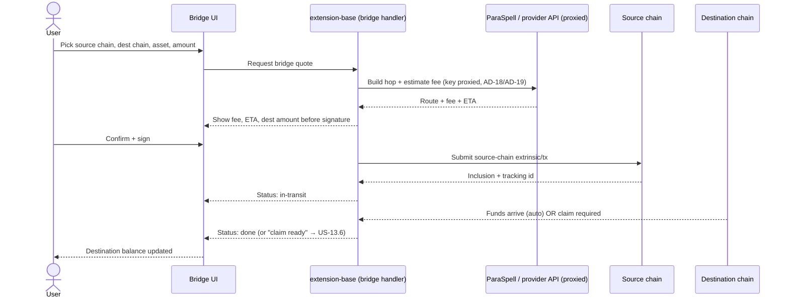

## Goal

The bridge-xcm epic owns **moving a token from the chain it is on to the chain
the user needs it on** — one hop, end to end. It turns the wallet's 200+
networks from isolated balances into a connected graph: XCM transfers between
Polkadot/Kusama parachains, external bridges to and from Ethereum (Snowbridge,
Avail, Polygon Unified Bridge, Across), the Bittensor TAO ↔ Subtensor-EVM
native bridge, and the destination-chain claim step that finalizes the
asynchronous bridges. When this epic holds the line, every higher feature —
cross-chain swap routing (EPIC-11), XCM deposit into earning (EPIC-12) — gets
to stop worrying about *how* a cross-chain hop is constructed, signed, and
tracked, and just consume "move asset A from chain X to chain Y" as a verb.

## Overview

### Business context

Before this epic the wallet can read balances across every chain (EPIC-7) and
build per-chain transactions (EPIC-2/EPIC-8), but it cannot *move* a token
across a chain boundary. A user holding DOT on the Relay Chain who needs it on
Asset Hub, or ETH on Ethereum they want as a wrapped asset on Polkadot, has no
in-wallet path. EPIC-13 closes that gap: it owns the **cross-chain write path**
— the construction, fee estimation, submission, and status tracking of a single
bridge or XCM hop — across both the native-XCM substrate world and a set of
external bridge providers that each speak a different protocol.

The architectural posture this epic preserves is **never reimplement XCM**.
Bridge and XCM construction is delegated to the ParaSpell API
([AD-18](../../ARCHITECTURE.md#architecture-decisions)) and upgraded through its
versions (v4 → v5 → v1 API) rather than built or forked in-house; forking XCM
logic would mean tracking every Polkadot runtime upgrade ourselves, and the
official API inherits ParaSpell's ecosystem tracking for free. Route quotes and
multi-chain assembly flow through the Services SDK backend
([AD-24](../../ARCHITECTURE.md#architecture-decisions)); the ParaSpell key is
proxied, never bundled ([AD-19](../../ARCHITECTURE.md#architecture-decisions),
NFR-16). And every XCM route is individually toggleable at runtime via the
online chain-list ([AD-09](../../ARCHITECTURE.md#architecture-decisions),
NFR-15) so a compromised partner chain can be disabled without an extension
release.

The distinction this epic draws — and the one most-cited in sibling Dev Notes —
is **bridge owns the hop; swap owns the routing**. EPIC-13 ships the primitive
that moves an asset across one boundary. The decision to chain a swap with a
bridge into a multi-hop cross-chain swap (Swap→Bridge / Bridge→Swap) lives in
[EPIC-11](EPIC-11.md) ([US-11.8](../stories/US-11.8-cross-chain-swap-routing.md))
— the exact mirror of US-11.8's own boundary, which states it "reuses the bridge
engine (AD-18 / EPIC-13), not a bespoke per-pair path". This epic does not route;
it bridges.

### Feature pillars

| # | Pillar | Stories | Purpose |
|---|---|---|---|
| 1 | **Native XCM** | [US-13.1](../stories/US-13.1-xcm-parachain-transfers.md) | XCM transfers between Polkadot/Kusama parachains with fee estimation and the per-route runtime toggle — the base every other bridge story is sized against |
| 2 | **Ethereum bridges** | [US-13.2](../stories/US-13.2-snowbridge-eth-asset-hub.md), [US-13.3](../stories/US-13.3-avail-bridge.md), [US-13.4](../stories/US-13.4-polygon-unified-bridge.md), [US-13.5](../stories/US-13.5-across-protocol.md) | Each external bridge provider connecting Polkadot/EVM chains to and from Ethereum |
| 3 | **Bridge finalization** | [US-13.6](../stories/US-13.6-bridge-claim-withdrawal-step.md) | The destination-chain claim / withdrawal step that finalizes asynchronous bridges (Avail, Polygon) |
| 4 | **Bittensor bridges** | [US-13.7](../stories/US-13.7-bittensor-tao-subtensor-evm-bridge.md), [US-13.8](../stories/US-13.8-bittensor-alpha-token-bridges.md) | TAO ↔ Subtensor-EVM native bridge (shipped) and the planned alpha-token bridge family |
| 5 | **Roadmap bridges** | [US-13.9](../stories/US-13.9-hyperbridge.md), [US-13.10](../stories/US-13.10-axelar-cross-chain.md) | Forward-looking provider integrations (Hyperbridge, Axelar) |
| 6 | **Bridge reliability hardening** | [US-13.11](../stories/US-13.11-xcm-runtime-upgrade-paraspell-version-hardening.md) | Surviving Polkadot runtime upgrades and ParaSpell version drift, and fixing the real-world async-bridge claim / error-surfacing / fee-re-query failures, without breaking live routes |

### Out of scope

- **Cross-chain swap *routing* (Swap→Bridge / Bridge→Swap multi-hop composition)** — owned by [EPIC-11](EPIC-11.md) ([US-11.8](../stories/US-11.8-cross-chain-swap-routing.md)). Swap owns the routing; bridge owns the hop. EPIC-13 ships the single cross-chain hop; the decision to chain it with a same-chain swap into a resumable multi-hop route lives in EPIC-11. This is the mirror of US-11.8's stated boundary.
- **The SwapService routing engine itself** — owned by [EPIC-2](EPIC-2.md) ([US-2.4](../stories/US-2.4-swapservice-routing-engine.md)). The per-provider handler abstraction that produces quotes and multi-step routes is engine-layer infrastructure; EPIC-13 supplies the bridge step it composes, it does not build the routing engine.
- **XCM deposit *into earning* positions** — owned by [EPIC-12](EPIC-12.md) ([US-12.9](../stories/US-12.9-xcm-deposit-routing-into-earning.md)). EPIC-12's US-12.9 *consumes* this bridge to route a cross-chain deposit into a staking position; EPIC-13 provides the XCM hop, EPIC-12 owns the earning-side intent and step tracking.
- **Fiat on-/off-ramp** — owned by [EPIC-14](EPIC-14.md). Funding the wallet from a card or selling to fiat is a gateway flow, not a chain-to-chain bridge; EPIC-13 only moves assets that are already on-chain.

## FR Coverage

| FR | Story | Status |
|----|-------|--------|
| FR-126 | [US-13.1](../stories/US-13.1-xcm-parachain-transfers.md) | ✅ done |
| FR-127 | [US-13.2](../stories/US-13.2-snowbridge-eth-asset-hub.md) | ✅ done |
| FR-128 | [US-13.3](../stories/US-13.3-avail-bridge.md) | ✅ done |
| FR-129 | [US-13.4](../stories/US-13.4-polygon-unified-bridge.md) | ✅ done |
| FR-130 | [US-13.5](../stories/US-13.5-across-protocol.md) | ✅ done |
| FR-131 | [US-13.6](../stories/US-13.6-bridge-claim-withdrawal-step.md) | ✅ done |
| FR-132 | [US-13.7](../stories/US-13.7-bittensor-tao-subtensor-evm-bridge.md) | ✅ done |
| FR-133 | [US-13.8](../stories/US-13.8-bittensor-alpha-token-bridges.md) | 📋 backlog |
| FR-134 | [US-13.9](../stories/US-13.9-hyperbridge.md) | 📋 backlog |
| FR-135 | [US-13.10](../stories/US-13.10-axelar-cross-chain.md) | 📋 backlog |

> FR statuses above are **story-planning** statuses (Stream B; all `📋 backlog`).
> The shipped state of each capability lives in [PRD](../../PRD.md#functional-requirements): FR-126..134 are
> `✅ shipped` (retroactive stories), FR-133/136/137 are `📋 planned` (forward).
> `done` + `version_shipped` are backfilled in version reconciliation. US-13.11 is a
> bridge-reliability hardening cluster and owns no FR — it defends the
> ParaSpell-delegation invariant (AD-18) and the async-bridge claim/finalization
> reliability (AD-24, US-13.6) against real reported issues.

## AD Coverage

| AD | Title | Story |
|----|-------|-------|
| AD-18 | XCM delegated to ParaSpell (build-vs-buy) | [US-13.1](../stories/US-13.1-xcm-parachain-transfers.md), [US-13.11](../stories/US-13.11-xcm-runtime-upgrade-paraspell-version-hardening.md) |
| AD-09 | Per-chain XCM route toggle | [US-13.1](../stories/US-13.1-xcm-parachain-transfers.md) |
| AD-24 | Backend Services SDK for multi-chain data aggregation | [US-13.1](../stories/US-13.1-xcm-parachain-transfers.md), [US-13.6](../stories/US-13.6-bridge-claim-withdrawal-step.md), [US-13.11](../stories/US-13.11-xcm-runtime-upgrade-paraspell-version-hardening.md) |
| AD-19 | Backend proxy for third-party API keys | [US-13.2](../stories/US-13.2-snowbridge-eth-asset-hub.md), [US-13.5](../stories/US-13.5-across-protocol.md) |

> AD-24 and AD-19 are *referenced* here for the data-aggregation and key-proxy
> paths the bridges ride on; their primary implementation lives in
> [EPIC-2](EPIC-2.md) / the platform layer. EPIC-13 consumes them. AD-18 and
> AD-09 are *anchored* here — this is the epic that materializes ParaSpell
> delegation and the per-route runtime toggle.

## Stories

| ID | Title | Goal | Status | Version |
|---|---|---|---|---|
| [US-13.1](../stories/US-13.1-xcm-parachain-transfers.md) | XCM parachain transfers (fee est + per-route toggle) | Move tokens between Polkadot/Kusama parachains via ParaSpell-built XCM with fee estimation and per-route runtime toggle | ✅ done | 0.4.4 |
| [US-13.2](../stories/US-13.2-snowbridge-eth-asset-hub.md) | Snowbridge (ETH ↔ Asset Hub) | Bridge assets between Ethereum and Polkadot Asset Hub via Snowbridge | ✅ done | 1.2.9 |
| [US-13.3](../stories/US-13.3-avail-bridge.md) | Avail bridge (Avail ↔ Ethereum) | Bridge assets between Avail and Ethereum | ✅ done | 1.3.4 |
| [US-13.4](../stories/US-13.4-polygon-unified-bridge.md) | Polygon Unified Bridge (Polygon ↔ Ethereum) | Bridge assets between Polygon and Ethereum via the Polygon Unified Bridge | ✅ done | 1.3.8 |
| [US-13.5](../stories/US-13.5-across-protocol.md) | Across protocol cross-chain bridge | Bridge assets via the Across intent-based protocol (Bridge-Swap-Bridge routing) | ✅ done | 1.3.31 |
| [US-13.6](../stories/US-13.6-bridge-claim-withdrawal-step.md) | Bridge claim / withdrawal step | Finalize asynchronous bridges (Avail, Polygon) with a destination-chain claim step | ✅ done | 1.3.4 |
| [US-13.7](../stories/US-13.7-bittensor-tao-subtensor-evm-bridge.md) | Bittensor TAO ↔ Subtensor-EVM bridge | Move TAO between the native Subtensor chain and Subtensor-EVM, bidirectionally | ✅ done | 1.3.78 |
| [US-13.8](../stories/US-13.8-bittensor-alpha-token-bridges.md) | Bittensor alpha-token bridges | Planned alpha-token bridge family (alpha ↔ Subtensor-EVM; xTAO/xAlpha → Base) | 📋 backlog | — |
| [US-13.9](../stories/US-13.9-hyperbridge.md) | Hyperbridge integration | Planned Hyperbridge cross-chain provider integration | 📋 backlog | — |
| [US-13.10](../stories/US-13.10-axelar-cross-chain.md) | Axelar cross-chain integration | Planned Axelar cross-chain provider integration | 📋 backlog | — |
| [US-13.11](../stories/US-13.11-xcm-runtime-upgrade-paraspell-version-hardening.md) | XCM & bridge reliability hardening (runtime-upgrade & ParaSpell-version) | Keep XCM/bridge routes working and funds recoverable across runtime upgrades, ParaSpell version drift, and the real-world claim / error-surfacing / fee-re-query failures of the async bridges | 📋 backlog | — |

> US-13.1–13.10 each materialize one FR (US-13.1–13.7 retroactive; US-13.8–13.10
> forward); US-13.11 is the epic's bridge-reliability hardening cluster and owns no
> FR — it defends the ParaSpell-delegation invariant (AD-18) and the async-bridge
> claim/finalization reliability (AD-24, US-13.6) against real reported issues.

## Object map & user-story interactions

### US ↔ entity / subsystem matrix

| US | Primary entity / subsystem | FR |
|---|---|---|
| [US-13.1](../stories/US-13.1-xcm-parachain-transfers.md) | XCM transfer builder (ParaSpell) + per-route toggle | FR-126 |
| [US-13.2](../stories/US-13.2-snowbridge-eth-asset-hub.md) | Snowbridge provider handler | FR-127 |
| [US-13.3](../stories/US-13.3-avail-bridge.md) | Avail bridge provider handler | FR-128 |
| [US-13.4](../stories/US-13.4-polygon-unified-bridge.md) | Polygon Unified Bridge provider handler | FR-129 |
| [US-13.5](../stories/US-13.5-across-protocol.md) | Across protocol provider handler | FR-130 |
| [US-13.6](../stories/US-13.6-bridge-claim-withdrawal-step.md) | Destination-chain claim/withdrawal step | FR-131 |
| [US-13.7](../stories/US-13.7-bittensor-tao-subtensor-evm-bridge.md) | Bittensor TAO↔EVM native bridge handler | FR-132 |
| [US-13.8](../stories/US-13.8-bittensor-alpha-token-bridges.md) | Bittensor alpha-token bridge handlers | FR-133 |
| [US-13.9](../stories/US-13.9-hyperbridge.md) | Hyperbridge provider handler | FR-134 |
| [US-13.10](../stories/US-13.10-axelar-cross-chain.md) | Axelar provider handler | FR-135 |
| [US-13.11](../stories/US-13.11-xcm-runtime-upgrade-paraspell-version-hardening.md) | ParaSpell/runtime resilience + bridge claim / error-surfacing / fee-re-query reliability | — |

### End-to-end happy path

**Branches not shown:** a disabled XCM route (per-route toggle, AD-09) is hidden
before quote; a stalled relay / never-arriving bridge surfaces as in-transit with
recovery guidance; an async bridge that requires an explicit claim hands off to
the destination-chain claim step ([US-13.6](../stories/US-13.6-bridge-claim-withdrawal-step.md)).

## Cross-cutting invariants

- **Never reimplement XCM ([AD-18](../../ARCHITECTURE.md#architecture-decisions)):** every XCM/bridge hop is constructed via the ParaSpell API (and the per-provider bridge SDKs), never hand-rolled `MultiLocation` encoding maintained in-house. New bridge stories add a provider handler behind the shared interface; they do not fork XCM logic. Anchored by [US-13.1](../stories/US-13.1-xcm-parachain-transfers.md), defended across version drift by [US-13.11](../stories/US-13.11-xcm-runtime-upgrade-paraspell-version-hardening.md).
- **Per-route runtime toggle ([NFR-15](../../PRD.md#non-functional-requirements), [AD-09](../../ARCHITECTURE.md#architecture-decisions)):** every XCM route is individually disable-able at runtime via the online chain-list update, with no extension release. A disabled route MUST NOT be quotable, selectable, or submittable; toggling one route never affects another. This is the key safety invariant of the epic (rapid response to a partner-chain incident, e.g. Acala 2022). Enforced and regression-guarded by [US-13.1](../stories/US-13.1-xcm-parachain-transfers.md).
- **Fee + ETA shown before any signature:** no bridge or XCM hop is submitted before the user has seen the estimated fee, destination amount, and estimated time. A quote that cannot be produced fails closed (no silent best-effort submit). Enforced by every provider story; anchored by [US-13.1](../stories/US-13.1-xcm-parachain-transfers.md).
- **Provider keys are proxied, never bundled ([NFR-16](../../PRD.md#non-functional-requirements), [AD-19](../../ARCHITECTURE.md#architecture-decisions)):** ParaSpell XCM and keyed bridge providers are reached through SubWallet-hosted backends; no provider API key ships in the extension bundle. Enforced by [US-13.2](../stories/US-13.2-snowbridge-eth-asset-hub.md), [US-13.5](../stories/US-13.5-across-protocol.md) and every keyed-provider story.
- **In-transit funds are never reported as lost:** an asynchronous bridge that has left the source chain but not yet arrived (or that stalls) is surfaced as in-transit / claim-pending with recovery guidance — never as a failed transfer with vanished balance. Enforced by [US-13.6](../stories/US-13.6-bridge-claim-withdrawal-step.md), upheld by every async-bridge story.

## Cross-story testing requirements

| Pattern | Stories that apply | Shared infra |
|---|---|---|
| **Bridge provider-handler fixture** | [US-13.2](../stories/US-13.2-snowbridge-eth-asset-hub.md), [US-13.3](../stories/US-13.3-avail-bridge.md), [US-13.4](../stories/US-13.4-polygon-unified-bridge.md), [US-13.5](../stories/US-13.5-across-protocol.md), [US-13.7](../stories/US-13.7-bittensor-tao-subtensor-evm-bridge.md) | A mock provider handler (quote → fee/ETA → submit → track) so each external-bridge story tests the same lifecycle contract without a live provider |
| **Per-route-toggle harness** | [US-13.1](../stories/US-13.1-xcm-parachain-transfers.md) | A test that flips a route off in the online chain-list fixture and asserts it becomes non-quotable / non-submittable while siblings stay live |
| **Async-claim state machine** | [US-13.3](../stories/US-13.3-avail-bridge.md), [US-13.4](../stories/US-13.4-polygon-unified-bridge.md), [US-13.6](../stories/US-13.6-bridge-claim-withdrawal-step.md) | A fixture driving in-transit → claim-ready → claimed (and the stalled path) reused by every bridge with a destination-chain claim step |

> US-13.1 sets up the per-route-toggle harness; US-13.2 sets up the bridge
> provider-handler fixture and US-13.3–13.7 import it rather than rebuilding.
> US-13.6 owns the async-claim state machine; the async bridges (US-13.3,
> US-13.4) consume it.

## Performance budgets & invariants

| Concern | Budget | Story | Rationale |
|---|---|---|---|
| **Bridge quote** | Fee + ETA returned ≤ 1 round-trip through the proxied provider per quote request | [US-13.1](../stories/US-13.1-xcm-parachain-transfers.md) | Per-quote upstream fan-out cascades into provider rate-limit exposure (NFR-16) |
| **Route-toggle propagation** | A route disabled in the online chain-list is hidden on next chain-list refresh with no extension release | [US-13.1](../stories/US-13.1-xcm-parachain-transfers.md) | The whole point of AD-09 is incident response in minutes, not a release cycle |

## Acceptance criteria (propagated from stories)

- [ ] A user can move tokens between Polkadot/Kusama parachains via ParaSpell-built XCM, sees the fee/ETA before signing, and disabled routes are not selectable — [US-13.1](../stories/US-13.1-xcm-parachain-transfers.md)
- [ ] A user can bridge between Ethereum and Polkadot Asset Hub via Snowbridge — [US-13.2](../stories/US-13.2-snowbridge-eth-asset-hub.md)
- [ ] A user can bridge between Avail and Ethereum — [US-13.3](../stories/US-13.3-avail-bridge.md)
- [ ] A user can bridge between Polygon and Ethereum via the Polygon Unified Bridge — [US-13.4](../stories/US-13.4-polygon-unified-bridge.md)
- [ ] A user can bridge via the Across protocol — [US-13.5](../stories/US-13.5-across-protocol.md)
- [ ] A user can finalize an asynchronous bridge with a destination-chain claim step, and in-transit funds are never reported lost — [US-13.6](../stories/US-13.6-bridge-claim-withdrawal-step.md)
- [ ] A user can move TAO between the native Subtensor chain and Subtensor-EVM bidirectionally — [US-13.7](../stories/US-13.7-bittensor-tao-subtensor-evm-bridge.md)
- [ ] A user can use the Bittensor alpha-token bridges — [US-13.8](../stories/US-13.8-bittensor-alpha-token-bridges.md) (planned)
- [ ] A user can bridge via Hyperbridge — [US-13.9](../stories/US-13.9-hyperbridge.md) (planned)
- [ ] A user can bridge via Axelar — [US-13.10](../stories/US-13.10-axelar-cross-chain.md) (planned)
- [ ] XCM/bridge routes survive Polkadot runtime upgrades and ParaSpell version bumps, the async-bridge claims complete (AVAIL, Polygon zkEVM), bridge errors are legible, and the Snowbridge fee is re-queried at submit — [US-13.11](../stories/US-13.11-xcm-runtime-upgrade-paraspell-version-hardening.md)
