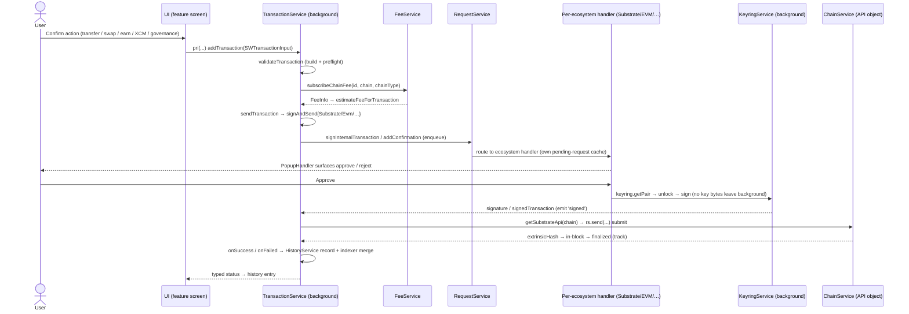

## Goal

This epic ships **no end-user feature on its own**. Its deliverable is the set
of distinctive engine modules that power every wallet feature — the
Unified-Account keyring, ChainService, EarningService, SwapService, the balance
and fee engines, the RequestService approval queue and the transaction lifecycle
engine. When these contracts hold, the feature epics (account, transfer, swap,
earning, dApp, transaction) get to stop re-deriving multi-chain correctness,
key-isolation and approval plumbing for themselves and simply consume the
engines underneath.

## Overview

### Business context

Before this epic the wallet's hardest-won code has no home in the story/review
map. These engines rarely surface a single user-facing issue, yet they decide
multi-chain correctness across 200+ networks, the memory/performance envelope,
and the non-custodial security boundary. Cataloguing them as FRs keeps them in
scope for stories and reviews instead of being treated as invisible plumbing.

This epic owns the **shared engine layer** — the reusable services and class
hierarchies that sit between raw runtime mechanics and product features. Each
story is one engine: its module (package), its responsibility, and the
Architecture Decision it realizes. Stories here are *contract* stories — they
describe the seam other epics build on, not a screen a user touches.

The architectural distinction this epic preserves: **generic plumbing and pure
runtime mechanics — the message bus, service-worker lifecycle, storage layer and
event system — are documented in [ARCHITECTURE](../../ARCHITECTURE.md), not
here.** And **user-facing behaviour lives in the feature epics**: the account
flows in [EPIC-3](EPIC-3.md), transfers/swaps/earning/dApp/transaction UX in
their respective feature epics. EPIC-2 catalogues only the distinctive engines
those features reuse.

### Feature pillars

| # | Pillar | Stories | Purpose |
|---|---|---|---|
| 1 | **Identity & keys** | [US-2.1](../stories/US-2.1-unified-account-keyring-engine.md) | One seed → five ecosystems under a single account, confined to the background |
| 2 | **Chain connectivity** | [US-2.2](../stories/US-2.2-chainservice-live-api-per-chain.md) | A live, memory-bounded API object per network across 200+ chains |
| 3 | **Yield & swap routing** | [US-2.3](../stories/US-2.3-earningservice-pool-handler-engine.md), [US-2.4](../stories/US-2.4-swapservice-routing-engine.md) | Extensible pool-handler tree and per-provider swap routing behind one interface |
| 4 | **Data engines** | [US-2.5](../stories/US-2.5-balance-detection-and-aggregation-engine.md), [US-2.6](../stories/US-2.6-fee-engine.md) | Cross-chain balance aggregation and cross-ecosystem fee estimation |
| 5 | **Approval & execution** | [US-2.7](../stories/US-2.7-requestservice-approval-queue.md), [US-2.8](../stories/US-2.8-transaction-lifecycle-engine.md) | One confirmation queue for every dApp/signature request; one status machine for every transaction |

### Out of scope

- **Account creation / import / management UX** — owned by [EPIC-3](EPIC-3.md). EPIC-2 ships the keyring *engine*; the onboarding flows that drive it live there.
- **User-facing transfer / swap / earning / dApp screens** — owned by their respective feature epics. EPIC-2 ships the engines (SwapService, EarningService, transaction lifecycle); the screens that call them belong to the feature epics.
- **Master password / lock / unlock policy** — owned by [EPIC-5](EPIC-5.md) (security). The keyring engine *consumes* that gate; it does not define it.
- **Message bus, service-worker lifecycle, storage layer, event system** — generic runtime plumbing, documented in [ARCHITECTURE](../../ARCHITECTURE.md), not catalogued as engine FRs here.
- **Hardware-wallet signing** — owned by [EPIC-16](EPIC-16.md). The keyring delegates device signing rather than holding those keys.

## FR Coverage

| FR | Story | Status |
|----|-------|--------|
| FR-5 | [US-2.1](../stories/US-2.1-unified-account-keyring-engine.md) | 📋 backlog |
| FR-6 | [US-2.2](../stories/US-2.2-chainservice-live-api-per-chain.md) | 📋 backlog |
| FR-7 | [US-2.3](../stories/US-2.3-earningservice-pool-handler-engine.md) | 📋 backlog |
| FR-8 | [US-2.4](../stories/US-2.4-swapservice-routing-engine.md) | 📋 backlog |
| FR-9 | [US-2.5](../stories/US-2.5-balance-detection-and-aggregation-engine.md) | 📋 backlog |
| FR-10 | [US-2.6](../stories/US-2.6-fee-engine.md) | 📋 backlog |
| FR-11 | [US-2.7](../stories/US-2.7-requestservice-approval-queue.md) | 📋 backlog |
| FR-12 | [US-2.8](../stories/US-2.8-transaction-lifecycle-engine.md) | 📋 backlog |

> FR statuses below are **story-planning** statuses (Stream B; all `📋 backlog`).
> The real shipped state is `🟢 Shipped — 8/8 FRs` in [PRD](../../PRD.md#functional-requirements); every
> story here is **retroactive** (already shipped), with `done` + `version_shipped`
> backfilled during version reconciliation.

## AD Coverage

| AD | Title | Story |
|----|-------|-------|
| AD-11 | Unified multi-chain account model | [US-2.1](../stories/US-2.1-unified-account-keyring-engine.md) |
| AD-04 | Non-custodial keyring confined to background | [US-2.1](../stories/US-2.1-unified-account-keyring-engine.md) |
| AD-02 | ChainService per-chain API objects | [US-2.2](../stories/US-2.2-chainservice-live-api-per-chain.md) |
| AD-07 | Lightweight WsProvider for balance queries | [US-2.2](../stories/US-2.2-chainservice-live-api-per-chain.md), [US-2.5](../stories/US-2.5-balance-detection-and-aggregation-engine.md) |
| AD-22 | EarningService pool-handler class hierarchy | [US-2.3](../stories/US-2.3-earningservice-pool-handler-engine.md) |
| AD-24 | Backend Services SDK for multi-chain data aggregation | [US-2.5](../stories/US-2.5-balance-detection-and-aggregation-engine.md) |
| AD-21 | Per-ecosystem request-handler abstraction in RequestService | [US-2.7](../stories/US-2.7-requestservice-approval-queue.md) |

> AD-24 also underpins SwapService routing ([US-2.4](../stories/US-2.4-swapservice-routing-engine.md)),
> which sources quotes/routes through the Services SDK; its primary materialization
> is the balance/data-aggregation story (US-2.5). SwapService itself introduces no
> new AD — it is a per-provider handler abstraction over the SDK data plane.

## Stories

| ID | Title | Goal | Status | Version |
|---|---|---|---|---|
| [US-2.1](../stories/US-2.1-unified-account-keyring-engine.md) | Unified-Account keyring engine | One seed derived into addresses across five ecosystems, confined to the background | 📋 backlog | — |
| [US-2.2](../stories/US-2.2-chainservice-live-api-per-chain.md) | ChainService (live API per chain) | A managed, memory-bounded API object per network for 200+ chains | 📋 backlog | — |
| [US-2.3](../stories/US-2.3-earningservice-pool-handler-engine.md) | EarningService pool-handler engine | A `BasePoolHandler` tree exposing yield positions via RxJS subjects | 📋 backlog | — |
| [US-2.4](../stories/US-2.4-swapservice-routing-engine.md) | SwapService routing engine | Per-provider handlers producing quotes and multi-step swap→bridge routes behind one interface | 📋 backlog | — |
| [US-2.5](../stories/US-2.5-balance-detection-and-aggregation-engine.md) | Balance detection & aggregation engine | Aggregate transferable/locked balances across all accounts and 200+ chains | 📋 backlog | — |
| [US-2.6](../stories/US-2.6-fee-engine.md) | Fee engine | Estimate fees across Substrate tips, EVM EIP-1559 gas and non-native fee tokens | 📋 backlog | — |
| [US-2.7](../stories/US-2.7-requestservice-approval-queue.md) | RequestService approval queue | The central confirmation queue every connect/signature/transaction passes through | 📋 backlog | — |
| [US-2.8](../stories/US-2.8-transaction-lifecycle-engine.md) | Transaction lifecycle engine | Drive every transaction through build→validate→sign→submit→track→history on one status machine | 📋 backlog | — |

> All 8 stories are **retroactive** — the engines already ship in the product.
> They are catalogued one-per-engine-FR (1:1) so each shared contract is reviewable.
  
## Object map & user-story interactions

### US ↔ entity / subsystem matrix

| US | Primary entity / subsystem | FR |
|---|---|---|
| [US-2.1](../stories/US-2.1-unified-account-keyring-engine.md) | `KeyringService` (background keyring over `@subwallet/keyring` / `@subwallet/ui-keyring`) | FR-5 |
| [US-2.2](../stories/US-2.2-chainservice-live-api-per-chain.md) | `ChainService` per-chain API objects (`SubstrateApi` / `EvmApi`) + WsProvider read path | FR-6 |
| [US-2.3](../stories/US-2.3-earningservice-pool-handler-engine.md) | `EarningService` `BasePoolHandler` tree + `yieldPositionSubject` / `yieldPoolInfoSubject` | FR-7 |
| [US-2.4](../stories/US-2.4-swapservice-routing-engine.md) | `SwapService` per-provider handlers over `base-handler.ts` | FR-8 |
| [US-2.5](../stories/US-2.5-balance-detection-and-aggregation-engine.md) | `BalanceService` (`BalanceMapImpl` + `subscribeBalance`, Services SDK) | FR-9 |
| [US-2.6](../stories/US-2.6-fee-engine.md) | `FeeService` (`subscribeChainFee` across Substrate / EVM / non-native fee tokens) | FR-10 |
| [US-2.7](../stories/US-2.7-requestservice-approval-queue.md) | `RequestService` per-ecosystem handlers behind `PopupHandler` | FR-11 |
| [US-2.8](../stories/US-2.8-transaction-lifecycle-engine.md) | `TransactionService` build→validate→sign→submit→track→history machine | FR-12 |

### End-to-end happy path

The canonical signed-action flow as it runs in code — an in-app extrinsic (e.g. a Substrate transfer) driven by `TransactionService` composing the fee, request, keyring and chain engines:

**Branches not shown:** EVM / TON / Cardano / Bitcoin submission go through `addConfirmation` / `addConfirmationTon` / `addConfirmationCardano` / `addConfirmationBitcoin` and the matching per-ecosystem handler rather than `signInternalTransaction` (US-2.7, US-2.8); the read path (balance roll-up, yield positions) is reactive via `BalanceService` / `EarningService` RxJS subjects over the WsProvider read path, never the signed-action path (US-2.5, US-2.3); a `swap→bridge` route is assembled by `SwapService` provider handlers before its legs enter this lifecycle (US-2.4).

## Cross-cutting invariants

- **Key isolation ([FR-5](../../PRD.md#functional-requirements), AD-04):** the keyring is instantiated only in the background service worker; no seed or private-key bytes flow to UI or inject scripts. Every engine that touches signing (US-2.7, US-2.8) routes secret access through the background keyring, never the message bus. Enforced by [US-2.1](../stories/US-2.1-unified-account-keyring-engine.md).
- **Deterministic derivation ([FR-5](../../PRD.md#functional-requirements), AD-11, NFR-18):** unified addresses across all five ecosystems are reproducible from the same seed with no server dependency — the single-seed/single-backup guarantee every downstream feature relies on. Enforced by [US-2.1](../stories/US-2.1-unified-account-keyring-engine.md).
- **Memory-bounded connectivity ([FR-6](../../PRD.md#functional-requirements), AD-07):** balance/token queries use the lightweight WsProvider; the full `@polkadot/api` ApiPromise is instantiated only when extrinsic construction needs it. No engine may force a full ApiPromise on the read path. Enforced by [US-2.2](../stories/US-2.2-chainservice-live-api-per-chain.md), consumed by [US-2.5](../stories/US-2.5-balance-detection-and-aggregation-engine.md).
- **Extensibility seam, not branching ([FR-7](../../PRD.md#functional-requirements), [FR-8](../../PRD.md#functional-requirements), AD-22):** new yield protocols and swap providers are added by extending a handler class (`BasePoolHandler` / per-provider swap handler), never by adding conditionals to shared logic. Enforced by [US-2.3](../stories/US-2.3-earningservice-pool-handler-engine.md) and [US-2.4](../stories/US-2.4-swapservice-routing-engine.md).
- **One approval surface ([FR-11](../../PRD.md#functional-requirements), AD-21):** every dApp connect, signature and transaction passes through the single RequestService queue with per-ecosystem handlers behind one approve/reject surface; no engine may approve a request outside the queue. Enforced by [US-2.7](../stories/US-2.7-requestservice-approval-queue.md).
- **One status machine ([FR-12](../../PRD.md#functional-requirements)):** transfer / swap / earn / XCM / governance transactions all advance through the shared build→validate→sign→submit→track→history machine; feature epics do not invent per-feature lifecycles. Enforced by [US-2.8](../stories/US-2.8-transaction-lifecycle-engine.md).

## Cross-story testing requirements

| Pattern | Stories that apply | Shared infra |
|---|---|---|
| **Background key-isolation assertion** | [US-2.1](../stories/US-2.1-unified-account-keyring-engine.md), [US-2.7](../stories/US-2.7-requestservice-approval-queue.md), [US-2.8](../stories/US-2.8-transaction-lifecycle-engine.md) | Keyring test harness asserting no seed/private-key bytes on the `pri(…)`/`pub(…)` bus; signing routes through the background `KeyringService` only |
| **WsProvider read-path / memory contract** | [US-2.2](../stories/US-2.2-chainservice-live-api-per-chain.md), [US-2.5](../stories/US-2.5-balance-detection-and-aggregation-engine.md), [US-2.6](../stories/US-2.6-fee-engine.md) | `ChainService` API-object fixture: balance/fee reads use the lightweight WsProvider; assert no full `ApiPromise` is instantiated on the read path |
| **Handler-abstraction extensibility test** | [US-2.3](../stories/US-2.3-earningservice-pool-handler-engine.md), [US-2.4](../stories/US-2.4-swapservice-routing-engine.md), [US-2.7](../stories/US-2.7-requestservice-approval-queue.md) | Subclass/handler registry fixture (`BasePoolHandler` tree, swap `base-handler.ts`, per-ecosystem request handlers): adding a node needs no shared-logic edit |
| **Per-source degradation / failure isolation** | [US-2.2](../stories/US-2.2-chainservice-live-api-per-chain.md), [US-2.3](../stories/US-2.3-earningservice-pool-handler-engine.md), [US-2.4](../stories/US-2.4-swapservice-routing-engine.md), [US-2.5](../stories/US-2.5-balance-detection-and-aggregation-engine.md) | Fault-injection harness: one chain / pool / provider / SDK source down → that source degrades (stale / skipped / disconnected) while siblings keep emitting |

> **Cross-reference:** executable scenarios for this epic live in
> `docs/tests/test-cases/EPIC-2.md` (when authored). The table above declares
> the *harness*; the test-cases file owns the *scenarios*.

## Performance budgets & invariants

| Concern | Budget | Story | Rationale |
|---|---|---|---|
| **Multi-chain read-path RAM** | Balance/token/fee reads stay in the WsProvider-only envelope (~72 MB regardless of chain count); the full `@polkadot/api` `ApiPromise` is instantiated only when extrinsic construction needs it | [US-2.2](../stories/US-2.2-chainservice-live-api-per-chain.md), [US-2.5](../stories/US-2.5-balance-detection-and-aggregation-engine.md) | Full ApiPromise hit ~137 MB at 4 chains / ~264 MB at 20 chains; the read path must hold flat at 200+ networks (AD-07, #217/#232/PR #3024) |
| **Backend-offloaded aggregation** | Balance/swap aggregation across 200+ chains is offloaded to the Services SDK backend (`@subwallet-monorepos/subwallet-services-sdk`), not re-derived per-chain on-device | [US-2.5](../stories/US-2.5-balance-detection-and-aggregation-engine.md), [US-2.4](../stories/US-2.4-swapservice-routing-engine.md) | Per-chain RPC fan-out is heavy and rate-limited; the SDK cuts client RPC load and centralizes assembly (AD-24, NFR-20) |
| **Fail-safe fee correctness** | Missing fee-rate data surfaces a typed "fee unavailable" result, never a silent zero/stale value; a failed validate/submit yields a typed failed status with no false-positive history entry | [US-2.6](../stories/US-2.6-fee-engine.md), [US-2.8](../stories/US-2.8-transaction-lifecycle-engine.md) | An under-funded tx or a phantom success entry is a correctness defect, not a perf one — the lifecycle records only confirmed submissions (FR-10, FR-12) |

## Acceptance criteria (propagated from stories)

- [ ] One seed derives correct addresses across Substrate, EVM, Bitcoin, TON and Cardano under a single unified account, with unified↔solo conversion, never leaking key bytes to UI — [US-2.1](../stories/US-2.1-unified-account-keyring-engine.md)
- [ ] ChainService maintains a live API object per network across 200+ chains with connect/disconnect/retry and a memory-bounded WsProvider read path — [US-2.2](../stories/US-2.2-chainservice-live-api-per-chain.md)
- [ ] EarningService exposes positions for every pool type through a `BasePoolHandler` tree over RxJS subjects, extensible by subclassing — [US-2.3](../stories/US-2.3-earningservice-pool-handler-engine.md)
- [ ] SwapService produces quotes and multi-step swap→bridge routes across all providers behind one handler interface — [US-2.4](../stories/US-2.4-swapservice-routing-engine.md)
- [ ] Balance engine aggregates transferable/locked balances with token auto-detection across all accounts and chains via the Services SDK — [US-2.5](../stories/US-2.5-balance-detection-and-aggregation-engine.md)
- [ ] Fee engine estimates fees across Substrate tips, EVM EIP-1559 gas and non-native fee tokens — [US-2.6](../stories/US-2.6-fee-engine.md)
- [ ] RequestService routes every connect/signature/transaction through one approval queue with per-ecosystem handlers — [US-2.7](../stories/US-2.7-requestservice-approval-queue.md)
- [ ] Transaction lifecycle engine drives every transaction type through one build→validate→sign→submit→track→history status machine — [US-2.8](../stories/US-2.8-transaction-lifecycle-engine.md)
