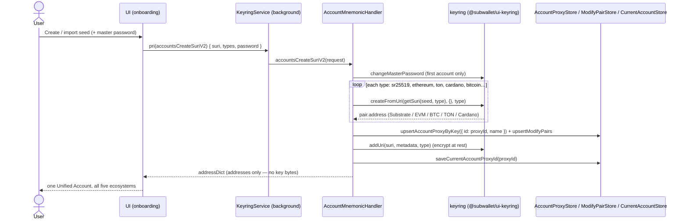

## Goal

Accounts are the wallet's foundation — every other feature acts on them, and the
one-seed-many-chains **Unified Account** is the core product promise. This epic
owns how keys **enter** (create / import), are **organized & derived**, and
**leave** (export) the wallet.

## Overview

### Business context

Before this epic there is no wallet: nothing in the product works until an
account exists. EPIC-3 owns the **account identity path** — creation, the five
import formats, the Unified Account model that derives one seed into Substrate /
EVM / Bitcoin / TON / Cardano addresses (AD-11, with the per-ecosystem models
AD-12/13/14/15), day-to-day management/derivation, and a planned
recovery/identity roadmap.

All key material is created, parsed and stored **only in the background keyring**
(AD-04) — the non-custodial boundary every story here must hold. The epic owns
*identity*, not *authorization* or *money movement*: the master-password / lock
policy belongs to EPIC-5 (security) and signing/submission to EPIC-8
(transaction) + EPIC-2 (core-platform engines).

> FR statuses below are **story-planning** statuses (Stream B; all `📋 backlog`).
> The real shipped state of each capability lives in [PRD](../../PRD.md#functional-requirements) — most
> of EPIC-3 is `✅ shipped` there; `done` + `version_shipped` are backfilled in
> version reconciliation.

### Feature pillars

| # | Pillar | Stories | Purpose |
|---|---|---|---|
| 1 | **Account onboarding** | [US-3.1](../stories/US-3.1-create-a-new-wallet-via-seed-phrase.md), [US-3.2](../stories/US-3.2-import-account-via-seed-phrase-or-private-key.md), [US-3.3](../stories/US-3.3-import-account-via-json-qr-trust-wallet.md) | How keys *enter* the wallet — create a new seed, or import via seed / private key / JSON keystore / QR / Trust Wallet |
| 2 | **Unified Account model** | [US-3.5](../stories/US-3.5-the-unified-account-model.md) | One seed → Substrate / EVM / Bitcoin / TON / Cardano addresses with solo↔unified conversion — the core product promise |
| 3 | **Management & derivation** | [US-3.4](../stories/US-3.4-export-keys-multi-account-management.md), [US-3.7](../stories/US-3.7-account-derivation-custom-path-child-accounts.md) | Day-to-day organisation — multi-account management, key export, and custom-path / child-account derivation |
| 4 | **Watch-only & address book** | [US-3.6](../stories/US-3.6-watch-only-accounts-address-book.md) | Read-only address monitoring (no key) plus saved, labelled recipients |
| 5 | **Recovery & identity (roadmap)** | [US-3.8](../stories/US-3.8-account-recovery-identity-roadmap.md) | Social recovery, scoped dApp session keys and decentralized identity — planned; none shipped yet |

### Out of scope

- **Master password, auto-lock, unlock policy** — owned by [EPIC-5](EPIC-5.md) (security). Accounts *use* it; they don't define it.
- **Transaction signing & submission** — owned by [EPIC-8](EPIC-8.md) + [EPIC-2](EPIC-2.md). This epic creates keys; it does not move funds.
- **Hardware-wallet accounts** — owned by [EPIC-16](EPIC-16.md). Those keys live on a device, not in the keyring.
- **Proxy / multisig account types** — owned by [EPIC-17](EPIC-17.md) / [EPIC-18](EPIC-18.md).

## FR Coverage

| FR | Story | Status |
|----|-------|--------|
| FR-13 | [US-3.1](../stories/US-3.1-create-a-new-wallet-via-seed-phrase.md) | 📋 backlog |
| FR-14 | [US-3.2](../stories/US-3.2-import-account-via-seed-phrase-or-private-key.md) | 📋 backlog |
| FR-15 | [US-3.2](../stories/US-3.2-import-account-via-seed-phrase-or-private-key.md) | 📋 backlog |
| FR-16 | [US-3.3](../stories/US-3.3-import-account-via-json-qr-trust-wallet.md) | 📋 backlog |
| FR-17 | [US-3.3](../stories/US-3.3-import-account-via-json-qr-trust-wallet.md) | 📋 backlog |
| FR-18 | [US-3.3](../stories/US-3.3-import-account-via-json-qr-trust-wallet.md) | 📋 backlog |
| FR-19 | [US-3.4](../stories/US-3.4-export-keys-multi-account-management.md) | 📋 backlog |
| FR-20 | [US-3.4](../stories/US-3.4-export-keys-multi-account-management.md) | 📋 backlog |
| FR-21 | [US-3.5](../stories/US-3.5-the-unified-account-model.md) | 📋 backlog |
| FR-22 | [US-3.5](../stories/US-3.5-the-unified-account-model.md) | 📋 backlog |
| FR-23 | [US-3.5](../stories/US-3.5-the-unified-account-model.md) | 📋 backlog |
| FR-24 | [US-3.6](../stories/US-3.6-watch-only-accounts-address-book.md) | 📋 backlog |
| FR-25 | [US-3.6](../stories/US-3.6-watch-only-accounts-address-book.md) | 📋 backlog |
| FR-26 | [US-3.7](../stories/US-3.7-account-derivation-custom-path-child-accounts.md) | 📋 backlog |
| FR-27 | [US-3.7](../stories/US-3.7-account-derivation-custom-path-child-accounts.md) | 📋 backlog |
| FR-28 | [US-3.8](../stories/US-3.8-account-recovery-identity-roadmap.md) | 📋 backlog |
| FR-29 | [US-3.8](../stories/US-3.8-account-recovery-identity-roadmap.md) | 📋 backlog |
| FR-30 | [US-3.8](../stories/US-3.8-account-recovery-identity-roadmap.md) | 📋 backlog |

> Every FR is assigned a story ID up front (FR order) so numbering is locked — no
> renumber later. Every FR is now covered by an authored story.

## AD Coverage

| AD | Title | Story |
|----|-------|-------|
| AD-11 | Unified multi-chain account model | [US-3.5](../stories/US-3.5-the-unified-account-model.md) |
| AD-04 | Non-custodial keyring confined to background | [US-3.1](../stories/US-3.1-create-a-new-wallet-via-seed-phrase.md), [US-3.2](../stories/US-3.2-import-account-via-seed-phrase-or-private-key.md), [US-3.3](../stories/US-3.3-import-account-via-json-qr-trust-wallet.md), [US-3.4](../stories/US-3.4-export-keys-multi-account-management.md) |
| AD-12 | Bitcoin integration model (BIP44/84/86 addresses, PSBT) | [US-3.5](../stories/US-3.5-the-unified-account-model.md) |
| AD-13 | TON integration model (selectable wallet-contract version) | [US-3.5](../stories/US-3.5-the-unified-account-model.md) |
| AD-14 | Cardano integration model (CIP-30 connector, CIP-26 assets) | [US-3.5](../stories/US-3.5-the-unified-account-model.md) |
| AD-15 | Bittensor integration model (native Subtensor account path) | [US-3.5](../stories/US-3.5-the-unified-account-model.md) |

> AD-04 is the keyring boundary every account story rides on; it is *shared* with
> [EPIC-16](EPIC-16.md) (hardware signing) and consumed, not redefined, here.
> AD-15's staking / swap semantics are owned by [EPIC-12](EPIC-12.md); EPIC-3
> references it only for the Bittensor *account* model.

## Stories

| ID | Title | Goal | Status | Version |
|---|---|---|---|---|
| [US-3.1](../stories/US-3.1-create-a-new-wallet-via-seed-phrase.md) | Create a new wallet via seed phrase | Generate seed + master password + backup → a Unified Account | 📋 backlog | — |
| [US-3.2](../stories/US-3.2-import-account-via-seed-phrase-or-private-key.md) | Import account via seed phrase or private key | Bring an account in by seed (→ unified) or private key (→ solo) | 📋 backlog | — |
| [US-3.3](../stories/US-3.3-import-account-via-json-qr-trust-wallet.md) | Import account via JSON / QR / Trust Wallet | The remaining import formats | 📋 backlog | — |
| [US-3.4](../stories/US-3.4-export-keys-multi-account-management.md) | Export keys & multi-account management | Export seed/key; manage multiple named accounts | 📋 backlog | — |
| [US-3.5](../stories/US-3.5-the-unified-account-model.md) | The Unified Account model | One seed → five ecosystems + solo↔unified | 📋 backlog | — |
| [US-3.6](../stories/US-3.6-watch-only-accounts-address-book.md) | Watch-only accounts & address book | Read-only monitoring + saved recipients | 📋 backlog | — |
| [US-3.7](../stories/US-3.7-account-derivation-custom-path-child-accounts.md) | Account derivation: custom path & child accounts | Custom + auto-index derived accounts | 📋 backlog | — |
| [US-3.8](../stories/US-3.8-account-recovery-identity-roadmap.md) | Account recovery & identity (roadmap) | Social recovery, session keys, DID (planned) | 📋 backlog | — |

> All eight stories (US-3.1–3.8) are authored and linked above — sizes follow
> scope. The `📋 backlog` status is the Stream-B story-planning state; shipped
> state still lives in the [PRD](../../PRD.md#functional-requirements), and `done` + `version_shipped` are
> backfilled in version reconciliation.

## Object map & user-story interactions

### US ↔ entity / subsystem matrix

Every account story routes through the single `KeyringService` (background, AD-04)
and its `AccountContext`, which delegates to one handler per format. The
"Primary handler / store" column names the real class each story drives; all
secret material is created/parsed/stored **only** in the background keyring
(`@subwallet/ui-keyring`) and persisted through `AccountProxyStore` /
`ModifyPairStore` / `CurrentAccountStore`.

| US | Primary handler / store | FR |
|---|---|---|
| [US-3.1](../stories/US-3.1-create-a-new-wallet-via-seed-phrase.md) | `AccountMnemonicHandler` (`mnemonicCreateV2` → `accountsCreateSuriV2`) + `AccountProxyStore` | FR-13 |
| [US-3.2](../stories/US-3.2-import-account-via-seed-phrase-or-private-key.md) | `AccountMnemonicHandler` (`accountsCreateSuriV2`, seed → unified) / `AccountSecretHandler` (`privateKeyValidateV2` → `accountsCreateWithSecret`, key → solo) | FR-14, FR-15 |
| [US-3.3](../stories/US-3.3-import-account-via-json-qr-trust-wallet.md) | `AccountJsonHandler` (`jsonRestoreV2` / `batchRestoreV2`) · `AccountSecretHandler` (`accountsCreateExternalV2`, QR) · `AccountMnemonicHandler` (`ed25519-tw`, Trust path → solo) | FR-16, FR-17, FR-18 |
| [US-3.4](../stories/US-3.4-export-keys-multi-account-management.md) | `AccountMnemonicHandler` (`exportAccountProxyMnemonic`) · `AccountSecretHandler` (`accountExportPrivateKey`) · `AccountModifyHandler` (`accountsEdit` / `accountProxyForget`) | FR-19, FR-20 |
| [US-3.5](../stories/US-3.5-the-unified-account-model.md) | `AccountMnemonicHandler` derivation across `['sr25519', …EthereumKeypairTypes, 'ton', …CardanoKeypairTypes, …BitcoinKeypairTypes]` + `AccountMigrationHandler` (`migrateSoloToUnifiedAccount`) | FR-21, FR-22, FR-23 |
| [US-3.6](../stories/US-3.6-watch-only-accounts-address-book.md) | `AccountSecretHandler` (`accountsCreateExternalV2`, `isReadOnly`) + keyring `contacts` subject (address book) | FR-24, FR-25 |
| [US-3.7](../stories/US-3.7-account-derivation-custom-path-child-accounts.md) | `AccountDeriveHandler` (`getDeriveSuggestion` via `findUnifiedNextDerive`/`findSoloNextDerive`, `validateDerivePath`, `derivationAccountProxyCreate`) | FR-26, FR-27 |
| [US-3.8](../stories/US-3.8-account-recovery-identity-roadmap.md) | _(roadmap — no handler yet; would extend `KeyringService` / `AccountContext`)_ | FR-28, FR-29, FR-30 |

### End-to-end happy path

The canonical create-or-import flow (US-3.1 / US-3.2 seed import) as it runs in
code: the UI passes user input over the `pri(…)` bus, the background keyring
generates/parses the secret and derives one address per ecosystem keypair type,
and only addresses + an account-proxy record are persisted — secret bytes never
leave the background (AD-04).

**Branches not shown:** private-key import takes `AccountSecretHandler.accountsCreateWithSecret` and yields a **solo** account (single curve, no `proxyId`) — [US-3.2](../stories/US-3.2-import-account-via-seed-phrase-or-private-key.md); JSON-keystore and QR import enter via `AccountJsonHandler.jsonRestoreV2`/`batchRestoreV2` and `AccountSecretHandler.accountsCreateExternalV2`, and a Trust Wallet phrase imports solo on the `ed25519-tw` derivation path — [US-3.3](../stories/US-3.3-import-account-via-json-qr-trust-wallet.md); watch-only adds an address with no key via `accountsCreateExternalV2` (`isReadOnly`) — [US-3.6](../stories/US-3.6-watch-only-accounts-address-book.md); custom-path / child accounts run through `AccountDeriveHandler.derivationAccountProxyCreate` — [US-3.7](../stories/US-3.7-account-derivation-custom-path-child-accounts.md).

## Cross-cutting invariants

- **Key isolation ([FR-13](../../PRD.md#functional-requirements), AD-04):** no story may surface seed or
  private-key bytes to the UI or inject scripts; creation/import/export all parse
  and store secrets in the background. Enforced per-story by a "no key on the
  message bus" check.
- **Deterministic derivation (AD-11, [NFR-18](../../PRD.md#non-functional-requirements)):** unified and
  derived (child / custom-path) addresses are reproducible from the same seed with
  no server dependency — the basis of the single-seed/single-backup guarantee.
- **Master-password gate ([FR-53](../../PRD.md#functional-requirements), owned by EPIC-5):** every secret
  reveal/export is gated by the master password; this epic consumes that gate, it
  does not weaken it.

## Cross-story testing requirements

| Pattern | Stories that apply | Shared infra |
|---|---|---|
| **No-key-on-the-bus assertion** | [US-3.1](../stories/US-3.1-create-a-new-wallet-via-seed-phrase.md), [US-3.2](../stories/US-3.2-import-account-via-seed-phrase-or-private-key.md), [US-3.3](../stories/US-3.3-import-account-via-json-qr-trust-wallet.md), [US-3.4](../stories/US-3.4-export-keys-multi-account-management.md) | Spy on the `pri(…)`/`pub(…)` message bus during create / import / export; assert no mnemonic or private-key bytes are ever emitted (AD-04) |
| **Validate-then-create rejection** | [US-3.2](../stories/US-3.2-import-account-via-seed-phrase-or-private-key.md), [US-3.3](../stories/US-3.3-import-account-via-json-qr-trust-wallet.md), [US-3.5](../stories/US-3.5-the-unified-account-model.md), [US-3.7](../stories/US-3.7-account-derivation-custom-path-child-accounts.md) | Bad-input fixtures (invalid mnemonic / malformed key / wrong keystore password / mismatched-seed merge / malformed derivation path) → assert the handler throws and **no partial account is persisted** to `AccountProxyStore` |
| **Unified vs solo address-map fixture** | [US-3.1](../stories/US-3.1-create-a-new-wallet-via-seed-phrase.md), [US-3.2](../stories/US-3.2-import-account-via-seed-phrase-or-private-key.md), [US-3.5](../stories/US-3.5-the-unified-account-model.md), [US-3.7](../stories/US-3.7-account-derivation-custom-path-child-accounts.md) | Known-seed fixture asserting the per-type `addressMap` (sr25519 / ethereum / ton / cardano / bitcoin) is reproduced deterministically; one `accountProxyId` for unified, none for solo |
| **Master-password-gated reveal** | [US-3.4](../stories/US-3.4-export-keys-multi-account-management.md), [US-3.5](../stories/US-3.5-the-unified-account-model.md) | Correct password → `exportAccountProxyMnemonic` / `accountExportPrivateKey` returns the secret to the reveal UI only; wrong password → rejected, nothing revealed (gate owned by EPIC-5, consumed here) |

> **Cross-reference:** executable scenarios for this epic live in
> `docs/tests/test-cases/EPIC-3.md` (when authored). The table above declares
> the *harness*; the test-cases file owns the *scenarios*.

## Performance budgets & invariants

| Concern | Budget / invariant | Story | Rationale |
|---|---|---|---|
| **Deterministic derivation, no server** | Same seed + path reproduces identical addresses across all five ecosystems on a fresh install with zero network calls; derivation is pure `keyring.createFromUri(getSuri(seed, type), …)` over the fixed keypair-type list | [US-3.5](../stories/US-3.5-the-unified-account-model.md), [US-3.7](../stories/US-3.7-account-derivation-custom-path-child-accounts.md) | The single-seed / single-backup guarantee (AD-11, NFR-18); a server dependency in derivation would break recovery and self-custody |
| **Key isolation (no key on the bus)** | Seed and private-key bytes are created, parsed and stored only in the background keyring; handlers return address maps / proxy records, never key material — the one deliberate reveal (export) is master-password-gated | [US-3.1](../stories/US-3.1-create-a-new-wallet-via-seed-phrase.md), [US-3.4](../stories/US-3.4-export-keys-multi-account-management.md) | The non-custodial boundary (AD-04, FR-13); any path that surfaces key bytes to the UI/inject layer is rejected |
| **Encrypt-at-rest, no plaintext** | Secrets persisted via the keyring (browser-passworder, AES-256-GCM) under the master password; storage holds only ciphertext + the address-keyed `AccountProxyStore` / `ModifyPairStore` records | [US-3.1](../stories/US-3.1-create-a-new-wallet-via-seed-phrase.md), [US-3.2](../stories/US-3.2-import-account-via-seed-phrase-or-private-key.md) | At-rest encryption (NFR-3); a failed import must not leave plaintext or a partial account in any store |

## Acceptance criteria (propagated from stories)

- [ ] A new wallet can be created (seed + master password + mandatory backup) and
      yields one Unified Account across five ecosystems — [US-3.1](../stories/US-3.1-create-a-new-wallet-via-seed-phrase.md)
- [ ] An existing account can be imported by seed phrase (→ unified) or private
      key (→ solo) with validation and error states — [US-3.2](../stories/US-3.2-import-account-via-seed-phrase-or-private-key.md)
- [ ] An account can be imported via the three remaining formats — JSON keystore
      (single or batch restore), scanned QR, or a Trust Wallet recovery phrase on
      its own derivation path — [US-3.3](../stories/US-3.3-import-account-via-json-qr-trust-wallet.md)
- [ ] A user can export their own seed phrase and private key from settings, and
      run several named accounts inside one wallet instance — [US-3.4](../stories/US-3.4-export-keys-multi-account-management.md)
- [ ] One seed simultaneously addresses all five ecosystems (Substrate, EVM,
      Bitcoin, TON, Cardano) and converts between the unified view and per-chain
      "solo" accounts with no second seed or backup — [US-3.5](../stories/US-3.5-the-unified-account-model.md)
- [ ] Any address can be added for read-only balance monitoring (no private key),
      and frequent recipients can be saved and labelled in an address book — [US-3.6](../stories/US-3.6-watch-only-accounts-address-book.md)
- [ ] An advanced user can create accounts on a custom derivation path and spin up
      auto-indexed child accounts from a parent, with a per-parent derived list —
      [US-3.7](../stories/US-3.7-account-derivation-custom-path-child-accounts.md)
- [ ] The recovery/identity roadmap (social recovery, scoped dApp session keys,
      decentralized identity) is captured as a placeholder reserving FR numbering;
      none of it ships yet — [US-3.8](../stories/US-3.8-account-recovery-identity-roadmap.md)
