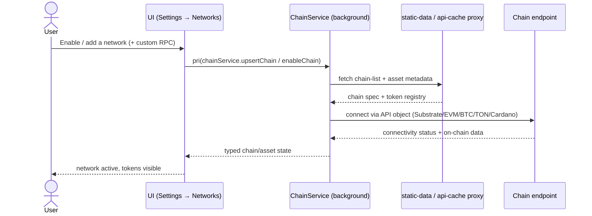

## Goal

Determine which chains and tokens the wallet can see at all. This epic owns the
**multi-chain engine surface**: adding/removing networks and custom RPCs, the
200+-network registry with live connectivity, per-ecosystem integration (EVM,
Bitcoin, TON, Cardano, and the planned Starknet / Midnight / Flow / Cosmos /
Solana), light-client fallback, and custom token import/registry. It also
absorbs the forward-looking **chain-abstraction roadmap** — a developer-facing
SDK, account-abstraction / cross-chain-intent standards, and AI / DeFAI UX —
that extends the same engine into a platform. Every other DeFi and wallet epic
gets to *stop worrying about* "can the wallet talk to this chain / see this
token", because this epic answers it.

## Overview

### Business context

Before this epic, "which networks and tokens exist" is implicit and
release-bound. EPIC-4 makes it **configurable, data-driven, and per-ecosystem
extensible**: networks and custom RPCs are user-managed, the chain list and
token metadata update online without an extension release (AD-23, AD-25), and
each blockchain family plugs into the central `ChainService` per-chain
API-object model (AD-02, AD-07). SubWallet ships five live ecosystems today —
Substrate/Polkadot, EVM, Bitcoin (AD-12), TON (AD-13) and Cardano (AD-14) — and
this epic owns the seam each one connects through.

This epic also **absorbed the old chain-abstraction roadmap** (formerly tracked
as standalone FR-49/50/51). Rather than treating "chain abstraction" as a
separate product, the PRD now frames it as the *natural extension of the
multi-chain engine*: once the wallet can model many chains uniformly, packaging
that capability as a developer-facing SDK (FR-49), adopting account-abstraction
and cross-chain-intent standards (FR-50: ERC-4337 / EIP-7702 / EIP-7683), and
layering AI / DeFAI UX on top (FR-51) are the platform-ization of the same core.

The architectural distinction the epic preserves: it owns **chain and token
visibility and per-ecosystem connectivity**, not what users *do* with that
connectivity. It does not move funds, route swaps, or build bridges — those
compose the chains this epic exposes but are owned elsewhere. The `ChainService`
engine itself (the runtime substrate) is owned by [EPIC-2](EPIC-2.md);
EPIC-4 owns the *registry, ecosystems, and token surface* layered on top.

### Feature pillars

| # | Pillar | Stories | Purpose |
|---|---|---|---|
| 1 | **Network configuration & registry** | [US-4.1](../stories/US-4.1-add-remove-networks-and-custom-rpc.md), [US-4.2](../stories/US-4.2-bulk-disable-and-reset-default-networks.md), [US-4.3](../stories/US-4.3-auto-update-chain-list-and-token-metadata.md), [US-4.4](../stories/US-4.4-substrate-parachain-registry.md), [US-4.9](../stories/US-4.9-substrate-light-client-fallback.md) | Add/remove networks + custom RPC, bulk disable/reset, online metadata updates, the 200+-network registry, light-client fallback |
| 2 | **Live ecosystems** | [US-4.5](../stories/US-4.5-evm-network-support.md), [US-4.6](../stories/US-4.6-bitcoin-network-integration.md), [US-4.7](../stories/US-4.7-ton-network-integration.md), [US-4.8](../stories/US-4.8-cardano-network-integration.md) | EVM, Bitcoin, TON and Cardano integrations already shipped |
| 3 | **Token surface** | [US-4.11](../stories/US-4.11-custom-token-import.md), [US-4.12](../stories/US-4.12-token-registry-enable-disable.md) | Custom token import by contract; enable/disable token visibility |
| 4 | **Planned ecosystems** | [US-4.10](../stories/US-4.10-starknet-ecosystem-integration.md), [US-4.13](../stories/US-4.13-bitcoin-utxo-multi-asset-transfer.md), [US-4.14](../stories/US-4.14-midnight-network-support.md), [US-4.15](../stories/US-4.15-flow-network-support.md), [US-4.16](../stories/US-4.16-cosmos-ecosystem-support.md), [US-4.17](../stories/US-4.17-solana-support.md) | Starknet, Bitcoin UTXO multi-asset, Midnight, Flow, Cosmos and Solana on the roadmap |
| 5 | **Chain-abstraction platform** | [US-4.18](../stories/US-4.18-chain-abstraction-sdk.md), [US-4.19](../stories/US-4.19-account-abstraction-standards.md), [US-4.20](../stories/US-4.20-ai-defai-features.md) | Developer-facing SDK, account-abstraction / intent standards, AI / DeFAI UX |
| 6 | **Hardening** | [US-4.21](../stories/US-4.21-asset-hub-migration-hardening.md), [US-4.22](../stories/US-4.22-rpc-and-endpoint-management-hardening.md), [US-4.23](../stories/US-4.23-bitcoin-api-path-hardening.md) | Asset Hub migration, RPC-management and Bitcoin-API hardening (one concern per story) |

### Out of scope

- **Send / receive / transfer execution** — owned by [EPIC-8](EPIC-8.md). This epic exposes the chains and tokens; moving funds across them is transaction work. (Bitcoin UTXO multi-asset transfer, US-4.13, is listed here only because it requires new chain-level UTXO/fee modelling; the generic transfer surface stays in EPIC-8.)
- **Token-to-token swap routing** — owned by [EPIC-11](EPIC-11.md). Swap *composes* the chains and tokens this epic registers.
- **Bridge / XCM construction** — owned by [EPIC-13](EPIC-13.md) (delegated to ParaSpell, AD-18). Bridges move assets *between* the chains this epic exposes.
- **The `ChainService` runtime engine itself** — owned by [EPIC-2](EPIC-2.md) (core-platform). EPIC-4 owns the registry, per-ecosystem handlers and token surface that *layer on* the engine, not the engine's lifecycle/messaging substrate.
- **NFT / earning / dApp-connection per-chain surfaces** — owned by [EPIC-9](EPIC-9.md) / [EPIC-12](EPIC-12.md) / [EPIC-10](EPIC-10.md) respectively. They consume the same `ChainService` API objects this epic populates.
- **Backend Services SDK / proxy infrastructure** — the data-aggregation backend (AD-24) and key-hiding proxy (AD-19, AD-25) are platform infrastructure; this epic *uses* them per ecosystem, it does not own them.

## FR Coverage

> FR statuses below are **story-planning** statuses; the shipped state of each
> capability lives in [PRD](../../PRD.md#epic-4--chain-management) (12 of 21 are
> already `✅ shipped`, FR-50 is `📋 planned`). Every FR is mapped to a story
> up front so numbering is locked.

| FR | Story | Status |
|----|-------|--------|
| FR-31 | [US-4.1](../stories/US-4.1-add-remove-networks-and-custom-rpc.md) | 📋 backlog |
| FR-32 | [US-4.2](../stories/US-4.2-bulk-disable-and-reset-default-networks.md) | 📋 backlog |
| FR-33 | [US-4.2](../stories/US-4.2-bulk-disable-and-reset-default-networks.md) | 📋 backlog |
| FR-34 | [US-4.3](../stories/US-4.3-auto-update-chain-list-and-token-metadata.md) | 📋 backlog |
| FR-35 | [US-4.4](../stories/US-4.4-substrate-parachain-registry.md) | 📋 backlog |
| FR-36 | [US-4.5](../stories/US-4.5-evm-network-support.md) | 📋 backlog |
| FR-37 | [US-4.6](../stories/US-4.6-bitcoin-network-integration.md) | 📋 backlog |
| FR-38 | [US-4.7](../stories/US-4.7-ton-network-integration.md) | 📋 backlog |
| FR-39 | [US-4.8](../stories/US-4.8-cardano-network-integration.md) | 📋 backlog |
| FR-40 | [US-4.9](../stories/US-4.9-substrate-light-client-fallback.md) | 📋 backlog |
| FR-41 | [US-4.10](../stories/US-4.10-starknet-ecosystem-integration.md) | 📋 backlog |
| FR-42 | [US-4.11](../stories/US-4.11-custom-token-import.md) | 📋 backlog |
| FR-43 | [US-4.12](../stories/US-4.12-token-registry-enable-disable.md) | 📋 backlog |
| FR-44 | [US-4.13](../stories/US-4.13-bitcoin-utxo-multi-asset-transfer.md) | 📋 backlog |
| FR-45 | [US-4.14](../stories/US-4.14-midnight-network-support.md) | 📋 backlog |
| FR-46 | [US-4.15](../stories/US-4.15-flow-network-support.md) | 📋 backlog |
| FR-47 | [US-4.16](../stories/US-4.16-cosmos-ecosystem-support.md) | 📋 backlog |
| FR-48 | [US-4.17](../stories/US-4.17-solana-support.md) | 📋 backlog |
| FR-49 | [US-4.18](../stories/US-4.18-chain-abstraction-sdk.md) | 📋 backlog |
| FR-50 | [US-4.19](../stories/US-4.19-account-abstraction-standards.md) | 📋 backlog |
| FR-51 | [US-4.20](../stories/US-4.20-ai-defai-features.md) | 📋 backlog |

> [US-4.21](../stories/US-4.21-asset-hub-migration-hardening.md),
> [US-4.22](../stories/US-4.22-rpc-and-endpoint-management-hardening.md) and
> [US-4.23](../stories/US-4.23-bitcoin-api-path-hardening.md) are the **hardening**
> stories (issue [#4451](https://github.com/Koniverse/SubWallet-Extension/issues/4451),
> one concern per story): they carry no new FR. US-4.21 defends the FR-34 / FR-31
> surfaces (Asset Hub migration), US-4.22 defends FR-31 (RPC / endpoint management,
> incl. [#4216](https://github.com/Koniverse/SubWallet-Extension/issues/4216)), and
> US-4.23 defends FR-37 (Bitcoin API path).

## AD Coverage

| AD | Title | Story |
|----|-------|-------|
| AD-02 | ChainService per-chain API objects | [US-4.4](../stories/US-4.4-substrate-parachain-registry.md), [US-4.5](../stories/US-4.5-evm-network-support.md), [US-4.21](../stories/US-4.21-asset-hub-migration-hardening.md), [US-4.22](../stories/US-4.22-rpc-and-endpoint-management-hardening.md) |
| AD-07 | Lightweight WsProvider for balance queries | [US-4.4](../stories/US-4.4-substrate-parachain-registry.md) |
| AD-12 | Bitcoin integration model (BIP44/84/86, PSBT) | [US-4.6](../stories/US-4.6-bitcoin-network-integration.md), [US-4.13](../stories/US-4.13-bitcoin-utxo-multi-asset-transfer.md) |
| AD-13 | TON integration model (selectable contract, Jetton) | [US-4.7](../stories/US-4.7-ton-network-integration.md) |
| AD-14 | Cardano integration model (Blockfrost, CIP-26/30) | [US-4.8](../stories/US-4.8-cardano-network-integration.md) |
| AD-19 | Backend proxy for third-party API keys | [US-4.8](../stories/US-4.8-cardano-network-integration.md), [US-4.13](../stories/US-4.13-bitcoin-utxo-multi-asset-transfer.md), [US-4.23](../stories/US-4.23-bitcoin-api-path-hardening.md) |
| AD-23 | Static-data caching via headless web-runner cron | [US-4.3](../stories/US-4.3-auto-update-chain-list-and-token-metadata.md) |
| AD-24 | Backend Services SDK for multi-chain data | [US-4.18](../stories/US-4.18-chain-abstraction-sdk.md), [US-4.20](../stories/US-4.20-ai-defai-features.md) |
| AD-25 | Cache / CDN proxy for metadata & token lists | [US-4.3](../stories/US-4.3-auto-update-chain-list-and-token-metadata.md) |

> [AD-11](../../ARCHITECTURE.md#architecture-decisions) (unified multi-chain
> account) is *referenced* — every ecosystem this epic adds becomes a branch of
> the one-seed account — but its primary implementation is owned by
> [EPIC-3](EPIC-3.md) (account). [AD-15](../../ARCHITECTURE.md#architecture-decisions)
> (Bittensor) and [AD-18](../../ARCHITECTURE.md#architecture-decisions) (XCM) are
> referenced as ecosystems that ride on this engine but are materialized in
> [EPIC-12](EPIC-12.md) / [EPIC-13](EPIC-13.md).

## Stories

| ID | Title | Goal | Status | Version |
|---|---|---|---|---|
| [US-4.1](../stories/US-4.1-add-remove-networks-and-custom-rpc.md) | Add/remove networks + custom RPC | User-managed networks and per-chain custom RPC endpoints | 📋 backlog | — |
| [US-4.2](../stories/US-4.2-bulk-disable-and-reset-default-networks.md) | Bulk disable + reset to default networks | One-tap disable-all (confirmed) and reset to default active set | 📋 backlog | — |
| [US-4.3](../stories/US-4.3-auto-update-chain-list-and-token-metadata.md) | Auto-update chain list & token metadata | Online chain/token metadata updates without an extension release | 📋 backlog | — |
| [US-4.4](../stories/US-4.4-substrate-parachain-registry.md) | Substrate parachain registry (200+) | 200+-network registry with live connectivity status | 📋 backlog | — |
| [US-4.5](../stories/US-4.5-evm-network-support.md) | EVM network support | Ethereum, L2s and EVM parachains via the EVM API object | 📋 backlog | — |
| [US-4.6](../stories/US-4.6-bitcoin-network-integration.md) | Bitcoin network integration | BIP44/84/86 addresses per account, PSBT signing | 📋 backlog | — |
| [US-4.7](../stories/US-4.7-ton-network-integration.md) | TON network integration | Selectable wallet-contract version + Jetton tokens | 📋 backlog | — |
| [US-4.8](../stories/US-4.8-cardano-network-integration.md) | Cardano network integration | Blockfrost-backed ADA + CIP-26 assets, CIP-30 connector | 📋 backlog | — |
| [US-4.9](../stories/US-4.9-substrate-light-client-fallback.md) | Substrate light-client fallback | Connect via `@substrate/connect` when no RPC is reachable | 📋 backlog | — |
| [US-4.10](../stories/US-4.10-starknet-ecosystem-integration.md) | Starknet ecosystem integration | Seed-derived account-abstracted Starknet wallets + transfers | 📋 backlog | — |
| [US-4.11](../stories/US-4.11-custom-token-import.md) | Custom token import (ERC-20 / PSP-22) | Add tokens by contract address | 📋 backlog | — |
| [US-4.12](../stories/US-4.12-token-registry-enable-disable.md) | Token registry enable/disable | Control per-token visibility | 📋 backlog | — |
| [US-4.13](../stories/US-4.13-bitcoin-utxo-multi-asset-transfer.md) | Bitcoin UTXO multi-asset transfer & custom fee | UTXO multi-asset transfer with manual fee control | 📋 backlog | — |
| [US-4.14](../stories/US-4.14-midnight-network-support.md) | Midnight network support | Add the Midnight privacy ecosystem | 📋 backlog | — |
| [US-4.15](../stories/US-4.15-flow-network-support.md) | Flow network support (Cadence & EVM) | Add Flow across its Cadence and EVM runtimes | 📋 backlog | — |
| [US-4.16](../stories/US-4.16-cosmos-ecosystem-support.md) | Cosmos ecosystem support | Add the Cosmos SDK / IBC ecosystem | 📋 backlog | — |
| [US-4.17](../stories/US-4.17-solana-support.md) | Solana support | Add the Solana ecosystem | 📋 backlog | — |
| [US-4.18](../stories/US-4.18-chain-abstraction-sdk.md) | Chain-abstraction SDK (developer-facing) | Package multi-chain logic as a service for external dApp teams | 📋 backlog | — |
| [US-4.19](../stories/US-4.19-account-abstraction-standards.md) | Account-abstraction standards (4337/7702/7683) | ERC-4337 / EIP-7702 / EIP-7683 account-abstraction & intents | 📋 backlog | — |
| [US-4.20](../stories/US-4.20-ai-defai-features.md) | AI / DeFAI features | AI agent + AI-assisted swap/earn/transfer with chain-abstraction UX | 📋 backlog | — |
| [US-4.21](../stories/US-4.21-asset-hub-migration-hardening.md) | Asset Hub migration hardening | Keep chains/assets visible and endpoints correct through the Asset Hub migration | 📋 backlog | — |
| [US-4.22](../stories/US-4.22-rpc-and-endpoint-management-hardening.md) | RPC & endpoint-management hardening | Accurate connectivity, endpoint fallback/retry, custom-RPC validation (#4216) | 📋 backlog | — |
| [US-4.23](../stories/US-4.23-bitcoin-api-path-hardening.md) | Bitcoin-API path hardening | Bitcoin indexer timeouts/retries/provider-drift behind the backend proxy | 📋 backlog | — |

## Object map & user-story interactions

### US ↔ entity / subsystem matrix

| US | Primary entity / subsystem | FR |
|---|---|---|
| [US-4.1](../stories/US-4.1-add-remove-networks-and-custom-rpc.md) | `ChainService` network config + custom-RPC store | FR-31 |
| [US-4.2](../stories/US-4.2-bulk-disable-and-reset-default-networks.md) | `ChainService` active-chain set | FR-32, FR-33 |
| [US-4.3](../stories/US-4.3-auto-update-chain-list-and-token-metadata.md) | `fetchLatestChainData` → `fetchStaticData('chains')` chain-list / asset-registry cache | FR-34 |
| [US-4.4](../stories/US-4.4-substrate-parachain-registry.md) | `SubstrateApi` registry + connectivity status | FR-35 |
| [US-4.5](../stories/US-4.5-evm-network-support.md) | `EvmApi` per-chain objects | FR-36 |
| [US-4.6](../stories/US-4.6-bitcoin-network-integration.md) | Bitcoin keyring + UTXO API object | FR-37 |
| [US-4.7](../stories/US-4.7-ton-network-integration.md) | TON client + Jetton asset type | FR-38 |
| [US-4.8](../stories/US-4.8-cardano-network-integration.md) | Cardano (Blockfrost) API object | FR-39 |
| [US-4.9](../stories/US-4.9-substrate-light-client-fallback.md) | `@substrate/connect` light-client provider | FR-40 |
| [US-4.10](../stories/US-4.10-starknet-ecosystem-integration.md) | Starknet account-abstracted API object | FR-41 |
| [US-4.11](../stories/US-4.11-custom-token-import.md) | Asset registry — custom-token entries | FR-42 |
| [US-4.12](../stories/US-4.12-token-registry-enable-disable.md) | Asset registry — token visibility flags | FR-43 |
| [US-4.13](../stories/US-4.13-bitcoin-utxo-multi-asset-transfer.md) | Bitcoin UTXO builder + fee model | FR-44 |
| [US-4.14](../stories/US-4.14-midnight-network-support.md) | Midnight API object (new ecosystem) | FR-45 |
| [US-4.15](../stories/US-4.15-flow-network-support.md) | Flow API object (Cadence + EVM) | FR-46 |
| [US-4.16](../stories/US-4.16-cosmos-ecosystem-support.md) | Cosmos API object (new ecosystem) | FR-47 |
| [US-4.17](../stories/US-4.17-solana-support.md) | Solana API object (new ecosystem) | FR-48 |
| [US-4.18](../stories/US-4.18-chain-abstraction-sdk.md) | Chain-abstraction SDK package | FR-49 |
| [US-4.19](../stories/US-4.19-account-abstraction-standards.md) | AA / intent standard adapters | FR-50 |
| [US-4.20](../stories/US-4.20-ai-defai-features.md) | AI agent + DeFAI orchestration | FR-51 |
| [US-4.21](../stories/US-4.21-asset-hub-migration-hardening.md) | Asset Hub migration — chain-list / default-set + API objects | — |
| [US-4.22](../stories/US-4.22-rpc-and-endpoint-management-hardening.md) | RPC / endpoint management + custom-RPC validation | — |
| [US-4.23](../stories/US-4.23-bitcoin-api-path-hardening.md) | Bitcoin indexer API path (backend-proxied) | — |

### End-to-end happy path

**Branches not shown:** no reachable RPC ⇒ light-client fallback (US-4.9);
custom-token import by contract (US-4.11); planned ecosystems (US-4.10,
US-4.13..US-4.17) introduce a new API-object type before this flow applies.

## Cross-cutting invariants

- **One ecosystem = one `ChainService` API-object type ([AD-02](../../ARCHITECTURE.md#architecture-decisions)):** every chain family connects through a dedicated API object (`SubstrateApi` / `EvmApi` / Bitcoin / TON / Cardano, and planned Starknet / Midnight / Flow / Cosmos / Solana). Adding an ecosystem is a new API-object + handler, never an ad-hoc chain lookup. Enforced by [US-4.5](../stories/US-4.5-evm-network-support.md) onward.
- **Data updates ship without a release ([FR-34](../../PRD.md#epic-4--chain-management), AD-23, AD-25):** chain list and token metadata are served from the static-data cache / CDN proxy, never hard-coded into the bundle. A PR that hard-codes a new chain spec instead of the registry is rejected. Enforced by [US-4.3](../stories/US-4.3-auto-update-chain-list-and-token-metadata.md).
- **Memory ceiling under chain count ([AD-07](../../ARCHITECTURE.md#architecture-decisions)):** balance/token queries use the lightweight WsProvider; the full `ApiPromise` is instantiated only for extrinsic construction. Enabling many networks must not scale RAM linearly. Enforced by [US-4.4](../stories/US-4.4-substrate-parachain-registry.md).
- **Third-party keys never ship in the bundle ([AD-19](../../ARCHITECTURE.md#architecture-decisions), AD-25):** Blockfrost (Cardano) and the Bitcoin indexer route through the Koni backend proxy. A provider key in client code is rejected. Enforced by [US-4.8](../stories/US-4.8-cardano-network-integration.md), [US-4.13](../stories/US-4.13-bitcoin-utxo-multi-asset-transfer.md).
- **Every ecosystem rides the one-seed account ([AD-11](../../ARCHITECTURE.md#architecture-decisions)):** a newly added chain family must derive from the unified multi-chain account; adding a chain must not force a separate seed/backup. Owned by EPIC-3, asserted at integration time by each ecosystem story.

## Cross-story testing requirements

| Pattern | Stories that apply | Shared infra |
|---|---|---|
| **Chain registry / connectivity fixture** | [US-4.1](../stories/US-4.1-add-remove-networks-and-custom-rpc.md), [US-4.2](../stories/US-4.2-bulk-disable-and-reset-default-networks.md), [US-4.4](../stories/US-4.4-substrate-parachain-registry.md), [US-4.9](../stories/US-4.9-substrate-light-client-fallback.md) | `ChainService` test fixtures (mock chain-list + connectivity states) |
| **Per-ecosystem API-object integration test** | [US-4.5](../stories/US-4.5-evm-network-support.md), [US-4.6](../stories/US-4.6-bitcoin-network-integration.md), [US-4.7](../stories/US-4.7-ton-network-integration.md), [US-4.8](../stories/US-4.8-cardano-network-integration.md), [US-4.10](../stories/US-4.10-starknet-ecosystem-integration.md), [US-4.14](../stories/US-4.14-midnight-network-support.md), [US-4.15](../stories/US-4.15-flow-network-support.md), [US-4.16](../stories/US-4.16-cosmos-ecosystem-support.md), [US-4.17](../stories/US-4.17-solana-support.md) | Connect/disconnect + basic-query harness per API-object type |
| **Asset-registry import / visibility test** | [US-4.11](../stories/US-4.11-custom-token-import.md), [US-4.12](../stories/US-4.12-token-registry-enable-disable.md) | Asset-registry mutation + visibility-flag fixture |

> **Cross-reference:** executable scenarios for this epic live in
> `docs/tests/test-cases/EPIC-4.md` (when authored). The table above declares
> the *harness*; the test-cases file owns the *scenarios*.

## Performance budgets & invariants

| Concern | Budget | Story | Rationale |
|---|---|---|---|
| **Multi-chain RAM** | WsProvider-only mode ~constant regardless of enabled-chain count (full ApiPromise only on extrinsic build) | [US-4.4](../stories/US-4.4-substrate-parachain-registry.md) | Full ApiPromise hit ~264 MB for 20 chains; the registry must stay usable at 200+ networks (AD-07) |
| **Chain-list refresh** | Served from cache / CDN proxy, with a bundled JSON fallback | [US-4.3](../stories/US-4.3-auto-update-chain-list-and-token-metadata.md) | Live metadata updates must not hammer RPCs or block first paint (AD-23, AD-25) |

## Acceptance criteria (propagated from stories)

- [ ] A user can add/remove networks and set a custom RPC per chain — [US-4.1](../stories/US-4.1-add-remove-networks-and-custom-rpc.md)
- [ ] A user can bulk-disable all networks (confirmed) and reset to the default active set — [US-4.2](../stories/US-4.2-bulk-disable-and-reset-default-networks.md)
- [ ] Chain list and token metadata update online without an extension release — [US-4.3](../stories/US-4.3-auto-update-chain-list-and-token-metadata.md)
- [ ] The Substrate registry covers 200+ networks with live connectivity status — [US-4.4](../stories/US-4.4-substrate-parachain-registry.md)
- [ ] EVM, Bitcoin, TON and Cardano ecosystems are fully integrated — [US-4.5](../stories/US-4.5-evm-network-support.md), [US-4.6](../stories/US-4.6-bitcoin-network-integration.md), [US-4.7](../stories/US-4.7-ton-network-integration.md), [US-4.8](../stories/US-4.8-cardano-network-integration.md)
- [ ] A chain with no reachable RPC falls back to a light client — [US-4.9](../stories/US-4.9-substrate-light-client-fallback.md)
- [ ] Custom tokens can be imported by contract and per-token visibility controlled — [US-4.11](../stories/US-4.11-custom-token-import.md), [US-4.12](../stories/US-4.12-token-registry-enable-disable.md)
- [ ] _(planned ecosystems — US-4.10, US-4.13–US-4.17, per FR Coverage)_
- [ ] _(chain-abstraction platform — US-4.18, US-4.19, US-4.20, per FR Coverage)_
- [ ] Asset Hub migration is hardened — chains/assets stay visible, endpoints stay correct (defends FR-34 / FR-31) — [US-4.21](../stories/US-4.21-asset-hub-migration-hardening.md)
- [ ] RPC / endpoint management is hardened — accurate connectivity, fallback/retry, custom-RPC validation that does not block load (defends FR-31, #4216) — [US-4.22](../stories/US-4.22-rpc-and-endpoint-management-hardening.md)
- [ ] The Bitcoin API path is hardened — indexer timeouts/retries/provider-drift behind the backend proxy (defends FR-37) — [US-4.23](../stories/US-4.23-bitcoin-api-path-hardening.md)
