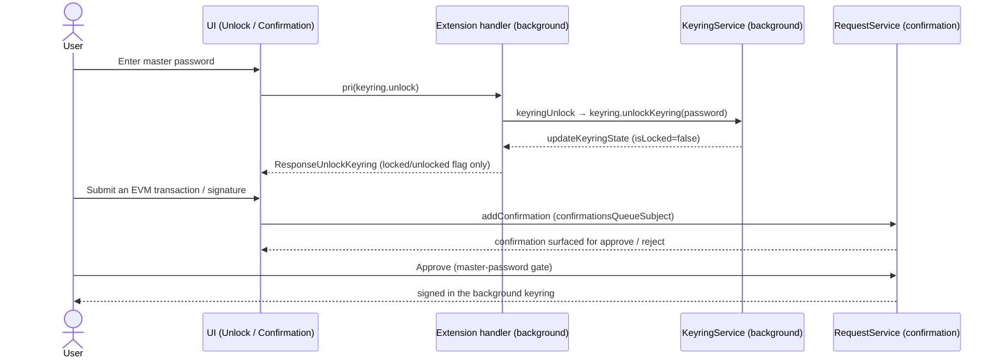

## Goal

Security is where the **non-custodial promise is enforced**: the user's keys
and funds stay theirs and theirs alone. This epic owns the boundary that
protects key material (isolation, encryption-at-rest, safe seed input), the
**master-password / lock policy** every other feature consumes to gate a secret
reveal or a signature, and the **threat-defence surface** (phishing, malicious
transactions, scam addresses) that warns the user before they sign away funds.

## Overview

### Business context

Before this epic, an account exists ([EPIC-3](EPIC-3.md)) but nothing defends
it. EPIC-5 closes that gap. It owns the **authorization & defence path** that
sits between "the user has keys" and "the user moves funds": the master password
that wraps every key at rest (FR-53), the unlock / auto-lock policy that decides
*when* a secret may be used (FR-55, FR-57, FR-58), the per-feature safety toggles
(camera FR-59, One-Sign FR-60), and the inbound-threat screens that flag phishing
sites (FR-52), risky transactions (FR-61) and scam addresses (FR-62).

This is the epic that makes "non-custodial" more than a slogan. The key-custody
substrate it enforces is architectural: `@subwallet/keyring` is instantiated
**only in the background service worker** (AD-04), the UI and inject scripts
reach it solely over the typed `pri(…)` / `pub(…)` message bus (AD-03), and key
bytes are encrypted at rest with AES-256-GCM (NFR-3). Every story in this epic
either *enforces* that boundary or *consumes the gate* it publishes — none may
weaken it. The master password is **non-recoverable by design**: there is no
server-side custody to fall back on, so a forgotten password resets the wallet
(FR-54) rather than being recovered.

The epic owns *defence and authorization*, not the mechanisms it protects. It
does **not** own key creation/import/export (that is [EPIC-3](EPIC-3.md), which
*consumes* the master-password gate), transaction signing/submission
([EPIC-8](EPIC-8.md) + [EPIC-2](EPIC-2.md)), or hardware-wallet air-gapped
signing ([EPIC-16](EPIC-16.md)). The threat-screening providers (ChainPatrol,
Blockaid, Merkle Science) are external APIs reached through the SubWallet backend
proxy (AD-19) so their keys never ship in the bundle.

> FR statuses below are **story-planning** statuses (Stream B; all `📋 backlog`).
> The real shipped state of each capability lives in [PRD](../../PRD.md#functional-requirements) — 9 of
> 11 EPIC-5 FRs are `✅ shipped` there (FR-61 / FR-62 are `📋 planned`); `done`
> + `version_shipped` are backfilled in version reconciliation.

### Feature pillars

| # | Pillar | Stories | Purpose |
|---|---|---|---|
| 1 | **Key-custody protection** | [US-5.5](../stories/US-5.5-seed-phrase-input-safety.md) | Keep seed/key bytes off the message bus and out of browser autocomplete caches |
| 2 | **Password & lock policy** | [US-5.2](../stories/US-5.2-master-password-and-strength-policy.md), [US-5.3](../stories/US-5.3-forgot-password-reset-wallet.md), [US-5.4](../stories/US-5.4-unified-unlock-and-auto-lock-flow.md), [US-5.6](../stories/US-5.6-auto-lock-timer-and-unlock-type.md) | The master-password gate, its non-recoverable reset, and the auto-lock / per-action-vs-per-session unlock policy every feature consumes |
| 3 | **Per-feature safety toggles** | [US-5.7](../stories/US-5.7-camera-access-and-one-sign-toggles.md) | User-controlled camera-access and One-Sign opt-ins |
| 4 | **Inbound threat defence** | [US-5.1](../stories/US-5.1-phishing-site-and-address-protection.md), [US-5.8](../stories/US-5.8-blockaid-transaction-risk-scanning.md), [US-5.9](../stories/US-5.9-anti-scam-address-screening.md) | Block phishing sites/addresses, scan transactions/signatures for risk, screen recipient addresses for scam association |
| 5 | **Audit hardening** | [US-5.10](../stories/US-5.10-verichains-audit-remediation-hardening.md) | Remediate security audit and false-positive findings (UX-bounty audit, secret hygiene, web hardening, phishing accuracy) |

### Out of scope

- **Key creation / import / export** — owned by [EPIC-3](EPIC-3.md) (account). EPIC-3 *consumes* the master-password gate this epic publishes; it does not define it.
- **Transaction signing & submission** — owned by [EPIC-8](EPIC-8.md) (transaction) + [EPIC-2](EPIC-2.md) (RequestService / signing engines). This epic decides *whether* a signature is allowed (lock policy, risk screen); it does not produce the signature.
- **Hardware-wallet air-gapped signing** — owned by [EPIC-16](EPIC-16.md). Those keys never enter the extension, so the keyring-isolation invariant is satisfied by the device, not by this epic (NFR-14).
- **dApp authorization UI (per-origin connect/approve)** — owned by [EPIC-10](EPIC-10.md). This epic blocks *known-malicious* origins (phishing); per-origin consent is a dapp-connection concern.
- **Third-party-API-key backend proxy substrate** — the proxy itself (AD-19) is platform infrastructure; this epic *routes through* it for ChainPatrol / Blockaid / Merkle Science.

## FR Coverage

> Every FR is assigned a story ID up front (in FR order) so the numbering is
> locked — no renumber when the remaining stories are authored. Merged stories
> list both FRs (US-5.6 = FR-57+58, US-5.7 = FR-59+60).

| FR | Story | Status |
|----|-------|--------|
| FR-52 | [US-5.1](../stories/US-5.1-phishing-site-and-address-protection.md) | ✅ done |
| FR-53 | [US-5.2](../stories/US-5.2-master-password-and-strength-policy.md) | ✅ done |
| FR-54 | [US-5.3](../stories/US-5.3-forgot-password-reset-wallet.md) | ✅ done |
| FR-55 | [US-5.4](../stories/US-5.4-unified-unlock-and-auto-lock-flow.md) | ✅ done |
| FR-56 | [US-5.5](../stories/US-5.5-seed-phrase-input-safety.md) | ✅ done |
| FR-57 | [US-5.6](../stories/US-5.6-auto-lock-timer-and-unlock-type.md) | ✅ done |
| FR-58 | [US-5.6](../stories/US-5.6-auto-lock-timer-and-unlock-type.md) | ✅ done |
| FR-59 | [US-5.7](../stories/US-5.7-camera-access-and-one-sign-toggles.md) | ✅ done |
| FR-60 | [US-5.7](../stories/US-5.7-camera-access-and-one-sign-toggles.md) | ✅ done |
| FR-61 | [US-5.8](../stories/US-5.8-blockaid-transaction-risk-scanning.md) | 📋 backlog |
| FR-62 | [US-5.9](../stories/US-5.9-anti-scam-address-screening.md) | 📋 backlog |

## AD Coverage

| AD | Title | Story |
|----|-------|-------|
| AD-04 | Non-custodial keyring confined to background | [US-5.2](../stories/US-5.2-master-password-and-strength-policy.md), [US-5.5](../stories/US-5.5-seed-phrase-input-safety.md) |
| AD-03 | Background / UI message-bus isolation | [US-5.4](../stories/US-5.4-unified-unlock-and-auto-lock-flow.md), [US-5.6](../stories/US-5.6-auto-lock-timer-and-unlock-type.md) |
| AD-19 | Backend proxy for third-party API keys | [US-5.1](../stories/US-5.1-phishing-site-and-address-protection.md), [US-5.8](../stories/US-5.8-blockaid-transaction-risk-scanning.md), [US-5.9](../stories/US-5.9-anti-scam-address-screening.md) |

> AD-04 and AD-03 are *anchored* in [EPIC-3](EPIC-3.md) (account) where the
> keyring and message bus are first materialized; EPIC-5 enforces the security
> invariants they carry, it does not re-implement the substrate.

## Stories

| ID | Title | Goal | Status | Version |
|---|---|---|---|---|
| [US-5.1](../stories/US-5.1-phishing-site-and-address-protection.md) | Phishing site & address protection | Block known phishing sites/addresses via @polkadot/phishing + ChainPatrol | ✅ done | 0.35.1 |
| [US-5.2](../stories/US-5.2-master-password-and-strength-policy.md) | Master password & strength policy | One master password (strength-enforced) wraps all accounts | ✅ done | 1.0.2 |
| [US-5.3](../stories/US-5.3-forgot-password-reset-wallet.md) | Forgot password → reset wallet | Non-recoverable password ⇒ reset-and-re-import path | ✅ done | 1.0.4 |
| [US-5.4](../stories/US-5.4-unified-unlock-and-auto-lock-flow.md) | Unified unlock / auto-lock flow | One unlock surface; auto-lock relocks the whole wallet | ✅ done | 1.0.2 |
| [US-5.5](../stories/US-5.5-seed-phrase-input-safety.md) | Seed-phrase input safety | Seed shown via `<input>`, never `<textarea>` (demonic-vuln) | ✅ done | 1.1.10 |
| [US-5.6](../stories/US-5.6-auto-lock-timer-and-unlock-type.md) | Auto-lock timer + unlock type | Configurable inactivity timer; per-action vs per-session unlock | ✅ done | 1.1.10 |
| [US-5.7](../stories/US-5.7-camera-access-and-one-sign-toggles.md) | Camera-access + One-Sign toggles | User opt-in for camera (QR scan) and single-approval batching | ✅ done | 1.3.21 |
| [US-5.8](../stories/US-5.8-blockaid-transaction-risk-scanning.md) | Blockaid tx/signature risk scanning | Flag risky EVM transactions/signatures before signing | 📋 backlog | — |
| [US-5.9](../stories/US-5.9-anti-scam-address-screening.md) | Anti-scam address screening | Screen recipient addresses against Merkle Science scam data | 📋 backlog | — |
| [US-5.10](../stories/US-5.10-verichains-audit-remediation-hardening.md) | Security audit & remediation hardening | Remediate audit + false-positive findings (#4471, #4929, #4959, #4889, #4998), each regression-guarded | 📋 backlog | — |

> 9 of 11 FRs are shipped in the PRD; US-5.8 (FR-61 Blockaid) and US-5.9 (FR-62
> Merkle Science) are the two planned threat-screening integrations. US-5.10 is
> the epic's hardening story (audit remediation), carrying no new FR.

## Object map & user-story interactions

### US ↔ entity / subsystem matrix

| US | Primary entity / subsystem | FR |
|---|---|---|
| [US-5.1](../stories/US-5.1-phishing-site-and-address-protection.md) | `Tabs.checkPhishing` → `checkIfDenied` (`@polkadot/phishing`) + TODO-disabled `chainPatrolCheckUrl` | FR-52 |
| [US-5.2](../stories/US-5.2-master-password-and-strength-policy.md) | `KeyringService` master password + AES-256-GCM at-rest (browser-passworder) | FR-53 |
| [US-5.3](../stories/US-5.3-forgot-password-reset-wallet.md) | `KeyringService.resetWallet` → `keyring.resetWallet` + `AccountContext.resetWallet` | FR-54 |
| [US-5.4](../stories/US-5.4-unified-unlock-and-auto-lock-flow.md) | `keyringUnlock` (`keyring.unlockKeyring`) / `keyringLock` (`KeyringService.lock` → `keyring.lockAll`) + `KeyringState` | FR-55 |
| [US-5.5](../stories/US-5.5-seed-phrase-input-safety.md) | Seed/key UI fields — `<input>`-only (no `<textarea>`) | FR-56 |
| [US-5.6](../stories/US-5.6-auto-lock-timer-and-unlock-type.md) | `setAutoLockTime` / `setUnlockType` (`#timeAutoLock` / `#lockTimeOut`; `WalletUnlockType`) | FR-57, FR-58 |
| [US-5.7](../stories/US-5.7-camera-access-and-one-sign-toggles.md) | `setCamera` (`pri(settings.saveCamera)`) + `setAllowOneSign` (`pri(settings.update.allowOneSign)`) | FR-59, FR-60 |
| [US-5.8](../stories/US-5.8-blockaid-transaction-risk-scanning.md) | Blockaid scan on the `RequestService` EVM confirmation surface (`addConfirmation` / `confirmationsQueueSubject`) via backend proxy *(planned)* | FR-61 |
| [US-5.9](../stories/US-5.9-anti-scam-address-screening.md) | Merkle Science recipient screen in the send-flow validation step via backend proxy *(planned)* | FR-62 |
| [US-5.10](../stories/US-5.10-verichains-audit-remediation-hardening.md) | Audit / false-positive remediation across phishing match-list, bundle secret-hygiene, WebApp hardening | — |

### End-to-end happy path

The canonical security flow as it ships today — **unlock the wallet, then approve a queued confirmation before signing**: the master password is validated only in the background keyring, the lock flag is published over the bus, and every signature is gated by the `RequestService` confirmation queue.

**Branches not shown:** a flagged origin redirects to the block page before any connect (`redirectIfPhishing` → `redirectPhishingLanding`, US-5.1); a wrong password keeps the wallet locked (`keyringUnlock` returns `status: false`, US-5.4); a forgotten password resolves only via `KeyringService.resetWallet` (US-5.3); inactivity fires the `#lockTimeOut` auto-lock (US-5.6). Planned threat-screening (Blockaid US-5.8, Merkle Science US-5.9) is catalogued in the matrix above and is not depicted here until it ships.

## Cross-cutting invariants

- **Key isolation — no key on the message bus ([NFR-1](../../PRD.md#non-functional-requirements), [NFR-2](../../PRD.md#non-functional-requirements), AD-04, AD-03):** no story may surface seed or private-key bytes to the UI or inject scripts; all key operations run in the background keyring and the UI reaches them only over `pri(…)` / `pub(…)`. Enforced per-story by a "no key bytes on the bus" check; reviewers reject any `pri(…)` handler that returns raw key material.
- **Encrypted at rest ([NFR-3](../../PRD.md#non-functional-requirements), FR-53):** key bytes are persisted only AES-256-GCM-encrypted (via browser-passworder) under a key derived from the master password; raw key bytes are never written to storage. Enforced by [US-5.2](../stories/US-5.2-master-password-and-strength-policy.md); verified by inspecting that stored entries are ciphertext.
- **Seed-input safety ([NFR-7](../../PRD.md#non-functional-requirements), FR-56):** seed phrases and private keys are entered/displayed through `<input>` elements only — never `<textarea>` — so the browser autocomplete/autofill cache cannot capture them (the "demonic vulnerability"). Enforced by [US-5.5](../stories/US-5.5-seed-phrase-input-safety.md); guarded by a lint/grep check that no seed/key field uses `<textarea>`. See [LESSONS §29](../../LESSONS.md).
- **Master-password gate is the single authorization point (FR-53, FR-58):** every secret reveal, export, or signature is gated by the master password under the active unlock policy; no feature may bypass the gate or cache the decrypted key beyond the policy window. Consumed by [EPIC-3](EPIC-3.md) and [EPIC-8](EPIC-8.md); defined by [US-5.4](../stories/US-5.4-unified-unlock-and-auto-lock-flow.md) + [US-5.6](../stories/US-5.6-auto-lock-timer-and-unlock-type.md).
- **Non-recoverable password (FR-54):** there is no server-side custody and no recovery path; a forgotten password can only be resolved by a wallet reset that clears accounts and requires re-import. Enforced by [US-5.3](../stories/US-5.3-forgot-password-reset-wallet.md) — the reset must iterate every data service ([LESSONS §16](../../LESSONS.md)).
- **Threat-screening keys never ship in the bundle ([NFR-16](../../PRD.md#non-functional-requirements), AD-19):** ChainPatrol, Blockaid and Merkle Science are reached through the SubWallet backend proxy; provider API keys are never embedded in the extension. Screening is **fail-safe** — when the provider is unreachable the user is warned (degraded), never silently allowed through. Enforced by [US-5.1](../stories/US-5.1-phishing-site-and-address-protection.md), [US-5.8](../stories/US-5.8-blockaid-transaction-risk-scanning.md), [US-5.9](../stories/US-5.9-anti-scam-address-screening.md).

## Cross-story testing requirements

| Pattern | Stories that apply | Shared infra |
|---|---|---|
| **Lock-state / master-password fixture** | [US-5.2](../stories/US-5.2-master-password-and-strength-policy.md), [US-5.3](../stories/US-5.3-forgot-password-reset-wallet.md), [US-5.4](../stories/US-5.4-unified-unlock-and-auto-lock-flow.md), [US-5.6](../stories/US-5.6-auto-lock-timer-and-unlock-type.md) | `KeyringService` lock/unlock harness asserting `KeyringState` transitions (`keyring.unlockKeyring` / `keyring.lockAll`) and `#timeAutoLock` firing |
| **No-key-on-the-bus assertion** | [US-5.2](../stories/US-5.2-master-password-and-strength-policy.md), [US-5.4](../stories/US-5.4-unified-unlock-and-auto-lock-flow.md), [US-5.5](../stories/US-5.5-seed-phrase-input-safety.md), [US-5.10](../stories/US-5.10-verichains-audit-remediation-hardening.md) | `pri(…)` payload inspection — unlock/lock responses carry only a locked/unlocked flag, never decrypted key bytes (AD-04) |
| **Phishing / false-positive match fixture** | [US-5.1](../stories/US-5.1-phishing-site-and-address-protection.md), [US-5.10](../stories/US-5.10-verichains-audit-remediation-hardening.md) | `checkPhishing` (`checkIfDenied`) test set: malicious origins flagged (true-positive) + legitimate origins NOT flagged (#4889/#4998, LESSONS §24/§29) |
| **Proxied-screen fail-safe-degradation harness** | [US-5.1](../stories/US-5.1-phishing-site-and-address-protection.md), [US-5.8](../stories/US-5.8-blockaid-transaction-risk-scanning.md), [US-5.9](../stories/US-5.9-anti-scam-address-screening.md) | Shared backend-proxy client + unreachable-provider scenario: degraded "unable to scan/screen" state, never silent-safe, and a bundle secret-scan asserting no provider API key ships (AD-19, NFR-16) |

> **Cross-reference:** executable scenarios for this epic live in
> `docs/tests/test-cases/EPIC-5.md` (when authored). The table above declares
> the *harness*; the test-cases file owns the *scenarios*.

## Performance budgets & invariants

| Concern | Budget | Story | Rationale |
|---|---|---|---|
| **Risk scan must not block the signing UI** | Scan runs against a stated p95 budget; the confirmation shows a scanning state and resolves or times out, then fails open with disclosure (never silent-safe) | [US-5.8](../stories/US-5.8-blockaid-transaction-risk-scanning.md), [US-5.9](../stories/US-5.9-anti-scam-address-screening.md) | The scan sits on the `RequestService` confirmation / send-flow hot path; a slow or unreachable provider must never strand the user, but an unscanned payload is never labelled "safe" (AD-19) |
| **Address screen debounced/cached** | Verdict served from a per-session cache on repeated recipients; no re-query per keystroke | [US-5.9](../stories/US-5.9-anti-scam-address-screening.md) | Recipient validation runs on every input; uncached screening would block the send flow and hammer the proxy |
| **Lock state survives MV3 wake without auto-unlock** | On service-worker wake the wallet rebuilds `KeyringState` as locked; it never silently re-unlocks across the lifecycle | [US-5.4](../stories/US-5.4-unified-unlock-and-auto-lock-flow.md) | The MV3 service worker is destroyed on sleep (taking the in-memory decrypted key with it); the lock flag must reconstruct safely on wake (AD-20, LESSONS §7) |

## Acceptance criteria (propagated from stories)

- [ ] Known phishing sites and addresses are blocked via @polkadot/phishing + ChainPatrol, with a blocking warning screen — [US-5.1](../stories/US-5.1-phishing-site-and-address-protection.md)
- [ ] A single strength-enforced master password wraps all accounts and encrypts keys at rest (AES-256-GCM) — [US-5.2](../stories/US-5.2-master-password-and-strength-policy.md)
- [ ] A forgotten password resolves only via a full wallet reset (no recovery), clearing every data service — [US-5.3](../stories/US-5.3-forgot-password-reset-wallet.md)
- [ ] One unlock surface gates the wallet; auto-lock relocks the whole wallet on inactivity — [US-5.4](../stories/US-5.4-unified-unlock-and-auto-lock-flow.md)
- [ ] Seed phrases / private keys are entered via `<input>` only — no `<textarea>` field exists (demonic-vuln) — [US-5.5](../stories/US-5.5-seed-phrase-input-safety.md)
- [ ] The auto-lock timer is configurable and the unlock type (per-action vs per-session) is user-selectable — [US-5.6](../stories/US-5.6-auto-lock-timer-and-unlock-type.md)
- [ ] Camera access and One-Sign batching are user-controlled opt-in toggles — [US-5.7](../stories/US-5.7-camera-access-and-one-sign-toggles.md)
- [ ] _(planned)_ EVM transactions/signatures are risk-scanned via Blockaid before signing — [US-5.8](../stories/US-5.8-blockaid-transaction-risk-scanning.md)
- [ ] _(planned)_ Recipient addresses are screened against Merkle Science scam data — [US-5.9](../stories/US-5.9-anti-scam-address-screening.md)
- [ ] Security audit and false-positive findings are remediated and regression-guarded (#4471, #4929, #4959, #4889, #4998) — [US-5.10](../stories/US-5.10-verichains-audit-remediation-hardening.md)
