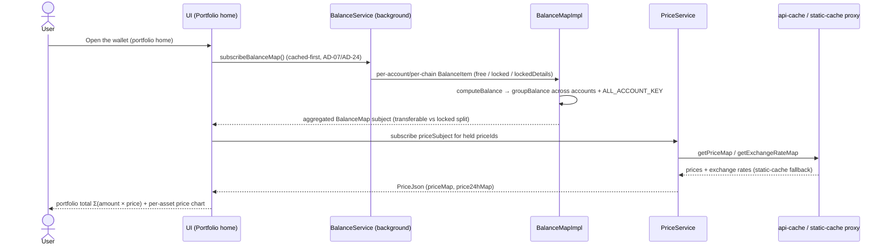

> **⚠️ Corrected 2026-07-13 — AD-07's mechanism does not exist.** Wherever this file says
> reads ride a *"lightweight WsProvider"* and that a full `ApiPromise` is deferred to
> extrinsic construction, that is inherited from [AD-07](../../ARCHITECTURE.md#architecture-decisions),
> which was **decided in 2022 and never implemented**: `SubstrateApi` builds a full
> `ApiPromise` eagerly per enabled chain and the read path reads off it. Every memory figure
> here (~72 MB / ~264 MB) is a 2022 MV2-era claim with **no probe behind it**. **NFR-11 has
> since been retired and [US-20.3](../stories/US-20.3-read-path-memory-budget.md) deprecated** — memory
> is no longer a stated requirement ([CONTEXT D95](../../CONTEXT.md) / D96). Treat every
> memory sentence in this file as historical. If a memory complaint appears: **measure
> first** ([LESSONS §64](../../LESSONS.md)).

## Goal

The balance epic owns the wallet's **daily-home screen** — the aggregated
portfolio every user opens first. It turns the raw multi-chain balance and price
data produced by the engines into the read surface a holder actually looks at:
one dashboard summing every account across 200+ networks, a transferable-vs-locked
breakdown that every send flow trusts, token auto-detection with zero-balance
hiding, and live price plus per-asset charts. When this epic holds the line,
feature epics get to stop re-deriving "how much does the user have and what is it
worth".

## Overview

### Business context

Before this epic there is no portfolio view: the engines (EPIC-2) can compute a
per-account, per-chain balance and the Services SDK (AD-24) can aggregate it, but
nothing presents a single number the user can open the popup to and trust. EPIC-7
owns the **balance read surface** — the home dashboard that sums value across all
accounts and chains (FR-68), the transferable/locked/frozen split that drives both
the home display and the max-send affordances (FR-69), the token-visibility model
that auto-detects holdings and hides dust (FR-70), and the price layer that shows
a live USD value and a per-asset chart (FR-71, FR-72), with planned balance history
(FR-73).

This epic adds a *read path*, not a write path. It does **not** compute balances
on-device chain-by-chain and it does **not** move funds. Cross-chain balance
aggregation and price assembly are the **engine** layer: `BalanceService` and the
Services SDK live in [EPIC-2](EPIC-2.md) ([US-2.5](../stories/US-2.5-balance-detection-and-aggregation-engine.md)),
which fans transferable/locked detection across all accounts and 200+ chains over
the lightweight WsProvider read path (AD-07) and the backend aggregation layer
(AD-24). EPIC-7 *consumes* those subjects and renders them; it owns the screen, the
visibility rules, the chart UX, and the cache-freshness contract the home screen
depends on (AD-25).

The architectural distinction this epic preserves: it owns **what the user sees on
the home screen**, not **how the numbers are produced** (engines, EPIC-2) and not
**how they are spent** (send flow, EPIC-8). The transferable/locked figure is
authored here and read by the send-flow validation in EPIC-8 — EPIC-7 publishes the
number; EPIC-8 enforces it against the existential-deposit guard.

### Feature pillars

| # | Pillar | Stories | Purpose |
|---|---|---|---|
| 1 | **Portfolio dashboard** | [US-7.1](../stories/US-7.1-aggregate-portfolio-across-accounts-and-chains.md), [US-7.6](../stories/US-7.6-balance-history-portfolio-value-over-time.md) | One aggregated value across every account and chain; planned value-over-time history |
| 2 | **Balance semantics** | [US-7.2](../stories/US-7.2-transferable-vs-locked-balance-calculation.md), [US-7.3](../stories/US-7.3-auto-detect-tokens-show-hide-zero-balance.md) | Transferable-vs-locked split trusted by send flows; auto-detect + zero-balance visibility |
| 3 | **Price & charts** | [US-7.4](../stories/US-7.4-real-time-token-price-and-per-asset-chart.md), [US-7.5](../stories/US-7.5-price-history-ohlcv-chart-per-asset.md) | Live USD value, per-asset price chart, historical OHLCV |
| 4 | **Cache integrity** | [US-7.7](../stories/US-7.7-balance-cache-invalidation-hardening.md) | The freshness/invalidation contract every home-screen read depends on |

### Out of scope

- **Cross-chain balance & price *engine* (`BalanceService` + Services SDK aggregation)** — owned by [EPIC-2](EPIC-2.md) ([US-2.5](../stories/US-2.5-balance-detection-and-aggregation-engine.md)). EPIC-2 produces the aggregated transferable/locked subjects across 200+ chains via AD-07 + AD-24; EPIC-7 only renders them on the home screen. The price-feed *engine* (provider fetch + cache assembly) likewise shares `BalanceService`/Services-SDK wiring in EPIC-2; EPIC-7 owns the price *display* and chart UX.
- **Send / transfer flow and max-send validation** — owned by [EPIC-8](EPIC-8.md). EPIC-7 publishes the transferable figure (FR-69); EPIC-8 consumes it to gate transfers (existential-deposit guard, FR-80) and to compute the send amount. EPIC-7 never submits a transaction.
- **Earning / staking position values** — owned by [EPIC-12](EPIC-12.md) (EarningService surface). EPIC-7 shows wallet token balances; locked-for-staking amounts appear in the locked figure but the staking-position breakdown is EPIC-12's.
- **NFT holdings & media** — owned by [EPIC-9](EPIC-9.md). EPIC-7 aggregates fungible token value only.
- **On-chain transaction history** — owned by [EPIC-8](EPIC-8.md) (HistoryService). Balance *history* (FR-73) is a value-over-time series, not a transaction list, and is owned here.

## FR Coverage

| FR | Story | Status |
|----|-------|--------|
| FR-68 | [US-7.1](../stories/US-7.1-aggregate-portfolio-across-accounts-and-chains.md) | ✅ done |
| FR-69 (shared with EPIC-8) | [US-7.2](../stories/US-7.2-transferable-vs-locked-balance-calculation.md) | 📋 backlog |
| FR-70 | [US-7.3](../stories/US-7.3-auto-detect-tokens-show-hide-zero-balance.md) | ✅ done |
| FR-71 | [US-7.4](../stories/US-7.4-real-time-token-price-and-per-asset-chart.md) | ✅ done |
| FR-72 | [US-7.5](../stories/US-7.5-price-history-ohlcv-chart-per-asset.md) | ✅ done |
| FR-73 | [US-7.6](../stories/US-7.6-balance-history-portfolio-value-over-time.md) | 📋 backlog |

> FR statuses above are **story-planning** statuses (Stream B; all `📋 backlog`).
> The shipped state of each capability lives in [PRD](../../PRD.md#functional-requirements): FR-68..72 are
> `✅ shipped` (retroactive stories), FR-73 is `📋 planned` (forward). `done` +
> `version_shipped` are backfilled in version reconciliation. FR-69 is co-owned
> with [EPIC-8](EPIC-8.md): EPIC-7 authors the transferable/locked split; EPIC-8
> consumes it in the send flow. US-7.7 is a hardening cluster and owns no FR.

## AD Coverage

| AD | Title | Story |
|----|-------|-------|
| AD-07 | Lightweight WsProvider for balance queries; full ApiPromise deferred | [US-7.1](../stories/US-7.1-aggregate-portfolio-across-accounts-and-chains.md), [US-7.2](../stories/US-7.2-transferable-vs-locked-balance-calculation.md), [US-7.7](../stories/US-7.7-balance-cache-invalidation-hardening.md) |
| AD-24 | Backend Services SDK for multi-chain data aggregation | [US-7.1](../stories/US-7.1-aggregate-portfolio-across-accounts-and-chains.md), [US-7.3](../stories/US-7.3-auto-detect-tokens-show-hide-zero-balance.md) |
| AD-25 | Cache / CDN proxy layer for market data, metadata and NFT media | [US-7.4](../stories/US-7.4-real-time-token-price-and-per-asset-chart.md), [US-7.5](../stories/US-7.5-price-history-ohlcv-chart-per-asset.md), [US-7.7](../stories/US-7.7-balance-cache-invalidation-hardening.md) |
| AD-23 | Static-data caching generated by a headless web-runner cron | [US-7.6](../stories/US-7.6-balance-history-portfolio-value-over-time.md) |

> AD-07 and AD-24 are *referenced* here for the read path the home screen rides on;
> their primary implementation lives in [EPIC-2](EPIC-2.md)
> ([US-2.5](../stories/US-2.5-balance-detection-and-aggregation-engine.md)). EPIC-7
> consumes the aggregated subjects rather than re-deriving them.

## Stories

| ID | Title | Goal | Status | Version |
|---|---|---|---|---|
| [US-7.1](../stories/US-7.1-aggregate-portfolio-across-accounts-and-chains.md) | Aggregate portfolio across accounts and chains | One dashboard summing value across every account and 200+ chains | ✅ done | 0.2.2 |
| [US-7.2](../stories/US-7.2-transferable-vs-locked-balance-calculation.md) | Transferable vs locked/frozen balance calculation | Split each balance into transferable vs locked/frozen, trusted by send flows | ✅ done | 0.2.5 |
| [US-7.3](../stories/US-7.3-auto-detect-tokens-show-hide-zero-balance.md) | Auto-detect tokens; show/hide zero-balance | Auto-detect held tokens and let users hide zero-balance dust | ✅ done | 1.0.2 |
| [US-7.4](../stories/US-7.4-real-time-token-price-and-per-asset-chart.md) | Real-time token price and per-asset chart | Live USD value per asset plus a current-period price chart | ✅ done | 1.3.33 |
| [US-7.5](../stories/US-7.5-price-history-ohlcv-chart-per-asset.md) | Price history (OHLCV) chart per asset | Historical OHLCV chart with selectable ranges per asset | ✅ done | 1.3.33 |
| [US-7.6](../stories/US-7.6-balance-history-portfolio-value-over-time.md) | Balance history (portfolio value over time) | Historical portfolio value series over time (planned) | 📋 backlog | — |
| [US-7.7](../stories/US-7.7-balance-cache-invalidation-hardening.md) | Balance-cache invalidation hardening | Keep the home-screen balance cache correct under change: multi-step balance-change listening (#4337), crowdloan in locked composition (#1583), stale-cache invalidation on account removal (#2410) plus the account-switch / chain-toggle / transfer-submit invariant | 📋 backlog | — |

> US-7.1–7.6 each materialize one FR (US-7.6 forward; the rest retroactive); US-7.7
> is the epic's balance-correctness hardening cluster and owns no FR — it is anchored
> on real balance/cache issues (#4337, #1583, #2410) and defends the cache-freshness
> invariant every home-screen read depends on.

## Object map & user-story interactions

### US ↔ entity / subsystem matrix

| US | Primary entity / subsystem | FR / NFR |
|---|---|---|
| [US-7.1](../stories/US-7.1-aggregate-portfolio-across-accounts-and-chains.md) | `BalanceService.subscribeBalanceMap()` → `BalanceMapImpl.computeBalance` aggregated subject | FR-68 |
| [US-7.2](../stories/US-7.2-transferable-vs-locked-balance-calculation.md) | `BalanceType` split over `BalanceItem` (`free` / `locked` / `lockedDetails`) | FR-69 |
| [US-7.3](../stories/US-7.3-auto-detect-tokens-show-hide-zero-balance.md) | `BalanceService.autoEnableChains` / `optimizeEnableTokens` (Services-SDK `balanceDetectionApi`) + asset-visibility settings | FR-70 |
| [US-7.4](../stories/US-7.4-real-time-token-price-and-per-asset-chart.md) | `PriceService.priceSubject` + `getPriceMap` via `api-cache` proxy | FR-71 |
| [US-7.5](../stories/US-7.5-price-history-ohlcv-chart-per-asset.md) | `PriceService.getHistoryTokenPriceData` → `priceHistoryApi.getPriceHistory` (OHLCV, range-scoped) | FR-72 |
| [US-7.6](../stories/US-7.6-balance-history-portfolio-value-over-time.md) | Portfolio value-over-time series (aggregated composition × historical prices, precomputed/cached) | FR-73 |
| [US-7.7](../stories/US-7.7-balance-cache-invalidation-hardening.md) | `BalanceService.handleEvents` recompose/invalidate + `BalanceMapImpl.removeBalanceItems` | FR-69, FR-68 (defends), NFR-12 |

> Cell notation — `FR-N` / `FR-N (defends)` / `NFR-N` / `— (AD-N)` / `—`: [AGENTS.md §7 rule 8](../../../AGENTS.md).

### End-to-end happy path

**Branches not shown:** token auto-detection + hide-zero-balance recomputes the visible asset set off `autoEnableChains` / `optimizeEnableTokens` (US-7.3); per-asset historical OHLCV is range-scoped through `getHistoryTokenPriceData` (US-7.5); whole-portfolio value-over-time is composed from holdings × historical prices and served precomputed/cached, not re-valued live (US-7.6); a balance-change / account-switch / chain-toggle / account-removal event recomposes or invalidates the cache via `BalanceService.handleEvents` + `removeBalanceItems` (US-7.7).

## Cross-cutting invariants

- **Read path stays memory-bounded ([FR-68](../../PRD.md#functional-requirements), AD-07):** every balance read on the home screen rides the lightweight WsProvider / Services-SDK aggregation; no home-screen story may force a full `@polkadot/api` ApiPromise on the read path. Enforced by [US-7.1](../stories/US-7.1-aggregate-portfolio-across-accounts-and-chains.md), consumed from the EPIC-2 engine ([US-2.5](../stories/US-2.5-balance-detection-and-aggregation-engine.md)).
- **Transferable is the single source of truth ([FR-69](../../PRD.md#functional-requirements)):** the transferable figure authored here is the same number every send flow uses; the home display and the send-max affordance MUST derive from one calculation, never two. Enforced by [US-7.2](../stories/US-7.2-transferable-vs-locked-balance-calculation.md); consumed by [EPIC-8](EPIC-8.md).
- **Stale-but-visible over blank ([NFR-12](../../PRD.md#non-functional-requirements)):** on popup open the home screen serves last-known cached balances/prices immediately and refreshes progressively with visible skeletons; it never renders a blank portfolio while waiting. Enforced by [US-7.1](../stories/US-7.1-aggregate-portfolio-across-accounts-and-chains.md) and defended by [US-7.7](../stories/US-7.7-balance-cache-invalidation-hardening.md).
- **Price/market data goes through the proxy ([NFR-21](../../PRD.md#non-functional-requirements), AD-25):** token prices, exchange rates and historical OHLCV are fetched through SubWallet's `api-cache` proxy with a `static-cache` fallback — never directly from a keyed upstream in the bundle. Enforced by [US-7.4](../stories/US-7.4-real-time-token-price-and-per-asset-chart.md), [US-7.5](../stories/US-7.5-price-history-ohlcv-chart-per-asset.md).
- **Cache invalidation on the right events ([NFR-12](../../PRD.md#non-functional-requirements)):** balance/price caches MUST invalidate on account switch, chain enable/disable, and transfer-submit; a stale figure after a state change is a defect, not a refresh delay. Enforced by [US-7.7](../stories/US-7.7-balance-cache-invalidation-hardening.md).

## Cross-story testing requirements

| Pattern | Stories that apply | Shared infra |
|---|---|---|
| **Aggregated-balance subject fixture** | [US-7.1](../stories/US-7.1-aggregate-portfolio-across-accounts-and-chains.md), [US-7.2](../stories/US-7.2-transferable-vs-locked-balance-calculation.md), [US-7.3](../stories/US-7.3-auto-detect-tokens-show-hide-zero-balance.md) | A mock `BalanceService` RxJS subject (multi-account, multi-chain, with locked/frozen reserves) reused by every home-screen render test |
| **Price-proxy mock** | [US-7.4](../stories/US-7.4-real-time-token-price-and-per-asset-chart.md), [US-7.5](../stories/US-7.5-price-history-ohlcv-chart-per-asset.md), [US-7.6](../stories/US-7.6-balance-history-portfolio-value-over-time.md) | A stub `api-cache` price/OHLCV endpoint (live tick + historical series + failure mode) the chart stories share |
| **Cache-invalidation harness** | [US-7.7](../stories/US-7.7-balance-cache-invalidation-hardening.md) | Event-driven test that asserts cache invalidation on account-switch / chain-toggle / transfer-submit |

> The first home-screen story (US-7.1) sets up the aggregated-balance subject
> fixture; US-7.2/7.3 import it rather than rebuilding. The price-proxy mock is set
> up by US-7.4 and reused by US-7.5/7.6.

## Performance budgets & invariants

| Concern | Budget | Story | Rationale |
|---|---|---|---|
| **Home-screen first paint** | Cached portfolio visible ≤ 300 ms on popup open (NFR-12) | [US-7.1](../stories/US-7.1-aggregate-portfolio-across-accounts-and-chains.md) | The home screen is the most-opened surface; a blank wait reads as "wallet broken" |
| ~~**Aggregation read memory**~~ **retired** | ~~≤ 72 MB regardless of chain count~~ — NFR-11 retired 2026-07-13 ([D96](../../CONTEXT.md)) | [US-7.1](../stories/US-7.1-aggregate-portfolio-across-accounts-and-chains.md) | Full ApiPromise across 20 chains hits ~264 MB; the home read MUST stay on the lightweight path |
| **Price refresh** | Live price tick ≤ 1 fetch per asset per refresh window through `api-cache` | [US-7.4](../stories/US-7.4-real-time-token-price-and-per-asset-chart.md) | Per-asset upstream fetches cascade into proxy rate-limit exposure (NFR-21) |

## Acceptance criteria (propagated from stories)

- [ ] The home dashboard sums fiat value across every account and chain in one view, serving cached state immediately and refreshing progressively — [US-7.1](../stories/US-7.1-aggregate-portfolio-across-accounts-and-chains.md)
- [ ] Each token shows a transferable-vs-locked/frozen split, and the transferable figure is the same one the send flow consumes — [US-7.2](../stories/US-7.2-transferable-vs-locked-balance-calculation.md)
- [ ] Held tokens are auto-detected on supported chains and the user can show/hide zero-balance tokens — [US-7.3](../stories/US-7.3-auto-detect-tokens-show-hide-zero-balance.md)
- [ ] Each asset shows a live USD price and a current-period price chart fetched through the price proxy — [US-7.4](../stories/US-7.4-real-time-token-price-and-per-asset-chart.md)
- [ ] Each asset shows a historical OHLCV chart with selectable ranges — [US-7.5](../stories/US-7.5-price-history-ohlcv-chart-per-asset.md)
- [ ] The portfolio shows historical total value over time — [US-7.6](../stories/US-7.6-balance-history-portfolio-value-over-time.md) (planned)
- [ ] Balance/price caches invalidate on account-switch, chain-toggle and transfer-submit so the home screen never shows a stale figure after a state change — [US-7.7](../stories/US-7.7-balance-cache-invalidation-hardening.md)
