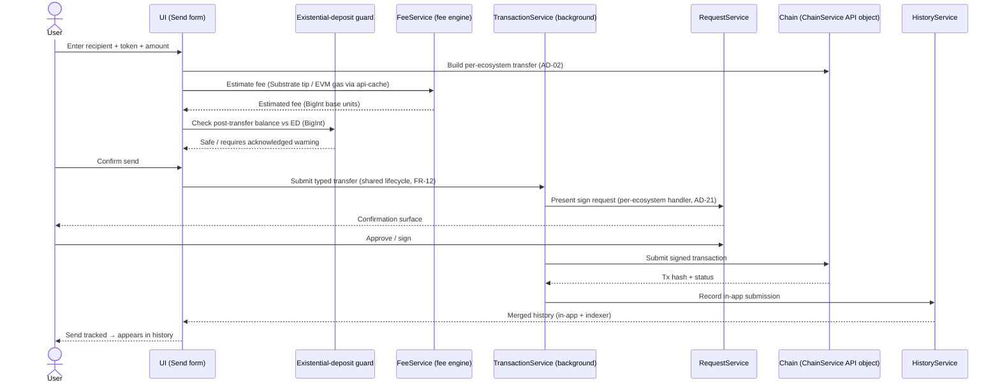

## Goal

Moving assets is what a wallet is *for*. This epic owns the **core money-movement
surface**: send and receive across all five ecosystems, the fee and tip controls
(including paying fees with a non-native token), on-chain transaction history with
optional Subscan acceleration, the existential-deposit safety guard, and the
signing experiences a user actually confirms — metadata-hash review, one-sign
batching, and token spending-approval. Downstream of the EPIC-2 engines, EPIC-8 is
where the user *initiates value transfer* and *reads back what happened*.

## Overview

### Business context

Before this epic the platform can hold balances (EPIC-7) and has the engines that
*can* move funds — the fee engine, the RequestService approval queue, and the
transaction lifecycle engine ([EPIC-2](EPIC-2.md), FR-10/11/12) — but exposes no
user-facing way to actually send a token, set a fee, read transaction history, or
confirm a sign request. EPIC-8 closes that gap: it is the **write path the end
user drives**, the feature layer that hands a typed transfer to the lifecycle
engine and renders the confirmation, fee, and history surfaces around it.

The epic adds a *user-facing money-movement* capability, not a new engine. It owns
(a) the **send / receive** flows for native and fungible tokens (ERC-20, PSP-22)
across Substrate / EVM / Bitcoin / TON / Cardano (FR-74, FR-75); (b) the
**fee & tip** controls including non-native fee tokens on Asset Hub / Hydration
(FR-76, FR-77); (c) the **transaction history** read surface backed by SubQuery /
SubSquid indexers with an optional personal Subscan API key (FR-78, FR-79, and the
planned export FR-84); and (d) the **safety & signing** confirmations — the
existential-deposit guard (FR-80), metadata-hash verified extrinsic review (FR-81),
one-sign / multi-step batching (FR-82), and the ERC-20 / PSP-22 spending-approval
step (FR-83).

The architectural distinction this epic preserves: it owns **what the user sends
and sees**, not **how a transaction is computed, queued, signed, or tracked**. The
fee *engine* (`fee-service`), the RequestService approval *queue*, and the
transaction lifecycle status machine all live in [EPIC-2](EPIC-2.md); EPIC-8
*consumes* them. Every send here is just transaction *content* handed to the shared
build → validate → sign → submit → track → history lifecycle (FR-12). Swap-specific
and bridge-specific money movement, which also ride that lifecycle, are owned by
their own epics.

### Feature pillars

| # | Pillar | Stories | Purpose |
| --- | --- | --- | --- |
| 1 | **Send & receive** | [US-8.1](../stories/US-8.1-send-native-and-fungible-tokens.md), [US-8.2](../stories/US-8.2-receive-qr-and-copyable-address.md) | Native + ERC-20/PSP-22 transfers across five ecosystems; per-ecosystem receive QR + copyable address |
| 2 | **Fee & tip control** | [US-8.3](../stories/US-8.3-custom-fee-and-tip.md), [US-8.4](../stories/US-8.4-pay-fees-with-non-native-token.md) | User-facing custom fee/tip for Substrate + EVM; pay fees with a non-native token |
| 3 | **Transaction history** | [US-8.5](../stories/US-8.5-on-chain-transaction-history.md), [US-8.6](../stories/US-8.6-subscan-api-key-configuration.md), [US-8.11](../stories/US-8.11-export-transaction-history.md) | Indexer-backed history, personal Subscan key for higher limits, planned history export |
| 4 | **Safety & signing** | [US-8.7](../stories/US-8.7-existential-deposit-safety-guard.md), [US-8.8](../stories/US-8.8-metadata-hash-signing.md), [US-8.9](../stories/US-8.9-multi-step-one-sign-signing.md), [US-8.10](../stories/US-8.10-token-spending-approval-confirmation.md) | ED guard, metadata-hash verified review, one-sign batching, spending-approval step |
| 5 | **Correctness hardening** | [US-8.12](../stories/US-8.12-fee-bigint-and-gas-estimation-hardening.md) | Fee / BigInt arithmetic / gas-estimation regression guards (no FR) |

### Out of scope

- **The fee *engine* (`fee-service`)** — owned by [EPIC-2](EPIC-2.md) (FR-10). EPIC-8 owns only the *user-facing* fee/tip controls (FR-76) and non-native-fee-token selection (FR-77) that drive the engine; it does not compute fees.
- **The RequestService approval *queue* / per-ecosystem sign handlers** — owned by [EPIC-2](EPIC-2.md) (FR-11, AD-21). EPIC-8's signing stories (FR-81/82/83) render and trigger confirmations through this queue; they do not rebuild it.
- **The transaction lifecycle status machine** — owned by [EPIC-2](EPIC-2.md) (FR-12). Every send/approve here submits *through* the shared lifecycle; the build → validate → sign → submit → track → history machine itself is not re-implemented per flow.
- **Swap as money movement** — owned by [EPIC-11](EPIC-11.md). Swaps ride the same lifecycle but their routing/quote surface is not a "send".
- **Bridge / XCM transfers** — owned by [EPIC-13](EPIC-13.md). Cross-chain movement and its per-route toggles are a separate transfer family.
- **Balance / transferable computation** — owned by [EPIC-7](EPIC-7.md) (FR-69). EPIC-8 *reads* transferable balance to bound a send; it does not compute it.
- **Hardware-wallet and QR signing devices** — owned by [EPIC-16](EPIC-16.md). EPIC-8's signing UX delegates to whatever signer the account uses.

## FR Coverage

| FR | Story | Status |
| ---- | ------- | -------- |
| FR-74 | [US-8.1](../stories/US-8.1-send-native-and-fungible-tokens.md) | ✅ done |
| FR-75 | [US-8.2](../stories/US-8.2-receive-qr-and-copyable-address.md) | ✅ done |
| FR-76 | [US-8.3](../stories/US-8.3-custom-fee-and-tip.md) | ✅ done |
| FR-77 | [US-8.4](../stories/US-8.4-pay-fees-with-non-native-token.md) | ✅ done |
| FR-78 | [US-8.5](../stories/US-8.5-on-chain-transaction-history.md) | ✅ done |
| FR-79 | [US-8.6](../stories/US-8.6-subscan-api-key-configuration.md) | ✅ done |
| FR-80 | [US-8.7](../stories/US-8.7-existential-deposit-safety-guard.md) | ✅ done |
| FR-81 | [US-8.8](../stories/US-8.8-metadata-hash-signing.md) | ✅ done |
| FR-82 | [US-8.9](../stories/US-8.9-multi-step-one-sign-signing.md) | ✅ done |
| FR-83 | [US-8.10](../stories/US-8.10-token-spending-approval-confirmation.md) | ✅ done |
| FR-84 | [US-8.11](../stories/US-8.11-export-transaction-history.md) | 📋 backlog |

> FR statuses above are **story-planning** statuses (Stream B; all `📋 backlog`).
> The shipped state lives in [PRD](../../PRD.md#functional-requirements): FR-74..83 are `✅ shipped`, FR-84
> (export history) is `📋 planned`. The FR-74..83 stories are **retroactive** —
> capability already shipped; `done` + `version_shipped` are backfilled in version
> reconciliation. US-8.12 is a hardening cluster and owns no FR.

## AD Coverage

| AD | Title | Story |
| ---- | ------- | ------- |
| AD-02 | ChainService per-chain API objects (fee/build/submit per ecosystem) | [US-8.3](../stories/US-8.3-custom-fee-and-tip.md), [US-8.4](../stories/US-8.4-pay-fees-with-non-native-token.md), [US-8.12](../stories/US-8.12-fee-bigint-and-gas-estimation-hardening.md) |
| AD-21 | Per-ecosystem request-handler abstraction in RequestService | [US-8.8](../stories/US-8.8-metadata-hash-signing.md), [US-8.9](../stories/US-8.9-multi-step-one-sign-signing.md), [US-8.10](../stories/US-8.10-token-spending-approval-confirmation.md) |
| AD-24 | Backend Services SDK for multi-chain data aggregation (fee / history) | [US-8.4](../stories/US-8.4-pay-fees-with-non-native-token.md), [US-8.5](../stories/US-8.5-on-chain-transaction-history.md) |
| AD-25 | Cache / CDN proxy layer (EVM gas via `api-cache`) | [US-8.3](../stories/US-8.3-custom-fee-and-tip.md), [US-8.12](../stories/US-8.12-fee-bigint-and-gas-estimation-hardening.md) |

> AD-21 is *owned* by [EPIC-2](EPIC-2.md) (FR-11); it is anchored here only because
> the signing stories render and trigger confirmations through its per-ecosystem
> handlers. The transaction lifecycle (AD-21's sibling, FR-12) and the fee engine
> (FR-10) are referenced throughout but materialized in EPIC-2, not here.

## Stories

| ID | Title | Goal | Status | Version |
| --- | --- | --- | --- | --- |
| [US-8.1](../stories/US-8.1-send-native-and-fungible-tokens.md) | Send native & fungible tokens | Send native + ERC-20/PSP-22 tokens across all five ecosystems | ✅ done | 0.4.1 |
| [US-8.2](../stories/US-8.2-receive-qr-and-copyable-address.md) | Receive (QR + copyable address) | Show a per-ecosystem receive QR code and copyable address | ✅ done | 0.2.5 |
| [US-8.3](../stories/US-8.3-custom-fee-and-tip.md) | Custom fee / tip | Let the user set a custom fee and tip on Substrate and EVM sends | ✅ done | 1.3.24 |
| [US-8.4](../stories/US-8.4-pay-fees-with-non-native-token.md) | Pay fees with a non-native token | Pay transaction fees in a non-native token (Asset Hub, Hydration) | ✅ done | 1.3.18 |
| [US-8.5](../stories/US-8.5-on-chain-transaction-history.md) | On-chain transaction history | Show on-chain history merged from SubQuery/SubSquid indexers | ✅ done | 0.2.7 |
| [US-8.6](../stories/US-8.6-subscan-api-key-configuration.md) | Subscan API-key configuration | Configure a personal Subscan API key to raise shared rate limits | ✅ done | 1.3.75 |
| [US-8.7](../stories/US-8.7-existential-deposit-safety-guard.md) | Existential-deposit safety guard | Warn before a transfer that would drop the sender below the ED | ✅ done | 0.2.5 |
| [US-8.8](../stories/US-8.8-metadata-hash-signing.md) | Metadata-hash signing | Verified extrinsic review via metadata hash (Ledger Generic) | ✅ done | 1.2.5 |
| [US-8.9](../stories/US-8.9-multi-step-one-sign-signing.md) | Multi-step / one-sign signing | Approve sequential transactions with a single confirmation | ✅ done | 1.3.21 |
| [US-8.10](../stories/US-8.10-token-spending-approval-confirmation.md) | Token spending-approval confirmation | Surface an ERC-20/PSP-22 allowance approval step before spend | ✅ done | 1.1.36 |
| [US-8.11](../stories/US-8.11-export-transaction-history.md) | Export transaction history | Export the transaction history to a file (planned) | 📋 backlog | — |
| [US-8.12](../stories/US-8.12-fee-bigint-and-gas-estimation-hardening.md) | Fee/BigInt & gas-estimation hardening | Fix fee-estimation accuracy, non-native fee payment, ED/BigInt transfer-max/all edges, and error surfacing (#4649/#4552/#2643/#4936/#4043/#3314/#4985/#3240) | 📋 backlog | — |
| [US-8.13](../stories/US-8.13-payload-decode-error-handling.md) | Payload decode error handling | Show a user-facing error instead of crashing when a transaction payload cannot be decoded | ✅ done | 1.3.82 |

> US-8.1..8.11 each materialize one FR (FR-74..84); US-8.12 is the epic's
> bug/iteration (hardening) cluster and owns no FR — it defends the fee / BigInt /
> gas-estimation *correctness* of the FR surfaces they harden (FR-76 / FR-77 / FR-80) —
> the PRD states no correctness NFR. US-8.13 is a shipped hardening fix (Issue #4989)
> and maps to no requirement at all: nothing in the PRD covers crash-resistance or
> error surfacing on the confirmation screen (recorded as a PRD gap in US-21.2).

## Object map & user-story interactions

### US ↔ entity / subsystem matrix

| US | Primary entity / subsystem | FR |
| --- | --- | --- |
| [US-8.1](../stories/US-8.1-send-native-and-fungible-tokens.md) | Per-ecosystem `ChainService` transfer builder (`SubstrateApi` / `EvmApi` / BTC / TON / Cardano) | FR-74 |
| [US-8.2](../stories/US-8.2-receive-qr-and-copyable-address.md) | Per-ecosystem address resolver + QR encoder (keyring/account layer) | FR-75 |
| [US-8.3](../stories/US-8.3-custom-fee-and-tip.md) | Fee/tip control over the fee engine (Substrate tip / EVM EIP-1559, `api-cache` gas) | FR-76 |
| [US-8.4](../stories/US-8.4-pay-fees-with-non-native-token.md) | Non-native fee-asset selector + Services-SDK fee aggregation | FR-77 |
| [US-8.5](../stories/US-8.5-on-chain-transaction-history.md) | `HistoryService` merge (SubQuery/SubSquid indexer + in-app records) | FR-78 |
| [US-8.6](../stories/US-8.6-subscan-api-key-configuration.md) | Personal Subscan API-key settings slice + Subscan request path | FR-79 |
| [US-8.7](../stories/US-8.7-existential-deposit-safety-guard.md) | Existential-deposit guard (per-chain ED constant from `ChainService`) | FR-80 |
| [US-8.8](../stories/US-8.8-metadata-hash-signing.md) | Check-metadata-hash signed extension + RequestService Substrate handler | FR-81 |
| [US-8.9](../stories/US-8.9-multi-step-one-sign-signing.md) | One-Sign sequence model + RequestService batch confirmation | FR-82 |
| [US-8.10](../stories/US-8.10-token-spending-approval-confirmation.md) | ERC-20/PSP-22 allowance confirmation via RequestService handler | FR-83 |
| [US-8.11](../stories/US-8.11-export-transaction-history.md) | Merged-history serializer (CSV/JSON file export) | FR-84 |
| [US-8.12](../stories/US-8.12-fee-bigint-and-gas-estimation-hardening.md) | Fee/BigInt/gas-estimation correctness guard over the send + fee surface | — |

### End-to-end happy path

**Branches not shown:** non-native fee payment swaps the native fee step for a held-asset selector quoted via the Services SDK (US-8.4); a multi-transaction action (e.g. approve-then-spend) authorizes the whole sequence with one confirmation through the RequestService batch surface and halts on failure (US-8.9, fronted by the US-8.10 allowance step); a transfer at the `transferable = ED` boundary or a disconnected fee source routes through the US-8.12 hardening path (blocked with a specific error / unavailable state rather than a silent failure or stale fee).

## Cross-cutting invariants

- **Existential-deposit guard ([FR-80](../../PRD.md#functional-requirements)):** no send flow may submit a Substrate transfer that drops the sender below the chain's existential deposit (or reaps an account holding locked/reserved balance) without an explicit warning the user must acknowledge. Enforced by [US-8.7](../stories/US-8.7-existential-deposit-safety-guard.md); every other send story (US-8.1, US-8.3, US-8.4) routes its amount through this guard rather than re-deriving the threshold.
- **BigInt arithmetic, never float ([FR-76](../../PRD.md#functional-requirements), AD-02):** all balance, amount, fee and tip math is done in integer base units (`bigint` / `BN`), never `number` — a float rounding error on a token amount is a fund-loss bug. Enforced epic-wide; the regression guard lives in [US-8.12](../stories/US-8.12-fee-bigint-and-gas-estimation-hardening.md) and reviewers reject any `parseFloat`/`Number()` on an amount.
- **One status machine ([FR-12](../../PRD.md#functional-requirements), owned by EPIC-2):** every send, fee-bearing transfer and approval here submits through the shared transaction lifecycle (build → validate → sign → submit → track → history); no EPIC-8 story implements its own submit/track/record path. Enforced by routing all flows through `TransactionService`.
- **Signing goes through RequestService ([FR-11](../../PRD.md#functional-requirements), AD-21):** the metadata-hash, one-sign and spending-approval confirmations (US-8.8/8.9/8.10) are rendered and triggered through the per-ecosystem RequestService handlers, never signed inline in the feature flow.
- **History is read-only and merge-based ([FR-78](../../PRD.md#functional-requirements)):** the history surface merges in-app submissions with third-party indexer data (SubQuery / SubSquid / Subscan) and never treats an indexer entry as authoritative for a *pending* in-app submission. Enforced by [US-8.5](../stories/US-8.5-on-chain-transaction-history.md).

## Cross-story testing requirements

| Pattern | Stories that apply | Shared infra |
| --- | --- | --- |
| **Per-ecosystem transfer build → submit harness** | [US-8.1](../stories/US-8.1-send-native-and-fungible-tokens.md), [US-8.4](../stories/US-8.4-pay-fees-with-non-native-token.md), [US-8.12](../stories/US-8.12-fee-bigint-and-gas-estimation-hardening.md) | `services/transaction-service` transfer-build tests + per-ecosystem `ChainService` API-object fixtures (Substrate/EVM/BTC/TON/Cardano) |
| **Fee-estimation / custom-fee fixture** | [US-8.3](../stories/US-8.3-custom-fee-and-tip.md), [US-8.4](../stories/US-8.4-pay-fees-with-non-native-token.md), [US-8.12](../stories/US-8.12-fee-bigint-and-gas-estimation-hardening.md) | `services` fee tests incl. the EVM-gas `api-cache` path + non-native fee-asset quote (Services SDK) |
| **Confirmation / safety-guard fixture** | [US-8.7](../stories/US-8.7-existential-deposit-safety-guard.md), [US-8.8](../stories/US-8.8-metadata-hash-signing.md), [US-8.9](../stories/US-8.9-multi-step-one-sign-signing.md), [US-8.10](../stories/US-8.10-token-spending-approval-confirmation.md) | ED-threshold (BigInt vs chain ED constant) + RequestService per-ecosystem handler enqueue harness (metadata-hash / one-sign batch / allowance) |
| **Transaction-history merge fixture** | [US-8.5](../stories/US-8.5-on-chain-transaction-history.md), [US-8.6](../stories/US-8.6-subscan-api-key-configuration.md), [US-8.11](../stories/US-8.11-export-transaction-history.md) | `HistoryService` merge test (indexer vs in-app reconciliation, Subscan key path, serialized export rows) |

> **Cross-reference:** executable scenarios for this epic live in
> `docs/tests/test-cases/EPIC-8.md` (when authored). The table above declares
> the *harness*; the test-cases file owns the *scenarios*.

## Performance budgets & invariants

| Concern | Budget | Story | Rationale |
| --- | --- | --- | --- |
| **Fee/gas suggestion responsiveness** | Send form stays interactive while a default estimate shows; refined when the suggestion resolves (never blocks the form) | [US-8.3](../stories/US-8.3-custom-fee-and-tip.md) | Fee/gas fetch via the `api-cache` proxy must not stall the send form; defended by the EVM-gas path test in `services` fee tests |
| **History first-paint** | In-app records render immediately; indexer results stream in without blocking the first paint | [US-8.5](../stories/US-8.5-on-chain-transaction-history.md) | History is the trust surface; an unreachable indexer must degrade to in-app records + a staleness indicator, not a blank screen (defended by the `HistoryService` merge test) |
| **Fee/amount/ED arithmetic correctness** | All fee/tip/gas/ED math in integer base units (`bigint`/`BN`), exact at the `transferable = ED` boundary; estimated fee matches the on-chain charge within the chain's tolerance or surfaces unavailable | [US-8.12](../stories/US-8.12-fee-bigint-and-gas-estimation-hardening.md) | A float on an amount is a fund-loss bug; transfer-max/transfer-all at the ED boundary and disconnected-source estimates must never fail silently or show a stale fee (regression-guarded on #4649/#4552/#2643/#4936/#4043/#3314/#4985/#3240) |

## Acceptance criteria (propagated from stories)

- [ ] A user can send native and ERC-20/PSP-22 tokens across all five ecosystems — [US-8.1](../stories/US-8.1-send-native-and-fungible-tokens.md)
- [ ] A user can view a per-ecosystem receive QR code and copy the address — [US-8.2](../stories/US-8.2-receive-qr-and-copyable-address.md)
- [ ] A user can set a custom fee/tip on Substrate and EVM sends — [US-8.3](../stories/US-8.3-custom-fee-and-tip.md)
- [ ] A user can pay transaction fees with a non-native token on supported chains — [US-8.4](../stories/US-8.4-pay-fees-with-non-native-token.md)
- [ ] On-chain transaction history is shown, merged from SubQuery/SubSquid indexers — [US-8.5](../stories/US-8.5-on-chain-transaction-history.md)
- [ ] A personal Subscan API key can be configured to raise shared rate limits — [US-8.6](../stories/US-8.6-subscan-api-key-configuration.md)
- [ ] A transfer that would drop the sender below the existential deposit is warned before submission — [US-8.7](../stories/US-8.7-existential-deposit-safety-guard.md)
- [ ] Extrinsics can be reviewed via metadata-hash verified signing (Ledger Generic) — [US-8.8](../stories/US-8.8-metadata-hash-signing.md)
- [ ] Multiple sequential transactions can be approved with a single confirmation — [US-8.9](../stories/US-8.9-multi-step-one-sign-signing.md)
- [ ] An ERC-20/PSP-22 spending-approval step is surfaced before an allowance spend — [US-8.10](../stories/US-8.10-token-spending-approval-confirmation.md)
- [ ] Transaction history can be exported to a file — [US-8.11](../stories/US-8.11-export-transaction-history.md) — backlog (planned, FR-84)
- [ ] Fee/amount/ED arithmetic correctness is fixed and regression-guarded — accurate substrate/EVM fee display, non-native fee payment, transfer-max/all at the ED boundary, and specific failure errors (#4649/#4552/#2643/#4936/#4043/#3314/#4985/#3240) — [US-8.12](../stories/US-8.12-fee-bigint-and-gas-estimation-hardening.md)
