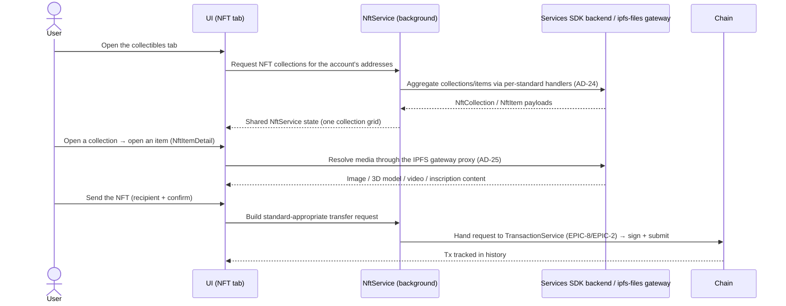

## Goal

Give users a single collectibles surface — see every NFT they own across
Substrate, EVM and Bitcoin, however it is rendered (image / 3D / video /
inscription), and send it — without caring which standard or chain the
collection lives on. A new collection standard is a new handler behind one
NFT UI, never a new screen.

## Overview

### Business context

Before this epic the wallet can hold tokens but cannot show or move the
collectibles that sit on the same chains. EPIC-9 owns the **NFT read +
transfer path**: the per-standard detection/display handlers that feed one
collection grid and item detail view, the media pipeline that renders images,
3D models, video and Bitcoin inscriptions, custom-collection import by
contract, and the send flow. The collectibles surface is the user-facing
payoff of having multi-chain accounts (EPIC-3) and a chain registry (EPIC-4).

The subsystem is built around **`NftService`** and a **per-standard handler
registry** (`BaseNftHandler` → `EvmNftHandler`, `UniqueNftHandler`, …), mirroring
the EarningService pool-handler tree (AD-22): adding a standard is a new
handler subclass, not a UI branch. NFT collections, items and media metadata
are **aggregated through the SubWallet Services SDK backend** (AD-24, NFR-20)
rather than scanned entirely on-device, and all NFT media is fetched through
the **`ipfs-files` IPFS gateway proxy** (AD-25, NFR-21) with multi-gateway
fallback.

The epic owns *display, import and transfer assembly* — it does **not** own the
primitives it composes. The Bitcoin Ordinals/inscriptions read path depends on
the keyed `btc-api` indexer proxy (NFR-16) that is owned by [EPIC-4](EPIC-4.md);
the actual transaction **signing and submission** for an NFT send is owned by
[EPIC-8](EPIC-8.md) (transaction) + [EPIC-2](EPIC-2.md) (core-platform engines).
EPIC-9 builds the NFT-shaped transfer request and hands it to that pipeline.

> FR statuses below are **story-planning** statuses (Stream B; all `📋 backlog`).
> The real shipped state of each capability lives in [PRD](../../PRD.md#functional-requirements) — most
> of EPIC-9 is `✅ shipped` there (FR-88 planned, FR-93 planned); `done` +
> `version_shipped` are backfilled in version reconciliation.

### Feature pillars

| # | Pillar | Stories | Purpose |
|---|---|---|---|
| 1 | **Multi-standard display** | [US-9.1](../stories/US-9.1-substrate-nft-display.md), [US-9.2](../stories/US-9.2-nested-bundled-nft-display.md), [US-9.3](../stories/US-9.3-evm-nft-display.md), [US-9.4](../stories/US-9.4-erc-1155-nft-support.md), [US-9.7](../stories/US-9.7-bitcoin-ordinals-display.md) | Detect + show collections across Substrate, EVM, ERC-1155 and Bitcoin under one grid |
| 2 | **Rich media rendering** | [US-9.6](../stories/US-9.6-3d-and-video-nft-viewer.md), [US-9.13](../stories/US-9.13-nft-media-and-ipfs-gateway-pipeline.md), [US-9.10](../stories/US-9.10-nft-display-and-transfer-hardening.md) | 3D / video viewer + IPFS media pipeline + NFT display/UI correctness hardening (detail render, cross-browser display) |
| 3 | **Collection extensibility** | [US-9.8](../stories/US-9.8-custom-nft-import.md), [US-9.9](../stories/US-9.9-additional-collections-and-standards.md) | Custom import by contract + additional collections / ERC-6551 token-bound accounts |
| 4 | **Transfer** | [US-9.5](../stories/US-9.5-nft-transfer-send.md) | Build and send an NFT to any compatible address |
| 5 | **NFT service & portfolio** | [US-9.19](../stories/US-9.19-nft-service-migration.md), [US-9.20](../stories/US-9.20-client-side-nft-service-and-sdk-migration.md), [US-9.21](../stories/US-9.21-nft-portfolio-management.md) | NFT-service migration, client-side SDK migration, and portfolio management |

### Out of scope

- **Bitcoin mainnet indexer + Ordinals/Runes `btc-api` proxy** — owned by [EPIC-4](EPIC-4.md) (network) and protected by NFR-16. EPIC-9 *consumes* the inscription read endpoint; it does not own the keyed proxy or the indexer.
- **NFT transfer signing & submission** — owned by [EPIC-8](EPIC-8.md) (transaction) + [EPIC-2](EPIC-2.md) (core-platform engines). EPIC-9 assembles the transfer request; the signing surface, fee handling and broadcast live there.
- **The chain registry / custom-RPC / EVM+Bitcoin network enablement** — owned by [EPIC-4](EPIC-4.md). NFT handlers run on chains that are already registered and active.
- **Account derivation across ecosystems** — owned by [EPIC-3](EPIC-3.md). NFT detection runs over addresses that already exist.

## FR Coverage

> Every FR is assigned a story ID up front (FR order) so numbering is locked — no
> renumber when the remaining stories are authored. Links = story file exists;
> status reflects the *story's* Stream-B planning state (all backlog).

| FR | Story | Status |
|----|-------|--------|
| FR-85 | [US-9.1](../stories/US-9.1-substrate-nft-display.md) | ✅ done |
| FR-86 | [US-9.2](../stories/US-9.2-nested-bundled-nft-display.md) | ✅ done |
| FR-87 | [US-9.3](../stories/US-9.3-evm-nft-display.md) | ✅ done |
| FR-88 | [US-9.4](../stories/US-9.4-erc-1155-nft-support.md) | 📋 backlog |
| FR-89 | [US-9.5](../stories/US-9.5-nft-transfer-send.md) | ✅ done |
| FR-90 | [US-9.6](../stories/US-9.6-3d-and-video-nft-viewer.md) | ✅ done |
| FR-91 (btc-api shared with EPIC-4) | [US-9.7](../stories/US-9.7-bitcoin-ordinals-display.md) | 📋 backlog |
| FR-92 | [US-9.8](../stories/US-9.8-custom-nft-import.md) | ✅ done |
| FR-93 | [US-9.9](../stories/US-9.9-additional-collections-and-standards.md) | 📋 backlog |

> [US-9.10](../stories/US-9.10-nft-display-and-transfer-hardening.md) **owns no FR
> row above** — it is a cross-cutting hardening story that *defends* FR-85 / FR-89 /
> FR-92 (it carries them in `prd_ref`; they are what its ACs protect) rather than
> materializing a requirement of its own. It hardens NFT display & UI correctness
> (detail render, cross-browser display) across the display FRs above. Transfer hardening now lives in [US-9.5](../stories/US-9.5-nft-transfer-send.md),
> import validation in [US-9.8](../stories/US-9.8-custom-nft-import.md), and the
> media pipeline in [US-9.13](../stories/US-9.13-nft-media-and-ipfs-gateway-pipeline.md).

## AD Coverage

| AD | Title | Story |
|----|-------|-------|
| AD-24 | Backend Services SDK for multi-chain data aggregation (NFT) | [US-9.1](../stories/US-9.1-substrate-nft-display.md), [US-9.3](../stories/US-9.3-evm-nft-display.md), [US-9.19](../stories/US-9.19-nft-service-migration.md), [US-9.20](../stories/US-9.20-client-side-nft-service-and-sdk-migration.md) |
| AD-25 | Cache / CDN proxy layer — `ipfs-files` NFT media gateway | [US-9.13](../stories/US-9.13-nft-media-and-ipfs-gateway-pipeline.md) |

> AD-22 (handler-per-type class hierarchy) is *referenced* — the NFT handler
> registry follows the same pattern — but its primary materialization lives in
> [EPIC-12](EPIC-12.md) (earning). NFR-16 (`btc-api` key protection) is
> *referenced* by US-9.7 but owned by [EPIC-4](EPIC-4.md).

## Stories

Each NFT capability is **one story** — it carries its requirement (where it materializes an FR) *and* its full incremental-work history (fixes, chores, chain/collection integrations) as an "Incremental work, fixes & chores" timeline inside the story. There is no separate maintenance layer. **14 capability stories** below — the whole NFT area.

| ID | Title | Goal | Status | Version |
|---|---|---|---|---|
| [US-9.1](../stories/US-9.1-substrate-nft-display.md) | Substrate NFT display (RMRK / Unique / PSP-34) | Substrate NFT collections + all Substrate chain/collection integrations | ✅ done | 0.6.7 |
| [US-9.2](../stories/US-9.2-nested-bundled-nft-display.md) | Nested / bundled NFT display | Render parent–child bundles + nesting-tree navigation | ✅ done | 1.3.80 |
| [US-9.3](../stories/US-9.3-evm-nft-display.md) | EVM NFT display (ERC-721) | ERC-721 collections + all EVM chain/collection integrations | ✅ done | 0.3.1 |
| [US-9.4](../stories/US-9.4-erc-1155-nft-support.md) | ERC-1155 NFT support | Display + transfer multi-token-standard NFTs | 📋 backlog | — |
| [US-9.5](../stories/US-9.5-nft-transfer-send.md) | NFT transfer (send + hardening) | Send an NFT to any compatible address + all transfer hardening | ✅ done | 0.2.8 |
| [US-9.6](../stories/US-9.6-3d-and-video-nft-viewer.md) | 3D and video NFT viewer | Render 3D models and video NFTs in item detail | ✅ done | 0.6.5 |
| [US-9.7](../stories/US-9.7-bitcoin-ordinals-display.md) | Bitcoin Ordinals / inscriptions | Ordinals/inscriptions (webapp shipped; full extension support planned) | 📋 backlog | — |
| [US-9.8](../stories/US-9.8-custom-nft-import.md) | Custom NFT import & validation | Import a collection by contract + all import/validation hardening | ✅ done | 0.4.1 |
| [US-9.9](../stories/US-9.9-additional-collections-and-standards.md) | Additional collections & standards (ERC-6551) | Onboard Ternoa/Joystream/Aventus + ERC-6551 token-bound accounts | 📋 backlog | — |
| [US-9.10](../stories/US-9.10-nft-display-and-transfer-hardening.md) | NFT display & UI hardening | Detail render, cross-browser display, webapp UI correctness | 📋 backlog | — |
| [US-9.13](../stories/US-9.13-nft-media-and-ipfs-gateway-pipeline.md) | NFT media & IPFS gateway pipeline | RMRK/IPFS endpoints, resolver, image-error & media reliability | ✅ done | 1.3.56 |
| [US-9.19](../stories/US-9.19-nft-service-migration.md) | NFT service migration | Migrate the NFT feature into the new UI/service architecture | ✅ done | 1.0.2 |
| [US-9.20](../stories/US-9.20-client-side-nft-service-and-sdk-migration.md) | Client-side NFT Service & SDK migration | Client-side NftService + migrate existing logic to the SDK (Phase 1 shipped) | 🚧 in-progress | — |
| [US-9.21](../stories/US-9.21-nft-portfolio-management.md) | NFT portfolio management | Organize and curate the NFTs a user holds | 📋 backlog | — |

> **US-9.9** (FR-93) is 📋 planned in the PRD; authored here as `backlog` per Stream-B convention. **US-9.7** / **US-9.10** are `backlog` at the requirement level (the FR/hardening capability is not signed off) even though shipped incremental work appears in their timelines.
>
> Two mis-area issues a title heuristic had routed here — **#639** (USDC & stEWT, token support) and **#1967** (Mint-NFT campaign) — were **relocated 2026-07-17** to [EPIC-24](EPIC-24.md) and [EPIC-39](EPIC-39.md). Full issue→story map: [consolidation note](../../notes/2026-07-17-epic-9-consolidation.md).

## Object map & user-story interactions

### US ↔ entity / subsystem matrix

| US | Primary entity / subsystem | FR / NFR |
|---|---|---|
| [US-9.1](../stories/US-9.1-substrate-nft-display.md) | `NftService` + Substrate handlers (RMRK / Unique / Statemine / PSP-34) | FR-85 |
| [US-9.2](../stories/US-9.2-nested-bundled-nft-display.md) | `UniqueNftHandler` bundle tree (`isBundle`, `nestingTokens`, `parentId`) | FR-86 |
| [US-9.3](../stories/US-9.3-evm-nft-display.md) | `EvmNftHandler` (ERC-721 via Services SDK) | FR-87 |
| [US-9.4](../stories/US-9.4-erc-1155-nft-support.md) | `EvmNftHandler` ERC-1155 branch + transfer | FR-88 |
| [US-9.5](../stories/US-9.5-nft-transfer-send.md) | NFT transfer request → TransactionService | FR-89 |
| [US-9.6](../stories/US-9.6-3d-and-video-nft-viewer.md) | `NftItemDetail` media renderer (model-viewer / video) | FR-90 |
| [US-9.7](../stories/US-9.7-bitcoin-ordinals-display.md) | Ordinals handler over `btc-api` inscriptions | FR-91 |
| [US-9.8](../stories/US-9.8-custom-nft-import.md) | `NftImport` form + `upsertCustomToken` | FR-92 |
| [US-9.9](../stories/US-9.9-additional-collections-and-standards.md) | New chain handlers + ERC-6551 token-bound accounts | FR-93 |
| [US-9.10](../stories/US-9.10-nft-display-and-transfer-hardening.md) | NFT detail render + cross-browser display + webapp UI hardening | FR-85, FR-89, FR-92 (defends) |
| [US-9.13](../stories/US-9.13-nft-media-and-ipfs-gateway-pipeline.md) | `NftService` IPFS media pipeline (`baseParseIPFSUrl` → `getRandomIpfsGateway`, multi-gateway fallback) | NFR-21 |
| [US-9.19](../stories/US-9.19-nft-service-migration.md) | NFT feature migration onto the new-UI service architecture | — (AD-24) |
| [US-9.20](../stories/US-9.20-client-side-nft-service-and-sdk-migration.md) | Client-side `NftService` + Services SDK migration | — (AD-24) |
| [US-9.21](../stories/US-9.21-nft-portfolio-management.md) | NFT portfolio management (curation / organization) | — |

> Cell notation: [CONTEXT D109](../../CONTEXT.md#d109-the-requirement-column-has-five-meanings--write-the-legend-once-not-once-per-epic).

### End-to-end happy path

**Branches not shown:** the Bitcoin Ordinals/inscriptions read path routes through the keyed `btc-api` inscriptions proxy before mapping into the shared grid ([US-9.7](../stories/US-9.7-bitcoin-ordinals-display.md)); a collection auto-detection misses is added by contract via the `NftImport` form + `upsertCustomToken` ([US-9.8](../stories/US-9.8-custom-nft-import.md)); when the Services SDK backend or media asset fails, the affected chain/item degrades to a non-blocking error or placeholder while the rest of the grid stays interactive ([US-9.10](../stories/US-9.10-nft-display-and-transfer-hardening.md)).

## Cross-cutting invariants

- **Standard-agnostic display ([FR-85](../../PRD.md#functional-requirements), [FR-87](../../PRD.md#functional-requirements)):** every standard plugs in as an `NftService` handler (`BaseNftHandler` subclass) feeding one collection grid + item-detail view; no story may add a standard-specific NFT-UI branch. Enforced per-story by a "new standard ⇒ new handler, not new screen" review check.
- **All NFT media flows through the IPFS gateway proxy ([NFR-21](../../PRD.md#non-functional-requirements), AD-25):** no component fetches a raw `ipfs://` / pinned-gateway URL directly; everything is resolved through `baseParseIPFSUrl` → `getRandomIpfsGateway` with `ipfs-files.subwallet.app` as the weighted primary and public-gateway fallbacks. Enforced per-story by a "new render path resolves through the IPFS helper, never a raw gateway literal" review check on the media-rendering stories ([US-9.6](../stories/US-9.6-3d-and-video-nft-viewer.md), [US-9.13](../stories/US-9.13-nft-media-and-ipfs-gateway-pipeline.md)).
- **Aggregated reads, not on-device full scans ([NFR-20](../../PRD.md#non-functional-requirements), AD-24):** collection/item detection is sourced through the Services SDK backend; handlers do not enumerate every contract on-chain from the client.
- **Keyed Ordinals proxy is never bypassed ([NFR-16](../../PRD.md#non-functional-requirements), owned by EPIC-4):** the Bitcoin Ordinals read path goes through the `btc-api` service-token proxy; no provider key is read on-device. EPIC-9 consumes this guarantee, it does not weaken it. Enforced by [US-9.7](../stories/US-9.7-bitcoin-ordinals-display.md).
- **Transfer assembly only, never signing here ([FR-89](../../PRD.md#functional-requirements)):** NFT stories build the transfer request and hand it to the EPIC-8/EPIC-2 signing pipeline; no story signs or broadcasts inside the NFT subsystem.

## Cross-story testing requirements

| Pattern | Stories that apply | Shared infra |
|---|---|---|
| **NFT-collection load fixture (per-standard handler → shared grid)** | [US-9.1](../stories/US-9.1-substrate-nft-display.md), [US-9.2](../stories/US-9.2-nested-bundled-nft-display.md), [US-9.3](../stories/US-9.3-evm-nft-display.md), [US-9.7](../stories/US-9.7-bitcoin-ordinals-display.md), [US-9.9](../stories/US-9.9-additional-collections-and-standards.md) | Mock Services SDK backend payloads mapped to `NftCollection` / `NftItem` through `NftService` handlers |
| **NFT transfer / submit harness** | [US-9.5](../stories/US-9.5-nft-transfer-send.md), [US-9.4](../stories/US-9.4-erc-1155-nft-support.md), [US-9.10](../stories/US-9.10-nft-display-and-transfer-hardening.md) | Transfer-request builder + stubbed TransactionService signing pipeline (amount/recipient/fee validation, confirmation amount/message) |
| **Media-render / item-detail fixture** | [US-9.6](../stories/US-9.6-3d-and-video-nft-viewer.md), [US-9.13](../stories/US-9.13-nft-media-and-ipfs-gateway-pipeline.md), [US-9.10](../stories/US-9.10-nft-display-and-transfer-hardening.md) | `NftItemDetail` renderer with IPFS-gateway-proxy stub (media-type detection, gateway fallback, placeholder degrade) |
| **Custom-import validation fixture** | [US-9.8](../stories/US-9.8-custom-nft-import.md), [US-9.10](../stories/US-9.10-nft-display-and-transfer-hardening.md) | `NftImport` form + `upsertCustomToken` with on-chain contract/standard validation + duplicate guard |

> **Cross-reference:** executable scenarios for this epic live in
> `docs/tests/test-cases/EPIC-9.md` (when authored). The table above declares
> the *harness*; the test-cases file owns the *scenarios*.

## Performance budgets & invariants

| Concern | Budget | Story | Rationale |
|---|---|---|---|
| **NFT media render** | Failed/slow media/detail degrades to a placeholder; never blocks the grid | [US-9.13](../stories/US-9.13-nft-media-and-ipfs-gateway-pipeline.md) | A single dead asset / failing detail must not freeze the whole collectibles surface |
| **Gateway fallback** | On gateway error, retry the next gateway in the weighted set before surfacing a render error | [US-9.13](../stories/US-9.13-nft-media-and-ipfs-gateway-pipeline.md) | Upstream IPFS gateways are flaky; one 5xx should not lose the image |

## Acceptance criteria (propagated from stories)

- [ ] Substrate NFT collections (RMRK / Unique / Asset Hub / PSP-34) appear in one grid — [US-9.1](../stories/US-9.1-substrate-nft-display.md)
- [ ] Nested/bundled NFTs render as a navigable parent–child tree — [US-9.2](../stories/US-9.2-nested-bundled-nft-display.md)
- [ ] EVM ERC-721 collections are detected and shown — [US-9.3](../stories/US-9.3-evm-nft-display.md)
- [ ] ERC-1155 NFTs can be displayed and transferred — [US-9.4](../stories/US-9.4-erc-1155-nft-support.md)
- [ ] An NFT can be sent to a compatible address and appears in history — [US-9.5](../stories/US-9.5-nft-transfer-send.md)
- [ ] 3D and video NFTs render in item detail with image fallback — [US-9.6](../stories/US-9.6-3d-and-video-nft-viewer.md)
- [ ] Bitcoin Ordinals inscriptions are shown for a Bitcoin account — [US-9.7](../stories/US-9.7-bitcoin-ordinals-display.md)
- [ ] A collection can be imported by contract address with validation — [US-9.8](../stories/US-9.8-custom-nft-import.md)
- [ ] Additional collections / ERC-6551 token-bound accounts surface (planned) — [US-9.9](../stories/US-9.9-additional-collections-and-standards.md)
- [ ] NFT detail renders without an error page and collections display correctly cross-browser — [US-9.10](../stories/US-9.10-nft-display-and-transfer-hardening.md)
- [x] NFT media resolves reliably through the IPFS gateway pipeline with multi-gateway fallback — [US-9.13](../stories/US-9.13-nft-media-and-ipfs-gateway-pipeline.md)
- [x] The NFT feature runs on the new-UI service architecture — [US-9.19](../stories/US-9.19-nft-service-migration.md)
- [ ] Client-side NFT Service + SDK migration (in progress — Phase 1 #4884 shipped v1.3.80) — [US-9.20](../stories/US-9.20-client-side-nft-service-and-sdk-migration.md)
- [ ] NFT portfolio management (planned) — [US-9.21](../stories/US-9.21-nft-portfolio-management.md)
