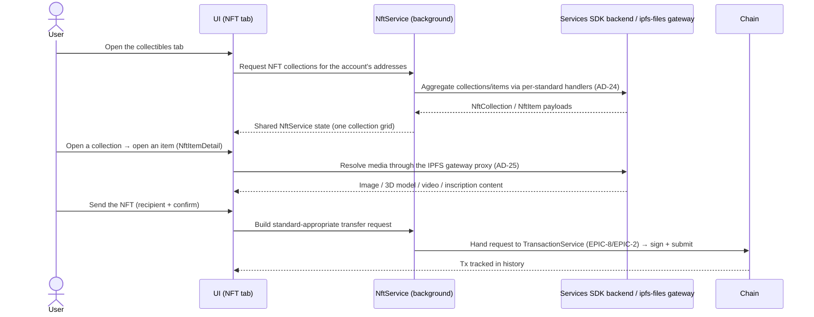

## Goal

Give users a single collectibles surface — see every NFT they own across
Substrate, EVM and Bitcoin, however it is rendered (image / 3D / video /
inscription), and send it — without caring which standard or chain the
collection lives on. A new collection standard is a new handler behind one
NFT UI, never a new screen.

## Overview

### Business context

Before this epic the wallet can hold tokens but cannot show or move the
collectibles that sit on the same chains. EPIC-9 owns the **NFT read +
transfer path**: the per-standard detection/display handlers that feed one
collection grid and item detail view, the media pipeline that renders images,
3D models, video and Bitcoin inscriptions, custom-collection import by
contract, and the send flow. The collectibles surface is the user-facing
payoff of having multi-chain accounts (EPIC-3) and a chain registry (EPIC-4).

The subsystem is built around **`NftService`** and a **per-standard handler
registry** (`BaseNftHandler` → `EvmNftHandler`, `UniqueNftHandler`, …), mirroring
the EarningService pool-handler tree (AD-22): adding a standard is a new
handler subclass, not a UI branch. NFT collections, items and media metadata
are **aggregated through the SubWallet Services SDK backend** (AD-24, NFR-20)
rather than scanned entirely on-device, and all NFT media is fetched through
the **`ipfs-files` IPFS gateway proxy** (AD-25, NFR-21) with multi-gateway
fallback.

The epic owns *display, import and transfer assembly* — it does **not** own the
primitives it composes. The Bitcoin Ordinals/inscriptions read path depends on
the keyed `btc-api` indexer proxy (NFR-16) that is owned by [EPIC-4](EPIC-4.md);
the actual transaction **signing and submission** for an NFT send is owned by
[EPIC-8](EPIC-8.md) (transaction) + [EPIC-2](EPIC-2.md) (core-platform engines).
EPIC-9 builds the NFT-shaped transfer request and hands it to that pipeline.

> FR statuses below are **story-planning** statuses (Stream B; all `📋 backlog`).
> The real shipped state of each capability lives in [PRD](../../PRD.md#functional-requirements) — most
> of EPIC-9 is `✅ shipped` there (FR-88 planned, FR-93 planned); `done` +
> `version_shipped` are backfilled in version reconciliation.

### Feature pillars

| # | Pillar | Stories | Purpose |
|---|---|---|---|
| 1 | **Multi-standard display** | [US-9.1](../stories/US-9.1-substrate-nft-display.md), [US-9.2](../stories/US-9.2-nested-bundled-nft-display.md), [US-9.3](../stories/US-9.3-evm-nft-display.md), [US-9.4](../stories/US-9.4-erc-1155-nft-support.md), [US-9.7](../stories/US-9.7-bitcoin-ordinals-display.md) | Detect + show collections across Substrate, EVM, ERC-1155 and Bitcoin under one grid |
| 2 | **Rich media rendering** | [US-9.6](../stories/US-9.6-3d-and-video-nft-viewer.md), [US-9.10](../stories/US-9.10-nft-display-and-transfer-hardening.md) | 3D / video viewer + NFT display & transfer correctness hardening (detail render, cross-browser display, transfer amount/message, import validation) |
| 3 | **Collection extensibility** | [US-9.8](../stories/US-9.8-custom-nft-import.md), [US-9.9](../stories/US-9.9-additional-collections-and-standards.md) | Custom import by contract + additional collections / ERC-6551 token-bound accounts |
| 4 | **Transfer** | [US-9.5](../stories/US-9.5-nft-transfer-send.md) | Build and send an NFT to any compatible address |

### Out of scope

- **Bitcoin mainnet indexer + Ordinals/Runes `btc-api` proxy** — owned by [EPIC-4](EPIC-4.md) (network) and protected by NFR-16. EPIC-9 *consumes* the inscription read endpoint; it does not own the keyed proxy or the indexer.
- **NFT transfer signing & submission** — owned by [EPIC-8](EPIC-8.md) (transaction) + [EPIC-2](EPIC-2.md) (core-platform engines). EPIC-9 assembles the transfer request; the signing surface, fee handling and broadcast live there.
- **The chain registry / custom-RPC / EVM+Bitcoin network enablement** — owned by [EPIC-4](EPIC-4.md). NFT handlers run on chains that are already registered and active.
- **Account derivation across ecosystems** — owned by [EPIC-3](EPIC-3.md). NFT detection runs over addresses that already exist.

## FR Coverage

> Every FR is assigned a story ID up front (FR order) so numbering is locked — no
> renumber when the remaining stories are authored. Links = story file exists;
> status reflects the *story's* Stream-B planning state (all backlog).

| FR | Story | Status |
|----|-------|--------|
| FR-85 | [US-9.1](../stories/US-9.1-substrate-nft-display.md) | ✅ done |
| FR-86 | [US-9.2](../stories/US-9.2-nested-bundled-nft-display.md) | ✅ done |
| FR-87 | [US-9.3](../stories/US-9.3-evm-nft-display.md) | ✅ done |
| FR-88 | [US-9.4](../stories/US-9.4-erc-1155-nft-support.md) | 📋 backlog |
| FR-89 | [US-9.5](../stories/US-9.5-nft-transfer-send.md) | ✅ done |
| FR-90 | [US-9.6](../stories/US-9.6-3d-and-video-nft-viewer.md) | ✅ done |
| FR-91 (btc-api shared with EPIC-4) | [US-9.7](../stories/US-9.7-bitcoin-ordinals-display.md) | 📋 backlog |
| FR-92 | [US-9.8](../stories/US-9.8-custom-nft-import.md) | ✅ done |
| FR-93 | [US-9.9](../stories/US-9.9-additional-collections-and-standards.md) | 📋 backlog |

> [US-9.10](../stories/US-9.10-nft-display-and-transfer-hardening.md) is a
> cross-cutting hardening story with **no FR** — it defends NFT display &
> transfer correctness (detail render, cross-browser display, transfer
> amount/message, import validation) across the display/transfer FRs above.

## AD Coverage

| AD | Title | Story |
|----|-------|-------|
| AD-24 | Backend Services SDK for multi-chain data aggregation (NFT) | [US-9.1](../stories/US-9.1-substrate-nft-display.md), [US-9.3](../stories/US-9.3-evm-nft-display.md), [US-9.10](../stories/US-9.10-nft-display-and-transfer-hardening.md) |
| AD-25 | Cache / CDN proxy layer — `ipfs-files` NFT media gateway | [US-9.10](../stories/US-9.10-nft-display-and-transfer-hardening.md) |

> AD-22 (handler-per-type class hierarchy) is *referenced* — the NFT handler
> registry follows the same pattern — but its primary materialization lives in
> [EPIC-12](EPIC-12.md) (earning). NFR-16 (`btc-api` key protection) is
> *referenced* by US-9.7 but owned by [EPIC-4](EPIC-4.md).

## Stories

| ID | Title | Goal | Status | Version |
|---|---|---|---|---|
| [US-9.1](../stories/US-9.1-substrate-nft-display.md) | Substrate NFT display (RMRK / Unique / PSP-34) | Show Substrate NFT collections across RMRK 1.0/2.0, Unique/Quartz, Asset Hub and PSP-34/WASM | ✅ done | 0.6.7 |
| [US-9.2](../stories/US-9.2-nested-bundled-nft-display.md) | Nested / bundled NFT display | Render parent–child bundles and let users navigate the nesting tree | ✅ done | 1.3.80 |
| [US-9.3](../stories/US-9.3-evm-nft-display.md) | EVM NFT display (ERC-721) | Detect + show ERC-721 collections across EVM chains | ✅ done | 0.3.1 |
| [US-9.4](../stories/US-9.4-erc-1155-nft-support.md) | ERC-1155 NFT support | Display + transfer multi-token-standard NFTs | 📋 backlog | — |
| [US-9.5](../stories/US-9.5-nft-transfer-send.md) | NFT transfer (send) | Send an NFT to any compatible address | ✅ done | 0.2.8 |
| [US-9.6](../stories/US-9.6-3d-and-video-nft-viewer.md) | 3D and video NFT viewer | Render 3D models and video NFTs in item detail | ✅ done | 0.6.5 |
| [US-9.7](../stories/US-9.7-bitcoin-ordinals-display.md) | Bitcoin Ordinals / inscriptions display | Show Ordinals inscriptions held on a Bitcoin account | 📋 backlog | — |
| [US-9.8](../stories/US-9.8-custom-nft-import.md) | Custom NFT import | Add a collection by contract (ERC-721 / PSP-34) | ✅ done | 0.4.1 |
| [US-9.9](../stories/US-9.9-additional-collections-and-standards.md) | Additional collections & standards (ERC-6551) | Onboard Ternoa/Joystream/Aventus + ERC-6551 token-bound accounts | 📋 backlog | — |
| [US-9.10](../stories/US-9.10-nft-display-and-transfer-hardening.md) | NFT display & transfer hardening | Harden NFT detail render, cross-browser display, transfer amount/message and import validation | 📋 backlog | — |

> US-9.9 (FR-93) is **📋 planned** in the PRD; it is authored here as
> `backlog` per Stream-B convention, with the planned state noted in its Background.

## Object map & user-story interactions

### US ↔ entity / subsystem matrix

| US | Primary entity / subsystem | FR |
|---|---|---|
| [US-9.1](../stories/US-9.1-substrate-nft-display.md) | `NftService` + Substrate handlers (RMRK / Unique / Statemine / PSP-34) | FR-85 |
| [US-9.2](../stories/US-9.2-nested-bundled-nft-display.md) | `UniqueNftHandler` bundle tree (`isBundle`, `nestingTokens`, `parentId`) | FR-86 |
| [US-9.3](../stories/US-9.3-evm-nft-display.md) | `EvmNftHandler` (ERC-721 via Services SDK) | FR-87 |
| [US-9.4](../stories/US-9.4-erc-1155-nft-support.md) | `EvmNftHandler` ERC-1155 branch + transfer | FR-88 |
| [US-9.5](../stories/US-9.5-nft-transfer-send.md) | NFT transfer request → TransactionService | FR-89 |
| [US-9.6](../stories/US-9.6-3d-and-video-nft-viewer.md) | `NftItemDetail` media renderer (model-viewer / video) | FR-90 |
| [US-9.7](../stories/US-9.7-bitcoin-ordinals-display.md) | Ordinals handler over `btc-api` inscriptions | FR-91 |
| [US-9.8](../stories/US-9.8-custom-nft-import.md) | `NftImport` form + `upsertCustomToken` | FR-92 |
| [US-9.9](../stories/US-9.9-additional-collections-and-standards.md) | New chain handlers + ERC-6551 token-bound accounts | FR-93 |
| [US-9.10](../stories/US-9.10-nft-display-and-transfer-hardening.md) | NFT detail render + transfer-request confirmation + cross-browser display + import validation | — |

### End-to-end happy path

**Branches not shown:** the Bitcoin Ordinals/inscriptions read path routes through the keyed `btc-api` inscriptions proxy before mapping into the shared grid ([US-9.7](../stories/US-9.7-bitcoin-ordinals-display.md)); a collection auto-detection misses is added by contract via the `NftImport` form + `upsertCustomToken` ([US-9.8](../stories/US-9.8-custom-nft-import.md)); when the Services SDK backend or media asset fails, the affected chain/item degrades to a non-blocking error or placeholder while the rest of the grid stays interactive ([US-9.10](../stories/US-9.10-nft-display-and-transfer-hardening.md)).

## Cross-cutting invariants

- **Standard-agnostic display ([FR-85](../../PRD.md#functional-requirements), [FR-87](../../PRD.md#functional-requirements)):** every standard plugs in as an `NftService` handler (`BaseNftHandler` subclass) feeding one collection grid + item-detail view; no story may add a standard-specific NFT-UI branch. Enforced per-story by a "new standard ⇒ new handler, not new screen" review check.
- **All NFT media flows through the IPFS gateway proxy ([NFR-21](../../PRD.md#non-functional-requirements), AD-25):** no component fetches a raw `ipfs://` / pinned-gateway URL directly; everything is resolved through `baseParseIPFSUrl` → `getRandomIpfsGateway` with `ipfs-files.subwallet.app` as the weighted primary and public-gateway fallbacks. Enforced per-story by a "new render path resolves through the IPFS helper, never a raw gateway literal" review check on the media-rendering stories ([US-9.6](../stories/US-9.6-3d-and-video-nft-viewer.md)).
- **Aggregated reads, not on-device full scans ([NFR-20](../../PRD.md#non-functional-requirements), AD-24):** collection/item detection is sourced through the Services SDK backend; handlers do not enumerate every contract on-chain from the client.
- **Keyed Ordinals proxy is never bypassed ([NFR-16](../../PRD.md#non-functional-requirements), owned by EPIC-4):** the Bitcoin Ordinals read path goes through the `btc-api` service-token proxy; no provider key is read on-device. EPIC-9 consumes this guarantee, it does not weaken it. Enforced by [US-9.7](../stories/US-9.7-bitcoin-ordinals-display.md).
- **Transfer assembly only, never signing here ([FR-89](../../PRD.md#functional-requirements)):** NFT stories build the transfer request and hand it to the EPIC-8/EPIC-2 signing pipeline; no story signs or broadcasts inside the NFT subsystem.

## Cross-story testing requirements

| Pattern | Stories that apply | Shared infra |
|---|---|---|
| **NFT-collection load fixture (per-standard handler → shared grid)** | [US-9.1](../stories/US-9.1-substrate-nft-display.md), [US-9.2](../stories/US-9.2-nested-bundled-nft-display.md), [US-9.3](../stories/US-9.3-evm-nft-display.md), [US-9.7](../stories/US-9.7-bitcoin-ordinals-display.md), [US-9.9](../stories/US-9.9-additional-collections-and-standards.md) | Mock Services SDK backend payloads mapped to `NftCollection` / `NftItem` through `NftService` handlers |
| **NFT transfer / submit harness** | [US-9.5](../stories/US-9.5-nft-transfer-send.md), [US-9.4](../stories/US-9.4-erc-1155-nft-support.md), [US-9.10](../stories/US-9.10-nft-display-and-transfer-hardening.md) | Transfer-request builder + stubbed TransactionService signing pipeline (amount/recipient/fee validation, confirmation amount/message) |
| **Media-render / item-detail fixture** | [US-9.6](../stories/US-9.6-3d-and-video-nft-viewer.md), [US-9.10](../stories/US-9.10-nft-display-and-transfer-hardening.md) | `NftItemDetail` renderer with IPFS-gateway-proxy stub (media-type detection, gateway fallback, placeholder degrade) |
| **Custom-import validation fixture** | [US-9.8](../stories/US-9.8-custom-nft-import.md), [US-9.10](../stories/US-9.10-nft-display-and-transfer-hardening.md) | `NftImport` form + `upsertCustomToken` with on-chain contract/standard validation + duplicate guard |

> **Cross-reference:** executable scenarios for this epic live in
> `docs/tests/test-cases/EPIC-9.md` (when authored). The table above declares
> the *harness*; the test-cases file owns the *scenarios*.

## Performance budgets & invariants

| Concern | Budget | Story | Rationale |
|---|---|---|---|
| **NFT media render** | Failed/slow media/detail degrades to a placeholder; never blocks the grid | [US-9.10](../stories/US-9.10-nft-display-and-transfer-hardening.md) | A single dead asset / failing detail must not freeze the whole collectibles surface |
| **Gateway fallback** | On gateway error, retry the next gateway in the weighted set before surfacing a render error | [US-9.6](../stories/US-9.6-3d-and-video-nft-viewer.md) | Upstream IPFS gateways are flaky; one 5xx should not lose the image |

## Acceptance criteria (propagated from stories)

- [ ] Substrate NFT collections (RMRK / Unique / Asset Hub / PSP-34) appear in one grid — [US-9.1](../stories/US-9.1-substrate-nft-display.md)
- [ ] Nested/bundled NFTs render as a navigable parent–child tree — [US-9.2](../stories/US-9.2-nested-bundled-nft-display.md)
- [ ] EVM ERC-721 collections are detected and shown — [US-9.3](../stories/US-9.3-evm-nft-display.md)
- [ ] ERC-1155 NFTs can be displayed and transferred — [US-9.4](../stories/US-9.4-erc-1155-nft-support.md)
- [ ] An NFT can be sent to a compatible address and appears in history — [US-9.5](../stories/US-9.5-nft-transfer-send.md)
- [ ] 3D and video NFTs render in item detail with image fallback — [US-9.6](../stories/US-9.6-3d-and-video-nft-viewer.md)
- [ ] Bitcoin Ordinals inscriptions are shown for a Bitcoin account — [US-9.7](../stories/US-9.7-bitcoin-ordinals-display.md)
- [ ] A collection can be imported by contract address with validation — [US-9.8](../stories/US-9.8-custom-nft-import.md)
- [ ] Additional collections / ERC-6551 token-bound accounts surface (planned) — [US-9.9](../stories/US-9.9-additional-collections-and-standards.md)
- [ ] NFT detail renders without an error page, collections display cross-browser, transfer shows correct amount/message, and import is validated — [US-9.10](../stories/US-9.10-nft-display-and-transfer-hardening.md)

## Maintenance ledger — incremental NFT work, fixes & chores

> **Folded in from the former "Maintenance — NFT" maintenance epic (2026-07-17).** These stories
> were generated as a separate maintenance epic; they now live **here**, inside EPIC-9, so the NFT
> area has a single home. They still **materialize no FR** — the requirement set is the FR Coverage
> and feature-pillar tables above; this ledger is the **tracker / CHANGELOG claim surface** that lets
> the ERP answer *"who shipped what, under which issue"* for NFT.
>
> Story IDs stay **`US-29.x`** — IDs are never renumbered ([AGENTS.md](../../../AGENTS.md) rule 1); the
> `29` is a retained historical numbering namespace, not a live epic (an EPIC-9 may own both `US-9.x`
> and `US-29.x` stories). The retirement of the old epic id and the old→new mapping are recorded in
> [notes/2026-07-17-epic-29-merged-into-epic-9](../../notes/2026-07-17-epic-29-merged-into-epic-9.md).

### What a ledger story is — and is not

- **It records the tracker, not the code.** Its acceptance criterion is a *coverage* assertion
  ("issue #N shipped in vX" / "closed on the tracker"), never an invented Given/When/Then — the
  [LESSONS §68](../../LESSONS.md) line this program exists to hold.
- **`points: 1` is a count, not a Fibonacci estimate.** One story = one shipped issue. **Never sum
  these with the pillar stories' points above** — a rollup here measures issue throughput, not effort.
- **`sprint` is a real month** (a single issue closed in one month), not a planned window ([D105](../../CONTEXT.md)).

### Scope

**116 stories** — **98 done** (shipped), **0 in flight** (ready / in-progress / review), **5 backlog**
(open, not yet started), **13 deprecated** (closed **not-planned / duplicate** — never shipped).
Open-issue status mirrors the GitHub Projects board (#2); closed-issue status comes from the tracker's
close reason. Per-issue detail is the [CHANGELOG coverage index](../../notes/changelog-coverage.md) and
each story's frontmatter.

### Ledger stories

Every ledger story, in issue order — click a US to open its tracker link, evidence and verification.
**Assignee** is who the tracker or the `[Issue-N]` PR/commit names (`—` where nobody is recorded);
**Shipped** is the `(Koni)` release, `—` when no CHANGELOG line proves one.

| US | Status | Title | Issue | Assignee | Shipped |
|---|---|---|---|---|---|
| [US-29.1](../stories/US-29.1-integrate-snow-evm-network.md) | ✅ done | Integrate Snow EVM network | [#12](https://github.com/Koniverse/SubWallet-Extension/issues/12) | minhle2994 | 1.0.5 |
| [US-29.2](../stories/US-29.2-update-rpc-endpoint-for-mangata.md) | ✅ done | Update RPC endpoint for Mangata | [#27](https://github.com/Koniverse/SubWallet-Extension/issues/27) | minhle2994 | 1.0.5 |
| [US-29.3](../stories/US-29.3-send-receive-nft-acala-karura.md) | ✅ done | Send / Receive NFT: Acala & Karura | [#28](https://github.com/Koniverse/SubWallet-Extension/issues/28) | minhle2994 | — |
| [US-29.4](../stories/US-29.4-update-zeitgeist-and-subsocial-integration.md) | ✅ done | Update Zeitgeist and Subsocial integration | [#29](https://github.com/Koniverse/SubWallet-Extension/issues/29) | minhle2994 | 1.0.5 |
| [US-29.5](../stories/US-29.5-send-receive-nft-statemine-statemint.md) | ✅ done | Send / Receive NFT: Statemine / Statemint | [#30](https://github.com/Koniverse/SubWallet-Extension/issues/30) | minhle2994 | — |
| [US-29.6](../stories/US-29.6-send-receive-moonbeam-moonriver-nft.md) | ✅ done | Send & Receive Moonbeam / Moonriver NFT | [#34](https://github.com/Koniverse/SubWallet-Extension/issues/34) | minhle2994 | 0.3.1 |
| [US-29.7](../stories/US-29.7-integrate-astar-nft.md) | ✅ done | Integrate Astar NFT | [#44](https://github.com/Koniverse/SubWallet-Extension/issues/44) | minhle2994 | 0.3.2 |
| [US-29.8](../stories/US-29.8-integrate-bit-country-nft-display-send-receive.md) | ✅ done | Integrate Bit.Country NFT: Display, Send, Receive | [#52](https://github.com/Koniverse/SubWallet-Extension/issues/52) | nulllpc | 0.3.1 |
| [US-29.9](../stories/US-29.9-display-incorrect-screen-when-click-on-back-to-homepage.md) | ✅ done | Display incorrect screen when click on “Back to Homepage” button in case Send NFT History has just been recorded on Subs | [#95](https://github.com/Koniverse/SubWallet-Extension/issues/95) | nulllpc | — |
| [US-29.10](../stories/US-29.10-can-t-open-or-takes-a-long-time-to-open-the-extension-i.md) | ✅ done | Can't open or takes a long time to open the extension if I previously turned off the extension in the NFT tab ... | [#97](https://github.com/Koniverse/SubWallet-Extension/issues/97) | saltict | — |
| [US-29.11](../stories/US-29.11-improve-get-nft-flow.md) | ✅ done | Improve get NFT flow | [#102](https://github.com/Koniverse/SubWallet-Extension/issues/102) | nulllpc | 0.3.4 |
| [US-29.12](../stories/US-29.12-some-problems-related-to-nft-function.md) | ✅ done | Some problems related to NFT function | [#105](https://github.com/Koniverse/SubWallet-Extension/issues/105) | nulllpc | 0.3.3 |
| [US-29.13](../stories/US-29.13-improve-nft-display-with-extending-mode.md) | ✅ done | Improve NFT display with extending mode | [#109](https://github.com/Koniverse/SubWallet-Extension/issues/109) | nulllpc | 0.3.3 |
| [US-29.14](../stories/US-29.14-update-astar-nft-astar-pass-astar-cats.md) | ✅ done | Update Astar NFT: Astar Pass & Astar Cats | [#175](https://github.com/Koniverse/SubWallet-Extension/issues/175) | nulllpc | — |
| [US-29.15](../stories/US-29.15-integrate-new-cross-chain-tokens-on-karura-rmrk-aris-qt.md) | ✅ done | Integrate new cross-chain tokens on Karura (RMRK, ARIS, QTZ, ...) | [#184](https://github.com/Koniverse/SubWallet-Extension/issues/184) | hieudd | 0.4.2 |
| [US-29.16](../stories/US-29.16-collect-nft-on-singular-app-but-it-doesnt-show-on-subwa.md) | ✅ done | Collect NFT on Singular.app but it doesnt show on SubWallet | [#194](https://github.com/Koniverse/SubWallet-Extension/issues/194) | nulllpc | — |
| [US-29.17](../stories/US-29.17-fix-bug-can-not-load-nft.md) | ✅ done | Fix bug can not load NFT | [#200](https://github.com/Koniverse/SubWallet-Extension/issues/200) | nulllpc | 0.4.1 |
| [US-29.18](../stories/US-29.18-add-polka-potions-nft-collection.md) | ✅ done | Add Polka Potions NFT collection | [#205](https://github.com/Koniverse/SubWallet-Extension/issues/205) | — | — |
| [US-29.19](../stories/US-29.19-fix-bug-can-not-send-evm-nft.md) | ✅ done | Fix bug can not send EVM NFT | [#209](https://github.com/Koniverse/SubWallet-Extension/issues/209) | nulllpc | 0.4.1 |
| [US-29.20](../stories/US-29.20-integrate-nfts-on-altair-nft-playground.md) | ⏸️ deprecated | Integrate NFTs on Altair NFT Playground | [#230](https://github.com/Koniverse/SubWallet-Extension/issues/230) | Sokol142196 | — |
| [US-29.21](../stories/US-29.21-add-nft-portfolio-management-feature.md) | 📋 backlog | Add NFT portfolio management feature | [#250](https://github.com/Koniverse/SubWallet-Extension/issues/250) | — | — |
| [US-29.22](../stories/US-29.22-bug-send-nft-when-balance-is-too-low.md) | ✅ done | Bug Send NFT when balance is too low | [#265](https://github.com/Koniverse/SubWallet-Extension/issues/265) | nulllpc | 0.4.3 |
| [US-29.23](../stories/US-29.23-update-ipfs-gateway-for-rmrk.md) | ✅ done | Update ipfs gateway for rmrk | [#289](https://github.com/Koniverse/SubWallet-Extension/issues/289) | nulllpc | 0.4.3 |
| [US-29.24](../stories/US-29.24-fix-bug-encountered-an-error-please-try-again-when-send.md) | ✅ done | Fix bug 'Encountered an error, please try again' when Send NFT | [#321](https://github.com/Koniverse/SubWallet-Extension/issues/321) | nulllpc | 0.4.4 |
| [US-29.25](../stories/US-29.25-qr-transfer-nft-support-transfer-nft-via-qr.md) | ✅ done | [QR] [Transfer] [NFT] Support transfer NFT via QR | [#350](https://github.com/Koniverse/SubWallet-Extension/issues/350) | S2kael | — |
| [US-29.26](../stories/US-29.26-bug-happens-when-user-perform-import-tokens-import-nft.md) | ✅ done | Bug happens when user perform import tokens, import NFT | [#380](https://github.com/Koniverse/SubWallet-Extension/issues/380) | nulllpc | 1.3.16 |
| [US-29.27](../stories/US-29.27-error-parsing-json-from-rmrk-nft.md) | ✅ done | Error parsing JSON from RMRK NFT | [#415](https://github.com/Koniverse/SubWallet-Extension/issues/415) | nulllpc | 0.5.2 |
| [US-29.28](../stories/US-29.28-integration-moonfit-nft.md) | ✅ done | Integration MoonFit NFT | [#467](https://github.com/Koniverse/SubWallet-Extension/issues/467) | S2kael | 0.5.6 |
| [US-29.29](../stories/US-29.29-optimize-nft-loading-with-https-nft-storage.md) | ✅ done | Optimize NFT loading with <https://nft.storage/> | [#480](https://github.com/Koniverse/SubWallet-Extension/issues/480) | huukhai | 0.5.3 |
| [US-29.30](../stories/US-29.30-add-moonpets-nft.md) | ✅ done | Add Moonpets NFT | [#517](https://github.com/Koniverse/SubWallet-Extension/issues/517) | hieudd | 0.5.4 |
| [US-29.31](../stories/US-29.31-fix-bug-happens-when-nft-image-error.md) | ✅ done | Fix bug happens when NFT image error | [#557](https://github.com/Koniverse/SubWallet-Extension/issues/557) | nulllpc | 0.5.6 |
| [US-29.32](../stories/US-29.32-integrate-gromlins-nft.md) | ⏸️ deprecated | Integrate Gromlins NFT | [#603](https://github.com/Koniverse/SubWallet-Extension/issues/603) | nulllpc | — |
| [US-29.33](../stories/US-29.33-bug-happens-when-get-nft-from-ipfs-gateway-cloud.md) | ✅ done | Bug happens when get NFT from ipfs-gateway.cloud | [#614](https://github.com/Koniverse/SubWallet-Extension/issues/614) | — | — |
| [US-29.34](../stories/US-29.34-improved-handling-for-case-the-nft-s-source-failure.md) | ✅ done | Improved handling for case the NFT's source failure | [#619](https://github.com/Koniverse/SubWallet-Extension/issues/619) | huukhai | — |
| [US-29.35](../stories/US-29.35-import-nft-button-not-showing-after-viewing-nft-details.md) | ✅ done | Import NFT button not showing after viewing NFT details | [#620](https://github.com/Koniverse/SubWallet-Extension/issues/620) | nulllpc | — |
| [US-29.36](../stories/US-29.36-support-bit-country-nft-trading-and-land-portfolio.md) | ✅ done | Support Bit.Country'NFT Trading and Land Portfolio | [#622](https://github.com/Koniverse/SubWallet-Extension/issues/622) | nulllpc | — |
| [US-29.37](../stories/US-29.37-integration-artzero-nft.md) | ✅ done | Integration ArtZero NFT | [#635](https://github.com/Koniverse/SubWallet-Extension/issues/635) | nulllpc | 0.6.7 |
| [US-29.38](../stories/US-29.38-add-support-for-usdc-stewt.md) | ✅ done | Add support for USDC & stEWT | [#639](https://github.com/Koniverse/SubWallet-Extension/issues/639) | nulllpc | 1.3.72 |
| [US-29.39](../stories/US-29.39-add-more-attributes-to-nft-collection-and-item.md) | ✅ done | Add more attributes to NFT collection and item | [#643](https://github.com/Koniverse/SubWallet-Extension/issues/643) | nulllpc | 0.6.4 |
| [US-29.40](../stories/US-29.40-integrate-pioneer-network-nft.md) | ✅ done | Integrate Pioneer Network NFT | [#649](https://github.com/Koniverse/SubWallet-Extension/issues/649) | nulllpc | 0.6.5 |
| [US-29.41](../stories/US-29.41-add-owner-attribute-to-pioneer-nft.md) | ✅ done | Add owner attribute to Pioneer NFT | [#654](https://github.com/Koniverse/SubWallet-Extension/issues/654) | nulllpc | 0.6.4 |
| [US-29.42](../stories/US-29.42-support-zeitgeist-nft.md) | ✅ done | Support Zeitgeist NFT | [#688](https://github.com/Koniverse/SubWallet-Extension/issues/688) | nulllpc | — |
| [US-29.43](../stories/US-29.43-show-incorrect-nft-quantity-on-all-accounts-mode-in-cas.md) | ✅ done | Show incorrect NFT quantity on All Accounts mode in case send NFT on the same wallet | [#729](https://github.com/Koniverse/SubWallet-Extension/issues/729) | nulllpc | — |
| [US-29.44](../stories/US-29.44-issue-sending-bit-country-nft-and-displaying-bit-token.md) | ✅ done | Issue sending Bit.Country NFT and displaying BIT token | [#747](https://github.com/Koniverse/SubWallet-Extension/issues/747) | nulllpc | 0.6.8 |
| [US-29.45](../stories/US-29.45-unable-to-send-nft-with-qr-account-in-case-of-network-n.md) | ✅ done | Unable to send NFT with QR Account in case of network not selected | [#759](https://github.com/Koniverse/SubWallet-Extension/issues/759) | S2kael | 0.6.8 |
| [US-29.46](../stories/US-29.46-update-parsing-ipfs-link-for-nft.md) | ✅ done | Update parsing IPFS link for NFT | [#779](https://github.com/Koniverse/SubWallet-Extension/issues/779) | nulllpc | — |
| [US-29.47](../stories/US-29.47-fix-bug-nft-displays-an-error-after-update-function-par.md) | ✅ done | Fix bug NFT displays an error after update function parses transaction in case upgrade version | [#864](https://github.com/Koniverse/SubWallet-Extension/issues/864) | nulllpc | 0.7.4 |
| [US-29.48](../stories/US-29.48-update-rmrk-nft-endpoints.md) | ✅ done | Update RMRK NFT endpoints | [#893](https://github.com/Koniverse/SubWallet-Extension/issues/893) | nulllpc | 0.7.5 |
| [US-29.49](../stories/US-29.49-do-not-show-sub0-lisbon-2022-nft.md) | ✅ done | Do not show sub0 Lisbon 2022 NFT | [#950](https://github.com/Koniverse/SubWallet-Extension/issues/950) | nulllpc | 0.7.7 |
| [US-29.50](../stories/US-29.50-update-rmrk-nft-endpoints.md) | ✅ done | Update RMRK NFT endpoints | [#963](https://github.com/Koniverse/SubWallet-Extension/issues/963) | nulllpc | 0.8.1 |
| [US-29.51](../stories/US-29.51-migrate-nft-feature.md) | ✅ done | Migrate NFT feature | [#967](https://github.com/Koniverse/SubWallet-Extension/issues/967) | — | — |
| [US-29.52](../stories/US-29.52-upgrade-ui-screen-home-nft.md) | ✅ done | Upgrade UI - Screen Home / NFT | [#1006](https://github.com/Koniverse/SubWallet-Extension/issues/1006) | nulllpc | 1.0.2 |
| [US-29.53](../stories/US-29.53-update-logic-for-ink-4-0-and-delete-old-psp-token.md) | ✅ done | Update logic for ink 4.0 and delete old PSP token | [#1095](https://github.com/Koniverse/SubWallet-Extension/issues/1095) | nulllpc | 0.8.3 |
| [US-29.54](../stories/US-29.54-an-error-occurs-when-send-wasm-nft.md) | ⏸️ deprecated | An error occurs when send WASM NFT | [#1132](https://github.com/Koniverse/SubWallet-Extension/issues/1132) | Sokol142196 | — |
| [US-29.55](../stories/US-29.55-upgrade-ui-still-show-nft-when-turning-off-the-network.md) | ✅ done | Upgrade UI - Still show NFT when turning off the network | [#1151](https://github.com/Koniverse/SubWallet-Extension/issues/1151) | nulllpc | — |
| [US-29.56](../stories/US-29.56-upgrade-ui-still-shows-nft-sent.md) | ✅ done | Upgrade UI - Still shows NFT sent | [#1154](https://github.com/Koniverse/SubWallet-Extension/issues/1154) | nulllpc | — |
| [US-29.57](../stories/US-29.57-upgrade-ui-improve-some-issues-related-to-the-nft-featu.md) | ✅ done | Upgrade UI - Improve some issues related to the NFT feature | [#1172](https://github.com/Koniverse/SubWallet-Extension/issues/1172) | S2kael | 1.0.2 |
| [US-29.58](../stories/US-29.58-do-not-save-collection-name-input-when-import-nft.md) | ✅ done | Do not save Collection name input when import NFT | [#1216](https://github.com/Koniverse/SubWallet-Extension/issues/1216) | S2kael | 1.1.36 |
| [US-29.59](../stories/US-29.59-still-showing-sent-nft-when-using-2-different-browser.md) | ✅ done | Still showing sent NFT when using 2 different browser | [#1235](https://github.com/Koniverse/SubWallet-Extension/issues/1235) | nulllpc | 1.0.2 |
| [US-29.60](../stories/US-29.60-show-duplicate-network-enable-message-in-the-import-tok.md) | ⏸️ deprecated | Show duplicate network enable message in the import token, import nft screen | [#1258](https://github.com/Koniverse/SubWallet-Extension/issues/1258) | Sokol142196 | — |
| [US-29.61](../stories/US-29.61-add-artzero-api-for-astar-s-nft.md) | ✅ done | Add ArtZero API for Astar's NFT | [#1285](https://github.com/Koniverse/SubWallet-Extension/issues/1285) | — | — |
| [US-29.62](../stories/US-29.62-bug-when-url-nft-collection-fails.md) | ⏸️ deprecated | Bug when URL NFT collection fails | [#1300](https://github.com/Koniverse/SubWallet-Extension/issues/1300) | nulllpc | — |
| [US-29.63](../stories/US-29.63-integrate-land-estate-nft-on-pioneer-s-metaverses.md) | ✅ done | Integrate Land/Estate NFT on Pioneer's metaverses | [#1335](https://github.com/Koniverse/SubWallet-Extension/issues/1335) | nulllpc | 1.1.2 |
| [US-29.64](../stories/US-29.64-fix-bug-show-moonfit-s-nft.md) | ✅ done | Fix bug show Moonfit’s NFT | [#1404](https://github.com/Koniverse/SubWallet-Extension/issues/1404) | nulllpc | 1.0.6 |
| [US-29.65](../stories/US-29.65-update-rmrk-api.md) | ✅ done | Update RMRK API | [#1414](https://github.com/Koniverse/SubWallet-Extension/issues/1414) | nulllpc | 1.0.6 |
| [US-29.66](../stories/US-29.66-crash-app-in-case-import-nft-by-erc20-psp22-contract.md) | ⏸️ deprecated | Crash app in case import NFT by ERC20, PSP22 contract | [#1430](https://github.com/Koniverse/SubWallet-Extension/issues/1430) | Sokol142196 | — |
| [US-29.67](../stories/US-29.67-integrate-unique-s-nft-into-subwallet.md) | ✅ done | Integrate Unique's NFT into SubWallet | [#1441](https://github.com/Koniverse/SubWallet-Extension/issues/1441) | nulllpc | — |
| [US-29.68](../stories/US-29.68-fixed-nft-gateway-problems-with-non-extension-environme.md) | ✅ done | Fixed NFT Gateway problems with non-extension environment | [#1602](https://github.com/Koniverse/SubWallet-Extension/issues/1602) | saltict | 1.1.1 |
| [US-29.69](../stories/US-29.69-support-zk-assets-nft.md) | ⏸️ deprecated | Support Zk Assets NFT | [#1646](https://github.com/Koniverse/SubWallet-Extension/issues/1646) | — | — |
| [US-29.70](../stories/US-29.70-fix-ipfs-resolver-nft-problems.md) | ✅ done | Fix IPFS resolver NFT Problems | [#1656](https://github.com/Koniverse/SubWallet-Extension/issues/1656) | saltict | 1.1.11 |
| [US-29.71](../stories/US-29.71-can-not-load-another-nfts-when-collection-contain-any-n.md) | ✅ done | Can not load another NFTs when collection contain any NFT with wrong information | [#1672](https://github.com/Koniverse/SubWallet-Extension/issues/1672) | nulllpc | 1.1.4 |
| [US-29.72](../stories/US-29.72-webapp-bugs-related-manage-nft-feature.md) | ✅ done | WebApp - Bugs related Manage NFT feature | [#1683](https://github.com/Koniverse/SubWallet-Extension/issues/1683) | lw-cdm | 1.1.36 |
| [US-29.73](../stories/US-29.73-show-collection-id-and-nft-id-in-the-nft-detail-screen.md) | ✅ done | Show collection ID and NFT Id in the NFT detail screen | [#1784](https://github.com/Koniverse/SubWallet-Extension/issues/1784) | nulllpc | 1.1.8 |
| [US-29.74](../stories/US-29.74-fix-a-few-minor-bugs-with-nft.md) | ✅ done | Fix a few minor bugs with NFT | [#1817](https://github.com/Koniverse/SubWallet-Extension/issues/1817) | nulllpc | 1.1.9 |
| [US-29.75](../stories/US-29.75-webapp-error-page-in-case-send-nft.md) | ✅ done | WebApp - Error page in case send NFT | [#1830](https://github.com/Koniverse/SubWallet-Extension/issues/1830) | lw-cdm | 1.1.36 |
| [US-29.76](../stories/US-29.76-webapp-still-showing-sent-nft.md) | ✅ done | WebApp - Still showing sent NFT | [#1835](https://github.com/Koniverse/SubWallet-Extension/issues/1835) | lw-cdm | 1.1.36 |
| [US-29.77](../stories/US-29.77-webapp-re-check-nft-of-the-statemine-network.md) | ⏸️ deprecated | WebApp - Re- check NFT of the Statemine network | [#1909](https://github.com/Koniverse/SubWallet-Extension/issues/1909) | tunghp2002 | — |
| [US-29.78](../stories/US-29.78-webapp-can-t-navigate-address-book-screen-when-send-nft.md) | ✅ done | WebApp - Can't navigate Address book screen when send NFT | [#1957](https://github.com/Koniverse/SubWallet-Extension/issues/1957) | S2kael | 1.1.36 |
| [US-29.79](../stories/US-29.79-grab-100-mdot-mint-nft.md) | ✅ done | [Grab 100 MDOT] Mint NFT | [#1967](https://github.com/Koniverse/SubWallet-Extension/issues/1967) | saltict | 1.1.36 |
| [US-29.80](../stories/US-29.80-webapp-nft-isn-t-displayed-after-import-successfully.md) | ✅ done | WebApp - NFT isn't displayed after import successfully | [#1978](https://github.com/Koniverse/SubWallet-Extension/issues/1978) | S2kael | 1.1.36 |
| [US-29.81](../stories/US-29.81-fixed-bug-do-not-show-acala-karura-nft.md) | ✅ done | Fixed bug Do not show Acala, Karura NFT | [#2029](https://github.com/Koniverse/SubWallet-Extension/issues/2029) | S2kael | 1.1.18 |
| [US-29.82](../stories/US-29.82-do-not-delete-nft-data-when-reset-wallet.md) | ⏸️ deprecated | Do not delete NFT data when reset wallet | [#2106](https://github.com/Koniverse/SubWallet-Extension/issues/2106) | — | — |
| [US-29.83](../stories/US-29.83-recheck-the-impact-on-nft-features-when-artzero-updates.md) | ✅ done | Recheck the impact on NFT features when ArtZero updates its API | [#2195](https://github.com/Koniverse/SubWallet-Extension/issues/2195) | S2kael | — |
| [US-29.84](../stories/US-29.84-fixed-bug-show-transfer-nft-history-details.md) | ✅ done | Fixed bug show transfer NFT history details | [#2373](https://github.com/Koniverse/SubWallet-Extension/issues/2373) | lw-cdm | 1.1.27 |
| [US-29.85](../stories/US-29.85-showing-ordinals-on-webapp.md) | ✅ done | Showing ordinals on webapp | [#2380](https://github.com/Koniverse/SubWallet-Extension/issues/2380) | S2kael | 1.1.36 |
| [US-29.86](../stories/US-29.86-add-more-inscriptions-on-subwallet-web-app.md) | ✅ done | Add more inscriptions on SubWallet Web app | [#2399](https://github.com/Koniverse/SubWallet-Extension/issues/2399) | nulllpc | 1.1.36 |
| [US-29.87](../stories/US-29.87-webapp-adjust-showing-validating-address-on-send-token.md) | ✅ done | WebApp - Adjust showing/validating address on Send token, Send NFT, History | [#2695](https://github.com/Koniverse/SubWallet-Extension/issues/2695) | frenkie-ng | 1.1.55 |
| [US-29.88](../stories/US-29.88-fixed-bug-error-page-on-nft-details-screen.md) | ✅ done | Fixed bug error page on NFT details screen | [#2748](https://github.com/Koniverse/SubWallet-Extension/issues/2748) | bluezdot | 1.1.44 |
| [US-29.89](../stories/US-29.89-webapp-adjust-showing-validating-address-on-send-token.md) | 📋 backlog | WebApp - Adjust showing/validating address on Send token, Send NFT, History (Round 2) | [#2858](https://github.com/Koniverse/SubWallet-Extension/issues/2858) | — | — |
| [US-29.90](../stories/US-29.90-fix-error-when-fetching-with-avail-network.md) | ✅ done | Fix error when fetching with Avail network | [#3115](https://github.com/Koniverse/SubWallet-Extension/issues/3115) | S2kael | 1.1.68 |
| [US-29.91](../stories/US-29.91-support-avail-light-client-nft.md) | ✅ done | Support Avail light client NFT | [#3126](https://github.com/Koniverse/SubWallet-Extension/issues/3126) | nulllpc | — |
| [US-29.92](../stories/US-29.92-fix-bug-show-incorrect-amount-on-transaction-history-tr.md) | ✅ done | Fix bug Show incorrect Amount on Transaction history, Transaction confirmation for transfer NFT | [#3133](https://github.com/Koniverse/SubWallet-Extension/issues/3133) | Thiendekaco | 1.2.10 |
| [US-29.93](../stories/US-29.93-support-avail-light-client-nft.md) | ✅ done | Support Avail Light Client NFT | [#3191](https://github.com/Koniverse/SubWallet-Extension/issues/3191) | bluezdot | 1.2.21 |
| [US-29.94](../stories/US-29.94-webapp-show-incorrect-amount-on-transaction-confirmatio.md) | ⏸️ deprecated | WebApp - Show incorrect Amount on Transaction confirmation for transfer NFT | [#3287](https://github.com/Koniverse/SubWallet-Extension/issues/3287) | frenkie-ng | — |
| [US-29.95](../stories/US-29.95-unified-account-update-address-input-component-for-nft.md) | ✅ done | Unified account - Update address input component for NFT transfer | [#3537](https://github.com/Koniverse/SubWallet-Extension/issues/3537) | Thiendekaco | 1.3.1 |
| [US-29.96](../stories/US-29.96-support-ternoa-nft.md) | ✅ done | Support Ternoa NFT | [#3559](https://github.com/Koniverse/SubWallet-Extension/issues/3559) | tunghp2002 | 1.3.2 |
| [US-29.97](../stories/US-29.97-add-validate-tokenofownerbyindex-when-import-nft.md) | ✅ done | Add validate tokenOfOwnerByIndex when import NFT | [#3609](https://github.com/Koniverse/SubWallet-Extension/issues/3609) | tunghp2002 | 1.3.2 |
| [US-29.98](../stories/US-29.98-extension-add-validate-when-import-nft-in-case-there-is.md) | ✅ done | Extension - Add validate when import NFT in case there is no method tokenOfOwnerByIndex | [#3699](https://github.com/Koniverse/SubWallet-Extension/issues/3699) | tunghp2002 | 1.3.2 |
| [US-29.99](../stories/US-29.99-extension-don-t-show-transferable-balance-when-send-nft.md) | ✅ done | Extension - Don't show transferable balance when send NFT on Vara network | [#3716](https://github.com/Koniverse/SubWallet-Extension/issues/3716) | — | — |
| [US-29.100](../stories/US-29.100-fixed-bug-send-nft-on-ethereum-network.md) | ✅ done | Fixed bug send NFT on Ethereum network | [#3762](https://github.com/Koniverse/SubWallet-Extension/issues/3762) | PDTnhah | 1.3.9 |
| [US-29.101](../stories/US-29.101-fix-bug-show-og-wud-burn-nft-collection.md) | ✅ done | Fix bug show OG WUD BURN NFT Collection | [#3791](https://github.com/Koniverse/SubWallet-Extension/issues/3791) | tunghp2002 | 1.3.3 |
| [US-29.102](../stories/US-29.102-fixed-bug-import-nft-3837.md) | ✅ done | Fixed bug import NFT (#3837) | [#3818](https://github.com/Koniverse/SubWallet-Extension/issues/3818), [#3837](https://github.com/Koniverse/SubWallet-Extension/issues/3837) | PDTnhah | 1.3.49 |
| [US-29.103](../stories/US-29.103-extension-don-t-show-nft-although-imported-successfully.md) | ⏸️ deprecated | Extension - Don't show NFT although imported successfully | [#3841](https://github.com/Koniverse/SubWallet-Extension/issues/3841) | PDTnhah | — |
| [US-29.104](../stories/US-29.104-extension-integration-nft-for-story-protocol.md) | ⏸️ deprecated | Extension - Integration NFT for Story Protocol | [#3850](https://github.com/Koniverse/SubWallet-Extension/issues/3850) | — | — |
| [US-29.105](../stories/US-29.105-integration-nft-for-story-protocol.md) | ✅ done | Integration NFT for Story Protocol | [#3854](https://github.com/Koniverse/SubWallet-Extension/issues/3854) | tunghp2002 | 1.3.7 |
| [US-29.106](../stories/US-29.106-extension-unable-to-import-nft.md) | ⏸️ deprecated | Extension - Unable to import NFT | [#3990](https://github.com/Koniverse/SubWallet-Extension/issues/3990) | PDTnhah | — |
| [US-29.107](../stories/US-29.107-extension-follow-display-nft-for-story-odyssey-testnet.md) | ✅ done | Extension - Follow display NFT for Story Odyssey Testnet after mainnet | [#4028](https://github.com/Koniverse/SubWallet-Extension/issues/4028) | ThaoNguyen998 | — |
| [US-29.108](../stories/US-29.108-fixed-bug-do-not-display-nft-images-on-vara-network-pah.md) | ✅ done | Fixed bug Do not display NFT images on Vara network, PAH | [#4132](https://github.com/Koniverse/SubWallet-Extension/issues/4132) | Thiendekaco | 1.3.56 |
| [US-29.109](../stories/US-29.109-extension-support-rune-ordinal-for-bitcoin.md) | 📋 backlog | Extension - Support RUNE & Ordinal for Bitcoin | [#4246](https://github.com/Koniverse/SubWallet-Extension/issues/4246) | — | — |
| [US-29.110](../stories/US-29.110-support-showing-rune-and-inscription.md) | 📋 backlog | Support showing Rune and Inscription | [#4295](https://github.com/Koniverse/SubWallet-Extension/issues/4295) | — | — |
| [US-29.111](../stories/US-29.111-support-show-nft-haven-t-method-tokenofownerbyindex.md) | ✅ done | Support show NFT haven't method tokenOfOwnerByIndex | [#4568](https://github.com/Koniverse/SubWallet-Extension/issues/4568) | frenkie-ng | 1.3.68 |
| [US-29.112](../stories/US-29.112-unable-to-import-nft-erc-721-on-rari-chain.md) | ✅ done | Unable to import NFT ERC-721 on Rari chain | [#4625](https://github.com/Koniverse/SubWallet-Extension/issues/4625) | frenkie-ng | 1.3.68 |
| [US-29.113](../stories/US-29.113-implement-ui-to-support-the-nested-nft-standard.md) | ✅ done | Implement UI to support the Nested NFT standard | [#4768](https://github.com/Koniverse/SubWallet-Extension/issues/4768) | frenkie-ng | 1.3.80 |
| [US-29.114](../stories/US-29.114-implement-client-side-nft-service-migrate-existing-logi.md) | 📋 backlog | Implement Client-side NFT Service & Migrate Existing Logic to SDK | [#4883](https://github.com/Koniverse/SubWallet-Extension/issues/4883) | frenkie-ng | — |
| [US-29.115](../stories/US-29.115-replace-hosted-btc-apis-with-blockstream-api-and-evalua.md) | ✅ done | Replace hosted BTC APIs with Blockstream API and evaluate Runes/Ordinals alternatives | [#4991](https://github.com/Koniverse/SubWallet-Extension/issues/4991) | tunghp2002 | — |
| [US-29.116](../stories/US-29.116-bitcoin-on-chain-data-mismatch-on-host-api-fees-inscrip.md) | ✅ done | Bitcoin on-chain data mismatch on host API (Fees, Inscriptions, Runes) | [#4997](https://github.com/Koniverse/SubWallet-Extension/issues/4997) | anhntk54 | — |

### Ledger coverage assertion

- [ ] Every NFT issue with no FR story has exactly one ledger story here; its status matches the
  tracker (done = COMPLETED, backlog = open, deprecated = not-planned / duplicate).
- [x] `npx koni-docs validate` and `node scripts/koni-docs-check-ids.mjs` exit 0.
