# Koni-docs migration — Design spec (sub-tasks 2 + 3)

| Field | Value |
| --- | --- |
| Date | 2026-06-03 |
| Type | design-spec |
| Status | draft (awaiting human review) |
| Covers | sub-task 2 (`docs/*` foundation) + sub-task 3 (issue → story/epic migration) |
| Predecessor | `docs/superpowers/specs/2026-06-02-koni-docs-integration-design.md` (sub-task 1) |
| Branch | `ai-development` (continuation of sub-task 1, single open PR) |
| Next artifact | `docs/superpowers/plans/2026-06-03-koni-docs-migration.md` (writing-plans output) |
| Handoff mode | B — AI-driven, human review per commit |

---

## 1. Context

Sub-task 1 shipped the koni-docs skeleton on this same branch:

- `AGENTS.md` (213 lines, canonical AI-agent guide)
- `CLAUDE.md` (thin pointer + Koni-docs Integration block)
- `.active-context.example.md` (Pattern B template)
- `VERSION` (1.3.79)
- `skills-lock.json` (koni-docs skill installed from Koniverse/Koni-Skills)
- `.gitignore` updated for `.active-context.md`

This spec covers everything between that skeleton and a fully populated koni-docs canon: `docs/BRIEF.md` through `docs/sprints/STATUS.md`, plus the operational scaffolding (sprint files) that needs human input to bootstrap.

---

## 2. Goal

Convert raw inputs (Notion exports, public website, codebase, full GitHub history, full git log) into the canonical `docs/` artifacts required by koni-docs, executing **as much as possible via AI agents** with **per-commit human review** on the existing PR. Items that AI cannot reasonably autonomously decide (sprint allocation, version reconciliation strategy, past-sprint mapping) are NOT skipped — they become **explicit input gates** in the Plan where the agent stops, prompts the user, and resumes with structured input.

---

## 3. High-level pipeline (single overview)

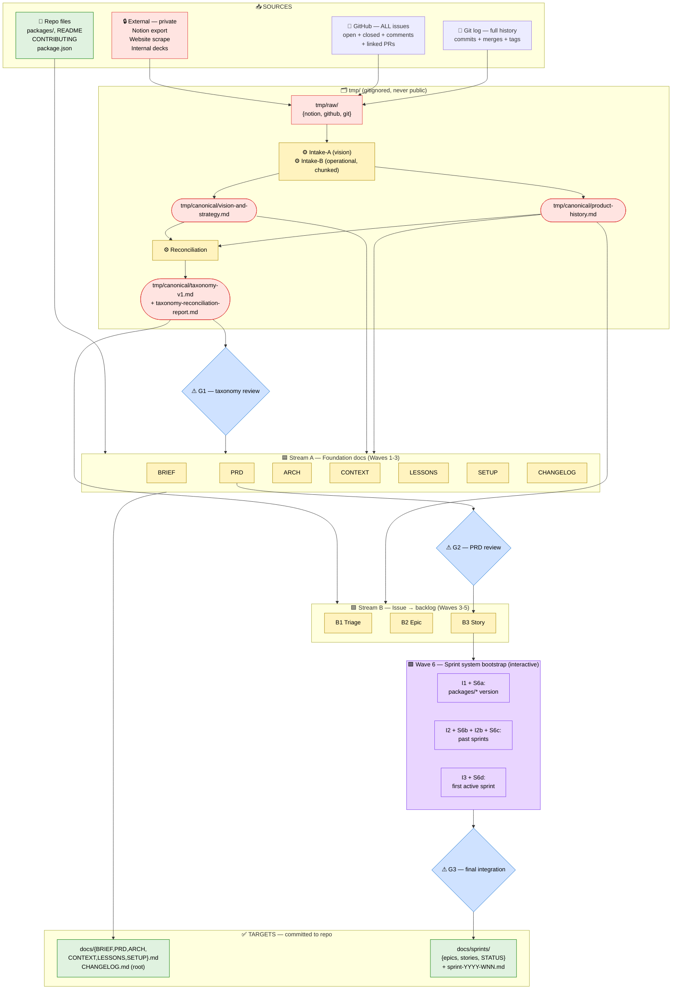

---

## 4. Source data

Every downstream artifact must trace back to one of these five sources. No artifact may be invented without citation.

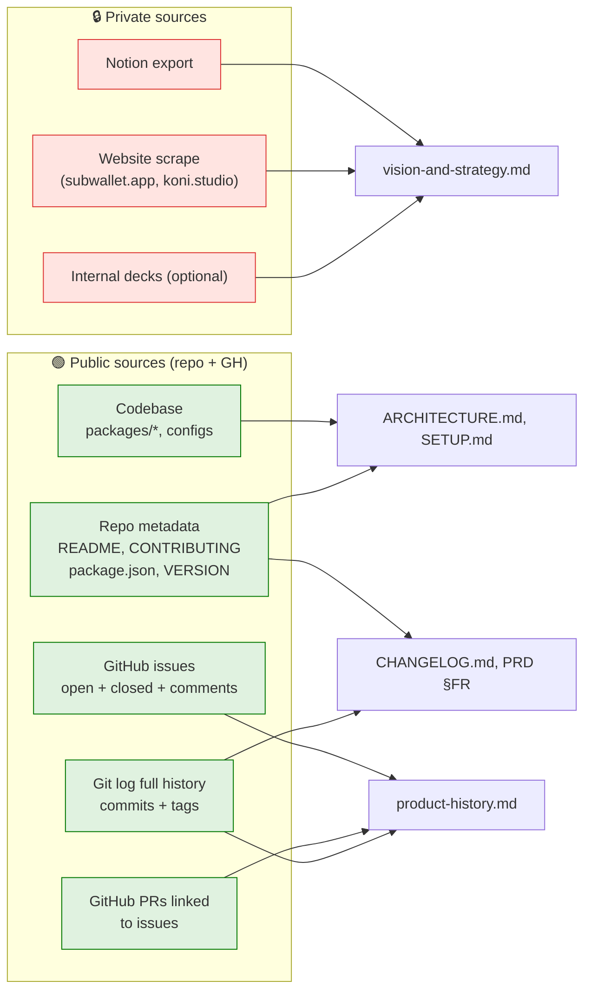

Source authority ranking when conflicts arise (e.g., Notion says "we support Solana", codebase does not):

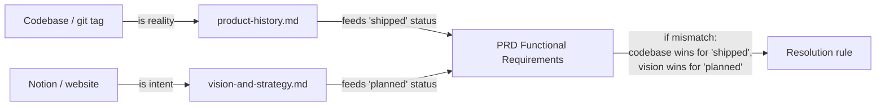

---

## 5. Storage convention — `tmp/` discipline

All sensitive raw + intermediate artifacts stay in `tmp/`, which is **gitignored**. Public repo only ever sees `docs/*` and `CHANGELOG.md`.

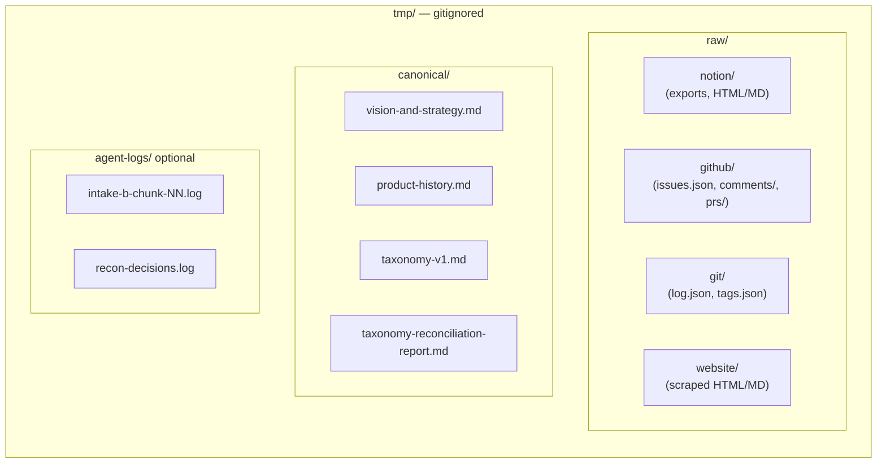

Rule: **no agent writes outside `tmp/` until its inputs are validated against the canonical set.** Any agent that needs to consume Notion content reads from `tmp/canonical/vision-and-strategy.md`, never from `tmp/raw/notion/*`.

---

## 6. Intake Phase 0 — two parallel agents

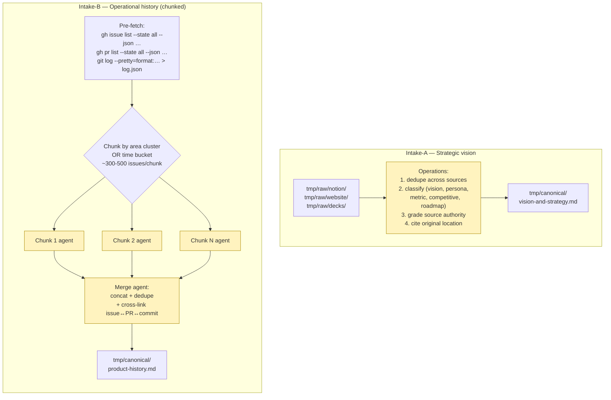

Intake-A and Intake-B run **fully in parallel** (no dependency). Intake-B's chunks can run in parallel across multiple agent sessions if available.

### 6.1 Schema fragment — `product-history.md`

```yaml
# Each entry produced by Intake-B is one of:
- type: feature          # shipped or proposed feature cluster
  area: <provisional>    # finalized after Reconciliation
  status: shipped | open | abandoned
  related_issues: [#1234, #5678]
  related_prs: [#999]
  related_commits: [abc123]
  shipped_in: v1.3.40    # if shipped
  summary: "..."
  
- type: decision         # captured from issue comments or commit messages
  area: <provisional>
  decided_at: 2024-08-15
  context: "Why this decision was made"
  alternatives_considered: [...]
  
- type: incident         # bug + resolution
  area: <provisional>
  severity: critical | high | medium | low
  root_cause: "..."
  lesson: "..."
```

---

## 7. Reconciliation Phase 0.5

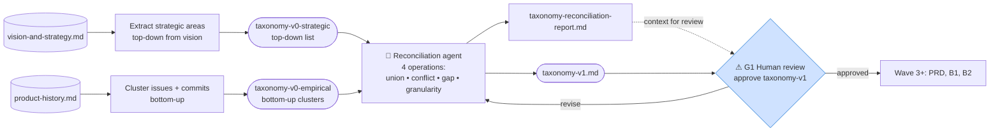

### 7.1 The 4 reconciliation operations

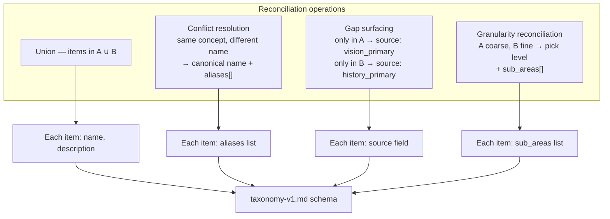

### 7.2 `taxonomy-v1.md` schema (verbatim what reconciler outputs)

```yaml
---
version: 1
generated_at: 2026-06-03
source_strategic: tmp/canonical/vision-and-strategy.md
source_empirical: tmp/canonical/product-history.md
human_reviewed_by: <github-handle>
reconciliation_report: tmp/canonical/taxonomy-reconciliation-report.md
---

## Areas (product axis — reconciled)

### swap
description: Cross-chain & same-chain token swap (routing, providers, slippage)
aliases: [Swap features, swapping, dex, exchange, cross-chain swap]
sub_areas: [xcm, hydration, optimex]
source: both
empirical_issue_count: 47
example_issues: [#4936, #4567, #4209]

### multisig
description: Multi-signature account creation, transfer, approval flows
aliases: [Multi-sig, multi sig, multisig wallet]
sub_areas: [creation, transfer, notification, detection]
source: vision_primary
empirical_issue_count: 9
example_issues: [#4869, #4872, #4875]

# … ~10-15 areas total

## Types (work axis — fixed enum, NOT reconciled)
- bug
- feature
- integration
- refactor
- research
- chore
- ux
```

---

## 8. Stream A — Foundation docs dependency graph

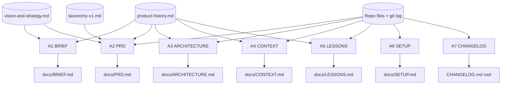

### 8.1 Stream A agent contracts (one-line each)

| Agent | Inputs | Output | Can parallelize with |
| --- | --- | --- | --- |
| A1 BRIEF | canonical-vis, canonical-hist | `docs/BRIEF.md` | A3, A4, A5, A6, A7 |
| A2 PRD | canonical-vis, canonical-hist, repo, **taxonomy-v1** | `docs/PRD.md` | B1 (both use taxonomy) |
| A3 ARCHITECTURE | repo, canonical-hist | `docs/ARCHITECTURE.md` | A1, A4, A5, A6, A7 |
| A4 CONTEXT | canonical-hist, repo | `docs/CONTEXT.md` | A1, A3, A5, A6, A7 |
| A5 LESSONS | canonical-hist, repo | `docs/LESSONS.md` | A1, A3, A4, A6, A7 |
| A6 SETUP | repo only | `docs/SETUP.md` | everything (no canonical dep) |
| A7 CHANGELOG | git log, existing `CHANGELOG.md` | `CHANGELOG.md` reformatted | everything (no canonical dep) |

A6 and A7 are **early-runnable**: they start in Wave 1 alongside the intakes since they need only repo files.

---

## 9. Stream B — Issue → backlog (no sprint allocation)

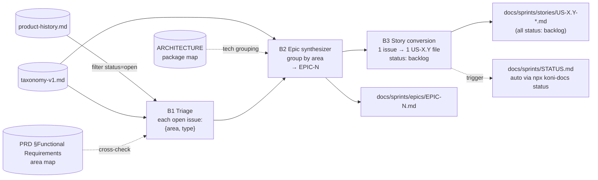

Stream B produces a **classified backlog** only. No sprint allocation logic — that lives in Wave 6 (interactive, human-driven).

---

## 10. Wave structure + critical path

```mermaid
flowchart TB
    subgraph W1["WAVE 1 — parallel, no deps"]
        direction LR
        W1A["Intake-A"]
        W1B["Intake-B chunked"]
        W1C["A6 SETUP"]
        W1D["A7 CHANGELOG"]
    end

    subgraph W2["WAVE 2 — after canonicals ready"]
        direction LR
        W2R["Reconciliation"]
        W2A["A1 BRIEF"]
        W2B["A3 ARCH"]
        W2C["A4 CONTEXT"]
        W2D["A5 LESSONS"]
    end

    G1{"⚠ G1 taxonomy-v1"}

    subgraph W3["WAVE 3 — after G1"]
        direction LR
        W3A["A2 PRD"]
        W3B["B1 Triage"]
    end

    G2{"⚠ G2 PRD"}

    subgraph W4["WAVE 4 — after B1+ARCH"]
        W4["B2 Epic synth"]
    end

    subgraph W5["WAVE 5 — after B2"]
        W5["B3 Story conversion"]
    end

    subgraph W6["WAVE 6 — interactive bootstrap"]
        direction TB
        W6S["I1+S6a → I2+S6b+I2b+S6c → I3+S6d"]
    end

    G3{"⚠ G3 final integration"}
    DONE["PR ready for merge → master"]

    W1 --> W2
    W2R --> G1 --> W3
    W3A --> G2
    W3B --> W4
    G2 -.->|consumes| W5
    W4 --> W5 --> W6 --> G3 --> DONE

    classDef wave fill:#fff3bf,stroke:#a80
    classDef gate fill:#cfe2ff,stroke:#06c
    classDef input fill:#e9d5ff,stroke:#7c3aed
    class W1,W2,W3,W4,W5,W1A,W1B,W1C,W1D,W2R,W2A,W2B,W2C,W2D,W3A,W3B wave
    class G1,G2,G3 gate
    class W6,W6S input
```

### 10.1 Critical path

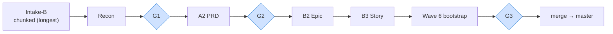

Anything not on this path can run in parallel slots if compute / reviewer bandwidth allows.

---

## 11. Gate taxonomy: review vs input

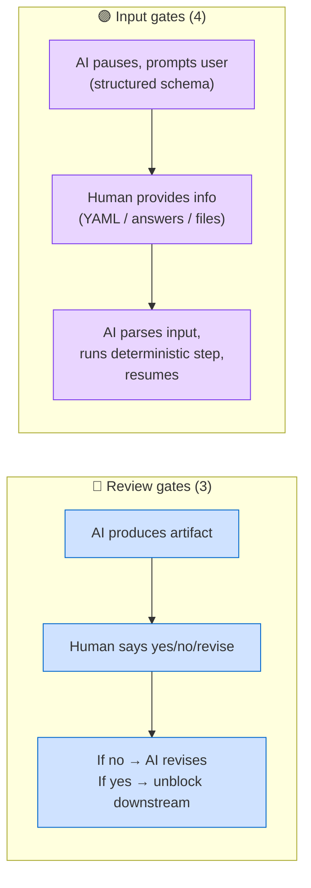

### 11.1 Review gates

| ID | After | Reviews | Blocks if rejected |
| --- | --- | --- | --- |
| G1 | Reconciliation | `taxonomy-v1.md` + reconciliation report | Wave 3 (PRD + Triage) |
| G2 | A2 PRD | `docs/PRD.md` | Wave 5 (B3 final story output uses PRD §FR) |
| G3 | Wave 6 | Whole repo state — 5-layer consistency, no "TBD", STATUS.md correct | PR merge to master |

### 11.2 Input gates

| ID | Before | User provides | Agent then does |
| --- | --- | --- | --- |
| I1 | S6a | strategy to unify `packages/* -N` suffix with root VERSION | apply chosen rule across all `packages/*/package.json` |
| I2 | S6b | rule mapping commit/tag → sprint window (or explicit map) | derive `sprint-YYYY-WNN.md` skeletons from git tags + CHANGELOG |
| I2b | S6c | review of derived past sprint files, edits to story-to-sprint mapping | finalize past sprint files |
| I3 | S6d | (1) theme/focus for first active sprint, (2) 1-3 stories from backlog to promote, (3) sprint window ID (e.g. 2026-W23) | create `sprint-2026-WNN.md`, flip selected stories `backlog → ready`, run `npx koni-docs status` |

---

## 12. Wave 6 — interactive bootstrap detail

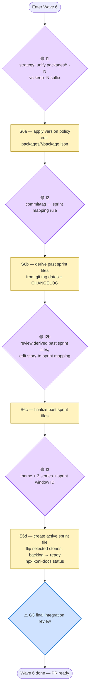

### 12.1 Input gate schema (used by Plan)

Each input gate in the Plan follows this structure:

```yaml
INPUT_GATE_<ID>:
  blocks: <step it unblocks>
  prompt_to_user: |
    <Plain-language ask with options or required schema>
  expected_input_format: <YAML | answers | file drop in tmp/>
  agent_action_on_receipt: |
    <Deterministic steps the agent runs after input>
  fallback_if_user_unavailable: pause  # never silent-default
  verification: <How agent confirms input is valid before running>
```

---

## 13. Branch & commit convention

```mermaid
flowchart LR
    M[master]
    AID[ai-development]
    M -.->|already branched| AID

    C0["...821bb9e docs: add AI coding behavior<br/>(end of sub-task 1)"]
    C1["intake-a: notion + website synthesis"]
    C2["intake-b/batch-1: issues 1-500"]
    C3["intake-b/batch-2: issues 501-1000"]
    Cdot["..."]
    C4["recon: taxonomy-v1 + report"]
    C5["⚠ G1 review (commit comments)"]
    C6["a1-brief: docs/BRIEF.md"]
    C7["a2-prd: docs/PRD.md"]
    Cdot2["..."]
    C8["wave6-i1: packages version unify"]
    Cdot3["..."]
    PR["PR merged → master"]

    C0 --> C1 --> C2 --> C3 --> Cdot --> C4 --> C5 --> C6 --> C7 --> Cdot2 --> C8 --> Cdot3 --> PR
```

### 13.1 Rules

- **Append-only.** No force-push, no rebase on `ai-development`.
- **One commit per agent run.** Conventional prefix: `<agent-id>: <one-line summary>`.
- **Review per commit**, not per PR. Reviewer can revert any single commit if rejected.
- **PR description**: maintained incrementally — agents append a short bullet to the PR description after each commit, summarising what was added.
- **No commits to `tmp/`.** `tmp/` is gitignored end-to-end; if `git status` shows `tmp/` entries, that is a `.gitignore` bug to fix immediately.
- **Reviewer workflow when receiving handoff**: `git fetch && git diff <last-reviewed-sha>..HEAD` per commit, approve/revert, then signal next agent run.

### 13.2 Conflict surfaces (need light serialization)

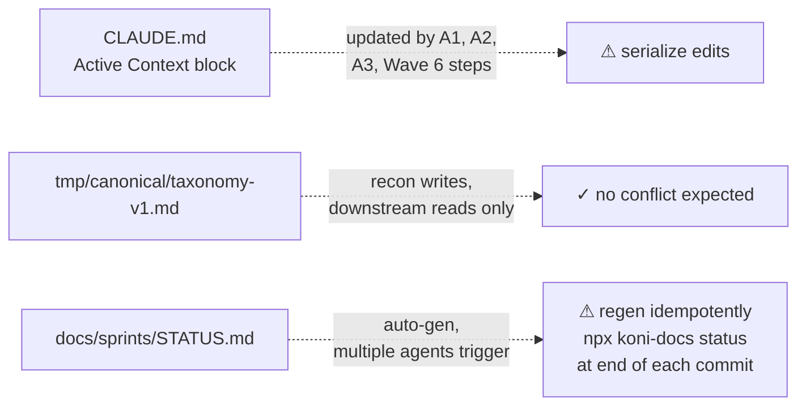

---

## 14. Canonical → target traceability matrix

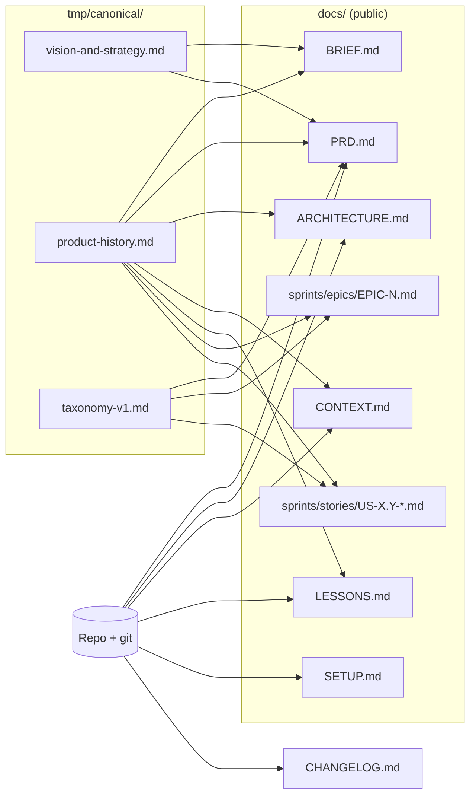

---

## 15. Out of scope (truly out)

Not in this migration:

- External system integration (Linear, Jira, Slack, etc.) — handled outside koni-docs entirely.
- New skill installation (the `koni-docs` skill is the only one needed; `koni-api` and others are deferred to separate sub-tasks).
- Tooling changes (CI workflows, lint rules) — koni-docs operates over existing CI conventions, not changes them.

Items that **looked** out of scope but were reclassified as input gates in Wave 6 (per user clarification):

- Sprint allocation weekly cadence → ongoing human process; Wave 6 bootstraps the first sprint as template
- Backfill past sprints → I2 + S6b + I2b + S6c
- Priority labeling, theme ordering → part of I3 and recurring weekly
- `packages/* -N` suffix vs root VERSION → I1 + S6a

---

## 16. Success criteria

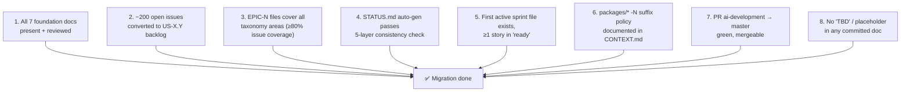

---

## 17. Open risks & considerations

| Risk | Mitigation |
| --- | --- |
| Notion content thin / weak vision section | Intake-A surfaces a `coverage report`; if < 60% of BRIEF template sections covered, escalate to user before Wave 2 |
| Intake-B token cost on full history | Chunking by area cluster (300-500 issues/chunk). Optionally parallelize across sessions. Budget cap per chunk. |
| Taxonomy drift between Intake-A and Intake-B | Reconciliation phase exists precisely for this; G1 human review is mandatory |
| Reviewer bottleneck on per-commit cadence | Per-commit review can batch up to 5 commits if they're independent (intake chunks); critical-path commits review one-at-a-time |
| `npx koni-docs status` failing in CI | Run locally before each commit; do not push commits that leave STATUS.md inconsistent |
| Long-living branch drift from master | Periodic `git merge master --no-ff` from master into ai-development; resolve conflicts in same commit |

---

## 18. Next step

After this spec is approved by user review:

1. Invoke the `writing-plans` skill.
2. Output: `docs/superpowers/plans/2026-06-03-koni-docs-migration.md`.
3. The Plan encodes, per agent run:
  - Prompt template (exact text agent receives)
  - Inputs (files / canonicals to read)
  - Outputs (files to write)
  - Acceptance criteria
  - Verification commands
  - Commit prefix + message template
4. Input gates encoded with full schema per §12.1.
5. The Plan is the handoff deliverable.

---

## Appendix A — Glossary

| Term | Meaning |
| --- | --- |
| **Stream A** | Foundation docs work — BRIEF, PRD, ARCHITECTURE, CONTEXT, LESSONS, SETUP, CHANGELOG |
| **Stream B** | Issue → backlog conversion — Triage, Epic, Story (no Sprint) |
| **Wave** | Time-ordered batch of agent runs sharing the same dependency layer |
| **Review gate** | Human approves an AI-produced artifact before downstream proceeds |
| **Input gate** | Agent pauses to receive structured user input before continuing |
| **Canonical** | A `tmp/canonical/*.md` file — single source of truth for downstream agents |
| **Chunked execution** | Intake-B mode where the input is partitioned (~300-500 issues/run) and runs in parallel |
| **5-layer consistency** | Story ↔ Epic ↔ PRD ↔ Sprint ↔ STATUS.md must agree — per koni-docs skill |
