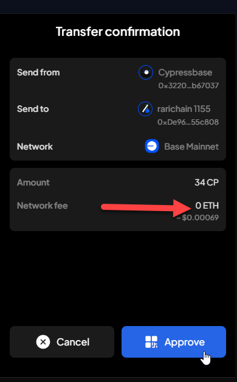

# Manual Test Report — 2026-07-16

Not tied to one epic — this covers today's test tasks only.

| Field | Value |
|---|---|
| Date | 2026-07-16 |
| Tester | MaiThuongNinni |
| Environment | PR build |
| Runner | manual (extension) |
| Build under test | Koniverse/SubWallet-Extension @ koni-qc |
| Tasks tested | US-42.1, US-42.2 |
| Total bugs found | 1 |
| P0 | 0 |
| P1 | 0 |
| P2 | 1 |
| Status | done |

---

## US-42.1 — Stake/unstake screen bugs ([#5013](https://github.com/Koniverse/SubWallet-Extension/issues/5013))

Checked on fresh install and on an upgraded install.

### Bugs

None found. Both problems from the issue are fixed:

- Change-validator confirm screen shows correctly.
- Unstake screen no longer crashes when dragging the slider then switching account.

## US-42.2 — Cypress (CP) token on Base ([ChainList #703](https://github.com/Koniverse/SubWallet-ChainList/issues/703))

Checked on fresh install and on an upgraded install.

### Bugs

| ID | Title | Steps to reproduce | Actual | Expected | Severity | Status | Screenshot |
|---|---|---|---|---|---|---|---|
| BUG-42.2-01 | Network fee shows "0 ETH" on the Cypress transfer confirm screen | Fresh install, hold Cypress (CP) on Base, Send → enter amount + recipient → open Transfer confirmation screen | Network fee shows **0 ETH**, with a small non-zero USD estimate underneath (~$0.00069) that doesn't match "0" | Network fee should show the real ETH fee amount, consistent with the USD estimate | P2 | fixed |  |

Amount field (34 CP) displays correctly. Transaction still goes through — this is a display bug on the confirm screen, not a failed transfer.

**Retest (fresh install + upgrade)**: dev fixed the fee display — network fee now shows the correct amount on both install conditions. No bugs remaining.

---

## Summary

| Task | Bugs found | Status |
|---|---|---|
| US-42.1 | 0 | done |
| US-42.2 | 1 (BUG-42.2-01, fixed) | done |
