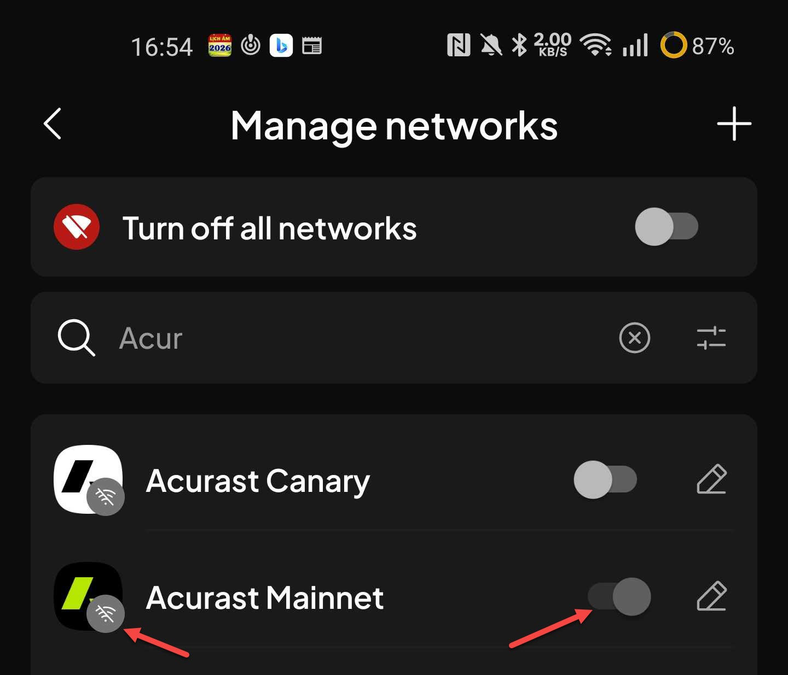
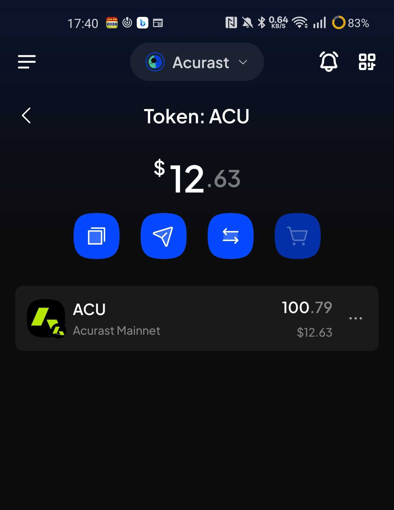

# Manual Test Report — EPIC-42 — 2026-09-03

| Field | Value |
|---|---|
| Epic | EPIC-42 — QA Coverage Tracking |
| Date | 2026-09-03 |
| Tester | MaiThuongNinni |
| Environment | Mobile — Android + iOS |
| Runner | manual (mobile) |
| Build under test | to fill in — build number + web-runner version |
| Stories tested | US-42.24.1, US-42.24.2 |
| Total bugs found | 4 |
| P0 | 0 |
| P1 | 3 |
| P2 | 1 |
| Status | done |

---

## US-42.24.1 — Web-runner 1.3.68 on Mobile

Part of [US-42.24](../../../../sprints/stories/US-42.24-qc-web-runner-1-3-86.md) — updating the web-runner to 1.3.86, one sub-task per version.

Three items in this session: Transak widget URL ([#4835](https://github.com/Koniverse/SubWallet-Extension/issues/4835)), NFT ERC-721 import on Rari ([#4625](https://github.com/Koniverse/SubWallet-Extension/issues/4625)), NFT without tokenOfOwnerByIndex ([#4568](https://github.com/Koniverse/SubWallet-Extension/issues/4568)).

Locked balance display ([#4708](https://github.com/Koniverse/SubWallet-Extension/issues/4708)) also shipped in 1.3.68 but is tested in [US-42.24.3](../../../../sprints/stories/US-42.24.3-qc-web-runner-1-3-70.md) alongside OpenGov, since its breakdown has a Governance row.

### AC results

| AC | Description | Result | Notes |
|---|---|---|---|
| AC-1 | The buy flow opens the Transak widget correctly — Android + iOS fresh | ✅ Pass | |
| AC-2 | When the widget URL cannot be fetched, the toast reads "Unable to redirect you to the selected supplier at the moment. Try again later" — Android + iOS fresh | ✅ Pass | |
| AC-3 | AC-1 and AC-2 pass on Android + iOS upgrade | ✅ Pass | |
| AC-4 | An ERC-721 NFT on Rari imports successfully, no "Incompatible NFT" error — Android + iOS fresh | ⏭️ Skipped | Rari Chain has shut down |
| AC-5 | An ERC-1155 NFT on Rari imports successfully — Android + iOS fresh | ⏭️ Skipped | Rari Chain has shut down |
| AC-6 | AC-4 and AC-5 pass on Android + iOS upgrade | ⏭️ Skipped | Rari Chain has shut down |
| AC-7 | An NFT on a contract without tokenOfOwnerByIndex shows up in the NFT list — Android + iOS fresh | ❌ Fail | See BUG-42.24.1-01 |
| AC-8 | AC-7 passes on Android + iOS upgrade | ❌ Fail | See BUG-42.24.1-01 |
| AC-9 | After upgrading, existing accounts, balances, NFTs and settings are still there and correct — both platforms | 🚫 Blocked | Accounts, balances and settings all carry over correctly. Only the NFT half is blocked by BUG-42.24.1-01 |

### Bugs

| ID | Title | Steps to reproduce | Actual | Expected | Severity | Status | Screenshot |
|---|---|---|---|---|---|---|---|
| BUG-42.24.1-01 | No auto-detect of EVM ERC-721 NFTs when importing or attaching an account that holds them | Import or attach account `0x66666F58dE1bcD762A5E5c5aFf9cc3C906D66666` on Mobile → open the NFT screen → the account holds NFTs on several EVM chains (Ethereum, Optimism, Gnosis) | No NFTs are shown on Mobile. The same account on the Extension shows them | The NFTs are auto-detected and shown on Mobile, the same as on the Extension | P1 | todo | |

---

## US-42.24.2 — Web-runner 1.3.69 on Mobile

Part of [US-42.24](../../../../sprints/stories/US-42.24-qc-web-runner-1-3-86.md). chain-list stable v0.2.122 ([#4827](https://github.com/Koniverse/SubWallet-Extension/issues/4827)) — 18 chain-list issues covering new networks, new tokens, transfers and XCM, removals, logos, explorer links, RPCs and on-ramp.

Session started on the new networks and tokens. Not finished.

BUG-42.24.2-01 and -02 cleared on their own during the session — the networks can be turned on again — so no AC is failed or blocked on them. They are kept here because they are real and still need fixing.

### AC results

| AC | Description | Result | Notes |
|---|---|---|---|
| AC-1 | Acurast Mainnet appears, connects, and balances load — Android + iOS fresh | ✅ Pass | chain-list [615](https://github.com/Koniverse/SubWallet-ChainList/issues/615) |
| AC-4 | TRAC appears on each EVM network it was added to, with the right symbol and decimals — Android + iOS fresh | ✅ Pass | chain-list [621](https://github.com/Koniverse/SubWallet-ChainList/issues/621) |
| AC-5 | vMANTA appears on Ethereum and on Manta Pacific, and shows as one multichain asset rather than two separate tokens — Android + iOS fresh | ✅ Pass | chain-list [624](https://github.com/Koniverse/SubWallet-ChainList/issues/624), [625](https://github.com/Koniverse/SubWallet-ChainList/issues/625) |

The other AC in this story were not run today.

### Bugs

| ID | Title | Steps to reproduce | Actual | Expected | Severity | Status | Screenshot |
|---|---|---|---|---|---|---|---|
| BUG-42.24.2-01 | Acurast does not connect when turned on, and shows the disconnected badge instead of the connecting one | Manage networks → search "Acur" → turn on Acurast Mainnet → watch the badge on the network logo | The network never connects. The badge is the crossed-out disconnected icon even though the toggle is on | The network should connect and load balances. While it is still connecting the badge should be the yellow connecting icon, not the crossed-out one | P1 | todo |  |
| BUG-42.24.2-02 | Network toggles cannot be switched on or off — affects every network, not only the new ones | Manage networks → tap the toggle on any network | The toggle does not respond. It happens on all networks, not just Acurast | Tapping a toggle turns the network on or off | P1 | todo | |
| BUG-42.24.2-03 | The price chart is missing on the token detail screen — affects every token | Tokens → tap any token to open its detail screen (example: ACU on Acurast Mainnet) | The area below the action buttons is empty. Price, balance and the action buttons all render, but no chart appears. It happens on every token, not just the new ones | The price chart renders on the token detail screen | P2 | todo |  |

---

## Summary

4 bugs found — 3 P1, 1 P2. Two stories touched.

US-42.24.1 (web-runner 1.3.68) is blocked: 3 AC pass, 2 fail, 3 skipped, 1 blocked. Transak passes. The NFT checks fail on BUG-42.24.1-01, and the Rari checks are skipped because that chain shut down in June 2026. AC-7 to AC-9 need a retest once the bug is fixed.

US-42.24.2 (chain-list v0.2.122) is in progress: Acurast, TRAC and vMANTA all pass. Three bugs logged, none of them blocking an AC — the two network ones cleared on their own, the missing price chart is still there. BUG-42.24.2-02 and -03 happen on every network and every token, so they may not belong to this chain-list version at all.
