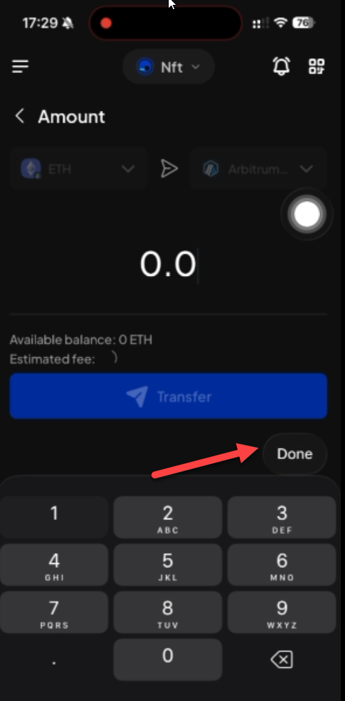
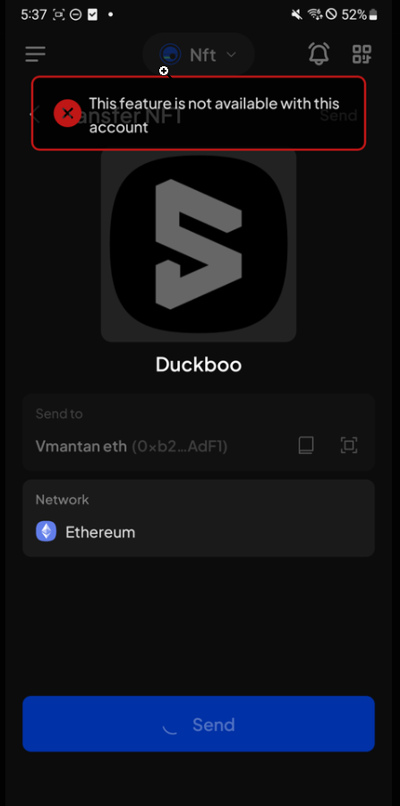

# Manual Test Report — EPIC-42 — 2026-09-04

| Field | Value |
|---|---|
| Epic | EPIC-42 — QA Coverage Tracking |
| Date | 2026-09-04 |
| Tester | MaiThuongNinni |
| Environment | Mobile — Android + iOS |
| Runner | manual (mobile) |
| Build under test | to fill in — build number + web-runner version |
| Stories tested | US-42.24.2, US-42.24.19, US-42.24.20 |
| Total bugs found | 4 |
| P0 | 0 |
| P1 | 2 |
| P2 | 2 |
| Status | done |

---

## US-42.24.2 — Web-runner 1.3.69 on Mobile

Part of [US-42.24](../../../../sprints/stories/US-42.24-qc-web-runner-1-3-86.md). chain-list stable v0.2.122 ([#4827](https://github.com/Koniverse/SubWallet-Extension/issues/4827)) — 18 chain-list issues covering new networks, new tokens, transfers and XCM, removals, logos, explorer links, RPCs and on-ramp.

Continuing the session started on [2026-09-03](../2026-09-03/report-manual.md), where AC-1 (Acurast), AC-4 (TRAC) and AC-5 (vMANTA) passed. Three bugs were logged that day and are still open; none of them blocks an AC.

Still to run: AC-8, AC-9, AC-10, AC-13, AC-15 to AC-21.

### AC results

| AC | Description | Result | Notes |
|---|---|---|---|
| AC-2 | Monad Mainnet and its native token appear with the right name, symbol, logo and decimals, and connect — Android + iOS fresh | ✅ Pass | chain-list [627](https://github.com/Koniverse/SubWallet-ChainList/issues/627) |
| AC-3 | Stable Mainnet and its token appear and connect, on both new RPCs — Android + iOS fresh | ✅ Pass | chain-list [628](https://github.com/Koniverse/SubWallet-ChainList/issues/628) |
| AC-6 | xAlpha tokens appear on Base Mainnet and on Subtensor EVM — Android + iOS fresh | ✅ Pass | chain-list [633](https://github.com/Koniverse/SubWallet-ChainList/issues/633), [634](https://github.com/Koniverse/SubWallet-ChainList/issues/634) |
| AC-7 | NIGHT appears on Cardano with the right symbol and balance — Android + iOS fresh | ⏭️ Skipped | Mobile does not support the Cardano ecosystem — chain-list [637](https://github.com/Koniverse/SubWallet-ChainList/issues/637) |
| AC-11 | The Polkadot to Manta Atlantic XCM route is offered again and a transfer completes — Android + iOS fresh | ✅ Pass | rolled back in the stable build, after being removed in v0.2.121 |
| AC-12 | Phala Network is gone from the network list and cannot be enabled — Android + iOS fresh | ✅ Pass | chain-list [630](https://github.com/Koniverse/SubWallet-ChainList/issues/630) |
| AC-14 | Avail Mainnet and Testnet show the new network and token logos — Android + iOS fresh | ✅ Pass | chain-list [626](https://github.com/Koniverse/SubWallet-ChainList/issues/626) |

### Bugs

None so far.

---

## US-42.24.19 — Web-runner 1.3.86 full regression on Mobile

Part of [US-42.24](../../../../sprints/stories/US-42.24-qc-web-runner-1-3-86.md). The full wallet regression, run alongside the version sub-tasks where the same screens come up.

### AC results

| AC | Description | Result | Notes |
|---|---|---|---|
| REG-1 | Create a new account, and the seed phrase is shown and can be written down | ❌ Fail | See BUG-42.24.19-02 |
| REG-16 | Send an NFT | ❌ Fail | See BUG-42.24.19-04 |

### Bugs

| ID | Title | Steps to reproduce | Actual | Expected | Severity | Status | Screenshot |
|---|---|---|---|---|---|---|---|
| BUG-42.24.19-01 | The "Migrate to Unified Account" screen appears twice when importing an account (iOS) | On iOS, import an account → watch the screens after the import completes | The "Migrate to Unified Account" screen is shown, and then shown again | The screen appears once | P2 | fixed, verified | |
| BUG-42.24.19-02 | The Create a password screen freezes on a fresh install — Continue and Back both stop responding (Android and iOS) | Install the app fresh → reach the "Create a password" screen → enter the password and repeat it → tap Continue | Continue does nothing and Back stops responding, so the screen cannot be left. Force-closing the app and reopening it shows the password was saved, so the setup can carry on from there | Continue creates the password and moves on to the next screen; Back returns to the previous one | P1 | todo | |
| BUG-42.24.19-03 | The Done button on the Amount screen needs its layout adjusted (iOS 26.6.1) | On iOS 26.6.1, start a transfer → reach the Amount screen → the number pad opens | The Done button sits on its own between the Transfer button and the number pad, pushed to the right and not aligned with anything around it | Done is placed and aligned consistently with the rest of the screen | P2 | todo |  |
| BUG-42.24.19-04 | Transferring an NFT on a supported network is refused, and the message names the account rather than the network (Android and iOS) | On either platform, open an NFT held on Ethereum → Send → fill in the recipient → tap Send | The transfer is refused with "This feature is not available with this account". Two things wrong: - Ethereum is a supported network, so the transfer should go through - the message names the account, when the restriction is by network | - Supported network (Ethereum, Base, ZKsync Era, Arbitrum One, Story Protocol, Soneium, Celo, Zora, Ink, Lisk, Etherlink): the transfer reaches the confirmation screen and completes - Network that does not support it (Polygon, Optimism, Scroll, Gnosis): refused with "This NFT can't be transferred at the moment" | P1 | todo |  |

---

## US-42.24.20 — Verify the bugs found during the web-runner update

Part of [US-42.24](../../../../sprints/stories/US-42.24-qc-web-runner-1-3-86.md). Rechecking bugs on a build with fixes, and rerunning the AC each bug had left unsettled.

### Verify results

| Bug | Found in | Fix verified | AC rerun |
|---|---|---|---|
| BUG-42.24.1-01 — EVM NFTs are not auto-detected when an account is imported or attached | US-42.24.1 | ✅ Pass | AC-7, AC-8, AC-9 — ✅ all pass |
| BUG-42.24.19-01 — The "Migrate to Unified Account" screen appears twice when importing an account (iOS) | US-42.24.19 | ✅ Pass | REG-2 — ✅ pass |

The other six bugs are not fixed yet.

### Bugs

None found during the recheck.

---

## Summary

4 bugs found — 2 P1, 2 P2. Two older bugs verified fixed.

US-42.24.2 (chain-list v0.2.122) moved on to six more checks, all passing: Monad and Stable Mainnet, xAlpha on Base and Subtensor EVM, the restored Polkadot to Manta Atlantic XCM route, the Phala removal and the Avail logos. AC-7 is skipped — NIGHT is a Cardano token and Mobile does not support that ecosystem. Nine of its twenty-one AC now pass, one is skipped, and no bug was found here today.

US-42.24.19 (full regression) found all four of today's bugs. Two are on the first-run path: the Create a password screen freezes on a fresh install, and the Migrate to Unified Account screen used to appear twice. Two are on transfers: the Done button on the Amount screen is misplaced on iOS, and an NFT transfer on a supported network is refused with a message about the account rather than the network. REG-1 and REG-16 fail; the password freeze is a fail rather than a blocker because force-closing the app and reopening it shows the password was saved.

US-42.24.20 (bug verification) settled two: BUG-42.24.1-01 with its three AC rerun and passing, and BUG-42.24.19-01 with REG-2 rerun and passing. Six bugs are still open.
