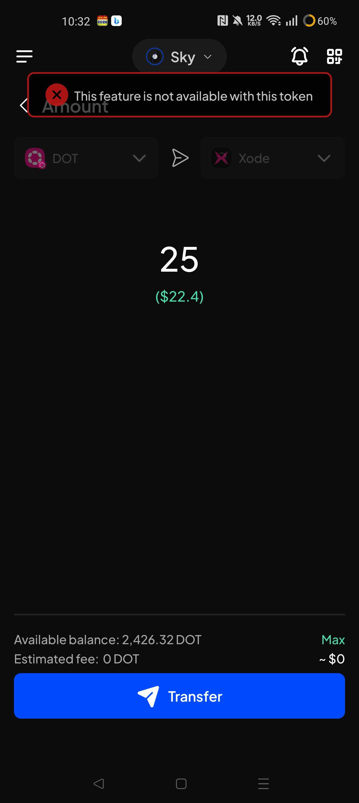

# Manual Test Report — EPIC-42 — 2026-09-05

| Field | Value |
|---|---|
| Epic | EPIC-42 — QA Coverage Tracking |
| Date | 2026-09-05 |
| Tester | MaiThuongNinni |
| Environment | Mobile — Android + iOS |
| Runner | manual (mobile) |
| Build under test | to fill in — build number + web-runner version |
| Stories tested | US-42.24.2, US-42.24.19 |
| Total bugs found | 3 |
| P0 | 0 |
| P1 | 3 |
| P2 | 0 |
| Status | in progress |

---

## US-42.24.2 — Web-runner 1.3.69 on Mobile

Part of [US-42.24](../../../../sprints/stories/US-42.24-qc-web-runner-1-3-86.md). chain-list stable v0.2.122 ([#4827](https://github.com/Koniverse/SubWallet-Extension/issues/4827)) — 18 chain-list issues covering new networks, new tokens, transfers and XCM, removals, logos, explorer links, RPCs and on-ramp.

Third day on this story, after [2026-09-03](../2026-09-03/report-manual.md) and [2026-09-04](../2026-09-04/report-manual.md). Nine AC pass so far and one is skipped; three bugs were logged on the first day and are all still open, none of them blocking an AC.

Still to run after today: AC-9 (cACU transfer), AC-13 (removed RPCs), AC-17 (updated RPCs), AC-18 (Banxa on-ramp), AC-19 to AC-21 (the upgrade runs).

### AC results

| AC | Description | Result | Notes |
|---|---|---|---|
| AC-8 | ARIAIP on Story Protocol can be sent, and the transaction goes through — Android + iOS fresh | ✅ Pass | chain-list [616](https://github.com/Koniverse/SubWallet-ChainList/issues/616) |
| AC-10 | DOT can be sent by XCM to and from Xode — Android + iOS fresh | ❌ Fail | See BUG-42.24.2-04 |
| AC-15 | The Aventus Polkadot block explorer link opens the right page — Android + iOS fresh | ✅ Pass | chain-list [632](https://github.com/Koniverse/SubWallet-ChainList/issues/632) |
| AC-16 | The Subtensor EVM explorer link opens the right page — Android + iOS fresh | ✅ Pass | part of the stable build |

### Bugs

| ID | Title | Steps to reproduce | Actual | Expected | Severity | Status | Screenshot |
|---|---|---|---|---|---|---|---|
| BUG-42.24.2-04 | XCM cannot fetch a fee, so no XCM transfer can be sent — every route | Open an account with a balance → Send → pick DOT and a destination chain, for example Xode → enter an amount → tap Transfer | Estimated fee shows 0 DOT and the screen says "This feature is not available with this token". The transfer cannot be sent. Affects every XCM route, both the chains added in this chain-list version and token pairs that were already in the wallet | The fee is fetched and shown, and the XCM transfer goes through | P1 | todo |  |

---

## US-42.24.19 — Web-runner 1.3.86 full regression on Mobile

Part of [US-42.24](../../../../sprints/stories/US-42.24-qc-web-runner-1-3-86.md). The full wallet regression, run alongside the version sub-tasks where the same screens come up.

### AC results

| AC | Description | Result | Notes |
|---|---|---|---|
| REG-20 | An XCM transfer goes through on at least two routes | ❌ Fail | See BUG-42.24.2-04, logged under US-42.24.2 |
| REG-34 | NFTs load on EVM and on Unique Network, including nested ones | ❌ Fail | See BUG-42.24.19-05 |
| REG-50 | The app opens, backgrounds and resumes without losing state | ❌ Fail | See BUG-42.24.19-06 |

### Bugs

| ID | Title | Steps to reproduce | Actual | Expected | Severity | Status | Screenshot |
|---|---|---|---|---|---|---|---|
| BUG-42.24.19-05 | NFTs on substrate networks do not show on Mobile (Android and iOS) | On either platform, use an account holding NFTs on a substrate network such as Polkadot Asset Hub or Kusama Asset Hub → open the NFT screen on Mobile → then open the same account on the Extension | No NFTs are shown on Mobile. The same account on the Extension shows them | The substrate NFTs show on Mobile, the same as on the Extension | P1 | todo | |
| BUG-42.24.19-06 | The app loads forever after being left in the background — happens intermittently, on Android and iOS | 1. Open the app and use it normally 2. Send it to the background 3. Use another app for a while — over 30 minutes 4. Reopen SubWallet 5. Observe | The app sits on a loading screen and never finishes. Force-closing and reopening it clears the problem. Intermittent — it does not happen every time | The app resumes from the background and is usable, without needing a force-close | P1 | todo |  |

---

## Summary

Session in progress.
