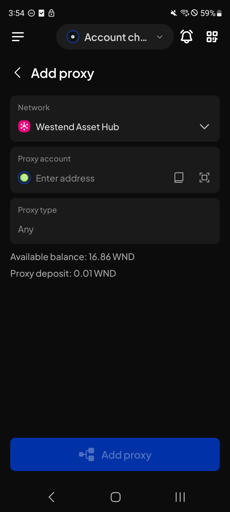
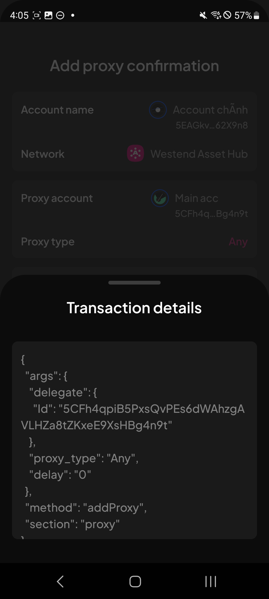
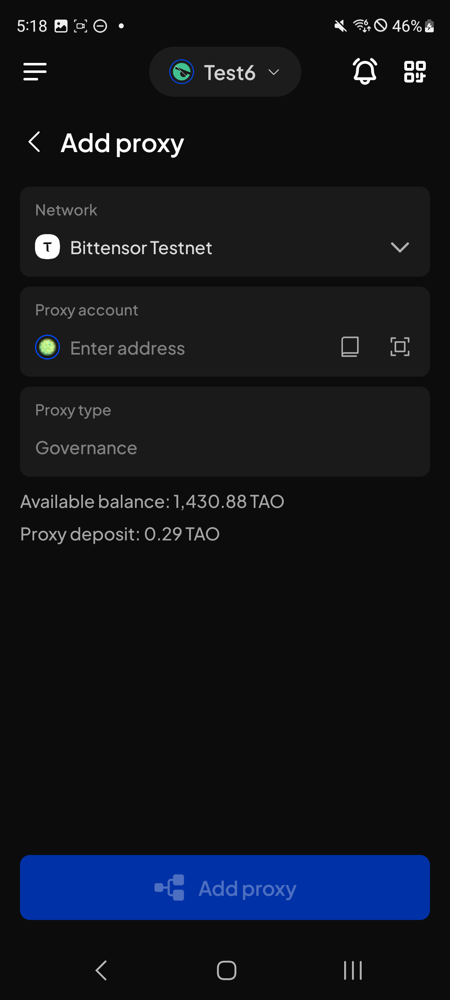
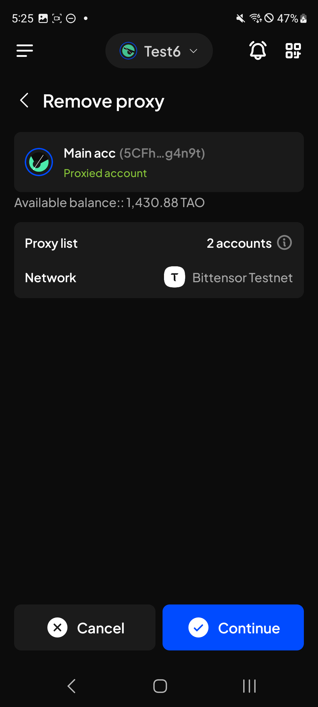
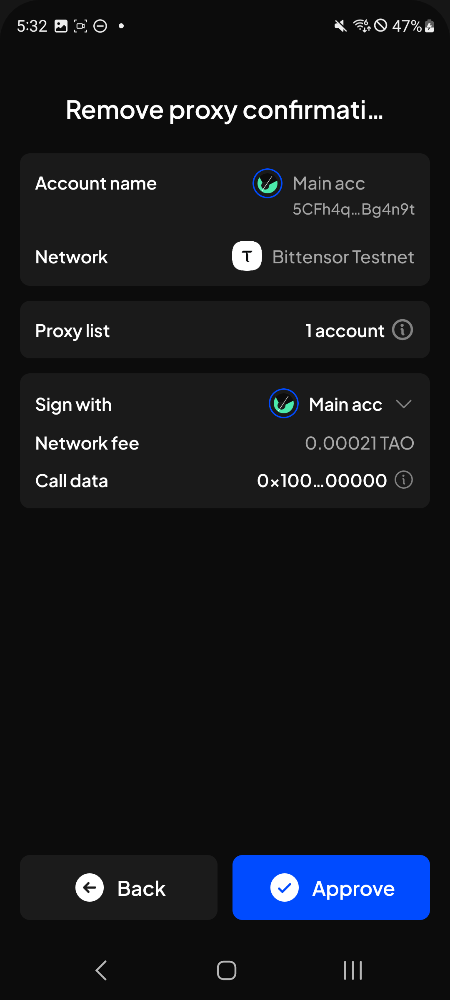
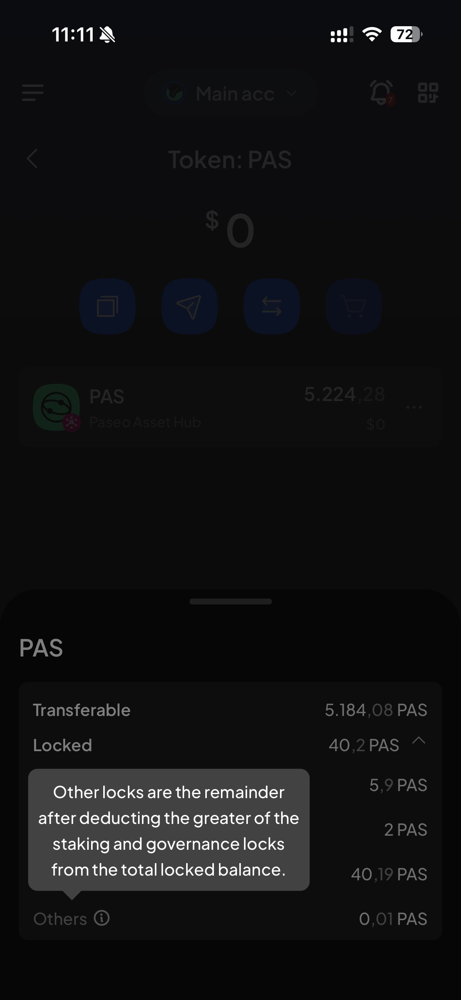
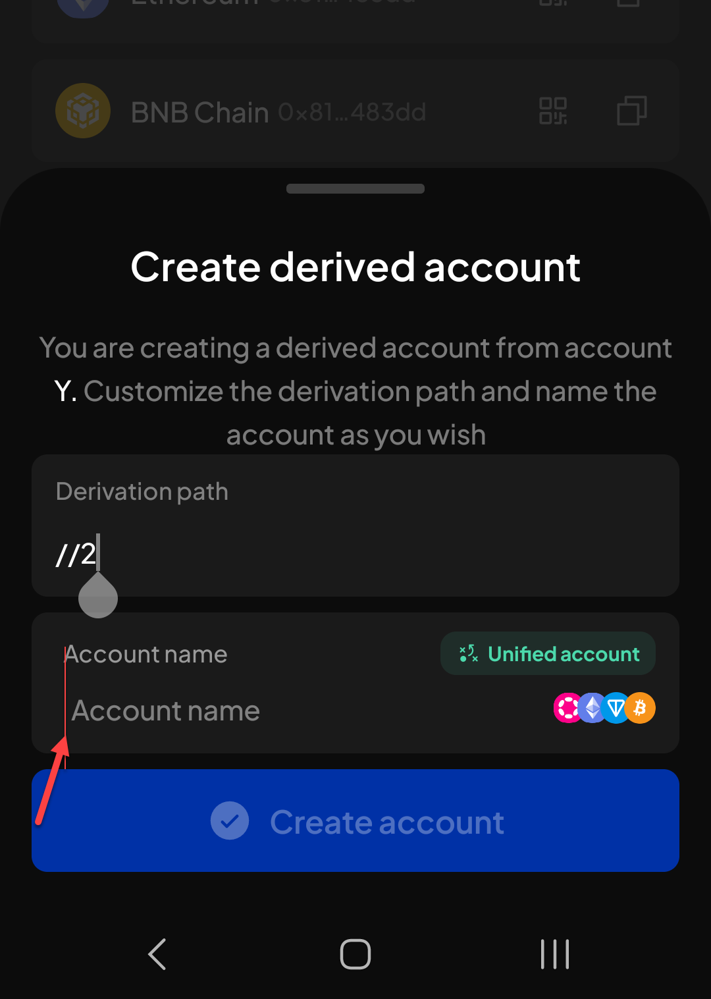

# Manual Test Report — EPIC-42 — 2026-09-07

| Field | Value |
|---|---|
| Epic | EPIC-42 — QA Coverage Tracking |
| Date | 2026-09-07 |
| Tester | MaiThuongNinni |
| Environment | Mobile — Android + iOS |
| Runner | manual (mobile) |
| Build under test | to fill in — build number + web-runner version |
| Stories tested | US-42.24.4, US-42.24.5, US-42.24.19 |
| Total bugs found | 9 |
| P0 | 0 |
| P1 | 0 |
| P2 | 7 |
| P3 | 2 |
| Status | done |

---

## US-42.24.4 — Web-runner 1.3.71 on Mobile

Part of [US-42.24](../../../../sprints/stories/US-42.24-qc-web-runner-1-3-86.md). Three items in this version: token enabling round 2 ([#4247](https://github.com/Koniverse/SubWallet-Extension/issues/4247)), library updates ([#4808](https://github.com/Koniverse/SubWallet-Extension/issues/4808)), and import from Trust Wallet ([#4762](https://github.com/Koniverse/SubWallet-Extension/issues/4762)).

Token enabling passed on [2026-09-05](../2026-09-05/report-manual.md). Today covers the library updates and the Trust Wallet import.

The AC for both halves were rewritten today from their real scope: the Trust Wallet checklist, and the developer's test scope in [#4808](https://github.com/Koniverse/SubWallet-Extension/issues/4808). Every AC in the story passes — 39 of 39.

### AC results

| AC | Description | Result | Notes |
|---|---|---|---|
| AC-5 | Creating an account works on EVM, Substrate, Bitcoin and TON — Android + iOS fresh | ✅ Pass | |
| AC-6 | Importing works by JSON, seed phrase and private key on each ecosystem — Android + iOS fresh | ✅ Pass | |
| AC-7 | Exporting and deriving accounts work on each ecosystem — Android + iOS fresh | ✅ Pass | |
| AC-8 | Accounts that existed before the upgrade are still visible and usable | ✅ Pass | |
| AC-9 | Signing works for every account type — Android + iOS fresh | ✅ Pass | |
| AC-10 | A transaction can be sent on EVM, Substrate, Bitcoin and TON — Android + iOS fresh | ✅ Pass | |
| AC-11 | Fee, gas or fee rate is right per chain and matches what is taken — Android + iOS fresh | ✅ Pass | |
| AC-12 | Message and typed-data signing from a dApp works, including EIP-712 — Android + iOS fresh | ✅ Pass | |
| AC-13 | The wallet connects to dApps and can connect, sign and send — Android + iOS fresh | ✅ Pass | |
| AC-14 | Balances load and the token list is right on each chain — Android + iOS fresh | ✅ Pass | |
| AC-15 | Switching network across the four ecosystems is smooth — Android + iOS fresh | ✅ Pass | |
| AC-16 | History, prices and portfolio all load and keep updating — Android + iOS fresh | ✅ Pass | |
| AC-17 | The app updates to the new version cleanly and works afterwards | ✅ Pass | |
| AC-18 | AC-5 to AC-16 pass on Android + iOS upgrade | ✅ Pass | |
| AC-19 | After upgrading, imported accounts, enabled tokens and network settings are all still there | ✅ Pass | |
| AC-20 | The Import from Trust Wallet screen opens from the welcome screen, asking for 12 words by default | ✅ Pass | |
| AC-21 | It opens the same way from the home screen | ✅ Pass | |
| AC-22 | A seed longer than 12 words is refused with "Invalid seed phrase. Please try again" | ✅ Pass | |
| AC-23 | Tapping Import opens the Solo account import modal; Go back returns, Import completes | ✅ Pass | |
| AC-24 | The account arrives as a solo DOT account, address matching Trust Wallet | ✅ Pass | |
| AC-25 | Derive account is disabled on the account details screen and in the Create a new account modal | ✅ Pass | |
| AC-26 | Export offers seed phrase and JSON file, and export all accounts works | ✅ Pass | |
| AC-27 | Migrate account is not offered for this account | ✅ Pass | |
| AC-28 | Importing back the exported JSON gives an account that behaves the same way | ✅ Pass | |
| AC-29 | The receive screen shows an address matching Trust Wallet | ✅ Pass | |
| AC-30 | Sending a token, sending an NFT, swapping and staking all work | ✅ Pass | |
| AC-31 | Signing from a dApp works | ✅ Pass | |
| AC-32 | Importing through the ordinary seed phrase option still behaves as it did | ✅ Pass | |
| AC-33 | An account already imported by seed phrase, imported again through Trust Wallet, arrives as a solo DOT account matching Trust Wallet | ✅ Pass | |
| AC-34 | The same account through the seed phrase option is refused with "Account already exists under the name {Account name}" | ✅ Pass | |
| AC-35 | A watch-only or QR account on a different ecosystem from the same seed can still be imported | ✅ Pass | |
| AC-36 | An account already imported from Trust Wallet, imported again the same way, is refused with the same message | ✅ Pass | |
| AC-37 | That account through the seed phrase option behaves as it did | ✅ Pass | |
| AC-38 | The watch-only or QR case works in that direction too | ✅ Pass | |
| AC-39 | AC-8 to AC-26 pass on Android + iOS upgrade | ✅ Pass | |

All twenty pass, on both platforms, fresh install and upgrade.

### Bugs

None.

---

## US-42.24.5 — Web-runner 1.3.72 on Mobile

Part of [US-42.24](../../../../sprints/stories/US-42.24-qc-web-runner-1-3-86.md). Proxy accounts ([#4725](https://github.com/Koniverse/SubWallet-Extension/issues/4725)), chain-list v0.2.123 ([#4861](https://github.com/Koniverse/SubWallet-Extension/issues/4861)) and ParaSpell V5 ([#4908](https://github.com/Koniverse/SubWallet-Extension/issues/4908)).

The AC for this story were written out today from their real scope — the proxy checklist and the 22 ChainList issues rolled into v0.2.123 — so it now runs to 43 AC. The session has started on the Add proxy screen.

### AC results

| AC | Description | Result | Notes |
|---|---|---|---|
| AC-1 | The Manage proxies tab lists the proxies with their address and type, on a unified account and on a solo Polkadot account — Android + iOS fresh | ✅ Pass | |
| AC-2 | On an EVM, TON or mixed Substrate-EVM account the tab still appears but the list cannot be read, added to or removed from — Android + iOS fresh | ✅ Pass | |
| AC-3 | A watch-only account can see its proxies but cannot add or remove — Android + iOS fresh | ✅ Pass | |
| AC-4 | A proxy can be added as Any, Staking or Non-transfer, and appears in Manage proxies with the right type label — Android + iOS fresh | ✅ Pass | |
| AC-5 | Adding fails cleanly when it should — insufficient balance, adding yourself, a duplicate type on the same address — Android + iOS fresh | ✅ Pass | |
| AC-6 | A proxy can be removed, and it disappears from Manage proxies on that network — Android + iOS fresh | ✅ Pass | |
| AC-7 | Removing from a watch-only account is refused — Android + iOS fresh | ✅ Pass | |
| AC-8 | A transfer signed by an Any proxy goes through, with the main account paying the amount and the proxy paying the gas — Android + iOS fresh | ✅ Pass | |
| AC-19 | Voting through a proxy — Android + iOS fresh | ⏭️ Skipped | Mobile has no governance screen to vote from |

Adding and removing both work. The bugs below are all display problems on those same screens, not failures of the flows.

### Bugs

| ID | Title | Steps to reproduce | Actual | Expected | Severity | Status | Screenshot |
|---|---|---|---|---|---|---|---|
| BUG-42.24.5-01 | The Add proxy screen shows an Available balance line the Extension does not | Account detail → Manage proxies → Add proxy → look at the lines under the form | Two lines are shown: Available balance and Proxy deposit. The Extension shows only Proxy deposit | Only the Proxy deposit line, matching the Extension | P2 | todo |  |
| BUG-42.24.5-02 | The Transaction details sheet on Add proxy confirmation cannot be scrolled | Account detail → Manage proxies → Add proxy → fill the form → Approve → on the Add proxy confirmation screen open Transaction details → try to scroll the JSON | The JSON is longer than the sheet and is cut off at the bottom. Swiping up or down inside the sheet does not move it, so the end of the call data cannot be read | The sheet scrolls to the end of the JSON | P2 | todo |  |
| BUG-42.24.5-03 | The Proxy type field on the Add proxy screen is greyed out and has no dropdown arrow | Account detail → Manage proxies → Add proxy → look at the Proxy type field | The selected type is dim grey, the same colour as the placeholder text, and the field has no dropdown arrow on the right | The selected type is in the normal white text, and the field shows a dropdown arrow like the Extension does | P2 | todo |  |
| BUG-42.24.5-04 | The Governance proxy type is offered on Mobile, which has no governance feature | Account detail → Manage proxies → Add proxy → open the Proxy type list | Governance is one of the types that can be picked, but Mobile has no governance screen, so a proxy added with it cannot be used for anything | Governance is not offered on Mobile while the feature is not there | P2 | todo |  |
| BUG-42.24.5-05 | The Available balance label on the Remove proxy screen has two colons | Account detail → Manage proxies → remove a proxy → look at the Available balance line | It reads "Available balance:: 1,430.88 TAO" — the colon is doubled | One colon: "Available balance: 1,430.88 TAO" | P3 | todo |  |
| BUG-42.24.5-06 | The Remove proxy confirmation title is truncated although there is room for it | Account detail → Manage proxies → remove a proxy → Continue → look at the screen title | The title shows "Remove proxy confirmati…" — cut two characters short of the full word, with empty space on both sides of it | The full title "Remove proxy confirmation" is shown | P3 | todo |  |

## US-42.24.19 — Web-runner 1.3.86 full regression on Mobile

Part of [US-42.24](../../../../sprints/stories/US-42.24-qc-web-runner-1-3-86.md). The full wallet regression, run alongside the version sub-tasks where the same screens come up.

### AC results

| AC | Description | Result | Notes |
|---|---|---|---|
| REG-11 | The locked balance breakdown opens and its figures add up | ❌ Fail | See BUG-42.24.19-08 — the figures are right, the tooltip text is not |

### Bugs

| ID | Title | Steps to reproduce | Actual | Expected | Severity | Status | Screenshot |
|---|---|---|---|---|---|---|---|
| BUG-42.24.19-08 | The info tooltip on the Others row of the locked balance breakdown says something different on Mobile than on the Extension | Open a token with a locked balance → tap Locked to expand the breakdown → tap the (i) next to Others → compare with the same tooltip on the Extension | Mobile says "Other locks are the remainder after deducting the greater of the staking and governance locks from the total locked balance". The Extension says "Balances locked due to unique on-chain actions on the network" | Both platforms explain the Others row the same way. One of the two texts is wrong and the developer needs to say which | P2 | todo |  |
| BUG-42.24.19-09 | The Account name field on the Create derived account screen is indented out of line (Android) | Open an account → Create derived account → look at the Account name field | The label and the input below it do not line up — the input sits indented from the label above it, and from the rest of the form | The field lines up with the labels and fields around it | P2 | todo |  |
| BUG-42.24.19-10 | The Android back button does nothing on the History screen | Open the History screen → press the Android hardware or gesture back button | The screen does not go back — it stays on History, and the only way out is the on-screen back arrow | The back button returns to the previous screen, as it does elsewhere in the app | P2 | todo | |

## Summary

US-42.24.4 is finished. Both halves had their AC rewritten today from their real scope, and all 39 AC pass with no bugs.

US-42.24.5 started on the proxy screens. Seeing the proxy list, adding and removing all work, and a transfer signed by an Any proxy goes through with the fees split the way it should be — AC-1 to AC-8. AC-19 is skipped: Mobile has no governance screen to vote from. The rest of the story is untouched.

Six bugs came out of those proxy screens and none of them stops the flow: an extra Available balance line on Add proxy, a Transaction details sheet that will not scroll, the Proxy type field greyed out with no dropdown arrow, the Governance type offered although Mobile cannot use it, a doubled colon on Remove proxy, and a title truncated with room to spare. The Governance one is worth the developer's attention — the type can be picked but nothing on Mobile can use a proxy created with it.

Regression picked up three more: the locked balance tooltip text differs from the Extension, the Account name field on Create derived account is out of line, and the Android back button does nothing on History.

Nine bugs today: seven P2 and two P3.
