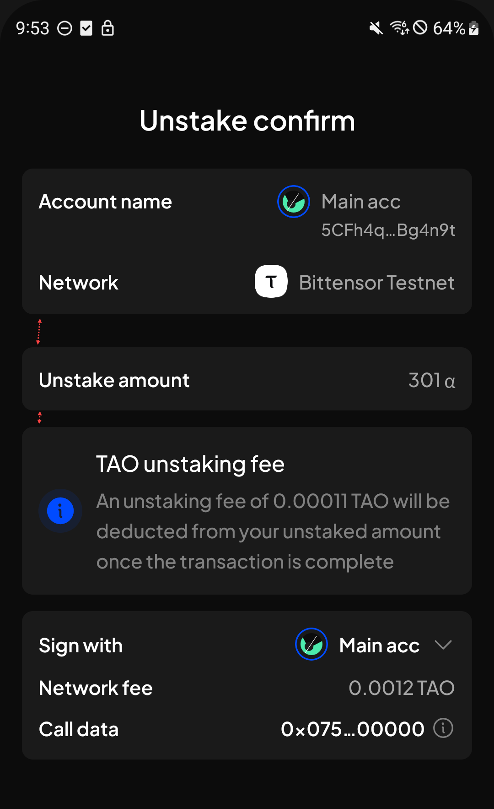

# Manual Test Report — EPIC-42 — 2026-09-08

| Field | Value |
|---|---|
| Epic | EPIC-42 — QA Coverage Tracking |
| Date | 2026-09-08 |
| Tester | MaiThuongNinni |
| Environment | Mobile — Android + iOS |
| Runner | manual (mobile) |
| Build under test | to fill in — build number + web-runner version |
| Stories tested | US-42.24.5, US-42.24.19 |
| Total bugs found | 1 |
| P0 | 0 |
| P1 | 0 |
| P2 | 0 |
| P3 | 1 |
| Status | in progress |

---

## US-42.24.5 — Web-runner 1.3.72 on Mobile

Part of [US-42.24](../../../../sprints/stories/US-42.24-qc-web-runner-1-3-86.md). Proxy accounts ([#4725](https://github.com/Koniverse/SubWallet-Extension/issues/4725)), chain-list v0.2.123 ([#4861](https://github.com/Koniverse/SubWallet-Extension/issues/4861)) and ParaSpell V5 ([#4908](https://github.com/Koniverse/SubWallet-Extension/issues/4908)).

Carried on from [2026-09-07](../2026-09-07/report-manual.md), where AC-1 to AC-8 passed and AC-19 was skipped. Today picks up from AC-9.

### AC results

| AC | Description | Result | Notes |
|---|---|---|---|
| AC-9 | Non-transfer, Staking and Governance proxies are not offered in the signer list for a transfer — Android + iOS fresh | ✅ Pass | |
| AC-10 | Earning and staking can be done through an Any, Non-transfer or Staking proxy — Android + iOS fresh | ✅ Pass | |
| AC-11 | Adding the same account again with a type it already holds is refused; a different type is allowed — Android + iOS fresh | ✅ Pass | |
| AC-12 | Two accounts can each hold a proxy over the other — A over B and B over A — Android + iOS fresh | ✅ Pass | |
| AC-13 | Three accounts can cross over: A adds B, B adds C, A adds C, each list holding only what it was given — Android + iOS fresh | ✅ Pass | |
| AC-14 | In that arrangement, A signed by B, A signed by C and B signed by C all work — Android + iOS fresh | ✅ Pass | |
| AC-15 | The first proxy reserves ProxyDepositBase plus one ProxyDepositFactor on the adding account, and the account given the proxy has nothing reserved — Android + iOS fresh | ✅ Pass | |
| AC-16 | A second proxy reserves one more ProxyDepositFactor, whatever type it is — Android + iOS fresh | ✅ Pass | |
| AC-17 | Removing one proxy of several returns exactly one ProxyDepositFactor; removing the last returns the rest — Android + iOS fresh | ✅ Pass | |
| AC-18 | With too little balance the transaction fails and nothing changes, and an error is shown — Android + iOS fresh | ✅ Pass | |
| AC-20 | AC-1 to AC-18 pass on Android + iOS upgrade | ✅ Pass | |
| AC-21 | Mosaic Chain Mainnet appears, connects, and balances load — Android + iOS fresh | ✅ Pass | [ChainList #631](https://github.com/Koniverse/SubWallet-ChainList/issues/631) |
| AC-22 | Bifrost Network mainnet and testnet appear and connect, with the testnet showing its updated network information — Android + iOS fresh | ✅ Pass | [ChainList #643](https://github.com/Koniverse/SubWallet-ChainList/issues/643) and [#646](https://github.com/Koniverse/SubWallet-ChainList/issues/646) |
| AC-23 | Metamask USD on Ethereum appears with the right symbol, decimals and balance — Android + iOS fresh | ✅ Pass | [ChainList #629](https://github.com/Koniverse/SubWallet-ChainList/issues/629) |
| AC-24 | USDC and stEWT on Energy Web X appear and can be sent — Android + iOS fresh | ✅ Pass | [ChainList #639](https://github.com/Koniverse/SubWallet-ChainList/issues/639) — the item #2057 lists as "#639" |
| AC-27 | NIGHT on Cardano shows a price — Android + iOS fresh | ⏭️ Skipped | [ChainList #642](https://github.com/Koniverse/SubWallet-ChainList/issues/642) — Mobile does not support Cardano, so there is no screen the price could appear on |
| AC-31 | The removed networks are gone and cannot be enabled — Amplitude Testnet, Parallel, Acala Mandala, Subsocial X, Integritee Polkadot, Integritee, Logion — Android + iOS fresh | ✅ Pass | [ChainList #638](https://github.com/Koniverse/SubWallet-ChainList/issues/638) |
| AC-36 | The Bittensor subnet logos and the WUD token logo are updated — Android + iOS fresh | ✅ Pass | [ChainList #635](https://github.com/Koniverse/SubWallet-ChainList/issues/635) |
| AC-37 | The Stable Mainnet block explorer link opens the right page — Android + iOS fresh | ✅ Pass | [ChainList #640](https://github.com/Koniverse/SubWallet-ChainList/issues/640) |

The proxy account half of this story is finished. Every check passes except AC-19, skipped on 2026-09-07 because Mobile has no governance screen to vote from.

The deposit arithmetic was checked against ProxyDepositBase and ProxyDepositFactor rather than against itself: the reserve moves by the right amount on each add and each remove, and the account being given a proxy never has anything reserved.

Proxies do not inherit from one another. Two accounts can each hold a proxy over the other, and three can cross over without any list overwriting another.

### Bugs

No bugs on the proxy signing checks.

## US-42.24.19 — Web-runner 1.3.86 full regression on Mobile

Part of [US-42.24](../../../../sprints/stories/US-42.24-qc-web-runner-1-3-86.md). The full wallet regression, run alongside the version sub-tasks where the same screens come up.

### Bugs

| ID | Title | Steps to reproduce | Actual | Expected | Severity | Status | Screenshot |
|---|---|---|---|---|---|---|---|
| BUG-42.24.19-11 | The sections on the Unstake confirm screen are spaced unevenly | Open a staked position → Unstake → enter an amount → Continue → look at the gaps between the boxes on the confirm screen | The gap between the account box and the Unstake amount box is larger than the gap between Unstake amount and the fee box below it | The gaps between the boxes are the same | P3 | todo |  |

## Summary

Session in progress.
