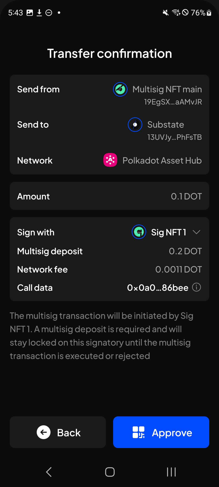
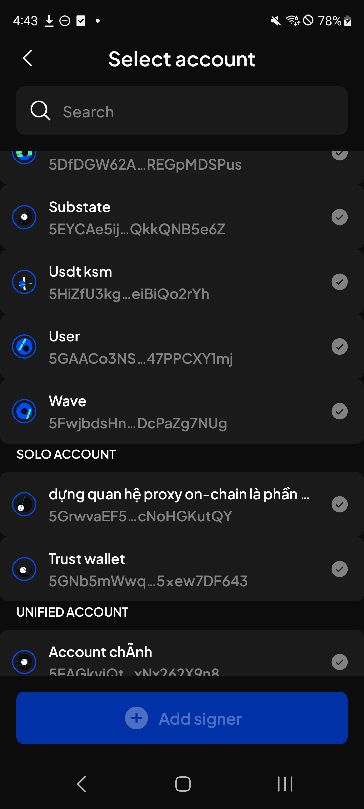
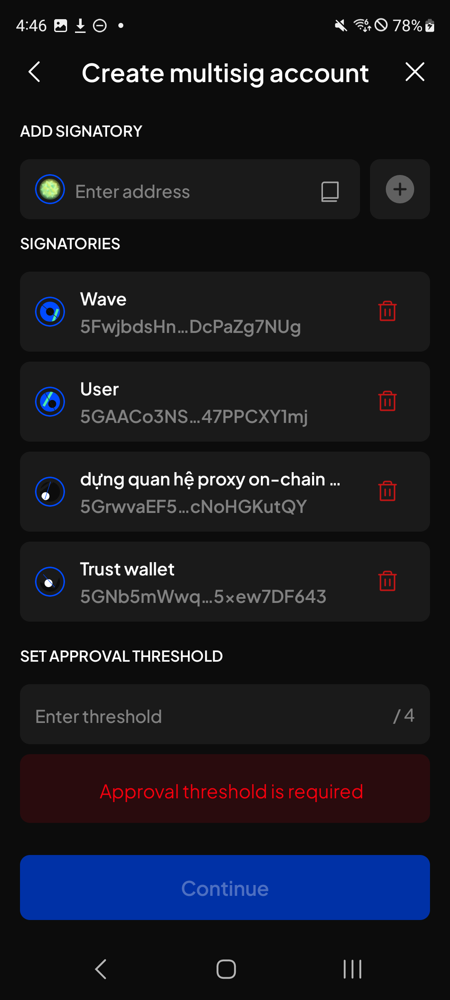

# Manual Test Report — EPIC-42 — 2026-09-08

| Field | Value |
|---|---|
| Epic | EPIC-42 — QA Coverage Tracking |
| Date | 2026-09-08 |
| Tester | MaiThuongNinni |
| Environment | Mobile — Android + iOS |
| Runner | manual (mobile) |
| Build under test | to fill in — build number + web-runner version |
| Stories tested | US-42.24.5, US-42.24.6, US-42.24.7, US-42.24.8, US-42.24.19 |
| Total bugs found | 4 |
| P0 | 0 |
| P1 | 0 |
| P2 | 1 |
| P3 | 3 |
| Status | done |

---

## US-42.24.5 — Web-runner 1.3.72 on Mobile

Part of [US-42.24](../../../../sprints/stories/US-42.24-qc-web-runner-1-3-86.md). Proxy accounts ([#4725](https://github.com/Koniverse/SubWallet-Extension/issues/4725)), chain-list v0.2.123 ([#4861](https://github.com/Koniverse/SubWallet-Extension/issues/4861)) and ParaSpell V5 ([#4908](https://github.com/Koniverse/SubWallet-Extension/issues/4908)).

Carried on from [2026-09-07](../2026-09-07/report-manual.md), where AC-1 to AC-8 passed and AC-19 was skipped. Today picks up from AC-9.

### AC results

| AC | Description | Result | Notes |
|---|---|---|---|
| AC-3a | The Manage proxies tab appears on the chains the chain-list marks as supporting proxies, and not on the others — Android + iOS fresh | ✅ Pass | [ChainList #613](https://github.com/Koniverse/SubWallet-ChainList/issues/613) — added today; the chain-list side of the proxy feature had no AC of its own |
| AC-9 | Non-transfer, Staking and Governance proxies are not offered in the signer list for a transfer — Android + iOS fresh | ✅ Pass | |
| AC-10 | Earning and staking can be done through an Any, Non-transfer or Staking proxy — Android + iOS fresh | ✅ Pass | |
| AC-11 | Adding the same account again with a type it already holds is refused; a different type is allowed — Android + iOS fresh | ✅ Pass | |
| AC-12 | Two accounts can each hold a proxy over the other — A over B and B over A — Android + iOS fresh | ✅ Pass | |
| AC-13 | Three accounts can cross over: A adds B, B adds C, A adds C, each list holding only what it was given — Android + iOS fresh | ✅ Pass | |
| AC-14 | In that arrangement, A signed by B, A signed by C and B signed by C all work — Android + iOS fresh | ✅ Pass | |
| AC-15 | The first proxy reserves ProxyDepositBase plus one ProxyDepositFactor on the adding account, and the account given the proxy has nothing reserved — Android + iOS fresh | ✅ Pass | |
| AC-16 | A second proxy reserves one more ProxyDepositFactor, whatever type it is — Android + iOS fresh | ✅ Pass | |
| AC-17 | Removing one proxy of several returns exactly one ProxyDepositFactor; removing the last returns the rest — Android + iOS fresh | ✅ Pass | |
| AC-18 | With too little balance the transaction fails and nothing changes, and an error is shown — Android + iOS fresh | ✅ Pass | |
| AC-20 | AC-1 to AC-18 pass on Android + iOS upgrade | ✅ Pass | |
| AC-21 | Mosaic Chain Mainnet appears, connects, and balances load — Android + iOS fresh | ✅ Pass | [ChainList #631](https://github.com/Koniverse/SubWallet-ChainList/issues/631) |
| AC-22 | Bifrost Network mainnet and testnet appear and connect, with the testnet showing its updated network information — Android + iOS fresh | ✅ Pass | [ChainList #643](https://github.com/Koniverse/SubWallet-ChainList/issues/643) and [#646](https://github.com/Koniverse/SubWallet-ChainList/issues/646) |
| AC-23 | Metamask USD on Ethereum appears with the right symbol, decimals and balance — Android + iOS fresh | ✅ Pass | [ChainList #629](https://github.com/Koniverse/SubWallet-ChainList/issues/629) |
| AC-24 | USDC and stEWT on Energy Web X appear and can be sent — Android + iOS fresh | ✅ Pass | [ChainList #639](https://github.com/Koniverse/SubWallet-ChainList/issues/639) — the item #2057 lists as "#639" |
| AC-25 | PYUSD0 on Stable Mainnet, stablecoins on Kusama Asset Hub, WAVE on Bifrost Polkadot and PR on Base Mainnet all appear correctly — Android + iOS fresh | ✅ Pass | ChainList [#648](https://github.com/Koniverse/SubWallet-ChainList/issues/648), [#649](https://github.com/Koniverse/SubWallet-ChainList/issues/649), [#656](https://github.com/Koniverse/SubWallet-ChainList/issues/656), [#657](https://github.com/Koniverse/SubWallet-ChainList/issues/657) |
| AC-26 | JPYC appears on each EVM network it was added to, and shows as one multichain asset rather than several separate tokens — Android + iOS fresh | ✅ Pass | [ChainList #655](https://github.com/Koniverse/SubWallet-ChainList/issues/655) |
| AC-27 | NIGHT on Cardano shows a price — Android + iOS fresh | ⏭️ Skipped | [ChainList #642](https://github.com/Koniverse/SubWallet-ChainList/issues/642) — Mobile does not support Cardano, so there is no screen the price could appear on |
| AC-28 | All six renamed symbols read correctly everywhere they appear — token list, detail, send and swap: xDAI to XDAI on Gnosis, USD₮0 to USDT0 on Stable Mainnet, TON to TONCOIN on Ethereum, USDC.axl to axlUSDC on Moonbeam, USD₮0 to USDT0 on Polygon, USDT to USDt on Kusama Asset Hub — Android + iOS fresh | ✅ Pass | [ChainList #651](https://github.com/Koniverse/SubWallet-ChainList/issues/651) |
| AC-29 | The Gnosis chain itself reads XDAI rather than xDAI — Android + iOS fresh | ✅ Pass | |
| AC-30 | A renamed token held before the upgrade still shows its balance and history, under the new symbol — both platforms | ✅ Pass | |
| AC-31 | The removed networks are gone and cannot be enabled — Amplitude Testnet, Parallel, Acala Mandala, Subsocial X, Integritee Polkadot, Integritee, Logion — Android + iOS fresh | ✅ Pass | [ChainList #638](https://github.com/Koniverse/SubWallet-ChainList/issues/638) |
| AC-31a | Nodle Parachain and Altair are gone too and cannot be enabled — Android + iOS fresh | ✅ Pass | [ChainList #658](https://github.com/Koniverse/SubWallet-ChainList/issues/658) — added today, the AC written earlier named seven networks and these two were not among them |
| AC-32 | An account that held assets on a removed network opens without error after the upgrade, and its history screen is not broken — both platforms | ✅ Pass | |
| AC-33 | USDC can be sent by XCM between Polkadot Asset Hub and Energy Web X — Android + iOS fresh | ✅ Pass | ChainList [#645](https://github.com/Koniverse/SubWallet-ChainList/issues/645) and [#647](https://github.com/Koniverse/SubWallet-ChainList/issues/647), the RPC that route needs. BUG-42.24.2-04, logged on 1.3.69 when no XCM route could fetch a fee, does not reproduce here |
| AC-34 | Stablecoins can be sent by XCM between Polkadot Asset Hub and Kusama Asset Hub — Android + iOS fresh | ✅ Pass | [ChainList #650](https://github.com/Koniverse/SubWallet-ChainList/issues/650) |
| AC-35 | Every chain whose RPC list was trimmed still connects and loads balances — Android + iOS fresh | ✅ Pass | [ChainList #651](https://github.com/Koniverse/SubWallet-ChainList/issues/651) |
| AC-35a | Shibuya connects on its corrected paraChainId (1000 to 2000) — Android + iOS fresh | ✅ Pass | [ChainList #651](https://github.com/Koniverse/SubWallet-ChainList/issues/651) — added today |
| AC-35b | HOLLAR on Hydration shows its corrected existential deposit of 0.02 — Android + iOS fresh | ✅ Pass | [ChainList #651](https://github.com/Koniverse/SubWallet-ChainList/issues/651) — added today |
| AC-36 | The Bittensor subnet logos and the WUD token logo are updated — Android + iOS fresh | ✅ Pass | [ChainList #635](https://github.com/Koniverse/SubWallet-ChainList/issues/635) and [#659](https://github.com/Koniverse/SubWallet-ChainList/issues/659) |
| AC-37 | The Stable Mainnet block explorer link opens the right page — Android + iOS fresh | ✅ Pass | [ChainList #640](https://github.com/Koniverse/SubWallet-ChainList/issues/640) |
| AC-38 | On Xode Polkadot, "View on explorer" from a transaction opens that transaction rather than a wrong or empty page — Android + iOS fresh | ✅ Pass | [ChainList #660](https://github.com/Koniverse/SubWallet-ChainList/issues/660) |
| AC-39 | AC-21 to AC-38 pass on Android + iOS upgrade | ✅ Pass | |

The proxy account half of this story is finished. Every check passes except AC-19, skipped on 2026-09-07 because Mobile has no governance screen to vote from.

The deposit arithmetic was checked against ProxyDepositBase and ProxyDepositFactor rather than against itself: the reserve moves by the right amount on each add and each remove, and the account being given a proxy never has anything reserved.

Proxies do not inherit from one another. Two accounts can each hold a proxy over the other, and three can cross over without any list overwriting another.

### Bugs

No bugs on the proxy signing checks.

## US-42.24.6 — Web-runner 1.3.73 on Mobile

Part of [US-42.24](../../../../sprints/stories/US-42.24-qc-web-runner-1-3-86.md). Started today, out of the backlog. All three items ran: the services-sdk update ([#4957](https://github.com/Koniverse/SubWallet-Extension/issues/4957)), the Crowdloans tab removal ([#4920](https://github.com/Koniverse/SubWallet-Extension/issues/4920)) and the parachain earning position fix ([#4950](https://github.com/Koniverse/SubWallet-Extension/issues/4950)).

### AC results

| AC | Description | Result | Notes |
|---|---|---|---|
| AC-1 | The Crowdloans tab is gone from the app — Android + iOS fresh | ✅ Pass | |
| AC-2 | An account with funds still locked in a past crowdloan can still see that locked amount somewhere — Android + iOS fresh | ✅ Pass | The money is not hidden, only the tab is gone |
| AC-3 | AC-1 and AC-2 pass on Android + iOS upgrade | ✅ Pass | |
| AC-4 | Earning positions on parachains load and show the right amounts, including on chains that need two arguments — Android + iOS fresh | ✅ Pass | |
| AC-5 | Unstaking requests already scheduled show with the right amount and release time — Android + iOS fresh | ✅ Pass | |
| AC-6 | AC-4 and AC-5 pass on Android + iOS upgrade | ✅ Pass | |
| AC-7 | A network from a chain-list patch turns on without an error — Android + iOS fresh | ✅ Pass | [#4957](https://github.com/Koniverse/SubWallet-Extension/issues/4957) — services-sdk 0.1.16 |
| AC-8 | AC-7 passes on Android + iOS upgrade | ✅ Pass | |
| AC-9 | After upgrading from a version that still had the Crowdloans tab, nothing is left broken where the tab used to be, and earning positions are still correct — both platforms | ✅ Pass | |

All nine AC pass. The third item in this version, services-sdk 0.1.16, was the one that fixed the network-toggle error.

### Bugs

None.

## US-42.24.8 — Web-runner 1.3.75 on Mobile

Part of [US-42.24](../../../../sprints/stories/US-42.24-qc-web-runner-1-3-86.md). Started today, out of the backlog. One item: the user-configurable Subscan API key in Settings ([#4965](https://github.com/Koniverse/SubWallet-Extension/issues/4965)).

### AC results

| AC | Description | Result | Notes |
|---|---|---|---|
| AC-1 | The API key field is in Settings, hidden as you type, and the eye toggle reveals and hides it — Android + iOS fresh | ✅ Pass | |
| AC-2 | A valid key saves, and it is still there after closing and reopening the app — Android + iOS fresh | ✅ Pass | |
| AC-3 | With a valid key saved, the features that use Subscan work — balances and history load — Android + iOS fresh | ✅ Pass | |
| AC-4 | The key is not shown anywhere it should not be, such as logs or an export — Android + iOS fresh | ✅ Pass | |
| AC-5 | An invalid key gives a clear message rather than a silent failure — Android + iOS fresh | ✅ Pass | |
| AC-6 | The key can be cleared, and the app falls back to working without one — Android + iOS fresh | ✅ Pass | Judged against how the Extension behaves today |
| AC-7 | AC-1 to AC-6 pass on Android + iOS upgrade | ✅ Pass | |
| AC-8 | After upgrading, a key saved before the upgrade is still saved and still works — both platforms | ✅ Pass | |

All eight pass.

### Bugs

None.

## US-42.24.7 — Web-runner 1.3.74 on Mobile

Part of [US-42.24](../../../../sprints/stories/US-42.24-qc-web-runner-1-3-86.md). Multisig account phase 1 ([#4855](https://github.com/Koniverse/SubWallet-Extension/issues/4855)). The AC for this story were rewritten today from the multisig QC checklist, because the issue body is an unfilled template. Started on the transfer confirmation screen.

### AC results

Nothing settled yet.

### Bugs

| ID | Title | Steps to reproduce | Actual | Expected | Severity | Status | Screenshot |
|---|---|---|---|---|---|---|---|
| BUG-42.24.7-01 | The multisig confirmation screens still use the old layout, not the one the Extension has | Create a multisig account → start a transfer from it → look at the Transfer confirmation screen, and compare with the same screen on the Extension | Mobile labels the first row Send from and puts the recipient and amount in separate blocks. The Extension labels it Multisig, groups network with it, and puts recipient and amount together in one block | The confirmation screens match the Extension layout. This applies to every multisig confirmation screen, not only transfer | P2 | todo |  |

## US-42.24.19 — Web-runner 1.3.86 full regression on Mobile

Part of [US-42.24](../../../../sprints/stories/US-42.24-qc-web-runner-1-3-86.md). The full wallet regression, run alongside the version sub-tasks where the same screens come up.

### Bugs

| ID | Title | Steps to reproduce | Actual | Expected | Severity | Status | Screenshot |
|---|---|---|---|---|---|---|---|
| BUG-42.24.19-11 | The sections on the Unstake confirm screen are spaced unevenly | Open a staked position → Unstake → enter an amount → Continue → look at the gaps between the boxes on the confirm screen | The gap between the account box and the Unstake amount box is larger than the gap between Unstake amount and the fee box below it | The gaps between the boxes are the same | P3 | todo |  |
| BUG-42.24.19-12 | The group headings on the Select account screen have no padding above them | Multisig → Add signer → Select account → look at the SOLO ACCOUNT and UNIFIED ACCOUNT headings | Each heading sits flush against the block of accounts above it, with no gap, while there is a gap below it before its own block | The heading has space above it, so it reads as belonging to the block below rather than being stuck to the one above | P3 | todo |  |
| BUG-42.24.19-13 | The blocks on the Create multisig account screen are spaced unevenly | Multisig → Create multisig account → look at the gaps between ADD SIGNATORY, SIGNATORIES and SET APPROVAL THRESHOLD and their blocks | The gaps differ from one section to the next, and the signatory rows sit closer together than the sections around them | The sections and their blocks are spaced evenly down the screen | P3 | todo |  |

## Summary

US-42.24.5 finished both of its large halves. The proxy account work is settled — AC-1 to AC-18 and AC-20 pass, AC-19 skipped because Mobile has no governance screen — and so is chain-list v0.2.123, where AC-21 to AC-39 pass and only AC-27 is skipped, Cardano not being supported on Mobile. Every one of the 22 ChainList issues in that version now has a verdict. What is left in the story is ParaSpell V5, AC-40 to AC-43.

Four AC were added along the way, each because reading the ChainList issue showed the AC written earlier did not cover what had changed: the metadata marking which chains support proxies, the Shibuya paraChainId correction, the HOLLAR existential deposit, and the removal of Nodle Parachain and Altair.

Two stories closed clean out of the backlog. US-42.24.6 on 1.3.73 passes 9 of 9 — the Crowdloans tab removal, the parachain earning position fix and services-sdk 0.1.16. US-42.24.8 on 1.3.75 passes 8 of 8, the user-configurable Subscan API key.

BUG-42.24.2-04 turned out to be fixed: XCM could not fetch a fee on any route when it was logged on 1.3.69, and both new routes send on this build. The two AC it was holding are different routes and still need their rerun.

Four bugs today, all display problems. The multisig confirmation screens still use the old layout rather than the Extension's; the other three are spacing and padding on the Unstake confirm, Select account and Create multisig account screens.
