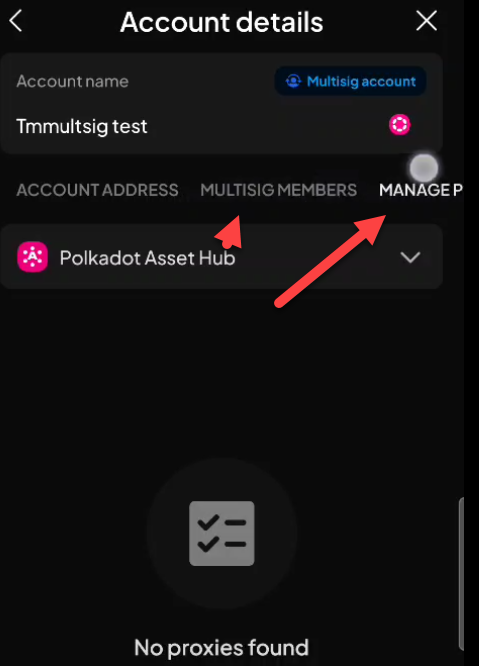
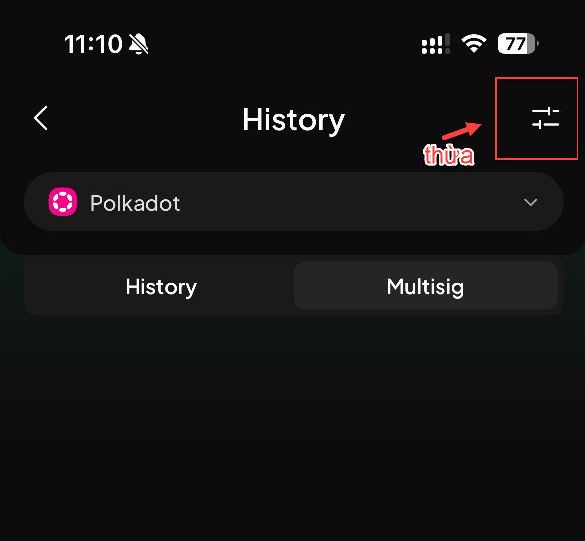
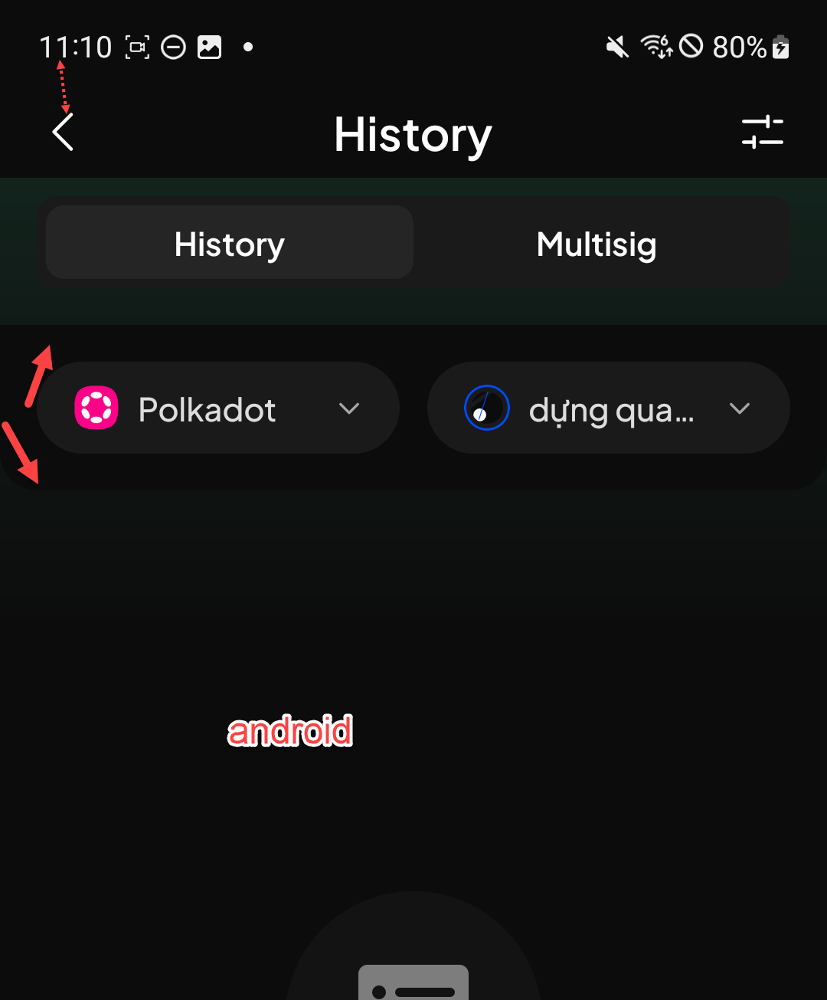
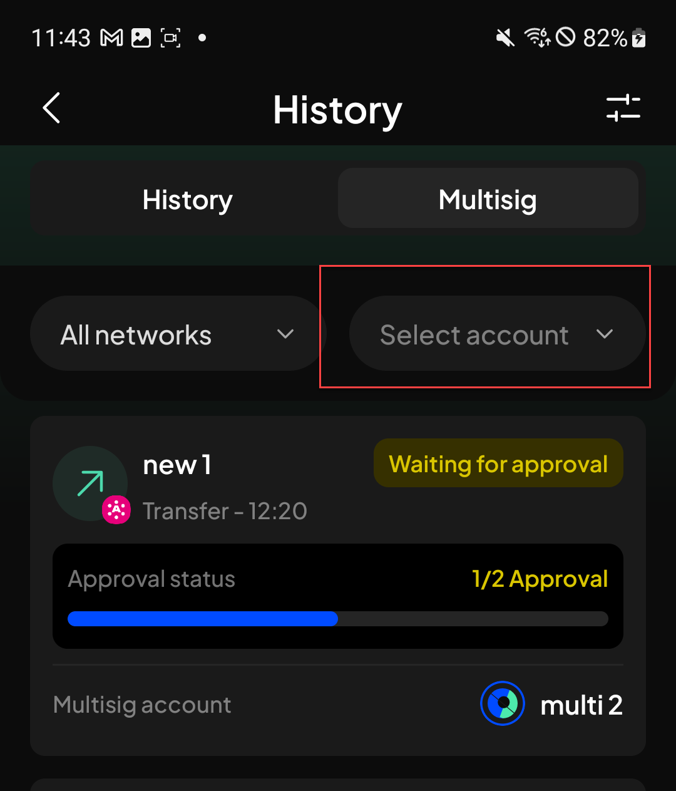
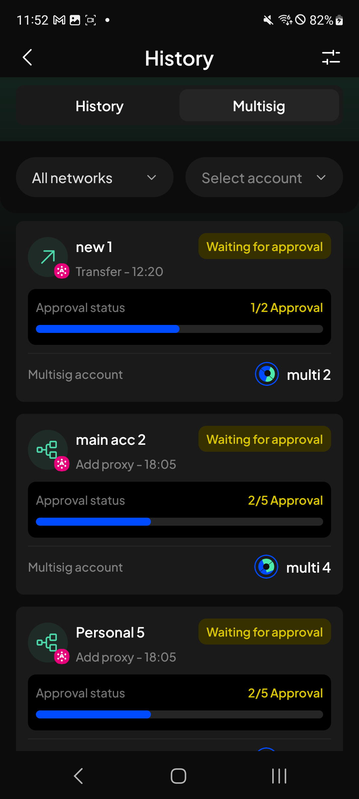
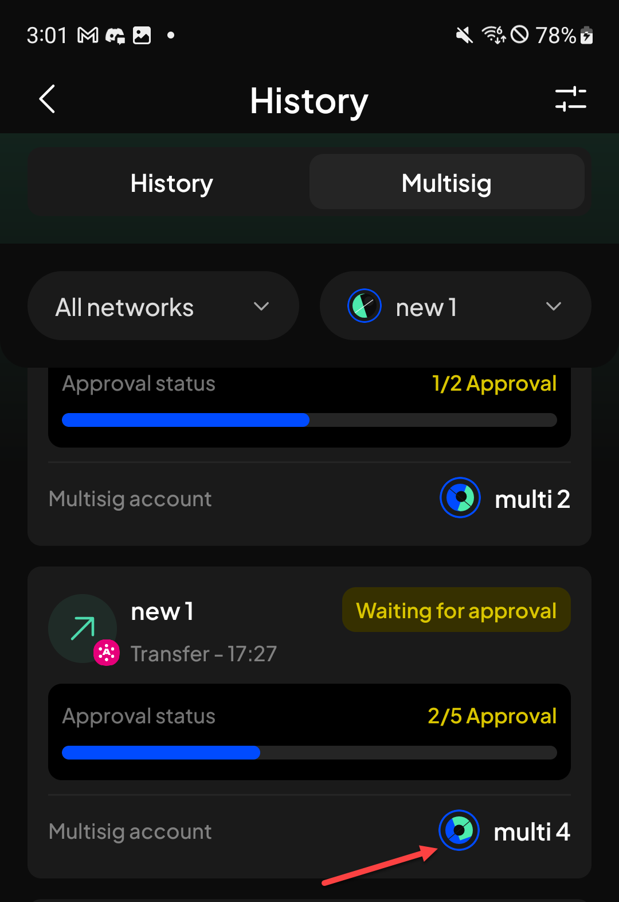
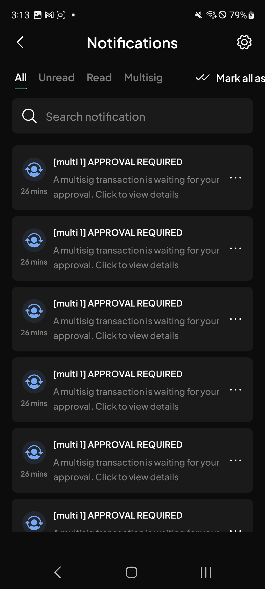
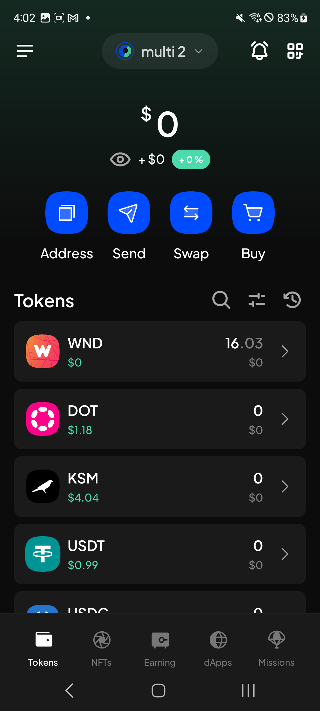
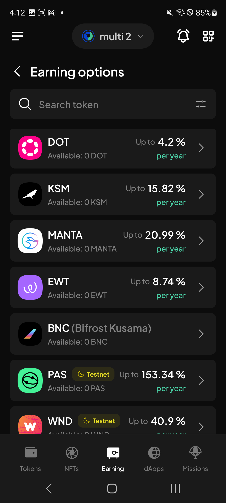

# Manual Test Report — EPIC-42 — 2026-09-09

| Field | Value |
|---|---|
| Epic | EPIC-42 — QA Coverage Tracking |
| Date | 2026-09-09 |
| Tester | MaiThuongNinni |
| Environment | Mobile — Android + iOS |
| Runner | manual (mobile) |
| Build under test | to fill in — build number + web-runner version |
| Stories tested | US-42.24.5, US-42.24.7, US-42.24.9 |
| Total bugs found | 10 |
| P0 | 0 |
| P1 | 0 |
| P2 | 6 |
| P3 | 4 |
| Status | in progress |

---

## US-42.24.5 — Web-runner 1.3.72 on Mobile

Part of [US-42.24](../../../../sprints/stories/US-42.24-qc-web-runner-1-3-86.md). The proxy and chain-list halves were settled on [2026-09-08](../2026-09-08/report-manual.md); what was left is ParaSpell V5 ([#4908](https://github.com/Koniverse/SubWallet-Extension/issues/4908)).

### AC results

| AC | Description | Result | Notes |
|---|---|---|---|
| AC-40 | XCM transfers still work on the main routes, and the fee shown before sending matches what is actually taken — Android + iOS fresh | ✅ Pass | |
| AC-41 | Routes that existed before the upgrade are all still offered — none quietly disappeared — Android + iOS fresh | ✅ Pass | |
| AC-42 | AC-40 and AC-41 pass on Android + iOS upgrade | ✅ Pass | |
| AC-43 | After upgrading, proxy relationships set up before the upgrade are still listed and still usable — both platforms | ✅ Pass | |

The XCM library moving up a major version broke nothing: the routes are all still there and the fees match.

Every AC in this story now has a verdict — 41 pass, AC-19 and AC-27 skipped. The six bugs logged against it are all display problems on the proxy screens; none of them stopped a flow, so the AC covering those flows pass.

### Bugs

None.

## US-42.24.7 — Web-runner 1.3.74 on Mobile

Part of [US-42.24](../../../../sprints/stories/US-42.24-qc-web-runner-1-3-86.md). Multisig account phase 1 ([#4855](https://github.com/Koniverse/SubWallet-Extension/issues/4855)).

Carried on from [2026-09-08](../2026-09-08/report-manual.md), where the AC were rewritten from the multisig QC checklist and BUG-42.24.7-01 was logged on the confirmation screen. Today starts at the top of the checklist.

### AC results

| AC | Description | Result | Notes |
|---|---|---|---|
| AC-1 | A multisig account can be created by picking signatories and a threshold, and the address matches what the chain derives — Android + iOS fresh | ✅ Pass | |
| AC-2 | The threshold field refuses to go past the number of signatories and refuses to be left empty — Android + iOS fresh | ✅ Pass | |
| AC-3 | Signatories of each kind can be added — normal, QR, watch-only, ledger, proxy and another multisig — Android + iOS fresh | ✅ Pass | |
| AC-4 | The multisig account appears in the account list marked as multisig, and its balance loads — Android + iOS fresh | ✅ Pass | |
| AC-5 | The signatory list and threshold can be seen after creation, and the account can be renamed and removed — Android + iOS fresh | ✅ Pass | |
| AC-6 | With no signable signatory left the multisig behaves as watch-only, and sending from it is refused with a message — Android + iOS fresh | ✅ Pass | The AC was corrected today. It had been written from the checklist as "The account you are using is Multisig account, you cannot send assets with it"; the build says "No signatories/proxies found to sign this multisig transaction. Add signatories/proxies and try again" |
| AC-7 | Multisig accounts appear in the export account list and export all, and a multisig account can be exported on its own — Android + iOS fresh | ✅ Pass | |
| AC-8 | A multisig account can be imported back from the exported JSON file — Android + iOS fresh | ✅ Pass | |
| AC-9 | Recreating a deleted multisig with the same signatories and threshold restores the old account, for signatory lists of each kind — Android + iOS fresh | ✅ Pass | Run with normal, QR, watch-only, ledger, proxy and multisig signatories |
| AC-10 | A restored multisig keeps its history and notifications, and its actions can be performed again — Android + iOS fresh | ✅ Pass | |
| AC-14 | Swap is disabled for a multisig account, both with and without XCM — Android + iOS fresh | ❌ Fail | See BUG-42.24.7-10 |
| AC-15 | Earning — nomination pool and direct nomination follow the transfer logic; liquid staking and subnet staking are hidden — Android + iOS fresh | ❌ Fail | See BUG-42.24.7-11 — the liquid staking half |

### Bugs

| ID | Title | Steps to reproduce | Actual | Expected | Severity | Status | Screenshot |
|---|---|---|---|---|---|---|---|
| BUG-42.24.7-02 | The tab bar on a multisig account's details screen cannot be scrolled sideways | Open a multisig account → Account details → look at the tab row: ACCOUNT ADDRESS, MULTISIG MEMBERS, MANAGE P… | The tabs are wider than the screen and the last one is cut off. Swiping the row sideways does not move it, so the tabs past the edge cannot be reached | The tab row scrolls sideways so every tab can be opened | P2 | todo |  |
| BUG-42.24.7-03 | The filter button is still shown on the Multisig tab of History, where it does nothing (iOS) | Open History → switch to the Multisig tab → look at the filter button top right | The filter button is there on the Multisig tab as well as on the History tab, although there is nothing on this tab to filter | The filter button is hidden on the Multisig tab | P3 | todo |  |
| BUG-42.24.7-04 | The background behind the filter row on History is the wrong colour (Android) | Open History on Android → look at the strip behind the network and account filters | The strip behind the filters is a different shade from the rest of the screen, so it reads as a separate band | The background matches the rest of the screen, as it does on iOS | P3 | todo |  |
| BUG-42.24.7-05 | The Select account dropdown on the Multisig tab has its label in the wrong colour | Open History → Multisig tab → look at the Select account dropdown next to All networks | Select account is dim grey, while All networks beside it is in the normal white. The two dropdowns sit side by side and do not match | Both dropdowns use the same label colour | P3 | todo |  |
| BUG-42.24.7-06 | Pending multisig records on the Multisig tab have no date heading | Open History → Multisig tab → look above the first pending record, and compare with the same tab on the Extension | The records run straight on with no date above them. Each shows only a time, so which day a request came from cannot be told. The Extension groups them under a date heading such as "Feb 11, 2026" | The records are grouped under a date heading, as they are on the Extension | P2 | todo |  |
| BUG-42.24.7-07 | The multisig account name on a pending transaction is in the wrong colour | Open History → Multisig tab → look at the Multisig account row at the bottom of a pending record, and compare with the same row on the Extension | On Mobile the account name is a different colour from the one the Extension uses on that row | The name uses the same colour as the Extension. The screenshot is the Extension, kept as the reference for what it should look like | P3 | todo |  |
| BUG-42.24.7-08 | Mark all as read runs off the right edge of the Notifications screen | Open Notifications → look at the tab row: All, Unread, Read, Multisig, then Mark all as read | The Mark all as read button sits on the same row as the four tabs and is cut off at the screen edge, so its label is only half readable | The button fits on screen, or moves somewhere it is not cut off | P2 | todo |  |
| BUG-42.24.7-09 | Tapping a multisig notification only opens History, not the pending transaction it names | Have a multisig transaction waiting for approval → open Notifications → tap the "[account] APPROVAL REQUIRED" item | The app opens the History screen and stops there. The pending transaction the notification is about does not open, so the approval has to be found by hand | Tapping the notification opens the detail of that pending multisig transaction, which is what "Click to view details" in the notification promises | P2 | todo | |
| BUG-42.24.7-10 | Swap is still offered on a multisig account | Switch to a multisig account → look at the action buttons on the token list | Swap sits alongside Address, Send and Buy, in the same enabled blue as the others | Swap is disabled for a multisig account, since a multisig cannot swap | P2 | todo |  |
| BUG-42.24.7-11 | Liquid staking is still listed in Earning options on a multisig account | Switch to a multisig account → Earning → look at the list of earning options | MANTA, a liquid staking option, is listed alongside the nomination pool and direct nomination ones | Liquid staking options are hidden for a multisig account, as subnet staking is | P2 | todo |  |

## US-42.24.9 — Web-runner 1.3.76 on Mobile

Part of [US-42.24](../../../../sprints/stories/US-42.24-qc-web-runner-1-3-86.md). Started today, out of the backlog. One of its three items ran: turning a network on without a correct Subscan API key ([#4972](https://github.com/Koniverse/SubWallet-Extension/issues/4972)).

### AC results

| AC | Description | Result | Notes |
|---|---|---|---|
| AC-1 | With no Subscan API key saved, a network can be turned on — Android + iOS fresh | ✅ Pass | |
| AC-2 | With a wrong API key saved, a network can still be turned on — Android + iOS fresh | ✅ Pass | |
| AC-3 | AC-1 and AC-2 pass on Android + iOS upgrade | ✅ Pass | |

The subnet token naming and the Bittensor root staking items in this version, AC-4 to AC-14, have not been run.

### Bugs

None.

## Summary

Session in progress.
