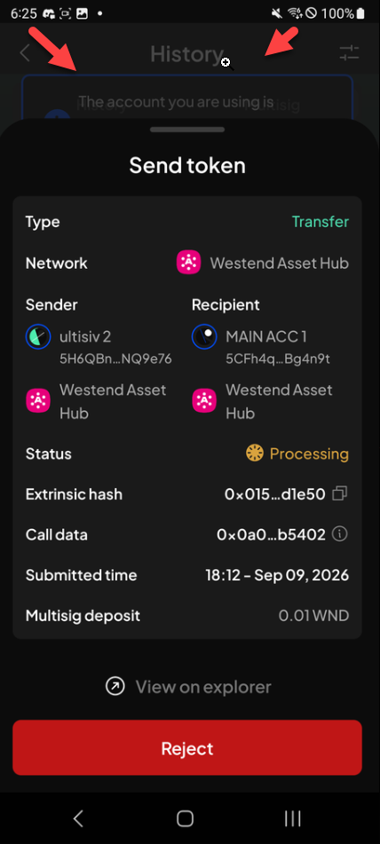
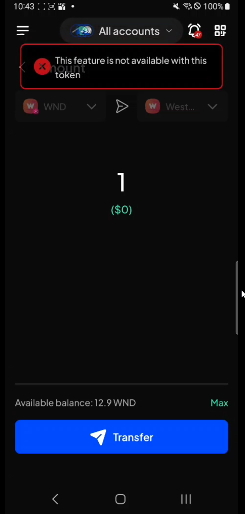
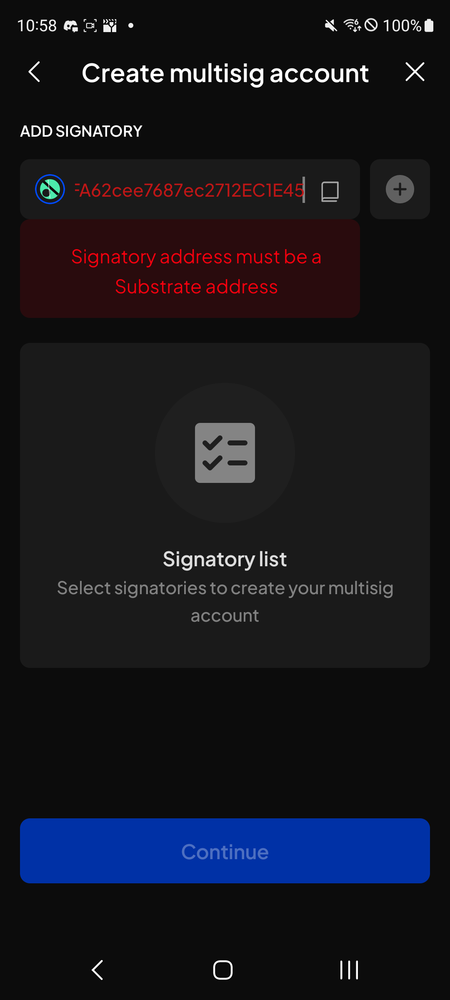
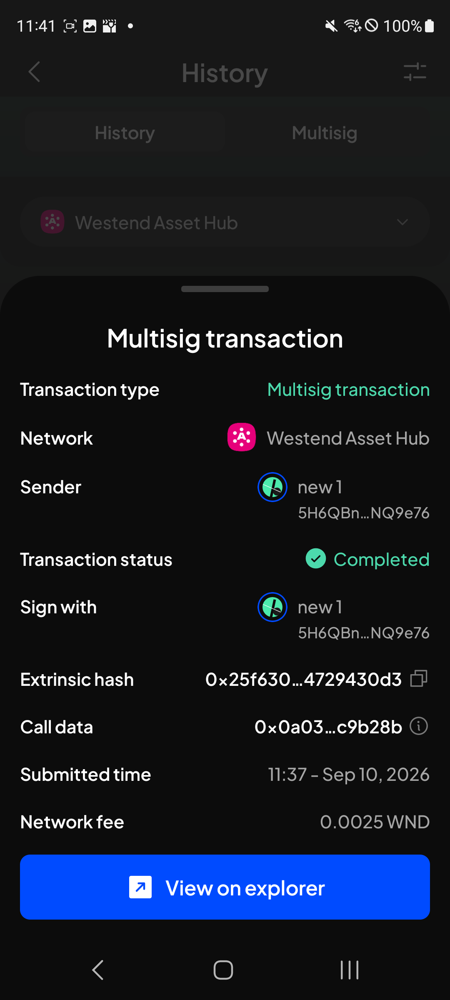
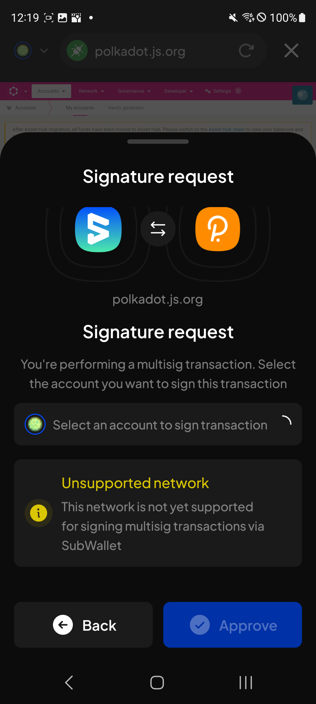
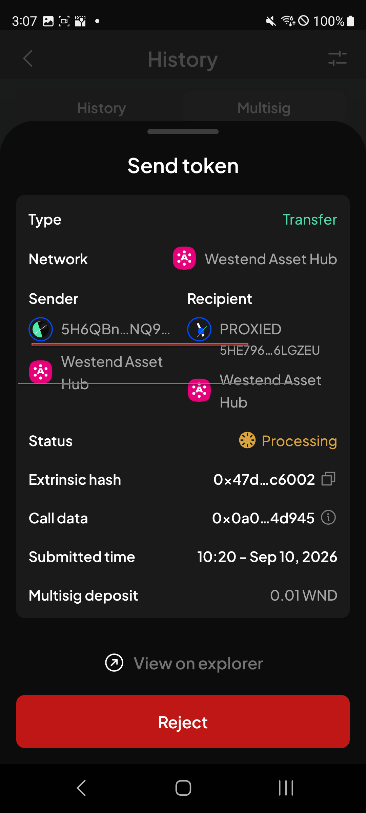
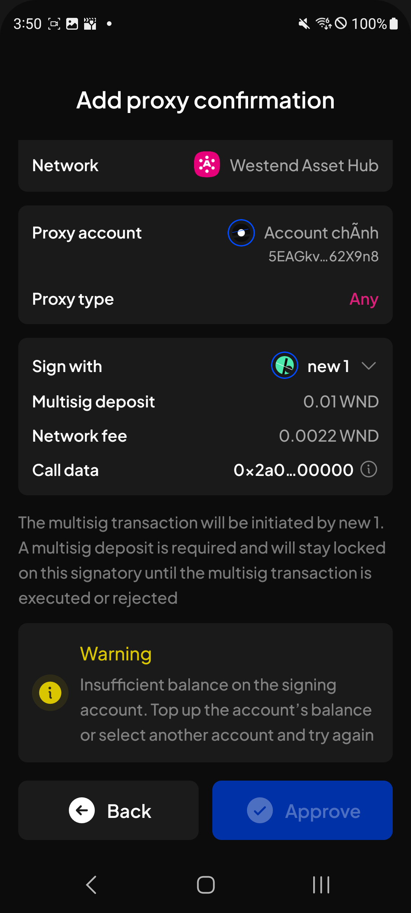
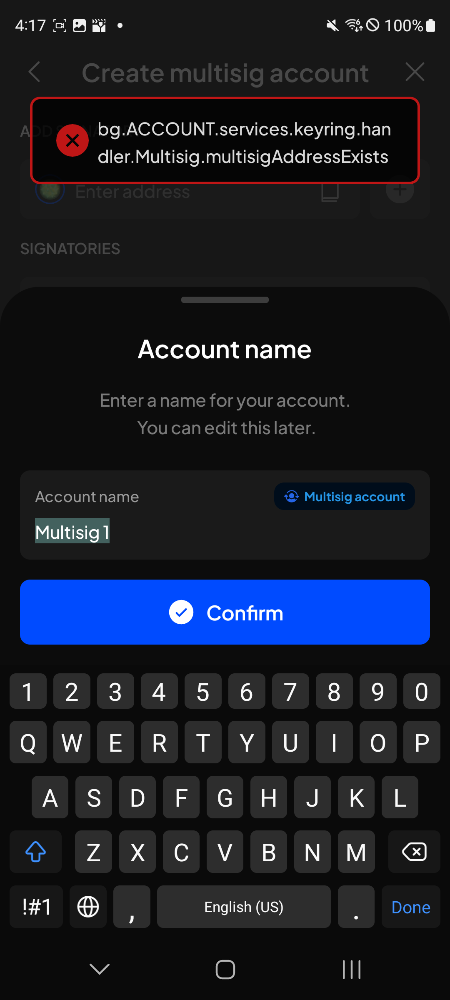
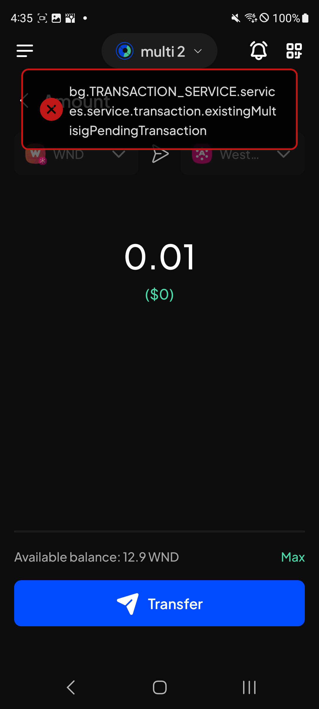
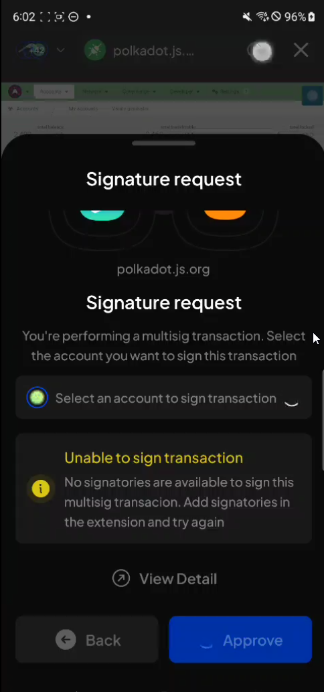

# Manual Test Report — EPIC-42 — 2026-09-10

| Field | Value |
|---|---|
| Epic | EPIC-42 — QA Coverage Tracking |
| Date | 2026-09-10 |
| Tester | MaiThuongNinni |
| Environment | Mobile — Android + iOS |
| Runner | manual (mobile) |
| Build under test | to fill in — build number + web-runner version |
| Stories tested | US-42.24.7, US-42.24.10 |
| Total bugs found | 13 |
| P0 | 0 |
| P1 | 1 |
| P2 | 10 |
| P3 | 2 |
| Status | done |

---

## US-42.24.7 — Web-runner 1.3.74 on Mobile

Part of [US-42.24](../../../../sprints/stories/US-42.24-qc-web-runner-1-3-86.md). Multisig account phase 1 ([#4855](https://github.com/Koniverse/SubWallet-Extension/issues/4855)).

Carried on from [2026-09-09](../2026-09-09/report-manual.md), where AC-1 to AC-10 passed and AC-14 and AC-15 failed. What is left is the rest of the signatory picker, notifications, history, the multisig tab and the upgrade runs.

### AC results

| AC | Description | Result | Notes |
|---|---|---|---|
| AC-13 | Cross-chain transfer is refused for a multisig account, with a message saying so — Android + iOS fresh | ❌ Fail | See BUG-42.24.7-19. The AC was corrected today: it had said cross-chain follows the same signatory logic, but multisig does not support cross-chain at all |
| AC-17 | A multisig account can connect to a dApp and can sign for one — Android + iOS fresh | ✅ Pass | The AC was corrected today: it had said a multisig cannot connect or sign, which was the old behaviour. BUG-42.24.7-22 happens only now and then, so it does not hold this AC |
| AC-19 | The All tab holds multisig items along with the rest, and the multisig tab shows them with icon, time, account name, action title and content — Android + iOS fresh | ✅ Pass | The AC was corrected today: it had said the All tab holds no multisig items, which is not how the build behaves |
| AC-20 | The unread and read tabs behave as before and hold multisig items along with the rest — Android + iOS fresh | ✅ Pass | Corrected the same way |
| AC-21 | Search works on the multisig tab, and the empty state shows when nothing matches — Android + iOS fresh | ✅ Pass | |

### Bugs

| ID | Title | Steps to reproduce | Actual | Expected | Severity | Status | Screenshot |
|---|---|---|---|---|---|---|---|
| BUG-42.24.7-16 | The toast on a pending multisig transaction is hidden behind the detail sheet | Open History → Multisig tab → tap a pending transaction so the Send token sheet opens → act on it with an account that cannot sign | The toast appears behind the sheet and is cut off partway through: "The account you are using is…" is all that can be read, so the reason the action was refused never reaches the user | The toast sits above the sheet and its whole message is readable | P2 | todo |  |
| BUG-42.24.7-17 | The Multisig tab does not offer to enable a network that is turned off | Turn off the network a pending multisig transaction belongs to → open History → Multisig tab | Nothing is offered. The app does not ask whether to enable the network, so the pending transactions on it simply do not appear and there is no way to tell why | The app asks whether to enable the network, as it does elsewhere when a screen needs a network that is off | P2 | todo | |
| BUG-42.24.7-18 | View transaction does not open the transaction details | Submit a multisig transaction → on the result screen tap View transaction | Nothing opens. The transaction details screen the button points at does not appear | The transaction details open, showing that transaction | P2 | todo | |
| BUG-42.24.7-19 | The message refusing a cross-chain transfer from a multisig does not say why | In All accounts mode → Send → pick a multisig account as From → pick a destination on another chain | The toast says "This feature is not available with this token", which points at the token rather than the account. The Extension says "Cross-chain transfer is not supported for multisig account" | The message names the real reason, as the Extension does | P2 | todo |  |
| BUG-42.24.7-20 | The signatory validation message is shown as a large red block rather than a tooltip | Create multisig account → Add signatory → paste an EVM address | "Signatory address must be a Substrate address" fills a red block between the field and the signatory list, pushing the rest of the form down. The Extension shows the same text as a small tooltip above the field, leaving the layout alone. There is also no clear button on the field, which the Extension has | The message is shown the way the Extension shows it, without moving the rest of the form | P3 | todo |  |
| BUG-42.24.7-21 | The Multisig transaction detail sheet does not match the Extension | Open History → Multisig tab → tap a completed multisig transaction → compare the fields with the same sheet on the Extension | Four differences: Transaction type reads "Multisig transaction" where the Extension reads "Sign transaction"; the account row is labelled Sender rather than From account; there is no Multisig account row at all; and a Network fee row is shown that the Extension does not have | The fields match the Extension — same labels, same rows, in the same order | P2 | todo |  |
| BUG-42.24.7-22 | Select an account to sign sometimes does not finish loading on a multisig signature request | Connect to polkadot.js.org from the in-app browser → start a multisig transaction → on the Signature request sheet look at "Select an account to sign transaction" | Intermittently the field keeps spinning and never loads the accounts. When it happens no signatory can be picked, so Approve stays disabled and the request cannot be signed | The account list loads every time, so a signatory can be chosen and the request approved | P1 | todo |  |
| BUG-42.24.7-23 | The Sender on a pending multisig transaction shows an address where the Recipient shows a name | Open History → Multisig tab → tap a pending transaction → compare the Sender and Recipient columns on the Send token sheet | Sender shows only the shortened address, while Recipient shows the account name with its address underneath. The two columns are also out of line with each other, the network row sitting at a different height on each side | Sender shows the account name the same way Recipient does, and the two columns line up | P2 | todo |  |
| BUG-42.24.7-24 | The insufficient balance warning on Add proxy confirmation is not styled like the Extension | Add a proxy from a multisig account with too little balance on the signing account → look at the warning on the Add proxy confirmation screen | Mobile puts a "Warning" heading above the text and leaves the text itself in grey. The Extension has no heading and puts the whole message in yellow | The warning is styled as the Extension styles it — no heading, message in yellow | P3 | todo |  |
| BUG-42.24.7-25 | Creating a multisig that already exists as a watch-only account shows a raw error key | Attach a multisig address to the wallet as watch-only or QR → create a multisig with the same signatories and threshold → confirm the account name | The toast shows the untranslated key "bg.ACCOUNT.services.keyring.handler.Multisig.multisigAddressExists" | The creation is blocked with a readable message: "The generated multisig address already exists under the account named \"X\". Remove the account first, then try again" | P2 | todo |  |
| BUG-42.24.7-26 | Starting a second identical multisig transaction shows a raw error key | From a multisig account start a transaction → leave it pending, unapproved → start the same transaction again, same amount, same sender and recipient, same network | The toast shows the untranslated key "bg.TRANSACTION_SERVICE.services.service.transaction.existingMultisigPendingTransaction" | The second transaction is blocked with a readable message: "You've a pending multisig transaction with the same information. Complete the transaction first, then try again". This applies to every feature, not only transfer | P2 | todo |  |
| BUG-42.24.7-27 | "Unable to sign transaction" is shown while the signatory list is still loading | On a network that supports multisig, sign from a dApp with a multisig account → watch the sheet while "Select an account to sign transaction" is still spinning | The warning "Unable to sign transaction — No signatories are available to sign this multisig transacion. Add signatories in the extension and try again" appears before the list has loaded. Once the accounts load, signing works normally, so the warning was wrong. The word "transacion" in it is also misspelt | The warning is shown only once the list has loaded and there really is no signatory available | P2 | todo |  |
| BUG-42.24.7-28 | The signatory picker is still shown on a network that does not support multisig | Sign from a dApp with a multisig account on a network that does not support multisig → look at the Signature request sheet | "Select an account to sign transaction" is shown and spins, although no signatory can ever be picked on this network. Only the Unsupported network notice belongs here | The picker is hidden on a network that does not support multisig, leaving just the notice | P2 | todo |  |

## US-42.24.10 — Web-runner 1.3.77 on Mobile

Part of [US-42.24](../../../../sprints/stories/US-42.24-qc-web-runner-1-3-86.md). Started today, out of the backlog. One of its five items ran: the stDOT sunset ([#4968](https://github.com/Koniverse/SubWallet-Extension/issues/4968)), after StellaSwap shut the product down.

### AC results

| AC | Description | Result | Notes |
|---|---|---|---|
| AC-11 | stDOT no longer appears as an option when choosing what to stake in Earning — Android + iOS fresh | ✅ Pass | |
| AC-12 | On an existing stDOT position, stake more and unstake are disabled or hidden — Android + iOS fresh | ✅ Pass | |
| AC-13 | The position shows as not earning — Android + iOS fresh | ✅ Pass | |
| AC-14 | AC-11 to AC-13 pass on Android + iOS upgrade | ✅ Pass | |

The other four items in this version — proxy improvements, multisig improvements, the PAH-KAH popup and chain-list v0.2.126 — have not been run.

### Bugs

None.

## Summary

The multisig work carried on through the signatory picker, notifications and the dApp flows. Notifications pass — all three tabs hold multisig items and search works. Connecting to a dApp and signing from one both work.

Four AC were corrected against the build today, all four written originally from the checklist and all four wrong about what the app does: cross-chain is refused for a multisig rather than following the signatory logic, a multisig can connect and sign for a dApp rather than being blocked, and the All, Unread and Read tabs all hold multisig items rather than excluding them. The checklist appears to describe an intended design that the build did not follow; worth asking the developer which is meant to be right.

US-42.24.10 came out of the backlog for one item: the stDOT sunset passes on all four of its AC.

Thirteen bugs today, one P1, ten P2 and two P3. Two are worth reading first. The signatory picker on a dApp signature request sometimes never finishes loading, and when it does not, the request cannot be signed at all. And two error messages reach the user as raw translation keys rather than sentences — creating a multisig that already exists, and starting a second identical multisig transaction.

The rest are the multisig screens not matching the Extension: a detail sheet with four wrong fields, a Sender column showing an address where Recipient shows a name, a warning styled differently, a validation message that moves the layout, a picker shown on a network that cannot use it, and a warning that fires before its data has loaded.
