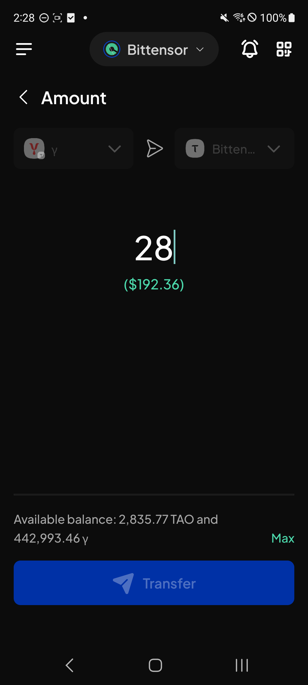

# Manual Test Report — EPIC-42 — 2026-09-11

| Field | Value |
|---|---|
| Epic | EPIC-42 — QA Coverage Tracking |
| Date | 2026-09-11 |
| Tester | MaiThuongNinni |
| Environment | Mobile — Android + iOS |
| Runner | manual (mobile) |
| Build under test | to fill in — build number + web-runner version |
| Stories tested | US-42.24.7, US-42.24.9, US-42.24.10, US-42.24.18 |
| Total bugs found | 1 |
| P0 | 0 |
| P1 | 1 |
| P2 | 0 |
| Status | in progress |

---

## US-42.24.7 — Web-runner 1.3.74 on Mobile

Part of [US-42.24](../../../../sprints/stories/US-42.24-qc-web-runner-1-3-86.md). Multisig account phase 1 ([#4855](https://github.com/Koniverse/SubWallet-Extension/issues/4855)).

Carried on from [2026-09-10](../2026-09-10/report-manual.md), where 18 AC passed and 3 failed. What is left is the multisig tab checks (AC-26 to AC-30) and the upgrade runs.

### AC results

| AC | Description | Result | Notes |
|---|---|---|---|
| AC-11 | Transfer on a single chain — a multisig with at least two signable signatories can transfer, and the signatory picker behaves as designed — Android + iOS fresh | ✅ Pass | |
| AC-12 | Transfer max — transfer all equals the transferable amount, and when the fee is paid in the native token the signatory paying it is shown — Android + iOS fresh | ✅ Pass | |
| AC-16 | Unstake, stake more, withdraw and change validator all follow the same logic — Android + iOS fresh | ✅ Pass | |
| AC-18 | Buy token is unaffected, and adding or removing a proxy follows the transfer logic — Android + iOS fresh | ✅ Pass | |
| AC-26 | A pending record appears on the multisig tab whatever kind the signatories are — normal, QR, ledger, proxy, multisig — Android + iOS fresh | ✅ Pass | |
| AC-27 | With a watch-only signatory, applying gives "The account you are using is Watch-only account, you cannot use this feature with it" — Android + iOS fresh | ✅ Pass | |
| AC-28 | Opening a pending transaction offers the right actions for who is looking: the initiator can reject, an in-between signatory can approve, the last signatory with call data can approve and execute — Android + iOS fresh | ✅ Pass | |
| AC-29 | A completed transaction offers view on explorer, and it opens that transaction on Subscan — Android + iOS fresh | ✅ Pass | |
| AC-30 | Reject, approve, and approve and execute each open their own confirmation screen — Android + iOS fresh | ✅ Pass | |
| AC-31 | AC-1 to AC-30 pass on Android + iOS upgrade | ❌ Fail | AC-13, AC-14 and AC-15 fail on upgrade too |
| AC-32 | After upgrading, multisig accounts, their pending transactions and their notifications are all still there and still correct — both platforms | ✅ Pass | |

### Bugs

| ID | Title | Steps to reproduce | Actual | Expected | Severity | Status | Screenshot |
|---|---|---|---|---|---|---|---|

## US-42.24.9 — Web-runner 1.3.76 on Mobile

Part of [US-42.24](../../../../sprints/stories/US-42.24-qc-web-runner-1-3-86.md). Carried on from [2026-09-09](../2026-09-09/report-manual.md), where the network toggle without an API key passed. Today covers the subnet token naming ([#4892](https://github.com/Koniverse/SubWallet-Extension/issues/4892)).

### AC results

| AC | Description | Result | Notes |
|---|---|---|---|
| AC-4 | Subnet tokens show as `{subnetId} \| {tokenName} {symbol}` in the token list — Android + iOS fresh | ✅ Pass | |
| AC-5 | The same format appears in token detail — Android + iOS fresh | ✅ Pass | AC-5 was split today: it had covered token detail and the transfer form in one line, and the transfer form has two cases of its own |
| AC-5a | A native TAO transfer works from the transfer form, with no validator field on it — Android + iOS fresh | ✅ Pass | |
| AC-5b | A subnet token shows its subnet ID and name on the transfer form, with its validator fields, and the transfer goes through — Android + iOS fresh | ❌ Fail | See BUG-42.24.9-01 |
| AC-6 | Searching by subnet ID finds the token — Android + iOS fresh | ✅ Pass | |
| AC-7 | AC-4 to AC-6 pass on Android + iOS upgrade | ✅ Pass | |
| AC-8 to AC-14 | The Bittensor root staking group ([#4829](https://github.com/Koniverse/SubWallet-Extension/issues/4829)) | ⏭️ Skipped | The root claim type was removed again in 1.3.86 ([#5045](https://github.com/Koniverse/SubWallet-Extension/issues/5045)), so there is nothing left in the build to test |

The story closes at 8 of 16, one failure and the root staking group skipped.

### Bugs

| ID | Title | Steps to reproduce | Actual | Expected | Severity | Status | Screenshot |
|---|---|---|---|---|---|---|---|
| BUG-42.24.9-01 | A subnet token cannot be transferred — the form has no validator fields and no subnet name | Switch to Bittensor → Send → pick a subnet token → look at the Amount screen | The token shows only its bare symbol, not `{subnetId} \| {tokenName}`, and the form has no Select validator fields at all. Without them the transfer cannot be completed. The Extension shows "SN3 \| Te…" with a Select validator field on each side | The form matches the Extension — the subnet name on the token, a validator field for each side, and the transfer goes through | P1 | todo |  |

## US-42.24.18 — Web-runner 1.3.86 on Mobile

Part of [US-42.24](../../../../sprints/stories/US-42.24-qc-web-runner-1-3-86.md). Started and closed today: the Bittensor root claim type removal ([#5045](https://github.com/Koniverse/SubWallet-Extension/issues/5045)).

### AC results

| AC | Description | Result | Notes |
|---|---|---|---|
| AC-1 | The removed root claim option no longer appears on the Bittensor earning screens — Android + iOS fresh | ✅ Pass | |
| AC-2 | Bittensor earning still works — the position shows, and stake and unstake go through — Android + iOS fresh | ✅ Pass | |
| AC-3 | Nothing calls the deprecated function — no error, no stuck loading, no empty screen where the option used to be — Android + iOS fresh | ✅ Pass | |
| AC-4 | Subnet staking on Bittensor is unaffected — Android + iOS fresh | ✅ Pass | |
| AC-5 | AC-1 to AC-4 pass on Android + iOS upgrade | ✅ Pass | |
| AC-6 | After upgrading, an account that had used the old root claim opens without error and its position is correct — both platforms | ✅ Pass | |

6 of 6, no bugs. This removal is also why the root staking group in US-42.24.9 is skipped.

### Bugs

None.

## US-42.24.10 — Web-runner 1.3.77 on Mobile

Part of [US-42.24](../../../../sprints/stories/US-42.24-qc-web-runner-1-3-86.md). Carried on from [2026-09-10](../2026-09-10/report-manual.md), where the stDOT sunset passed. Today covers the proxy account improvements ([#4942](https://github.com/Koniverse/SubWallet-Extension/issues/4942)).

### AC results

| AC | Description | Result | Notes |
|---|---|---|---|
| AC-1 | Wording on the stake and unstake screens is right when acting through a proxy account — Android + iOS fresh | ✅ Pass | |
| AC-2 | Transfer max from a proxy account leaves the right amount and the transaction goes through — Android + iOS fresh | ✅ Pass | |
| AC-3 | The removed EVM network types no longer appear in the list of networks supporting proxy accounts — Android + iOS fresh | ✅ Pass | |
| AC-4 | AC-1 to AC-3 pass on Android + iOS upgrade | ✅ Pass | |

What is left in this story is the multisig improvements, the PAH-KAH popup and chain-list v0.2.126.

### Bugs

None.

## Summary

Session in progress.
