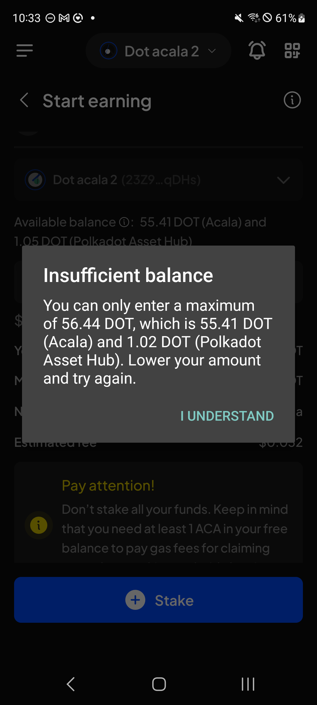

# Manual Test Report — EPIC-42 — 2026-09-14

| Field | Value |
|---|---|
| Epic | EPIC-42 — QA Coverage Tracking |
| Date | 2026-09-14 |
| Tester | MaiThuongNinni |
| Environment | Mobile — Android + iOS |
| Runner | manual (mobile) |
| Build under test | to fill in — build number + web-runner version |
| Stories tested | US-42.24.11 |
| Total bugs found | 1 |
| P0 | 0 |
| P1 | 0 |
| P2 | 1 |
| Status | in progress |

---

## US-42.24.11 — Web-runner 1.3.78 on Mobile

Part of [US-42.24](../../../../sprints/stories/US-42.24-qc-web-runner-1-3-86.md). Started today, out of the backlog. The XCM destination fee ([#4278](https://github.com/Koniverse/SubWallet-Extension/issues/4278)) ran first.

Its AC were rewritten today from the transfer QC checklist, taking that half from 3 AC to 10. The issue body is a single line — handle the destination fee from /xcm-fee and recheck every path that padded the amount to cover it — while the checklist covers single-chain transfers on five ecosystems, every bridge type, the confirmation screen and the figures behind it.

### AC results

| AC | Description | Result | Notes |
|---|---|---|---|
| AC-1 | The destination fee shows on the XCM confirmation screen before sending — Android + iOS fresh | ✅ Pass | |
| AC-1a | A single-chain transfer still works on each ecosystem — EVM, Bitcoin, Cardano, TON and Substrate — with both a normal amount and transfer max — Android + iOS fresh | ✅ Pass | |
| AC-1b | On EVM and Substrate the fee can be paid with the default fee, a custom fee, or a chosen token, and the network fee row shows amount above and value below — Android + iOS fresh | ✅ Pass | |
| AC-1c | A cross-chain transfer works on each bridge type and shows both the network fee and the cross-chain fee — XCM, SnowBridge both ways, Across, AvailBridge both ways, Polygon Bridge, PoS Bridge — Android + iOS fresh | ✅ Pass | |
| AC-1d | The transfer confirmation screen shows what the design calls for — sender and recipient, amount, fee rows, Cancel and Approve — Android + iOS fresh | ✅ Pass | |
| AC-2 | The amount that arrives matches what was quoted, once the destination fee is taken into account — Android + iOS fresh | ✅ Pass | |
| AC-2a | The figures on the confirmation screen add up — amount, network fee, cross-chain fee — Android + iOS fresh | ✅ Pass | |
| AC-2b | After a transfer goes through, the recipient and sender balances both moved by the right amounts — Android + iOS fresh | ✅ Pass | |
| AC-2c | History shows the same figures as the confirmation screen did — Android + iOS fresh | ✅ Pass | |
| AC-3 | AC-1 to AC-2c pass on Android + iOS upgrade | ✅ Pass | |

What is left in this story is the liquid staking bridge fee, disable all networks, Alpha transfer, the TAO bridge, the Bittensor swap and chain-list v0.2.127.

### Bugs

| ID | Title | Steps to reproduce | Actual | Expected | Severity | Status | Screenshot |
|---|---|---|---|---|---|---|---|
| BUG-42.24.11-01 | The Insufficient balance popup on Start earning uses the system dialog, not the app's own | Open Start earning on a liquid staking option → enter more than the available balance → tap Stake | A plain grey Android system dialog appears, with a bare "I UNDERSTAND" text link in the corner. The Extension shows its own sheet: dark panel, a red error icon, the message centred, and a full-width blue "I understand" button | The popup matches the Extension — the app's own sheet with the error icon and the proper button, not the system dialog | P2 | todo |  |

## Summary

Session in progress.
