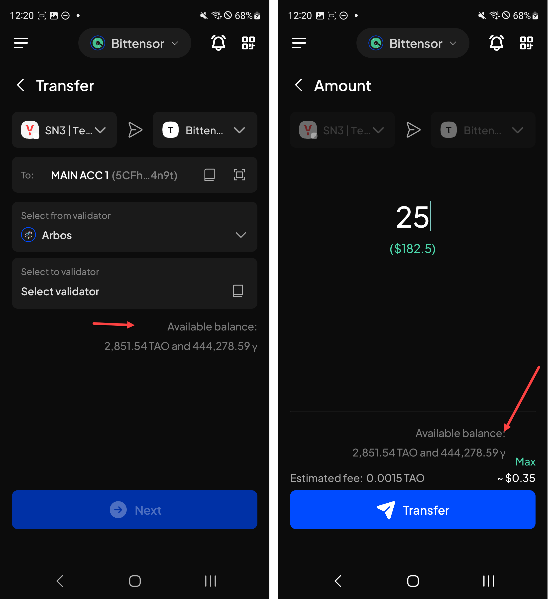
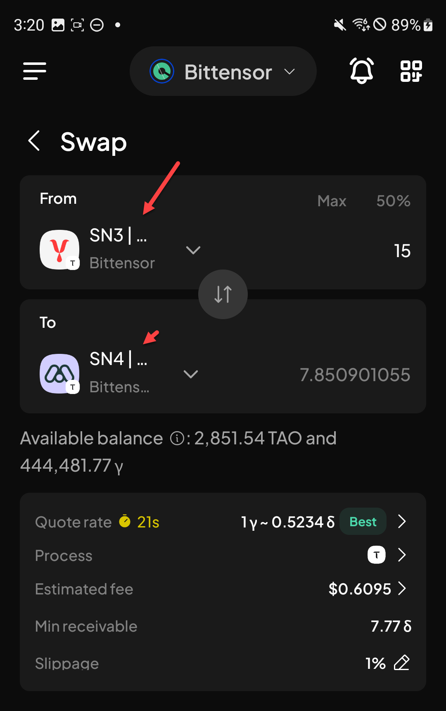
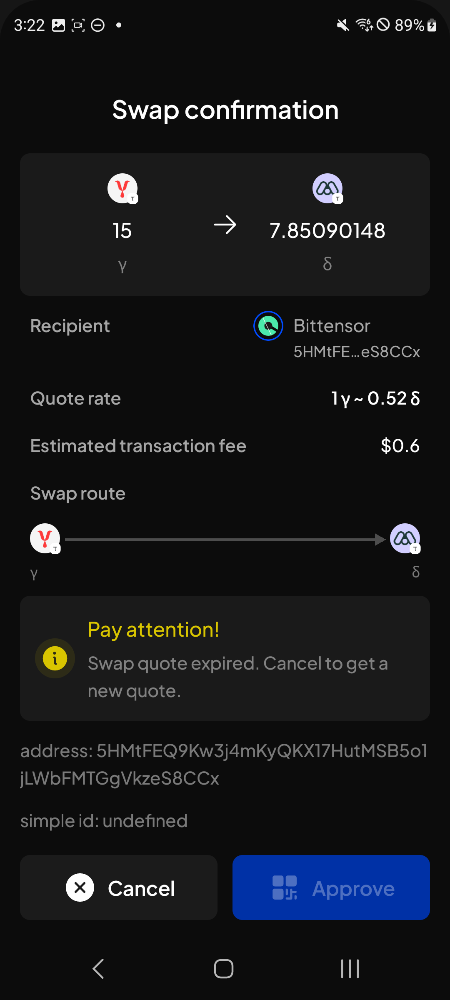
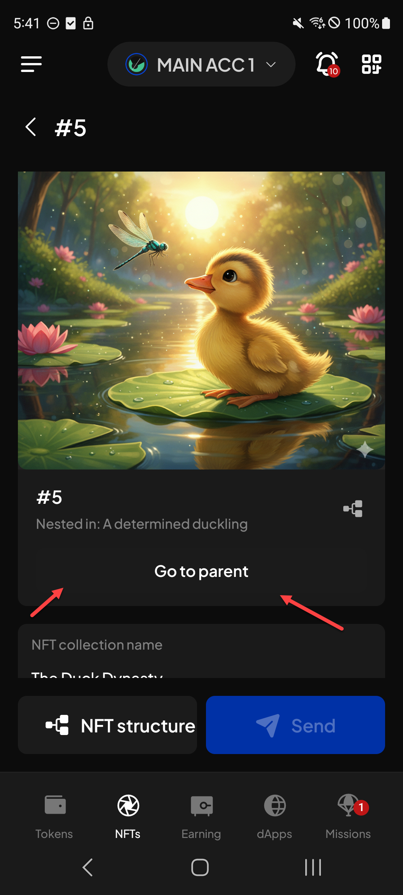
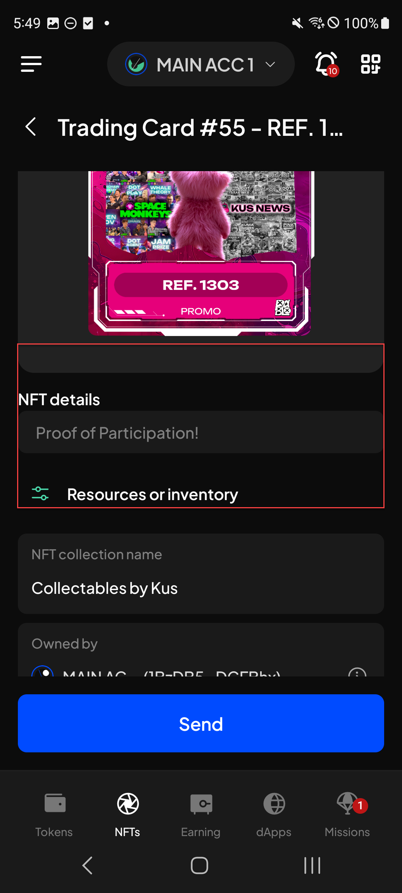
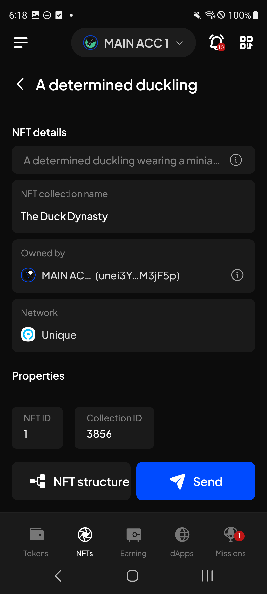

# Manual Test Report — EPIC-42 — 2026-09-14

| Field | Value |
|---|---|
| Epic | EPIC-42 — QA Coverage Tracking |
| Date | 2026-09-14 |
| Tester | MaiThuongNinni |
| Environment | Mobile — Android + iOS |
| Runner | manual (mobile) |
| Build under test | to fill in — build number + web-runner version |
| Stories tested | US-42.24.11, US-42.24.12 — both closed; US-42.24.13 started |
| Total bugs found | 8 |
| P0 | 0 |
| P1 | 0 |
| P2 | 2 |
| P3 | 6 |
| Status | done |

---

## US-42.24.11 — Web-runner 1.3.78 on Mobile

Part of [US-42.24](../../../../sprints/stories/US-42.24-qc-web-runner-1-3-90.md). Started today, out of the backlog. The XCM destination fee ([#4278](https://github.com/Koniverse/SubWallet-Extension/issues/4278)) ran first.

Its AC were rewritten today from the transfer QC checklist, taking that half from 3 AC to 10. The issue body is a single line — handle the destination fee from /xcm-fee and recheck every path that padded the amount to cover it — while the checklist covers single-chain transfers on five ecosystems, every bridge type, the confirmation screen and the figures behind it.

### AC results

| AC | Description | Result | Notes |
|---|---|---|---|
| AC-1 | The destination fee shows on the XCM confirmation screen before sending — Android + iOS fresh | ✅ Pass | |
| AC-1a | A single-chain transfer still works on each ecosystem — EVM, Bitcoin, Cardano, TON and Substrate — with both a normal amount and transfer max — Android + iOS fresh | ✅ Pass | |
| AC-1b | On EVM and Substrate the fee can be paid with the default fee, a custom fee, or a chosen token, and the network fee row shows amount above and value below — Android + iOS fresh | ✅ Pass | |
| AC-1c | A cross-chain transfer works on each bridge type and shows both the network fee and the cross-chain fee — XCM, SnowBridge both ways, Across, AvailBridge both ways, Polygon Bridge, PoS Bridge — Android + iOS fresh | ✅ Pass | |
| AC-1d | The transfer confirmation screen shows what the design calls for — sender and recipient, amount, fee rows, Cancel and Approve — Android + iOS fresh | ✅ Pass | |
| AC-2 | The amount that arrives matches what was quoted, once the destination fee is taken into account — Android + iOS fresh | ✅ Pass | |
| AC-2a | The figures on the confirmation screen add up — amount, network fee, cross-chain fee — Android + iOS fresh | ✅ Pass | |
| AC-2b | After a transfer goes through, the recipient and sender balances both moved by the right amounts — Android + iOS fresh | ✅ Pass | |
| AC-2c | History shows the same figures as the confirmation screen did — Android + iOS fresh | ✅ Pass | |
| AC-3 | AC-1 to AC-2c pass on Android + iOS upgrade | ✅ Pass | |
| AC-4 | The estimated fee on Start earning is the mint fee alone with no XCM, and mint fee plus XCM fee when DOT has to come from Polkadot Asset Hub — Android + iOS fresh | ✅ Pass | |
| AC-4a | Available balance on Start earning shows what can really be staked, allowing for the hop and the estimated fee — Android + iOS fresh | ✅ Pass | |
| AC-4b | The figures on the confirmation screen add up on both paths — the transfer step carries the amount plus the destination fee, the mint step carries the amount typed — Android + iOS fresh | ✅ Pass | |
| AC-5 | An amount at or above the minimum transferable amount is accepted, not wrongly rejected — Android + iOS fresh | ✅ Pass | |
| AC-5a | The Stake button is disabled with nothing entered, and letters, symbols and negative numbers cannot be typed — Android + iOS fresh | ✅ Pass | |
| AC-5b | An amount within the balance opens the right confirmation — stake with no hop, transfer when a hop is needed — Android + iOS fresh | ✅ Pass | |
| AC-5c | An amount above what is available opens the Insufficient balance popup, naming the maximum and where the balance sits — Android + iOS fresh | ✅ Pass | The popup itself is styled wrongly, see BUG-42.24.11-01; its content is right |
| AC-5d | When the dry run fails, the message asks for a higher amount and names the minimum — Android + iOS fresh | ✅ Pass | |
| AC-5e | The same checks hold for a QR account, signing each confirmation step in turn — Android + iOS fresh | ✅ Pass | |
| AC-5f | Acala liquid staking behaves the same way as Bifrost — Android + iOS fresh | ✅ Pass | |
| AC-6 | AC-4 to AC-5f pass on Android + iOS upgrade | ✅ Pass | |
| AC-7 | A "Disable all networks" switch sits on the Manage Networks screen, and turning it on switches every network off in one action — Android + iOS fresh | ✅ Pass | |
| AC-8 | The switch only works one way — turning it off again restores nothing, and each network has to be switched back on by hand — Android + iOS fresh | ✅ Pass | |
| AC-9 | AC-7 and AC-8 pass on Android + iOS upgrade | ✅ Pass | |
| AC-10 | An alpha token can be sent, with the right fee, and it arrives — Android + iOS fresh | ✅ Pass | |
| AC-11 | The transfer screen shows the alpha token with its subnet, matching the format from 1.3.76 — Android + iOS fresh | ✅ Pass | |
| AC-12 | AC-10 and AC-11 pass on Android + iOS upgrade | ✅ Pass | |
| AC-12a | The alpha tokens that have an xAlpha counterpart appear on Subtensor EVM with the right symbol, decimals and balance — Android + iOS fresh | ✅ Pass | [ChainList #670](https://github.com/Koniverse/SubWallet-ChainList/issues/670) |
| AC-12b | Those alpha tokens can be sent on the EVM side — Android + iOS fresh | ✅ Pass | |
| AC-13 | Native TAO moves from the substrate side to the EVM side, and the balance appears on the other end — Android + iOS fresh | ✅ Pass | |
| AC-14 | The same works in the other direction — Android + iOS fresh | ✅ Pass | |
| AC-15 | The fee is shown before confirming and matches what is taken — Android + iOS fresh | ✅ Pass | |
| AC-16 | AC-13 to AC-15 pass on Android + iOS upgrade | ✅ Pass | |
| AC-17 | Swapping native TAO for an alpha token works, and the rate shown matches what is received — Android + iOS fresh | ✅ Pass | The screen has display defects, see BUG-42.24.11-04 and BUG-42.24.11-05; the swap itself goes through |
| AC-18 | Swapping one alpha token for another works — Android + iOS fresh | ✅ Pass | |
| AC-19 | Swaps appear correctly in transaction history — Android + iOS fresh | ✅ Pass | |
| AC-20 | AC-17 to AC-19 pass on Android + iOS upgrade | ✅ Pass | |
| AC-21 | Every chain and token added or changed in chain-list v0.2.127 appears correctly — all four combinations | ✅ Pass | |
| AC-22 | After upgrading, Bittensor balances, alpha holdings and network settings are all carried over correctly — both platforms | ✅ Pass | |

The liquid staking AC were rewritten today from the QC checklist as well, from 3 AC to 11. The case that matters is staking DOT on Bifrost when the DOT sits on Polkadot Asset Hub: the app bridges it across first, so the available balance, the estimated fee and the amounts on each confirmation step all have to allow for the XCM hop.

The Bittensor swap and chain-list v0.2.127 were checked last and pass, which closes the story.

### Bugs

| ID | Title | Steps to reproduce | Actual | Expected | Severity | Status | Screenshot |
|---|---|---|---|---|---|---|---|
| BUG-42.24.11-01 | The Insufficient balance popup on Start earning uses the system dialog, not the app's own | Open Start earning on a liquid staking option → enter more than the available balance → tap Stake | A plain grey Android system dialog appears, with a bare "I UNDERSTAND" text link in the corner. The Extension shows its own sheet: dark panel, a red error icon, the message centred, and a full-width blue "I understand" button | The popup matches the Extension — the app's own sheet with the error icon and the proper button, not the system dialog | P2 | todo |  |
| BUG-42.24.11-02 | Manage networks does not match the Extension after turning all networks off | Settings → Manage networks → turn on "Turn off all networks" → compare the screen with the same one on the Extension | Two differences. Each network logo carries a wifi badge, grey on some and orange on others, which the Extension does not show at all. And the Turn off all networks toggle is teal where the Extension's is green | The screen matches the Extension — no wifi badge on the logos, and the toggle in the same green | P3 | todo |  |
| BUG-42.24.11-03 | The alpha transfer Amount screen misaligns Available balance and drops the fungible token notice | Switch to Bittensor → Send → pick an alpha token → look at the Amount screen and compare with the Extension | Available balance wraps onto a second line and no longer lines up with Max beside it, and Estimated fee sits under it out of line. The notice "You are performing a transfer of a fungible token", which the Extension shows above the token fields, is missing | Available balance lines up with Max, and the fungible token notice is shown as the Extension shows it | P3 | todo |  |
| BUG-42.24.11-04 | The swap screen cuts the alpha token names short on both the From and To rows | Switch to Bittensor → Swap → pick an alpha token to swap from and another to swap to → look at the two token rows and compare with the Extension | Both names are cut right after the subnet number — "SN3 \| ..." and "SN4 \| ..." — so the token name itself never shows, and on the To row the network line under it is cut to "Bittens..." as well. There is empty space to the right of each name before the dropdown arrow | The full name is shown the way the Extension shows it, with the subnet number and the token name together, and the network line under it not cut off | P3 | todo |  |
| BUG-42.24.11-05 | The swap confirmation screen shows a raw address line and "simple id: undefined" | Switch to Bittensor → Swap → enter an amount → tap Swap → look at the confirmation screen under the warning box | Two debug lines sit under the Pay attention box: the full recipient address spelled out over two lines, and "simple id: undefined". The address is already shown shortened on the Recipient row above | Neither line is shown — the screen ends at the warning box, with the Recipient row carrying the address as it already does | P2 | todo |  |

## US-42.24.12 — Web-runner 1.3.79 on Mobile

Started at the end of the session, straight after 1.3.78 closed. All four items were run: the alpha price ([#4987](https://github.com/Koniverse/SubWallet-Extension/issues/4987)), which now comes from currentAlphaPriceAll instead of taoIn divided by alphaIn and matches TaoStats; the ParaSpell move to API v1 ([#4979](https://github.com/Koniverse/SubWallet-Extension/issues/4979)); the display fixes after the merge ([#4988](https://github.com/Koniverse/SubWallet-Extension/issues/4988)); and the swap service refactor ([#4826](https://github.com/Koniverse/SubWallet-Extension/issues/4826)).

### AC results

| AC | Description | Result | Notes |
|---|---|---|---|
| AC-1 | The alpha price shown matches TaoStats for the same subnet at the same moment — Android + iOS fresh | ✅ Pass | |
| AC-2 | Balances valued in alpha are right, and earning on a Bittensor subnet works rather than failing on a bad price — Android + iOS fresh | ✅ Pass | |
| AC-3 | AC-1 and AC-2 pass on Android + iOS upgrade | ✅ Pass | |
| AC-4 | XCM transfers still work on the main routes after the API change — Android + iOS fresh | ✅ Pass | [#4979](https://github.com/Koniverse/SubWallet-Extension/issues/4979) |
| AC-5 | The fee quoted before sending matches what is taken — Android + iOS fresh | ✅ Pass | |
| AC-6 | No route that worked before has disappeared — Android + iOS fresh | ✅ Pass | |
| AC-7 | AC-4 to AC-6 pass on Android + iOS upgrade | ✅ Pass | |
| AC-8 | On the transfer confirmation screen, the fee value has the right colour and size, matching the design — Android + iOS fresh | ✅ Pass | [#4988](https://github.com/Koniverse/SubWallet-Extension/issues/4988) |
| AC-9 | The amount and the fee are lined up correctly — Android + iOS fresh | ✅ Pass | |
| AC-10 | The transfer amount input shows the right value — Android + iOS fresh | ✅ Pass | |
| AC-11 | The token approve screen shows the network fee — Android + iOS fresh | ✅ Pass | |
| AC-12 | AC-8 to AC-11 pass on Android + iOS upgrade | ✅ Pass | |
| AC-13 | Swap still works on the main routes, with the right rate and fee — Android + iOS fresh | ✅ Pass | [#4826](https://github.com/Koniverse/SubWallet-Extension/issues/4826) |
| AC-14 | AC-13 passes on Android + iOS upgrade | ✅ Pass | |
| AC-15 | After upgrading, swap history and Bittensor balances are still correct — both platforms | ✅ Pass | |

The ParaSpell move to API v1 changes the base URL and the request format, so the XCM routes were run again rather than taken on trust — they work, the quoted fee matches what is taken, and no route was lost. The swap service refactor has nothing visible in it, so it is checked by whether swap still works, and it does. The four display problems that came out of the 1.3.78 merge are all fixed, checked against the Figma link in the issue.

The upgrade carry-over passes as well, which closes the story with all 15 AC passing and no bug found.

### Bugs

None found.

## US-42.24.13 — Web-runner 1.3.80 on Mobile

Opened at the end of the session. Three of the four items were run: transfer max when the balance sits exactly at the existential deposit ([#2641](https://github.com/Koniverse/SubWallet-Extension/issues/2641)); the network address on the XCM confirmation screen ([#3936](https://github.com/Koniverse/SubWallet-Extension/issues/3936)); and token approve on XCM ([#4830](https://github.com/Koniverse/SubWallet-Extension/issues/4830)).

The AC had one case for the swap flow, so a second was added for the plain XCM transfer, which took this half from 3 AC to 4 and the story from 15 AC to 16.

### AC results

| AC | Description | Result | Notes |
|---|---|---|---|
| AC-1 | With a balance exactly equal to the existential deposit, transfer max goes through instead of failing — Android + iOS fresh | ✅ Pass | [#2641](https://github.com/Koniverse/SubWallet-Extension/issues/2641) |
| AC-2 | The amount and fee shown before confirming are right for that case — Android + iOS fresh | ✅ Pass | |
| AC-3 | AC-1 and AC-2 pass on Android + iOS upgrade | ✅ Pass | |
| AC-4 | During a swap that needs XCM, the confirmation screen shows the right network's address — Android + iOS fresh | ✅ Pass | |
| AC-4a | The same during a plain XCM transfer — Android + iOS fresh | ✅ Pass | |
| AC-5 | The same during liquid staking — Android + iOS fresh | ✅ Pass | |
| AC-6 | AC-4 to AC-5 pass on Android + iOS upgrade | ✅ Pass | |
| AC-7 | With a token already approved, the XCM flow goes straight to the transfer confirmation, skipping the approve screen — Android + iOS fresh | ✅ Pass | [#4830](https://github.com/Koniverse/SubWallet-Extension/issues/4830) |
| AC-8 | With a token not yet approved, the approve screen still appears as it should — Android + iOS fresh | ✅ Pass | |
| AC-9 | AC-7 and AC-8 pass on Android + iOS upgrade | ✅ Pass | |

All three flows that reach the XCM confirmation screen name the right network, so that half is finished. Token approve behaves both ways: skipped when the token is already approved, still shown when it is not.

| AC-11 | Unique Network NFTs are found and shown correctly, including nested ones — Android + iOS fresh | ✅ Pass | Three display defects, BUG-42.24.13-01 to BUG-42.24.13-03; the NFTs themselves are found and shown right |

A nested NFT shows what it is nested in and can walk up to its parent, so the nesting works. What is wrong is the styling around it — the Go to parent button has no button background, and the NFT details section carries an empty panel and a row the Extension does not have.

Left for the next session: the rest of NFTService phase 1 and the upgrade carry-over.

### Bugs

| ID | Title | Steps to reproduce | Actual | Expected | Severity | Status | Screenshot |
|---|---|---|---|---|---|---|---|
| BUG-42.24.13-01 | The Go to parent button on a nested NFT has no button styling | NFTs → open a nested NFT, one that shows "Nested in" under its name → look at the Go to parent button and compare with the same screen on the Extension | The button has the same background as the panel behind it, so it reads as a line of centred text rather than something to tap. The Extension gives it its own lighter panel, which sets it apart from the detail card | Go to parent is shown as a button the way the Extension shows it, with its own background against the card | P3 | todo |  |
| BUG-42.24.13-02 | The NFT details section carries an empty panel and a Resources or inventory row the Extension does not have | NFTs → open an NFT that has a description → look at the NFT details section and compare with the same screen on the Extension | Two extra things sit in the section. An empty panel sits above the NFT details heading, and a "Resources or inventory" row with an icon sits below the description. The Extension shows only the description, labelled Description underneath it | The section matches the Extension — the description with its Description label, no empty panel above and no Resources or inventory row below | P3 | todo |  |
| BUG-42.24.13-03 | The NFT detail screen lays its fields out differently from the Extension | NFTs → open any NFT → compare the NFT details section with the same screen on the Extension | Each field sits in its own separate card — description, collection name, owned by, network — with no field label beside it, and the description has no Description label at all. NFT ID and Collection ID are pulled out into a "Properties" heading of their own below. The Extension puts all six in one panel as labelled rows, Description included | The fields are laid out the way the Extension lays them out — one panel, each row labelled, with NFT ID and Collection ID among them rather than under a separate Properties heading | P3 | todo |  |

## Summary

US-42.24.11 ran in full today and is closed, and US-42.24.12 was opened at the end of the session and closed in the same session — all 15 AC pass across its four items, with no bug found. All 39 AC pass on Android and iOS, fresh install and upgrade. The two halves that were rewritten from the QC checklists this morning — the XCM destination fee from 3 AC to 10, liquid staking from 3 AC to 11 — both pass, as do the disable-all-networks switch, alpha token transfer, the alpha tokens on Subtensor EVM, the TAO bridge in both directions, the Bittensor on-chain swap and chain-list v0.2.127.

Eight bugs were found, all display defects. None blocks the feature it sits on: every transfer, stake and swap completed and the figures were right. Two are P2 — the Insufficient balance popup falling back to the Android system dialog, and two debug lines left on the swap confirmation screen. The other three are alignment and styling gaps against the Extension. US-42.24.13 was opened last, with the XCM confirmation address passing on all three flows that reach that screen — swap, plain transfer and liquid staking. All eight bugs are in US-42.24.20 waiting for a fixed build.
