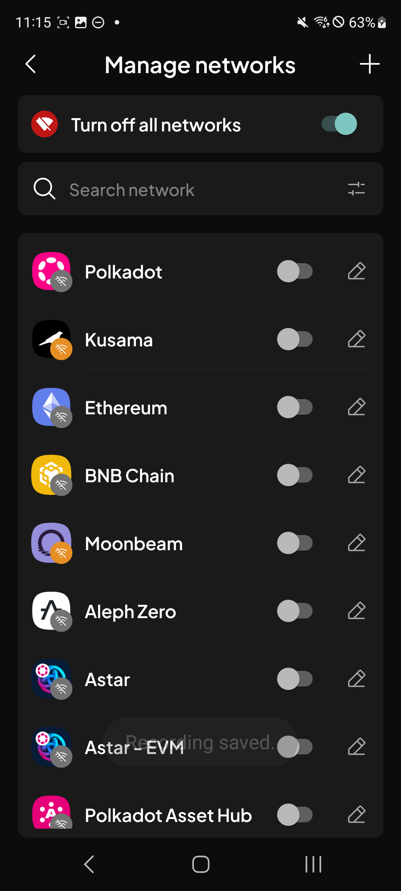

# Manual Test Report — EPIC-42 — 2026-09-14

| Field | Value |
|---|---|
| Epic | EPIC-42 — QA Coverage Tracking |
| Date | 2026-09-14 |
| Tester | MaiThuongNinni |
| Environment | Mobile — Android + iOS |
| Runner | manual (mobile) |
| Build under test | to fill in — build number + web-runner version |
| Stories tested | US-42.24.11 |
| Total bugs found | 2 |
| P0 | 0 |
| P1 | 0 |
| P2 | 1 |
| P3 | 1 |
| Status | in progress |

---

## US-42.24.11 — Web-runner 1.3.78 on Mobile

Part of [US-42.24](../../../../sprints/stories/US-42.24-qc-web-runner-1-3-86.md). Started today, out of the backlog. The XCM destination fee ([#4278](https://github.com/Koniverse/SubWallet-Extension/issues/4278)) ran first.

Its AC were rewritten today from the transfer QC checklist, taking that half from 3 AC to 10. The issue body is a single line — handle the destination fee from /xcm-fee and recheck every path that padded the amount to cover it — while the checklist covers single-chain transfers on five ecosystems, every bridge type, the confirmation screen and the figures behind it.

### AC results

| AC | Description | Result | Notes |
|---|---|---|---|
| AC-1 | The destination fee shows on the XCM confirmation screen before sending — Android + iOS fresh | ✅ Pass | |
| AC-1a | A single-chain transfer still works on each ecosystem — EVM, Bitcoin, Cardano, TON and Substrate — with both a normal amount and transfer max — Android + iOS fresh | ✅ Pass | |
| AC-1b | On EVM and Substrate the fee can be paid with the default fee, a custom fee, or a chosen token, and the network fee row shows amount above and value below — Android + iOS fresh | ✅ Pass | |
| AC-1c | A cross-chain transfer works on each bridge type and shows both the network fee and the cross-chain fee — XCM, SnowBridge both ways, Across, AvailBridge both ways, Polygon Bridge, PoS Bridge — Android + iOS fresh | ✅ Pass | |
| AC-1d | The transfer confirmation screen shows what the design calls for — sender and recipient, amount, fee rows, Cancel and Approve — Android + iOS fresh | ✅ Pass | |
| AC-2 | The amount that arrives matches what was quoted, once the destination fee is taken into account — Android + iOS fresh | ✅ Pass | |
| AC-2a | The figures on the confirmation screen add up — amount, network fee, cross-chain fee — Android + iOS fresh | ✅ Pass | |
| AC-2b | After a transfer goes through, the recipient and sender balances both moved by the right amounts — Android + iOS fresh | ✅ Pass | |
| AC-2c | History shows the same figures as the confirmation screen did — Android + iOS fresh | ✅ Pass | |
| AC-3 | AC-1 to AC-2c pass on Android + iOS upgrade | ✅ Pass | |
| AC-4 | The estimated fee on Start earning is the mint fee alone with no XCM, and mint fee plus XCM fee when DOT has to come from Polkadot Asset Hub — Android + iOS fresh | ✅ Pass | |
| AC-4a | Available balance on Start earning shows what can really be staked, allowing for the hop and the estimated fee — Android + iOS fresh | ✅ Pass | |
| AC-4b | The figures on the confirmation screen add up on both paths — the transfer step carries the amount plus the destination fee, the mint step carries the amount typed — Android + iOS fresh | ✅ Pass | |
| AC-5 | An amount at or above the minimum transferable amount is accepted, not wrongly rejected — Android + iOS fresh | ✅ Pass | |
| AC-5a | The Stake button is disabled with nothing entered, and letters, symbols and negative numbers cannot be typed — Android + iOS fresh | ✅ Pass | |
| AC-5b | An amount within the balance opens the right confirmation — stake with no hop, transfer when a hop is needed — Android + iOS fresh | ✅ Pass | |
| AC-5c | An amount above what is available opens the Insufficient balance popup, naming the maximum and where the balance sits — Android + iOS fresh | ✅ Pass | The popup itself is styled wrongly, see BUG-42.24.11-01; its content is right |
| AC-5d | When the dry run fails, the message asks for a higher amount and names the minimum — Android + iOS fresh | ✅ Pass | |
| AC-5e | The same checks hold for a QR account, signing each confirmation step in turn — Android + iOS fresh | ✅ Pass | |
| AC-5f | Acala liquid staking behaves the same way as Bifrost — Android + iOS fresh | ✅ Pass | |
| AC-6 | AC-4 to AC-5f pass on Android + iOS upgrade | ✅ Pass | |
| AC-7 | A "Disable all networks" switch sits on the Manage Networks screen, and turning it on switches every network off in one action — Android + iOS fresh | ✅ Pass | |
| AC-8 | The switch only works one way — turning it off again restores nothing, and each network has to be switched back on by hand — Android + iOS fresh | ✅ Pass | |
| AC-9 | AC-7 and AC-8 pass on Android + iOS upgrade | ✅ Pass | |
| AC-10 | An alpha token can be sent, with the right fee, and it arrives — Android + iOS fresh | ✅ Pass | |
| AC-11 | The transfer screen shows the alpha token with its subnet, matching the format from 1.3.76 — Android + iOS fresh | ✅ Pass | |
| AC-12 | AC-10 and AC-11 pass on Android + iOS upgrade | ✅ Pass | |
| AC-12a | The alpha tokens that have an xAlpha counterpart appear on Subtensor EVM with the right symbol, decimals and balance — Android + iOS fresh | ✅ Pass | [ChainList #670](https://github.com/Koniverse/SubWallet-ChainList/issues/670) |
| AC-12b | Those alpha tokens can be sent on the EVM side — Android + iOS fresh | ✅ Pass | |

The liquid staking AC were rewritten today from the QC checklist as well, from 3 AC to 11. The case that matters is staking DOT on Bifrost when the DOT sits on Polkadot Asset Hub: the app bridges it across first, so the available balance, the estimated fee and the amounts on each confirmation step all have to allow for the XCM hop.

What is left in this story is the TAO bridge, the Bittensor swap and chain-list v0.2.127.

### Bugs

| ID | Title | Steps to reproduce | Actual | Expected | Severity | Status | Screenshot |
|---|---|---|---|---|---|---|---|
| BUG-42.24.11-01 | The Insufficient balance popup on Start earning uses the system dialog, not the app's own | Open Start earning on a liquid staking option → enter more than the available balance → tap Stake | A plain grey Android system dialog appears, with a bare "I UNDERSTAND" text link in the corner. The Extension shows its own sheet: dark panel, a red error icon, the message centred, and a full-width blue "I understand" button | The popup matches the Extension — the app's own sheet with the error icon and the proper button, not the system dialog | P2 | todo |  |
| BUG-42.24.11-02 | Manage networks does not match the Extension after turning all networks off | Settings → Manage networks → turn on "Turn off all networks" → compare the screen with the same one on the Extension | Two differences. Each network logo carries a wifi badge, grey on some and orange on others, which the Extension does not show at all. And the Turn off all networks toggle is teal where the Extension's is green | The screen matches the Extension — no wifi badge on the logos, and the toggle in the same green | P3 | todo |  |

## Summary

Session in progress.
