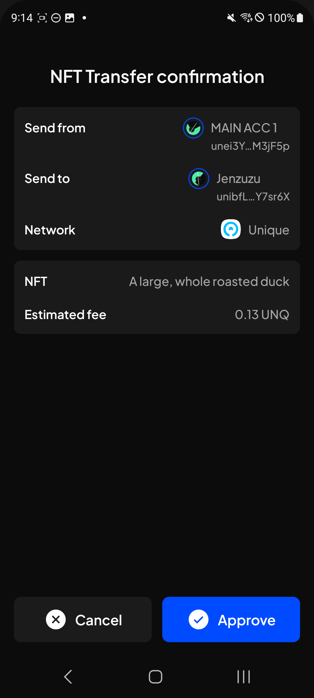
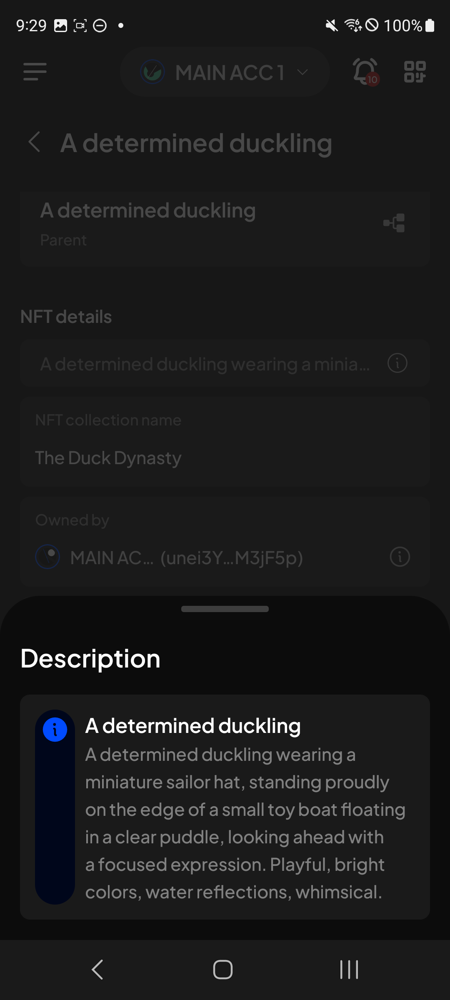
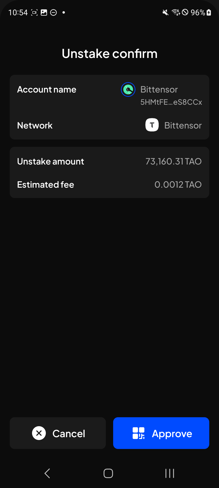

# Manual Test Report — EPIC-42 — 2026-09-15

| Field | Value |
|---|---|
| Epic | EPIC-42 — QA Coverage Tracking |
| Date | 2026-09-15 |
| Tester | MaiThuongNinni |
| Environment | Mobile — Android + iOS |
| Runner | manual (mobile) |
| Build under test | to fill in — build number + web-runner version |
| Stories tested | US-42.24.13, US-42.24.16 — both closed; US-42.24.17 — closed without being run; US-42.24.19, US-42.24.20 |
| Total bugs found | 5 |
| P0 | 0 |
| P1 | 0 |
| P2 | 3 |
| P3 | 2 |
| Status | done |

---

## US-42.24.13 — Web-runner 1.3.80 on Mobile

Carried over from [2026-09-14](../2026-09-14/report-manual.md), where 11 of its 16 AC were settled. Transfer max at the existential deposit, the network address on the XCM confirmation screen and token approve all passed yesterday, along with the Unique Network NFTs, which pass with three display defects noted against them.

The rest of NFTService phase 1 ([#4884](https://github.com/Koniverse/SubWallet-Extension/issues/4884)) ran today — EVM NFTs, sending an NFT, importing one by contract address — along with the two upgrade AC, which closes the story.

### AC results

| AC | Description | Result | Notes |
|---|---|---|---|
| AC-10 | EVM NFTs are found and shown with the right image, name and collection — Android + iOS fresh | ✅ Pass | |
| AC-12 | An NFT can be sent, and it arrives — Android + iOS fresh | ✅ Pass | The confirmation screen is laid out differently, see BUG-42.24.13-04; the transfer itself goes through |
| AC-13 | Importing an NFT by contract address still works — Android + iOS fresh | ✅ Pass | |
| AC-14 | AC-10 to AC-13 pass on Android + iOS upgrade | ✅ Pass | |
| AC-15 | After upgrading, NFTs that were visible before the upgrade are still visible — the move to NFTService did not lose any — both platforms | ✅ Pass | |

AC-11 was settled yesterday. With these four the story is finished at 16 of 16.

### Bugs

| ID | Title | Steps to reproduce | Actual | Expected | Severity | Status | Screenshot |
|---|---|---|---|---|---|---|---|
| BUG-42.24.13-04 | The NFT transfer confirmation screen does not match the Extension | NFTs → open an NFT → Send → fill in a recipient → tap Send, then compare the confirmation screen with the same one on the Extension | Four differences. The title reads "NFT Transfer confirmation" where the Extension reads "Transfer confirmation". The rows are grouped into two cards — sender, recipient and network together, then NFT and fee — where the Extension uses three: account and network, then recipient and NFT, then the fee on its own. The labels differ: Send from, Send to and Estimated fee against the Extension's Account, Recipient and Network fee. And the recipient row also spells out the address, which the Extension does not show | The screen matches the Extension — the same title, the same three cards in the same order, the same row labels, and the recipient shown by name alone | P3 | todo |  |
| BUG-42.24.13-05 | The info icon in the Description popup is stretched down the height of the text | NFTs → open an NFT that has a long description → tap the info icon on the description row to open the Description popup → look at the icon on the left of the text | The icon is stretched into a tall rounded bar running almost the full height of the text block, with the "i" at the top of it. It should be a small circle | The info icon keeps its own size — a small circle beside the text, not scaled to the height of the block | P3 | todo |  |

## US-42.24.17 — Web-runner 1.3.85 on Mobile

Closed without being run. The version carries one item, the signing prompt security fix ([#5042](https://github.com/Koniverse/SubWallet-Extension/issues/5042)), and none of its 11 AC could be tested on this platform.

Reaching the fix needs a dApp or test page that sends a request down the extrinsic channel with a raw-message-shaped payload — the attack the [polkadot-js report](https://forum.polkadot.network/t/update-polkadot-js-extension-to-0-64-0-signing-prompts-could-hide-the-real-transaction/18291) describes. That setup could not be put together against the Mobile build, so every AC is recorded as skipped rather than failed.

The same fix passed on Extension (US-42.11, 7 of 7 AC) and Web App (US-42.12, 5 of 5 AC), both with no bug. Mobile runs the same Extension code through the web-runner, so the fix reached this build; what is missing is evidence from this platform, not the fix itself.

### AC results

| AC | Description | Result | Notes |
|---|---|---|---|
| AC-1 to AC-7 | The whole signing prompt security check, 11 AC | ⏭️ Skipped | No way to send a crafted signing request on Mobile |

### Bugs

None found — nothing was run.

## US-42.24.16 — Web-runner 1.3.84 on Mobile

Opened and closed in the same session. Both Extension items ran: the recommended validator for native and subnet staking ([#5024](https://github.com/Koniverse/SubWallet-Extension/issues/5024)), and the post-upgrade fixes ([#5013](https://github.com/Koniverse/SubWallet-Extension/issues/5013)) — the confirmation screen when moving a stake to a different validator, and the app crashing when the slider was in use on the unstake screen and the user switched account. All four chain-list v0.2.129 entries ran as well: the MYTH XCM route between Polkadot Asset Hub and Hydration ([ChainList #301](https://github.com/Koniverse/SubWallet-ChainList/issues/301)), TUSDT on Bittensor ([#699](https://github.com/Koniverse/SubWallet-ChainList/issues/699)), the Cypress token on Base Mainnet ([#703](https://github.com/Koniverse/SubWallet-ChainList/issues/703)) and Polkadot Hub EVM as a new chain ([#701](https://github.com/Koniverse/SubWallet-ChainList/issues/701)).

Its AC were written out today from the release note and the issue bodies, taking the story from 12 AC to 23.

### AC results

| AC | Description | Result | Notes |
|---|---|---|---|
| AC-1 | A recommended validator is suggested when starting native staking, and it can be overridden with a different choice — Android + iOS fresh | ✅ Pass | [#5024](https://github.com/Koniverse/SubWallet-Extension/issues/5024) |
| AC-1a | The suggestion is marked in the validator list so it is clear which one is recommended, and the list still shows every other validator — Android + iOS fresh | ✅ Pass | |
| AC-1b | Staking with the suggested validator goes through, and the position afterwards names that validator — Android + iOS fresh | ✅ Pass | |
| AC-2 | The same for subnet staking — Android + iOS fresh | ✅ Pass | |
| AC-2a | A subnet stake with the suggested validator goes through and shows the right subnet afterwards — Android + iOS fresh | ✅ Pass | |
| AC-3 | AC-1 to AC-2a pass on Android + iOS upgrade | ✅ Pass | |
| AC-4 | The confirmation screen for moving a stake to another validator looks right — Android + iOS fresh | ✅ Pass | |
| AC-4a | That screen names both validators, the one being left and the one being moved to, with the amount and the fee — Android + iOS fresh | ✅ Pass | |
| AC-4b | The move goes through and the position afterwards sits with the new validator — Android + iOS fresh | ✅ Pass | |
| AC-5 | Using the slider on the unstake screen and then switching account does not crash the app — Android + iOS fresh | ✅ Pass | Tried several times, since it is a timing bug |
| AC-5a | After switching account that way, the unstake screen shows the new account's position rather than keeping the previous one — Android + iOS fresh | ✅ Pass | |
| AC-6 | AC-4 to AC-5a pass on Android + iOS upgrade | ✅ Pass | |
| AC-7 | MYTH can be sent by XCM from Polkadot Asset Hub to Hydration, and it arrives — Android + iOS fresh | ✅ Pass | [ChainList #301](https://github.com/Koniverse/SubWallet-ChainList/issues/301) |
| AC-7a | The same route works in the other direction, Hydration back to PAH — Android + iOS fresh | ✅ Pass | |
| AC-8 | TUSDT on Bittensor shows with the right symbol and balance — Android + iOS fresh | ✅ Pass | [ChainList #699](https://github.com/Koniverse/SubWallet-ChainList/issues/699) |
| AC-8a | TUSDT can be sent on Bittensor and it arrives — Android + iOS fresh | ✅ Pass | |
| AC-9 | The Cypress token shows on Base Mainnet with the right symbol CP, its logo and its balance — Android + iOS fresh | ✅ Pass | [ChainList #703](https://github.com/Koniverse/SubWallet-ChainList/issues/703) |
| AC-9a | Cypress can be transferred, since the issue lists it as transferable — Android + iOS fresh | ✅ Pass | |
| AC-10 | Polkadot Hub EVM appears in the network list with its logo, connects on its RPC and loads balances — Android + iOS fresh | ✅ Pass | [ChainList #701](https://github.com/Koniverse/SubWallet-ChainList/issues/701) |
| AC-10a | A transfer on Polkadot Hub EVM goes through, and its explorer link opens the transaction — Android + iOS fresh | ✅ Pass | |
| AC-11 | AC-7 to AC-10a pass on Android + iOS upgrade | ✅ Pass | |
| AC-12 | After upgrading, existing staking positions are still correct and the app does not hit the crash from #5013 — both platforms | ✅ Pass | |
| AC-12a | The four chain-list additions are all present after upgrading, not only on a fresh install — both platforms | ✅ Pass | |

The validator suggestion works on both native and subnet staking — it is marked in the list, can be overridden, and staking with it goes through. The crash from #5013 did not reproduce, and the stake move screen shows what it should. All four chain-list entries pass on a fresh install: the MYTH route runs both ways, TUSDT and Cypress each show with the right symbol and send, and Polkadot Hub EVM comes up as a new chain — it connects, loads balances, sends, and its explorer link opens the transaction.

The three upgrade AC pass as well, which closes the story at 23 of 23.

### Bugs

| ID | Title | Steps to reproduce | Actual | Expected | Severity | Status | Screenshot |
|---|---|---|---|---|---|---|---|
| BUG-42.24.16-01 | The unstake confirmation screen drops the TAO unstaking fee notice the Extension shows | Earning → open a Bittensor position → Unstake → enter an amount → tap Unstake, then compare the confirmation screen with the same one on the Extension | The notice is missing. The Extension shows a third card under the amounts — "TAO unstaking fee", with an info icon and the line that an unstaking fee of 0.01 TAO will be deducted from the unstaked amount once the transaction completes. Mobile ends at the fee row, so the user is never told about that deduction. Two labels also differ: Account name against the Extension's Account, and Estimated fee against its Network fee | The TAO unstaking fee notice is shown as the Extension shows it, and the two rows carry the same labels | P2 | todo |  |

## US-42.24.19 — Full wallet regression

Two bugs found today, both in components shared across many screens — one in the account name and amount input, one in the QR scan screen.

### Bugs

| ID | Title | Steps to reproduce | Actual | Expected | Severity | Status | Screenshot |
|---|---|---|---|---|---|---|---|
| BUG-42.24.19-14 | A loading spinner appears on every character typed into the account name and amount fields | Open any of the screens listed below → type into the account name field, or into the amount field on the subnet staking change-validator screen → watch the field as each character goes in | A loading indicator fires on every single keystroke rather than once when the field is done. It happens on: create derived account, create with a new seed phrase, import by seed phrase, import by JSON file, import by private key, import by QR code, attach by Polkadot vault, attach by Keystone device, attach watch-only, and changing the staking amount in the change-validator flow of subnet staking | Typing is smooth — no loading indicator per character; any validation runs once the field settles | P2 | todo | |
| BUG-42.24.19-15 | Uploading an invalid QR image on the scan screen shows no error message | Open any screen that scans a QR code → choose to upload an image rather than scan → pick an image that is not a valid QR or holds an invalid address → watch the screen | Nothing is said. The screen stays as it was, with no error message, so there is no way to tell the upload was rejected rather than still working. It happens on every scan entry point: Add address book, import token, import NFT, WalletConnect, scanning an address for a token or NFT transfer, scanning for swap, the scan button at the top right of the screen, attach by Polkadot vault, attach by Keystone device, attach watch-only, and import account by QR code | An error message is shown on the scan screen saying the QR or the address it holds is not valid | P2 | todo | |

Both are one defect in a shared component rather than many. BUG-42.24.19-14 covers ten entry points into the same input field, and BUG-42.24.19-15 covers eleven into the same scan screen. Neither blocks a flow — a valid input still works — but the first makes typing flicker and drag, and the second leaves a rejected upload looking like nothing happened.

## US-42.24.20 — Verify the bugs found during this update

Four bugs rechecked, all pass. Three AC that bugs had been holding were rerun today and pass, so every bug marked fixed now has its AC settled as well.

| Item | Found in | Severity | What it is | State |
|---|---|---|---|---|
| BUG-42.24.2-01 | US-42.24.2 | P1 | Acurast never connected when turned on — the badge stayed the crossed-out disconnected icon | ✅ Fixed — connects, loads balances, badge shows connecting then connected |
| BUG-42.24.2-02 | US-42.24.2 | P1 | Network toggles did not respond, on every network | ✅ Fixed — toggles respond normally |
| BUG-42.24.2-03 | US-42.24.2 | P2 | The price chart was missing on the token detail screen, on every token | ✅ Fixed — the chart is shown |
| BUG-42.24.19-02 | US-42.24.19 | P1 | The Create a password screen froze on a fresh install — Continue and Back both stopped responding | ✅ Fixed — both buttons respond |
| AC-10 | US-42.24.2 | — | DOT can be sent by XCM to and from Xode | ✅ Rerun, passes — BUG-42.24.2-04 now settled both ways |
| REG-20 | US-42.24.19 | — | An XCM transfer goes through on at least two routes | ✅ Rerun, passes — BUG-42.24.2-04 now settled both ways |
| REG-1 | US-42.24.19 | — | Create a new account, and the seed phrase is shown and can be written down | ✅ Rerun, passes — BUG-42.24.19-02 now settled both ways |

8 of 67 bugs verified, 59 still open.

## Summary

US-42.24.13 is closed. All 16 AC pass across two sessions — eleven settled yesterday, five today — on Android and iOS, fresh install and upgrade. The rest of NFTService phase 1 went through today: EVM NFTs are found and shown right, an NFT can be sent and arrives, importing by contract address still works, and nothing was lost in the upgrade.

Five bugs today. Two are P3 display defects on the NFT screens. The NFT transfer confirmation screen differs from the Extension in its title, its grouping, its row labels and in spelling out the recipient address; and the info icon in the Description popup is stretched down the height of the text instead of staying a small circle. Neither stops an NFT being sent or read. Both are in US-42.24.20 waiting for a fixed build.

US-42.24.17 was closed in the same session without being run. Its one item, the signing prompt security fix, needs a crafted signing request that cannot be sent on Mobile, so all 11 AC are skipped. The fix passed on Extension and Web App, so this is a gap in evidence from this platform rather than a gap in the fix.

US-42.24.16 was opened and closed in the same session, all 23 AC passing. The recommended validator works on native and subnet staking, neither problem from #5013 reproduced, and all four chain-list v0.2.129 entries are present and transferable on a fresh install and after an upgrade.

The third bug came from there and is the one that matters most today: the unstake confirmation screen drops the TAO unstaking fee notice, so the user is never told that 0.01 TAO will be taken off the amount they get back. Logged P2 — the figure on screen is not what arrives. US-42.24.20 now holds 65 rows with 61 still open.

That closes every version sub-task in the web-runner programme. Sixteen are done and one, 1.3.85, is closed without being run. What is left is US-42.24.19, the regression pass, and US-42.24.20, the bug verification.

US-42.24.20 moved today as well: BUG-42.24.2-01 and BUG-42.24.2-02 were rechecked and both pass, taking it to 6 of 67 verified. Both are P1 and both were on Manage networks — the network that never connected now connects, and the toggles respond. That leaves 7 P1 bugs open rather than 9. AC-10 and REG-20, the two AC BUG-42.24.2-04 had been holding, were rerun today and pass. Every bug marked fixed now has its AC settled too, so nothing more can be verified until the developer fixes the next batch.

The regression story picked up two bugs as well, both in components many screens share. BUG-42.24.19-14: a loading spinner fires on every character typed into an account name or an amount, across ten entry points. BUG-42.24.19-15: uploading an invalid QR image says nothing at all, across eleven. Neither blocks a flow — valid input still works — but one makes typing flicker and drag, and the other leaves a rejected upload looking like nothing happened.
