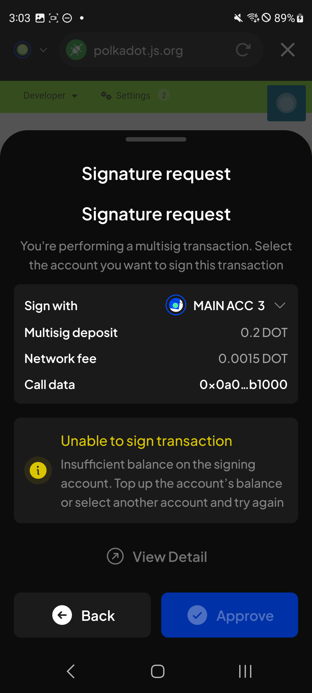
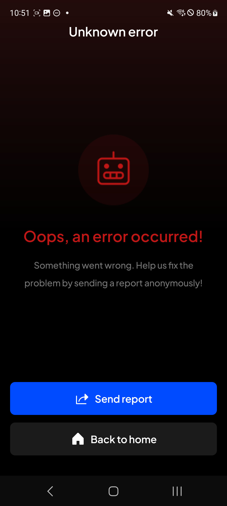

# Manual Test Report — EPIC-42 — 2026-09-16

| Field | Value |
|---|---|
| Epic | EPIC-42 — QA Coverage Tracking |
| Date | 2026-09-16 |
| Tester | MaiThuongNinni |
| Environment | Mobile — Android + iOS |
| Runner | manual (mobile) |
| Build under test | to fill in — build number + web-runner version |
| Stories tested | US-42.24.7, US-42.24.19, US-42.24.20 |
| Total bugs found | 2 |
| P0 | 0 |
| P1 | 1 |
| P2 | 1 |
| P3 | 0 |
| Status | in progress |

---

## US-42.24.20 — Verify the bugs found during this update

Carried on from [2026-09-15](../2026-09-15/report-manual.md), which took the story from 4 verified to 28 with one closed no fix. Thirty-eight bugs are still open, and twenty-two of those are the multisig batch from US-42.24.7.

### Bugs rechecked

| Item | Found in | Severity | What it is | State |
|---|---|---|---|---|
| BUG-42.24.7-10 | US-42.24.7 | P2 | Swap was still offered on a multisig account | ✅ Fixed — swap is disabled |
| AC-14 | US-42.24.7 | — | Swap is disabled for a multisig account, both with and without XCM | ✅ Rerun, passes — BUG-42.24.7-10 now settled both ways |
| BUG-42.24.7-11 | US-42.24.7 | P2 | Liquid staking was still listed in Earning options on a multisig account (MANTA) | ✅ Fixed — the option is hidden |
| AC-15 | US-42.24.7 | — | Earning — nomination pool and direct nomination follow the transfer logic; liquid staking and subnet staking are hidden | ✅ Rerun, passes — BUG-42.24.7-11 now settled both ways |
| BUG-42.24.7-12 | US-42.24.7 | P2 | Notification settings had no Pending multisig approvals option | ✅ Fixed — the option is there |
| BUG-42.24.7-13 | US-42.24.7 | P2 | Multisig accounts had no multisig badge on their avatar | ✅ Fixed — the badge is shown |
| BUG-42.24.7-14 | US-42.24.7 | P2 | The Select account screen for a new multisig showed no account-type badges | ✅ Fixed — the badges are shown |
| BUG-42.24.7-15 | US-42.24.7 | P2 | The account filter on Export account had no Multisig account option | ✅ Fixed — the option is in the filter |
| BUG-42.24.7-17 | US-42.24.7 | P2 | The Multisig tab did not offer to enable a network that was turned off | ✅ Fixed — the popup asks to enable it |
| BUG-42.24.7-18 | US-42.24.7 | P2 | View transaction did not open the transaction details | ✅ Fixed — the details open |
| BUG-42.24.7-24 | US-42.24.7 | P3 | The insufficient balance warning on Add proxy confirmation was not styled like the Extension | ✅ Fixed — the warning matches, with its heading, icon and panel |
| BUG-42.24.7-19 | US-42.24.7 | P2 | The message refusing a cross-chain transfer from a multisig did not say why | ✅ Fixed — the toast reads "Cross-chain transfer is not supported for multisig account" |
| BUG-42.24.7-29 | US-42.24.7 | P2 | Approval required notifications stayed on the Notifications screen after the initiator had rejected the transaction, so the other signatories were still being asked to approve something that was already dead | ✅ Fixed — the notifications clear when the initiator rejects |
| BUG-42.24.7-20 | US-42.24.7 | P3 | The signatory validation message is shown as a large red block rather than a tooltip | ⏭️ Skipped — Mobile needs a different mechanism, so the developer is keeping the block as it is |
| BUG-42.24.7-21 | US-42.24.7 | P2 | The Multisig transaction detail sheet did not match the Extension | ✅ Fixed — the sheet matches |
| BUG-42.24.7-22 | US-42.24.7 | P1 | Select an account to sign sometimes did not finish loading on a multisig signature request, including when signing for a dApp | ✅ Fixed — the picker finishes loading |
| BUG-42.24.7-23 | US-42.24.7 | P2 | The Sender on a pending multisig transaction showed an address where the Recipient showed a name, and the two blocks sat out of line | ✅ Fixed — both sides read the same way and line up |
| BUG-42.24.7-25 | US-42.24.7 | P2 | Attaching a multisig address as a watch-only or QR account and then creating a new multisig with the same signatories and threshold showed a raw error key | ✅ Fixed — the case is handled with a readable message |
| BUG-42.24.7-26 | US-42.24.7 | P2 | Starting a second transaction with the same amount, sender, recipient and network while the first was still awaiting approval showed a raw error key — bg.TRANSACTION_SERVICE.services.service.transaction.existingMultisigPendingTransaction | ✅ Fixed — the case is handled with a readable message |
| BUG-42.24.7-27 | US-42.24.7 | P2 | "Unable to sign transaction" appeared before the signatory account had finished loading, when signing for a dApp through a multisig account | ✅ Fixed — the message waits for the signatory list |
| BUG-42.24.9-01 | US-42.24.9 | P1 | A subnet token could not be transferred — the form had no validator fields and no subnet name | ✅ Fixed — the form carries them and the transfer goes through |
| BUG-42.24.11-01 | US-42.24.11 | P2 | The Insufficient balance popup on Start earning used the Android system dialog rather than the app's own sheet | ✅ Fixed — the app's own sheet is shown |
| BUG-42.24.16-01 | US-42.24.16 | P2 | The unstake confirmation screen dropped the TAO unstaking fee notice, so nothing told the user that 0.01 TAO comes off what they get back | ✅ Fixed — the notice is shown |

## US-42.24.7 — Multisig account phase 1

One bug found while rechecking the multisig batch.

### Bugs

| ID | Title | Steps to reproduce | Actual | Expected | Severity | Status | Screenshot |
|---|---|---|---|---|---|---|---|
| BUG-42.24.7-30 | The Call data row on the Signature request screen has no info button when signing for a dApp through a multisig account | Connect a multisig account to a dApp — polkadot.js.org, for instance → start a transaction there → on the Signature request screen, look at the Call data row | The row shows the shortened call data and nothing else. There is no way to see what the call actually contains. The Extension puts an info button at the end of that row, which opens the full call data | The info button is on the Call data row and opens the full call data, the way the Extension does it | P2 | todo |  |

## US-42.24.19 — Full wallet regression

### Bugs

| ID | Title | Steps to reproduce | Actual | Expected | Severity | Status | Screenshot |
|---|---|---|---|---|---|---|---|
| BUG-42.24.19-16 | The app crashes on the History screen after switching to the Multisig tab and back | Open History → tap the Multisig tab → tap History again | The app falls over to its own error screen: "Unknown error" in the title bar, then "Oops, an error occurred!" with Send report and Back to home. The History screen is gone and the only way on is back to home | History opens on the tab tapped, with no crash | P1 | todo |  |

The app caught this itself rather than closing, so it is the in-app error screen and not an OS crash, but the screen is lost either way.

## Follow-up, not logged as a bug

Item 42 on the [#2057 tracker](https://github.com/Koniverse/SubWallet-Mobile/issues/2057) asks for smoother scrolling through the Pending Multisig records. The developer has deferred it — "the optimization scope is still unclear and requires further investigation before we can identify the right approach" — and the checkbox is still open.

No bug row was created for it. Scrolling works, it is only rough, and there is no agreed target to test against yet. If the developer comes back with a scope, this is where it gets picked up.

## Summary

Session in progress.
