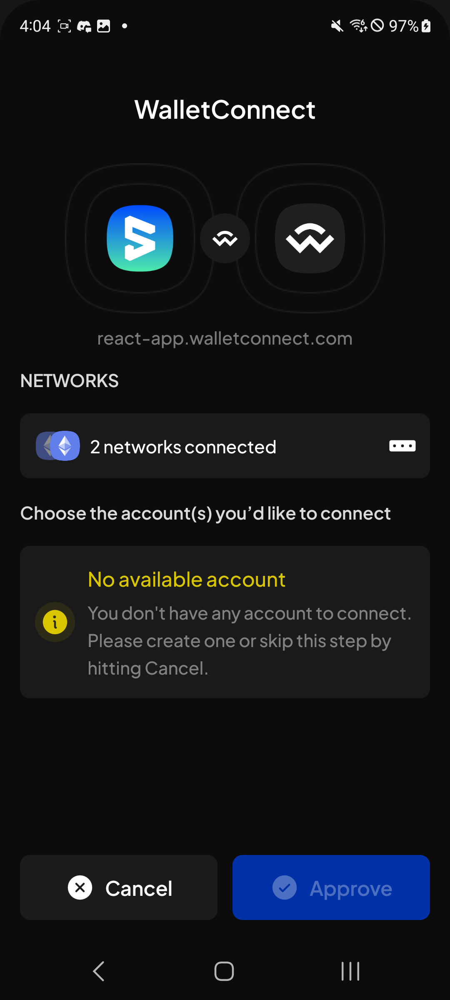

# Manual Test Report — EPIC-42 — 2026-09-17

| Field | Value |
|---|---|
| Epic | EPIC-42 — QA Coverage Tracking |
| Date | 2026-09-17 |
| Tester | MaiThuongNinni |
| Environment | Mobile — Android + iOS; Extension for US-42.25 |
| Runner | manual |
| Build under test | to fill in — build number + web-runner version; US-42.25 ran a PR #5076 build from the link in the issue comment |
| Stories tested | US-42.24.19, US-42.24.20, US-42.25, US-42.26 |
| Total bugs found | 2 |
| P0 | 0 |
| P1 | 2 |
| P2 | 0 |
| P3 | 0 |
| Status | done |

---

## US-42.24.19 — Full wallet regression, round 2

Round 2 starts today on the rewritten checklist — 77 lines each for Android and iOS, covering ground round 1 did not. Results go against REG-A for Android and REG-I for iOS.

### AC results

| AC | Description | Result | Notes |
|---|---|---|---|
| REG-A-11 | Lock the wallet by hand | ✅ Pass | Android |
| REG-A-12 | Unlock by typing the password; unlock by Face ID or Touch ID | ✅ Pass | Android |
| REG-A-50 | Change the currency, and the select currency popup | ✅ Pass | Android |
| REG-A-51 | Change the language, and search within the language list | ✅ Pass | Android |
| REG-A-52 | Turn in-app notifications off and on | ✅ Pass | Android. Wallet theme is coming soon and is not checked |
| REG-A-53 | Change the wallet password — current password; new password; confirm; the I understand checkbox; the learn more link; save | ✅ Pass | Android |
| REG-A-54 | Require unlock — change the auto-lock time; the wallet auto-locks | ✅ Pass | Android |
| REG-A-55 | Face ID or Touch ID — turn the toggle off; turn it on by password; turn it on by face or touch scan | ✅ Pass | Android |
| REG-A-56 | Sign for multiple transactions — turn the toggle on and off | ✅ Pass | Android |

9 of 77 Android lines done. iOS has not started.

### Bugs

| ID | Title | Steps to reproduce | Actual | Expected | Severity | Status | Screenshot |
|---|---|---|---|---|---|---|---|
| BUG-42.24.19-17 | WalletConnect offers no account to connect on an EVM network the wallet already has | Have a unified account in the wallet and the EVM network enabled → open a dApp that uses WalletConnect, react-app.walletconnect.com for instance → scan the pairing QR → look at the account list on the WalletConnect screen | The screen shows the two networks connected, but under "Choose the account(s) you'd like to connect" it says "No available account — You don't have any account to connect. Please create one or skip this step by hitting Cancel". Approve is disabled, so the dApp cannot be connected at all. The unified account covers EVM and the network is already in the wallet, so it should be on the list | The unified account is offered for the EVM network and can be selected, and Approve goes through | P1 | todo |  |
| BUG-42.24.19-18 | The WalletConnect popup cannot be dismissed after closing and reopening the app | Start a WalletConnect pairing so the connect popup is on screen → close the app → reopen it → the popup is still there → tap Cancel | Neither button responds. Cancel does not close the popup and Approve does nothing, so the popup stays on screen with no way past it | Cancel closes the popup and the wallet goes back to where it was | P1 | todo | |

Both bugs are round 2 and both are on WalletConnect. BUG-42.24.19-17 blocks REG-A-60, which checks creating a connection on a supported network; BUG-42.24.19-18 leaves the user stuck on the popup that connection opens.

## US-42.24.20 — Verify the bugs found during this update

Carried on from [2026-09-16](../2026-09-16/report-manual.md), which took the story from 28 verified to 54 with two closed no fix. Fifteen bugs are still open: two P1, eight P2 and five P3.

### Bugs rechecked

| Item | Found in | Severity | What it is | State |
|---|---|---|---|---|
| BUG-42.24.19-10 | US-42.24.19 | P2 | The Android back button does nothing on the History screen | ⏭️ Closed no fix — the developer is blocking it on purpose |

## US-42.25 — sr25519 VRF signing for dApp key derivation (#5072)

Extension, not Mobile. First run of the new story, against a PR [#5076](https://github.com/Koniverse/SubWallet-Extension/pull/5076) build. Test dApp was Orbinum Hub at `https://feat-subwallet-substrate.app-m9y.pages.dev`, through Shielded Pool → Private Vault → Sign and unlock.

### AC results

| AC | Description | Result | Notes |
|---|---|---|---|
| AC-1 | A dApp asks for a VRF signature, the confirmation appears, and approving returns a result | ✅ Pass | |
| AC-2 | Rejecting returns an error and no signature | ✅ Pass | |
| AC-3 | The same request twice gives the same derived key | ✅ Pass | |
| AC-4 | The screen shows the full origin, scheme included | ✅ Pass | The fix for the review finding that an earlier version showed a stripped domain |
| AC-5 | The header reads Key derivation request | ✅ Pass | |
| AC-6 | The screen names the account and warns that the key is permanent | ✅ Pass | |
| AC-7 | View details shows Bound to and Context | ✅ Pass | |
| AC-8 | Ordinary dApp connect and signing still work | ✅ Pass | |
| AC-9 | The passkey unlock setup modal that rides in this PR behaves | ✅ Pass | |
| AC-10 | All of the above on a fresh install | ✅ Pass | |
| AC-11 | All of the above on an upgrade | ✅ Pass | |

11 of 11 pass, no bugs. Story closed.

The whole path works: the dApp asks for a derived key, the wallet shows the Key derivation request screen naming `https://feat-subwallet-substrate.app-m9y.pages.dev` and the account, and after approving, Orbinum Hub derives its own privacy address `orbpriv3:0x2b2bc3e…b:fc15d64d` and shields 1 ORB into a note with a commitment and a created tx. The signature is real, not a screen that only looks right.

### What this session does not cover

Three groups of checks were dropped from the story's scope rather than left open, so nobody tested them:

- Two origins were never compared. The dApp was reachable at one address only, so the property the feature exists for — one site cannot obtain another site's key — has no manual test behind it. The PR's own unit tests cover it.
- The five locales on the confirmation screen.
- The refusal cases: non-sr25519 account, oversized data or context, non-hex input, non-HTTP(S) origin.

Evidence: video and screenshots posted to [issue #5072](https://github.com/Koniverse/SubWallet-Extension/issues/5072).

### Bugs

None.

## US-42.26 — Release gate, Extension v1.3.90

All four stages ran and the story is closed. Both release items were checked on dev after merge, on the master build, on the draft release and on production, with a regression pass at each stage. 16 of 18 AC pass, 2 skipped, no bugs.

### AC results

| AC | Description | Result | Notes |
|---|---|---|---|
| AC-1a | sr25519 VRF signing (#5072) works correctly after merge into the dev environment | ✅ Pass | [#5076](https://github.com/Koniverse/SubWallet-Extension/pull/5076) merged as `a4799cfbb1` |
| AC-1b | Bittensor manual claim (#5064) works correctly after merge into the dev environment | ✅ Pass | [#5065](https://github.com/Koniverse/SubWallet-Extension/pull/5065) merged as `1b7abee917` |
| AC-2 | Regression pass on dev finds no new issues in the app's main functions | ✅ Pass | |
| AC-3a | sr25519 VRF signing (#5072) works correctly on the master build | ✅ Pass | |
| AC-3b | Bittensor manual claim (#5064) works correctly on the master build | ✅ Pass | |
| AC-4 | Regression pass on the master build finds no new issues in the app's main functions | ✅ Pass | |
| AC-5a | sr25519 VRF signing (#5072) works correctly on the draft release build | ✅ Pass | |
| AC-5b | Bittensor manual claim (#5064) works correctly on the draft release build | ✅ Pass | |
| AC-6 | Regression pass on the draft release build finds no new issues in the app's main functions | ✅ Pass | |
| AC-7a | sr25519 VRF signing (#5072) is live and working on production | ✅ Pass | |
| AC-7b | Bittensor manual claim (#5064) is live and working on production | ✅ Pass | |
| AC-8 | The version shown in the extension is 1.3.90 on the draft and production builds | ✅ Pass | |
| AC-9 | The master password still unlocks the wallet on every stage | ✅ Pass | Checked at each of the four stages |
| AC-10 | AC-1 to AC-9 hold on a fresh install | ✅ Pass | |
| AC-11 | AC-1 to AC-9 hold on an upgrade from v1.3.89 | ✅ Pass | No data loss, old master password still works |
| AC-12 | The Bittensor manual claim is re-verified on the release build rather than inherited from US-42.23 | ✅ Pass | Settled by AC-5b — the claim ran on the draft build, not on the three-week-old PR build |
| AC-13 | The same dApp served from two origins derives two different keys | ⏭️ Skipped | The test dApp is still reachable from one origin only |
| AC-14 | The key derivation confirmation screen shows the full origin with its scheme | ⏭️ Skipped | Same reason — no second origin to compare against |

This is the first time either item has been checked on merged code. US-42.25 ran the VRF signing against an unmerged PR build earlier today, and US-42.23 ran the Bittensor claim three weeks ago on a build that has not been rebuilt since, so neither result carries into the release on its own.

AC-13 and AC-14 are skipped rather than passed. They are the two-origin comparison — the same dApp at two addresses should derive two different keys, which is what the VRF feature exists for — and the test dApp is still reachable from one address only. US-42.25 left the same check open earlier today. It is worth setting up before the Mobile run in US-42.24.24 reaches it as AC-5.

### Bugs

None at any of the four stages.

## Summary

Two Extension stories closed today. US-42.25 ran the sr25519 VRF signing against a PR build and passed 11 of 11. US-42.26, the v1.3.90 release gate, then ran all four build stages — dev merge, master, draft and production — and passed 16 of 18 AC with no bugs at any stage, shipping the release.

The two skipped AC are the same gap both stories hit: the two-origin comparison has no test dApp behind it. That is the property the VRF feature exists for, and it is still unverified by hand on either platform.

On Mobile, round 2 of the regression started and reached 9 of 77 Android lines. It found two P1 bugs straight away, both on WalletConnect: no account offered to connect on an EVM network the wallet already has, and a popup that cannot be dismissed after the app restarts. US-42.24.20 closed one more bug no fix — the Android back button on History, which the developer blocks on purpose.
