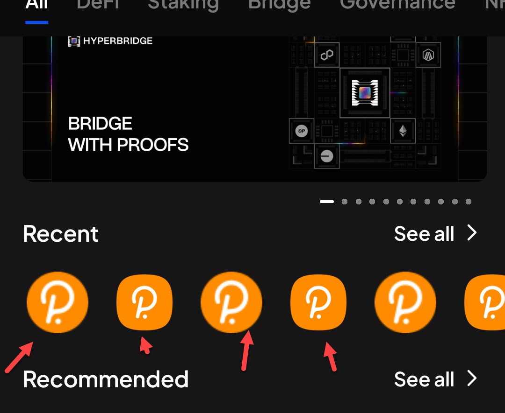
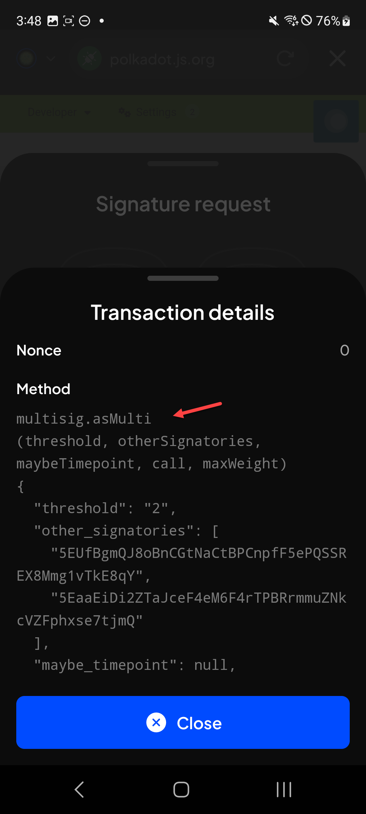

# Manual Test Report — EPIC-42 — 2026-09-18

| Field | Value |
|---|---|
| Epic | EPIC-42 — QA Coverage Tracking |
| Date | 2026-09-18 |
| Tester | MaiThuongNinni |
| Environment | Mobile — Android + iOS |
| Runner | manual (mobile) |
| Build under test | to fill in — build number + web-runner version |
| Stories tested | US-42.24.19, US-42.24.20, US-42.24.22, US-42.24.24; US-42.24.21 — closed |
| Total bugs found | 4 |
| P0 | 0 |
| P1 | 0 |
| P2 | 2 |
| P3 | 2 |
| Status | in progress |

---

## US-42.24.19 — Full wallet regression, round 2

Carried on from [2026-09-17](../2026-09-17/report-manual.md), which reached 9 of 77 Android lines and found two P1 bugs on WalletConnect. iOS has not started.

### AC results

| AC | Description | Result | Notes |
|---|---|---|---|
| REG-A-14 | Transferable balance is right on token details; transfer on-chain; transfer cross-chain; send NFT; swap; earning actions | ✅ Pass | Android |
| REG-A-15 | Show and hide balance; refresh balance; customize asset display; search token; token detail | ✅ Pass | Android |
| REG-A-16 | The QR code shows in all accounts mode and in single account mode | ✅ Pass | Android |
| REG-A-17 | The explorer link opens for a network that has one, and is handled for a network that does not | ✅ Pass | Android |
| REG-A-18 | Send an EVM token — local normal and max; native normal and max; a token with no support | ✅ Pass | Android |
| REG-A-19 | Send a substrate token — local normal and max; local into an account with zero native token; native normal and max; a token with no support | ✅ Pass | Android |
| REG-A-23 | Swap without XCM; swap with XCM | ✅ Pass | Android |
| REG-A-24 | Search token and account; the prompt to enable a network that is off; filter token | ✅ Pass | Android |
| REG-A-25 | Input the amount and the recipient address — by QR, by typing, from the address book | ✅ Pass | Android |
| REG-A-26 | The swap quote shows; quote reset; quote detail; input and edit slippage; view quote; view fee | ✅ Pass | Android |
| REG-A-27 | Validation cases; submit | ✅ Pass | Android |
| REG-A-28 | Choose a token with the network on and with it off; the buy page opens; the token list matches the account type; select token; select service; select account; the disclaimer popup | ✅ Pass | Android |
| REG-A-41 | The mission pool list; search; filter; status; tabs | ✅ Pass | Android |
| REG-A-42 | Sorting by status — live, upcoming, archived — and by ordinal low to high, matching the Extension | ✅ Pass | Android |
| REG-A-43 | View mission pool details; the actions inside a mission pool go where they should; scroll up and down, left and right | ✅ Pass | Android |
| REG-A-57 | Search website; filter; the list of connected websites; scroll the list | ✅ Pass | Android |
| REG-A-58 | Connected website detail — search account; turn an account off and on; block; forget; disconnect all; connect all; unblock | ✅ Pass | Android |
| REG-A-59 | dApp configuration — forget all; disconnect all; connect all | ✅ Pass | Android |

27 of 77 Android lines done. iOS has not started.

### Bugs

| ID | Title | Steps to reproduce | Actual | Expected | Severity | Status | Screenshot |
|---|---|---|---|---|---|---|---|
| BUG-42.24.19-19 | A loading spinner appears on every character typed into the amount field when changing the staking amount on subnet staking | Earning → open a Bittensor subnet staking position → Change validator → type into the staking amount field → watch the field as each character goes in | A loading indicator fires on every keystroke rather than once when the field settles, so typing flickers and drags | Typing is smooth, with any validation running once the field settles | P2 | todo | |
| BUG-42.24.19-20 | The scan screen occasionally freezes after uploading an invalid image | Open any screen that scans a QR code → choose to upload an image rather than scan → pick an image that is not a valid QR → repeat a few times, since it does not happen every time | The screen stops responding. The error message from BUG-42.24.19-15 appears, but the screen behind it is frozen and nothing on it can be tapped, so the flow has to be left and reopened | The screen stays usable after the error, and another image can be picked or the screen dismissed | P2 | todo | |
| BUG-42.24.19-21 | The dApp logos in the Recent row are different sizes | dApps tab → look at the row of logos under Recent | The logos are not all the same size. Some fill their tile and some sit smaller inside it, so the row looks ragged even though every entry is the same dApp icon | Every logo in the row is rendered at the same size | P3 | todo |  |
| BUG-42.24.19-22 | The Method and Info rows on Transaction details cannot be collapsed | Connect to a dApp and start a transaction that needs signing → on the Signature request screen open Transaction details → look at the Method and Info rows | Both are expanded in full with no way to fold them. A multisig call runs to dozens of lines of threshold, signatories and call data, so everything below it is pushed a long way down. The Extension gives each row a disclosure arrow and starts them collapsed, so the whole sheet fits and a row is opened only when wanted | Method and Info have the same disclosure arrows the Extension has, and start collapsed | P3 | todo |  |

BUG-42.24.19-19 is the tenth entry point from BUG-42.24.19-14, split out because the other nine are fixed and this one is not. The nine were all the account name field on create, import and attach; this one is the amount field on the subnet staking change-validator screen, which is a different screen even though the symptom is the same.

BUG-42.24.19-20 sits on the same scan screen as BUG-42.24.19-15, which passed its recheck today. The error message now appears; what it does not do is leave the screen usable afterwards. Intermittent, so it takes a few attempts to see.

## US-42.24.21 — Web-runner 1.3.87 on Mobile

Opened and closed in the same session. The version carries one item, the nominator unstaking eras ([#5055](https://github.com/Koniverse/SubWallet-Extension/issues/5055), [PR #5056](https://github.com/Koniverse/SubWallet-Extension/pull/5056)). Its issue body is empty, so the AC were written from what the change does.

### AC results

| AC | Description | Result | Notes |
|---|---|---|---|
| AC-1 | The unstaking period shown before confirming an unstake matches what the chain actually enforces — Android + iOS fresh | ✅ Pass | |
| AC-2 | A position already unstaking shows the right remaining time, counted in the updated eras — Android + iOS fresh | ✅ Pass | |
| AC-3 | Withdraw becomes available when the period ends, and not before — Android + iOS fresh | ✅ Pass | |
| AC-4 | AC-1 to AC-3 pass on Android + iOS upgrade | ✅ Pass | |
| AC-5 | After upgrading, positions that were already unstaking keep the right remaining time and are not reset — both platforms | ✅ Pass | |

5 of 5 pass, no bugs. Story closed.

### Bugs

None.

## US-42.24.22 — Web-runner 1.3.88 on Mobile

Opened at the end of the session. Its AC were written out today from the release note, taking the story from 8 AC to 17 — the chain-list half was missing entirely, and the route removals turned one AC on its head.

Both chain-list entries ran: PRDCTR as a new substrate chain ([ChainList #708](https://github.com/Koniverse/SubWallet-ChainList/issues/708)) and the Bittensor TUSDT symbol change ([#707](https://github.com/Koniverse/SubWallet-ChainList/issues/707)).

### AC results

| AC | Description | Result | Notes |
|---|---|---|---|
| AC-12 | PRDCTR appears as a new substrate chain with its logo, connects on its RPC and loads balances — Android + iOS fresh | ✅ Pass | |
| AC-13 | Its token shows as PRD with the right logo and price, and a transfer goes through with the explorer link opening the transaction — Android + iOS fresh | ✅ Pass | |
| AC-14 | The Bittensor TUSDT symbol reads TUSDT, not tUSDT — Android + iOS fresh | ✅ Pass | [ChainList #707](https://github.com/Koniverse/SubWallet-ChainList/issues/707) |
| AC-15 | The symbol change did not break the token — balance, transfer and history still work, and an existing holding is not shown twice under the two spellings — Android + iOS fresh | ✅ Pass | |

Left for the next session: ParaSpell API v2 itself, the fifteen removed routes, and the upgrade AC.

### Bugs

None.

## US-42.24.24 — Web-runner 1.3.90 on Mobile

Opened at the end of the session. Only the VRF signing half ran ([#5072](https://github.com/Koniverse/SubWallet-Extension/issues/5072)); the Bittensor manual claim is still to come.

### AC results

| AC | Description | Result | Notes |
|---|---|---|---|
| AC-1 | A dApp asks for a VRF signature on an sr25519 account, the Key derivation request screen appears, and approving returns a result — Android + iOS fresh | ✅ Pass | |
| AC-2 | Rejecting the prompt returns an error to the dApp and produces no signature — Android + iOS fresh | ✅ Pass | |
| AC-3 | Asking twice from the same site with the same data gives the same derived key — Android + iOS fresh | ✅ Pass | |
| AC-4 | The screen shows the full origin with its scheme — Android + iOS fresh | ✅ Pass | |
| AC-5 | The same dApp served from two origins derives two different keys — Android + iOS fresh | ⏭️ Skipped | The test dApp is still reachable from one origin only |
| AC-6 | The screen names the account being used and shows the permanent-key warning — Android + iOS fresh | ✅ Pass | |
| AC-7 | The details view shows Bound to and Context, and the values match what the dApp asked for — Android + iOS fresh | ✅ Pass | |
| AC-8 | Ordinary dApp signing still works, and a dApp that never asks for a derived key behaves as before — Android + iOS fresh | ✅ Pass | |
| AC-9 | AC-1 to AC-8 pass on Android + iOS upgrade | ✅ Pass | |

8 of 9 pass, 1 skipped. AC-5 is the two-origin comparison, and this is the third story to leave it open after US-42.25 and US-42.26 — the property the VRF feature exists for still has no manual test behind it on either platform. Setting up a second origin would close it in all three.

Left for the next session: the Bittensor manual claim, AC-10 to AC-22.

### Bugs

None.

## US-42.24.20 — Verify the bugs found during this update

65 of 77 bugs verified, 3 closed no fix, 9 still open — one P1, four P2 and four P3. The last P1 is the app loading forever after being left in the background.

### Bugs rechecked

| Item | Found in | Severity | What it is | State |
|---|---|---|---|---|
| BUG-42.24.7-16 | US-42.24.7 | P2 | The toast on a pending multisig transaction was hidden behind the detail sheet | ✅ Fixed — the toast is visible |
| BUG-42.24.7-09 | US-42.24.7 | P2 | Tapping a multisig notification only opened History, not the pending transaction it names | ✅ Fixed — the notification opens the transaction |
| BUG-42.24.7-28 | US-42.24.7 | P2 | The signatory picker was still shown on a network that does not support multisig, including when signing for a dApp | ✅ Fixed — the picker is gone there |
| BUG-42.24.11-02 | US-42.24.11 | P3 | Manage networks did not match the Extension after turning all networks off — a wifi badge on each logo and the wrong toggle colour | ✅ Fixed — the screen matches |
| BUG-42.24.19-14 | US-42.24.19 | P2 | A loading spinner appeared on every character typed into the account name and amount fields, across ten entry points | ✅ Fixed on nine of the ten — the account name field is smooth everywhere. The tenth is still there and is now BUG-42.24.19-19 |
| BUG-42.24.19-16 | US-42.24.19 | P1 | The app crashed on the History screen after switching to the Multisig tab and back | ✅ Fixed — History opens on the tab tapped, no crash |
| BUG-42.24.19-15 | US-42.24.19 | P2 | Uploading an invalid QR image on the scan screen showed no error message, across eleven entry points | ✅ Fixed — an error message is shown on every one |
| BUG-42.24.13-06 | US-42.24.13 | P3 | The cards on the NFT detail screen had no padding above or below them | ✅ Fixed — the cards are spaced |
| BUG-42.24.13-03 | US-42.24.13 | P3 | The NFT detail screen laid its fields out differently from the Extension | ✅ Fixed — the layout matches |
| BUG-42.24.19-17 | US-42.24.19 | P1 | WalletConnect offered no account to connect on an EVM network the wallet already has | ✅ Fixed — the unified account is offered and Approve goes through |
| BUG-42.24.19-18 | US-42.24.19 | P1 | The WalletConnect popup could not be dismissed after closing and reopening the app | ✅ Fixed — Cancel closes it |

## Summary

Session in progress.
