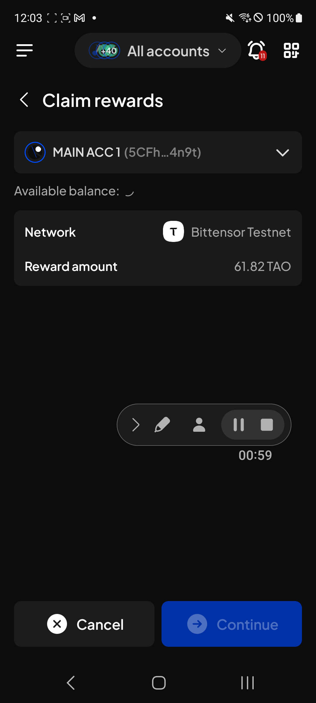

# Manual Test Report — EPIC-42 — 2026-09-24

| Field | Value |
|---|---|
| Epic | EPIC-42 — QA Coverage Tracking |
| Date | 2026-09-24 |
| Tester | MaiThuongNinni |
| Environment | Mobile — Android + iOS |
| Runner | manual (mobile) |
| Build under test | to fill in — build number + web-runner version |
| Stories tested | US-42.24.20, US-42.24.22, US-42.24.24 |
| Total bugs found | 1 |
| P0 | 0 |
| P1 | 0 |
| P2 | 0 |
| P3 | 1 |
| Status | in-progress |

---

## US-42.24.20 — Verify the bugs found during this update

Six bugs settled — two P2 and four P3. 70 of 79 verified, 4 closed no fix, 5 still open — one P1, three P2 and one P3, the P3 being BUG-42.24.24-02 logged today.

BUG-42.24.24-01 is the one that matters: it was blocking US-42.24.24, and AC-10 was rerun here on the fixed build and passes.

### Bugs rechecked

| Item | Found in | Severity | What it is | State |
|---|---|---|---|---|
| BUG-42.24.24-01 | US-42.24.24 | P2 | Unclaimed rewards always showed 0 TAO on Bittensor native staking, so nothing could be claimed | ✅ Fixed — the figure reads through |
| → AC-10 | US-42.24.24 | — | On a Bittensor root (netuid 0) position, the rewards panel shows Unclaimed rewards with a value and a working Claim button | ✅ Rerun, passes — this unblocks US-42.24.24 |
| BUG-42.24.7-30 | US-42.24.7 | P2 | The Call data row on the Signature request screen had no info button when signing for a dApp through a multisig account | ✅ Fixed |
| BUG-42.24.13-04 | US-42.24.13 | P3 | The NFT transfer confirmation screen did not match the Extension | ✅ Fixed |
| BUG-42.24.19-21 | US-42.24.19 | P3 | The dApp logos in the Recent row were different sizes | ✅ Fixed |
| BUG-42.24.19-22 | US-42.24.19 | P3 | The Method and Info rows on Transaction details could not be collapsed | ✅ Fixed |
| BUG-42.24.11-04 | US-42.24.11 | P3 | The swap screen cut the alpha token names short on both the From and To rows | ⏭️ Closed no fix — the developer's note: "The name displayed on the swap screen will remain unchanged because this may affect other devices and tokens" |

## US-42.24.22 — Web-runner 1.3.88 on Mobile

Everything left over from the 2026-09-18 session ran today — ParaSpell API v2 itself ([#5051](https://github.com/Koniverse/SubWallet-Extension/issues/5051)) and the two upgrade checks on the chain-list half. All eight AC pass on Android and iOS, fresh install and upgrade, with no bug found. The story closes at 17 of 17.

### AC results

| AC | Description | Result | Notes |
|---|---|---|---|
| AC-1 | XCM transfers still work on the routes ParaSpell v2 still serves — Android + iOS fresh | ✅ Pass | |
| AC-2 | The fee quoted before sending matches what is actually taken — Android + iOS fresh | ✅ Pass | |
| AC-3 | The destination fee is still shown, and the amount that arrives matches the quote — Android + iOS fresh | ✅ Pass | |
| AC-4 | A route that cannot be served fails clearly, with a message rather than a stuck screen — Android + iOS fresh | ✅ Pass | |
| AC-5 | XCM history shows the same figures the confirmation screen did — Android + iOS fresh | ✅ Pass | |
| AC-6 | AC-1 to AC-5 pass on Android + iOS upgrade | ✅ Pass | |
| AC-16 | AC-12 to AC-15 pass on Android + iOS upgrade | ✅ Pass | PRDCTR and the TUSDT rename, on an upgrade |
| AC-17 | After upgrading, XCM history from before the upgrade is still readable and its figures are unchanged, including for routes that have since been removed — both platforms | ✅ Pass | |

17 of 17 AC pass, no bugs. Story closed.

### Bugs

None.

## US-42.24.24 — Web-runner 1.3.90 on Mobile

Unblocked and closed. BUG-42.24.24-01 is fixed and AC-10 was rerun in US-42.24.20 and passes, so the unclaimed figure now reads through on Mobile. With the figure reading through, the rest of the claim half ran in this session — AC-11 to AC-22 — and all pass, taking the story from `blocked` to `done` at 21 of 22 with AC-5 skipped.

### AC results

| AC | Description | Result | Notes |
|---|---|---|---|
| AC-10 | On a Bittensor root (netuid 0) position, the rewards panel shows Unclaimed rewards with a value and a working Claim button — Android + iOS fresh | ✅ Pass | Rerun in US-42.24.20 after BUG-42.24.24-01 was fixed |
| AC-11 | On a Bittensor subnet (alpha) position there is no claim button and no unclaimed figure — Android + iOS fresh | ✅ Pass | |
| AC-12 | The claim screen lists only accounts with an unclaimed reward above zero — Android + iOS fresh | ✅ Pass | |
| AC-13 | The unclaimed figure matches the chain and is scaled in TAO rather than rao — Android + iOS fresh | ✅ Pass | Checked against the Extension, not against an explorer or a runtime query as the AC asks. The Extension reading is itself QC'd in [US-42.23](../../../../sprints/stories/US-42.23-qc-issue-5064-bittensor-manual-claim.md), 16 of 16 on #5064, so this compares against a checked figure rather than the app's own display. A wrong scale shared by both surfaces would still pass |

| AC-14 | A claim with one claimable validator goes through, with the right fee on the confirmation screen — Android + iOS fresh | ✅ Pass | |
| AC-15 | A claim with several claimable validators goes through and settles all of them — Android + iOS fresh | ✅ Pass | |
| AC-16 | After a claim the unclaimed figure drops to zero, or to the dust under the threshold, and the staked balance reflects it — Android + iOS fresh | ✅ Pass | |
| AC-17 | With rewards pending but all below the threshold, the claim is refused with a message naming the threshold, not a raw key — Android + iOS fresh | ✅ Pass | |
| AC-18 | The claim appears correctly in transaction history — Android + iOS fresh | ✅ Pass | |
| AC-19 | The root claim type removed in 1.3.86 has not come back — one claim path, not two — Android + iOS fresh | ✅ Pass | |
| AC-20 | Bittensor stake, unstake and change validator all still work, since the handler was edited — Android + iOS fresh | ✅ Pass | |
| AC-21 | AC-10 to AC-20 pass on Android + iOS upgrade | ✅ Pass | |
| AC-22 | After upgrading, Bittensor positions and their unclaimed figures are carried over, and dApp connections still work — both platforms | ✅ Pass | |
| AC-5 | The same dApp served from two origins derives two different keys — Android + iOS fresh | ⏭️ Skipped | The test dApp is still reachable from one origin only |

21 of 22 pass, 1 skipped. Story closed.

AC-5 is the one check this story never got a verdict on, and it is the third story to leave it open after US-42.25 and US-42.26. The property the VRF feature exists for still has no manual test behind it on any platform. One second origin — the same site at two hosts, or at `http://` and `https://` — would close it in all three.

One display bug was found on the claim rewards screen while looking at it again.

### Bugs

| ID | Title | Steps to reproduce | Actual | Expected | Severity | Status | Screenshot |
|---|---|---|---|---|---|---|---|
| BUG-42.24.24-02 | Available balance takes a long time to load on the claim rewards select account screen, in all accounts mode | Switch to all accounts mode → Earning → open a Bittensor position with rewards to claim → Claim rewards → look at the Available balance line under the account picker | The Available balance line sits on a loading spinner for a long time before the figure appears, and Continue stays greyed out while it does. It does show in the end, but the claim cannot be started in the meantime even though the reward amount is already on screen | Available balance loads promptly, the way it does on the other account pickers | P3 | todo |  |
