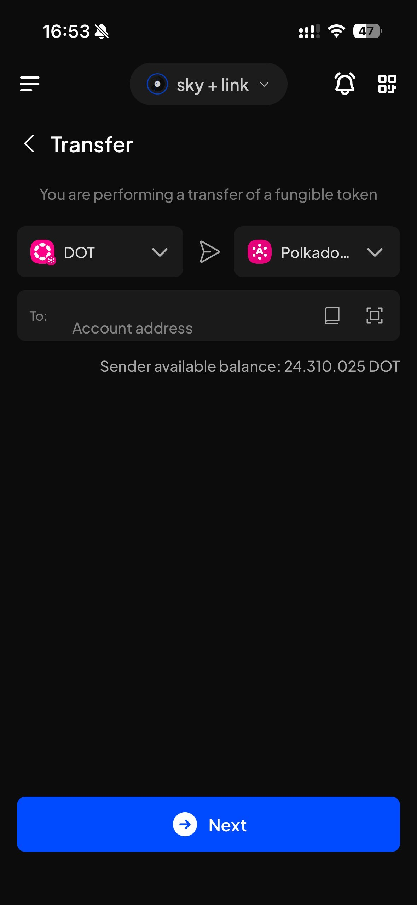
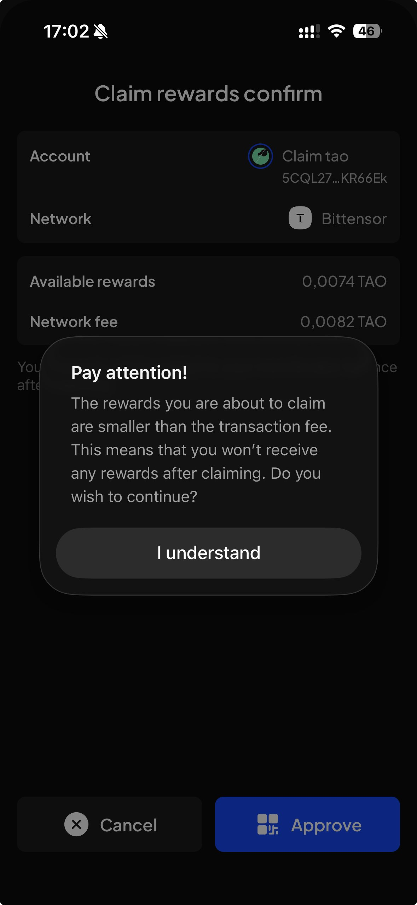
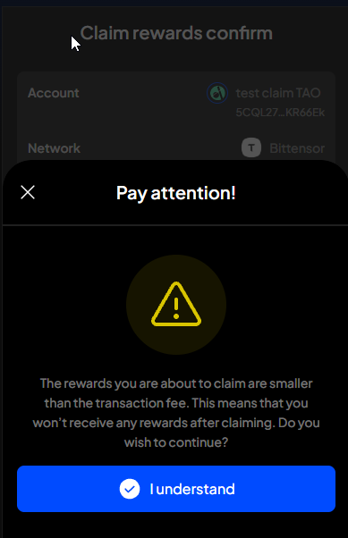

# Manual Test Report — EPIC-42 — 2026-09-25

| Field | Value |
|---|---|
| Epic | EPIC-42 — QA Coverage Tracking |
| Date | 2026-09-25 |
| Tester | MaiThuongNinni |
| Environment | Mobile — Android + iOS |
| Runner | manual (mobile) |
| Build under test | to fill in — build number + web-runner version |
| Stories tested | US-42.24.19 |
| Total bugs found | 2 |
| P0 | 0 |
| P1 | 0 |
| P2 | 1 |
| P3 | 1 |
| Status | in-progress |

---

## US-42.24.19 — Full wallet regression, round 2

iOS started, twenty-one lines run. Android added eight, closing the transfer section on both platforms. Android 37 of 82, iOS 21 of 82.

The checklist grew from 77 lines to 82 today. Reading the SubWallet user guide against it turned up four documented features with no line of their own — import from Trust Wallet, transfer through a bridge, parachain (collator) staking, and change validator — now REG-78 to REG-81 on both platforms.

The fifth change is a split. REG-70 read "Migrate account; configure the Subscan API key", two unrelated things on one line: migrating solo accounts to a unified account rewrites how keys are stored, while the Subscan key is a string typed into settings. REG-70 now covers the migration alone and the API key moves to REG-82. Governance is left out on purpose — Mobile has no governance screen.

### AC results

| AC | Description | Result | Notes |
|---|---|---|---|
| REG-I-11 | Lock the wallet by hand | ✅ Pass | iOS |
| REG-I-12 | Unlock by typing the password; unlock by Face ID or Touch ID | ✅ Pass | iOS |
| REG-I-70 | Migrate solo accounts to a unified account | ✅ Pass | iOS |
| REG-A-70 | Migrate solo accounts to a unified account | ✅ Pass | Android |
| REG-I-50 | Change the currency, and the select currency popup | ✅ Pass | iOS |
| REG-I-51 | Change the language, and search within the language list | ✅ Pass | iOS |
| REG-I-52 | Turn in-app notifications off and on. Wallet theme is coming soon and is not checked | ✅ Pass | iOS |
| REG-I-53 | Change the wallet password — current password; new password; confirm; the I understand checkbox; the learn more link; save | ✅ Pass | iOS |
| REG-I-54 | Require unlock — change the auto-lock time; the wallet auto-locks | ✅ Pass | iOS |
| REG-I-56 | Sign for multiple transactions — turn the toggle on and off | ✅ Pass | iOS |
| REG-I-28 | Choose a token with the network on and with it off; the buy page opens; the token list matches the account type; select token; select service; select account; the disclaimer popup | ✅ Pass | iOS |
| REG-I-55 | Face ID or Touch ID — turn the toggle off; turn it on by password; turn it on by face or touch scan | ✅ Pass | iOS |
| REG-I-30 | Import an NFT — select network; the prompt to enable a network that is off; select token type; type or scan the contract address; collection name; import | ✅ Pass | iOS |
| REG-I-31 | Send an NFT on a supported network, and on one with no support | ✅ Pass | iOS |
| REG-I-18 | Transfer an EVM token — single-chain and cross-chain; native and local; edit the fee | ✅ Pass | iOS |
| REG-I-19 | Transfer a substrate token — single-chain and cross-chain; native and local; choose which token pays the fee | ✅ Pass | iOS |
| REG-I-20 | Transfer a BTC token | ✅ Pass | iOS |
| REG-I-21 | Transfer a TON token | ✅ Pass | iOS |
| REG-I-79 | Transfer a token through a bridge — TAO to Subtensor EVM and back | ✅ Pass | iOS |
| REG-I-22 | The transfer screen — select token; the prompt to enable a network that is off; select network; recipient address; input amount; approve; submit | ✅ Pass | iOS |
| REG-A-20 | Transfer a BTC token | ✅ Pass | Android |
| REG-A-21 | Transfer a TON token | ✅ Pass | Android |
| REG-A-79 | Transfer a token through a bridge — TAO to Subtensor EVM and back | ✅ Pass | Android |
| REG-A-22 | The transfer screen — select token; the prompt to enable a network that is off; select network; recipient address; input amount; approve; submit | ✅ Pass | Android |
| REG-A-29 | View NFT collections; search; reload collections; view the NFT list; NFT detail | ✅ Pass | Android |
| REG-A-30 | Import an NFT — select network; the prompt to enable a network that is off; select token type; type or scan the contract address; collection name; import | ✅ Pass | Android |
| REG-A-31 | Send an NFT on a supported network, and on one with no support | ✅ Pass | Android |
| REG-32 | Remove a custom NFT | ⏭️ Skipped | Both platforms. NFTs are auto-detected now, so a removed one comes straight back and the action no longer does anything |
| REG-I-14 | Transferable balance is right on token details; transfer on-chain; transfer cross-chain; send NFT; swap; earning actions | ✅ Pass | iOS |
| REG-I-15 | Show and hide balance; refresh balance; customize asset display; search token; token detail | ✅ Pass | iOS |

### Bugs

| ID | Title | Steps to reproduce | Actual | Expected | Severity | Status | Screenshot |
|---|---|---|---|---|---|---|---|
| BUG-42.24.19-23 | The recipient address field on the Transfer screen is out of line (iOS) | Open a token → Send → on the Transfer screen, look at the To row | The To label sits hard against the left edge of the field while the Account address placeholder starts well to the right of it, so the row does not line up with the token and network fields above it | The To row lines up with the fields above it, with the label and the address placeholder spaced the way the rest of the form is | P3 | todo |  |
| BUG-42.24.19-24 | The "Pay attention!" popup on Claim rewards confirm does not match the Extension (iOS) | Earning → open a Bittensor position whose rewards are smaller than the network fee → Claim rewards → Approve → look at the popup that appears | The popup is a plain grey box floating in the middle of the screen. It has no close button, no warning icon, and the "I understand" button is grey like the box behind it. The Extension shows the same warning as a sheet from the bottom with an X to close, a yellow warning triangle, and "I understand" as a blue button with a tick | The popup matches the Extension — a bottom sheet with a close button, the warning icon, and a blue confirm button | P2 | todo | on iOS:  · on the Extension, as it should look:  |

## Summary

Regression round 2 started on iOS, the platform that had not been touched yet — twenty-one lines pass there: lock and unlock, migrating solo accounts to a unified account, buying a token, importing and sending an NFT, the balance lines, the whole of the transfer section, and the whole of general settings and security settings. Android added the migration line, the four transfer lines it was missing and three NFT lines, so the transfer section is now closed on both platforms. Two bugs found on iOS, both display defects: BUG-42.24.19-23, a P3 on the Transfer screen, and BUG-42.24.19-24, a P2 on the Claim rewards confirm popup.

The checklist was also compared against the SubWallet user guide and went from 77 lines to 82: four documented features had no line of their own, and REG-70 was split because it carried two unrelated checks.

The transfer lines were rewritten as well. Send funds, XCM transfer and Transfer screen were three headings over one flow, with single-chain and cross-chain split across them although both run from the same screen. They are now one Transfer section with a line per token family — EVM, substrate, BTC, TON — each covering single-chain and cross-chain, native and local. BTC and TON had no line before. The transfer count is unchanged: the two XCM lines became the BTC and TON lines.

Android is now 37 of 82 and iOS 21 of 82.
