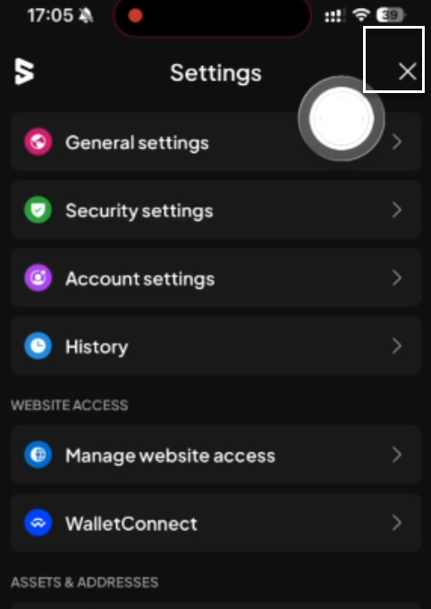

# Manual Test Report — EPIC-42 — 2026-09-29

| Field | Value |
|---|---|
| Epic | EPIC-42 — QA Coverage Tracking |
| Date | 2026-09-29 |
| Tester | MaiThuongNinni |
| Environment | Mobile — Android + iOS |
| Runner | manual (mobile) |
| Build under test | to fill in — build number + web-runner version |
| Stories tested | US-42.24.19, US-42.24.20 |
| Total bugs found | 1 |
| P0 | 0 |
| P1 | 0 |
| P2 | 1 |
| P3 | 0 |
| Status | done |

---

## US-42.24.19 — Full wallet regression, round 2

Carried on from [2026-09-28](../2026-09-28/report-manual.md), which left Android 69 of 84 and iOS 69 of 84.

### AC results

| AC | Description | Result | Notes |
|---|---|---|---|
| REG-A-1 | Create an account with a new seed phrase — unified account; TON account | ✅ Pass | Android |
| REG-A-2 | Derive an account from the create account screen — unified account; substrate type; ethereum type | ✅ Pass | Android |
| REG-A-3 | Derive an account from account details | ✅ Pass | Android |
| REG-A-4 | Import an account — seed phrase; JSON file single; JSON file multi covering normal, QR and watch-only; QR code substrate; QR code EVM; private key | ✅ Pass | Android |
| REG-A-5 | Attach an account — polkadot vault; keystone; watch-only. Ledger is coming soon and is not checked | ✅ Pass | Android |
| REG-A-6 | Export an account — unified with seed phrase and JSON; TON with seed phrase, JSON and private key; substrate with JSON and QR; ethereum with JSON, private key and QR; all accounts covering normal, QR signer and watch-only; watch-only offers no export; the exported file imports back | ✅ Pass | Android |
| REG-A-7 | Proxy account — add a proxy; remove a proxy; view the proxy list; act through a proxy | ✅ Pass | Android |
| REG-A-8 | Multisig account — create one; open its details; approve and reject a pending transaction; sign for a multisig | ✅ Pass | Android |
| REG-A-9 | Remove an account | ✅ Pass | Android |
| REG-A-10 | Edit an account name | ✅ Pass | Android |
| REG-I-1 | Create an account with a new seed phrase — unified account; TON account | ✅ Pass | iOS |
| REG-I-2 | Derive an account from the create account screen — unified account; substrate type; ethereum type | ✅ Pass | iOS |
| REG-I-3 | Derive an account from account details | ✅ Pass | iOS |
| REG-I-4 | Import an account — seed phrase; JSON file single; JSON file multi covering normal, QR and watch-only; QR code substrate; QR code EVM; private key | ✅ Pass | iOS |
| REG-I-5 | Attach an account — polkadot vault; keystone; watch-only. Ledger is coming soon and is not checked | ✅ Pass | iOS |
| REG-I-6 | Export an account — unified with seed phrase and JSON; TON with seed phrase, JSON and private key; substrate with JSON and QR; ethereum with JSON, private key and QR; all accounts covering normal, QR signer and watch-only; watch-only offers no export; the exported file imports back | ✅ Pass | iOS |
| REG-I-7 | Proxy account — add a proxy; remove a proxy; view the proxy list; act through a proxy | ✅ Pass | iOS |
| REG-I-8 | Multisig account — create one; open its details; approve and reject a pending transaction; sign for a multisig | ✅ Pass | iOS |
| REG-I-9 | Remove an account | ✅ Pass | iOS |
| REG-I-10 | Edit an account name | ✅ Pass | iOS |
| REG-40 | Sign a message or transaction with a substrate account; with an EVM account; with an EVM account using a substrate provider | ✅ Pass | Android + iOS. Closes the dApps section on both |
| REG-13 | Forgot password — reset account; erase all | ✅ Pass | Android + iOS |
| REG-85 | The app opens, backgrounds and resumes without losing state — it comes back to where it was, and does not hang on a loading screen | ✅ Pass | Android + iOS. New line, added today; this is the check BUG-42.24.19-06 was holding |
| REG-75 | After upgrading, accounts, balances, NFTs, staking and earning positions, dApp connections and settings are all still there and correct | ✅ Pass | Android + iOS |
| REG-76 | Transaction history from before the upgrade is still readable | ⏭️ Skipped | Both platforms. The API key Polkadot used to provide no longer works, so there is no history to read the check against. Adding a key still works — REG-74 and REG-82 both pass — it is the key itself that is gone |

Manage account closes on both platforms, all twelve lines each.

### Bugs

| ID | Title | Steps to reproduce | Actual | Expected | Severity | Status | Screenshot |
|---|---|---|---|---|---|---|---|
| BUG-42.24.19-26 | The close button on the Settings screen often does not respond (iOS) | Open Settings → tap the X in the top right to close the screen → repeat a few times, since it does not happen every time | The tap does nothing and the screen stays open. It takes another tap, sometimes several, before it closes. It happens often enough to be noticed in ordinary use, though not on every attempt | The X closes the Settings screen on the first tap, every time | P2 | todo |  |

## US-42.24.20 — Verify the bugs found during this update

### Bugs rechecked

| Item | Found in | Severity | What it is | State |
|---|---|---|---|---|
| BUG-42.24.19-25 | US-42.24.19 | P2 | The Account name popup was shown twice when saving the name while importing by seed phrase | ✅ Fixed |
| BUG-42.24.19-23 | US-42.24.19 | P3 | The recipient address field on the Transfer screen was out of line | ✅ Fixed |
| BUG-42.24.19-03 | US-42.24.19 | P2 | The Done button on the Amount screen was out of line (iOS 26.6.1) | ⏭️ Closed no fix — the developer cannot fix it: the layout comes from the iOS version on the device, not from the build |
| BUG-42.24.19-06 | US-42.24.19 | P1 | The app loaded forever after being left in the background, intermittently, on Android and iOS | ✅ Fixed |
| → REG-85 | US-42.24.19 | — | The app opens, backgrounds and resumes without losing state | ✅ Rerun, passes on both platforms |

76 of 83 verified, 6 closed no fix, 1 open — BUG-42.24.19-26 at P2. No P1 is left.

## Summary

Manage account closes on both platforms — the ten remaining lines pass on each, covering account creation, derivation, import, attach, export, proxy, multisig, removal and renaming. It was the largest section still open. Signing from a dApp closes the dApps section too.

Two bugs verified fixed, both logged in round 2 — the duplicated Account name popup on import, and the misaligned recipient address field on Transfer. BUG-42.24.19-03 is closed without a fix: the developer cannot change it, the Done button layout coming from the iOS version on the device rather than from the build.

BUG-42.24.19-06 is fixed and verified — the app backgrounds and resumes without hanging, on both platforms. It was the last P1, open since round 1, and REG-85 passes with it. No P1 is left in the programme.

One bug logged today: BUG-42.24.19-26, P2 on iOS — the X on the Settings screen often does not respond to the first tap. It is the only bug still open.

The checklist gained REG-85: the app opens, backgrounds and resumes without losing state. Round 1 had this check and round 2 lost it in the rewrite, so BUG-42.24.19-06 — the last open bug, the app hanging on a loading screen after a spell in the background — had nothing to confirm against once fixed. Each list now holds 85 lines.

REG-76 is skipped on both platforms: the API key Polkadot used to provide no longer works, so there is no history to read the check against. Adding a key still works — REG-74 and REG-82 both pass — it is the key itself that is gone, which is outside the build.

Android 83 of 85, iOS 83 of 85, with the two remaining lines skipped on each. The story stays in-progress.
