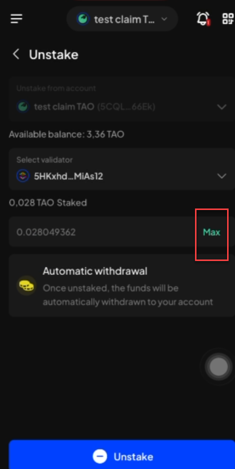

# Manual Test Report — EPIC-42 — 2026-09-30

| Field | Value |
|---|---|
| Epic | EPIC-42 — QA Coverage Tracking |
| Date | 2026-09-30 |
| Tester | MaiThuongNinni |
| Environment | Mobile — Android + iOS |
| Runner | manual (mobile) |
| Build under test | to fill in — build number + web-runner version |
| Stories tested | US-42.24.19, US-42.24.20 |
| Total bugs found | 1 |
| P0 | 0 |
| P1 | 0 |
| P2 | 0 |
| P3 | 1 |
| Status | in progress |

---

## US-42.24.19 — Full wallet regression, round 3

Round 2 closed on [2026-09-29](../2026-09-29/report-manual.md) at 83 of 85 lines on each platform, with no P1 left in the programme. Round 3 opened today on the build going to beta, with the ticks cleared and the lines unchanged.

Round 2 ran against web-runner versions as each one landed, over several weeks and several builds. The beta is one build carrying all of it, so a check that passed on the build where its feature landed has not yet been run on the build that ships. That is what this round is for, and it is the last run on the development build before [US-42.27](../../../../sprints/stories/US-42.27-qc-release-mobile.md) takes the same checklist to TestFlight and the Google Play beta track.

The two skipped lines stay skipped for the same reasons: REG-32, because NFTs are auto-detected so removing one no longer does anything, and REG-76, because the Polkadot API key that history check needs no longer works.

### AC results

| AC | Description | Result | Notes |
|---|---|---|---|
| REG-I-33 | The earning options list; the earning positions list; position detail; earning instructions | ✅ Pass | iOS |
| REG-I-34 | Stake — direct nomination; nomination pool; liquid stake; subnet staking | ✅ Pass | iOS |
| REG-I-35 | Stake more | ✅ Pass | iOS |
| REG-I-36 | Fast unstake — part of the position, and all of it | ✅ Pass | iOS |
| REG-I-37 | Slow unstake — part of the position, and all of it | ✅ Pass | iOS — BUG-42.24.19-27 is on this screen, but it is the Max button flickering, not the unstake |
| REG-I-38 | Cancel unstake; withdraw; claim rewards | ✅ Pass | iOS |
| REG-I-80 | Parachain (collator) staking — start staking; stake more; claim rewards; unstake; cancel unstake; withdraw | ✅ Pass | iOS |
| REG-I-81 | Change validator — on direct nomination, and on subnet staking | ✅ Pass | iOS |
| REG-I-39 | Connect to a substrate dApp; connect to an EVM dApp; block and unblock a dApp | ✅ Pass | iOS |
| REG-I-40 | Sign a message or transaction with a substrate account; with an EVM account; with an EVM account using a substrate provider | ✅ Pass | iOS |
| REG-I-41 | The mission pool list; search; filter; status; tabs | ✅ Pass | iOS |
| REG-I-42 | Sorting by status — live, upcoming, archived — and by ordinal low to high, matching the Extension | ✅ Pass | iOS |
| REG-I-43 | View mission pool details; the actions inside a mission pool go where they should; scroll up and down, left and right | ✅ Pass | iOS |
| REG-I-44 | The backup reminder popup — learn how to back up; remind me later; do not show again | ✅ Pass | iOS |
| REG-I-45 | Back up the seed phrase through export account | ✅ Pass | iOS |
| REG-I-50 | Change the currency, and the select currency popup | ✅ Pass | iOS |
| REG-I-51 | Change the language, and search within the language list | ✅ Pass | iOS |
| REG-I-52 | Turn in-app notifications off and on. Wallet theme is coming soon and is not checked | ✅ Pass | iOS |
| REG-I-60 | Create a new connection on a supported network, and on one that is not supported | ✅ Pass | iOS |
| REG-I-61 | Search; website detail; sign a message or transaction with a substrate and an EVM account; disconnect | ✅ Pass | iOS |
| REG-I-57 | Search website; filter; the list of connected websites; scroll the list | ✅ Pass | iOS |
| REG-I-58 | Connected website detail — search account; turn an account off and on; block; forget; disconnect all; connect all; unblock | ✅ Pass | iOS |
| REG-I-59 | dApp configuration — forget all; disconnect all; connect all | ✅ Pass | iOS |

23 of 85 iOS lines done. Android has not started this round.

### Bugs

| ID | Title | Steps to reproduce | Actual | Expected | Severity | Status | Screenshot |
|---|---|---|---|---|---|---|---|
| BUG-42.24.19-27 | The amount field flickers several times when Max is tapped on the Unstake screen (iOS) | Earning → open a Bittensor native staking position → Unstake → select a validator → tap Max | The field flashes several times before it settles on the staked amount, rather than filling once. It lands on the right figure, so this is what the user sees rather than what is sent | Tapping Max fills the field once, with no flicker | P3 | todo |  |

The first bug of round 3, and the first on the Unstake screen. BUG-42.24.19-19 was the same symptom — a spinner on every keystroke — but on the subnet staking change-validator screen and driven by typing, not by the Max button; it was fixed and verified in round 2.

## US-42.24.20 — Verify the bugs found during this update

One bug is open coming into today: BUG-42.24.19-26, P2 on iOS, the close button on Settings often not responding to the first tap.

### Bugs rechecked

| Item | Found in | Severity | What it is | State |
|---|---|---|---|---|

## Summary

Session in progress.
