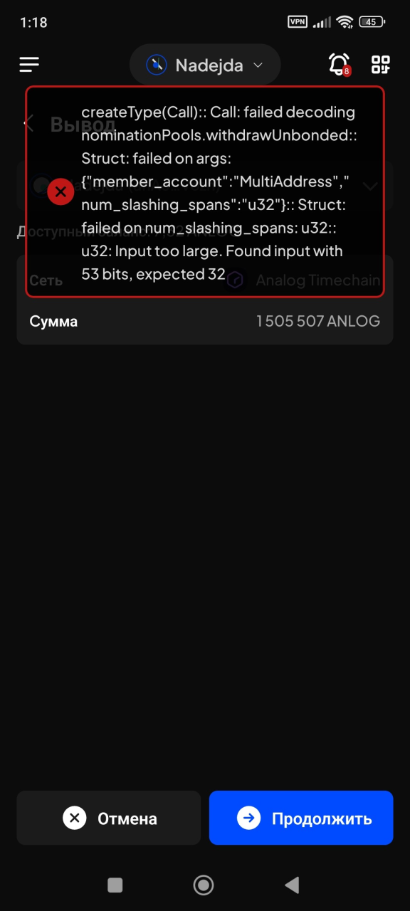
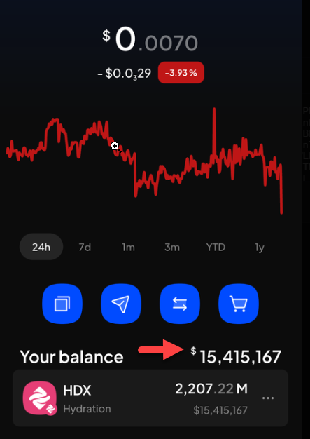
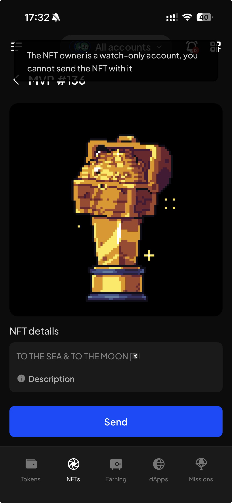

# Manual Test Report — EPIC-42 — 2026-10-01

| Field | Value |
|---|---|
| Epic | EPIC-42 — QA Coverage Tracking |
| Date | 2026-10-01 |
| Tester | MaiThuongNinni |
| Environment | Mobile — Android + iOS |
| Runner | manual (mobile) |
| Build under test | to fill in — build number + web-runner version |
| Stories tested | US-42.24.19, US-42.24.20 |
| Total bugs found | 4 |
| P0 | 0 |
| P1 | 1 |
| P2 | 0 |
| P3 | 3 |
| Status | done |

---

## US-42.24.19 — Full wallet regression, round 3

Carried on from [2026-09-30](../../2026-09/2026-09-30/report-manual.md), which reached 52 of 85 iOS lines. Android has not started this round.

### AC results

| AC | Description | Result | Notes |
|---|---|---|---|
| REG-I-1 | Create an account with a new seed phrase — unified account; TON account | ✅ Pass | iOS |
| REG-I-2 | Derive an account from the create account screen — unified account; substrate type; ethereum type | ✅ Pass | iOS |
| REG-I-3 | Derive an account from account details | ✅ Pass | iOS |
| REG-I-4 | Import an account — seed phrase; JSON file single; JSON file multi covering normal, QR and watch-only; QR code substrate; QR code EVM; private key | ✅ Pass | iOS |
| REG-I-78 | Import from Trust Wallet | ✅ Pass | iOS |
| REG-I-5 | Attach an account — polkadot vault; keystone; watch-only | ✅ Pass | iOS |
| REG-I-6 | Export an account — every account family and type, and the exported file imports back | ✅ Pass | iOS |
| REG-I-7 | Proxy account — add a proxy; remove a proxy; view the proxy list; act through a proxy | ✅ Pass | iOS |
| REG-I-8 | Multisig account — create one; open its details; approve and reject a pending transaction; sign for a multisig | ✅ Pass | iOS |
| REG-I-9 | Remove an account | ✅ Pass | iOS |
| REG-I-10 | Edit an account name | ✅ Pass | iOS |
| REG-I-84 | Account details — the name, the address per network with QR and copy, the account family and type | ✅ Pass | iOS |
| REG-I-38 | Cancel unstake; withdraw; claim rewards | ✅ Pass | iOS — rerun on the fixed build, the line BUG-42.24.19-28 was found on |
| REG-I-46 | All accounts mode — select account; search account; scroll the account list | ✅ Pass | iOS |
| REG-I-47 | Separate account mode does not show the account picker | ✅ Pass | iOS |
| REG-I-48 | Search network; scroll the network list; select network; filter | ✅ Pass | iOS |
| REG-I-49 | The explorer link opens from a history record | ✅ Pass | iOS |
| REG-I-53 | Change the wallet password — current; new; confirm; the I understand checkbox; the learn more link; save | ✅ Pass | iOS |
| REG-I-54 | Require unlock — change the auto-lock time; the wallet auto-locks | ✅ Pass | iOS |
| REG-I-55 | Face ID or Touch ID — turn the toggle off; turn it on by password; turn it on by face or touch scan | ✅ Pass | iOS |
| REG-I-56 | Sign for multiple transactions — turn the toggle on and off | ✅ Pass | iOS |
| REG-I-62 | Search network; filter network; turn a network on and off | ✅ Pass | iOS |
| REG-I-63 | Import a custom network; import a provider; switch provider | ✅ Pass | iOS |
| REG-I-64 | Remove a custom network with the network on, and with it off | ✅ Pass | iOS |
| REG-I-65 | Define a network — add a provider; switch provider | ✅ Pass | iOS |
| REG-I-66 | Import a token with the network on and with it off — select network; select token type; type the contract address; scan it by QR | ✅ Pass | iOS |
| REG-I-67 | Remove a custom token with the token on, and with it off | ✅ Pass | iOS |
| REG-I-68 | Search token; filter token; turn a token on and off; token detail | ✅ Pass | iOS |
| REG-I-69 | Add an address; remove one; edit a name; search and filter | ✅ Pass | iOS |
| REG-I-70 | Migrate solo accounts to a unified account — the migration runs to the end, and every migrated account can still sign afterwards | ✅ Pass | iOS |
| REG-I-75 | After upgrading, accounts, balances, NFTs, staking and earning positions, dApp connections and settings are all still there and correct | ✅ Pass | iOS |
| REG-I-77 | No screen is broken where a removed feature used to be — Crowdloans, Polygon zkEVM, stDOT, the old Bittensor root claim | ✅ Pass | iOS |

iOS finishes round 3 at 83 of 85, with REG-I-32 and REG-I-76 skipped for the reasons they carried through round 2. Android has not started.

REG-I-38 is included above. It was ticked on 09-30, cleared today when BUG-42.24.19-28 was found on it, and ticked again after the fix — so the tick now stands on a run of the fixed build rather than one that predates the bug.

### Bugs

| ID | Title | Steps to reproduce | Actual | Expected | Severity | Status | Screenshot |
|---|---|---|---|---|---|---|---|
| BUG-42.24.19-28 | Withdrawing from a nomination pool fails to encode, so the funds cannot be withdrawn | Earning → open a nomination pool position on Analog Timechain with an unstake that has finished its unbonding period → Withdraw → the error appears before the transaction is sent | An error replaces the screen: `createType(Call):: Call: failed decoding nominationPools.withdrawUnbonded:: Struct: failed on args: {"member_account":"MultiAddress","num_slashing_spans":"u32"}:: Struct: failed on num_slashing_spans: u32:: u32: Input too large. Found input with 53 bits, expected 32`. The call never reaches the chain, so the unstaked funds stay locked with no way to take them out. Both platforms | The withdrawal is built and submitted, and the funds arrive in the account | P1 | fixed |  |
| BUG-42.24.19-29 | The dollar sign on Your balance is drawn too large | Tokens → open the HDX token detail screen → look at the dollar sign on the Your balance row | The `$` is drawn larger than it should be. Both platforms | The `$` is drawn at the right size | P3 | todo |  |
| BUG-42.24.19-30 | The watch-only warning on NFT details is the wrong colour | NFTs → open an NFT held by a watch-only account → open its details → tap Send → look at the message that appears | The message "The NFT owner is a watch-only account, you cannot send the NFT with it" is the wrong colour | The message is the colour a warning should be | P3 | todo |  |
| BUG-42.24.19-31 | The app sometimes takes several seconds to move to the next screen | Use the app normally and tap something that opens another screen | The next screen takes a few seconds to appear instead of opening straight away. It does not happen every time | The next screen opens without a wait | P3 | todo | — |

## US-42.24.20 — Verify the bugs found during this update

### Bugs rechecked

| Item | Found in | Severity | What it is | State |
|---|---|---|---|---|
| BUG-42.24.19-26 | US-42.24.19 | P2 | The close button on the Settings screen often did not respond to the first tap (iOS) | ✅ Fixed — the button responds every time |
| BUG-42.24.19-27 | US-42.24.19 | P3 | The amount field flickered several times when Max was tapped on the Unstake screen (iOS) | ✅ Fixed — the field fills once |
| BUG-42.24.19-28 | US-42.24.19 | P1 | Withdrawing from a nomination pool failed to encode, so the funds could not be withdrawn | ✅ Fixed — the withdrawal is built and submitted |
| → REG-I-38 | US-42.24.19 | — | Cancel unstake; withdraw; claim rewards | ✅ Rerun on the fixed build, passes on iOS |

Every bug carried into today is now settled: 79 fixed, 6 closed no fix. The two from rounds 1 and 2 were the last of those, and today's P1 was fixed the same day. Three bugs are open — BUG-42.24.19-29, -30 and -31, all logged today and all P3.

REG-38 is the line BUG-42.24.19-28 was found on. Its iOS tick from 09-30 predated the bug, so it was cleared and run again on the fixed build. REG-A-38 still has to run when Android starts.

## Summary

Four bugs logged. BUG-42.24.19-28, a P1, was found and fixed the same day — withdrawing from a nomination pool could not be encoded, so funds that had finished unbonding could not be collected. Three P3s are open: BUG-42.24.19-29, the dollar sign on the Your balance row drawn too large; BUG-42.24.19-30, the watch-only warning on NFT details in the wrong colour; and BUG-42.24.19-31, the app sometimes taking several seconds to move to the next screen.

The two bugs carried in from 2026-09-30 are both verified fixed: the Settings close button on iOS, and the Max button flicker on the Unstake screen.

The programme now reads 88 rows — 79 fixed, 6 closed no fix, 3 open.

iOS finished round 3 today, at 83 of 85 with REG-I-32 and REG-I-76 skipped — the same two the round carried from the start, both for reasons outside the build. The remaining 32 lines all passed in this session, including the whole Manage account section, Security settings, Manage network, Manage token, History and the upgrade lines. Android has not started round 3.

REG-I-38 was run twice today: the tick from 09-30 was cleared when the P1 was found on that line, and it was run again on the fixed build. REG-A-38 is owed when Android starts.
