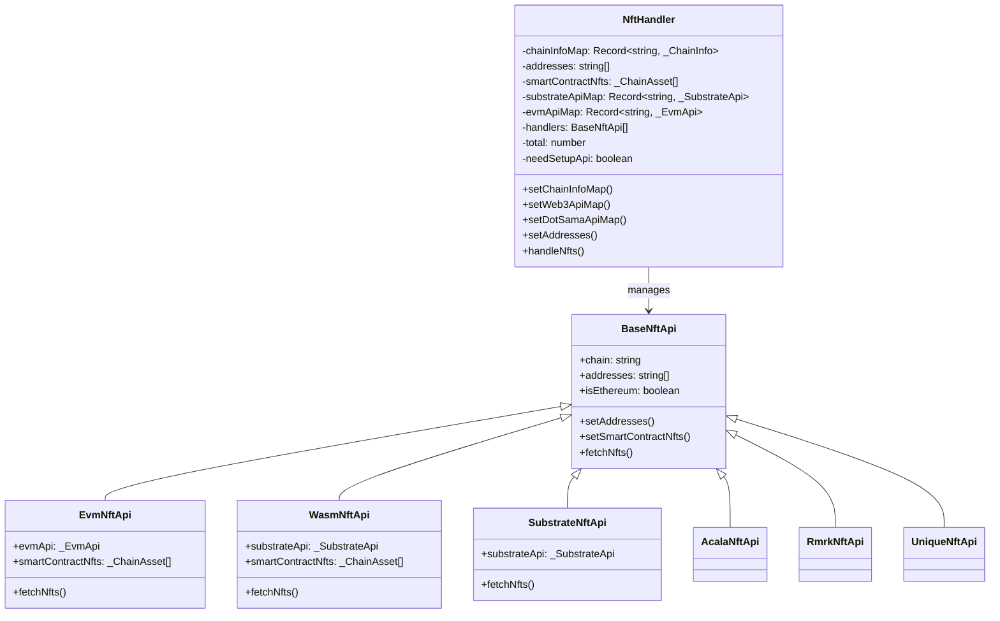
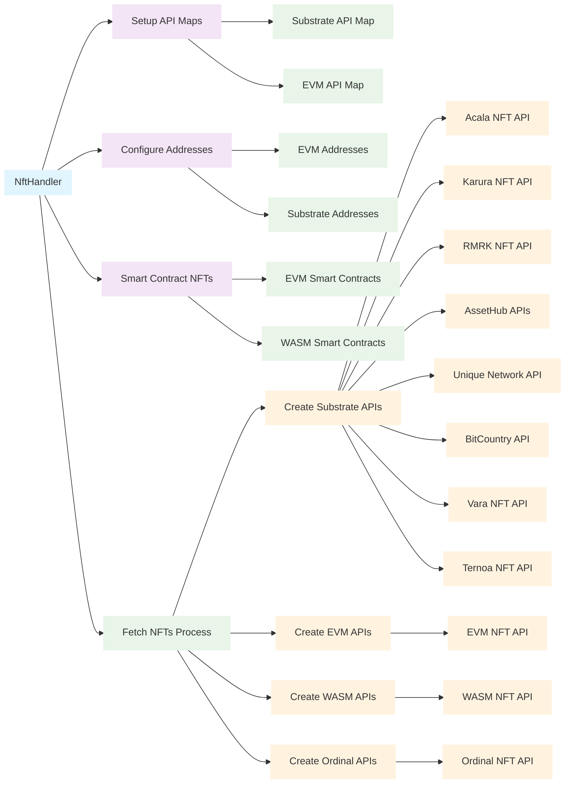
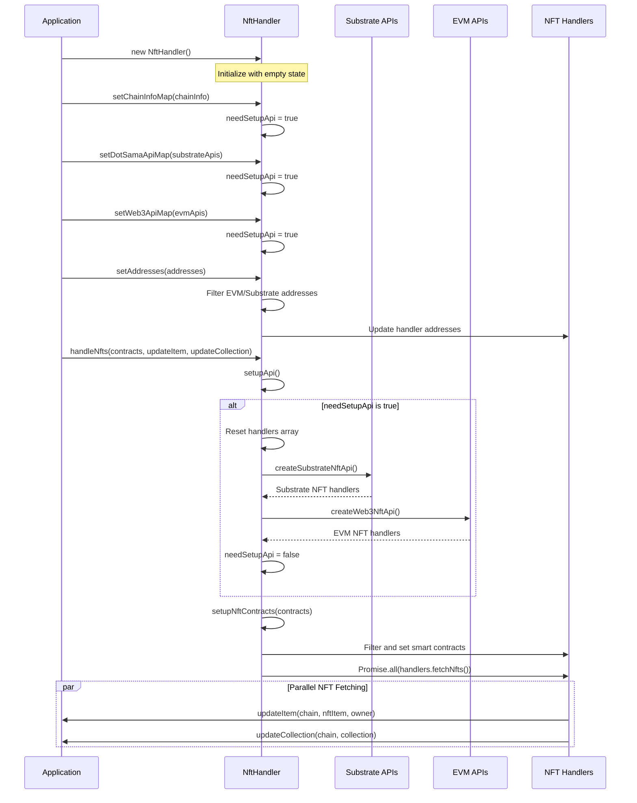
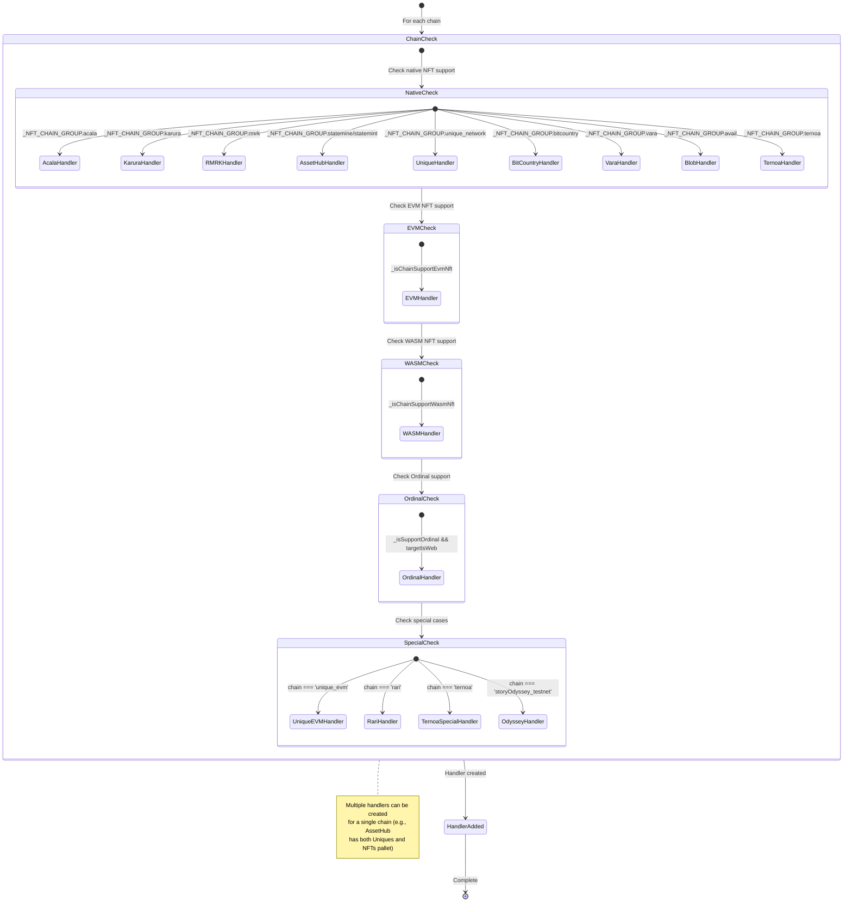

# NFT Service Documentation

## Overview

The NFT Service provides comprehensive NFT (Non-Fungible Token) management functionality across multiple blockchain networks. It handles NFT collection and item data, supports various NFT standards, and provides unified access to NFTs across different chain types including Substrate, EVM, and specialized protocols.

**Purpose**: Centralized NFT data management, cross-chain NFT support, and unified NFT operations
**Scope**: NFT collection management, item tracking, multi-chain NFT protocol support, and data synchronization

## Architecture

### High-Level Structure



### Service Integration



### Component Roles

#### NftHandler Core Components

- **API Management**: Manages Substrate and EVM API connections for different chains
- **Address Handling**: Processes and distributes addresses based on chain types
- **Protocol Support**: Handles multiple NFT protocols and standards
- **Data Coordination**: Orchestrates NFT fetching across multiple handlers

#### Current Service Components

- **[NftHandler](./index.ts)**: Main orchestrator for NFT operations across chains
- **[BaseNftApi](./nft.ts)**: Abstract base class for all NFT API implementations
- **[EvmNftApi](./evm_nft.ts)**: Handles EVM-based NFT protocols (ERC-721, ERC-1155)
- **[WasmNftApi](./wasm_nft.ts)**: Manages WASM smart contract NFTs
- **[Substrate-specific APIs](./acala_nft.ts)**: Chain-specific NFT implementations

## Props

### NftHandler Properties

| Name | Purpose | Type |
|------|---------|------|
| `chainInfoMap` | Maps chain slugs to chain information | `Record<string, _ChainInfo>` |
| `addresses` | User addresses for NFT queries | `string[]` |
| `smartContractNfts` | Smart contract NFT asset configurations | `_ChainAsset[]` |
| `substrateApiMap` | Substrate API connections by chain | `Record<string, _SubstrateApi>` |
| `evmApiMap` | EVM API connections by chain | `Record<string, _EvmApi>` |
| `handlers` | Active NFT API handlers | `BaseNftApi[]` |
| `total` | Total NFT count across all chains | `number` |
| `needSetupApi` | Flag indicating API setup requirement | `boolean` |

*Reference: [NftHandler class definition](./index.ts#L60-L69)*

### NFT Data Interfaces

| Name | Purpose | Type |
|------|---------|------|
| `NftCollection` | Collection metadata and information | Interface from KoniTypes |
| `NftItem` | Individual NFT item data | Interface from KoniTypes |
| `NftJson` | Complete NFT state structure | Interface from KoniTypes |

*Reference: [NFT type definitions](../../background/KoniTypes.ts)*

## Methods

### Core Configuration Methods

#### `setChainInfoMap(chainInfoMap: Record<string, _ChainInfo>)`

**Purpose**: Updates chain information mapping and triggers API setup
**Input**: Chain information mapped by chain slug
**Output**: None (void)
**Error Handling**: Sets needSetupApi flag for lazy initialization

*Source: [NftHandler.setChainInfoMap](./index.ts#L71-L74)*

#### `setWeb3ApiMap(web3ApiMap: Record<string, _EvmApi>)`

**Purpose**: Updates EVM API mapping for NFT operations
**Input**: EVM API instances mapped by chain slug
**Output**: None (void)
**Error Handling**: Sets needSetupApi flag for lazy initialization

*Source: [NftHandler.setWeb3ApiMap](./index.ts#L76-L79)*

#### `setDotSamaApiMap(dotSamaAPIMap: Record<string, _SubstrateApi>)`

**Purpose**: Updates Substrate API mapping for NFT operations
**Input**: Substrate API instances mapped by chain slug
**Output**: None (void)
**Error Handling**: Sets needSetupApi flag for lazy initialization

*Source: [NftHandler.setDotSamaApiMap](./index.ts#L81-L84)*

#### `setAddresses(addresses: string[])`

**Purpose**: Updates addresses and distributes them to appropriate handlers
**Input**: Array of user addresses
**Output**: None (void)
**Error Handling**: Automatically filters addresses by chain type

**Implementation Details**:
- Separates EVM and Substrate addresses using `getAddressesByChainType`
- Updates existing handlers with appropriate address types
- Maintains address type compatibility per handler

*Source: [NftHandler.setAddresses](./index.ts#L86-L97)*

### NFT Data Management Methods

#### `handleNfts(nftContracts, updateItem, updateCollection)`

**Purpose**: Main NFT fetching orchestrator across all configured chains
**Input Parameters**:
- `nftContracts` (_ChainAsset[]): Smart contract NFT configurations
- `updateItem` (function): Callback for NFT item updates
- `updateCollection` (function): Callback for NFT collection updates

**Output**: Promise<void>
**Error Handling**: Catches and logs setup errors, continues with available handlers

**Implementation Details**:
- Calls `setupApi()` to initialize handlers
- Calls `setupNftContracts()` to configure smart contract NFTs
- Executes all handlers in parallel using `Promise.all()`
- Each handler receives update callbacks for real-time data processing

*Source: [NftHandler.handleNfts](./index.ts#L174-L184)*

### Private Setup Methods

#### `setupApi()`

**Purpose**: Initializes NFT API handlers based on chain configurations
**Input**: None (uses instance properties)
**Output**: None (void)
**Error Handling**: Try-catch block with console error logging

**Implementation Details**:
- Only runs when `needSetupApi` is true
- Creates handlers for each supported chain type:
  - Native NFT support via `createSubstrateNftApi`
  - EVM NFT support via `createWeb3NftApi`
  - WASM NFT support via `createWasmNftApi`
  - Ordinal support via `createOrdinalApi`
- Handles special cases for unique_evm, rari, ternoa, and storyOdyssey_testnet chains
- Sets `needSetupApi` to false after completion

*Source: [NftHandler.setupApi](./index.ts#L111-L172)*

#### `setupNftContracts(smartContractNfts: _ChainAsset[])`

**Purpose**: Configures smart contract NFTs for EVM and WASM handlers
**Input**: Array of smart contract NFT asset configurations
**Output**: None (void)
**Error Handling**: No explicit error handling

**Implementation Details**:
- Filters NFT contracts by origin chain for each handler
- Only applies to EvmNftApi and WasmNftApi instances
- Updates handler-specific smart contract configurations

*Source: [NftHandler.setupNftContracts](./index.ts#L99-L109)*

## Flows

### NFT Service Lifecycle



### NFT Handler Creation Flow



## Notes

### Supported NFT Protocols

1. **Substrate Native NFT Protocols**:
   - **Acala/Karura**: Substrate-based NFT pallets with custom implementations
   - **RMRK**: Recursive Multi-Resource Komposable NFTs protocol
   - **AssetHub**: Polkadot/Kusama AssetHub Uniques and NFTs pallets
   - **Unique Network**: Specialized NFT blockchain with advanced features
   - **BitCountry**: Virtual world NFT implementations
   - **Vara**: Smart contract-based NFT platform
   - **Ternoa**: Decentralized NFT marketplace protocol

2. **EVM NFT Standards**:
   - **ERC-721**: Standard non-fungible token interface
   - **ERC-1155**: Multi-token standard supporting both fungible and non-fungible tokens

3. **Specialized Protocols**:
   - **WASM Smart Contracts**: ink! and other WASM-based NFT contracts
   - **Bitcoin Ordinals**: Bitcoin-based NFT inscriptions
   - **Blob Inscriptions**: Avail DA layer NFT implementations

*Reference: [NFT chain groups configuration](../../../services/chain-service/constants.ts)*

### Known Issues

1. **API Setup Timing**: The `needSetupApi` flag approach may cause race conditions in high-frequency updates
2. **Error Propagation**: Limited error handling in parallel NFT fetching may mask individual handler failures
3. **Memory Management**: Large NFT collections may impact memory usage without pagination

### Future Improvements

1. **Batch Processing**: Implement batched NFT fetching for performance optimization
2. **Caching Strategy**: Add intelligent caching for NFT metadata and collection data
3. **Real-time Updates**: Implement WebSocket connections for real-time NFT transfer notifications
4. **Filtering System**: Add advanced filtering and search capabilities for NFT collections

### Integration Dependencies

- **[ChainService](../../../services/chain-service)**: Provides chain information and API connections
- **[BalanceService](../../../services/balance-service)**: May integrate for NFT-related token balances
- **[DatabaseService](../../../services/storage-service)**: Stores NFT collection and item data
- **[EventService](../../../services/event-service)**: Emits NFT-related events

### Related Services

- **[KoniState](../../background/handlers/State.ts)**: Main state handler with NFT integration methods
- **[Subscription Service](../../background/subscription)**: Handles NFT data subscriptions
- **[Cron Service](../../background/cron)**: Manages periodic NFT data updates

*For detailed handler implementations, see individual NFT API files in the current directory*

## Smart Contract Integration Patterns

### ERC-721 Standard (EVM Chains)

#### EvmNftApi Implementation
**Data Source**: Direct smart contract calls via Web3
**Standard**: ERC-721 NFT Standard
**Integration Pattern**: Contract ABI + Method Calls

**Key Methods Used**:
- `balanceOf(address)`: Get NFT count for owner
- `tokenOfOwnerByIndex(address, index)`: Enumerate owned tokens
- `tokenURI(tokenId)`: Get metadata URI for token
- `ownerOf(tokenId)`: Verify token ownership

**Implementation Details**:
```typescript
// Direct contract interaction pattern
const contract = new this.evmApi.api.eth.Contract(_ERC721_ABI, smartContract);
const balance = await contract.methods.balanceOf(address).call();
const tokenId = await contract.methods.tokenOfOwnerByIndex(address, i).call();
const tokenURI = await contract.methods.tokenURI(tokenId).call();
```

*Source: [EvmNftApi implementation](./evm_nft/index.ts#L75-L115)*

### PSP34 Standard (WASM Contracts)

#### WasmNftApi Implementation
**Data Source**: ink! Smart Contract Queries via Polkadot.js
**Standard**: PSP34 (Polkadot Standards Proposal 34)
**Integration Pattern**: Contract Promise + Query Methods

**Key Methods Used**:
- `psp34::balanceOf(owner)`: Get token count
- `psp34Enumerable::ownersTokenByIndex(owner, index)`: Token enumeration
- `psp34Metadata::getAttribute(id, key)`: Get token metadata
- `psp34Traits::getAttributeCount()`: Check on-chain attributes
- `psp34Traits::getAttributes(id, keys)`: Bulk attribute retrieval

**On-Chain vs Off-Chain Metadata Detection**:
```typescript
// Check if attributes are stored on-chain
const _onChainAttributeCount = await contractPromise.query['psp34Traits::getAttributeCount'](
  this.addresses[0],
  { gasLimit: getDefaultWeightV2(this.substrateApi?.api as ApiPromise) }
);
```

**Token URI Resolution**:
```typescript
// Multiple URI method support
const _tokenUri = await contractPromise.query[getTokenUriMethod(contractPromise.address.toString())](
  address,
  { gasLimit: getDefaultWeightV2(this.substrateApi?.api as ApiPromise) },
  isAzeroDomainNft(contractPromise.address.toString()) ? { bytes: tokenId } : tokenId
);
```

*Source: [WasmNftApi implementation](./wasm_nft/index.ts#L35-L180)*

### Native Substrate Pallets

#### Substrate-based NFT Systems
**Data Source**: Direct chain state queries
**Standards**: Various substrate pallets (ormlNFT, nfts, uniques)
**Integration Pattern**: Runtime API calls

**Acala/Karura (ormlNFT)**:
```typescript
// Query tokens by owner
const resp = await this.substrateApi.api.query.ormlNFT.tokensByOwner.keys(address);
// Get collection metadata
const metadataCollection = await this.substrateApi.api.query.ormlNFT.classes(collectionId);
// Get token details
const tokenInfo = await this.substrateApi.api.query.ormlNFT.tokens(classId, tokenId);
```

*Source: [AcalaNftApi](./acala_nft/index.ts#L75-L85), [KaruraNftApi](./karura_nft/index.ts#L60-L75)*

**AssetHub (NFTs Pallet)**:
```typescript
// Modern NFTs pallet queries
const resp = await this.substrateApi.api.query.nfts.account.keys(address);
const metadataNft = await this.substrateApi.api.query.nfts.itemMetadataOf(classId, tokenId);
const collectionMetadata = await this.substrateApi.api.query.nfts.collectionMetadataOf(collectionId);
```

*Source: [AssetHubNftsPalletApi](./assethub_nft/index.ts#L85-L95)*

## GraphQL Integration Patterns

### Vara Network
**Service**: Vara Scan GraphQL API
**Endpoint**: `https://api.vara.network/graphql`
**Pattern**: GraphQL queries with account-based NFT retrieval

**Query Structure**:
```graphql
query MyQuery {
  accountById(id: "${publicKey}") {
    nfts {
      id, mediaUrl, name, tokenId, attribUrl, description
      collection { id, name, description }
    }
  }
}
```

**Implementation**:
```typescript
const resp = await fetch(this.endpoint, {
  method: 'post',
  headers: { 'Content-Type': 'application/json' },
  body: JSON.stringify(VaraNftApi.parseNftRequest(publicKey))
});
```

*Source: [VaraNftApi](./vara_nft/index.ts#L30-L55)*

### Unique Network Family
**Service**: Chain-specific GraphQL endpoints
**Endpoints**:
- Unique: `https://api.unique.network/graphql`
- Quartz: `https://api.quartz.unique.network/graphql`
- Opal: `https://api.opal.unique.network/graphql`

**Query Pattern**:
```graphql
query {
  tokens(limit: 99999, offset: 0, where: {
    owner: { _eq: "${uniqueAddress}" },
    burned: { _eq: "false" }
  }) {
    data {
      collection_id, collection_name, token_id, token_name,
      image, attributes, collection_cover
    }
  }
}
```

**Address Encoding per Network**:
```typescript
// Network-specific address encoding
if (['unique_network'].includes(this.chain)) {
  uniqueAddress = encodeAddress(decodeAddress(address), 7391); // Unique prefix
} else if (['quartz'].includes(this.chain)) {
  uniqueAddress = encodeAddress(decodeAddress(address), 255);  // Quartz prefix
} else if (['opal'].includes(this.chain)) {
  uniqueAddress = address; // Native address format
}
```

*Source: [UniqueNftApi](./unique_network_nft/index.ts#L55-L85)*

## REST API Integration Patterns

### Rarible Protocol
**Service**: Rarible API
**Authentication**: API Key based
**Pattern**: REST API with pagination and rate limiting

**Endpoint Pattern**:
```
GET https://api.rarible.org/v0.1/items/byOwner?blockchains=RARI&owner=ETHEREUM:${address}&size=5000
```

**Rate Limiting Implementation**:
```typescript
// Batch processing with rate limiting
const size = 4; // Process 4 addresses per batch
const waitTime = 1000; // 1 second delay between batches

for (let i = 0; i < this.addresses.length; i += size) {
  const group = this.addresses.slice(i, i + size);
  await Promise.all(group.map(async (address) => { /* process */ }));

  if (i + size < this.addresses.length) {
    await this.wait(waitTime);
  }
}
```

*Source: [RariNftApi](./rari/index.ts#L50-L70)*

### ArtZero Integration (WASM Featured Collections)
**Service**: ArtZero marketplace API
**Pattern**: POST requests with collection verification
**Chain Support**: Aleph Zero and compatible networks

**Featured Collection Detection**:
```typescript
const urlencoded = new URLSearchParams();
urlencoded.append('collection_address', contractAddress);

const collectionInfo = await fetch(collectionApiFromArtZero(networkKey), {
  method: 'POST',
  headers: { 'Content-Type': 'application/x-www-form-urlencoded' },
  body: urlencoded
});
```

**IPFS Content Processing**:
```typescript
// ArtZero IPFS gateway integration
const nftItemImageSrc = `${itemImageApiFromArtZero(this.chain)}?input=${parsedTokenUri}&size=500`;
const collectionImageUrl = await fetch(nftItemImageSrc);
```

*Source: [WasmNftApi ArtZero integration](./wasm_nft/index.ts#L20-L45)*

### RMRK Protocol
**Service**: Kodadot/RMRK GraphQL API
**Endpoint**: `https://kanaria.graphcdn.app/`
**Pattern**: GraphQL with RMRK-specific queries

*Source: [RmrkNftApi](./rmrk_nft/index.ts)*

## Metadata Resolution Patterns

### IPFS Integration
**Common Pattern**: Multiple IPFS gateway support with fallback

```typescript
// Standard IPFS URL parsing
parseUrl(input: string): string | undefined {
  if (isUrl(input)) return input;
  if (input.includes('ipfs://')) {
    return getRandomIpfsGateway() + input.split('ipfs://')[1];
  }
  return getRandomIpfsGateway() + input;
}
```

### HTTP Metadata Fetching
**Pattern**: Fetch JSON metadata from resolved URIs

```typescript
// Standard metadata fetching pattern
const resp = await fetch(detailUrl);
const itemDetail = (resp && resp.ok && await resp.json() as Record<string, any>);

// Parse standard NFT metadata fields
const parsedNft = {
  name: itemDetail.name,
  description: itemDetail.description,
  image: this.parseUrl(itemDetail.image),
  properties: this.parseAttributes(itemDetail.attributes)
};
```

## Protocol-Specific Implementations

### Bitcoin Ordinals
**Service**: Subscan Ordinal API
**Pattern**: REST API with inscription tracking
**Target**: Web platform only

*Source: [OrdinalNftApi](./ordinal_nft/index.ts)*

### Blob Inscriptions (Avail)
**Service**: Avail DA layer integration
**Pattern**: Data availability sampling

*Source: [BlobInscriptionApi](./blobinscription/index.ts)*

### Ternoa Protocol
**Service**: Ternoa indexer + IPFS
**Pattern**: Hybrid substrate + external API

*Source: [TernoaNftApi](./ternoa_nft/index.ts)*

## Error Handling Patterns

### Timeout Management
```typescript
// Common timeout pattern for external APIs
const timeout = new Promise((resolve) => {
  const id = setTimeout(() => {
    clearTimeout(id);
    resolve(null);
  }, 3000);
});

const result = await Promise.race([timeout, apiCall]);
```

### Graceful Degradation
```typescript
// Continue processing even if individual items fail
try {
  await processNftItem(item);
} catch (e) {
  console.error(`${this.chain}`, e);
  // Continue with next item
}
```

## Integration Summary

| Handler | Smart Contract | GraphQL | REST API | Standard |
|---------|---------------|---------|----------|----------|
| **EvmNftApi** | ✅ ERC-721 Direct | ❌ | ❌ | ERC-721 |
| **WasmNftApi** | ✅ PSP34 Queries | ❌ | ✅ ArtZero API | PSP34 |
| **AcalaNftApi** | ✅ ormlNFT Pallet | ❌ | ❌ | Substrate Native |
| **VaraNftApi** | ❌ | ✅ Vara Scan | ❌ | Vara Protocol |
| **UniqueNftApi** | ❌ | ✅ Multi-endpoint | ❌ | Unique Standard |
| **RariNftApi** | ❌ | ❌ | ✅ Rarible API | Multi-chain |
| **RmrkNftApi** | ❌ | ✅ Kodadot API | ❌ | RMRK Protocol |
| **OrdinalNftApi** | ❌ | ❌ | ✅ Subscan API | Bitcoin Ordinals |
