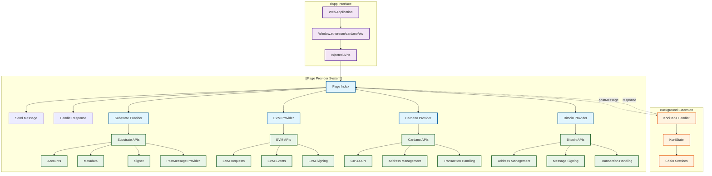
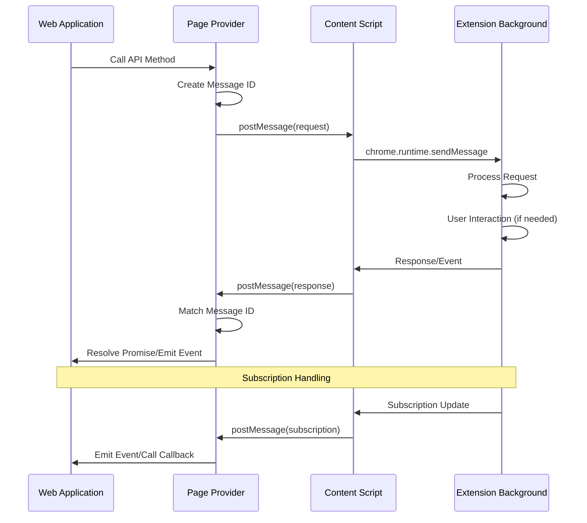
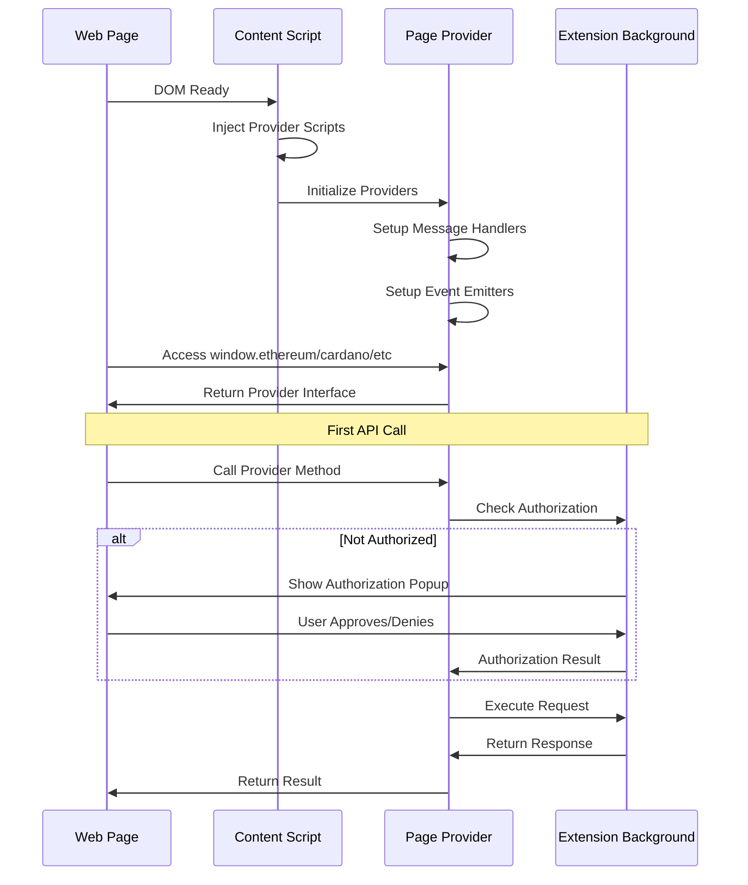
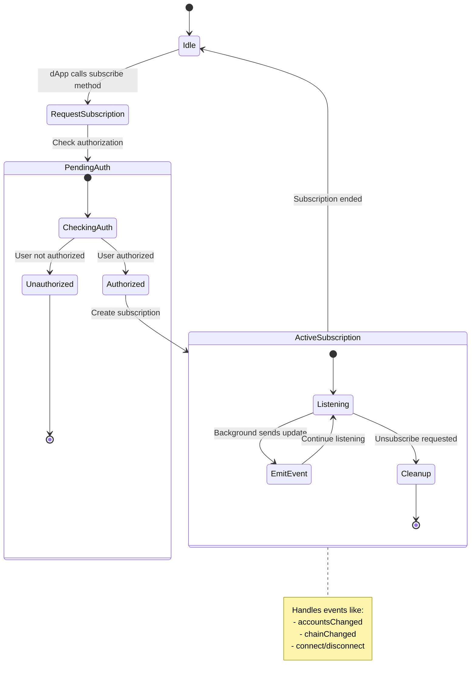
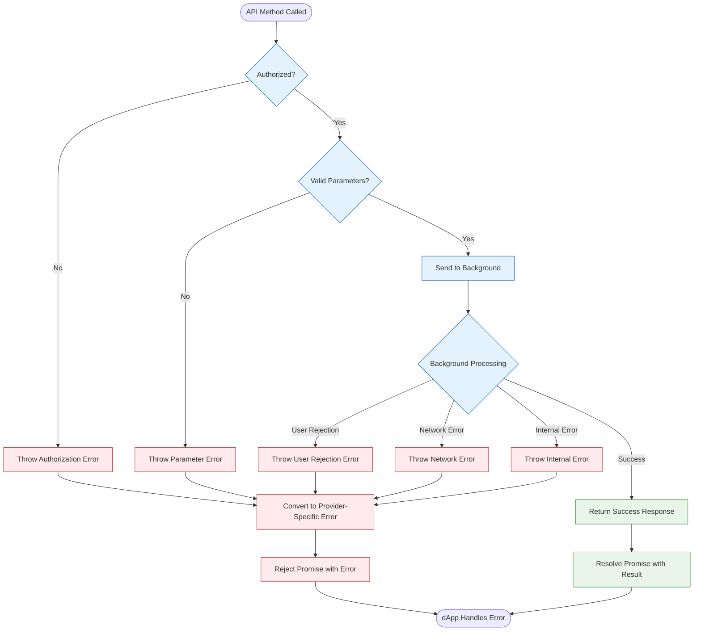

# dApp Providers Documentation

## Overview

The Page Providers system enables web applications (dApps) to interact with the SubWallet extension across multiple blockchain protocols. It provides a standardized interface for dApps to access wallet functionality including account management, transaction signing, and network operations.

**Purpose**: Client-side provider injection for seamless dApp-wallet integration  
**Scope**: Multi-chain provider support, standardized APIs, and secure communication protocols

## Architecture

### High-Level Structure

### Communication Flow

### Component Roles

#### Core Infrastructure

- **[Page Index](./index.ts)**: Main entry point and message orchestration
- **[Types](./types.ts)**: TypeScript interfaces for provider communication
- **[KoniTabs Handler](../koni/background/handlers/Tabs.ts)**: Background message processing

#### Protocol-Specific Providers

- **[Substrate Provider](./substrate/index.ts)**: Polkadot ecosystem integration
- **[EVM Provider](./evm/index.ts)**: Ethereum-compatible chain support
- **[Cardano Provider](./cardano/index.ts)**: Cardano blockchain integration
- **[Bitcoin Provider](./bitcoin/index.ts)**: Bitcoin network support

## Props

### Core Provider Properties

| Name | Purpose | Type |
|------|---------|------|
| `handlers` | Message handler registry | `Record<string, Handler>` |
| `sendMessage` | Message communication function | `SendRequest` |
| `version` | Provider version identifier | `string` |
| `isSubWallet` | SubWallet identification flag | `boolean` |

*Reference: [Page index handler registry](./index.ts#L31-L35)*

### SendRequest Interface

| Name | Purpose | Type |
|------|---------|------|
| `message` | Message type identifier | `MessageTypes` |
| `request` | Request payload data | `RequestTypes[TMessageType]` |
| `subscriber` | Subscription callback function | `(data: SubscriptionMessageTypes) => void` |

*Reference: [SendRequest type definition](./types.ts#L5-L9)*

### Provider-Specific Properties

#### Substrate Provider Properties
| Name | Purpose | Type |
|------|---------|------|
| `accounts` | Account management interface | `Accounts` |
| `metadata` | Chain metadata operations | `Metadata` |
| `provider` | RPC provider interface | `PostMessageProvider` |
| `signer` | Transaction signing interface | `Signer` |

*Reference: [Substrate provider implementation](./substrate/index.ts#L12-L19)*

#### EVM Provider Properties
| Name | Purpose | Type |
|------|---------|------|
| `isMetaMask` | MetaMask compatibility flag | `boolean` |
| `version` | Provider version string | `string` |
| `chainId` | Current chain identifier | `string` |
| `connected` | Connection status flag | `boolean` |

*Reference: [EVM provider interface](./evm/index.ts#L15-L25)*

## Methods

### Core Communication Methods

#### `sendMessage<TMessageType>(message, request?, subscriber?)`

**Purpose**: Universal message sending interface for dApp-extension communication  
**Input Parameters**:
- `message` (MessageTypes): Message type identifier
- `request` (RequestTypes, optional): Request payload
- `subscriber` (function, optional): Subscription callback

**Output**: Promise<ResponseTypes[TMessageType]>  
**Error Handling**: Rejects with ProviderError on communication failures

**Implementation Details**:
- Generates unique message ID for request tracking
- Uses postMessage for cross-context communication
- Supports both one-time requests and ongoing subscriptions
- Handles promise resolution/rejection based on response type

*Source: [sendMessage implementation](./index.ts#L37-L50)*

#### `handleResponse<TMessageType>(data)`

**Purpose**: Processes responses from extension background  
**Input**: TransportResponseMessage with response data  
**Output**: None (void)  
**Error Handling**: Routes errors to appropriate promise rejection

**Implementation Details**:
- Matches responses to pending requests using message ID
- Handles subscription data routing to callbacks
- Converts error responses to ProviderError instances
- Manages handler cleanup for completed requests

*Source: [handleResponse implementation](./index.ts#L87-L102)*

### Authentication and Authorization

#### `enable(origin, opt?)`

**Purpose**: Initiates connection between dApp and wallet  
**Input Parameters**:
- `origin` (string): dApp origin URL
- `opt` (AuthRequestOption, optional): Authentication options

**Output**: Promise<Injected> - Substrate provider instance  
**Error Handling**: Rejects if user denies authorization

**Implementation Details**:
- Supports multiple account authentication types
- Handles both substrate and EVM account access
- Triggers user authorization flow in extension
- Returns configured provider instance on success

*Source: [enable function](./index.ts#L54-L61)*

### Methods

#### Substrate Provider Methods

##### `accounts.get(anyType?)`
**Purpose**: Retrieves authorized substrate accounts  
**Input**: anyType (boolean, optional) - Include all account types  
**Output**: Promise<InjectedAccount[]>  
**Error Handling**: Returns empty array if not authorized

*Source: [Substrate accounts implementation](./substrate/Accounts.ts#L13-L15)*

##### `signer.signPayload(payload)`
**Purpose**: Signs substrate extrinsic payloads  
**Input**: SignerPayloadJSON - Transaction payload  
**Output**: Promise<SignerResult> - Signature and metadata  
**Error Handling**: Rejects if user cancels or signing fails

*Source: [Substrate signer implementation](./substrate/Signer.ts#L16-L26)*

#### EVM Provider Methods

##### `request<T>(args)`
**Purpose**: Universal EVM method execution interface  
**Input**: RequestArguments - Method and parameters  
**Output**: Promise<T> - Method-specific response  
**Error Handling**: Throws EvmProviderError for invalid requests

**Implementation Details**:
- Handles eth_requestAccounts with authorization flow
- Routes other methods to background processing
- Supports standard Ethereum JSON-RPC methods
- Manages wallet-specific method implementations

*Source: [EVM request implementation](./evm/index.ts#L65-L75)*

##### `send(methodOrPayload, callbackOrArgs?)`
**Purpose**: Legacy send interface for MetaMask compatibility  
**Input**: Method string or payload object with optional callback  
**Output**: Various - depends on call pattern  
**Error Handling**: Converts errors to callback format when applicable

*Source: [EVM send implementation](./evm/index.ts#L77-L87)*

#### Cardano Provider Methods

##### `enable()`
**Purpose**: Enables Cardano dApp connection  
**Input**: None  
**Output**: Promise<CIP30Api> - Cardano API interface  
**Error Handling**: Throws CardanoProviderError if access denied

*Source: [Cardano enable implementation](./cardano/index.ts#L21-L29)*

##### `isEnable()`
**Purpose**: Checks if Cardano provider is already enabled  
**Input**: None  
**Output**: Promise<boolean> - Enable status  
**Error Handling**: Returns false on any error

*Source: [Cardano isEnable implementation](./cardano/index.ts#L31-L35)*

#### Bitcoin Provider Methods

##### `requestAccounts()`
**Purpose**: Requests Bitcoin account access  
**Input**: None  
**Output**: Promise<BitcoinDAppAddress[]> - Available addresses  
**Error Handling**: Throws BitcoinProviderError on user rejection

*Source: [Bitcoin requestAccounts implementation](./bitcoin/index.ts#L18-L20)*

##### `signMessage(params)`
**Purpose**: Signs Bitcoin messages  
**Input**: BitcoinSignMessageParams - Message and address  
**Output**: Promise<BitcoinSignMessageResult> - Signature data  
**Error Handling**: Rejects with provider error on failure

*Source: [Bitcoin signMessage implementation](./bitcoin/index.ts#L26-L28)*

## Flows

### Provider Initialization Lifecycle

### Subscription Management Flow

### Error Handling Flow

## Notes

### Supported Standards and Protocols

1. **Ethereum Standards**:
   - **EIP-1193**: Provider JavaScript API
   - **EIP-1102**: Provider discovery and authorization
   - **EIP-3085**: Add Ethereum Chain RPC Method
   - **EIP-3326**: Switch Ethereum Chain RPC Method

2. **Cardano Standards**:
   - **CIP-30**: dApp-Wallet Web Bridge

3. **Bitcoin Standards**:
   - **BIP-322**: Generic message signing
   - **PSBT**: Partially Signed Bitcoin Transactions

*Reference: Protocol implementations in respective provider directories*

### Security Considerations

1. **Origin Validation**: All requests validate origin URL against authorized domains
2. **User Authorization**: Critical operations require explicit user approval
3. **Message Validation**: Request/response validation prevents malicious payloads
4. **Context Isolation**: Providers run in isolated contexts to prevent interference

*Reference: [Authorization handling](../koni/background/handlers/Tabs.ts#L420-L450)*

### Future Improvements

1. **Multi-Provider Support**: Enable multiple wallets simultaneously
2. **Enhanced Events**: More granular event types for better dApp integration
3. **Performance Optimization**: Reduce message passing overhead for frequent operations
4. **Standards Compliance**: Enhanced compatibility with emerging web3 standards

### Integration Dependencies

- **[Extension Background](../background)**: Core wallet functionality and state management
- **[Content Scripts](../../content)**: Provider injection and message relay
- **[Chain Services](../services/chain-service)**: Blockchain-specific operations
- **[Keyring Service](../services/keyring-service)**: Account and key management

### Related Documentation

- **[Background Handlers](../background/handlers/README.md)**: Extension background architecture
- **[Request Service](../services/request-service)**: User confirmation flow management
- **[Chain Service](../services/chain-service)**: Multi-chain protocol support

*For detailed implementation specifics, see individual provider directories and their respective documentation*
