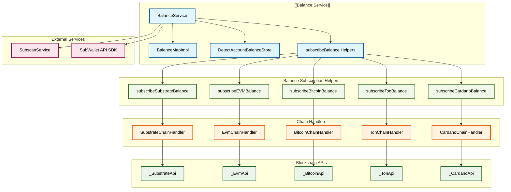
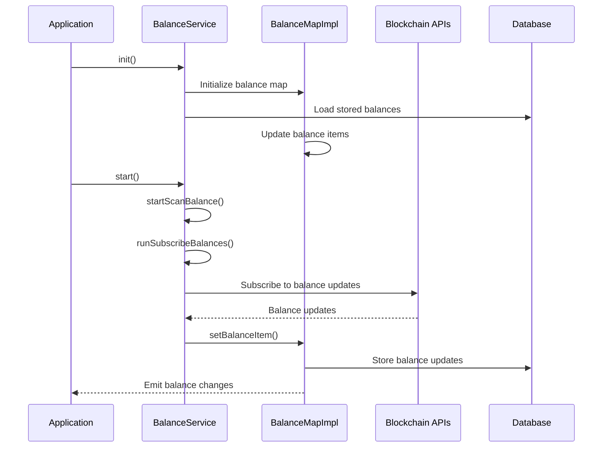
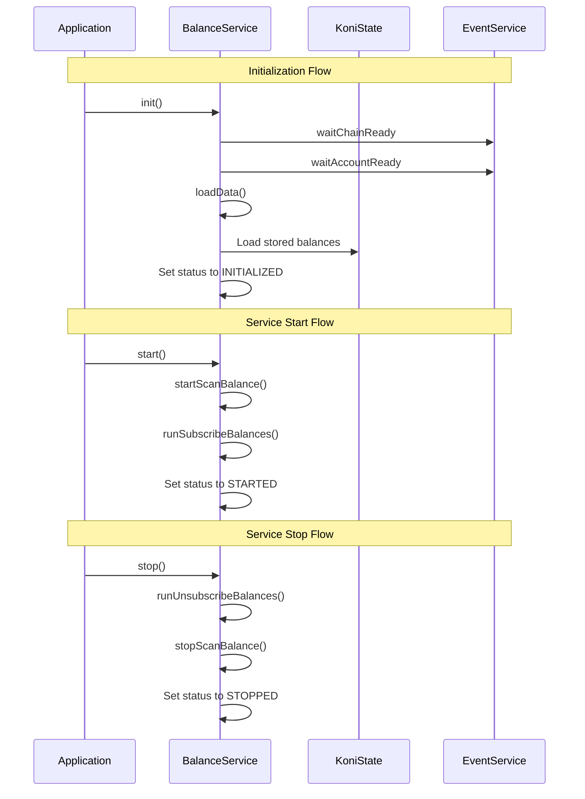
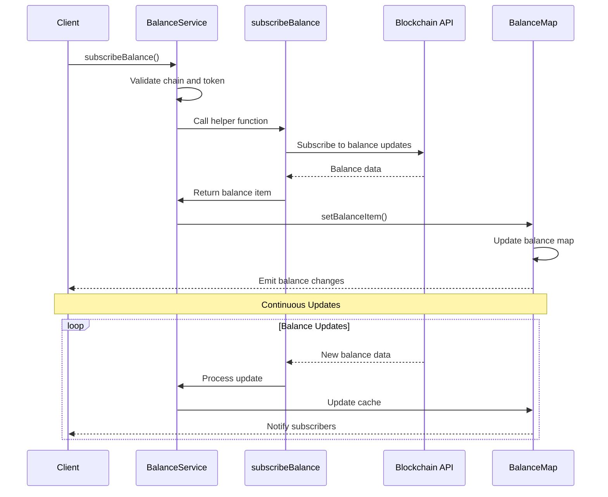
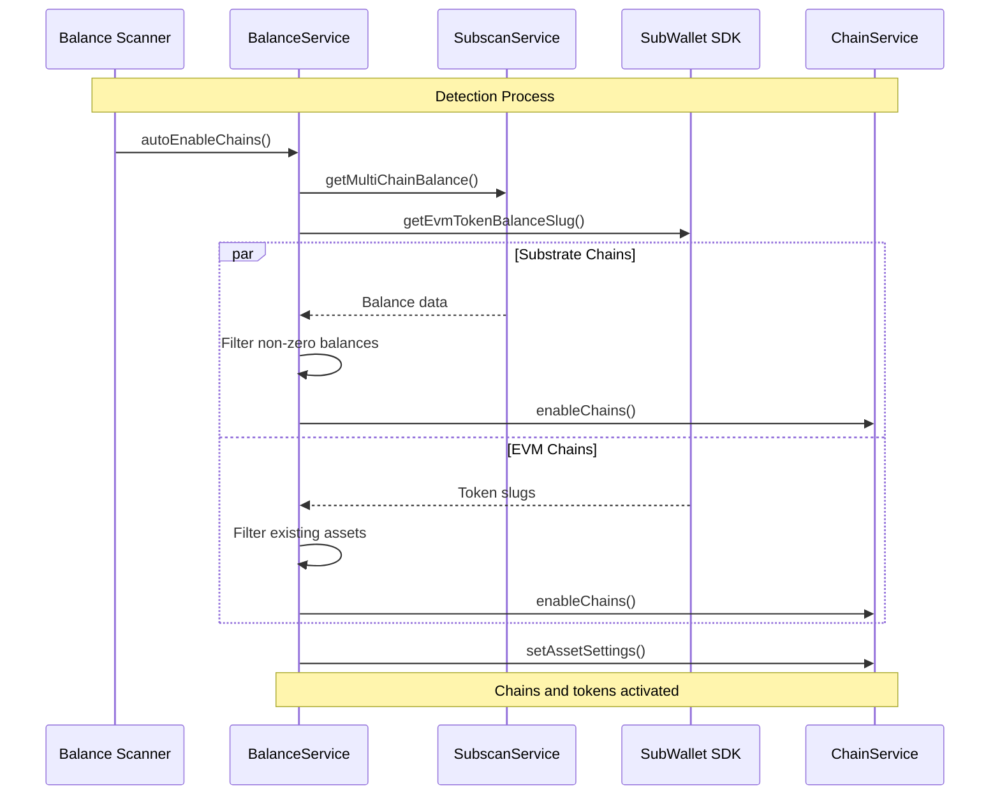
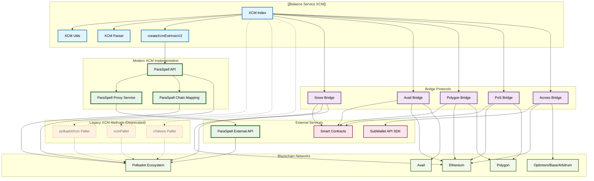
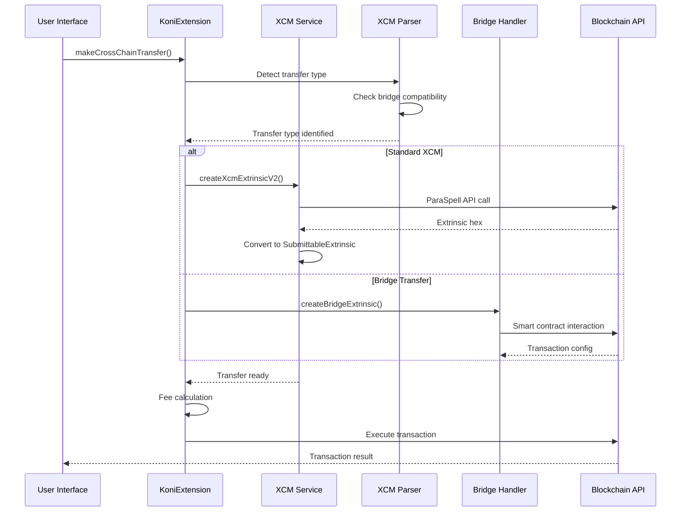

# Balance Service Documentation

## Overview

The BalanceService is a core service responsible for managing cryptocurrency balance subscriptions, detection, and caching across multiple blockchain networks. It provides real-time balance updates, automatic token detection, and optimal transfer process calculations for the SubWallet extension.

## Architecture

### High-Level Architecture

### Service Components Roles

- **BalanceService**: Main orchestrator for balance operations and subscriptions
- **BalanceMapImpl**: Manages balance data storage and updates with reactive subjects
- **DetectAccountBalanceStore**: Handles automatic balance detection caching
- **subscribeBalance**: Helper function for creating blockchain-specific balance subscriptions

### Current Service Components

## Props

### Important Properties

| Name | Purpose | Type |
|------|---------|------|
| `state` | Main application state reference | `KoniState` |
| `balanceMap` | Balance data management implementation | `BalanceMapImpl` |
| `balanceUpdateCache` | Temporary cache for balance updates | `BalanceItem[]` |
| `status` | Current service status | `ServiceStatus` |
| `intervalTime` | Balance detection scan interval (3 minutes) | `number` |
| `cacheTime` | Balance detection cache duration (15 minutes) | `number` |

### Types and Interfaces

Referenced from [`/packages/extension-base/src/services/balance-service/index.ts`](./index.ts):

- `BalanceItem`: Individual balance record structure
- `AmountData`: Standardized amount representation with decimals and symbol
- `DetectBalanceCache`: Cache for automatic balance detection timestamps
- `ServiceStatus`: Enum for service lifecycle states

### Default Values

- `intervalTime`: `3 * 60 * 1000` (3 minutes)
- `cacheTime`: `15 * 60 * 1000` (15 minutes)
- `status`: `ServiceStatus.NOT_INITIALIZED`

## Methods

### Core Balance Operations

#### `subscribeBalance(address, chain, tokenSlug, balanceType, extrinsicType, callback)`

**Purpose**: Subscribe to real-time balance updates for a specific token on a chain.

**Input Parameters**:
- `address: string` - Wallet address to monitor
- `chain: string` - Blockchain network identifier
- `tokenSlug?: string` - Token identifier (optional, defaults to native token)
- `balanceType: 'transferable' | 'total' | 'keepAlive'` - Type of balance to retrieve
- `extrinsicType?: ExtrinsicType` - Context for balance calculation
- `callback?: (rs: AmountData) => void` - Optional callback for balance updates

**Output Response**: `Promise<[() => void, AmountData]>` - Unsubscribe function and initial balance

**Error Handling**: Throws `BalanceError` for network/token issues, rejects on timeout (9999ms)

#### `getTransferableBalance(address, chain, tokenSlug, extrinsicType)`

**Purpose**: Get one-time transferable balance for an address.

**Input Parameters**:
- `address: string` - Wallet address
- `chain: string` - Blockchain network
- `tokenSlug?: string` - Token identifier
- `extrinsicType?: ExtrinsicType` - Transaction context

**Output Response**: `Promise<AmountData>` - Balance information

### Service Lifecycle

#### `init()`

**Purpose**: Initialize the service and load stored data.

**Input Parameters**: None

**Output Response**: `Promise<void>`

**Error Handling**: Waits for chain and account readiness before proceeding

#### `start()`

**Purpose**: Start balance subscriptions and scanning.

**Output Response**: `Promise<void>`

**Error Handling**: Handles concurrent start/stop operations with promise handlers

#### `stop()`

**Purpose**: Stop all balance subscriptions and scanning.

**Output Response**: `Promise<void>`

### Balance Detection

#### `autoEnableChains(addresses)`

**Purpose**: Automatically detect and enable chains with non-zero balances.

**Input Parameters**:
- `addresses: string[]` - Array of addresses to scan

**Output Response**: `Promise<void>`

**Error Handling**: Catches individual API failures and continues processing

### Transfer Process

#### `getOptimalTransferProcess(params)`

**Purpose**: Calculate optimal transfer path for cross-chain transactions.

**Input Parameters**:
- `params: RequestOptimalTransferProcess` - Transfer parameters including origin/destination chains

**Output Response**: `Promise<CommonOptimalTransferPath>` - Optimal transfer configuration

**Error Handling**: Throws errors for unsupported transfer types or missing token info

## Flows

### Service Lifecycle

### Balance Subscription Flow

### Automatic Chain Detection Flow

## XCM Cross-Chain Transfer Actions

### Overview

The Balance Service includes comprehensive XCM (Cross-Consensus Message Format) support for cross-chain transfers across multiple blockchain ecosystems. XCM enables asset transfers between different blockchains including Polkadot/Kusama parachains, Ethereum bridges, and specialized bridge protocols.

### Supported XCM Bridge Types

#### 1. Legacy Polkadot XCM (Deprecated)

##### 1.1. **Standard Polkadot XCM**
- **Purpose**: Native XCM transfers within Polkadot/Kusama ecosystem
- **Supported Chains**: Statemine, Statemint, Equilibrium, Mythos, AssetHubs
- **Implementation**: Uses `polkadotXcm` pallet with ParaSpell API integration
- **Methods**: `limitedReserveTransferAssets`, `limitedTeleportAssets`, `transferAssets`
- **Code Reference**: [`/packages/extension-base/src/services/balance-service/transfer/xcm/polkadotXcm.ts`](./transfer/xcm/polkadotXcm.ts)

##### 1.2. **XCM Pallet Transfers**
- **Purpose**: Direct XCM transfers from relay chains
- **Supported Chains**: Polkadot, Kusama, Rococo, Westend
- **Implementation**: Uses `xcmPallet` for relay-to-parachain transfers
- **Code Reference**: [`/packages/extension-base/src/services/balance-service/transfer/xcm/xcmPallet.ts`](./transfer/xcm/xcmPallet.ts)

##### 1.3. **xTokens Pallet**
- **Purpose**: Default XCM implementation for most parachains
- **Implementation**: Fallback XCM method for chains not using polkadotXcm or xcmPallet
- **Code Reference**: [`/packages/extension-base/src/services/balance-service/transfer/xcm/xTokens.ts`](./transfer/xcm/xTokens.ts)

#### 2. **Polkadot XCM via ParaSpell (Current Implementation)**
- **Purpose**: Modern XCM implementation using ParaSpell API for enhanced cross-chain transfers
- **Features**:
  - Automatic chain mapping and asset identification
  - Optimized XCM routing across Polkadot/Kusama ecosystem
  - Support for complex multi-hop transfers
  - Enhanced error handling and validation
- **Supported Chains**: All Polkadot/Kusama parachains supported by ParaSpell
- **Implementation Details**:
  - Uses external ParaSpell API service via proxy
  - Requires `paraSpellAssetType` and `paraSpellValue` in token metadata
  - Converts API response hex to `SubmittableExtrinsic`
  - Supports dry-run validation before execution
- **API Endpoints**:
  - Build XCM: `/v1/x-transfer` (POST)
  - Dry Run: `/v1/xcm-fee` (POST)
- **Chain Mapping**: Dynamic chain slug to ParaSpell ID mapping via `fetchParaSpellChainMap()`
- **Currency Formats**: Supports native tokens, foreign assets, and custom asset types
- **Error Handling**: Comprehensive error messages for unsupported tokens/chains
- **Code Reference**: [`/packages/extension-base/src/services/balance-service/transfer/xcm/utils.ts#L143`](./transfer/xcm/utils.ts#L143)
- **Function**: `createXcmExtrinsicV2()` and `buildXcm()`

#### 3. **Snow Bridge (Ethereum ↔ Polkadot)**
- **Purpose**: Bridge between Ethereum ecosystem and Polkadot Asset Hub
- **Supported Routes**: Ethereum ↔ Polkadot Asset Hub, Mythos integration
- **Features**: 
  - High fees (~$5-70 depending on direction)
  - Long completion time (~1 hour)
  - Beta status with risk warnings
- **Code Reference**: [`/packages/extension-base/src/services/balance-service/transfer/xcm/snowBridge.ts`](./transfer/xcm/snowBridge.ts)

#### 4. **Avail Bridge**
- **Purpose**: Bridge between Ethereum and Avail blockchain
- **Supported Routes**: Ethereum ↔ Avail
- **Implementation**: 
  - Ethereum side: Smart contract interactions
  - Avail side: Native pallet calls
- **Code Reference**: [`/packages/extension-base/src/services/balance-service/transfer/xcm/availBridge.ts`](./transfer/xcm/availBridge.ts)

#### 5. **Polygon Bridge**
- **Purpose**: Bridge for Polygon ecosystem transfers
- **Supported Routes**: 
  - Ethereum ↔ Polygon zkEVM
  - Ethereum Sepolia ↔ Polygon zkEVM Cardona (testnet)
- **Supported Tokens**: ETH, WETH, POL
- **Manual Claiming**: Some transfers require manual claiming
- **Code Reference**: [`/packages/extension-base/src/services/balance-service/transfer/xcm/polygonBridge.ts`](./transfer/xcm/polygonBridge.ts)

#### 6. **PoS Bridge**
- **Purpose**: Polygon Proof-of-Stake bridge for legacy Polygon transfers
- **Supported Routes**:
  - Ethereum ↔ Polygon
  - Ethereum Sepolia ↔ Polygon Amoy (testnet)
- **Code Reference**: [`/packages/extension-base/src/services/balance-service/transfer/xcm/posBridge.ts`](./transfer/xcm/posBridge.ts)

#### 7. **Across Bridge**
- **Purpose**: Cross-chain transfers using Across Protocol
- **Supported Routes**: Ethereum, Optimism, Base, Arbitrum One
- **Implementation**: Similar to Chainflip, uses vault-based transfers
- **External API**: Integrates with SubWallet API SDK for transfer data
- **Code Reference**: [`/packages/extension-base/src/services/balance-service/transfer/xcm/acrossBridge/index.ts`](./transfer/xcm/acrossBridge/index.ts)

### XCM Transfer Architecture

### XCM Method Implementations

#### Core XCM Functions

##### `createXcmExtrinsicV2(request)`

**Purpose**: Creates XCM extrinsics using ParaSpell API integration for enhanced compatibility.

**Input Parameters**:
- `request: CreateXcmExtrinsicProps` - Complete XCM transfer configuration

**Output Response**: `Promise<SubmittableExtrinsic<'promise'> | undefined>` - Substrate extrinsic or undefined on error

**Implementation**: Uses ParaSpell API to build optimized XCM transactions with proper asset identification and routing

**Code Reference**: [`/packages/extension-base/src/services/balance-service/transfer/xcm/utils.ts#L143`](./transfer/xcm/utils.ts#L143)

##### `dryRunXcmExtrinsicV2(request)`

**Purpose**: Validates XCM transfers before execution using dry-run simulation.

**Input Parameters**: 
- `request: CreateXcmExtrinsicProps` - XCM transfer parameters

**Output Response**: `Promise<boolean>` - Success/failure validation result

**Error Handling**: Gracefully handles chains that don't support dry-run or Polkadot API

**Implementation Details**:
- Tests origin, asset hub, bridge hub, and destination execution
- Provides fallback for unsupported chains
- Returns detailed failure reasons for debugging

##### Bridge-Specific Methods

##### `createSnowBridgeExtrinsic(props)`

**Purpose**: Creates Snow Bridge transfers between Ethereum and Polkadot Asset Hub.

**Features**:
- EVM transaction configuration
- High fee estimation ($5-70)
- Beta status warnings
- Long completion times (~1 hour)

##### `createAvailBridgeExtrinsicFromAvail(props)` / `createAvailBridgeTxFromEth(props)`

**Purpose**: Bidirectional Avail bridge transfers.

**Implementation**:
- Avail → Ethereum: Uses Avail pallet calls
- Ethereum → Avail: Uses Ethereum smart contract interactions

##### `createPolygonBridgeExtrinsic(props)`

**Purpose**: Polygon zkEVM bridge transfers with automatic L1/L2 direction detection.

**Smart Routing**:
- Auto-detects L1 to L2 vs L2 to L1 transfers
- Supports both Polygon Bridge and PoS Bridge protocols
- Handles mainnet and testnet configurations

##### `createAcrossBridgeExtrinsic(props)`

**Purpose**: Across Protocol transfers for Ethereum L2 ecosystem.

**Features**:
- Dynamic fee estimation
- Vault-based transfer mechanism
- Integration with SubWallet API SDK for transfer data
- Support for Ethereum, Optimism, Base, Arbitrum One

### XCM Transfer Flow

### XCM Chain Groups

The service categorizes chains into specific XCM groups for proper routing:

**Code Reference**: [`/packages/extension-base/src/services/chain-service/constants.ts#L261`](../../chain-service/constants.ts#L261)

- **polkadotXcm**: `['statemine', 'statemint', 'equilibrium_parachain', 'rococo_assethub', 'mythos', 'westend_assethub']`
- **polkadotXcmSpecialCases**: `['astar', 'shiden']` - Special routing for native tokens
- **xcmPallet**: `['polkadot', 'kusama', 'rococo', 'westend']` - Relay chain routing

### XCM Validation and Error Handling

#### Transfer Validation

- **Bridge Compatibility**: Automatic detection of supported bridge types
- **Chain Support**: Validates origin and destination chain compatibility  
- **Asset Support**: Checks token availability on target chains
- **Fee Estimation**: Pre-calculates transfer fees including bridge costs

#### Error Recovery

- **Dry-Run Fallback**: Graceful handling of chains without dry-run support
- **API Timeouts**: Robust timeout handling for external API calls
- **Bridge Failures**: Specific error messages for bridge-related issues
- **Manual Claiming**: Clear notifications for transfers requiring manual claim

#### Risk Warnings

The service provides automatic risk warnings for:
- **Beta Bridges**: High-fee, experimental bridge protocols
- **High Fees**: Transfers with significant cost implications  
- **Long Delays**: Bridges with extended completion times
- **Manual Claims**: Transfers requiring additional user action

**Implementation**: [`/packages/extension-base/src/core/substrate/xcm-parser.ts#L71-116`](../../core/substrate/xcm-parser.ts#L71-116)

## Notes

### Known Issues

- Balance detection timeout set to 30 seconds for EVM chains may be insufficient for slow networks
- Error handling in gear.ts shows TODO comment for createType errors (line 56, 89)
- Cardano balance includes TODO for research on locked balance implementation (line 58 in cardano/index.ts)

### Future Improvements

- **Performance Optimization**: Consider implementing intelligent caching strategies to reduce API calls
- **Error Recovery**: Implement retry mechanisms for failed balance subscriptions
- **Multi-threading**: Explore worker threads for intensive balance calculations
- **Real-time Sync**: Enhance WebSocket connections for instant balance updates

### Code References

- Core service implementation: [`/packages/extension-base/src/services/balance-service/index.ts`](./index.ts)
- Balance subscription helpers: [`/packages/extension-base/src/services/balance-service/helpers/subscribe/`](./helpers/subscribe/)
- State integration: [`/packages/extension-base/src/koni/background/handlers/State.ts`](../../koni/background/handlers/State.ts#L133)
- Gear blockchain support: [`/packages/extension-base/src/services/balance-service/helpers/subscribe/substrate/gear.ts`](./helpers/subscribe/substrate/gear.ts)
- Cardano blockchain support: [`/packages/extension-base/src/services/balance-service/helpers/subscribe/cardano/index.ts`](./helpers/subscribe/cardano/index.ts)
