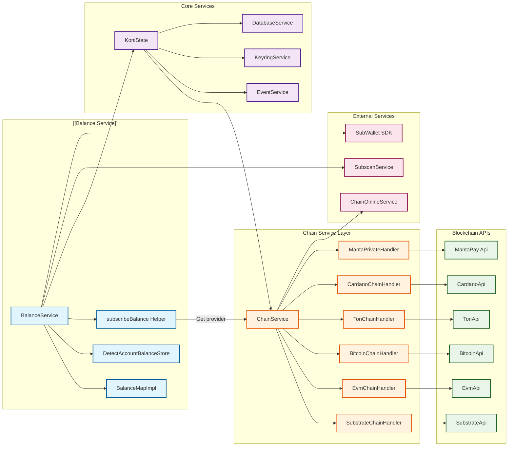

# Balance Service Documentation

## Overview

The BalanceService is a core service responsible for managing cryptocurrency balance subscriptions, detection, and caching across multiple blockchain networks. It provides real-time balance updates, automatic token detection, and optimal transfer process calculations for the SubWallet extension.

## Architecture

### High-Level Architecture

### Service Components Roles

- **BalanceService**: Main orchestrator for balance operations and subscriptions
- **BalanceMapImpl**: Manages balance data storage and updates with reactive subjects
- **DetectAccountBalanceStore**: Handles automatic balance detection caching
- **subscribeBalance**: Helper function for creating blockchain-specific balance subscriptions

### Current Service Components

## Props

### Important Properties

| Name | Purpose | Type |
|------|---------|------|
| `state` | Main application state reference | `KoniState` |
| `balanceMap` | Balance data management implementation | `BalanceMapImpl` |
| `balanceUpdateCache` | Temporary cache for balance updates | `BalanceItem[]` |
| `status` | Current service status | `ServiceStatus` |
| `intervalTime` | Balance detection scan interval (3 minutes) | `number` |
| `cacheTime` | Balance detection cache duration (15 minutes) | `number` |

### Types and Interfaces

Referenced from [`/packages/extension-base/src/services/balance-service/index.ts`](./index.ts):

- `BalanceItem`: Individual balance record structure
- `AmountData`: Standardized amount representation with decimals and symbol
- `DetectBalanceCache`: Cache for automatic balance detection timestamps
- `ServiceStatus`: Enum for service lifecycle states

### Default Values

- `intervalTime`: `3 * 60 * 1000` (3 minutes)
- `cacheTime`: `15 * 60 * 1000` (15 minutes)
- `status`: `ServiceStatus.NOT_INITIALIZED`

## Methods

### Core Balance Operations

#### `subscribeBalance(address, chain, tokenSlug, balanceType, extrinsicType, callback)`

**Purpose**: Subscribe to real-time balance updates for a specific token on a chain.

**Input Parameters**:
- `address: string` - Wallet address to monitor
- `chain: string` - Blockchain network identifier
- `tokenSlug?: string` - Token identifier (optional, defaults to native token)
- `balanceType: 'transferable' | 'total' | 'keepAlive'` - Type of balance to retrieve
- `extrinsicType?: ExtrinsicType` - Context for balance calculation
- `callback?: (rs: AmountData) => void` - Optional callback for balance updates

**Output Response**: `Promise<[() => void, AmountData]>` - Unsubscribe function and initial balance

**Error Handling**: Throws `BalanceError` for network/token issues, rejects on timeout (9999ms)

#### `getTransferableBalance(address, chain, tokenSlug, extrinsicType)`

**Purpose**: Get one-time transferable balance for an address.

**Input Parameters**:
- `address: string` - Wallet address
- `chain: string` - Blockchain network
- `tokenSlug?: string` - Token identifier
- `extrinsicType?: ExtrinsicType` - Transaction context

**Output Response**: `Promise<AmountData>` - Balance information

### Service Lifecycle

#### `init()`

**Purpose**: Initialize the service and load stored data.

**Input Parameters**: None

**Output Response**: `Promise<void>`

**Error Handling**: Waits for chain and account readiness before proceeding

#### `start()`

**Purpose**: Start balance subscriptions and scanning.

**Output Response**: `Promise<void>`

**Error Handling**: Handles concurrent start/stop operations with promise handlers

#### `stop()`

**Purpose**: Stop all balance subscriptions and scanning.

**Output Response**: `Promise<void>`

### Balance Detection

#### `autoEnableChains(addresses)`

**Purpose**: Automatically detect and enable chains with non-zero balances.

**Input Parameters**:
- `addresses: string[]` - Array of addresses to scan

**Output Response**: `Promise<void>`

**Error Handling**: Catches individual API failures and continues processing

### Transfer Process

#### `getOptimalTransferProcess(params)`

**Purpose**: Calculate optimal transfer path for cross-chain transactions.

**Input Parameters**:
- `params: RequestOptimalTransferProcess` - Transfer parameters including origin/destination chains

**Output Response**: `Promise<CommonOptimalTransferPath>` - Optimal transfer configuration

**Error Handling**: Throws errors for unsupported transfer types or missing token info

## Flows

### Service Lifecycle

### Balance Subscription Flow

### Automatic Chain Detection Flow

## Notes

### Known Issues

- Balance detection timeout set to 30 seconds for EVM chains may be insufficient for slow networks
- Error handling in gear.ts shows TODO comment for createType errors (line 56, 89)
- Cardano balance includes TODO for research on locked balance implementation (line 58 in cardano/index.ts)

### Future Improvements

- **Performance Optimization**: Consider implementing intelligent caching strategies to reduce API calls
- **Error Recovery**: Implement retry mechanisms for failed balance subscriptions
- **Multi-threading**: Explore worker threads for intensive balance calculations
- **Real-time Sync**: Enhance WebSocket connections for instant balance updates

### Code References

- Core service implementation: [`/packages/extension-base/src/services/balance-service/index.ts`](./index.ts)
- Balance subscription helpers: [`/packages/extension-base/src/services/balance-service/helpers/subscribe/`](./helpers/subscribe/)
- State integration: [`/packages/extension-base/src/koni/background/handlers/State.ts`](../../koni/background/handlers/State.ts#L133)
- Gear blockchain support: [`/packages/extension-base/src/services/balance-service/helpers/subscribe/substrate/gear.ts`](./helpers/subscribe/substrate/gear.ts)
- Cardano blockchain support: [`/packages/extension-base/src/services/balance-service/helpers/subscribe/cardano/index.ts`](./helpers/subscribe/cardano/index.ts)
