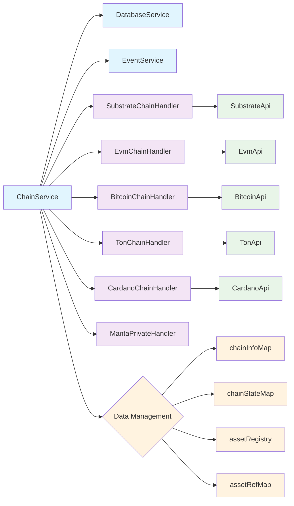
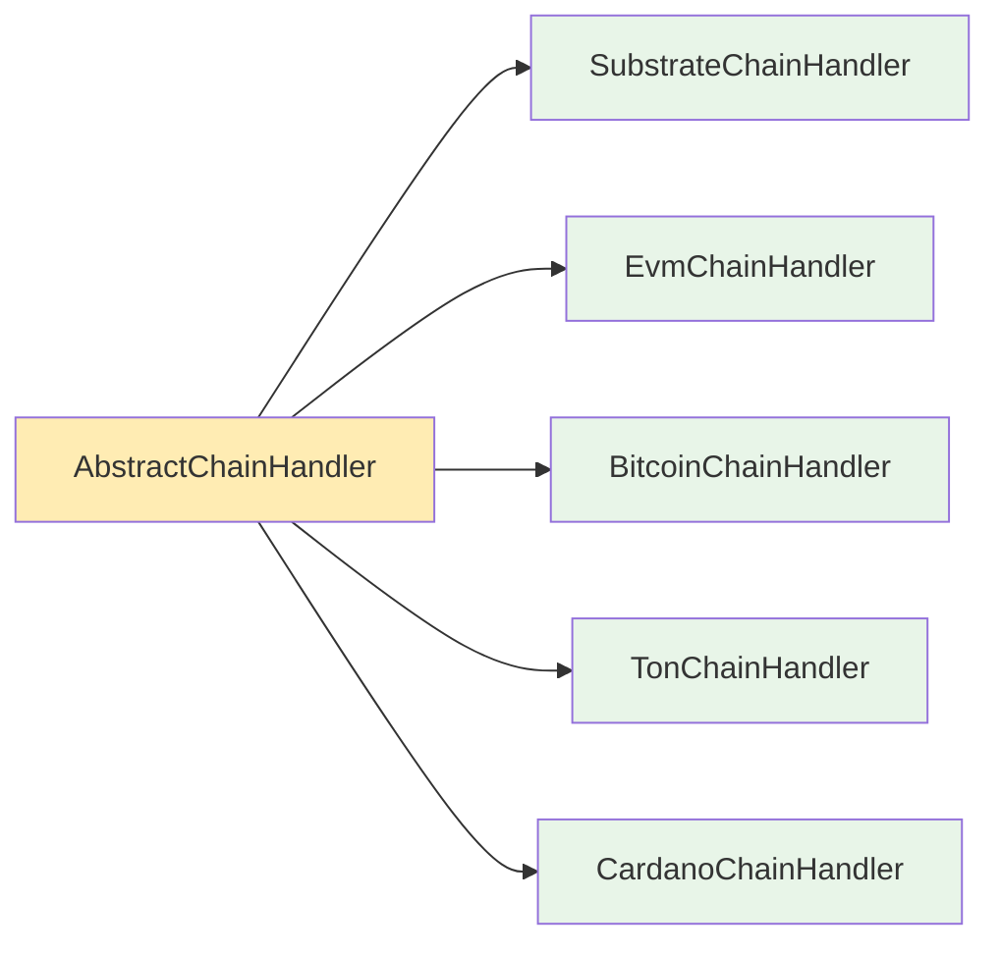
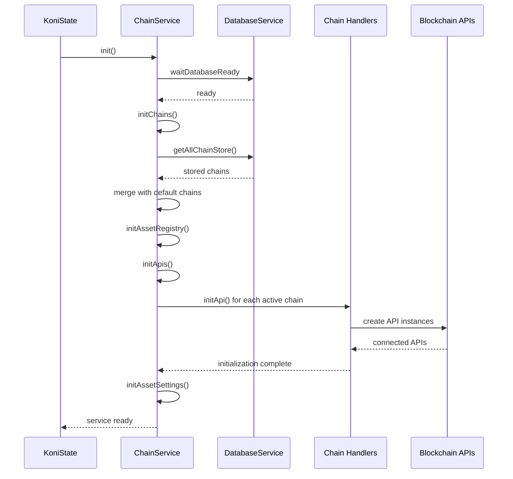
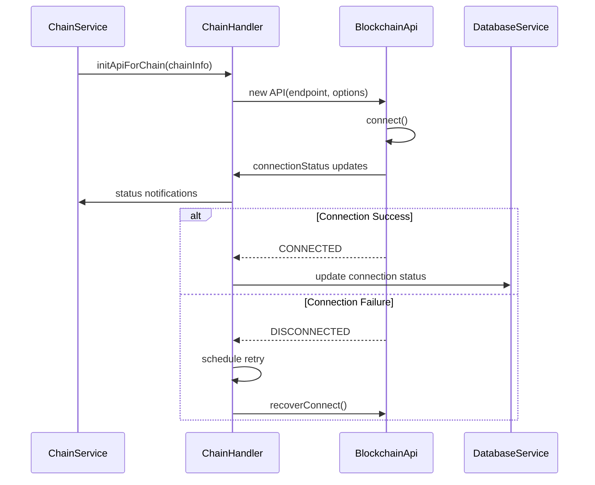
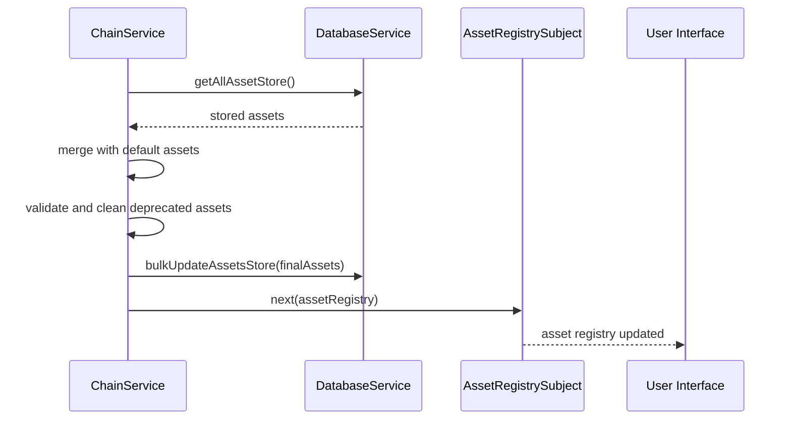

# Chain Service

The Chain Service is a core component of the SubWallet Extension that manages blockchain connections, chain configurations, and multi-chain operations. It provides a unified interface to interact with different blockchain networks including Substrate, EVM, Bitcoin, TON, and Cardano chains.

## Overview

The Chain Service centralizes blockchain management by:
- Managing chain information and configurations
- Handling API connections for multiple blockchain types
- Coordinating asset registries and metadata
- Providing subscription mechanisms for real-time updates
- Managing chain states and connection statuses

## Architecture



### Service Components

- **[Chain Service](index.ts)**: Main service orchestrating all chain operations
- **Chain Handlers**: Type-specific handlers for different blockchain architectures
- **API Adapters**: Low-level blockchain API interfaces
- **Data Management**: Centralized state and configuration management

### Chain Handler Architecture

Each blockchain type has a dedicated handler that extends `AbstractChainHandler`:



## Props

### Core Properties

| Name | Type | Purpose |
|------|------|---------|
| `dataMap` | `_DataMap` | Central data store containing chain info, states, and asset registries |
| `dbService` | `DatabaseService` | Database service for persistent storage |
| `eventService` | `EventService` | Event system for inter-service communication |
| `lockChainInfoMap` | `boolean` | Prevents unwanted changes to chain info during operations |

**Source**: [index.ts:77-91](index.ts)

### Handler Properties

| Name | Type | Purpose |
|------|------|---------|
| `substrateChainHandler` | `SubstrateChainHandler` | Manages Substrate-based blockchain connections |
| `evmChainHandler` | `EvmChainHandler` | Manages EVM-compatible blockchain connections |
| `bitcoinChainHandler` | `BitcoinChainHandler` | Manages Bitcoin and Bitcoin-compatible networks |
| `tonChainHandler` | `TonChainHandler` | Manages TON blockchain connections |
| `cardanoChainHandler` | `CardanoChainHandler` | Manages Cardano blockchain connections |
| `mantaChainHandler` | `MantaPrivateHandler` | Optional handler for Manta Pay zero-knowledge features |

**Source**: [index.ts:92-97](index.ts)

### Subject Properties

| Name | Type | Purpose |
|------|------|---------|
| `chainInfoMapSubject` | `Subject<Record<string, _ChainInfo>>` | Emits chain information updates |
| `chainStateMapSubject` | `Subject<Record<string, _ChainState>>` | Emits chain state changes |
| `assetRegistrySubject` | `Subject<Record<string, _ChainAsset>>` | Emits asset registry updates |
| `multiChainAssetMapSubject` | `Subject<Record<string, _MultiChainAsset>>` | Emits multi-chain asset updates |

**Source**: [index.ts:101-114](index.ts)

### Data Types

```typescript
interface _DataMap {
  chainInfoMap: Record<string, _ChainInfo>;
  assetRegistry: Record<string, _ChainAsset>;
  chainStateMap: Record<string, _ChainState>;
  assetRefMap: Record<string, _AssetRef>;
}
```

**Source**: [types.ts:26-31](types.ts)

```typescript
interface _ChainState {
  slug: string;
  active: boolean;
  currentProvider: string;
  manualTurnOff: boolean;
}
```

**Source**: [types.ts:42-47](types.ts)

## Methods

### Initialization Methods

#### `init()`
Main initialization method that orchestrates the entire service setup.

**Input Parameters**: None

**Output Response**: `Promise<void>`

**Flow**:
1. Waits for database readiness
2. Initializes chain configurations
3. Sets up asset registries
4. Initializes API connections
5. Enables asset settings

**Source**: [index.ts:778-793](index.ts)

#### `initChains()`
Private method that initializes chain configurations from stored settings and default chain list.

**Input Parameters**: None

**Output Response**: `Promise<void>`

**Error Handling**: Database operations are wrapped in try-catch blocks

**Source**: [index.ts:1295-1508](index.ts)

#### `initApiForChain(chainInfo: _ChainInfo)`
Initializes API connections for a specific blockchain based on its type.

**Input Parameters**:
- `chainInfo`: Chain configuration object containing connection details

**Output Response**: `Promise<void>`

**Error Handling**: Disables chain if provider endpoint is not found

**Source**: [index.ts:990-1079](index.ts)

### API Access Methods

#### `getSubstrateApi(slug: string)`
Retrieves Substrate API instance for a specific chain.

**Input Parameters**:
- `slug`: Chain identifier string

**Output Response**: `_SubstrateApi | undefined`

**Source**: [index.ts:227-229](index.ts)

#### `getEvmApi(slug: string)`
Retrieves EVM API instance for a specific chain.

**Input Parameters**:
- `slug`: Chain identifier string

**Output Response**: `_EvmApi | undefined`

**Source**: [index.ts:219-221](index.ts)

### Chain Management Methods

#### `enableChain(chainSlug: string, enableTokens: boolean = true)`
Enables a blockchain and optionally its associated tokens.

**Input Parameters**:
- `chainSlug`: Chain identifier string
- `enableTokens`: Whether to enable associated tokens (default: true)

**Output Response**: `Promise<boolean>`

**Error Handling**: Returns false if operation fails

**Source**: Referenced in semantic search results

#### `disableChain(chainSlug: string)`
Disables a blockchain and its API connections.

**Input Parameters**:
- `chainSlug`: Chain identifier string

**Output Response**: `Promise<boolean>`

**Error Handling**: Gracefully handles API disconnection failures

**Source**: Referenced in semantic search results

### Subscription Methods

#### `subscribeChainInfoMap()`
Provides reactive updates for chain information changes.

**Output Response**: `Subject<Record<string, _ChainInfo>>`

**Source**: [index.ts:309-311](index.ts)

#### `subscribeAssetRegistry()`
Provides reactive updates for asset registry changes.

**Output Response**: `Subject<Record<string, _ChainAsset>>`

**Source**: [index.ts:313-315](index.ts)

### Asset Management Methods

#### `upsertCustomToken(data: _ChainAsset)`
Adds or updates a custom token in the asset registry.

**Input Parameters**:
- `data`: Chain asset configuration object

**Output Response**: `string` (token slug)

**Error Handling**: Validates asset data before insertion

**Source**: Referenced in semantic search results

#### `deleteCustomAssets(targetTokens: string[])`
Removes custom assets from the registry.

**Input Parameters**:
- `targetTokens`: Array of token slugs to remove

**Output Response**: `void`

**Source**: Referenced in semantic search results

## Flows

### Service Initialization Flow



### Chain Connection Lifecycle



### Asset Registry Management



## Notes

### Known Issues

1. **Provider Randomization**: The service uses provider randomization which may cause connection issues with unstable providers.
   - **Location**: [utils.ts](utils/index.ts)

2. **Chain Lock Mechanism**: The `lockChainInfoMap` can prevent legitimate chain updates during critical operations.
   - **Location**: [index.ts:87](index.ts)

3. **API Retry Logic**: Connection retry mechanisms may not handle all edge cases for unstable network conditions.
   - **Location**: Chain handler implementations

### Performance Considerations

- **Concurrent API Initialization**: The service initializes multiple chain APIs concurrently, which can cause resource contention on slower devices.
- **Memory Usage**: Each active chain maintains its own API instance and metadata cache.
- **Database Queries**: Frequent chain state updates may create database performance bottlenecks.

### Future Improvements

1. **Connection Pooling**: Implement connection pooling for better resource management
2. **Lazy Loading**: Add lazy loading for chain APIs to reduce initial startup time
3. **Health Monitoring**: Enhanced chain health monitoring and automatic failover
4. **Metadata Caching**: Improved metadata caching strategies to reduce network requests
5. **Error Recovery**: More sophisticated error recovery mechanisms for different failure scenarios

### Dependencies

- **@polkadot/api**: Substrate blockchain interactions
- **web3**: EVM blockchain interactions  
- **@ton/core**: TON blockchain interactions
- **@emurgo/cardano-serialization-lib-nodejs**: Cardano blockchain interactions
- **rxjs**: Reactive programming for subscriptions

**Integration Points**:
- Used by `KoniState` as the main chain management service
- Provides data to `BalanceService`, `EarningService`, and `SwapService`
- Coordinates with `DatabaseService` for persistent storage
- Communicates through `EventService` for cross-service notifications