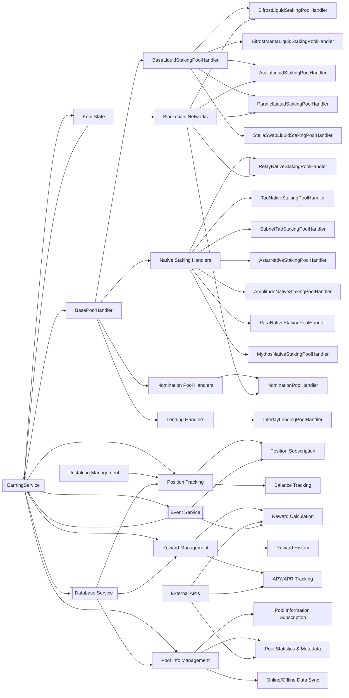
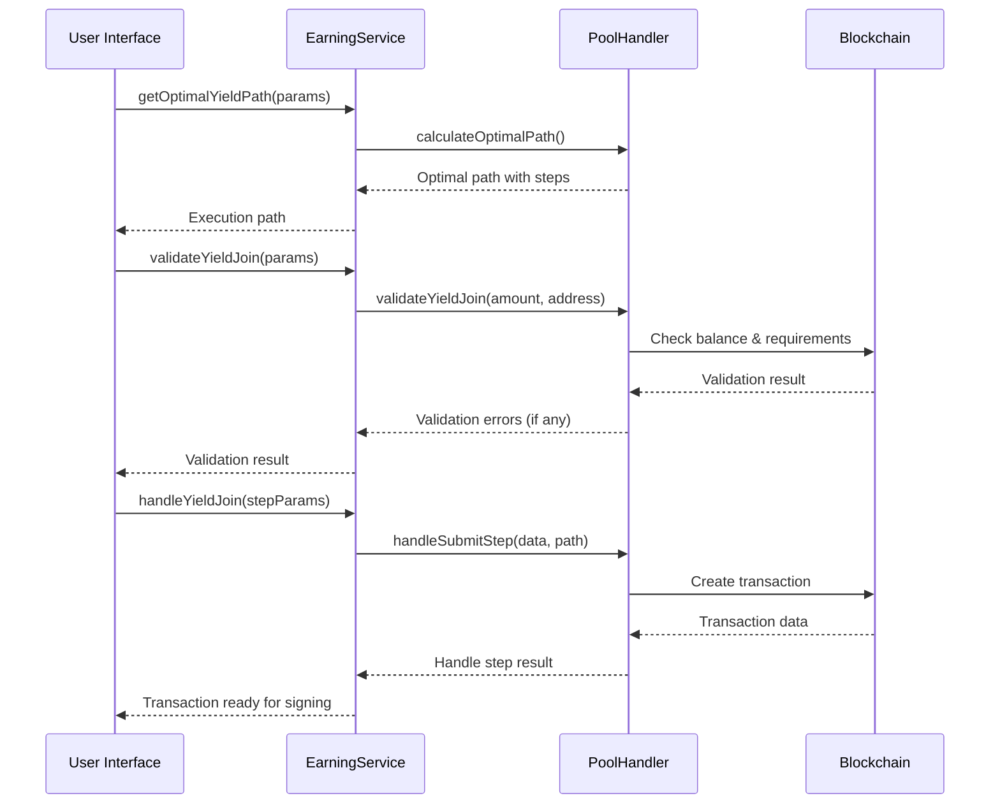
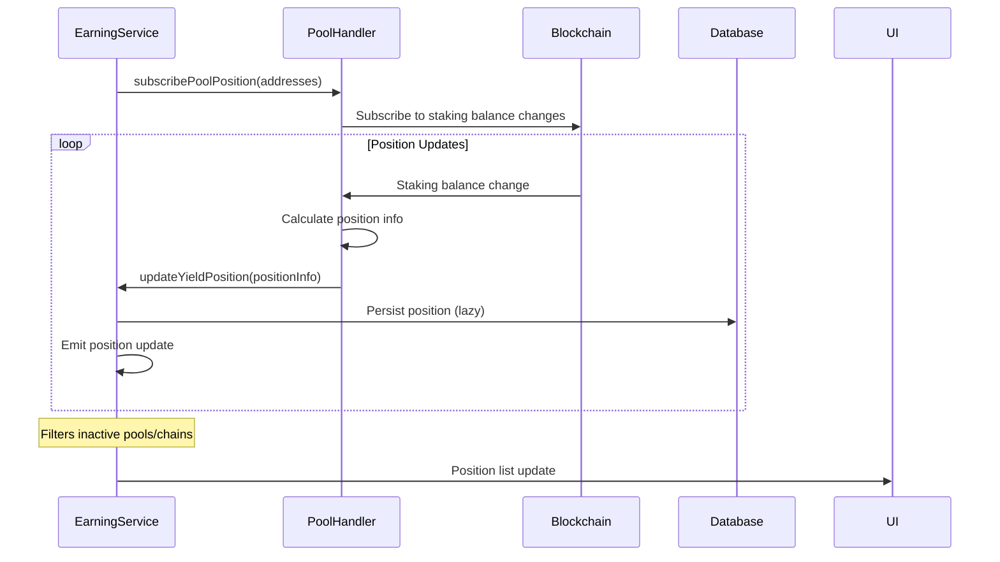
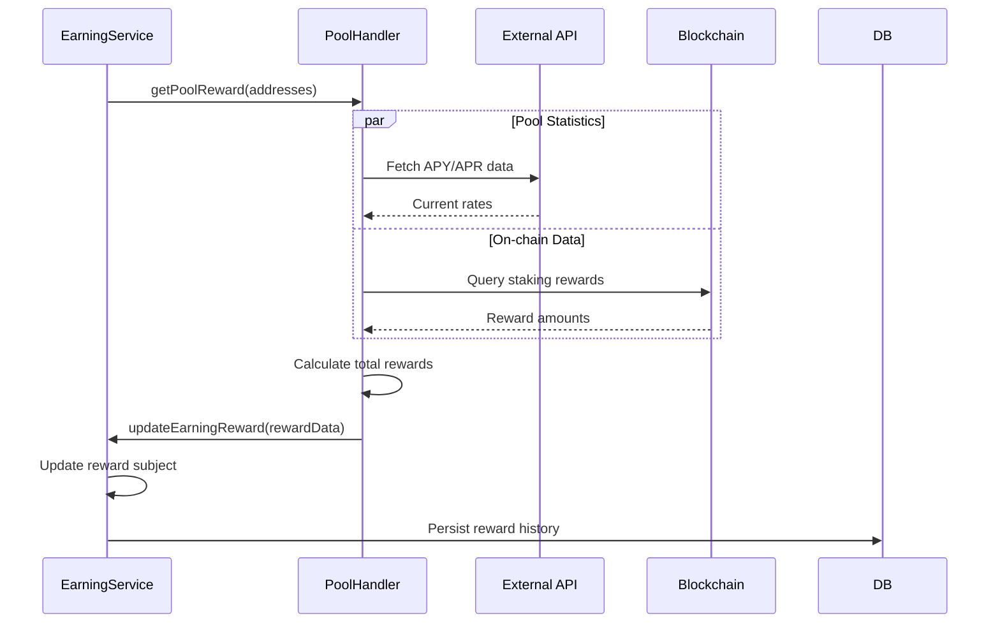
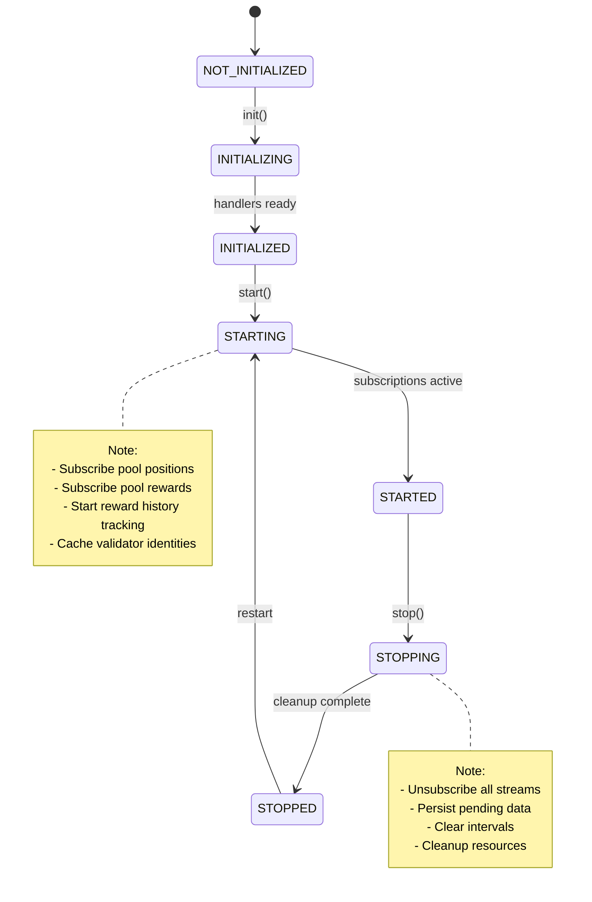

# Earning Service Documentation

## Overview

The Earning Service is a core component of the SubWallet Extension that provides comprehensive support for staking, yield farming, and earning opportunities across multiple blockchain networks. It manages different types of earning pools including liquid staking, native staking, nomination pools, lending protocols, and parachain staking.

## Architecture

### High-Level Structure



### Service Components

#### 1. Core Service Layer (`EarningService`)
- **Role**: Central coordinator and orchestrator for all earning-related operations
- **Dependencies**:
  - `KoniState`: Global application state management
  - `DatabaseService`: Data persistence layer
  - `EventService`: Event-driven communication
- **Responsibilities**:
  - Pool handler lifecycle management and initialization
  - Data persistence and caching coordination
  - Event handling and service lifecycle management
  - Cross-service coordination and state synchronization

#### 2. Handler Architecture

##### Base Handler (`BasePoolHandler`)
- **Role**: Abstract base class providing common interface and shared functionality
- **Relationships**:
  - Extended by all specialized handlers
  - Defines contract for pool operations
  - Provides common utilities and validation logic

##### Liquid Staking Layer (`BaseLiquidStakingPoolHandler`)
- **Role**: Specialized base for liquid staking protocols
- **Extends**: `BasePoolHandler`
- **Extended by**: Protocol-specific implementations (Bifrost, Acala, Parallel, StellaSwap)
- **Features**: Slippage management, exchange rate handling, derivative token logic

##### Native Staking Handlers
- **Role**: Direct validator staking implementations for different chains
- **Extends**: `BasePoolHandler`
- **Chain-specific**: Each handler optimized for specific blockchain characteristics
- **Variants**: Relay chains, Parachain staking, Subnet staking, specialized tokenomics

##### Nomination Pool Handlers
- **Role**: Pooled staking with shared validator nominations
- **Extends**: `BasePoolHandler`
- **Features**: Pool member management, shared reward distribution

##### Lending Handlers
- **Role**: Lending protocol integration for yield generation
- **Extends**: `BasePoolHandler`
- **Features**: Supply/borrow mechanics, interest rate calculations

#### 3. Data Management Layer

##### Pool Information Management
- **Components**: Pool metadata, statistics, configuration
- **Data Sources**: On-chain queries, external APIs, cached data
- **Relationships**: Coordinated by EarningService, consumed by handlers

##### Position Tracking
- **Components**: User balances, staking positions, unstaking queues
- **Real-time**: Subscription-based updates from blockchain networks
- **Persistence**: Automatic data persistence with lazy queue optimization

##### Reward Management
- **Components**: Reward calculations, historical data, APY/APR tracking
- **Sources**: On-chain reward queries, external yield APIs
- **Processing**: Aggregated across multiple pools and time periods

#### 4. External Dependencies

##### Blockchain Networks
- **Role**: Source of truth for on-chain data
- **Interaction**: Through specialized chain APIs (Substrate, EVM)
- **Data**: Balances, rewards, validator info, pool statistics

##### External APIs
- **Role**: Enhanced data and analytics
- **Purpose**: APY/APR rates, validator identities, pool statistics
- **Integration**: Fallback and enhancement for on-chain data

#### 5. Cross-Module Relationships

```mermaid
graph LR
    %% Core Service Dependencies
    subgraph "Main Service Context"
        KS[["KoniState"]]
        ES[[EarningService]]
        KS --> ES
    end

    %% Direct Service Dependencies
    subgraph "Core Dependencies"
        DB[DatabaseService]
        EV[EventService]
        CS[ChainService]
        TS[TransactionService]
        NS[NotificationService]

        ES --> DB
        ES --> EV
        ES -.-> CS
        ES -.-> TS
        ES -.-> NS

        %% State provides these services
        KS --> DB
        KS --> EV
        KS --> CS
        KS --> TS
        KS --> NS
    end

    %% Handler Architecture
    subgraph "Pool Handler System"
        BPH[BasePoolHandler]

        %% Handler Types
        LSH[Liquid Staking Handlers]
        NSH[Native Staking Handlers]
        NPH[Nomination Pool Handlers]
        LH[Lending Handlers]

        %% Concrete Implementations
        ALS[AcalaLiquidStakingPoolHandler]
        BLS[BifrostLiquidStakingPoolHandler]
        PLS[ParallelLiquidStakingPoolHandler]
        SSL[StellaSwapLiquidStakingPoolHandler]

        RNS[RelayNativeStakingPoolHandler]
        TNS[TaoNativeStakingPoolHandler]
        ANS[AstarNativeStakingPoolHandler]

        NP[NominationPoolHandler]
        IL[InterlayLendingPoolHandler]

        %% Handler Dependencies
        ES --> BPH

        BPH --> LSH
        BPH --> NSH
        BPH --> NPH
        BPH --> LH

        LSH --> ALS
        LSH --> BLS
        LSH --> PLS
        LSH --> SSL

        NSH --> RNS
        NSH --> TNS
        NSH --> ANS

        NPH --> NP
        LH --> IL

        %% Handlers access state through base
        BPH --> KS
    end

    %% Data Flow Management
    subgraph "Data Streams"
        %% RxJS Subjects
        YPI[yieldPoolInfoSubject]
        YPS[yieldPositionSubject]
        YPL[yieldPositionListSubject]
        ERS[earningRewardSubject]
        ERH[earningRewardHistorySubject]
        MAP[minAmountPercentSubject]

        ES --> YPI
        ES --> YPS
        ES --> YPL
        ES --> ERS
        ES --> ERH
        ES --> MAP
    end

    %% External Data Sources
    subgraph "External Systems"
        %% Blockchain Networks
        BC[Blockchain Networks]
        SAPI[Substrate APIs]
        EAPI[EVM APIs]
        OAPI[Other Chain APIs]

        %% External Services
        EXTAPI[External APIs]
        VALIDAPI[Validator APIs]
        YIELDAPI[Yield Data APIs]

        %% Chain Service provides blockchain access
        CS --> SAPI
        CS --> EAPI
        CS --> OAPI

        %% Handlers access blockchain through chain service
        BPH -.-> BC
        BPH -.-> EXTAPI
        BPH -.-> VALIDAPI
        BPH -.-> YIELDAPI
    end

    %% Data Persistence
    subgraph "Persistence Layer"
        %% Database Operations
        YPD[(Yield Position Data)]
        YPH[(Yield Pool History)]
        YRM[(Yield Reward Metadata)]

        DB --> YPD
        DB --> YPH
        DB --> YRM
    end

    %% Event-Driven Communication
    subgraph "Event System"
        %% Key Events
        ESE[earning.ready]
        ESU[earning.updated]
        ESR[earning.reward]

        EV --> ESE
        EV --> ESU
        EV --> ESR
    end

    %% Service Lifecycle Integration
    subgraph "Service Coordination"
        %% Other Services that depend on EarningService
        BS[BalanceService]
        PS[PriceService]
        HS[HistoryService]

        %% Indirect relationships through KoniState
        KS --> BS
        KS --> PS
        KS --> HS

        %% Data coordination
        ES -.-> BS
        ES -.-> PS
        ES -.-> HS
    end

    %% Styling
    classDef service fill:#1976d2,color:#fff,stroke:#0d47a1
    classDef handler fill:#388e3c,color:#fff,stroke:#1b5e20
    classDef data fill:#f57c00,color:#fff,stroke:#e65100
    classDef external fill:#7b1fa2,color:#fff,stroke:#4a148c
    classDef event fill:#d32f2f,color:#fff,stroke:#b71c1c
    classDef storage fill:#455a64,color:#fff,stroke:#263238

    class KS,ES,DB,EV,CS,TS,NS,BS,PS,HS service
    class BPH,LSH,NSH,NPH,LH,ALS,BLS,PLS,SSL,RNS,TNS,ANS,NP,IL handler
    class YPI,YPS,YPL,ERS,ERH,MAP,YPD,YPH,YRM data
    class BC,SAPI,EAPI,OAPI,EXTAPI,VALIDAPI,YIELDAPI external
    class ESE,ESU,ESR event
    class DB storage
```



## Props

### Service Configuration

#### Core Properties
- `state: KoniState` - Global application state reference
- `handlers: Record<string, BasePoolHandler>` - Collection of pool handlers indexed by slug
- `useOnlineCacheOnly: boolean` - Flag to control data source preference

#### Reactive Subjects
- `yieldPoolInfoSubject: BehaviorSubject<Record<string, YieldPoolInfo>>` - Pool information stream
- `yieldPositionSubject: BehaviorSubject<Record<string, YieldPositionInfo>>` - Position data stream
- `yieldPositionListSubject: BehaviorSubject<YieldPositionInfo[]>` - Filtered position list
- `earningRewardSubject: BehaviorSubject<EarningRewardJson>` - Reward data stream
- `earningRewardHistorySubject: BehaviorSubject<Record<string, EarningRewardHistoryItem>>` - Reward history
- `minAmountPercentSubject: BehaviorSubject<Record<string, number>>` - Minimum staking percentages

### Pool Handler Properties

#### Base Handler Interface
```typescript
interface BasePoolHandler {
  slug: string;                           // Unique pool identifier
  type: YieldPoolType;                   // Pool type classification
  chain: string;                         // Associated blockchain
  availableMethod: YieldPoolMethodInfo;  // Supported operations
  isPoolSupportAlternativeFee: boolean;  // Fee token flexibility
}
```

#### Pool Types
- `NATIVE_STAKING`: Direct validator staking
- `NOMINATION_POOL`: Pooled staking with nominated validators
- `LIQUID_STAKING`: Liquid staking tokens (vDOT, sDOT, LDOT, etc.)
- `LENDING`: Lending protocol participation
- `PARACHAIN_STAKING`: Parachain-specific staking mechanisms
- `SUBNET_STAKING`: Subnet staking (e.g., Bittensor)

#### ⚠️ dApp Redirection and Maintenance Status

**Important Note**: Some earning pools require users to interact with external dApps rather than being handled directly within the extension. Additionally, certain pool types are no longer actively maintained in the extension logic.

##### Pools Requiring dApp Interaction
**Astar dApp Staking**:
- Users must use the Astar dApp portal for staking operations
- Extension provides basic support but advanced features require dApp access
- Comment from codebase: _"With Astar handled through dApp"_

##### Unmaintained Pool Types
**Interlay Lending**:
- **Status**: Removed and blocked in UI
- **Reason**: No longer supported through extension
- **Alternative**: Use Interlay dApp directly
- **Comment from codebase**: _"Currently interlay lending has been removed and blocked on UI"_

**Parallel Liquid Staking**:
- **Status**: Hidden from UI components
- **Implementation**: Automatically filtered out in `EarningPools` component
- **Alternative**: Use Parallel dApp for liquid staking

##### Impact on Extension Functionality
When pools redirect to dApps or are unmaintained:
- **Limited Transaction Support**: Complex operations may not be available
- **Outdated Information**: Pool statistics and rates may be stale
- **UI Hiding**: Pools may be automatically hidden from user interfaces
- **Reduced Maintenance**: Bug fixes and feature updates are not prioritized
- **Data Inconsistency**: Pool data may not reflect current dApp state

##### Developer Considerations
```typescript
// Example: Pools that require special handling
if (poolInfo.chain === 'astar' && poolInfo.type === YieldPoolType.NATIVE_STAKING) {
  // Consider redirecting to Astar dApp portal
  redirectToAstarDApp(poolInfo);
}

if (poolInfo.chain === 'parallel' && poolInfo.type === YieldPoolType.LIQUID_STAKING) {
  // Hidden from UI
}

if (poolInfo.chain === 'interlay' && poolInfo.type === YieldPoolType.LENDING) {
  // Hidden from UI
}
```

#### Available Methods
```typescript
interface YieldPoolMethodInfo {
  join: boolean;              // Can stake/join pool
  defaultUnstake: boolean;    // Can unstake with waiting period
  fastUnstake: boolean;       // Can unstake immediately (with fees)
  cancelUnstake: boolean;     // Can cancel pending unstake
  withdraw: boolean;          // Can withdraw unlocked funds
  claimReward: boolean;       // Can claim accumulated rewards
  changeValidator: boolean;   // Can change validator selection
}
```

**Note on Claim Reward Action**: The `claimReward` method availability varies by pool type:
- **Nomination Pools**: ✅ Supported - Users can claim accumulated rewards directly
  - **Implementation**: Uses `nominationPools.claimPayout()` extrinsic
  - **Reward Source**: Validator rewards distributed to pool members
  - **Frequency**: Claims can be made at any time when rewards are available
  - **Auto-bond Option**: Some implementations support automatic restaking of claimed rewards
- **Native Staking (Astar)**: ✅ Supported - Direct reward claiming from dApp staking
  - **Implementation**: Uses `dappsStaking.claimStakerRewards()` and `dappsStaking.claimBonusReward()`
  - **Reward Types**: Both staker rewards and bonus rewards (if applicable)
  - **Era-based**: Rewards accumulate per era and can be claimed retroactively
- **Native Staking (Mythos)**: ✅ Supported - Collator staking rewards
  - **Implementation**: Uses `collatorStaking.claimRewards()` extrinsic
  - **Reward Source**: Collator performance and delegation rewards
  - **Integration**: Automatically included in join/leave operations when beneficial
- **Native Staking (Amplitude)**: ✅ Supported - Parachain staking rewards
  - **Implementation**: Uses `parachainStaking.claimRewards()` extrinsic
  - **Delegation-based**: Rewards from delegated collators
- **Liquid Staking Protocols**: ❌ Not supported - Rewards are auto-compounded
  - **Reason**: Derivative tokens (vDOT, sDOT, LDOT) appreciate in value automatically
  - **Alternative**: Users benefit from token appreciation rather than direct reward claims
  - **Examples**: Bifrost, Acala, Parallel, StellaSwap handlers
- **Lending Protocols**: ❌ Not supported - Interest accrues automatically
  - **Reason**: Supplied assets automatically earn interest over time
  - **Implementation**: Interest is added to the supplied balance continuously
  - **Examples**: Interlay lending handler

**Technical Implementation Notes**:
- All claim reward implementations must handle gas estimation and fee calculation
- Error cases include insufficient claimable rewards, network connectivity issues, and account permission problems
- Successful claims trigger automatic notification creation via `createClaimNotification()`
- Some handlers support batch claiming for multiple eras or periods
- The `bondReward` parameter allows automatic restaking but is not supported by all chains

### Default Values

#### Minimum Amount Percentages
- **Liquid Staking Default**: 95% (5% slippage tolerance)
- **Acala LDOT**: 98% (2% slippage tolerance)
- **Parallel sDOT**: 96% (4% slippage tolerance)
- **Bifrost vDOT**: 95% (5% slippage tolerance)

#### Update Intervals
- **Pool Metadata Refresh**: 1 hour (3,600,000ms)
- **Reward History Update**: 30 minutes (1,800,000ms)
- **Fast Reward Update**: 5 minutes (300,000ms)
- **Pool Target Cache**: 1 hour (3,600,000ms)

## Methods

### Public Service Methods

#### Pool Information Management

##### `getYieldPool(slug: string): Promise<YieldPoolInfo | undefined>`
**Description**: Retrieves specific pool information by slug
- **Input**: `slug` - Pool identifier
- **Output**: Pool information or undefined if not found
- **Error Handling**: Returns undefined for non-existent pools

##### `getYieldPoolInfo(): Promise<YieldPoolInfo[]>`
**Description**: Gets all available pool information
- **Output**: Array of all pool information objects
- **Error Handling**: Waits for earning service ready state

##### `subscribeYieldPoolInfo(): BehaviorSubject<Record<string, YieldPoolInfo>>`
**Description**: Subscribe to pool information updates
- **Output**: Observable stream of pool information map
- **Error Handling**: Provides reactive updates as pools change

#### Position Management

##### `getYieldPosition(address: string, slug: string): Promise<YieldPositionInfo | undefined>`
**Description**: Gets user's position in a specific pool
- **Input Parameters**:
  - `address` - User's wallet address
  - `slug` - Pool identifier
- **Output**: Position information or undefined
- **Error Handling**: Returns undefined for non-existent positions

##### `getYieldPositionInfo(): Promise<YieldPositionInfo[]>`
**Description**: Gets all user positions across pools
- **Output**: Array of position information for active chains
- **Error Handling**: Filters by active chains and non-inactive pools

##### `subscribeYieldPosition(): BehaviorSubject<YieldPositionInfo[]>`
**Description**: Subscribe to position updates
- **Output**: Observable stream of filtered position list
- **Error Handling**: Automatically filters inactive pools and chains

#### Pool Operations

##### `validateYieldJoin(params: OptimalYieldPathParams): Promise<TransactionError[]>`
**Description**: Validates joining a yield pool
- **Input Parameters**: Join operation parameters
- **Output**: Array of validation errors (empty if valid)
- **Error Handling**: Returns comprehensive validation errors

##### `handleYieldJoin(params: HandleYieldStepParams): Promise<HandleYieldStepData>`
**Description**: Executes yield pool join operation
- **Input Parameters**: Step execution parameters
- **Output**: Transaction data for execution
- **Error Handling**: Throws TransactionError for invalid operations

#### 🔄 Multi-Step Pool Join Operations

**Important Note**: Some earning pools require multiple sequential transactions to complete the join process. These multi-step operations are designed to handle complex scenarios involving cross-chain transfers, token approvals, and multi-stage staking processes.

##### Multi-Step Handler Architecture

**Base Multi-Step Support**:
- All handlers inherit multi-step capabilities from `BasePoolHandler`
- Step generation through `generateOptimalPath()` method
- Step-by-step execution via `handleYieldJoin()` with `currentStep` parameter
- Validation for each step through `validateYieldJoin()`

**Step Types Available**:
```typescript
enum YieldStepType {
  DEFAULT = 'DEFAULT',           // Initial setup step
  XCM = 'XCM',                  // Cross-chain transfer
  TOKEN_APPROVAL = 'TOKEN_APPROVAL', // EVM token approval
  NOMINATE = 'NOMINATE',        // Validator nomination
  JOIN_NOMINATION_POOL = 'JOIN_NOMINATION_POOL', // Pool joining
  // ... other step types
}
```

##### Handlers with Multi-Step Operations

**1. Liquid Staking Handlers (Special Multi-Step)**
- **File**: `/packages/extension-base/src/services/earning-service/handlers/special.ts`
- **Multi-Step Process**:
  1. **XCM Transfer**: Move tokens from origin chain to staking chain
  2. **Token Approval**: Approve EVM contracts (if needed)
  3. **Staking**: Execute the actual staking operation

```typescript
// Example multi-step generation
protected async generateOptimalPath(params: OptimalYieldPathParams): Promise<OptimalYieldPath> {
  const stepFunctions: GenStepFunction[] = [
    this.getTokenApproveStep,    // Step 1: Token approval (if needed)
    this.getXcmStep,            // Step 2: XCM transfer (if needed)
    this.getSubmitStep          // Step 3: Final staking operation
  ];

  // Generate steps sequentially
  for (const stepFunction of stepFunctions) {
    const step = await stepFunction.bind(this, params)();
    if (step) {
      result.steps.push(step);
    }
  }
}
```

**2. StellaSwap Liquid Staking (Moonbeam)**
- **Chain**: Moonbeam (EVM)
- **Multi-Step Process**:
  1. **XCM Transfer**: Transfer xcDOT from relay chain to Moonbeam
  2. **Token Approval**: Approve StellaSwap contract to spend xcDOT
  3. **Staking**: Mint stDOT through StellaSwap protocol

**3. Cross-Chain Staking Scenarios**
From handler comments: _"Multiple step farming - XCM"_
- **XCM substrate => XCM transfer => Perform staking**
- **EVM Contract Approval**: For EVM-based staking protocols

##### Multi-Step Execution Flow

**Step Validation**:
```typescript
// Each step is validated independently
async validateYieldJoin(params: SubmitYieldJoinData, path: OptimalYieldPath): Promise<TransactionError[]> {
  for (const step of path.steps) {
    switch (step.type) {
      case YieldStepType.XCM:
        return this.validateXcmStep(params, path, bnInputTokenBalance);
      case YieldStepType.TOKEN_APPROVAL:
        return this.validateTokenApproveStep(params, path);
      default:
        return this.validateJoinStep(step.id, params, path);
    }
  }
}
```

**Step Execution**:
```typescript
// Steps are executed one by one based on currentStep
override handleYieldJoin(data: SubmitYieldJoinData, path: OptimalYieldPath, currentStep: number): Promise<HandleYieldStepData> {
  const type = path.steps[currentStep].type;

  switch (type) {
    case YieldStepType.DEFAULT:
      return Promise.resolve(); // First step completion
    case YieldStepType.TOKEN_APPROVAL:
      return this.handleTokenApproveStep(data, path);
    case YieldStepType.XCM:
      return this.handleXcmStep(data, path);
    case YieldStepType.NOMINATE:
      return this.handleSubmitStep(data, path);
    default:
      return this.handleSubmitStep(data, path);
  }
}
```

##### When Multi-Step is Required

**Cross-Chain Token Requirements**:
- User has tokens on Chain A but needs to stake on Chain B
- Automatic XCM transfer is generated as intermediate step
- Example: DOT on Polkadot → DOT on Bifrost → vDOT staking

**EVM Contract Interactions**:
- ERC20 token approval required before staking
- Two-step process: approve → stake
- Gas fees calculated for both transactions

**Alternative Input Assets**:
- Pool accepts multiple input tokens
- User balance insufficient in primary token
- Automatic conversion through alternative asset path

##### Multi-Step User Experience

**Progress Tracking**:
- Each step shows individual progress
- Users can see which step is currently executing
- Clear indication of total steps required

**Error Handling**:
- If any step fails, entire process can be retried
- Each step validates independently
- Clear error messages for each step type

**Gas Fee Estimation**:
```typescript
// Total fees calculated across all steps
interface OptimalYieldPath {
  totalFee: YieldTokenBaseInfo[];  // Fee for each step
  steps: YieldStepDetail[];        // Step details
  connectionError?: string;        // Network issues
}
```

##### Developer Implementation Notes

**Adding Multi-Step Support**:
1. **Override step generation methods**:
   - `getTokenApproveStep()` - for EVM approvals
   - `getXcmStep()` - for cross-chain transfers
   - `getSubmitStep()` - for final staking operation

2. **Implement step handlers**:
   - `handleTokenApproveStep()` - execute approval
   - `handleXcmStep()` - execute XCM transfer
   - `handleSubmitStep()` - execute staking

3. **Add validation logic**:
   - Validate each step independently
   - Check balances and requirements per step
   - Return appropriate error messages

**Best Practices**:
- Always validate the complete path before execution
- Provide clear progress indicators to users
- Handle partial failures gracefully
- Calculate accurate gas fees for all steps
- Test cross-chain scenarios thoroughly

This multi-step architecture ensures that complex staking operations involving cross-chain transfers and contract approvals can be handled seamlessly while maintaining transparency and control for users.

##### `handleYieldLeave(request: RequestYieldLeave): Promise<TransactionData>`
**Description**: Executes yield pool leave operation
- **Input Parameters**: Leave request with amount and options
- **Output**: Transaction data for unstaking
- **Error Handling**: Validates unstaking conditions before execution

##### `handleYieldWithdraw(request: RequestYieldWithdrawal): Promise<TransactionData>`
**Description**: Withdraws unlocked funds from pool
- **Input Parameters**: Withdrawal request with unstaking info
- **Output**: Transaction data for withdrawal
- **Error Handling**: Validates claimable amounts and timing

##### `handleStakeCancelWithdrawal(request: RequestStakeCancelWithdrawal): Promise<TransactionData>`
**Description**: Cancels pending withdrawal request
- **Input Parameters**: Cancellation request parameters
- **Output**: Transaction data for cancellation
- **Error Handling**: Validates cancellation eligibility

##### `handleStakeClaimReward(request: RequestStakeClaimReward): Promise<TransactionData>`
**Description**: Claims accumulated staking rewards
- **Input Parameters**: Reward claim request
- **Output**: Transaction data for claiming
- **Error Handling**: Validates claimable rewards existence

#### Fee and Slippage Management

##### `getEarningSlippage(request: RequestEarningSlippage): Promise<EarningSlippageResult>`
**Description**: Calculates slippage for earning operations
- **Input Parameters**: Operation parameters for slippage calculation
- **Output**: Slippage percentage and estimated output
- **Error Handling**: Returns default slippage for calculation errors

##### `isPoolSupportAlternativeFee(slug: string): boolean`
**Description**: Checks if pool supports alternative fee tokens
- **Input**: Pool slug identifier
- **Output**: Boolean indicating fee token flexibility
- **Error Handling**: Throws TransactionError if pool not found

#### Target and Validator Management

##### `getOptimalYieldPath(params: OptimalYieldPathParams): Promise<OptimalYieldPath>`
**Description**: Finds optimal yield path for operations
- **Input Parameters**: Path optimization parameters
- **Output**: Optimal execution path with steps
- **Error Handling**: Returns error path if optimization fails

##### `getYieldPoolTargets(slug: string): Promise<YieldPoolTarget[]>`
**Description**: Gets available targets (validators/pools) for selection
- **Input**: Pool slug identifier
- **Output**: Array of selectable targets
- **Error Handling**: Returns empty array if no targets available

#### Reward Management

##### `subscribeEarningReward(): BehaviorSubject<EarningRewardJson>`
**Description**: Subscribe to earning reward updates
- **Output**: Observable stream of reward data
- **Error Handling**: Provides ready state indication

##### `getEarningRewardHistory(addresses: string[]): Promise<EarningRewardHistoryItem[]>`
**Description**: Gets historical reward data for addresses
- **Input**: Array of wallet addresses
- **Output**: Array of historical reward items
- **Error Handling**: Filters by available addresses and active chains

### Private Service Methods

#### Pool Handler Management

##### `getPoolHandler(slug: string): BasePoolHandler | undefined`
**Description**: Retrieves appropriate handler for pool slug
- **Input**: Pool identifier
- **Output**: Handler instance or undefined
- **Error Handling**: Uses caching for performance optimization

##### `initHandlers(): Promise<void>`
**Description**: Initializes all pool handlers based on active chains
- **Output**: Promise resolving when handlers are ready
- **Error Handling**: Handles chain activation states and dependencies

#### Data Persistence

##### `loadData(): Promise<void>`
**Description**: Loads persisted pool and position data from database
- **Output**: Promise resolving when data is loaded
- **Error Handling**: Graceful handling of missing or corrupted data

##### `persistData(): Promise<void>`
**Description**: Persists current state to database
- **Output**: Promise for persistence completion
- **Error Handling**: Uses lazy queuing for performance

#### Subscription Management

##### `runSubscribePoolsPosition(): Promise<void>`
**Description**: Starts position subscription for all active pools
- **Output**: Promise resolving when subscriptions are active
- **Error Handling**: Handles network connectivity and chain availability

##### `runUnsubscribePoolsPosition(): void`
**Description**: Stops all position subscriptions and clears queues
- **Error Handling**: Safely cancels all active subscriptions

## Flows

### Pool Join Flow



### Position Subscription Flow



### Reward Tracking Flow



### Service Lifecycle Flow



## Notes

### Known Issues

1. **Performance Considerations**
   - Large numbers of validators can slow down target fetching
   - Position subscriptions may lag on networks with high latency
   - Reward history calculations are resource-intensive for many addresses

2. **Network Dependencies**
   - Service relies on external APIs for APY/APR data
   - Some liquid staking protocols require specific network connectivity
   - Chain synchronization affects real-time position accuracy

3. **Data Consistency**
   - Cross-chain timing differences may cause temporary inconsistencies
   - Reward calculations depend on external data sources
   - Position updates may be delayed during network congestion

### Future Improvements

1. **Enhanced Pool Support**
   - Additional liquid staking protocols integration
   - Cross-chain yield optimization
   - Automated compound staking strategies

2. **Performance Optimizations**
   - Implement data pagination for large datasets
   - Add selective position tracking (user-configurable)
   - Optimize reward calculation algorithms
   - Add caching layers for frequently accessed data

3. **User Experience**
   - Real-time yield opportunity notifications
   - Advanced filtering and sorting options
   - Yield optimization recommendations
   - Historical performance analytics

4. **Technical Enhancements**
   - Add comprehensive error recovery mechanisms
   - Implement circuit breaker patterns for external API calls
   - Add metrics and monitoring for service health
   - Enhance data validation and sanitization

5. **Security Improvements**
   - Add transaction simulation before execution
   - Implement slippage protection mechanisms
   - Add validator reputation scoring
   - Enhance fee estimation accuracy

### Development Guidelines

1. **Adding New Pool Types**
   - Extend `BasePoolHandler` for common functionality
   - Implement required abstract methods
   - Add pool type to `YieldPoolType` enum
   - Update `_STAKING_CHAIN_GROUP` constants

2. **Handler Implementation**
   - Follow existing naming conventions (`ChainTypePoolHandler`)
   - Implement proper error handling in all methods
   - Use lazy loading for heavy operations
   - Maintain backward compatibility for data structures

3. **Testing Considerations**
   - Mock external API dependencies
   - Test edge cases for balance calculations
   - Validate error handling paths
   - Test subscription cleanup and memory leaks

4. **Documentation Standards**
   - Document all public methods with JSDoc
   - Include parameter validation information
   - Describe error conditions and handling
   - Provide usage examples for complex operations

## Pool Hiding Strategies

### Overview

There are two distinct approaches to hide earning pools in the SubWallet Extension, each serving different purposes and implemented at different layers of the application architecture:

1. **Data-Level Hiding**: Implemented in the `EarningService` using `inactivePoolSlug`
2. **UI-Level Hiding**: Implemented in React components with conditional rendering logic

### Option 1: Data-Level Hiding (`inactivePoolSlug`)

This approach hides pools at the service level, preventing them from appearing in any data streams throughout the application.

#### Implementation Location
**File**: `/packages/extension-base/src/services/earning-service/service.ts`

#### Core Mechanism
```typescript
// In EarningService class
private inactivePoolSlug: Set<string> = new Set<string>();
```

#### How It Works

##### 1. Pool Registration for Hiding
Pools are added to the inactive set during service initialization:
```typescript
// Automatic hiding during handler initialization
if (ahChain) {
  handlers.push(new RelayNativeStakingPoolHandler(this.state, ahChain));
  const relaySlug = RelayNativeStakingPoolHandler.generateSlug(symbol, chain);
  this.inactivePoolSlug.add(relaySlug); // Hide the relay chain pool
}
```

##### 2. Database Filtering
```typescript
// In getYieldPoolInfoFromDB() method
private async getYieldPoolInfoFromDB() {
  const yieldPoolInfo = {} as Record<string, YieldPoolInfo>;
  const existedYieldPoolInfo = await this.dbService.getYieldPools();

  existedYieldPoolInfo.forEach((info) => {
    if (!this.inactivePoolSlug.has(info.slug)) {
      yieldPoolInfo[info.slug] = info;
    }
  });

  this.yieldPoolInfoSubject.next(yieldPoolInfo);
}
```

##### 3. Online Data Filtering
```typescript
// In fetchingPoolsInfoOnline() method
private async fetchingPoolsInfoOnline() {
  const onlineData = await fetchPoolsData();

  for (const inactiveSlug of this.inactivePoolSlug) {
    delete onlineData[inactiveSlug];
  }
  // ... rest of the method
}
```

#### When to Use Data-Level Hiding
- **Permanent Pool Deprecation**: When pools should no longer be available system-wide
- **Chain Conflicts**: When Asset Hub chains replace relay chain functionality
- **Service-Level Decisions**: When business logic determines pool availability
- **Cross-Application Consistency**: When pools should be hidden in all UI components

#### Programmatic Control
```typescript
// Hide a pool
this.inactivePoolSlug.add(poolSlug);
```

#### Impact of Data-Level Hiding
- **Complete Removal**: Pool disappears from all data streams
- **No API Access**: Pool won't appear in any service method responses
- **Consistent Behavior**: All UI components automatically respect the hiding
- **Existing Positions**: Users can still manage existing positions through direct handler access

---

### Option 2: UI-Level Hiding (Component Logic)

This approach hides pools in specific UI components while keeping them available in the data layer.

#### Implementation Location
**File**: `/packages/extension-koni-ui/src/Popup/Home/Earning/EarningPools/index.tsx`

#### Core Mechanism
Conditional filtering in React components before rendering:

```typescript
const items: YieldPoolInfo[] = useMemo(() => {
  if (!pools.length) {
    return [];
  }

  const result: YieldPoolInfo[] = [];

  pools.forEach((poolInfo) => {
    // Specific pool exclusions
    if (poolInfo.chain === 'parallel' && poolInfo.type === YieldPoolType.LIQUID_STAKING) {
      return; // Hide Parallel liquid staking
    }

    if (poolInfo.chain === 'interlay' && poolInfo.type === YieldPoolType.LENDING) {
      return; // Hide Interlay lending
    }

    // Balance-based hiding for native staking
    if (poolInfo.type === YieldPoolType.NATIVE_STAKING &&
        _STAKING_CHAIN_GROUP.relay.includes(poolInfo.chain)) {

      let minJoinPool: string;
      if (poolInfo.statistic && !positionSlugs.includes(poolInfo.slug)) {
        minJoinPool = poolInfo.statistic.earningThreshold.join;
      } else {
        minJoinPool = '0';
      }

      const nativeAsset = poolInfo?.statistic?.assetEarning
        .find((item) => item.slug.toLowerCase().includes('native'));
      const nativeSlug = nativeAsset?.slug;
      const assetInfo = nativeSlug && assetRegistry[nativeSlug];
      const minJoinPoolBalanceValue = (assetInfo &&
        getBalanceValue(minJoinPool, _getAssetDecimals(assetInfo))) || BN_ZERO;
      const availableBalance = (nativeSlug && tokenBalanceMap[nativeSlug] &&
        tokenBalanceMap[nativeSlug].free.value) || BN_ZERO;

      // Only show if user has sufficient balance
      if (availableBalance.isGreaterThanOrEqualTo(minJoinPoolBalanceValue)) {
        result.push(poolInfo);
      }
    } else {
      result.push(poolInfo);
    }
  });

  return result;
}, [assetRegistry, pools, positionSlugs, tokenBalanceMap]);
```

#### UI-Level Hiding Patterns

##### 1. **Hard-Coded Exclusions**
```typescript
// Exclude specific chain-type combinations
if (poolInfo.chain === 'parallel' && poolInfo.type === YieldPoolType.LIQUID_STAKING) {
  return; // Don't include in UI list
}
```

##### 2. **Balance-Based Filtering**
```typescript
// Hide pools when user lacks sufficient funds
if (availableBalance.isLessThan(minimumRequiredBalance)) {
  return; // Don't show to user
}
```

##### 3. **Filter-Based Hiding**
```typescript
// Component filter functions
const filterFunction = useMemo<(item: YieldPoolInfo) => boolean>(() => {
  return (item) => {
    if (!selectedFilters.length) {
      return true;
    }

    for (const filter of selectedFilters) {
      if (filter === YieldPoolType.NOMINATION_POOL && item.type === YieldPoolType.NOMINATION_POOL) {
        return true;
      }
      // ... other filter conditions
    }

    return false;
  };
}, [selectedFilters]);
```

#### When to Use UI-Level Hiding
- **User Experience Optimization**: Hide options that users can't actually use
- **Balance Requirements**: Don't show pools users can't afford to join
- **Component-Specific Logic**: Different components may need different pool sets
- **Dynamic Conditions**: Hiding based on real-time user state
- **A/B Testing**: Test different pool presentations to different users
- **Temporary Exclusions**: Short-term hiding without affecting data layer

### Comparison: Data-Level vs UI-Level Hiding

| Aspect | Data-Level (`inactivePoolSlug`) | UI-Level (Component) |
|--------|--------------------------------|---------------------|
| **Scope** | Application-wide | Component-specific |
| **Performance** | Better (filtered early) | Moderate (filtered at render) |
| **Consistency** | Guaranteed across all UIs | Requires manual implementation |
| **Flexibility** | Less flexible | Highly flexible |
| **Data Availability** | Completely unavailable | Available in data layer |
| **User Context** | Ignores user state | Responsive to user state |
| **Maintenance** | Central control | Distributed control |
| **Reversibility** | Requires service restart | Immediate |

### Recommendations

#### Use Data-Level Hiding When:
- Pool is permanently deprecated
- Business logic requires global exclusion
- Pool conflicts with other functionality
- Consistency across all interfaces is critical

#### Use UI-Level Hiding When:
- User-specific conditions apply
- Component has special requirements
- Temporary or conditional hiding needed
- User experience optimization is the goal

This dual approach provides maximum flexibility while maintaining clear separation of concerns between business logic (service) and user experience (UI).
