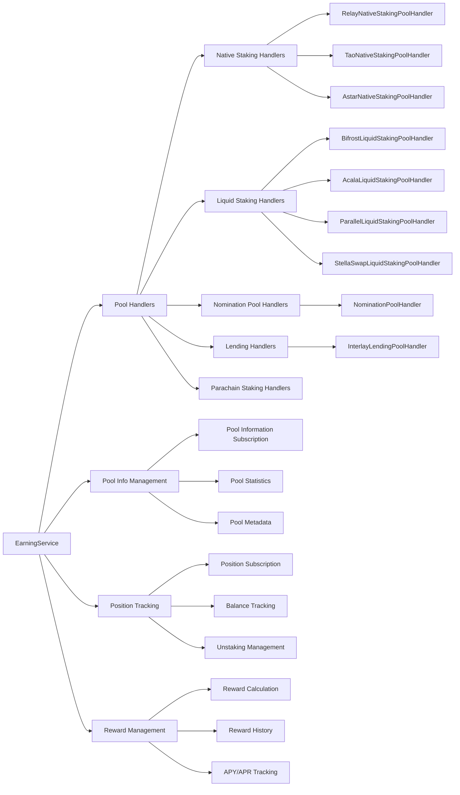
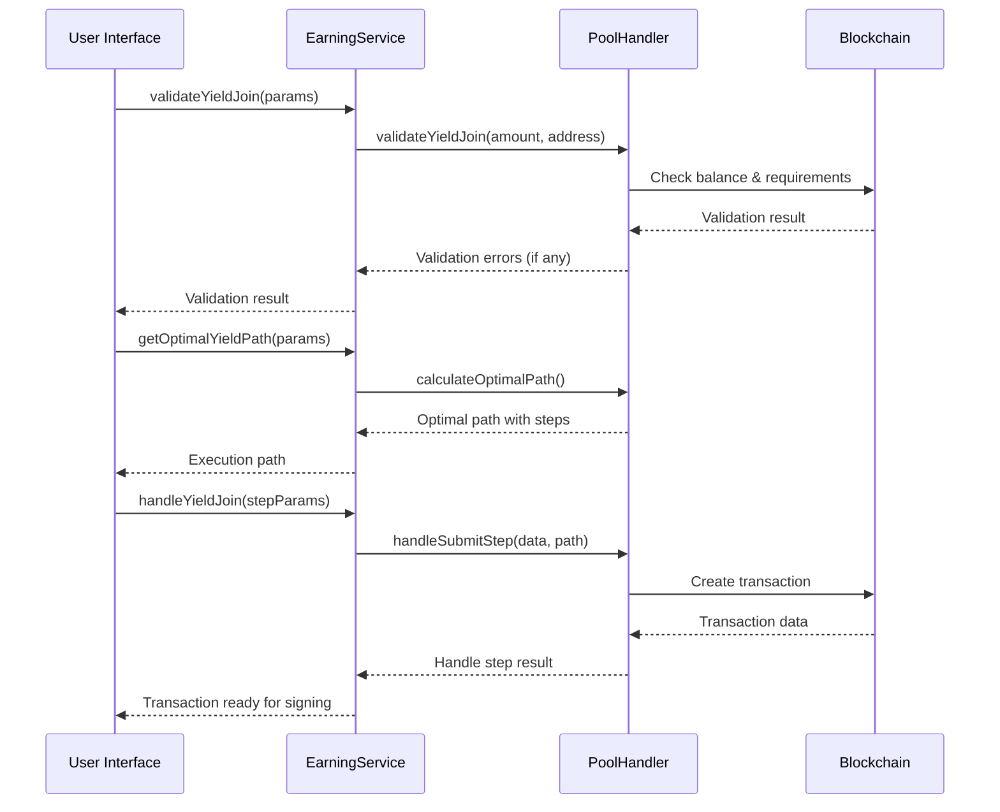
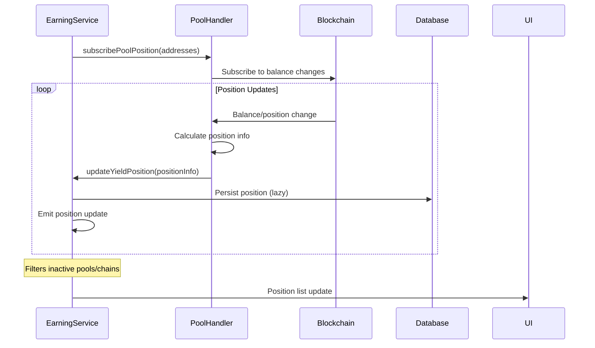
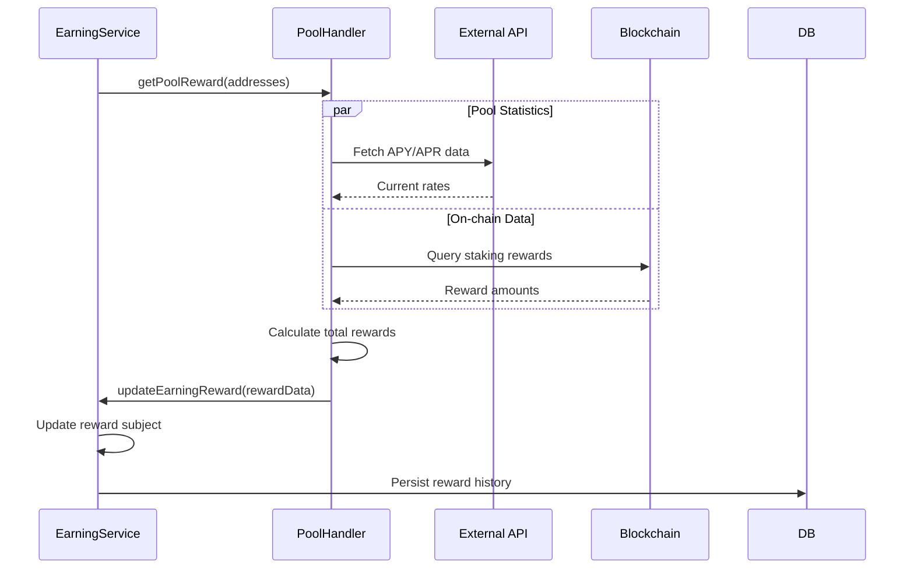
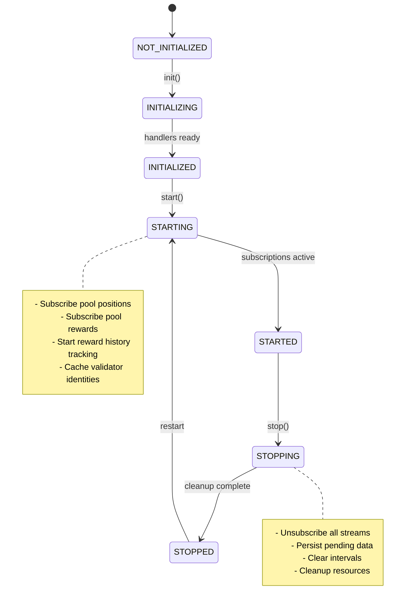

# Earning Service Documentation

## Overview

The Earning Service is a core component of the SubWallet Extension that provides comprehensive support for staking, yield farming, and earning opportunities across multiple blockchain networks. It manages different types of earning pools including liquid staking, native staking, nomination pools, lending protocols, and parachain staking.

## Architecture

### High-Level Structure



### Service Components

#### 1. Base Service (`EarningService`)
- **Role**: Central coordinator for all earning-related operations
- **Responsibilities**:
  - Pool handler management and initialization
  - Data persistence and caching
  - Event handling and lifecycle management
  - Service coordination between different pool types

#### 2. Pool Handlers
- **Role**: Type-specific implementations for different earning mechanisms
- **Base Handler**: `BasePoolHandler` provides common interface and functionality
- **Specialized Handlers**:
  - `BaseLiquidStakingPoolHandler`: Base for liquid staking protocols
  - Native staking handlers for different chains
  - Lending protocol handlers
  - Nomination pool handlers

#### 3. Data Management
- **Pool Information**: Manages pool metadata, statistics, and configuration
- **Position Tracking**: Monitors user positions across all pools
- **Reward Management**: Calculates and tracks earning rewards and history

## Props

### Service Configuration

#### Core Properties
- `state: KoniState` - Global application state reference
- `handlers: Record<string, BasePoolHandler>` - Collection of pool handlers indexed by slug
- `useOnlineCacheOnly: boolean` - Flag to control data source preference

#### Reactive Subjects
- `yieldPoolInfoSubject: BehaviorSubject<Record<string, YieldPoolInfo>>` - Pool information stream
- `yieldPositionSubject: BehaviorSubject<Record<string, YieldPositionInfo>>` - Position data stream
- `yieldPositionListSubject: BehaviorSubject<YieldPositionInfo[]>` - Filtered position list
- `earningRewardSubject: BehaviorSubject<EarningRewardJson>` - Reward data stream
- `earningRewardHistorySubject: BehaviorSubject<Record<string, EarningRewardHistoryItem>>` - Reward history
- `minAmountPercentSubject: BehaviorSubject<Record<string, number>>` - Minimum staking percentages

### Pool Handler Properties

#### Base Handler Interface
```typescript
interface BasePoolHandler {
  slug: string;                           // Unique pool identifier
  type: YieldPoolType;                   // Pool type classification
  chain: string;                         // Associated blockchain
  availableMethod: YieldPoolMethodInfo;  // Supported operations
  isPoolSupportAlternativeFee: boolean;  // Fee token flexibility
}
```

#### Pool Types
- `NATIVE_STAKING`: Direct validator staking
- `NOMINATION_POOL`: Pooled staking with nominated validators
- `LIQUID_STAKING`: Liquid staking tokens (vDOT, sDOT, LDOT, etc.)
- `LENDING`: Lending protocol participation
- `PARACHAIN_STAKING`: Parachain-specific staking mechanisms
- `SUBNET_STAKING`: Subnet staking (e.g., Bittensor)

#### Available Methods
```typescript
interface YieldPoolMethodInfo {
  join: boolean;              // Can stake/join pool
  defaultUnstake: boolean;    // Can unstake with waiting period
  fastUnstake: boolean;       // Can unstake immediately (with fees)
  cancelUnstake: boolean;     // Can cancel pending unstake
  withdraw: boolean;          // Can withdraw unlocked funds
  claimReward: boolean;       // Can claim accumulated rewards
  changeValidator: boolean;   // Can change validator selection
}
```

### Default Values

#### Minimum Amount Percentages
- **Liquid Staking Default**: 95% (5% slippage tolerance)
- **Acala LDOT**: 98% (2% slippage tolerance)
- **Parallel sDOT**: 96% (4% slippage tolerance)
- **Bifrost vDOT**: 95% (5% slippage tolerance)

#### Update Intervals
- **Pool Metadata Refresh**: 1 hour (3,600,000ms)
- **Reward History Update**: 30 minutes (1,800,000ms)
- **Fast Reward Update**: 5 minutes (300,000ms)
- **Pool Target Cache**: 1 hour (3,600,000ms)

## Methods

### Public Service Methods

#### Pool Information Management

##### `getYieldPool(slug: string): Promise<YieldPoolInfo | undefined>`
**Description**: Retrieves specific pool information by slug
- **Input**: `slug` - Pool identifier
- **Output**: Pool information or undefined if not found
- **Error Handling**: Returns undefined for non-existent pools

##### `getYieldPoolInfo(): Promise<YieldPoolInfo[]>`
**Description**: Gets all available pool information
- **Output**: Array of all pool information objects
- **Error Handling**: Waits for earning service ready state

##### `subscribeYieldPoolInfo(): BehaviorSubject<Record<string, YieldPoolInfo>>`
**Description**: Subscribe to pool information updates
- **Output**: Observable stream of pool information map
- **Error Handling**: Provides reactive updates as pools change

#### Position Management

##### `getYieldPosition(address: string, slug: string): Promise<YieldPositionInfo | undefined>`
**Description**: Gets user's position in a specific pool
- **Input Parameters**:
  - `address` - User's wallet address
  - `slug` - Pool identifier
- **Output**: Position information or undefined
- **Error Handling**: Returns undefined for non-existent positions

##### `getYieldPositionInfo(): Promise<YieldPositionInfo[]>`
**Description**: Gets all user positions across pools
- **Output**: Array of position information for active chains
- **Error Handling**: Filters by active chains and non-inactive pools

##### `subscribeYieldPosition(): BehaviorSubject<YieldPositionInfo[]>`
**Description**: Subscribe to position updates
- **Output**: Observable stream of filtered position list
- **Error Handling**: Automatically filters inactive pools and chains

#### Pool Operations

##### `validateYieldJoin(params: OptimalYieldPathParams): Promise<TransactionError[]>`
**Description**: Validates joining a yield pool
- **Input Parameters**: Join operation parameters
- **Output**: Array of validation errors (empty if valid)
- **Error Handling**: Returns comprehensive validation errors

##### `handleYieldJoin(params: HandleYieldStepParams): Promise<HandleYieldStepData>`
**Description**: Executes yield pool join operation
- **Input Parameters**: Step execution parameters
- **Output**: Transaction data for execution
- **Error Handling**: Throws TransactionError for invalid operations

##### `handleYieldLeave(request: RequestYieldLeave): Promise<TransactionData>`
**Description**: Executes yield pool leave operation
- **Input Parameters**: Leave request with amount and options
- **Output**: Transaction data for unstaking
- **Error Handling**: Validates unstaking conditions before execution

##### `handleYieldWithdraw(request: RequestYieldWithdrawal): Promise<TransactionData>`
**Description**: Withdraws unlocked funds from pool
- **Input Parameters**: Withdrawal request with unstaking info
- **Output**: Transaction data for withdrawal
- **Error Handling**: Validates claimable amounts and timing

##### `handleStakeCancelWithdrawal(request: RequestStakeCancelWithdrawal): Promise<TransactionData>`
**Description**: Cancels pending withdrawal request
- **Input Parameters**: Cancellation request parameters
- **Output**: Transaction data for cancellation
- **Error Handling**: Validates cancellation eligibility

##### `handleStakeClaimReward(request: RequestStakeClaimReward): Promise<TransactionData>`
**Description**: Claims accumulated staking rewards
- **Input Parameters**: Reward claim request
- **Output**: Transaction data for claiming
- **Error Handling**: Validates claimable rewards existence

#### Fee and Slippage Management

##### `getEarningSlippage(request: RequestEarningSlippage): Promise<EarningSlippageResult>`
**Description**: Calculates slippage for earning operations
- **Input Parameters**: Operation parameters for slippage calculation
- **Output**: Slippage percentage and estimated output
- **Error Handling**: Returns default slippage for calculation errors

##### `isPoolSupportAlternativeFee(slug: string): boolean`
**Description**: Checks if pool supports alternative fee tokens
- **Input**: Pool slug identifier
- **Output**: Boolean indicating fee token flexibility
- **Error Handling**: Throws TransactionError if pool not found

#### Target and Validator Management

##### `getOptimalYieldPath(params: OptimalYieldPathParams): Promise<OptimalYieldPath>`
**Description**: Finds optimal yield path for operations
- **Input Parameters**: Path optimization parameters
- **Output**: Optimal execution path with steps
- **Error Handling**: Returns error path if optimization fails

##### `getYieldPoolTargets(slug: string): Promise<YieldPoolTarget[]>`
**Description**: Gets available targets (validators/pools) for selection
- **Input**: Pool slug identifier
- **Output**: Array of selectable targets
- **Error Handling**: Returns empty array if no targets available

#### Reward Management

##### `subscribeEarningReward(): BehaviorSubject<EarningRewardJson>`
**Description**: Subscribe to earning reward updates
- **Output**: Observable stream of reward data
- **Error Handling**: Provides ready state indication

##### `getEarningRewardHistory(addresses: string[]): Promise<EarningRewardHistoryItem[]>`
**Description**: Gets historical reward data for addresses
- **Input**: Array of wallet addresses
- **Output**: Array of historical reward items
- **Error Handling**: Filters by available addresses and active chains

### Private Service Methods

#### Pool Handler Management

##### `getPoolHandler(slug: string): BasePoolHandler | undefined`
**Description**: Retrieves appropriate handler for pool slug
- **Input**: Pool identifier
- **Output**: Handler instance or undefined
- **Error Handling**: Uses caching for performance optimization

##### `initHandlers(): Promise<void>`
**Description**: Initializes all pool handlers based on active chains
- **Output**: Promise resolving when handlers are ready
- **Error Handling**: Handles chain activation states and dependencies

#### Data Persistence

##### `loadData(): Promise<void>`
**Description**: Loads persisted pool and position data from database
- **Output**: Promise resolving when data is loaded
- **Error Handling**: Graceful handling of missing or corrupted data

##### `persistData(): Promise<void>`
**Description**: Persists current state to database
- **Output**: Promise for persistence completion
- **Error Handling**: Uses lazy queuing for performance

#### Subscription Management

##### `runSubscribePoolsPosition(): Promise<void>`
**Description**: Starts position subscription for all active pools
- **Output**: Promise resolving when subscriptions are active
- **Error Handling**: Handles network connectivity and chain availability

##### `runUnsubscribePoolsPosition(): void`
**Description**: Stops all position subscriptions and clears queues
- **Error Handling**: Safely cancels all active subscriptions

## Flows

### Pool Join Flow



### Position Subscription Flow



### Reward Tracking Flow



### Service Lifecycle Flow



## Notes

### Known Issues

1. **Performance Considerations**
   - Large numbers of validators can slow down target fetching
   - Position subscriptions may lag on networks with high latency
   - Reward history calculations are resource-intensive for many addresses

2. **Network Dependencies**
   - Service relies on external APIs for APY/APR data
   - Some liquid staking protocols require specific network connectivity
   - Chain synchronization affects real-time position accuracy

3. **Data Consistency**
   - Cross-chain timing differences may cause temporary inconsistencies
   - Reward calculations depend on external data sources
   - Position updates may be delayed during network congestion

### Future Improvements

1. **Enhanced Pool Support**
   - Additional liquid staking protocols integration
   - Cross-chain yield optimization
   - Automated compound staking strategies

2. **Performance Optimizations**
   - Implement data pagination for large datasets
   - Add selective position tracking (user-configurable)
   - Optimize reward calculation algorithms
   - Add caching layers for frequently accessed data

3. **User Experience**
   - Real-time yield opportunity notifications
   - Advanced filtering and sorting options
   - Yield optimization recommendations
   - Historical performance analytics

4. **Technical Enhancements**
   - Add comprehensive error recovery mechanisms
   - Implement circuit breaker patterns for external API calls
   - Add metrics and monitoring for service health
   - Enhance data validation and sanitization

5. **Security Improvements**
   - Add transaction simulation before execution
   - Implement slippage protection mechanisms
   - Add validator reputation scoring
   - Enhance fee estimation accuracy

### Development Guidelines

1. **Adding New Pool Types**
   - Extend `BasePoolHandler` for common functionality
   - Implement required abstract methods
   - Add pool type to `YieldPoolType` enum
   - Update `_STAKING_CHAIN_GROUP` constants

2. **Handler Implementation**
   - Follow existing naming conventions (`ChainTypePoolHandler`)
   - Implement proper error handling in all methods
   - Use lazy loading for heavy operations
   - Maintain backward compatibility for data structures

3. **Testing Considerations**
   - Mock external API dependencies
   - Test edge cases for balance calculations
   - Validate error handling paths
   - Test subscription cleanup and memory leaks

4. **Documentation Standards**
   - Document all public methods with JSDoc
   - Include parameter validation information
   - Describe error conditions and handling
   - Provide usage examples for complex operations
