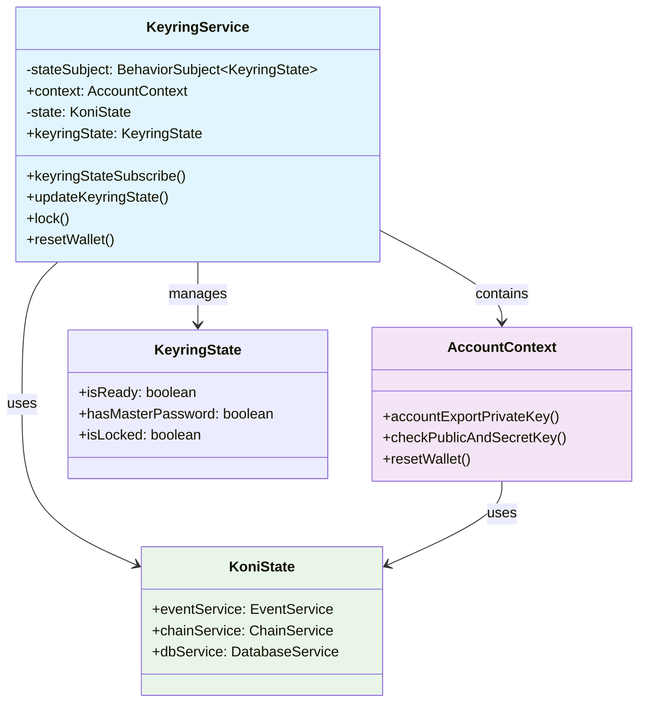
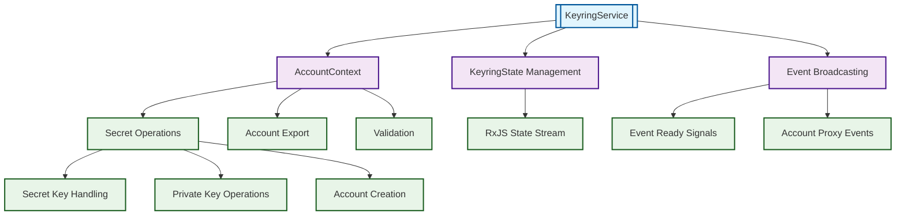
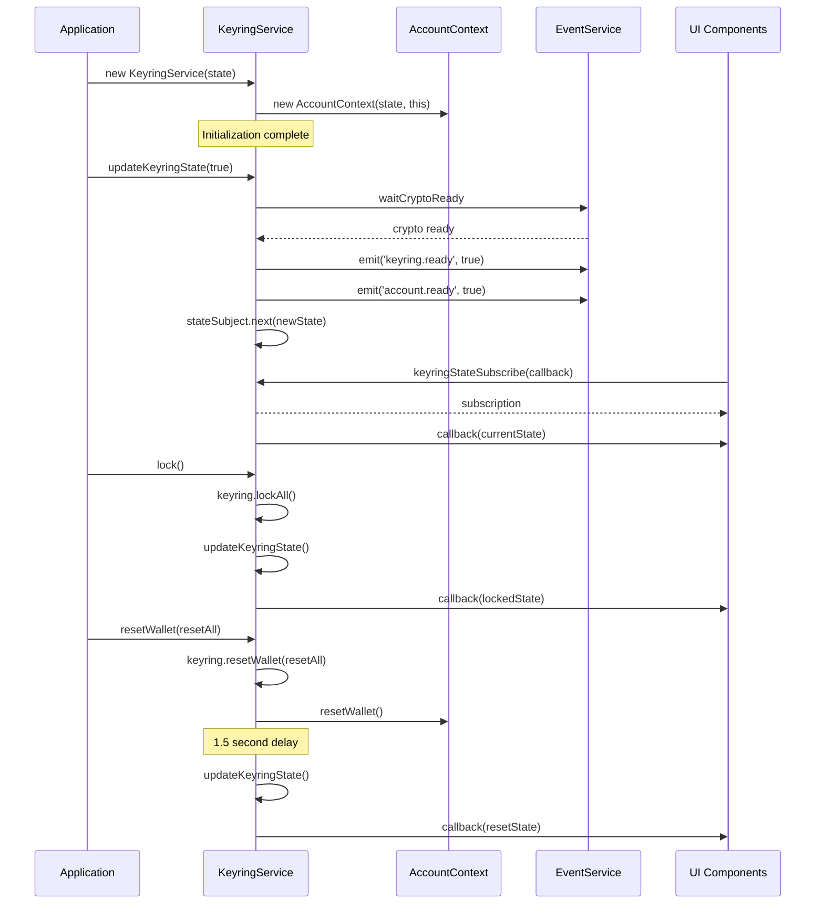
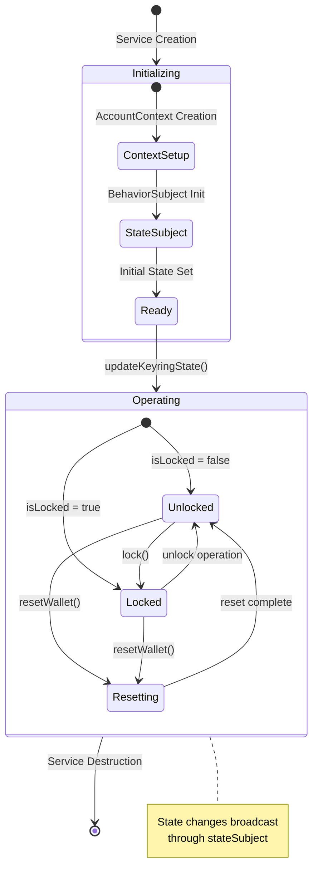

# KeyringService Documentation

## Overview

The KeyringService is a core service in the SubWallet extension that manages wallet state, keyring operations, and account context. It serves as the primary interface for wallet lifecycle management, including initialization, locking, unlocking, and reset operations.

**Purpose**: Centralized management of wallet keyring state and account operations  
**Scope**: Wallet state management, account context handling, and keyring lifecycle control

## Architecture

### High-Level Structure

### Service Integration

### Component Roles

#### KeyringService Core Components

- **State Management**: Manages keyring state through RxJS BehaviorSubject
- **Event Broadcasting**: Emits wallet lifecycle events to the application
- **Account Context**: Provides access to account operations through AccountContext
- **Integration Layer**: Interfaces with KoniState for service coordination

#### Current Service Components

- **[KeyringService](./index.ts)**: Main service class managing wallet state
- **[AccountContext](./context/account-context.ts)**: Account operation context handler
- **[AccountSecretHandler](./context/handlers/Secret.ts)**: Secret key and private key operations

## Props

### KeyringService Properties

| Name | Purpose | Type |
|------|---------|------|
| `stateSubject` | Reactive state management for keyring status | `BehaviorSubject<KeyringState>` |
| `context` | Account operations context | `AccountContext` |
| `state` | Reference to global application state | `KoniState` |

### KeyringState Interface

| Name | Purpose | Type | Default |
|------|---------|------|---------|
| `isReady` | Indicates if keyring is initialized | `boolean` | `false` |
| `hasMasterPassword` | Whether master password is set | `boolean` | `false` |
| `isLocked` | Current lock status of keyring | `boolean` | `false` |

*Reference: [KeyringState type definition](../../background/KoniTypes.ts)*

## Methods

### Core Methods

#### `keyringStateSubscribe(callback: (state: KeyringState) => void)`

**Purpose**: Subscribe to keyring state changes  
**Input**: Callback function to handle state updates  
**Output**: RxJS Subscription object  
**Error Handling**: No specific error handling, relies on RxJS error propagation

*Source: [KeyringService.keyringStateSubscribe](./index.ts#L29-L31)*

#### `updateKeyringState(isReady = true)`

**Purpose**: Updates the keyring state and emits events when ready  
**Input Parameters**:
- `isReady` (boolean, optional): Ready status flag, defaults to true

**Output**: None (void)  
**Error Handling**: Catches and logs crypto ready errors

**Implementation Details**:
- Emits 'keyring.ready' and 'account.ready' events when transitioning to ready state
- Updates state with current keyring password and lock status
- Waits for crypto readiness before emitting events

*Source: [KeyringService.updateKeyringState](./index.ts#L41-L53)*

#### `lock()`

**Purpose**: Locks all keyring accounts  
**Input**: None  
**Output**: None (void)  
**Error Handling**: No explicit error handling

*Source: [KeyringService.lock](./index.ts#L55-L58)*

#### `resetWallet(resetAll: boolean)`

**Purpose**: Resets wallet state and keyring data  
**Input Parameters**:
- `resetAll` (boolean): Whether to perform complete reset

**Output**: Promise<void>  
**Error Handling**: No explicit error handling, includes 1.5 second delay for completion

**Implementation Details**:
- Calls keyring.resetWallet() and context.resetWallet()
- Includes deliberate 1.5 second delay before completion
- Updates keyring state after reset

*Source: [KeyringService.resetWallet](./index.ts#L61-L70)*

### Event Methods

#### `eventInjectReady()`

**Purpose**: Emits inject ready event to signal injection completion  
**Input**: None  
**Output**: None (void)

*Source: [KeyringService.eventInjectReady](./index.ts#L33-L35)*

#### `eventRemoveAccountProxy(proxyId: string)`

**Purpose**: Emits account proxy removal event  
**Input**: Proxy ID string to remove  
**Output**: None (void)

*Source: [KeyringService.eventRemoveAccountProxy](./index.ts#L37-L39)*

## Flows

### Service Lifecycle

### State Management Flow

## Notes

### Known Issues

1. **Reset Delay**: The `resetWallet` method includes a hardcoded 1.5 second delay which may not be optimal for all scenarios
2. **Error Handling**: Limited error handling in core methods, relies on upstream error management

### Future Improvements

1. **Enhanced Error Handling**: Add comprehensive error handling and recovery mechanisms
2. **Configurable Delays**: Make reset delays configurable based on operation complexity
3. **State Validation**: Add state validation before transitions
4. **Metrics Integration**: Add performance metrics for state transition timing

### Integration Dependencies

- **[@subwallet/ui-keyring](../../../ui-keyring)**: Core keyring operations
- **[RxJS BehaviorSubject](https://rxjs.dev/guide/subject#behaviorsubject)**: Reactive state management
- **[AccountContext](./context/account-context.ts)**: Account operation delegation
- **[KoniState](../../koni/background/handlers/State.ts)**: Global state integration

### Related Services

- **[EventService](../event-service)**: Event broadcasting and coordination
- **[ChainService](../chain-service)**: Blockchain network management
- **[RequestService](../request-service)**: External request handling
- **[TransactionService](../transaction-service)**: Transaction processing

*For additional context on account operations, see [AccountSecretHandler documentation](./context/handlers/Secret.ts)*
