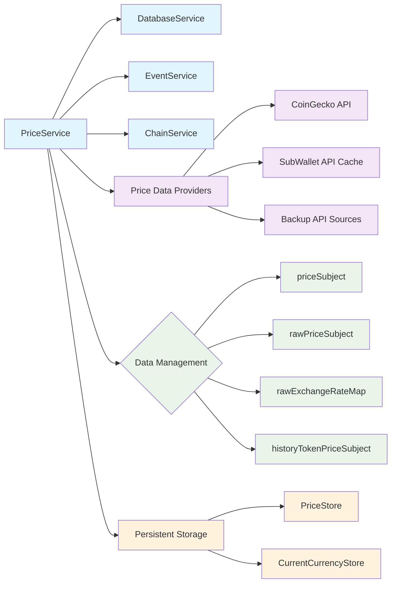
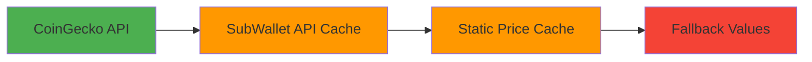
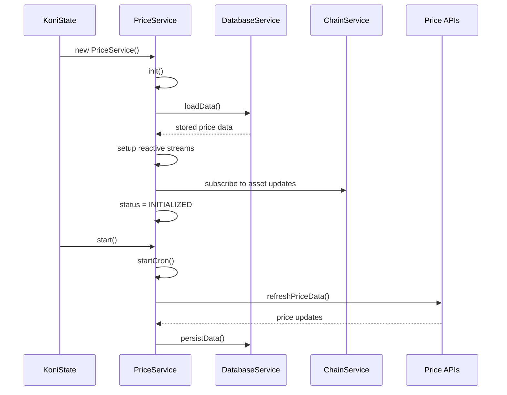
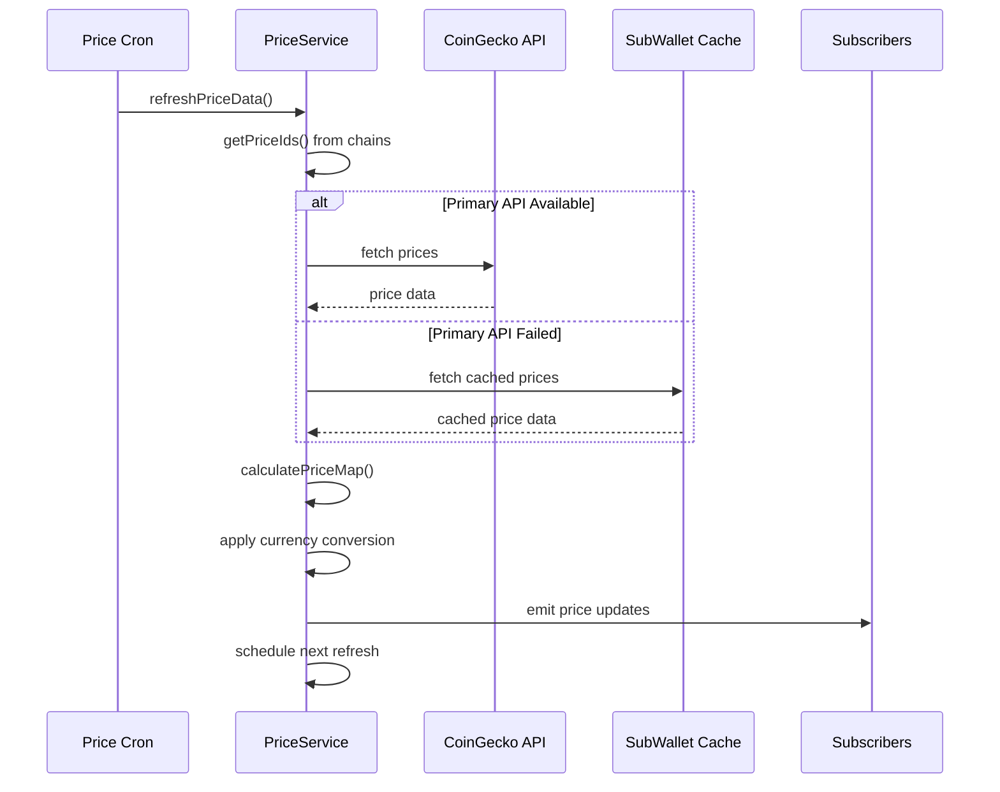
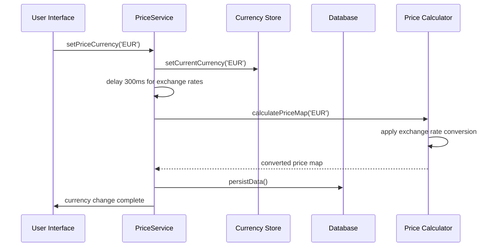

# Price Service

The Price Service is a core component of the SubWallet Extension that manages cryptocurrency price data, exchange rates, and historical price information. It provides real-time price updates for tokens across multiple blockchain networks with support for various fiat currencies.

## Overview

The Price Service centralizes price management by:
- Fetching real-time cryptocurrency prices from multiple data providers
- Managing exchange rates for different fiat currencies  
- Providing historical price data for charting
- Caching price data for offline functionality
- Coordinating with chain service for asset pricing
- Supporting multiple currency displays

## Architecture



### Service Architecture

- **[[PriceService]]**: Main service orchestrating all price operations
- **Price Providers**: External APIs providing cryptocurrency price data
- **Data Subjects**: Reactive streams for real-time price updates
- **Storage Layer**: Persistent price data and user preferences

### Price Provider Hierarchy

The service implements a multi-tier fallback system for data reliability:



## Props

### Core Properties

| Name | Type | Purpose |
|------|------|---------|
| `status` | `ServiceStatus` | Current service initialization status |
| `dbService` | `DatabaseService` | Database service for persistent storage |
| `eventService` | `EventService` | Event system for cross-service communication |
| `chainService` | `ChainService` | Chain service for asset registry integration |

**Source**: [index.ts:35-39](index.ts#L35)

### Data Stream Properties

| Name | Type | Purpose |
|------|------|---------|
| `priceSubject` | `BehaviorSubject<PriceJson>` | Main price data stream with processed prices |
| `rawPriceSubject` | `BehaviorSubject<Omit<PriceJson, 'exchangeRateMap'>>` | Raw price data before currency conversion |
| `rawExchangeRateMap` | `BehaviorSubject<Record<CurrencyType, ExchangeRateJSON>>` | Exchange rate data for currency conversion |
| `historyTokenPriceSubject` | `BehaviorSubject<Record<string, PriceChartPoint[]>>` | Historical price data cache |

**Source**: [index.ts:40-43](index.ts#L40)

### Configuration Properties

| Name | Type | Purpose |
|------|------|---------|
| `refreshTimeout` | `NodeJS.Timeout` | Timer for periodic price updates |
| `priceIds` | `Set<string>` | Set of tracked token price identifiers |
| `currency` | `CurrentCurrencyStore` | User's current currency preference store |

**Source**: [index.ts:44-46](index.ts#L44)

### Data Types

```typescript
interface PriceJson {
  currency: CurrencyType;
  ready?: boolean;
  currencyData: CurrencyJson;
  exchangeRateMap: Record<string, ExchangeRateJSON>;
  priceMap: Record<string, number>;
  price24hMap: Record<string, number>;
  priceCoinGeckoSupported: string[];
  lastUpdatedMap: Record<string, Date>;
}
```

**Source**: [packages/extension-base/src/background/KoniTypes.ts:197-206](packages#L197/extension-base/src/background/KoniTypes.ts)

```typescript
interface CurrentTokenPrice {
  value: number;
  value24h: number;
  time: number;
}
```

**Source**: [packages/extension-base/src/background/KoniTypes.ts:217-221](packages#L217/extension-base/src/background/KoniTypes.ts)

## Methods

### Initialization Methods

#### `init()`
Main initialization method that sets up the service and data streams.

**Input Parameters**: None

**Output Response**: `Promise<void>`

**Flow**:
1. Sets status to INITIALIZING
2. Loads stored price data from database
3. Sets up reactive streams for currency and price updates
4. Registers event handlers for asset updates
5. Sets status to INITIALIZED

**Source**: [index.ts:292-314](index.ts#L292)

#### `loadData()`
Loads previously stored price data from the database.

**Input Parameters**: None

**Output Response**: `Promise<void>`

**Error Handling**: Falls back to default price data if database read fails

**Source**: [index.ts:332-336](index.ts#L332)

### Price Data Methods

#### `getPrice()`
Retrieves current price data synchronously.

**Input Parameters**: None

**Output Response**: `Promise<PriceJson>`

**Source**: [index.ts:169-171](index.ts#L169)

#### `getPriceSubject()`
Returns the reactive price data stream.

**Output Response**: `BehaviorSubject<PriceJson>`

**Source**: [index.ts:173-175](index.ts#L173)

#### `refreshPriceData(priceIds?: Set<string>)`
Manually triggers a price data refresh for specified tokens.

**Input Parameters**:
- `priceIds`: Optional set of token price IDs to refresh (defaults to all tracked tokens)

**Output Response**: `void`

**Error Handling**: Logs errors and schedules automatic retry

**Source**: [index.ts:196-211](index.ts#L196)

### Historical Data Methods

#### `getHistoryTokenPriceData(priceId: string, timeframe: PriceChartTimeframe)`
Retrieves historical price data for charting purposes.

**Input Parameters**:
- `priceId`: Token price identifier
- `timeframe`: Chart timeframe ('1D', '1W', '1M', '3M', 'YTD', '1Y', 'ALL')

**Output Response**: `Promise<HistoryTokenPriceJSON>`

**Error Handling**: Returns empty history on API failures

**Source**: [index.ts:216-260](index.ts#L216)

### Subscription Methods

#### `subscribeCurrentTokenPrice(priceId: string, callback: (price: CurrentTokenPrice) => void)`
Provides reactive updates for a specific token's price.

**Input Parameters**:
- `priceId`: Token price identifier
- `callback`: Function called with price updates

**Output Response**: `{ unsubscribe: () => void, currentPrice: CurrentTokenPrice }`

**Source**: [index.ts:266-290](index.ts#L266)

### Currency Management Methods

#### `setPriceCurrency(newCurrencyCode: CurrencyType)`
Changes the user's preferred display currency.

**Input Parameters**:
- `newCurrencyCode`: New currency code (e.g., 'USD', 'EUR', 'JPY')

**Output Response**: `Promise<boolean>`

**Error Handling**: Persists currency preference to storage

**Source**: [index.ts:182-194](index.ts#L182)

### Service Lifecycle Methods

#### `start()`
Starts the price service and begins periodic price updates.

**Input Parameters**: None

**Output Response**: `Promise<void>`

**Error Handling**: Waits for asset registry before starting

**Source**: [index.ts:342-356](index.ts#L342)

#### `stop()`
Stops the price service and persists current data.

**Input Parameters**: None

**Output Response**: `Promise<void>`

**Error Handling**: Ensures data persistence before stopping

**Source**: [index.ts:367-378](index.ts#L367)

## Flows

### Service Initialization Flow



### Price Update Cycle



### Currency Conversion Flow



## Notes

### Known Issues

1. **API Rate Limiting**: The service may hit rate limits on CoinGecko API during high-frequency updates.
   - **Location**: [coingecko.ts:124-145](coingecko.ts#L124)
   - **Mitigation**: Implements backup API fallback system

2. **Exchange Rate Delays**: Currency conversion may lag during rapid currency switching.
   - **Location**: [index.ts:189-191](index.ts#L189)
   - **Impact**: 300ms delay added to ensure exchange rates are fetched

3. **Historical Data Gaps**: Some tokens may not have complete historical data.
   - **Location**: [index.ts:224-235](index.ts#L224)
   - **Behavior**: Returns empty history array when data unavailable

### Performance Considerations

- **Memory Usage**: Historical price data is cached in memory and may grow with usage
- **Network Requests**: Price updates occur every 30 seconds (configurable via `CRON_REFRESH_PRICE_INTERVAL`)
- **Database Writes**: Price data is persisted on every update cycle and service stop
- **Currency Calculations**: Exchange rate conversions are performed for each price update

### Future Improvements

1. **Enhanced Caching**: Implement more sophisticated caching strategies for historical data
2. **WebSocket Support**: Add real-time price streaming via WebSocket connections
3. **Price Alerts**: Implement price threshold notifications
4. **Performance Optimization**: Reduce memory footprint for historical data storage
5. **Additional Providers**: Integrate more price data providers for better redundancy
6. **Rate Limiting**: Implement intelligent rate limiting to avoid API throttling

### Data Providers

**Primary Provider**:
- **CoinGecko API**: Main source for cryptocurrency prices and exchange rates
- **Endpoint**: `https://api.coingecko.com/api/v3/`

**Backup Providers**:
- **SubWallet API Cache**: `https://api-cache.subwallet.app/api/price/`
- **Static Cache**: `https://static-cache.subwallet.app/price/data.json`
- **Derivative Token API**: Custom endpoint for derivative token calculations

**Source**: [coingecko.ts:40-150](coingecko.ts#L40)

### Dependencies

- **@subwallet/subwallet-api-sdk**: SubWallet API integration
- **rxjs**: Reactive programming for price streams
- **Database Service**: Persistent storage for price data
- **Chain Service**: Asset registry for price ID resolution

**Integration Points**:
- Used by `KoniState` for price management across the extension
- Provides data to balance calculations and portfolio views
- Integrates with `ChainService` for asset price tracking
- Communicates through `EventService` for price update notifications
