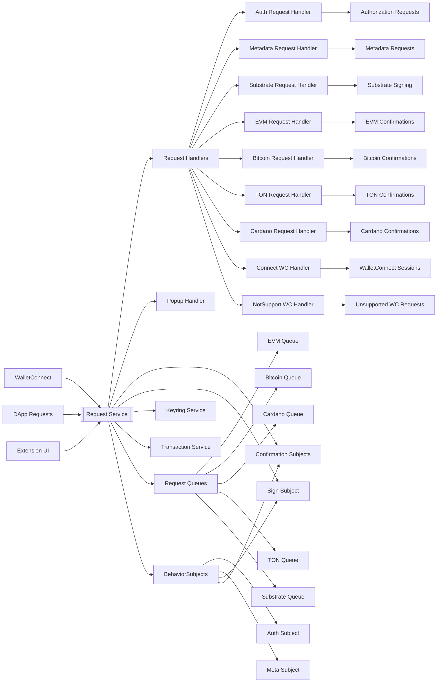
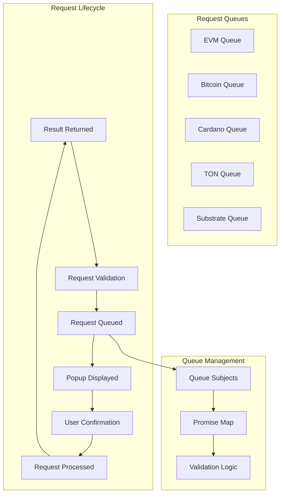
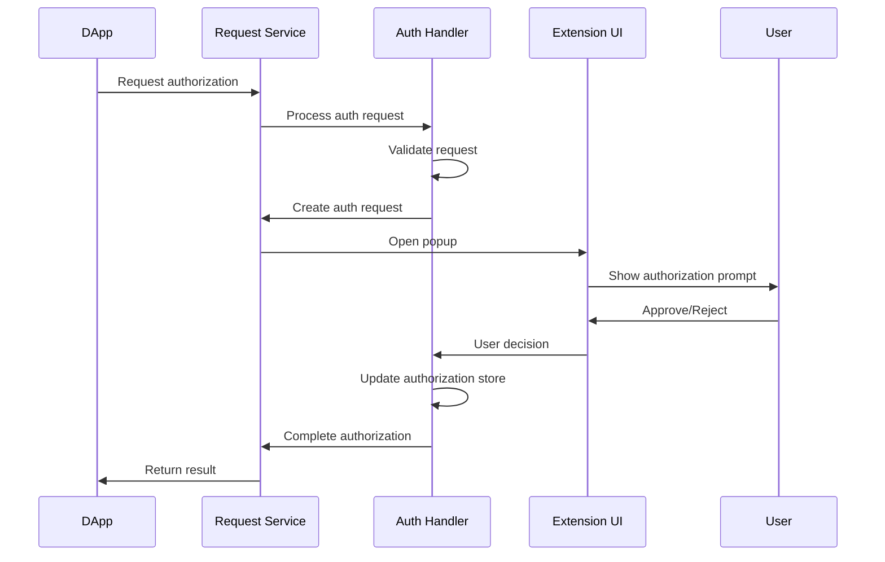
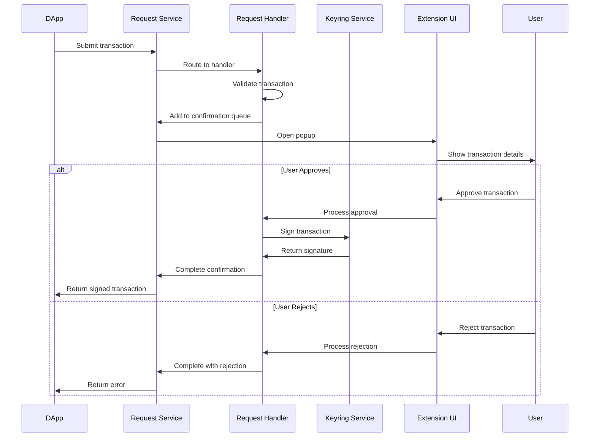
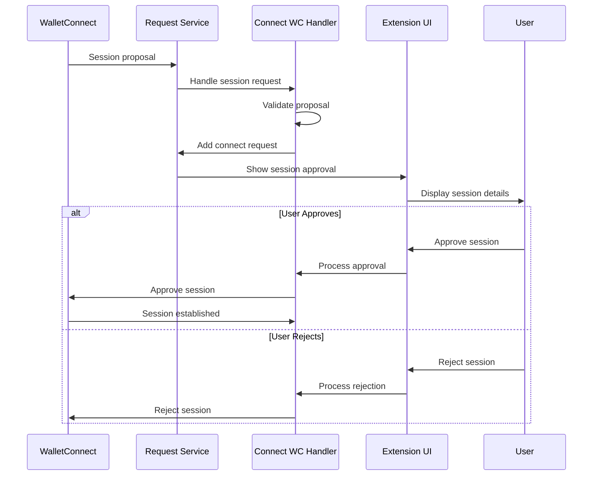
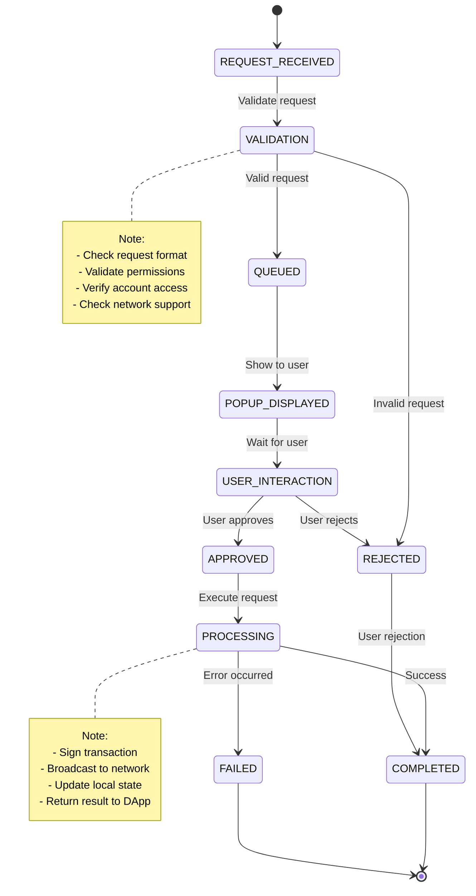

# Request Service Documentation

## Overview

The Request Service is a core component of the SubWallet Extension that manages all types of user interactions, authorization requests, transaction confirmations, and external DApp communications. It serves as the central orchestrator for handling user confirmations across multiple blockchain types including Substrate, EVM, Bitcoin, Cardano, and TON networks. The service also manages WalletConnect integrations, metadata requests, and popup management for the extension.

## Architecture

### High-Level Structure



### Service Components

#### 1. Core Request Service (`RequestService`)
- **Role**: Central coordinator for all request handling operations
- **Dependencies**:
  - `ChainService`: Blockchain network management
  - `SettingService`: Extension settings and preferences
  - `KeyringService`: Account and key management
  - `TransactionService`: Transaction processing
- **Responsibilities**:
  - Request handler lifecycle management
  - Cross-handler coordination
  - Popup management
  - Icon badge updates
  - Request counting and statistics

#### 2. Handler Architecture

##### Authorization Handler (`AuthRequestHandler`)
- **Role**: Manages DApp authorization and connection requests
- **Features**: 
  - Multi-chain authorization (EVM, Substrate, Bitcoin, Cardano, TON)
  - Account type filtering
  - Network-specific permissions
  - Authorization persistence
- **Dependencies**: `ChainService`, `KeyringService`

##### Metadata Handler (`MetadataRequestHandler`)
- **Role**: Handles chain metadata injection and management
- **Features**:
  - Known metadata caching
  - Metadata validation
  - Chain-specific metadata extraction
- **Dependencies**: `MetadataStore`, Extension chains

##### Substrate Request Handler (`SubstrateRequestHandler`)
- **Role**: Manages Substrate-based signing requests
- **Features**:
  - Extrinsic signing
  - Message signing
  - Transaction confirmation
- **Request Types**: Polkadot, Kusama, Parachains

##### EVM Request Handler (`EvmRequestHandler`)
- **Role**: Handles Ethereum-compatible chain requests
- **Features**:
  - Transaction signing
  - Message signing (Personal Sign, Typed Data)
  - Network management
  - Token addition
- **Request Types**: `evmSignatureRequest`, `evmSendTransactionRequest`, `addNetworkRequest`, `addTokenRequest`

##### Bitcoin Request Handler (`BitcoinRequestHandler`)
- **Role**: Processes Bitcoin network transactions and signatures
- **Features**:
  - PSBT signing
  - Transaction creation
  - UTXO management
- **Request Types**: `bitcoinSignatureRequest`, `bitcoinSendTransactionRequest`, `bitcoinSignPsbtRequest`

##### TON Request Handler (`TonRequestHandler`)
- **Role**: Handles The Open Network (TON) blockchain requests
- **Features**:
  - TON transaction signing
  - Message signing
  - Cell handling
- **Request Types**: `tonSignatureRequest`, `tonSendTransactionRequest`

##### Cardano Request Handler (`CardanoRequestHandler`)
- **Role**: Manages Cardano blockchain interactions
- **Features**:
  - Cardano transaction signing
  - CBOR data handling
  - Witness set management
- **Request Types**: `cardanoSignatureRequest`, `cardanoSendTransactionRequest`, `cardanoSignTransactionRequest`

##### WalletConnect Handlers
- **Connect WC Handler**: Manages WalletConnect session proposals
- **NotSupport WC Handler**: Handles unsupported WalletConnect requests

#### 3. Popup Management (`PopupHandler`)
- **Role**: Controls extension popup display and behavior
- **Features**:
  - Window management
  - Notification display
  - User interaction coordination
- **Configuration**: Adaptive window sizing based on OS
ß
#### 4. Request Queue System



## Props

### Core Service Properties

#### Dependencies
```typescript
readonly #chainService: ChainService;           // Blockchain network management
readonly settingService: SettingService;        // Extension settings
readonly keyringService: KeyringService;        // Account management
readonly #transactionService: TransactionService; // Transaction processing
```

#### Handler Instances
```typescript
readonly #popupHandler: PopupHandler;                    // Popup management
readonly #metadataRequestHandler: MetadataRequestHandler; // Metadata handling
readonly #authRequestHandler: AuthRequestHandler;        // Authorization requests
readonly #substrateRequestHandler: SubstrateRequestHandler; // Substrate signing
readonly #evmRequestHandler: EvmRequestHandler;          // EVM confirmations
readonly #bitcoinRequestHandler: BitcoinRequestHandler;  // Bitcoin transactions
readonly #tonRequestHandler: TonRequestHandler;          // TON operations
readonly #cardanoRequestHandler: CardanoRequestHandler;  // Cardano transactions
readonly #connectWCRequestHandler: ConnectWCRequestHandler; // WalletConnect sessions
readonly #notSupportWCRequestHandler: NotSupportWCRequestHandler; // Unsupported WC
```

### Request Handler Properties

#### Common Handler Interface
```typescript
interface BaseRequestHandler {
  requestService: RequestService;           // Parent service reference
  logger: Logger;                          // Request logging
  numRequests: number;                     // Active request count
  confirmationsQueueSubject: BehaviorSubject; // Request queue stream
  confirmationsPromiseMap: Record<string, any>; // Promise resolution map
}
```

#### Authorization Properties
```typescript
interface AuthRequestHandler {
  authSubjectV2: BehaviorSubject<AuthorizeRequest[]>; // Authorization stream
  numAuthRequests: number;                            // Auth request count
  subscribeEvmChainChange: BehaviorSubject;          // EVM chain updates
  subscribeAuthorizeUrlSubject: BehaviorSubject;     // URL authorization
}
```

#### Confirmation Queue Types
- **EVM Confirmations**: Signature requests, transactions, network/token additions
- **Bitcoin Confirmations**: PSBT signing, transaction broadcasting, message signing
- **Cardano Confirmations**: Transaction signing, data signing, witness generation
- **TON Confirmations**: Cell transactions, message signing, contract interactions
- **Substrate Confirmations**: Extrinsic signing, message signing

### Request Types and Structures

#### Authentication Requests
```typescript
interface AuthorizeRequest {
  id: string;                              // Request identifier
  request: RequestAuthorizeTab;            // Authorization details
  url: string;                            // Requesting DApp URL
  isInternal: boolean;                    // Internal vs external request
}
```

#### Transaction Confirmation Structure
```typescript
interface ConfirmationRequest {
  id: string;                             // Unique request ID
  payload: any;                          // Request-specific data
  options: ConfirmationsQueueItemOptions; // Request options
  validator?: Function;                   // Validation function
  isInternal: boolean;                   // Internal request flag
}
```

## Methods

### Public Service Methods

#### Request Management

##### `updateIconV2(shouldClose?: boolean): void`
**Description**: Updates extension icon badge with pending request count
- **Input**: Optional close flag for popup management
- **Error Handling**: Safely updates UI indicators

##### `getAddressList(value = false): Record<string, boolean>`
**Description**: Gets all available wallet addresses
- **Input**: Default value for address mapping
- **Output**: Address to boolean mapping
- **Error Handling**: Returns empty object if keyring unavailable

##### `popupOpen(): void`
**Description**: Opens extension popup for user interaction
- **Error Handling**: Reuses existing popup if available, creates new otherwise

##### `popupClose(): void`
**Description**: Closes extension popup
- **Error Handling**: Safely handles popup closure

#### Authorization Methods

##### `authorizeUrlV2(url: string, request: RequestAuthorizeTab): Promise<boolean>`
**Description**: Processes DApp authorization request
- **Input Parameters**:
  - `url` - DApp origin URL
  - `request` - Authorization details
- **Output**: Authorization result
- **Error Handling**: Validates URL and request parameters

##### `ensureUrlAuthorizedV2(url: string): Promise<boolean>`
**Description**: Checks if URL is authorized for current context
- **Input**: DApp URL to verify
- **Output**: Authorization status
- **Error Handling**: Returns false for invalid or unauthorized URLs

##### `getDAppChainInfo(options: {accessType: AccountAuthType, autoActive?: boolean, defaultChain?: string, url?: string})`
**Description**: Gets chain information for DApp connections
- **Input Parameters**: Access configuration options
- **Output**: Available chains and network information
- **Error Handling**: Filters by account type and availability

#### Confirmation Management

##### `addConfirmation<CT extends ConfirmationType>(id: string, url: string, type: CT, payload: any, options?: any, validator?: Function): Promise<any>`
**Description**: Adds EVM confirmation request to queue
- **Input Parameters**:
  - `id` - Request identifier
  - `url` - Origin URL
  - `type` - Confirmation type
  - `payload` - Request data
  - `options` - Additional options
  - `validator` - Validation function
- **Output**: Promise resolving to user response
- **Error Handling**: Validates request format and requirements

##### `completeConfirmation(request: RequestConfirmationComplete): Promise<boolean>`
**Description**: Processes user response to confirmation request
- **Input**: Completion request with user decision
- **Output**: Processing success status
- **Error Handling**: Validates response and executes accordingly

##### `addConfirmationBitcoin<CT extends ConfirmationTypeBitcoin>(...): Promise<any>`
**Description**: Adds Bitcoin-specific confirmation request
- **Input Parameters**: Bitcoin request parameters
- **Output**: Promise for Bitcoin operation result
- **Error Handling**: Bitcoin-specific validation and error handling

##### `addConfirmationCardano<CT extends ConfirmationTypeCardano>(...): Promise<any>`
**Description**: Adds Cardano-specific confirmation request
- **Input Parameters**: Cardano request parameters
- **Output**: Promise for Cardano operation result
- **Error Handling**: Cardano transaction validation

##### `addConfirmationTon<CT extends ConfirmationTypeTon>(...): Promise<any>`
**Description**: Adds TON-specific confirmation request
- **Input Parameters**: TON request parameters
- **Output**: Promise for TON operation result
- **Error Handling**: TON cell and transaction validation

#### Substrate Signing

##### `sign(url: string, request: RequestSign, id?: string): Promise<ResponseSigning>`
**Description**: Handles Substrate signing requests
- **Input Parameters**:
  - `url` - Origin URL
  - `request` - Signing request details
  - `id` - Optional request ID
- **Output**: Signing response with signature
- **Error Handling**: Validates account access and signing capability

##### `signInternalTransaction(id: string, address: string, url: string, payload: SignerPayloadJSON, onSign?: Function): Promise<ResponseSigning>`
**Description**: Signs internal transaction without user confirmation
- **Input Parameters**: Transaction details and callback
- **Output**: Signed transaction result
- **Error Handling**: Internal transaction validation

#### WalletConnect Management

##### `addConnectWCRequest(request: WalletConnectSessionRequest): void`
**Description**: Adds WalletConnect session request
- **Input**: WalletConnect session proposal
- **Error Handling**: Validates session parameters

##### `addNotSupportWCRequest(request: WalletConnectNotSupportRequest): void`
**Description**: Handles unsupported WalletConnect requests
- **Input**: Unsupported request details
- **Error Handling**: Logs unsupported features

#### Metadata Management

##### `injectMetadata(request: MetadataDef): boolean`
**Description**: Injects chain metadata for transaction signing
- **Input**: Metadata definition
- **Output**: Injection success status
- **Error Handling**: Validates metadata format and genesis hash

##### `saveMetadata(meta: MetadataDef): void`
**Description**: Persists metadata for future use
- **Input**: Metadata to save
- **Error Handling**: Handles storage errors gracefully

### Subscription Methods

##### `get signSubject(): BehaviorSubject<SigningRequest[]>`
**Description**: Subscribe to Substrate signing requests
- **Output**: Observable stream of signing requests
- **Error Handling**: Provides filtered and formatted request list

##### `get confirmationsQueueSubject(): BehaviorSubject<ConfirmationsQueue>`
**Description**: Subscribe to EVM confirmation queue
- **Output**: Observable stream of EVM confirmations
- **Error Handling**: Real-time queue updates

##### `get authSubjectV2(): BehaviorSubject<AuthorizeRequest[]>`
**Description**: Subscribe to authorization requests
- **Output**: Observable stream of auth requests
- **Error Handling**: Filtered authorization requests

### Private Methods

#### Request Processing

##### `resetWallet(): void`
**Description**: Resets all handlers when wallet is cleared
- **Error Handling**: Safely clears all pending requests

## Flows

### DApp Authorization Flow



### Transaction Confirmation Flow



### WalletConnect Session Flow



### Request Queue Management Flow



## Notes

### Known Issues

1. **Performance Considerations**
   - Large numbers of pending requests can slow down popup rendering
   - WalletConnect session management may lag with many active sessions
   - Request queue processing is synchronous and may block UI updates

2. **Browser Compatibility**
   - Popup window behavior varies across browsers
   - Extension manifest V3 changes affect background script persistence
   - Chrome and Firefox have different WalletConnect implementations

3. **Security Considerations**
   - Request validation depends on proper URL parsing
   - Authorization persistence requires secure storage
   - Cross-origin request handling needs careful validation

### Future Improvements

1. **Enhanced Request Management**
   - Implement request prioritization system
   - Add request batching for improved performance
   - Implement request expiration and cleanup

2. **User Experience Enhancements**
   - Add request preview and simulation
   - Implement smart contract interaction warnings
   - Add transaction fee estimation improvements

3. **Developer Experience**
   - Add comprehensive request debugging tools
   - Implement request analytics and monitoring
   - Add automated testing for all request types

4. **Security Enhancements**
   - Implement advanced phishing detection
   - Add transaction risk assessment
   - Enhance authorization scope management

5. **Multi-Chain Support**
   - Add support for additional blockchain networks
   - Implement cross-chain request coordination
   - Add network-specific request optimizations

### Development Guidelines

1. **Adding New Request Types**
   - Extend appropriate handler for the blockchain type
   - Implement proper validation and error handling
   - Add confirmation queue management
   - Update request counting and UI indicators

2. **Handler Implementation**
   - Follow existing handler patterns for consistency
   - Implement proper cleanup in `resetWallet()` method
   - Use BehaviorSubjects for reactive state management
   - Handle popup management appropriately

3. **Security Best Practices**
   - Always validate request origins and parameters
   - Implement proper authorization checks
   - Use secure communication between components
   - Handle sensitive data with appropriate protection

4. **Testing Requirements**
   - Test all request types and flows
   - Validate error handling and edge cases
   - Test cross-browser compatibility
   - Verify security measures and authorization

### Architecture References

- Main service: [`/packages/extension-base/src/services/request-service/index.ts`](/packages/extension-base/src/services/request-service/index.ts)
- Handler implementations: [`/packages/extension-base/src/services/request-service/handler/`](/packages/extension-base/src/services/request-service/handler/)
- Type definitions: [`/packages/extension-base/src/services/request-service/types.ts`](/packages/extension-base/src/services/request-service/types.ts)
- Constants: [`/packages/extension-base/src/services/request-service/constants.ts`](/packages/extension-base/src/services/request-service/constants.ts)
- Helper functions: [`/packages/extension-base/src/services/request-service/helper/index.ts`](/packages/extension-base/src/services/request-service/helper/index.ts)
