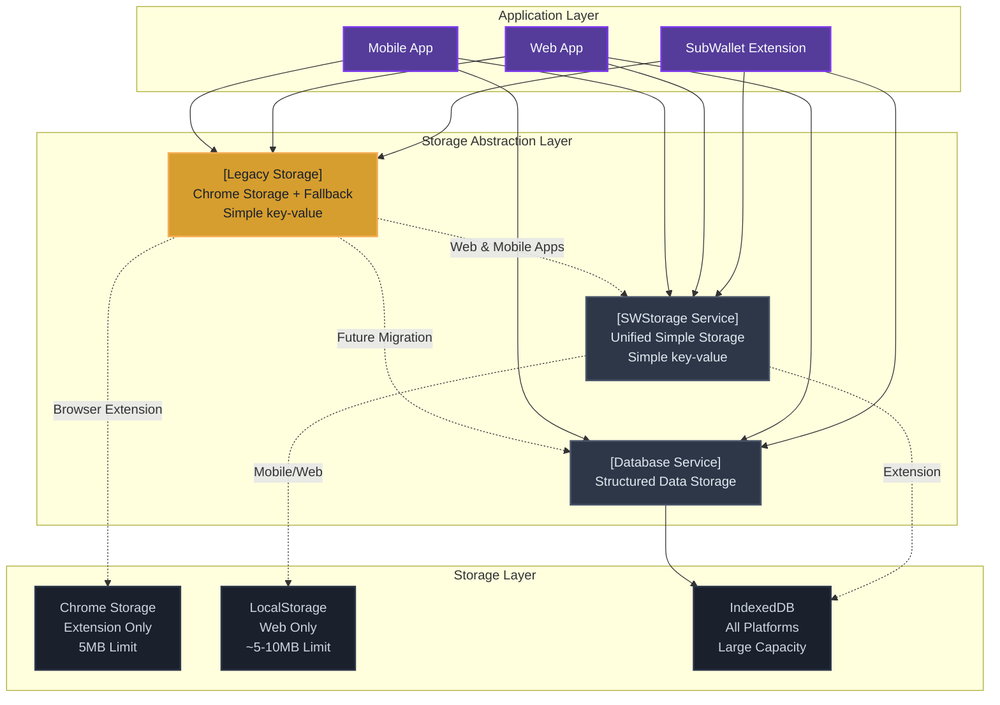
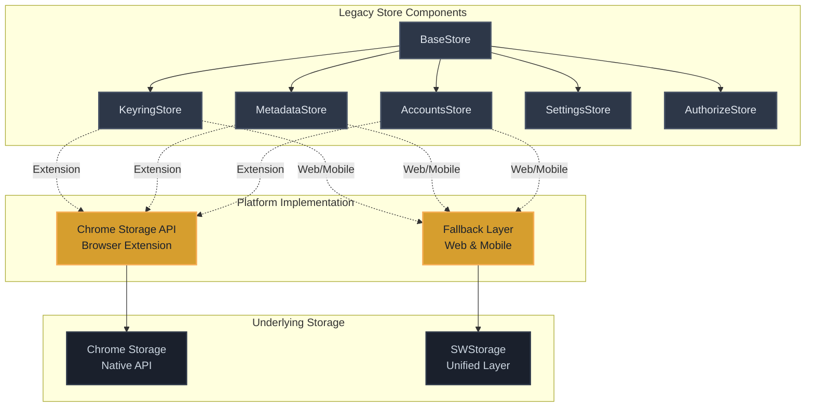
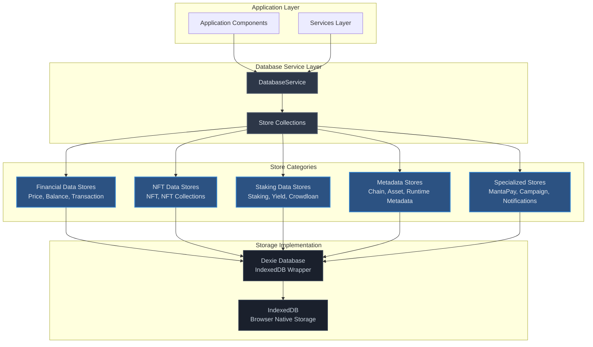
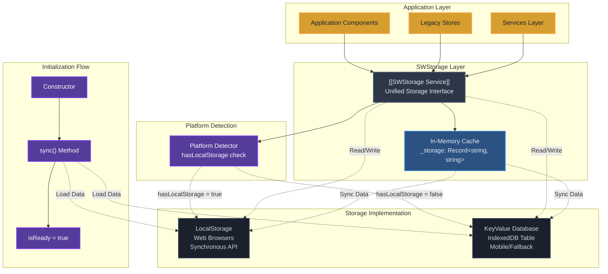
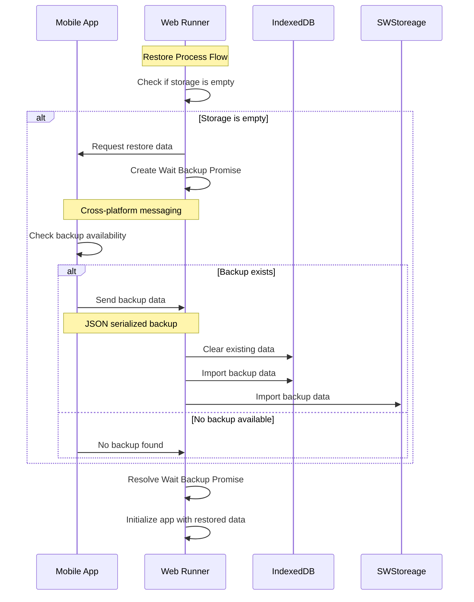
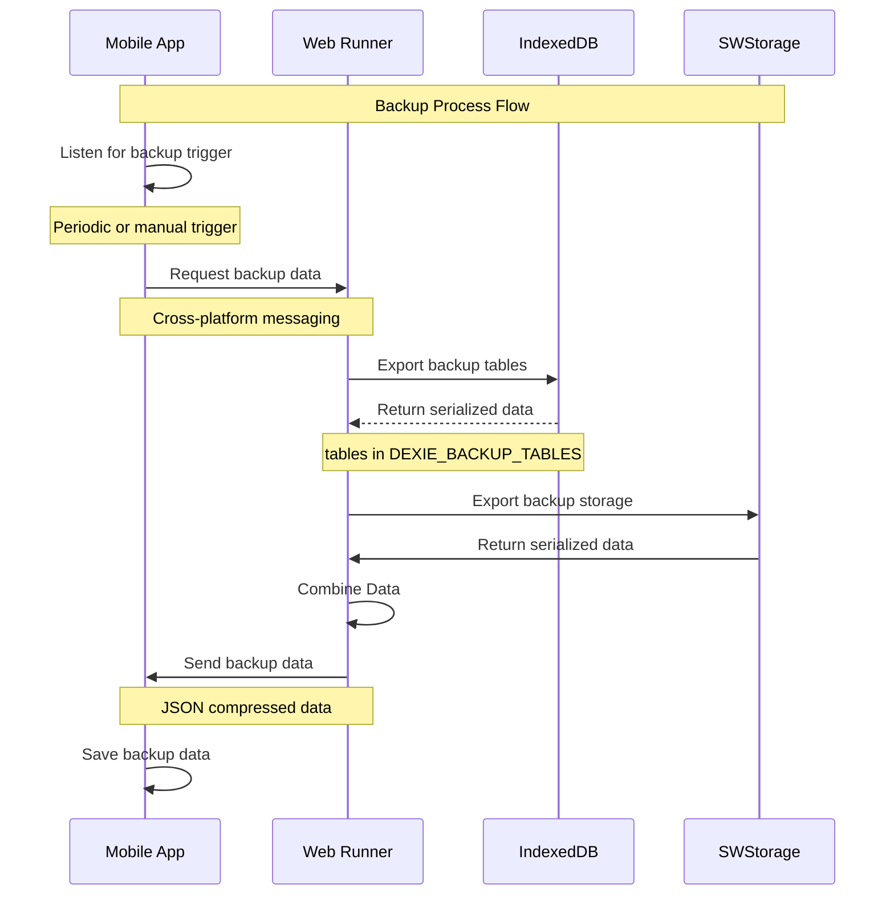

# Storage Service Documentation

## Overview

The Storage Service in SubWallet Extension manages multiple storage types to ensure data is stored, accessed, and synchronized efficiently across different environments (browser extension, web app, mobile). This service includes three main layers: **Chrome Storage**, **IndexedDB**, and **LocalStorage** with fallback mechanisms to support cross-platform compatibility.

## Architecture

### High-Level Storage Architecture



SubWallet Extension currently uses 3 types of storage:

#### Storage Types
- **Chrome Storage**: Extension-specific storage that saves key-value pairs. Not available in web environments.
- **Local Storage**: Simple key-value storage. Cannot store information for web-runner and service worker environments.
- **IndexedDB**: Advanced storage available across all environments.

#### Storage Implementation Patterns

##### SWStorage (Unified Simple Storage)
Creates simple key-value storage with automatic platform adaptation:
- Automatically applies localStorage or IndexedDB depending on the specific platform
- Provides consistent API across different environments
- Handles platform detection and fallback mechanisms
- Acts as the underlying storage layer for Legacy Stores in web and mobile environments

##### Legacy Stores
Direct usage of Chrome Storage for value storage with cross-platform fallback support:
- Inherited form from **Polkadot{.js} extension** and related modules
- **Legacy storage** pattern still used by older components
- **Browser Extension**: Uses Chrome Storage API directly with prefix-based organization
- **Web App & Mobile App**: Uses fallback mechanism through SWStorage when Chrome Storage is unavailable
- Fallback implementation creates Chrome Storage API compatibility layer using SWStorage

##### Database Service (Modern Approach)
Registers databases in `IndexedDB` format:
- New storage pattern commonly applied for newly deployed services
- Supports migration and many other advanced methods
- Structured data storage with schema versioning
- Transaction support and complex queries

#### Migration Roadmap

**Current State:**
- **SW Storage**: Continue to be used for simple storage needs
- **Legacy Store → Database Service**: Transition legacy stores to Database Service
- **Database Service Optimization**: Restructure database service and usage patterns for clearer and more transparent architecture

**Future Enhancements:**
- **Messaging-based Storage**: Add storage accessible through messaging to meet injection storage needs via mobile instead of web
- **Unified Storage Interface**: Develop consistent storage interface across all platforms
- **Performance Optimization**: Implement advanced caching and optimization strategies


### Chrome Storage Fallback Mechanism

The fallback mechanism enables Legacy Stores to work seamlessly across all platforms by providing Chrome Storage API compatibility when the native Chrome APIs are not available.


**Cross-Platform Compatibility:**
- **Browser Extension**: Legacy Stores use native `chrome.storage.local` directly
- **Web App**: Fallback creates `global.chrome.storage` using SWStorage → LocalStorage
- **Mobile App**: Fallback creates `global.chrome.storage` using SWStorage → IndexedDB
- **Service Worker**: Fallback creates `global.chrome.storage` using SWStorage → IndexedDB

**Key Benefits:**
- Legacy code requires no modification to work across platforms
- Consistent API interface regardless of underlying storage technology
- Automatic platform detection and appropriate storage selection
- Transparent data serialization/deserialization (JSON handling)
- Error handling and callback compatibility with Chrome Storage API

---

## Legacy Storage - Chrome Storage API

### Overview

Legacy Storage represents the original storage pattern inherited from Polkadot{.js} extension. It provides a simple, prefix-based key-value storage system that maintains compatibility across all SubWallet Extension platforms through fallback mechanisms.

#### Key Characteristics
- **Origin**: Inherited from Polkadot{.js} extension architecture
- **Pattern**: Prefix-based key organization with reactive subjects
- **API Style**: Callback-based Chrome Storage API compatibility
- **Cross-Platform**: Automatic fallback to SWStorage when Chrome Storage unavailable
- **Data Types**: Supports complex objects with automatic JSON serialization

#### Architecture Overview



### Implementation Pattern

#### Core BaseStore Structure
Read more in file [BaseStore](../../stores/Base.ts)

### Common Legacy Store Types

The following are the main legacy stores currently used in SubWallet Extension:

#### Core Account Management
- **[KeyringStore](../../stores/Keyring.ts)** - Manages encrypted keyring data and password storage for account security
- **[AccountsStore](../../stores/Accounts.ts)** - Stores account information, metadata, and testing account filtering
- **[CurrentAccountStore](../../stores/CurrentAccountStore.ts)** - Tracks currently selected account state across the application
- **[AccountProxyStore](../../stores/AccountProxyStore.ts)** - Manages proxy account relationships and delegation settings
- **[AccountRef](../../stores/AccountRef.ts)** - Manages account reference data and relationships for unified account

#### Application Settings & Configuration  
- **[Application](../../stores/Application.ts)** - Stores application-level state and global settings
- **[SettingsStore](../../stores/Settings.ts)** - Stores user preferences, application settings, and configuration options
- **[EnvironmentStore](../../stores/EnvironmentStore.ts)** - Manages environment-specific configurations and feature flags
- **[CurrentCurrencyStore](../../stores/CurrentCurrencyStore.ts)** - Tracks selected currency for price display and calculations

#### Security & Authorization
- **[AuthorizeStore](../../stores/Authorize.ts)** - Manages authorized URLs and dApp connection permissions
- **[PassPhishingStore](../../stores/PassPhishingStore.ts)** - Stores anti-phishing configuration and trusted sites

#### Blockchain Data & Metadata
- **[MetadataStore](../../stores/Metadata.ts)** - Caches blockchain runtime metadata for transaction processing
- **[ChainlistStore](../../stores/ChainlistStore.ts)** - Manages supported blockchain networks and their configurations
- **[AssetSetting](../../stores/AssetSetting.ts)** - Stores token and asset configuration settings
- **[DetectAccountBalance](../../stores/DetectAccountBalance.ts)** - Handles account balance detection and monitoring

#### Transaction Management
- **[TransactionHistory](../../stores/TransactionHistory.ts)** - Legacy transaction history storage (deprecated)
- **[TransactionHistoryV3](../../stores/TransactionHistoryV3.ts)** - Enhanced transaction history with improved structure
- **[ModifyPairStore](../../stores/ModifyPairStore.ts)** - Manages transaction pair modifications and edits

All legacy stores extend from **[BaseStore](../../stores/Base.ts)** which provides the foundational Chrome Storage API integration with automatic fallback support for cross-platform compatibility.

#### Platform-Specific Implementation
Implement fallback in non Service Worker environment
Read more in files:
- [Web Runner Fallback](../../../../web-runner/src/fallback.ts)
- [WebApp Fallback](../../../../webapp/src/fallback.ts)

### Methods

#### Chrome Storage Operations

##### `get(key: string, update: (value: T) => void): void`
**Description**: Retrieves value from Chrome storage with callback
- **Input Parameters**:
  - `key` - Storage key with prefix applied
  - `update` - Callback function receiving the value
- **Implementation**: Uses chrome.storage.local.get() or fallback equivalent
- **Error Handling**: Uses Chrome runtime error handling with console logging

##### `set(key: string, value: T, update?: () => void): void`
**Description**: Sets value in Chrome storage
- **Input Parameters**:
  - `key` - Storage key with prefix applied  
  - `value` - Value to store (automatically JSON serialized)
  - `update` - Optional callback on completion
- **Implementation**: Uses chrome.storage.local.set() or fallback equivalent
- **Error Handling**: Chrome runtime error logging with optional callback

##### `allMap(update: (value: Record<string, T>) => void): void`
**Description**: Retrieves all values with specific prefix
- **Input**: Callback function receiving all values as map
- **Implementation**: 
  - Gets all keys from storage
  - Filters by store prefix
  - Returns organized key-value map
- **Error Handling**: Filters by prefix and handles Chrome storage errors

#### Store Management Methods

##### `subject.subscribe(callback: (value: T) => void): Subscription`
**Description**: Subscribe to reactive data stream
- **Input**: Callback function for data updates
- **Output**: RxJS subscription object
- **Usage**: Real-time updates when storage changes

##### `subject.next(value: T): void`
**Description**: Emit new value to all subscribers
- **Input**: New value to broadcast
- **Usage**: Notify components of data changes

##### `initialize(): Promise<void>`
**Description**: Load initial data and set up reactivity
- **Implementation**: 
  - Load existing data from storage
  - Initialize reactive subject
  - Set up change listeners
- **Error Handling**: Graceful fallback to default values

---

## Storage Service - IndexedDB

### Overview

The Storage Service represents the modern approach to data storage in SubWallet Extension, utilizing IndexedDB through the Dexie wrapper for structured, high-performance data management. This service handles all complex data operations including blockchain transactions, account balances, NFT collections, and metadata storage with full ACID transaction support.

#### Key Characteristics
- **Technology**: IndexedDB with Dexie wrapper for enhanced functionality
- **Scope**: Large-scale structured data storage and complex queries
- **Platform**: Available across all platforms (Browser Extension, Web App, Mobile)
- **Performance**: Optimized for high-volume data operations with indexing strategies
- **Schema Management**: Versioned schema with automatic migration support

#### Architecture Overview



### Implementation Architecture

### Properties

```typescript
interface DatabaseService {
  // Core database connection
  db: Dexie;                           // Main Dexie database instance
  version: number;                     // Current schema version (11)
  isReady: boolean;                   // Service initialization status
  
  // Store collections organized by functional domain
  stores: {
    // Core data stores - Primary user data
    price: PriceStore;                 // Real-time and historical token prices
    balance: BalanceStore;             // Multi-chain account balance tracking
    nft: NftStore;                     // Individual NFT items and metadata
    nftCollection: NftCollectionStore; // NFT collection information
    crowdloan: CrowdloanStore;        // Parachain crowdloan participation
    staking: StakingStore;            // Native staking positions and rewards
    transaction: TransactionStore;     // Complete transaction history
    
    // Metadata stores - Configuration and reference data
    metadata: MetadataStore;          // Chain runtime metadata cache
    metadataV15: MetadataV15Store;    // Latest metadata format support
    chain: ChainStore;                // Blockchain network configurations
    asset: AssetStore;                // Token and asset definitions
    
    // Yield farming stores - DeFi functionality
    yieldPoolInfo: YieldPoolStore;    // Available yield farming pools
    yieldPosition: YieldPositionStore; // User positions in yield pools
    
    // Staking metadata - Enhanced staking functionality
    chainStakingMetadata: ChainStakingMetadataStore; // Per-chain staking parameters
    nominatorMetadata: NominatorMetadataStore;       // Nominator performance data
    
    // Specialized stores - Advanced features
    mantaPay: MantaPayStore;          // Privacy protocol transaction ledger
    campaign: CampaignStore;          // Marketing campaign tracking
    inappNotification: InappNotificationStore; // Application notification system
    processTransactions: ProcessTransactionStore; // Transaction processing queue
  };
  
  // Service configuration
  config: {
    transactionTimeout: number;        // Database transaction timeout (10s)
    bulkOperationSize: number;        // Bulk operation batch size (100)
    backupInterval: number;           // Automatic backup interval (24h)
    maintenanceInterval: number;      // Database maintenance cycle (24h)
  };
}
```

### Database Examples
Check more in [stores](db-stores)

### Advanced Database Features

### Migration
Readmore in [Migration Sevice](../migration-service)

### Indexing Strategy
- **Primary Keys**: Unique identifiers (slug, address combinations)
- **Compound Indexes**: `[tokenSlug+address]`, `[address+chain]`
- **Search Indexes**: name, symbol, chain fields
- **Performance Indexes**: Frequently queried combinations


## SWStorage

### Overview

SWStorage is a unified simple storage layer that provides consistent key-value storage across all SubWallet Extension platforms. It automatically adapts to the available storage technologies on each platform while maintaining a single, promise-based API interface.

#### Key Characteristics
- **Unified API**: Single interface for all platforms with automatic storage selection
- **Cross-Platform**: Works seamlessly on Browser Extension, Web App, and Mobile platforms
- **Async Operations**: Promise-based methods for consistent asynchronous handling
- **In-Memory Cache**: Maintains local cache for performance optimization
- **Automatic Fallback**: Intelligent selection between localStorage and IndexedDB

#### Architecture Overview


### Implementation Pattern

#### Cross-Platform Storage Flow
- **Web Browser**: SWStorage → localStorage (synchronous, 5-10MB limit)
- **Mobile/Service Worker**: SWStorage → IndexedDB KeyValue table (asynchronous, large capacity)
- **Extension Context**: Can use either depending on environment availability

#### Key Benefits
- **Consistent API**: Same methods work across all platforms
- **Performance**: In-memory cache reduces storage calls
- **Reliability**: Automatic fallback ensures storage always works
- **Simplicity**: Hides platform complexity from application code

### Properties
```typescript
interface SWStorage {
  _storage: Record<string, string>;        // In-memory cache
  localStorage?: Storage;                  // Browser localStorage reference
  kvDatabase: Table<IKeyValue, object>;   // IndexedDB fallback
  isReady: boolean;                       // Initialization status
  waitReadyHandler: PromiseHandler;       // Async initialization
}
```

### Methods

#### Basic Storage Operations

`setItem(key: string, value: string): Promise<void>`
**Description**: Sets a key-value pair in unified storage
- **Input Parameters**:
  - `key` - Storage key
  - `value` - String value to store
- **Output**: Promise resolving when storage completes
- **Error Handling**: Falls back to IndexedDB if localStorage fails

`getItem(key: string): Promise<string | null>`
**Description**: Retrieves value by key from unified storage
- **Input**: Storage key
- **Output**: Stored value or null if not found
- **Error Handling**: Returns null for missing keys or errors

`removeItem(key: string): Promise<void>`
**Description**: Removes key-value pair from storage
- **Input**: Storage key to remove
- **Output**: Promise resolving when removal completes
- **Error Handling**: Continues silently if key doesn't exist

#### Bulk Operations

`setMap(map: Record<string, string>): Promise<void>`
**Description**: Sets multiple key-value pairs in single operation
- **Input**: Object map of key-value pairs
- **Output**: Promise resolving when bulk operation completes
- **Error Handling**: Partial success handling for individual items

`getMap(keys: string[]): Promise<Record<string, string | null>>`
**Description**: Retrieves multiple values by keys
- **Input**: Array of keys to retrieve
- **Output**: Object map with keys and their values (or null)
- **Error Handling**: Returns null for missing keys

`removeItems(keys: string[]): Promise<void>`
**Description**: Removes multiple keys in bulk operation
- **Input**: Array of keys to remove
- **Output**: Promise resolving when bulk removal completes
- **Error Handling**: Continues with remaining keys on individual failures

#### Administrative Operations

`clear(): Promise<void>`
**Description**: Clears all data from storage
- **Output**: Promise resolving when clear operation completes
- **Error Handling**: Ensures proper cleanup of all storage layers

`keys(): Promise<string[]>`
**Description**: Returns all available keys in storage
- **Output**: Array of all storage keys
- **Error Handling**: Returns empty array on errors

`copy(): Promise<Record<string, string>>`
**Description**: Creates complete copy of storage data
- **Output**: Complete storage data as object
- **Error Handling**: Returns empty object on copy failures

---

## Special Features
### Backup and Restore

The Backup and Restore system addresses iOS browser storage clearing issues starting from version 16.0 when changing Web Runner links. This system provides seamless data recovery through cross-platform communication between Mobile App and Web Runner.

#### Restore Flow on Mobile

The restore process is initiated when Web Runner detects empty storage, typically after iOS clears browser data.



#### Backup Flow

The backup process runs periodically and on demand to ensure data safety across platform transitions.


