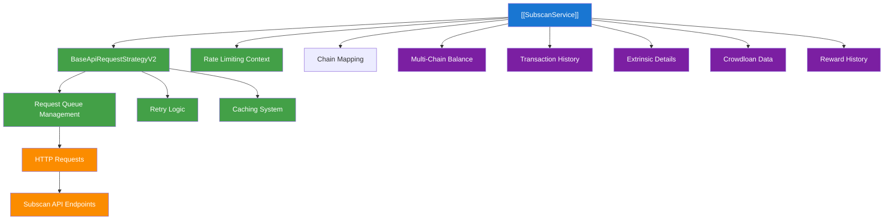
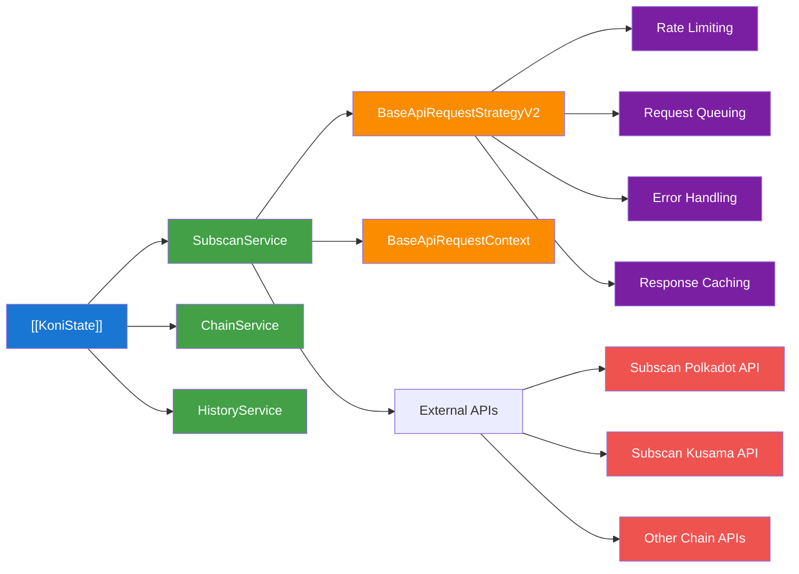
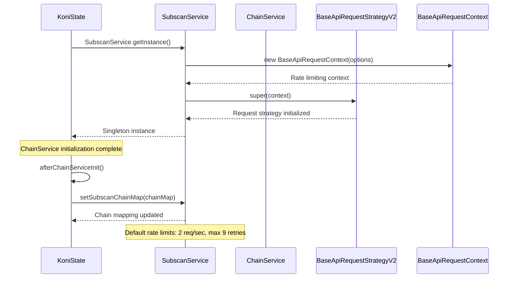
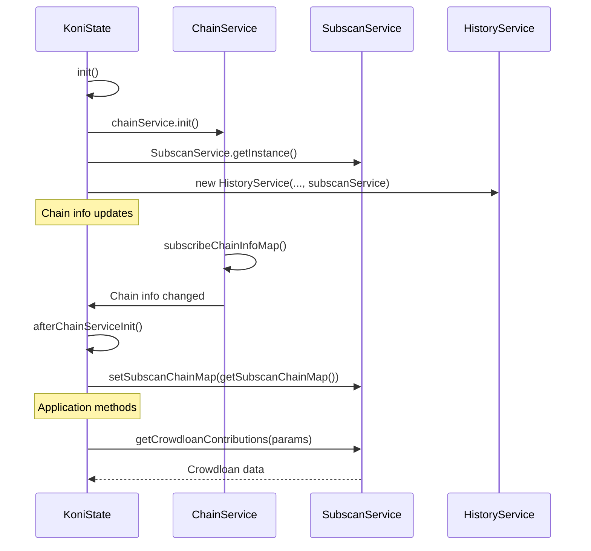
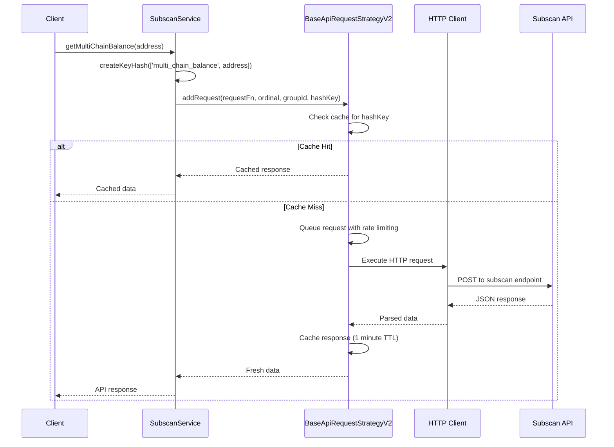
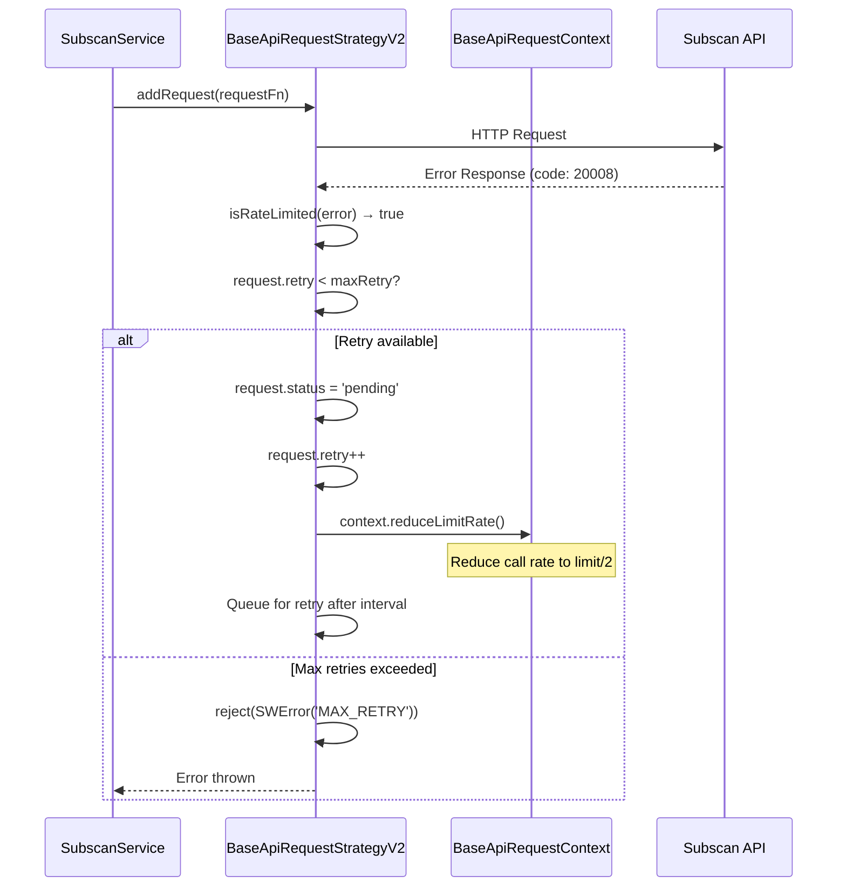

# Subscan Service Documentation

## Overview

The Subscan Service provides API integration with Subscan.io, a blockchain explorer for Substrate-based networks. It manages rate-limited requests to fetch blockchain data including account balances, transaction history, extrinsics, crowdloan contributions, and reward information across multiple Substrate chains.

## Architecture

### High-Level Architecture



### Service Dependencies



### Component Roles

#### SubscanService (Main Service)
- **Location**: [`./index.ts`](./index.ts)
- **Initialization**: Singleton instance at [`State.ts:123`](../../koni/background/handlers/State.ts#L123)
- **Purpose**: Central coordinator for all Subscan API interactions
- **Base Class**: Extends [`BaseApiRequestStrategyV2`](../../strategy/api-request-strategy-v2/index.ts)
- **Responsibilities**:
  - Rate-limited API request management
  - Chain mapping and URL resolution
  - Data fetching with automatic retry and caching
  - Singleton pattern implementation

#### BaseApiRequestStrategyV2 (Request Management)
- **Location**: [`../../strategy/api-request-strategy-v2/index.ts`](../../strategy/api-request-strategy-v2/index.ts)
- **Purpose**: Provides advanced request queuing and rate limiting
- **Features**:
  - Group-based request management with cancellation support at [`index.ts:76`](../../strategy/api-request-strategy-v2/index.ts#L76)
  - Response caching with TTL (1 minute default) at [`index.ts:123`](../../strategy/api-request-strategy-v2/index.ts#L123)
  - Retry logic with exponential backoff at [`index.ts:84`](../../strategy/api-request-strategy-v2/index.ts#L84)
  - Rate limit detection and adaptation

#### Chain Mapping Configuration
- **Location**: [`./subscan-chain-map.ts`](./subscan-chain-map.ts)
- **Purpose**: Maps internal chain identifiers to Subscan API endpoints
- **Integration**: Updated via `setSubscanChainMap()` at [`State.ts:393`](../../koni/background/handlers/State.ts#L393)
- **Components**:
  - `SUBSCAN_API_CHAIN_MAP`: Primary mapping for API requests
  - `SUBSCAN_BALANCE_CHAIN_MAP`: Specialized mapping for balance queries
  - `SUBSCAN_BALANCE_CHAIN_MAP_REVERSE`: Reverse mapping for lookups

## Props

### Core Configuration Properties

#### ApiRequestContextProps
- **Purpose**: Configuration for rate limiting and retry behavior
- **Type**: Interface from [`../../strategy/api-request-strategy/types.ts`](../../strategy/api-request-strategy/types.ts#L5)
- **Properties**:
  - `limitRate: number` - Maximum requests per interval (default: 2)
  - `intervalCheck: number` - Check interval in milliseconds (default: 1000)
  - `maxRetry: number` - Maximum retry attempts (default: 9)

#### SubscanService Constructor Parameters
- **Purpose**: Service initialization configuration
- **Parameters**:
  - `subscanChainMap: Record<string, string>` - Chain identifier mapping
  - `options?: Partial<ApiRequestContextProps>` - Optional rate limiting configuration

### Response Type Properties

#### SubscanResponse<T>
- **Purpose**: Standard wrapper for all Subscan API responses
- **Type**: Interface from [`./types.ts`](./types.ts#L19)
- **Properties**:
  - `code: number` - Response status code
  - `message: string` - Response message
  - `data: T` - Actual response data

#### IMultiChainBalance
- **Purpose**: Multi-chain balance information structure
- **Type**: Interface from [`./types.ts`](./types.ts#L25)
- **Properties**:
  - `network: string` - Network identifier
  - `symbol: string` - Token symbol
  - `decimal: number` - Token decimal places
  - `balance: string` - Available balance
  - `locked: string` - Locked balance amount
  - `reserved: string` - Reserved balance amount

#### ExtrinsicItem
- **Purpose**: Extrinsic transaction details
- **Type**: Interface from [`./types.ts`](./types.ts#L51)
- **Properties**:
  - `block_num: number` - Block number
  - `extrinsic_hash: string` - Transaction hash
  - `call_module_function: string` - Function called
  - `success: boolean` - Transaction success status
  - `fee: string` - Transaction fee amount

#### TransferItem
- **Purpose**: Transfer transaction information
- **Type**: Interface from [`./types.ts`](./types.ts#L138)
- **Properties**:
  - `from: string` - Sender address
  - `to: string` - Recipient address
  - `amount: string` - Transfer amount
  - `asset_symbol: string` - Asset symbol transferred
  - `block_timestamp: number` - Block timestamp

### State Integration Properties

#### KoniState Integration
- **Purpose**: Integration with main application state
- **Initialization**: Singleton instance at [`State.ts:123`](../../koni/background/handlers/State.ts#L123)
- **Chain Mapping Update**: Called at [`State.ts:393`](../../koni/background/handlers/State.ts#L393)
- **Service Access**: Available as `this.subscanService` throughout KoniState

## Methods

### Core Service Methods

#### `getMultiChainBalance(address: string): Promise<IMultiChainBalance[]>`
- **Purpose**: Fetches balance information across all supported chains
- **Input**: `address` - Account address to query
- **Output**: Array of balance information for each chain
- **Implementation**: Uses cached requests with key hashing at [`index.ts:86`](./index.ts#L86)
- **API Endpoint**: `https://polkadot.api.subscan.io/api/scan/multiChain/account`

#### `getCrowdloanContributions(relayChain: string, address: string, page?: number): Promise<CrowdloanContributionsResponse>`
- **Purpose**: Retrieves crowdloan contribution history for an account
- **State Integration**: Called via `getCrowdloanContributions()` at [`State.ts:1742`](../../koni/background/handlers/State.ts#L1742)
- **Input**: 
  - `relayChain` - Relay chain identifier (polkadot/kusama)
  - `address` - Account address
  - `page` - Page number for pagination (default: 0)
- **Output**: Crowdloan contributions with pagination info
- **Implementation**: Located at [`index.ts:100`](./index.ts#L100)

#### `getExtrinsicsList(groupId: number, chain: string, address: string, page?: number, blockRange?: RequestBlockRange): Promise<ExtrinsicsListResponse>`
- **Purpose**: Fetches extrinsic transaction list for an account
- **Input**: 
  - `groupId` - Request group identifier for cancellation
  - `chain` - Chain identifier
  - `address` - Account address
  - `page` - Page number (default: 0)
  - `blockRange` - Optional block range filter
- **Output**: Paginated list of extrinsics
- **Implementation**: Located at [`index.ts:122`](./index.ts#L122)

#### `fetchAllPossibleExtrinsicItems(groupId: number, chain: string, address: string, cbAfterEachRequest?, limit?): Promise<ExtrinsicItem[]>`
- **Purpose**: Fetches all available extrinsics with pagination handling and parameter enrichment
- **Input**: 
  - `groupId` - Request group identifier
  - `chain` - Chain identifier  
  - `address` - Account address
  - `cbAfterEachRequest` - Optional callback after each page
  - `limit` - Pagination limits (default: {page: 10, record: 1000})
- **Output**: Complete array of extrinsic items with parameters
- **Implementation**: Complex pagination logic at [`index.ts:150`](./index.ts#L150)
- **Features**: Automatic parameter enrichment via `getExtrinsicParams()`

#### `getTransfersList(groupId: number, chain: string, address: string, page?: number, direction?: 'sent' | 'received', blockRange?: RequestBlockRange): Promise<TransfersListResponse>`
- **Purpose**: Fetches transfer transaction history
- **Input**: 
  - `groupId` - Request group identifier
  - `chain` - Chain identifier
  - `address` - Account address
  - `page` - Page number (default: 0)
  - `direction` - Filter by sent/received (optional)
  - `blockRange` - Block range filter (optional)
- **Output**: Paginated transfer list
- **Implementation**: Located at [`index.ts:204`](./index.ts#L204)

### Advanced Data Fetching Methods

#### `fetchAllPossibleTransferItems(groupId: number, chain: string, address: string, direction?, cbAfterEachRequest?, limit?): Promise<Record<string, TransferItem[]>>`
- **Purpose**: Fetches all transfer items with automatic pagination
- **Input**: Same as `getTransfersList` plus callback and limit options
- **Output**: Record mapping transaction hashes to transfer arrays
- **Implementation**: Pagination logic at [`index.ts:231`](./index.ts#L231)
- **Features**: Groups transfers by transaction hash for related transactions

#### `getRewardHistoryList(groupId: number, chain: string, address: string, page?: number): Promise<RewardHistoryListResponse>`
- **Purpose**: Retrieves staking reward history
- **Input**: Standard pagination parameters
- **Output**: Paginated reward history
- **Implementation**: Located at [`index.ts:277`](./index.ts#L277)
- **Caching**: Uses hash key caching for performance

#### `getAccountRemarkEvents(groupId: number, chain: string, address: string): Promise<SubscanEventBaseItemData[]>`
- **Purpose**: Fetches remark events (used for ordinal NFT data)
- **Input**: Group ID, chain, and address
- **Output**: Array of event data
- **Implementation**: Located at [`index.ts:298`](./index.ts#L298)
- **Usage**: Primarily for ordinal NFT functionality

### State Integration Methods

#### Chain Mapping Synchronization
- **Purpose**: Keeps Subscan chain mapping synchronized with ChainService
- **Implementation**: Called via `afterChainServiceInit()` at [`State.ts:393`](../../koni/background/handlers/State.ts#L393)
- **Subscription**: Updates on `chainService.subscribeChainInfoMap()` at [`State.ts:400`](../../koni/background/handlers/State.ts#L400)

#### Service Integration within KoniState
- **Initialization**: Singleton pattern at [`State.ts:123`](../../koni/background/handlers/State.ts#L123)
- **HistoryService Integration**: Used by HistoryService at [`State.ts:124`](../../koni/background/handlers/State.ts#L124)
- **API Exposure**: Available for crowdloan contributions at [`State.ts:1742`](../../koni/background/handlers/State.ts#L1742)

### Utility Methods

#### `checkSupportedSubscanChain(chain: string): boolean`
- **Purpose**: Validates if a chain is supported by Subscan
- **Input**: Chain identifier
- **Output**: Boolean support status
- **Implementation**: Located at [`index.ts:76`](./index.ts#L76)

#### `setSubscanChainMap(subscanChainMap: Record<string, string>): void`
- **Purpose**: Updates the chain mapping configuration
- **Input**: New chain mapping object
- **Implementation**: Located at [`index.ts:80`](./index.ts#L80)
- **State Integration**: Called from `afterChainServiceInit()` at [`State.ts:393`](../../koni/background/handlers/State.ts#L393)

### Static Methods

#### `SubscanService.getInstance(): SubscanService`
- **Purpose**: Singleton pattern implementation
- **Output**: Shared SubscanService instance
- **Implementation**: Located at [`index.ts:333`](./index.ts#L333)
- **Default Configuration**: Uses `SUBSCAN_API_CHAIN_MAP` from [`./subscan-chain-map.ts`](./subscan-chain-map.ts)
- **State Usage**: Accessed at [`State.ts:123`](../../koni/background/handlers/State.ts#L123)

## Flows

### Service Initialization Flow



### State Integration Flow



### Request Processing Flow



### Error Handling and Retry Flow



## Notes

### Known Issues

1. **Rate Limiting Complexity**: Subscan APIs have strict rate limits that vary by endpoint and can cause temporary blocks. The service implements adaptive rate limiting but may still encounter limits during high usage.

2. **Chain Support Variations**: Not all chains support all API endpoints. Some methods like `getMultiChainBalance()` only work with specific chains listed in [`SUBSCAN_BALANCE_CHAIN_MAP`](./subscan-chain-map.ts#L35).

3. **Parameter Enrichment Overhead**: The `fetchAllPossibleExtrinsicItems()` method makes additional API calls to fetch parameters, significantly increasing request volume and time.

4. **Block Range Limitations**: Large block range queries may timeout or be rejected by Subscan APIs, requiring careful pagination strategy.

5. **Chain Mapping Synchronization**: Chain mapping updates depend on proper ChainService initialization and subscription at [`State.ts:400`](../../koni/background/handlers/State.ts#L400).

### Future Improvements

1. **Enhanced Caching Strategy**: Implement persistent caching across service restarts and more granular cache invalidation strategies.

2. **Smart Rate Limiting**: Develop per-endpoint rate limiting based on historical API response patterns and error codes.

3. **Parallel Request Optimization**: Implement intelligent request batching and parallel processing for related data fetches.

4. **Error Recovery**: Add circuit breaker patterns and failover mechanisms for improved reliability.

5. **State Integration**: Better integration with KoniState lifecycle management for service startup/shutdown.

### Configuration Best Practices

1. **Rate Limiting**: Adjust `limitRate` and `intervalCheck` based on application needs and API quotas
2. **Retry Strategy**: Configure `maxRetry` considering network conditions and user experience requirements  
3. **Chain Support**: Regularly update chain mappings in [`subscan-chain-map.ts`](./subscan-chain-map.ts) for new network support
4. **Request Grouping**: Use consistent `groupId` values for related requests to enable proper cancellation

### API Endpoint Coverage

The service supports these primary Subscan API categories:
- **Account APIs**: Balance, multi-chain balance, reward history
- **Transaction APIs**: Extrinsics, transfers, events
- **Staking APIs**: Reward history, slash events  
- **Crowdloan APIs**: Contribution history and status
- **System APIs**: Block and event data

### Testing

Unit tests are available at [`./index.spec.ts`](./index.spec.ts) demonstrating:
- Multi-chain balance fetching with multiple addresses at [`index.spec.ts:15`](./index.spec.ts#L15)
- Service initialization with different configurations
- Error handling scenarios

Run tests with:
```bash
npm test -- subscan-service
```

### Service Dependencies

The SubscanService integrates with these KoniState services:
- **ChainService**: For chain mapping and network configuration
- **HistoryService**: As a data source for transaction history
- **RequestService**: For crowdloan contribution queries
- **DatabaseService**: Indirectly through other services for data persistence
